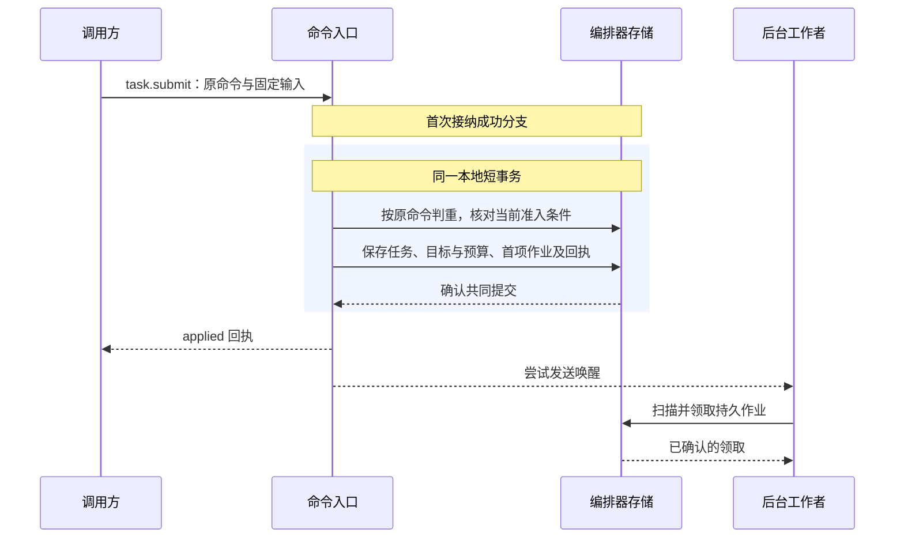
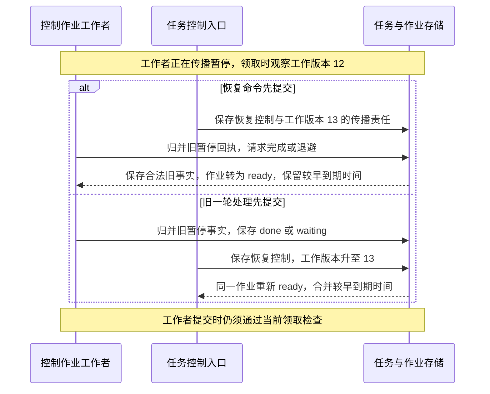

# 持久工作与恢复

报告保存的答复丢失后，新的工作进程先读取原 Task 下的操作意图、派发命令和后台责任，再查询 Executor 已经保存的接纳与目标效果。它接手同一项工作，不重新解释用户目标，也不另建一次写入。

本页沿中断点定位恢复入口。[公共可靠工作](../reliable-work.md)定义命令接纳、事务结论、JobStore、Claim 与条件完成；本页说明它们怎样连接任务、模型和实际执行。效果与发送的主定义分别属于 Brain、Executor，任务准入仍由 Orchestrator 裁决。

| 原记录 | 保存的责任 | 恢复时的读取 |
| --- | --- | --- |
| Command 与 Receipt | 原负责方对固定输入的一次裁决 | 查原 logical_service/command_id；保留原输入、期限和 expected_revision |
| OperationIntent 与 Operation | O 已准入什么，以及 E 已接纳、尝试和核实什么 | 从原 operation_id 查询效果和后续条件，不用另一个操作消除 unknown |
| Job | 原领域对象仍需处理的一类后台责任 | 按稳定责任键领取；一次处理结束不代表 Task 成功 |

## 原账本恢复与入口就绪

启动先确认原数据库及当前写资格、支持的数据格式与旧写者隔离，再恢复原身份、关闭记录、控制、未结责任及待交回回执。随后核验准确 InstallLock 和当前批准，装载组件并取得本次实例的就绪依据，先开放允许的控制和恢复入口，容量足够后才接纳新任务。

数据库平台负责主写域及旧主隔离，应用的 Job 租约不能替代数据库选主。写资格、格式或锁检查失败时保持诊断与获准只读入口；不能用新空库、聊天历史或仅内存登记代替原账本。旧活动版本指针只说明应装载哪个版本，不能证明当前实例已经就绪。

| 入口 | 开放前提 | 前提不足时的行为 |
| --- | --- | --- |
| 诊断与原记录查询 | 原库格式可读，身份、当前披露权限及查询范围可核验 | 返回具体依赖或权限缺口；不把原负责方不可达解释为对象不存在 |
| 持久控制与原责任恢复 | 原写资格和旧写者隔离成立，控制及关闭记录可用，恢复处理器、时钟和收尾容量就绪 | 原记录可读时仍可查询；无法持久提交就不报告取消已保存。效果核对本身也须当前获准 |
| 新任务及新效果、费用启动 | 所需恢复入口具备能力，准确安装和批准有效，依赖、容量及具体行动门禁满足 | 报告不可用原因，不先接纳再期待后台补齐资格 |

就绪是原事实与本次实例配置的派生判断，不新增任务状态或全局服务。前提变化立即关闭受影响的新入口，已发生的效果继续沿原身份核对。恢复就绪只要求未决责任可定位、可领取且处理链已建立，不要求全部 unknown 和账务已清零；某个失联对象不阻塞无关的获准查询。

扫描使用未结索引、有限页及可恢复游标，覆盖终态后的效果、费用、控制与清理责任。不能为通过健康检查把责任标为 done，也不能要求每次启动遍历全部历史。冷恢复之后能否继续目标工作，另按[当前继续条件](task-lifecycle.md#bounded-progress)裁决；重新打开 Session 或恢复 Claim 都不替代这一检查。

迁移先核验准确步骤与格式兼容范围，以固定 migration_id 保存开始、检查点和完成。可原子提交的结构变更在本地事务内完成；内容重写产生不可变新版本，逐批提交映射，交接前保留所需旧版本。步骤中断沿原检查点恢复，不能重做未证明安全的外部调用；步骤完成但答复丢失时返回原结果，不重新生成一份数据。

### 本地和设备恢复分别确认

数据库写资格、SQLite 生命周期锁和 PostgreSQL 主写隔离由[存储适配](../storage-and-middleware.md)及[生产部署](../deployment-production.md)落实；迁移是取得管理互斥后执行的独立动作，不由每个业务副本启动时自动进行。数据库提交耐久、模型已发送和设备动作已经退出是不同证据。

设备恢复从原固定宿主入口开始：持有稳定设备的 OS 锁，封闭或确认旧本地发送者退出，恢复 TaskGate、资源代次、Attempt 和关闭索引，再沿原操作核对。旧动作没有迟到生效可能后，才允许新占用和新观察。OS 锁或云端 Job 到期都不证明目标队列已清空；完整次序及跨宿主限制见[Executor 设备入口恢复](../execution/implementation.md#entrance-recovery)。

## 命令接纳与提交结果

编排器按认证得到的租户、固定逻辑服务与 `command_id` 定位原命令，并保存完整请求的规范化摘要。同键同输入读取原决定；同键异输入返回 `idempotency_conflict`，不覆盖原记录。回执披露仍检查当前权限，恢复也不能把原命令改投另一编排器。

首次接纳 `task.submit` 时，命令入口先在事务外取得所需的策略与内容依据，再进入短事务。事务内核对当前准入条件，并共同保存 Task、目标与预算、首项作业以及 `applied` 回执。这里的 `applied` 表示任务已经建立，后续推进由持久作业承担。

事务不跨模型调用或外部执行。提交后的通知用于缩短等待，后台仍按到期时间独立扫描作业；通知丢失或入口进程退出，不消除已保存的责任。存储无法共同提交这些记录时，不接纳新的任务责任。

提交结论及重跑边界统一使用[事务合同](../reliable-work.md#transactions)：只有已确认提交才能报告接纳；明确回滚可按错误合同有界重跑纯本地逻辑；CommitUnknown 先查原命令和业务记录。数据库重试不替换原 expected_revision，固定拒绝不因后来条件恢复而变成接受。[任务接纳算法](implementation.md#task-admission)给出本域的判重、容量、预算与首 Job 提交次序。

## 外部发送恢复必须读取领域阶段

公共框架的[发送前屏障](../reliable-work.md#durable-before-send)要求耐久提交已确认及当前资格仍有效。领域另定义“已经可能发送”的具体时点，工作领取成功或未收到答复不能替代这个判断。

| 原阶段 | 正常推进与中断处理 |
| --- | --- |
| Brain 已接纳、尚未准备调用 | 按原 Decision 固定配置及至多一个 ModelCall，保存准备责任；不得在构造适配器时隐式调用模型 |
| ModelCall 已准备、尚无 `send_started` | 读取原固定输入，完成最终编码和当前用途检查；发送门禁另行提交，确认后才允许原首次发送 |
| Brain 已有 `send_started` | 原 Decision 最多发送一次固定物理请求；结果未知时查询原供应方调用，不透明重发。无法查询则保留 `provider_result_unknown` 与费用责任 |
| Executor 已接纳、尚未准备 Attempt | 保存原尝试、目标关联、许可及核对责任，确认准备提交后才进入实际资源入口 |
| Executor 准备后中断 | 无法证明未交接时按可能发送处理，沿原 Operation／Attempt 查目标证据；能否安全重试由准确能力的重复、效果和费用合同裁决，不能套用 Brain 的阶段推断 |
| 输出或外部结果已经取得 | 固定原发布身份，需发布的字节先耐久再引用；正文保存失败与已发生效果分别记录。保存答复丢失查询原发布，不重新推理或执行来重造结果 |

Brain 的准备与 send_started 是不同提交点；Executor 准备后若无法证明未交接，已经必须按可能发送恢复。这一差异不能被一个通用 retry 状态掩盖。具体实现见[原模型调用](../brain/implementation.md#key-sequence)、[原执行尝试](../execution/implementation.md#key-sequence)和[正文发布恢复](../brain/implementation.md#generated-content)。同一阶段可共同提交事实、费用和 Job，真实有先后依赖的准备、发送、结果仍分别成立。

### 驱动恢复保留最后准入的语义

Orchestrator 在[行动准入](task-lifecycle.md#action-admission)前完成业务参数变换，Executor 只按原 Capability/Binding 编码并发送。实际地址、重定向、凭据作用域以及分页、下载和轮询的物理次数，都沿同一 Operation/Attempt 核验；签名可在原范围刷新，业务目标不能换成当前同名配置。编码错误、准备后中断和真实入口后才发现不符有不同恢复分支，主定义见[驱动编码与真实出口](../execution/implementation.md#dispatch-encoding)。

### 原结果恢复与界面显示分别成立

Executor 保留原结果的资源/筛选范围、分页、时间、缓存、字段、媒体及转换限制，再按声明效果谓词归并。写效果已有可信凭据但大正文保存失败时，已发生的效果和正文缺口分别保存；完整读取缺必要页时，也不能用一个成功字符串补足覆盖。[返回范围](../execution/implementation.md#output-coverage)和[原结果归并](../execution/implementation.md#result-provenance)是这两项判断的主定义。

流片段和合成 interrupted 只参与呈现，重连应读取原 Operation 的最终持久版本。片段显示、连接关闭或处理函数返回都不能结束效果或计费责任；正式变化提示在原事实可查后发送。

## 作业领取接替和新的领域责任

本域按 `(tenant, task_id, kind, object_id)` 定位工作。原 decide、dispatch、poll、verify、control、settle、extract 的输入和结束条件见[工作映射](implementation.md#job-completion)；它们共同采用[Claim](../reliable-work.md#claim)及[Finish](../reliable-work.md#completion)，不另实现一套领取算法。

Task/祖先/预算及领域门禁先锁，Job 最后锁并 Guard。旧 lease_epoch 无权提交任务变更；即使领取仍有效，新的 work_revision 也会阻止旧 done/backoff 清掉新责任。可信迟到目标事实可以经独立归并入口核验后保存，但不恢复旧工作者的修改权，不改变原操作或重置期限。

以下以同一执行端的控制作业为例。工作者正在传播暂停，随后用户恢复任务；图中的 12、13 均表示作业的 `work_revision`。

因此，控制的新修订无论先于还是晚于旧处理完成，都有持久后续责任。原 Task 已终态时，重开的是控制、效果或结算工作；目标推进不会随 Job 重新 ready 而恢复。Claim 提交未知、续约未知及版本异常的精确裁决继续使用公共合同。

## 存储保留与故障验收

正常新增责任与来源事实共同提交。另设领域核对扫描，以未结索引和持久游标发现程序缺陷或迁移留下的漏项，按原作业键修复；正常及时恢复不能依赖扫描全部历史补漏。事实更新、扫描恢复和可靠通知分别承担责任，通知只用于加速唤醒。

Job 仅在领域证明责任已履行或已经持久交接后结束。最后一项未知效果、费用或清理责任不能因 Task 终态而消失；符合保留条件的已结工作可移出热索引。原命令、取消、去重及终态的最小身份长期保留，只有其他记录足以继续拒绝原身份时才可合并。正文按许可和保留策略清理，与这些最小记录分开处理。

| 注入断点或竞争 | 应验证的结果 |
| --- | --- |
| 业务提交前后退出，通知或答复丢失 | 业务决定、回执与责任共同存在或共同不存在；查询原命令可恢复，通知丢失不漏工作 |
| 接纳、Claim 或续约提交结果未知 | 未确认资格前不跨外部入口；续约未知仍使用上次确认期限，原观察工作版本不被刷新 |
| 模型准备后、发送门禁后分别退出 | 前者只允许原身份的合法首次发送，后者保留可能发送与费用责任；不会都被当作普通重试 |
| 文件已写入但执行答复丢失 | 查询原 Operation 和目标证据；无证据时保留 unknown，不创建另一写操作 |
| hook、驱动编码或重定向改变实际目标 | 准入绑定最后业务意图；实际出口拒绝越界变化，已发生或未知效果仍保留 |
| 分页截断、旧缓存、缺媒体或正文保存失败 | 记录实际覆盖和限制；已证实写效果不倒退，合成占位不替代原证据 |
| 本人接管、设备宿主退出或旧动作可能迟到 | 封闭旧代次的新写，保留在途隔离；重新观察、Job 到期或换宿主均不自动释放 |
| 原领取过期且接替者已取得新代次 | 旧工作者的受保护写入整笔回滚；可信迟到事实仍可从独立入口归并 |
| 用户恢复或新事实与旧 Finish 竞争 | 新 `work_revision` 和较早 `due_at` 不被旧完成／退避覆盖，两种提交顺序均保留新责任 |
| Task 取消或成功后账单晚到 | 原身份继续结算，保留或调整正确预留；终态和固定 Result 不被改写 |
| 宿主缺批准、处理器、原写资格或容量 | 按各入口条件开放查询或恢复，准确报告缺口；不能用空库或跳过门禁开放新执行 |

以上为实现验收要求。仅静态检查能证明文档链接与结构，不证明数据库耐久性、实际故障恢复或性能目标已经通过。
