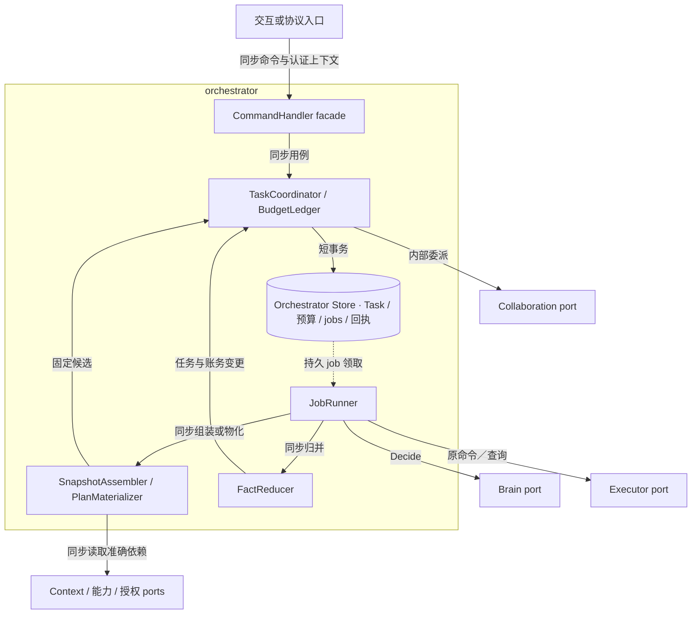
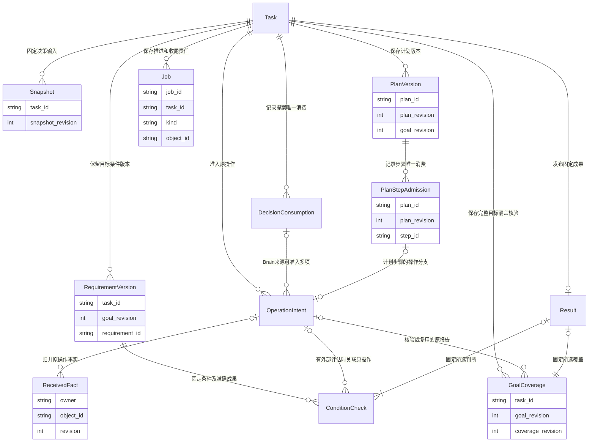
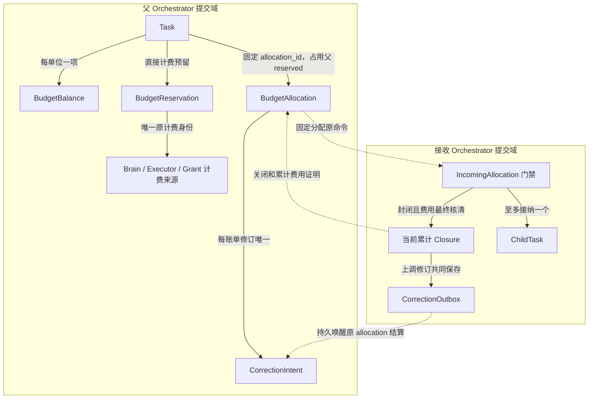
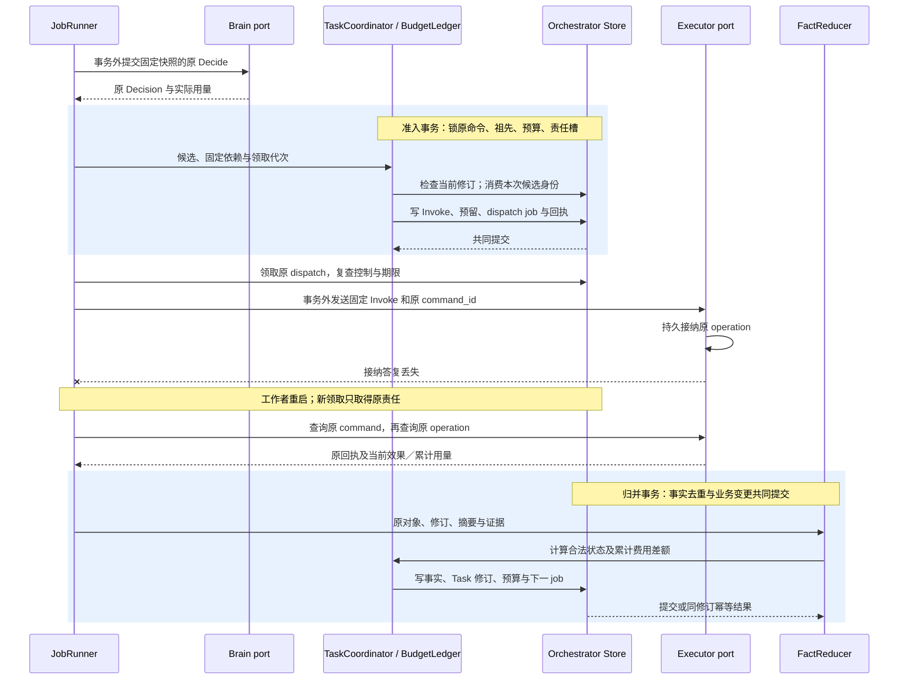

# Orchestrator 实现：提交、推进与保留

[模块主线](README.md) · [大脑实现](../brain/implementation.md) · [执行实现](../execution/implementation.md) · [协作实现](../collaboration/implementation.md)

本页给出参考实现的内部组织和算法。Task、Result、控制和预算的对外含义仍以[模块主线](README.md#records)为准；精确消息字段由[共同 Schema](../contracts/schemas/protocol.schema.json)定义。实现可以改变表名、调度器和存储布局，但必须保留相同提交点、原身份和恢复结果。

生产由独立应用与工作进程共享原 Orchestrator 的 PostgreSQL 权威与持久 jobs；跨提交域沿原命令交接，开发单体复用相同规则。没有可写权威存储、准确能力、可核对授权或有限费用边界时，不接纳依赖该前提的新行动。已经接纳的任务可以等待，原操作与收尾责任继续保存。本文的表和伪代码是实现规格，尚非运行代码或持久性验证结果。

<a id="module-shape"></a>
## 1. 模块形状与内部依赖

Orchestrator 是宿主装配的一个软件模块，对外 facade 是 CommandHandler；其后是处理任务用例的 TaskCoordinator 与 JobRunner、执行领域规则的 BudgetLedger／PlanMaterializer／FactReducer，以及存储和外部 port。名称表示参考实现的代码职责，当前没有相应运行代码；这些职责保持同一 Orchestrator 提交域，业务入口与 JobRunner 在生产分别装入应用池和工作池；其他内部组件按用例组合，不各建服务。依赖由宿主注入，领域规则不反向依赖 WSS／gRPC、数据库驱动或具体模型 SDK。



图建模固定 Orchestrator 内的代码调用依赖；实线是同步调用或事务读写，虚线是已持久 job 驱动后续工作，不代表新增消息中间件。返回值沿原调用返回。内部委派共享宿主事务句柄，Brain、远端 Executor 和其他远端 port 的调用均在事务外。异步答复先成为原对象事实，再由 FactReducer 归并；回调不能直接修改 Task。

| 内部职责 | 输入及产出 | 不拥有的裁决权 |
| --- | --- | --- |
| CommandHandler | 认证主体、固定命令；原 Receipt 或明确拒绝 | 不从连接或 RPC 超时推断业务失败 |
| TaskCoordinator | 当前任务、提案及精确依赖；状态变化与 jobs | 不自行声明外部效果 |
| SnapshotAssembler | 获准目标、证据、能力和上下文；固定快照引用 | 不静默取得新的资料用途 |
| PlanMaterializer | 固定计划、已核实前项输出；完整行动候选或缺口 | 不执行表达式，不把计划当权限 |
| FactReducer | 原 operation／decision／委派事实；新任务修订 | 不把较晚到达当较新事实 |
| BudgetLedger | 精确单位、预留、累计用量和封账证明；余额 | 不按超时释放未知费用 |
| JobRunner | 原 job、领取代次和固定工作输入；处理结果 | job 完成不等于 Task 成功 |

内部 port 返回结构化业务事实及错误。进程内接口可以直接传对象；远端代理增加原 Command／Receipt 和查询义务，不改变以上职责。

存储侧由 Orchestrator Store 接入[可靠接纳与持久工作框架](../reliable-work.md#interfaces)的 transaction、command_store 和逻辑 JobStore；TaskCoordinator 通过领域参与者提交任务与责任，BudgetLedger 只写预算所属记录。远端 port 的代理负责协议编码、认证和原回执恢复，不替协调器作准入。将计划推进另拆为服务会复制任务修订、预算及控制判定，因此计划物化继续由既有 JobRunner 调用，只产出候选。

<a id="reliable-work-integration"></a>
### 1.1 公共模板在任务域的接入

CommandHandler 使用公共接纳模板，JobRunner 将下文各 kind 的处理器注册到有界工作模板；二者仍装入原 Orchestrator 的应用池和工作池。公共模板统一命令去重、事务结果、领取及槽回写，TaskCoordinator 保留目标、行动准入、控制和完成裁决。与各模块自行复制版本算法相比，公共模板减少并发恢复分支的重复实现；代价是 Orchestrator Store 必须提供遵守本域锁序的事务参与者，不能把现有任意存储回调直接装入模板。

| 接入点 | 领域参与者和共同提交内容 | 框架调用及边界 |
| --- | --- | --- |
| 任务接纳与控制 | TaskCoordinator、BudgetLedger，以及本次确需共同裁决的同域参与者；Task、预算／控制事实、原回执与下一责任 | `transaction.Within` 传递受限 Tx；`command_store` 查询／占用原键，领域裁决后共同写回执及 `job_store.Raise`。固定拒绝或无需后续处理的同步裁决不空建 job |
| 固定输入及行动准入 | SnapshotAssembler 先在事务外取得准确依赖；TaskCoordinator 在事务中固定 Snapshot／Decision 或消费候选、保存 Intent 与预留 | 领取后可经过多个短事务；每次领取保护的提交均使用原 Claim。已经固定的 Decide／Invoke 及原命令不能由重领时的 Task 当前值重新拼装 |
| 外部处理 | JobRunner 调用 Brain、Executor、Collaboration 和内容 port；PlanMaterializer 只产出候选 | 网络、模型和驱动调用均在事务外。提交结果未知先查原命令、候选消费或领域记录；框架不会重新运行外部步骤 |
| 事实及完成提交 | FactReducer、TaskCoordinator、BudgetLedger 归并原事实、费用差额和条件，保存下一责任 | 按第 2.4 节先锁领域行，最后以 `Guard(tx, claim)` 核验领取；领域写入与 `Raise`／`Finish(tx, claim, domainDisposition)` 共同提交。框架只决定槽能否完成，不裁决 Task 成功 |

原槽键保持 `(tenant, task_id, kind, object_id)`，所在逻辑服务和数据库分区固定为原 Orchestrator；具体 object_id 及关闭条件见[本域工作种类](#job-completion)。JobStore 可映射到现有 jobs 表，不要求与 Brain 或 Executor 共表。领取输入保存 `job_id、lease_epoch、observed_work_revision`，它们不能替代 Task、目标、控制及来源事实修订。

领域处理器只有在本项责任已履行或已持久交给下一槽时才请求完成。例如 dispatch 保存已接纳事实并建立 poll 后可以结束，而原操作未知、费用未结仍分别由对应槽承担；verify 核对当前检查；尚有缺口时保存具体等待，不能仅因本次查询返回就关闭责任。原命令／原操作不可达、缺少准入依据或查询额度耗尽时，处理器保存具体等待对象、期限及恢复条件，不把未知转换为新行动。终态 Task 可以重开 settle，不得重开目标推进。

已失去领取的 JobRunner 不能借事实归并回调继续准入或完成任务；可信迟到事实由独立的 FactReducer 接收事务按原 owner、对象及修订去重，并保存新责任。两条路径及 `Guard`、`Finish` 的锁定要求统一见[事务参与](../reliable-work.md#transactions)与[工作提交](../reliable-work.md#completion)。

## 2. 持久表与索引

所有主键和关联键均带 `tenant_id`。下表只列为实现原子性和恢复所需的附加组织；Task 等业务字段沿原 Schema 保存。引用大正文时只保存不可变 ContentRef，不把用户内容复制进调度索引。

| 表 | 主键与必要字段 | 唯一约束／索引 |
| --- | --- | --- |
| tasks | tenant、task_id、Orchestrator、父任务、业务 Task、created_at | 主键；`(tenant, orchestrator, created_at, task_id)` 列表索引 |
| task_requirements | task_id、goal_revision、requirement_id、规则及来源 | 同目标修订内 requirement 唯一 |
| task_goal_coverage | task_id、goal_revision、coverage_revision、完整目标及条件摘要、rule_ref／evaluator_ref、准确核验报告、当前适用性／缺口、原评估 operation? | 同目标下覆盖修订唯一，同一目标／完整输入／规则至多一个未结束核验；按实现／规则反查影响；原报告不可改写，当前选择与 Task 修订及 verify 责任共同提交；不是公共 Task 新字段 |
| condition_checks | check_id、task_id、goal_revision、requirement_id、准确 artifact／rule／evaluator 引用、原 operation_id?、原判断与证据、当前选择标记、适用性及原因 | check_id 唯一；同 task／goal／condition／准确成果至多一份当前选定的汇总记录，组成依据另关联，原判断不覆盖；详见[核验持久化](#condition-storage) |
| task_results | task_id、goal_revision、固定 Result、所选 coverage_revision／check_id 集合及完成时门禁修订 | 每任务最多一个成功结果；原 Result 不因后续缺陷或账单修改 |
| evaluator_evidence_gates / evidence_defects | 准确 evaluator_ref 的固定门禁行及单调修订；缺陷 ID、准确规则与影响范围、依据、受信登记身份 | 登记缺陷和核验完成锁同一实现门禁；缺陷原事实与分页影响责任共同提交，不等待任务投影追上 |
| result_evidence_notices | task_id、依据类型（condition／coverage）、原 check_id 或 goal_revision／coverage_revision、defect_id、说明引用 | 关联唯一；在固定 Result 之外保存已成功任务的证据失效说明，不生成新成功结果 |
| task_snapshots | task_id、snapshot_revision、精确依赖摘要、content_ref | 同任务快照修订唯一，不原地更新 |
| task_plans | task_id、plan_id、plan_revision、goal_revision、正文引用 | 计划版本唯一；当前可用指针由 tasks 保存 |
| decision_consumptions | task_id、decision_id、输入修订、采纳／失效原因 | decision 只消费一次 |
| plan_step_admissions | task_id、plan_id、plan_revision、step_id、固定候选摘要、operation／delegation 关联 | 同计划版本每步骤只准入一次，不复用 decision 消费键 |
| operation_intents | operation_id、task_id、不可变 Invoke、原 command_id | operation 唯一；原命令及摘要唯一关联 |
| received_facts | owner、object_id、revision、摘要、事实引用 | 同来源对象修订唯一；同修订异内容拒绝 |
| task_executor_bindings | task_id、executor_id、最近目标／控制修订 | 同任务执行端唯一；控制传播不能漏端 |
| jobs | [公共工作记录](../reliable-work.md#work-record)：job_id、责任键、kind、状态、due_at、work_revision、lease_epoch、lease_until、尝试与等待依据；本域关联 task_id、object_id | 原 Orchestrator 内责任槽唯一；映射逻辑 JobStore，可领取状态有索引 |
| budget_balances | task_id、unit、limit、spent、reserved | 每任务每计价单位唯一 |
| budget_reservations | reservation_id、task_id、unit、上限、累计已结金额、是否最终、唯一计费来源绑定及最近来源费用修订 | 每操作每计价项唯一；Brain／Executor／Grant 对同一物理收费不得各扣一次 |
| budget_allocations | allocation_id、父任务、接收方、单位上限、期限、状态、关闭证明 | allocation 唯一；不可换接收方或单位 |
| budget_correction_intents | allocation_id、receiver_usage_revision、原闭合证明摘要、有限 budget.settle 命令尝试／回执、当前父 allocation expected_revision、状态 | 父方在调用 budget.settle 前保存；同接收方修订唯一，丢答复沿原命令查询 |
| receiver_correction_outbox | allocation_id、usage_revision、原计费项、完整累计 Closure 摘要、有限唤醒命令尝试及回执、交付状态 | 接收方 closed 证明上调事务共同保存；收到父方 durable billing_reconcile 回执才完成交付 |
| budget_incidents | 原计费项／allocation、提供方与能力绑定、声明上界、可信实际账单、超额差额、原因与处置状态 | 同原计费项唯一；分别记录 provider_bound_breach 与 receiver_allocation_breach 的证据及待查标记，两者可同时成立；另记封账后更正造成的预算超额 |
| task_policy_acceptances / task_estimate_consents | 租户、认证用户、准确 policy_ref、费用单位、适用范围、预算上限、期限；Task 关联原 acceptance_id | 受信 TaskPolicyRegistry 先登记接受事实；估算 Task 接纳时固定关联，不由模型或请求正文伪造 |
| command_receipts | logical_service、command_id、请求摘要、固定 Receipt | 原命令唯一；接纳与业务提交共事务 |
| closed_identities | 身份类型、ID、原服务、摘要、关闭依据、最小修订 | 长期禁止复用索引；无 TTL 删除 |

任务、操作和账务的写入通过一个存储适配层完成。SQLite 和云数据库使用不同领取语句，但适配层提供相同的条件更新结果；任何数据库重试都只重复事务内逻辑，不能重复一次外部调用。

Task 的 `open_effects` 与委派当前责任来自本任务全部已准入意图、当前原效果及委派记录的权威关联。参考实现可用同库当前投影及未结部分索引承载；新增意图／委派时即建立未结项，核清和封闭时才在归并事务中移出，并递增关联 Task 修订。内部子任务终结同时更新父任务的未结关联。它们不是可丢通知驱动的缓存，也不能从截断的公开数组反推全集。具体物理布局与 DDL 随[访问路径](access-paths.md)验证；投影尚未重建完整时，完成检查保持待核验。

`jobs` 的责任键映射见[框架接入](#reliable-work-integration)。原 dispatch 槽绑定不可变 Invoke 和原 command_id，责任更新不能将它改作另一操作；任务的轮数、期限、预算与命令尝试也不因责任版本变化重置。共同字段、重开及保留规则集中在[公共工作记录](../reliable-work.md#work-record)，本域删除槽前还须满足第 9 节的任务和引用保留条件。

<a id="data-flow"></a>
### 2.1 核心对象关系与流转

Task 是本 Orchestrator 的状态聚合根；Snapshot、PlanVersion 与 RequirementVersion 固定对应修订，OperationIntent 是已准入的固定意图，ReceivedFact 是外部负责方的版本化事实。ConditionCheck 承载内部核验过程，公开 ConditionResult 是其判断值，不新增公共实体身份。下图表达领域持久关联，不声明全部物理外键，也不表示调度顺序；所有键隐含 tenant_id。



行动有三类互斥来源：Brain 的 DecisionConsumption、计划的 PlanStepAdmission，以及受信固定核验的原检查身份。核验来源复用 condition_checks.check_id 或 task_goal_coverage 的 task／goal_revision／coverage_revision，不另建准入账本；一次准入只消费其中一种身份，并同事务关联原 operation，Brain／计划的委派分支另关联 delegation。图中的操作与检查关联还允许复用报告，只有首次准入关联承担发送去重，复用不创建新操作。委派分支的对象见[协作关系](../collaboration/implementation.md#data-flow)。一个 Job 可引用多项固定依赖，业务责任槽仍只属于一个原对象。

| 阶段 | 对象由谁创建、保存与传递 | 消费、归并与释放条件 |
| --- | --- | --- |
| 接纳 | CommandHandler 将原目标交 TaskCoordinator；Task、预算和首 Job 共同持久化 | 原 Receipt 发布 Task 引用；JobRunner 消费工作领取，不消费掉业务对象 |
| 固定输入 | SnapshotAssembler 取得当前获准依赖，保存 Snapshot 与准确正文引用；JobRunner 交 Brain | Decision 绑定该快照；旧提案不能覆盖新任务修订，实际用量仍归原调用 |
| 准入行动 | TaskCoordinator 消费 Decision、PlanStepAdmission 或受信核验检查三者之一的原身份，保存 OperationIntent、预留和 dispatch Job | Executor 接收不可变 Invoke；派发重试只传同一原命令，不从 Task 当前值重新拼输入 |
| 归并结果 | JobRunner 取得原事实，FactReducer 按来源修订写 ReceivedFact | 同事务应用累计费用差额、条件证据、Task 修订及下一 Job；重复事实不重复扣费或唤醒 |
| 完成及清理 | TaskCoordinator 固定 Result、终态与控制／结算责任；清理器检查所有保留引用 | 正文和历史可按用途清理；未决原事实继续保留，最小关闭索引长期阻止身份复用 |

这条流转使模型输入、执行输入和最终成果各有固定版本。Result 不保存另一个可独立修改的任务副本；完成时引用准确成果和证据，之后新增费用或效果事实不能把终态改回 active。

<a id="accounting-relations"></a>
### 2.2 账务关联与双方持久边界

图只表达账务记录及原身份关联。父方与接收方可以位于不同库；虚线是持久命令／证明交接，不是跨库事务。每笔 Reservation 固定唯一实际计费来源，Brain 调用等预留不必关联 OperationIntent；父聚合展示的子费用不再作为另一笔支出扣除。



父 Allocation 的 `allocated/settled` 与接收门禁的 `open/closing/closed` 是不同状态；关闭先到时可以没有 ChildTask。父方只有取得可核验 Closure 才结算并释放剩余；接收方已 closed 仍可收到可信上调账单，沿相同 allocation 追加累计修订和交回责任，不重新开放消费。`budget.close` 只关闭费用门禁，停止目标行动仍由任务控制落实。唯一约束见本节表，完整算法归[额度交接](#81-额度交接)。

<a id="condition-storage"></a>
### 2.3 条件记录、当前适用性与核验责任

[目标覆盖记录](verification.md#goal-coverage)与条件判断共用本节的持久责任。TaskPolicy 固定覆盖核验规则、准确声明、唯一选择顺序及有限修订／尝试额度。核验开始前锁定 Task，分配本目标下唯一 coverage_revision，保存完整目标／条件摘要、规则／实现、待核验原因及 verify 责任；需要外部评估时同事务关联原 OperationIntent、预留及 dispatch。相同原输入与核验身份的恢复读取已有记录，不再次分配或调用。JobRunner 在事务外取得原报告，事务内核对绑定后固定报告、当前适用性／选择、Task 修订和 verify 责任；复用报告也须新建当前输入绑定并记录复用依据。原有效 fail 不靠更换实现或重跑取优消除，遵守条件检查相同的有限修订规则。目标修订同事务使旧覆盖选择失效，迟到报告只存为原目标证据。

覆盖报告指出可补全遗漏时，归并缺口、Task 修订、verify 与 decide 责任共同提交；SnapshotAssembler 将准确覆盖报告作为获准 materials，把待解决项写入 gaps，Brain 在新快照中补条件或提出澄清。暂停保留责任而不派发新 Decision，取消／终态只归并历史与收尾；缺合法材料或预算时保存对应等待。新提案真正改变条件仍先提交新目标修订，不在原覆盖报告下直接行动。

完成事务持有 Task 锁后读取当前覆盖选择，按既有锁序核对其依赖实现的 evidence gate、准确输入与适用性，再处理 ConditionResult；缺陷登记也覆盖覆盖核验所用报告。覆盖变更递增 Task 修订，旧快照的完成处理不得提交。缺少覆盖记录、待核验或存在遗漏时保留 verify 和具体依赖；暂停不能新启评估，终态不重开。缺陷影响扫描按准确实现／规则同时枚举 condition_checks 与 task_goal_coverage，各自保留分页游标；活动覆盖失效唤醒原 verify，终态以 result_evidence_notices 关联说明。详细映射由宿主内部只读投影提供给 UI，跨端沿既有 Surface 的受控内容呈现；不向公共 Task／Result 增加未登记字段。

`condition_checks` 解决检查尚未出结果时的恢复，以及旧判断仍存在但已不适用的区分；它复用 Orchestrator Store、普通操作和 jobs，不另设验证服务。每个 check_id 固定任务、目标修订、条件、准确成果、rule_ref、evaluator_ref 与所用策略／安装锁。rule_ref 必须等于该 `(task_id, goal_revision, requirement_id)` 的不可变 Requirement；公共 ConditionResult 沿这条关系取得规则，不重复增加线字段。内部 check_id 不暴露为公共 ConditionResult 身份。

检查尚未完成时保存待检查原因、依赖及原操作关联；完成后追加不可变 ConditionResult 和证据引用。组合检查另保存不可变的 dependency_check_ids，依赖必须有界且无环；当前核验集合包括全部组成检查，门禁覆盖其准确实现，缺陷影响同时覆盖引用它们的汇总记录。当前选定记录及 `applicability=usable/unknown/inapplicable` 分开保存：unknown 表示缺少适用依据或缺陷影响尚待核清，inapplicable 表示已证实不适用；二者均不能作为 pass 依据。原 verdict 不因停用、修订或新记录而覆写。成果或规则变化创建新检查，不能改写原检查输入；新目标复用旧材料也须创建新目标的核验记录并保存适用性理由。

| 触发 | 同事务保存的事实与责任 | 后续执行者 |
| --- | --- | --- |
| 条件／候选固定，或允许复用的旧证据待审 | check、当前条件候选关联、任务修订与任务级 verify 槽 | JobRunner 按固定输入核对适用性；需要新评估时走普通准入 |
| 评估行动准入 | check 到 operation 的固定关联、意图、预留、原命令及 dispatch 槽 | Executor 执行；Orchestrator 沿原 operation 持久 poll |
| 原评估、效果或用户验收事实归并 | ReceivedFact／验收记录、对应条件判断、费用变化及 verify 槽责任版本 | verify 工作者归并当前条件并尝试完成；未知不产生 pass |
| 缺陷登记及影响处理 | 登记事务保存门禁修订、缺陷原事实及登记端分页影响责任；后续按任务保存适用性变化与 verify 槽，或终态说明 | 登记端持续枚举影响；完成检查直接读原缺陷，不依赖枚举进度 |
| 最终汇总 | 精确所选 checks、门禁修订、task_results、Task 终态及控制／收尾责任 | 后续查询读取固定 Result；效果、费用与缺陷说明独立继续 |

verify 槽键为 `(tenant, task_id, verify, task_id)`，合并同任务新增核验责任；每次有限处理当前条件与候选，不扫描全部历史。需要新质量评估或补证行动时，先检查当前控制、授权、预算和有限尝试规则，再提交普通 Operation；verify 本身不能绕过暂停启动模型。无新行动且既有证据充分时可在暂停中完成。崩溃、答复丢失和新增责任均按[领取及责任版本规则](#job-completion)恢复；不通过创建新 check_id 重置任务累计尝试、期限或费用上限。

受信维护者通过宿主内部登记入口提供准确缺陷身份、规则／实现／适用范围和证据；管理命令及原回执与缺陷共同保存。每个 evaluator_ref 在启用前建立固定 evidence gate。缺陷登记独占写锁该 gate、递增修订、追加不可变缺陷并保存分页影响责任，不在登记事务锁整批 Task。核验事务先按下节顺序锁 Task，再按稳定实现键对 gates 取共享读锁，读取全部命中范围的缺陷及当前选定 checks；不同任务的读锁兼容，只有缺陷登记与完成需要在该门禁上互斥。因此缺陷先提交则阻止旧证据完成，完成先提交则结果保持终态并补充说明。影响处理分页同样按 Task→gate→条件→job 加锁，更新并保存游标后才确认该批完成。

本地 gate 只对本提交域已经受信登记的缺陷给出上述串行保证。它不证明远端没有尚未送达的缺陷；远端判断治理尚无冻结的当前证据资格查询／交接合同，不能用 `evaluation.approval_check` 的启动回执冒充证据适用性证明。普通评估明示这一已知缺陷范围限制；要求更强当前资格的用途在依赖落实前拒绝启用。缺陷说明由查询侧通过受信记录关联原 Result，缺陷投影尚未追上时直接核对 gate 及原事实；公共 `task.result` 仍返回原 Result，附加说明通过默认宿主获准诊断视图展示，尚不宣称第三方线协议已支持该说明。

<a id="21-锁定顺序"></a>
### 2.4 锁定顺序

所有任务变更先锁原命令键，再按根到叶顺序锁需要判断的祖先任务；同层按 task_id 排序。随后锁预算单位、操作意图、参与领域的门禁及业务行，最后锁工作槽，各类内部按稳定键排序。条件汇总在核验领域先锁 evaluator evidence gates，再锁当前条件记录；缺陷登记只锁 gate 与自身登记／影响责任，不反向锁 Task。Memory 参与共同事务时，在它的门禁及业务行之前取得[owner 事务头](../memory/implementation.md#memory-change-head)。控制涉及有界子树时同样遵守此顺序。后台事实归并也采用相同顺序，不能从工作槽或预算反向锁领域对象和祖先。

同宿主扩展若要将许可消费或执行接纳纳入共同事务，必须使用同一存储适配层声明的锁顺序。无法保证顺序或不共库时使用原命令交接，不假定两个连接构成同一事务。

事务失败时释放锁，读取当前修订后决定是否重新尝试。同一次用户命令的 `expected_revision` 不因数据库重试而改变；真实修订冲突产生固定拒绝回执。

## 3. 接纳任务及固定原命令

接纳入口先核对认证、消息结构、Orchestrator 路由、容量和期限，再执行以下短事务。准确策略及内容依赖在事务前取得并固定；事务内只检查它们仍具有可接纳资格，不能调用远端供应商。
若固定 TaskPolicy 使用估算费用，原 Orchestrator 的受信 TaskPolicyRegistry 须先按租户和认证用户登记对准确策略版本的接受事实，注明非硬上限、适用范围、预算上限和期限。该登记使用宿主受信管理入口与原命令回执，答复丢失先查原登记命令，不重复制造接受事实；此入口尚未冻结为第三方线方法。提交事务按认证租户／主体、策略摘要及预算核验当前登记并固定 Task→acceptance 关联；策略不可读、接受缺失或预算超出范围时不接纳估算任务。涉及费用的 Grant owner 必须在同一受信提交域直接核验该内部关联；远端 Grant owner 只有公开 Task.policy_ref 时不可证明接受，故跨域及无管理入口装配只开放严格模式。
默认宿主的策略管理入口先从本人会话取得 tenant_id、actor_id，读取不可变 TaskPolicy 的 ID、版本和摘要，展示允许的计费能力、估算方式、费用非硬上限、预算范围和期限。本人接受后，Registry 以固定管理 command_id 保存 acceptance_id、tenant_id、actor_id、policy_ref、显示内容摘要、范围、期限及原回执；同命令重放只返回原记录，冲突请求拒绝。撤回或到期只关闭后续估算使用，不删原任务、原 use 或迟到账单。任务后续每次计费准入在同提交域重新核对该接受记录仍有效，并同当前 Grant 及适配器声明取交集；受信管理入口不可用时停止新估算调用。登记 API 是宿主内部接口，尚不宣称第三方线互操作。

```text
accept_task(command):
  begin
  if original receipt exists: compare fixed request; return original decision
  if closed identity exists: return gone or idempotency_conflict
  require now < command.expires_at
  require target Orchestrator == this logical authority
  require tenant capacity and finite task deadline/budget
  if policy uses estimated billing: verify current trusted policy acceptance for authenticated user
  insert Task(active, running), original goal and budget balances
  if policy uses estimated billing: bind original acceptance_id, policy digest and accepted scope to Task
  insert first decide job using a unique responsibility slot
  insert applied receipt referring to this Task
  commit
```

同命令并发由唯一键串行。提交之后答复丢失，入口和客户端都查原命令；只有原提交不存在且仍可首次接纳时，才按原命令执行这段事务。固定拒绝也不被后来的能力恢复改写；用户改变请求时使用新命令。

任务 created_at 由 Orchestrator 保存。它决定列表稳定顺序，不用于判断跨端事实新旧；领域事实仍按修订比较。

## 4. 一轮工作如何形成行动

领取 decide job 后，工作者读取任务及祖先有效控制，形成快照。快照保存目标修订、策略、能力绑定、可用证据修订与材料准确版本；组装过程中权限改变或必需材料不可读时，保存具体等待原因。

Brain 调用有固定 decision_id。调用在任务暂停之后才返回时，仍保存模型费用和原决策记录；旧提案不获得行动效力。新的决策需要新的快照和新的 decision_id。

<a id="proposal-consumption"></a>
### 提案先固定条件，再裁决后续行为

一个 Proposal 可以在 kind 专属字段之外携带 `requirements_proposal` 或合法 `plan_delta`。条件补全会改变后续判断所依赖的目标，因此先处理它；一旦条件改变，当前提案的其他部分不再具有准入资格。以下步骤由 TaskCoordinator 在同一 Task 条件事务中裁决，远端内容和资格材料在事务前取得，事务内重新核对其有效性：

1. 先查询原 `decision_id` 的消费记录。已消费只返回原处理结果；未消费再比较工作领取代次、Task 总修订、固定快照及当前有效控制，过期提案只保存调用与费用，不改变条件或派发行动。
2. 未携带条件补全时进入原 kind 的处理。携带时要求 `base_goal_revision` 等于当前目标修订，逐项核对稳定条件 ID、原文依据及显式约束。缺条件、不再保留原约束、降低必要性或无法判断是否改变目标含义时，不部分采纳，也不继续应用当前提案其余字段；保存缺口及相应澄清／重新决策责任，需要改变目标含义的请求交给用户 `task.revise`。
3. 合法补全与当前完整条件相同时按无变化处理，不递增目标或控制修订，继续裁决原 kind 及合法计划变更。比较以稳定条件 ID 对应的完整字段为准；只改变数组次序不制造目标变更，不能通过重建条件 ID 绕过已有约束。
4. 合法补全确实改变条件时，共同保存新 `requirements`、`goal_revision + 1`、`control_revision + 1` 和新的 Task 修订，消费原 Decision，废弃当前提案的全部其余内容及旧目标下尚未派发的工作，并持久保存新 decide 责任和逐执行端控制 job。旧 `plan_delta` 不应用，旧计划不能自动改绑新目标；原操作、用量与已启动效果继续核对。新 decide 仍经过暂停、期限、预算和在途效果门禁，保存责任不表示立即调用 Brain。
5. 只有无条件变化的分支才按 `act`、`need_context`、`request_input`、`complete` 或 `fail` 继续；每个分支将原 Decision 的消费结果与相应工作共同提交。完成请求另走[条件核验](verification.md)，不能凭提案 kind 直接写成功。事务未提交时不消耗 Decision；提交后失答复依原消费记录恢复，不再次升修订或创建第二轮责任。

例如目标修订 g1 的 `act` 同时补入条件 R2 并提出写入 A。若补全获准，本次只固定 g2，A 不获准。新决策 d2 读取 g2 后，才能再次提出 A 或其他行动。本轮已经获准保存的正文及原调用事实仍保留，新快照可按当前用途资格读取其准确引用；保留材料不等于采纳旧提案。条件已经在当前快照中、仅重复列出原条件时则走无变化分支，不为同一解释反复调用模型。

| 正常或竞争场景 | 事务可提交的事实 | 不得出现的结果 |
| --- | --- | --- |
| `act`／`complete` 同时有有效条件变化 | 新目标与控制修订、原 Decision 消费、下一轮及传播责任 | 同次派发动作、提交完成或应用旧 `plan_delta` |
| 条件内容不变，原快照仍当前 | 原 kind 经自己的完整门禁处理 | 仅因携带条件数组而递增目标修订 |
| 用户修订、暂停或关键事实先改变 Task 修订 | 原调用及费用保留，旧提案不采纳，按当前控制安排后续 | 先接受旧条件，再把旧动作改成新修订 |
| 条件提交后原答复丢失或 Decision 再次交回 | 返回该 Decision 已保存的消费结果 | 重复增加修订、消费或创建新决策责任 |

这是内部事务的设计断言，仍须由实际并发与崩溃实验取得证据；公共 Proposal 的字段合法并不能证明这些提交已经发生。

通过上述无变化分支的 Brain 行动、计划物化及受信固定核验候选，统一进入以下行动准入事务。后两者不伪造 Brain Decision；受信核验只由固定 TaskPolicy／检查规则构造准确评估能力及输入，不能由网页、模型输出或普通请求自报来源以取得该入口：

1. 比较工作领取代次；比较当前 Task.revision 与候选依赖修订。
2. 检查 active、所有祖先的有效运行条件、目标修订和期限。
3. 按来源检查唯一准入键：Brain 检查 decision_id；计划检查 `(task_id, plan_id, plan_revision, step_id)`；受信核验检查原 check_id 或 `(task_id, goal_revision, coverage_revision)`。已有准入只恢复原 operation，不生成第二项。三类均检查准确能力、固定 Schema 和目标约束，核验还复核原检查输入／规则及当前必要性。
4. 检查本次授权候选、资源冲突、先前未知效果与预算。
5. 保存固定 operation_id、Invoke、费用预留、原执行命令及 dispatch job。
6. Brain 候选保存 decision 消费；计划候选保存 plan_step_admissions 与 operation／delegation 映射；受信核验候选在原检查记录保存唯一 operation 关联。Intent 固定且只包含一类来源，递增任务修订并与预留、dispatch 共同提交。

Brain／计划已经为某次检查准入过评估操作时，原检查关联在那次事务一并保存，verify 只查询它；不能再按受信核验来源创建另一份。核验来源不授予业务权限，也不允许额外目标动作，暂停、取消、期限、预算及原未知效果仍经过同一门禁。

本轮可同时准入少量独立行动，但批次内每项仍有独立操作身份和预留。存在依赖、共享设备、重叠不可重复效果或需要前项输出时拆为后续轮次。

<a id="finite-plan"></a>
### 4.1 有限计划的确定性物化

Brain 可以返回版本化计划，格式见[大脑实现](../brain/implementation.md)。计划正文是有界 DAG，任务编排器只负责取出可开始步骤并把已有事实代入模板。它不拥有另一套流程状态或独立恢复队列。

安装计划先比较 Task 的当前准确 plan_ref 与 plan_delta.base_plan_ref；无计划时只接受 null 基线及 revision=1，已有计划则保持 plan_id 并递增一版。目标修订不符或基线已变时不安装；同提案含真正的条件变更时按上一节先修订目标、废弃该 plan_delta，不能借计划跨过新一轮决策。`act` 的直接行动与计划安装互斥：非空 actions 禁止 plan_delta；actions=[] 必须带合法非空计划，只在同事务消费 Decision、保存计划版本并唤醒 decide。下一次 decide 先尝试物化，只有需展开步骤或明确修订时才调用 Brain；不把计划首步同时映射为本次直接行动。

每个计划步骤的进度由原 operation／delegation 和任务事实派生。`depends_on` 全部结束、不会迟到且输出已核实，才满足执行依赖；失败、未知或仍可能迟到的前项不满足。评估操作执行成功仍可能得到 verdict=fail，另按 `pass_conditions` 查询本任务当前目标下、准确 artifact_ref 与 rule_ref 对应的所选条件记录，检查当前适用性与判断缺陷门禁。全部 usable 且 pass 才放行；任一当前有效 fail 则不准入并交 Brain 修订，没有有效 fail 但存在 unknown／缺失／不适用则保留原 verify 或补证责任。不能从历史检查挑另一份 pass 覆盖当前 fail。没有行动模板的步骤回到 Brain，请它基于当前快照提出下一步。

物化只复制计划内的字面值，或按 JSON Pointer 从已核实的原输出取值。`operation_output` 固定编制时已有的 operation_id 与 evidence_ref；`step_output` 则在本计划直接或传递前项的 `plan_step_admissions` 中解析唯一 operation／delegation，再取其核实输出，不要求 Brain 预知未来身份或摘要。字段、指针与允许写入位置见[计划正文](../brain/implementation.md#finite-plan)。不得执行代码、网络检索、隐式字符串求值或任意表达式。指针缺失、输出版本变化或参数类型不匹配时产生明确缺口，不填默认猜测值。

```text
materialize(plan, step, facts):
  require plan.goal_revision == Task.goal_revision
  require every dependency is finished with usable verified output
  require every pass_condition has the selected current usable pass
  copy the fixed ActionInvoke or ActionDelegate template
  for each argument binding:
    resolve the fixed operation, or this plan revision's admitted predecessor
    freeze the exact operation/delegation, output ContentRef and observed revision
    read the declared JSON Pointer; fail if absent
    copy value only to the allowed non-overlapping business argument field
  validate the completed action against its exact capability/agent schema
  in the ordinary admission transaction:
    recheck current plan, goal, dependencies and selected condition evidence gates
    persist resolved inputs and candidate digest with the unique step admission
```

上述过程可以减少不必要的模型往返，但不绕过每步准入。事务内按共同锁序核对计划／目标、原依赖映射、条件 evidence gates 和所选记录，并把解析后的来源、参数摘要及条件依据与 plan_step_admissions、原意图和工作共同保存；事务外先读到 pass 不能成为永久放行依据。已有准入记录时返回原 operation／delegation，不重新取较新输出或再次产生副作用。第二个可执行步骤拥有自己的 step_id，可以在无需新 Brain 决策时独立准入。

保存计划的 Brain decision 只消费一次；后续步骤不伪造新 Decision，也不再次消费它。物化候选由 Orchestrator 附加准确计划版本、步骤及当前输入快照关联，通过现有 decide／dispatch jobs 推进。候选来源只决定去重键，授权、预算、控制、目标检查及提交原子性仍完全相同。

计划修订废弃未准入步骤。已经派发的原步骤保留操作身份和事实，不能因为新计划删掉该节点就删除其预算或未知效果；旧计划／目标／候选的迟到输出只归并原事实，不自动绑定到新步骤。新计划要复用旧操作，须明确引用 operation_output 并重新核对当前适用性。GUI 动作仍需要动作后的新观察，不能从计划模板预先批准后续点击。

计划复用作为可选配置实验，默认不从一次成功自动生成可执行模板。候选材料须随安装锁固定适用目标、输入／环境前提、所需证据、可表达的步骤与退出原因；规则由 TaskPolicy 和 PlanMaterializer 的受信实现检查，不能把任意自然语言前提当可执行表达式。前提无法核验时回到 Brain 或等待所缺事实，已经准入且效果未清的步骤继续原核对，禁止以“退出计划”为由重做。同模型、同任务上的每步决策与有限计划对照须计入模板构建、维护、失配、回退及旧操作收尾成本，按[实验门禁](../validation/optimization-evidence.md#experiments)决定后续任务是否启用。

## 5. 派发与事实归并

dispatch 工作者在外部调用前重复有效控制及期限检查。失效但可证明未发送的本地意图可封闭；第一次调用前保存的原命令保持不可变。不能证明是否已经交给远端时，切到原命令查询和原操作核对。

Executor 的 applied Receipt 只确认接纳责任。Orchestrator 保存该回执后改为 poll 原 operation；变化通知仅提前其 due_at。无通知或进程重启都不影响查询责任。

应用事实时，按 `(owner, object_id, revision)` 去重：

| 输入与现有事实关系 | 本地动作 |
| --- | --- |
| 同修订、同摘要 | 返回既有归并结果；不再次记费或唤醒 |
| 同修订、不同摘要 | 记录负责方冲突，停止依赖该事实的新目标工作 |
| 较旧修订 | 可保留审计引用，不覆盖当前投影 |
| 较新修订且转移合法 | 更新投影、累计费用差额、Task 修订和后续 job |
| 终态被改为可发送或已实现效果被撤销 | 拒绝新投影，保留冲突及原证据 |

事实归并与下一项 job 同事务提交。取消任务仍接收效果和费用事实；它不会生成新的 decide 或写入成果工作。已具备的任务终态不能被迟到成功重开。

计费项的预留在首次发送前固定一个账单权威来源 `(source_owner, source_kind, source_id)`；Brain／Executor 的用量与 Grant 使用可同时留作证据，但一个物理账单只由该绑定更新 Task spent，其他投影不能再次扣费。若源身份直到远端接纳才确定，预留保持占用，首次可核验事实在唯一绑定约束下固定它；来源互相矛盾时不猜一个金额结清。源 owner 对终态后可信的上调账单也在保存新费用修订的同一事务创建或重开持久交回 outbox。Orchestrator 的旧 poll／settle job 即使已 done，不是以后不会再有可信更正的证明。

跨 owner 的交回使用 `task.billing_reconcile` Command：target_id 为原 task_id，payload 固定 `source_kind`（brain_decision、execution_operation、grant_use、budget_allocation）、对应原 source_id、usage_revision 及规范账单摘要 usage_digest。Brain／Executor 的 usage_revision 是含新账单的 DecisionRecord／Operation.revision，Grant 是 UseSettlementRecord.usage_revision，allocation 是 RuntimeBudgetClosure.usage_revision。源 owner 为每个账单修订固定业务键与 usage_digest，保存有限 expires_at 的唤醒命令尝试及原回执。原命令仍可查询／重投时沿原 ID；受信期限过后仍无 JobAck，可保存同一修订、摘要及 target 的继任 command_id 再交付，旧未知尝试保留审计身份，不据此判未执行。任一命令取得 Orchestrator 已持久保存对应 settle 责任的 JobAck 才结束该修订交付；源反复不可达按退避保留 outbox。Orchestrator 认证发送 owner，核对原 Task 与计费绑定及该 owner 的原对象关系；先认证并核对原绑定，再按 `(source_kind, source_id, usage_revision)` 判序：同修订已登记且摘要不同才冲突；同摘要重复或同语义继任命令返回原 job，较旧修订在更高可信累计值已入账后返回该 job 的 applied/no-op，不倒退费用。r1 唤醒时主动读取到 r2 可直接归并 r2，随后 r2 或 r1 重投都只取得已持久的原责任；无法解析绑定或读源账时保留缺口而不确认结清。接纳事务只新建或重开按 Task／原计费来源唯一的 settle 槽，不信通知中的金额或摘要作账单证据；JobAck.resource_id 为原 task_id，job_id 为该责任槽。原槽完成与新责任竞争遵守 [job 完成规则](#job-completion)，终态 Task 仍可重开账务槽但不重开目标行动。

settle 工作者主动查询原 source 当前累计费用和可信账单／不收费依据，比对已记的来源费用修订与累计额，仅将非负上调差额记入原 reservation 的 spent；原释放额度不倒流。源记录较旧或相同金额重报不双扣，较新修订与已入账金额冲突时保存协议缺口；超出可信上界照实记账并停止新计费。结算提交与 source 修订、spent、incident 及槽状态在一个事务；若当前源资料暂不可核验，槽保持待核对，不因 Task／Decision／Operation／Use 已终态或首次 job 完成而删除。退款和贷记另行对账，不走此上调分支。

<a id="key-sequence"></a>
### 5.1 准入提交、丢答复与原事实恢复

以准入一次文件写入为例，下图展开模块内部提交点。决策请求与派发请求分别使用自己的原命令身份；图中恢复段只恢复已准入 Invoke，不重新调用 Brain 生成替代行动。



若第一段事务提交结果不明，先查原候选消费关联或原命令，不能再次预留。若派发后 Orchestrator 故障，Executor 仍拥有原操作核对责任；Orchestrator 恢复后读取它的事实。原 command 查询暂时不可达、原 operation 仍未知，或历史只剩 gone 时，保留缺口和预留，不能从缺答复推导 not_started。Brain 答复丢失也沿原 Decide 查询；任务修订失效只阻止行动准入，不抹掉已发生模型费用。

## 6. 控制、目标修订和完成竞争

暂停、恢复、取消及目标修订先在 Orchestrator 提交，再向执行端传播。控制事务根据 task_executor_bindings 建立逐端责任；绑定新执行端与派发必须共事务，因此不存在“已派发但不在传播清单”窗口。

对内部子任务，祖先变化在同一事务中更新受影响活动子任务的有效控制修订，并保存各自传播工作。子自身 control 不被父恢复覆盖。子树数量受任务容量和委派上限约束，不能在事务中递归扫描无限历史。

尚未派发的旧目标工作标为失效；已派发操作继续核对。新的目标与旧效果可能冲突时保留 effect 等待，直到有可验证的外部事实。`task.revise` 不修改已发生费用、单次许可消费或旧操作参数。

提交完成时按统一锁序读取任务、所选覆盖与条件报告的实现门禁、必要条件、受管委派及原效果投影，执行以下合取检查：当前目标修订一致；覆盖核验绑定完整当前输入、适用且无未解决缺口；全部必要条件对准确成果为 pass 且当前适用；固定规则、实现与策略匹配；所有内部子任务终结；外部目标行动已封闭；本任务及委派无未知或可能迟到效果。缺陷范围核对直接读取本提交域的受信原事实，不能仅靠尚未更新的 applicability 投影。随后固定所选 coverage_revision、check_id 与 Result、终态、控制传播及结果可查事实。条件集合、未结子任务及效果分别做集合查询，完整性与有界访问见[访问路径](access-paths.md#completion-queries)。

暂停允许既有证据完成；它禁止新的质量评估和行动。完成与取消由条件事务顺序决定：先提交终态的一方胜出，后一命令明确冲突或返回终态事实。费用未最终核清可以保守保留，不伪装成目标效果未知。

<a id="job-completion"></a>
## 7. 任务工作种类与有限调度

槽状态、领取与责任版本的判定顺序、新责任和 done／backoff 竞争统一遵循[公共工作提交](../reliable-work.md#completion)。本节只定义 Orchestrator 的责任映射；`Finish` 接受下表的领域处理结论后，仍须通过公共条件才能关闭或退避原槽。

| kind／object_id | 每次处理的有界单位 | 领域完成或交接条件 | 等待及自动尝试耗尽后 |
| --- | --- | --- | --- |
| decide／task_id | 一个当前快照的决策或已固定计划的有限物化 | 原提案已消费／明确失效，下一任务责任已保存；无新模型调用的物化也经过同一准入 | 记录具体依赖、输入或费用缺口；等待或任务到期，不反复调用模型探活 |
| dispatch／operation_id 或 delegation_id | 一次固定原命令提交或原回执查询 | 接纳事实已保存且 poll 已建立，或已确定禁止派发并保存原因 | 原回执未知时保存查询责任，不重新生成意图或预留 |
| poll／operation_id、decision_id 或 delegation_id | 一次原对象事实读取和归并 | 原目标责任已结，或剩余责任已明确交给 verify／settle 等槽 | 未知效果保留；停止高频查询，等待恢复事件或受信处置 |
| verify／task_id | 当前条件与准确成果的有限核对／完成汇总 | 当前检查已覆盖，Task 完成或下一核验／行动／输入责任已保存 | 保存缺条件、适用性或依赖原因；不反复换实现评分，外部评估仍走普通准入 |
| control／executor_id | 一个执行端当前固定控制命令 | 已保存该端要求修订的落实事实；旧命令交接完毕不表示较新控制也已落实 | 保留逐端未确认，继续有限退避；终态不抹去待落实控制 |
| settle／原计费来源键或 allocation_id | 一个来源的当前累计结算 | 当前可信修订已归并，未结预留或交回责任已继续保存 | 保留原预留与最小收尾责任；新可信账单可重开同槽 |
| extract／原提取请求身份 | 一个独立获准的记忆提取请求 | 接收方已接纳且后续责任已交接，或确定拒绝 | 按原请求保存缺口；不改变原 Task 的完成结果 |

object_id 中的计费来源键包含 source_kind 与 source_id，避免不同 owner 的原对象碰撞。每个外部命令在首次发送前固定身份、载荷和期限；同责任槽合并多项待处理来源时，领域表保存各项原身份及进度，不能用最后一份载荷覆盖未结项。

TaskCoordinator 在新增意图、控制、条件或可信来源事实的事务中调用 `Raise`；可丢通知只唤醒扫描，不自行增加领域责任。JobRunner 向公共领取器提供按用户、用户内任务轮转的有界候选，控制和收尾各保留至少一个本机槽；每类任务、提供方和资源并发上限同时满足。实际限额装配见[公共容量接口](../reliable-work.md#capacity)。

恢复适配器分页枚举未完成 jobs，以及已有任务、意图、逐端控制、条件与未结账务中缺槽的责任；按原业务键补齐，不重新发明命令或操作身份。补扫用于程序缺陷或迁移后的修复，正常唤醒仍由领域事实和 `Raise` 共同提交。需要保持未知的记录返回具体等待依据，不能用无限到期扫描维持忙循环。共同恢复调度见[公共恢复](../reliable-work.md#recovery)。

## 8. 预算分配与最终结算

金额和用量采用精确十进制字符串，按声明单位独立比较。修改预算、预留调用和接收累计费用都锁对应 balance 行。严格额度的每项调用先预留可信最大费用，正常供应商合同下维持 `spent + reserved ≤ limit`；未知费用仍占上界，账单迟到只应用累计差额。明确获准的估算模式只允许未通过 allocation 分配、且费用 Grant owner 与原 Task 同受信提交域的直接调用：以有限估算额决定是否启动，未知账单保持该笔预留，自动核对耗尽后仍需可信最终账单或可验证不计费证明才能结清。最终账单若超估算仍全额记入 spent，允许账面超过 limit，并立即封闭新的计费准入；不得因违反严格模式的数据库检查而丢弃真实账单或释放其他未知预留。若提供方实际收费突破其声明的可信上界，同样全额记账、停止该适配器的新计费调用并报告合同违约，不以不变量拒收账单。`budget.allocate` 及其接收方始终要求严格上界，直到另有可验证的超额交接合同。
数据库不能把 `spent + reserved ≤ limit` 设为对所有账单更新都生效的无条件 CHECK；应在正常准入事务检查该式，并允许带原计费证据、合同违约或已获准估算依据的结算事务记录真实超额。超额不是新的可花额度，后续准入始终拒绝。

`task.adjust_budget` 输入是任务完整单位上限集合。单位集合不能借调额更换计价口径；输出 Task 只增加 revision、修改 limit，并按需解除 budget 等待。它不修改 spent、reserved、goal_revision、control_revision、暂停状态或 deadline，终态拒绝调额。
估算任务的调额还须处于提交时固定的 TaskPolicyAcceptance 范围；超过该范围时拒绝，不从后来新登记的接受事实回填到已有 Task。原任务保留其策略和已发生账单，用户可以另建采用新策略及新接受范围的任务。

<a id="budget-handoff"></a>
### 8.1 额度交接

`budget.allocate` 的信封目标为父 task_id。调用方固定 allocation_id、receiver_id、单位上限和 expires_at；父事务扣入 reserved，保存 allocation 与交接 job。applied 只证明父侧预留和交接责任，接收方尚未接纳时额度不能在任一新对象重新分配。

同 Orchestrator 子任务直接在共同事务内取得该分配；不同 Orchestrator 接收时验证原父权威、准确 allocation 和接收方绑定，在自身账本仅接纳一次。委派携带原分配依据，接收方不能自行填写另一份余额；跨端传输规则见[协作实现](../collaboration/implementation.md)。

`budget.settle` 的信封目标为 allocation_id，比较 allocation revision。输入 RuntimeBudgetClosure 必须绑定原 receiver、allocation、最终用量修订、全部单位及不可再消费证明。接纳方验证证明来自负责方且属于固定原记录；ContentRef 格式本身不证明可信。
正常结算要求最终累计费用不超过原 allocation。最终累计费用突破原 allocation 时，原因可能是提供方违反单次可信上界，也可能是接收方违反总分配门禁、放行多笔各自合规的调用。接收方均须关闭新消费并出具完整最终 Closure；父方独立核验原计费身份、可信账单、分配上限和接收方封闭事实后如实入账，分别判断是否有提供方单次上界违约、接收方分配门禁违规；两者可并存，未能判断的标记待查并停受影响的新计费。提供方违约以原单次可信上界与原物理账单比较，接收方违规以原接纳／预留日志检查是否放行超额消费；不能仅从总额超 allocation 推断责任方。只凭接收方自报的超额数或一个未核验的 proof_ref 不得把申报额作为可信实际支出；原计费证据不可核验时保留预留、申报缺口和核对责任。
父方 incident_causes 对两项证据分别入列，incident_pending 在任一归因尚未核清时可与已知原因并存；超过 allocation 的 settled 输出不能同时给空原因且 pending=false。RuntimeBudgetClosure 不带由接收方声称的原因，BudgetSettleOutput 和 budget.read(role=owner) 的当前 RuntimeBudgetAllocation 显示父方已核定的两字段。可信费用已经发生且可核验时先全额结算，不等待归因调查结束；归因更新保留原账单身份与历史修订。
已 settled 的 allocation 仍可收到原计费方可信的上调账单。接收方保持 spending_closed，在同一事务追加更高 usage_revision 的完整累计 Closure 和按 `(allocation_id, usage_revision)` 唯一的校准 outbox；该更正不重新开放新消费资格。outbox 向原父任务调用 `task.billing_reconcile`（source_kind=budget_allocation、source_id=原 allocation_id）唤醒结算；原唤醒命令答复未知先查询或同 ID 重投，过期仍无 JobAck 时保存同账单修订及摘要的继任 command_id，保留旧尝试身份，任一父方 durable job 回执才完成交付。父方 job 通过 `budget.read(role=receiver)` 获取当前 closed Closure，比较已 settled allocation 的 closure.usage_revision；发现更高修订时，在自己的数据库先保存准确 Closure 摘要、当前 expected_revision 与首个固定 `budget.settle` 命令尝试，再提交结算。答复丢失沿原命令查询或重投；若命令过期仍无 applied，先读原 allocation 当前 revision 与 closure，已达到该累计账单则结束 intent，尚未达到且可核验时才保存同 Closure 修订／摘要的继任结算命令，旧未知尝试与回执不删除。旧尝试若随后先 applied，使继任命令因 expected_revision 过旧而冲突，父方读取当前 allocation；累计 Closure 与原 intent 摘要一致即认定该账单已结，绝不再扣差额。若与另一账单修订竞争，先恢复旧命令结果，再读取最新双方修订继续。父方既扫描尚未关闭委派，也按持久校准 job／intent 恢复已关闭委派的追账，不以 DelegationClosure 排除这项责任。
更正要求各单位累计值不低于已结值且至少一项上调；同修订异内容冲突，旧修订不覆盖。`budget.settle` 只调整原 allocation 的 spent 上调差额，已经释放的 reserved 不倒流。它可能在新工作已使用余量后使 Task 账面超过 limit，此时记追账债务并停止新计费，但累计仍在 allocation 上界内时不误报超额事故。退款或贷记另走对账，不在此分支减记原 spent。

```text
settle(allocation, closure):
  lock original allocation and parent unit balances
  require compared allocation revision and exact receiver
  require receiver has closed all new spending and reports final cumulative use
  require each unit is present once
  if allocation.state == allocated:
    if any total > allocated bound: require trusted original billing; record cause or pending classification
    release original allocation reservation; add complete actual to spent
  else if allocation.state == settled:
    require closure.usage_revision > stored closure.usage_revision
    require trusted correction of original billing and unchanged closed spending gate
    require each new cumulative unit >= stored unit and at least one unit is greater
    if any total > allocated bound: require trusted original billing; record cause or pending classification
    add (new cumulative actual - stored cumulative actual) to spent
    do not alter original released reservation or reopen receiver spending
  if parent balance now exceeds limit: record excess debt; block new billable work
  if any total > allocated bound: independently classify provider breach and receiver allocation breach; allow both or pending cause; block affected new billing until classified
  save closure and settled revision
  commit fixed Receipt and any parent continuation
```

同命令查询和重放返回该次原结算；不同命令带旧 allocation revision 必须冲突，不能双扣。首次结算证据尚不可验证时保留原预留，更正证据尚不可验证时保留已 settled 事实与独立待核对责任；都不能截断真实费用。分配到期只关闭新的消费资格；未证明远端封账不返还额度。父取消、子返回答案及租约到期都不替代封账证明。
超额事故事务同时保存本 Orchestrator 对受影响提供方能力及接收方计费绑定的新调用禁用事实，并向安装负责方报告持久工作；安装负责方是否停用其他分区，按其独立审核与发布合同处理。原任务仍可收取效果、账单和取消事实，超额不得通过换分区或新 allocation 隐去。

### 8.2 跨 Orchestrator 接纳与预算关闭

跨 Orchestrator 子创建使用 task.submit 的可选 delegation_context，字段为 sender_orchestrator_id、parent_delegation_id、allocation_ref、allocation_command_id、permission_refs 和 ancestor_ids。sender_orchestrator_id 必须来自认证的 sender_service_id，不能用请求正文声明认证身份。普通任务提交没有该字段，沿原接纳行为处理。

接收 Orchestrator 先查询原 allocation_command_id 的固定回执，再通过 budget.read(role=owner) 核对分配当前仍为 allocated、准确修订、receiver、全部单位上限和期限。回执只证明历史接纳；当前已 settled、原记录 gone 或负责方不可达时，不据历史回执建立新子任务。

接收方持久保存 incoming_allocations，以原父 owner 和 allocation_id 为唯一键。子 Task、原委派映射、额度接纳和首 job 在同一事务提交；一个 allocation 只对应一个子任务。已有原委派映射的同意图重投直接返回同一子任务，不重复接纳额度。

| 方法及目标 | 输入与持久结果 | 成功与缺口 |
| --- | --- | --- |
| budget.read，目标 allocation_id | role=owner 返回 `{role, allocation}`；role=receiver 返回 `{role, receiver}` | owner 投影只由父预算负责方服务，receiver 投影只由原接收方服务；role 不改变认证服务身份 |
| budget.close，目标 allocation_id、路由原 receiver | sender_orchestrator_id、parent_delegation_id、allocation_ref、allocation_command_id、reason → RuntimeBudgetReceiver | 原接收方关闭该分配的新子接纳及新增消费门禁，保存收尾责任；closing 尚无最终证明，closed 才有 closure |

RuntimeBudgetReceiver 固定 allocation_id、parent_owner_id、receiver_id、parent_delegation_id、revision、state、可选 task_id、final_usage 和可选 closure。state 为 open／closing／closed；closing 和 closed 均禁止新的额度消费。parent 通过 receiver 投影取最终证明，再调用原 owner 的 budget.settle。
closed 不因原计费方上调账单而重新开放。接收方以更高 revision／closure.usage_revision 更新同一 closed 投影，并同事务保存 receiver_correction_outbox，保留原 closed_at、原接收门禁及旧证明；父方收到原校准唤醒后按新的累计证明追账，不能拿旧 budget.settle 回执当成当前费用。若唤醒答复丢失，接收方重投原唤醒命令；父方若已保存核对 job 则继续原 job，不依赖委派仍处于未关闭状态。

关闭与子创建争用同一 incoming_allocations 行。关闭先提交时，即使原创建随后到达且历史分配回执仍为 applied，也被长期关闭索引拒绝；创建先提交时，关闭封闭该子的新消费，保留所有在途费用并等待最终核对。原 task.cancel 仍单独负责目标取消，不能把预算关闭误称为目标动作已经停止。

未知 allocation 的关闭请求先按认证父 owner 保存最小禁止索引及核验 job。尚未取得原分配记录时返回 closing；取得准确单位且证实从未接纳、不会再接纳后，以零最终用量形成 closed 证明。无法查询原父时保持 closing，不虚构单位或释放余额。

父侧只能凭 receiver 的最终关闭证明结算。因关闭证明要求接收门禁已持久关闭，owner 当前查询与子创建之间发生结算竞争也不会重新开放消费；历史快照不具有覆盖接收方关闭索引的权力。

## 9. 查询、清理与长期最小索引

`task.list` 只列本 Orchestrator。首请求固定 created_at 上界；后续按 `(created_at DESC, task_id)` 排序，游标携带上界和最后扫描的同组键。现有线游标不含范围代次，原 Orchestrator 分区的有界短期查询记录把游标、主体、过滤摘要和原授权 owner 的当前范围代次绑定，供应用副本共同读取；记录缺失或歧义时要求新查询。范围代次变化后，旧游标返回 `revision_conflict`；资格适配器不可核验时返回 `dependency_unavailable`。每页仍重新检查权限，跳过已删除／撤权项并报告 gaps；扫描上限到达时可返回不足一页并给出前进游标，不能为凑满数量无限扫描。上界不是事务提交水位：首屏之后提交但创建时间落在上界内的新 Task 也可能因已越过游标而留待新查询，不据此声明同刻快照。

过滤集合和游标必须绑定同一认证主体与查询条件。服务验证游标来源或存储对应查询摘要；调用方传来的游标字段不是扩大披露范围的依据。新任务超过固定上界时留给下一次查询。

完整 Task 历史、模型正文和原回执按获准保留期清理；仍被未决效果、账务、输入或委派恢复引用的事实先保留。清理判断与新引用登记通过同一元数据事务互斥。

长期最小关闭索引保存身份类型、原服务／租户、不可复用 ID、必要请求摘要、终态及关闭修订。该索引不含原目标、参数正文、截图或模型内容，不按 TTL 删除。它是拒绝旧身份的依据，不是可恢复完整业务内容的备份。

完整回执已删除时，原命令查询返回 `gone`；同 ID 同请求的重投仍为 `gone`，不同请求为 idempotency_conflict。不能返回 not_found 后新建同身份。Task 关闭索引同样阻止终态身份再次提交为 active。

<a id="production"></a>
## 10. 生产部署、瓶颈与故障域

生产装配采用[公共可用性策略](../deployment-production.md#availability)：同一逻辑 Orchestrator 的无状态命令入口和 JobRunner 可以在多个可用区替换或扩展，权威记录仍落在同一数据库提交域。进程替换不改变 task_id→orchestrator_id。内部任务树共域；热点分区只为新任务树选择落点，不能把现存父子拆到不同库后继续声称原子控制。

| 扩展或串行单位 | 具体实现边界 | 代价与替代条件 |
| --- | --- | --- |
| 命令入口、固定快照读取、不同任务的 JobRunner | 入口无业务内存权威；领取按租户与任务公平分配，共用持久责任槽 | 增加 worker 可减少等待，不能消除同任务锁争用；模型并发单独受供应商额度限制 |
| 原命令与候选来源键 | 数据库唯一约束裁决重复；消费与意图、预算、job 同事务 | 不用进程本地锁代替跨副本竞争；重复请求优先读取原结果 |
| 一棵内部任务树的控制及预算 | 祖先按既定锁序、有限子树处理；同 Task 的目标与完成决定串行 | 大任务树会放大写事务和锁等待；先收紧深度／活跃子数，再考虑显式外部委派 |
| 账务与长期关闭索引 | 原 reservation／allocation 及计价单位串行更新；关闭键按原 Orchestrator 可查 | 正文清理不能降低全部元数据成本；按实测写放大和长期保留量配置分区 |

| 依赖中断 | 对已接纳任务的表现 | 新接纳及恢复边界 |
| --- | --- | --- |
| Orchestrator 数据库无可证明唯一写者或提交结果未知 | 原 jobs 和操作保持待核对；不能发布新的成功提交 | 停新行动与写入接纳；数据库平台完成同步记录恢复及旧主隔离后，按原身份继续 |
| Brain、Memory 或内容负责方不可达 | 固定调用／读取进入 dependency 等待；已知原效果仍可归并 | 不猜内容、不换快照绕过原调用；可独立完成的本地控制和账务继续 |
| Executor 或设备离线 | 原操作与逐端控制保持 pending，效果和费用保守保留 | 不新建替身操作；有限查询恢复后读取原对象，控制提交与全端生效分别展示 |
| 授权当前依据不可取得 | 保存原工作和已发生事实 | 禁止依赖新使用资格的行动；不能用旧快照许可无限延长窗口 |

只读副本或缓存可承担读取投影，但准入、完成、控制和去重必须回到权威事务。跨可用区数据库能力由部署平台验收，Orchestrator 不会用 job 租约代替选主。外部请求不占事务连接；固定输入准备和内容读取限制并发与字节量，防止慢依赖耗尽连接池。

在[公共工作观测](../reliable-work.md#observability)的命令、job、领取与责任版本关联之上，按[公共容量方法](../deployment-production.md#capacity)分别测量接纳事务、候选准入、事实归并、祖先控制和恢复领取。至少记录事务 p95／p99、祖先与预算锁等待、每任务提交数、每租户最老 ready job 年龄、过期领取比例、重复事实比例、未决效果／预留年龄，以及关闭索引增长率。对原始错误率低但队列持续增长的情况，按排队年龄触发保护，不能只看入口 QPS。

过载顺序为限制新任务和新目标 job、限制同用户并发与快照字节、保留控制／核对／结算容量；已接纳责任不因队列满丢弃。验收须同时压入单租户洪峰、模型长尾和数据库切换，证明恢复积压有界且其他租户能前进。分区数和 worker 数由这些实验的故障剩余容量推导；本节不新增未经测量的吞吐承诺。

<a id="access-paths"></a>
### 10.1 访问路径与性能证据

[访问路径矩阵](access-paths.md)逐项规定接纳、候选准入、事实归并、完成核验、控制传播、领取恢复、列表和结算的关联键、逻辑读取批次、扫描／返回上界及锁范围。当前没有正式数据库 DDL、运行 SQL 或执行计划，表多不能直接推导查询慢；每路径的实际查询次数、索引命中、锁等待、写入放大和故障剩余容量须在参考实现上记录。活跃子任务限额不限制终身历史数量，完成不能依靠反复扫描历史证明未结责任为零。

## 11. 可执行故障实验

Orchestrator Store 先通过[公共接纳与工作故障用例](../reliable-work.md#validation)，再用下列领域实验验证控制、预算和完成裁决。公共适配器通过不替代这些业务断言。

每项实验从真实入口发起，在指定断点暂停工作者，恢复后读取原回执、业务行、jobs 和独立目标真值。以下仍是运行实现的验收规格；JSON 序列只检验其中可表达的字段及关联。

| 编号 | 初始状态与故障断点 | 恢复步骤及必须观察的结果 |
| --- | --- | --- |
| RT-01 | 两客户端提交相同 command；Task 插入后、事务提交前崩溃 | 重启并重投；一项 Task、一项首 job、一份原回执，未提交残片不存在 |
| RT-02 | 接纳提交后、回执送达前崩溃 | 查原命令得同 Task；Orchestrator 自行恢复首 job，不要求用户再提交目标 |
| RT-03 | Brain 已发送，暂停与旧决策返回竞争 | 费用保存；旧提案不准入；无新 operation，暂停既有证据完成仍可提交 |
| RT-04 | dispatch 已保存原命令，worker 失联后被重领 | 两个 worker 只能交接同一 operation；旧 lease_epoch 写入拒绝，原效果继续核对 |
| RT-05 | 文件写成丢答复，用户取消，随后成功事实到达 | Task 保持 cancelled；原文件版本、效果和费用更新；无第二次写入 |
| RT-06 | 父暂停与子创建竞争，子已有远端操作 | 取消／暂停事务顺序决定创建；全部受影响子门禁及传播 jobs 可查，父恢复不清子暂停 |
| RT-07 | 两并发行动各预留剩余额度的大部分 | 最多可满足不变量的事务提交；拒绝项不留下可派发意图 |
| RT-08 | allocation 答复丢失，子继续收费，父试图结算零费用 | 查原 allocation；缺闭合证明拒绝释放，最终累计差额只应用一次 |
| RT-09 | 完成核验读到必要条件后，目标修订抢先提交 | 旧目标 Result 不发布；新核验绑定新修订，旧操作事实仍可查 |
| RT-10 | 清理完整回执和终态 Task 后重放旧 ID | 返回 gone／冲突；最小索引仍在，无新 Task、Invoke 或预算占用 |
| RT-11 | 计划前项输出缺失 JSON Pointer，另一项仍未知 | 不猜参数、不执行模板；显示缺口或交回 Brain，原未知继续核对 |
| RT-12 | 任务分页期间撤权、新建任务并耗尽单页扫描量 | 新任务不跨上界进入旧查询；撤权项不披露，返回缺口及前进游标 |
| RT-13 | worker 持有效领取等待远端；同槽先提交新控制，再让旧处理返回成功或可重试失败 | work_revision 已增加；旧 done／backoff 均保留 ready 和更早 due_at，原控制命令与尝试预算不重置 |
| RT-14 | worker 分别先提交 done、waiting，再提交同槽新责任；另重放一个已失去租约的旧完成 | 新责任同事务重开／提前原槽；旧 job_id 或旧 lease_epoch 无权改槽，即使责任版本相同也拒绝 |
| RT-15 | 顶层任务获准估算计费，最终原账单高于预留；同时尝试新的计费行动和固定 allocation 委派 | 原账单全额入 spent，账面可超 limit，后续计费和无可信上界的 allocation 接纳被拒；重复账单不再扣，用户可见估算超额而非硬上限成功 |
| RT-16 | 本人接受估算策略的登记答复丢失并重试；任务接纳后撤回接受，另以远端 Grant owner 或仅 Task.policy_ref 请求 estimate | 原管理命令只形成一项接受事实；新估算调用拒绝，旧账单仍归原 use；跨域或不能查内部关联时 strict-only，不由公开策略引用推断接受 |
| RT-17 | allocation 已 settled 并释放余量；父用该余量接纳新工作后，原接收方以上调账单更新 closed Closure，校准唤醒过期未获答复、继任命令与父结算答复先后丢失 | 接收方 outbox 保留旧唤醒并用同修订继任 task.billing_reconcile 取得同 JobAck，父 durable job 保存结算命令尝试并从原回执／当前 allocation 恢复，过期未应用才建同账单继任命令；只追原 allocation 的累计差额一次，已释放数值不倒流；父超预算记债并停新计费，未突破原 allocation 上界时不误判违约 |
| RT-18 | Task／Decision／Operation／Use 已终态且首次 settle job 已 done，原计费 owner 保存上调账单后通知丢失，随后 O 重启 | 源 outbox 保留旧未知尝试，命令过期后以同修订继任 task.billing_reconcile 交回同 JobAck；O 在终态 Task 重开原计费槽，主动读原账并只记一次上调差额，原 Task 目标和已释放额度不重开；同物理账单的 Brain／Grant 双投影不双扣 |
| RT-19 | 两笔各自未超过可信单次上界的调用被接收方错误地接纳，总额超原 allocation；另一笔同时出现提供方单次上界违约 | 父凭原账单记全部真实费用，不因总额超限拒收；分别保存 receiver_allocation_breach 与 provider_bound_breach，二者可并存；一项证据暂缺时 incident_pending=true 与已知原因并列，停受影响新计费并继续核证 |

实现交付应同时记录表约束、事务故障结果和调度负载。静态方法序列覆盖见[20-budget-allocation](../contracts/examples/protocol/20-budget-allocation.json)；它不能证明上述并发和磁盘故障已经通过。
