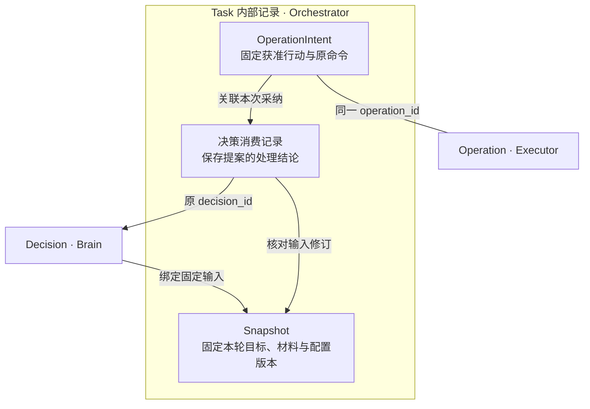

# 任务记录、字段与查询

一项报告任务先保存原目标，随后产生多轮决策、读取、保存和读回记录。实现者需要从同一个 task_id 找到这些记录，并分清哪一份可以改变任务、哪一份只是引用其他负责方的事实。本页定义这些关联及对外查阅字段；业务推进见[任务主线](README.md)，逻辑存储、唯一约束和事务见[实现设计](implementation.md#data-flow)。

## 任务内部记录与依赖

六组对象的职责与生命周期见[架构总览](../README.md#core-objects)。本节展开任务记录的直接依赖，以及跨对象关联所需的身份、版本和一致性约束。

以下展开由 Brain 提案形成操作的分支。箭头指向依赖记录，无向线表示两端记录使用同一个操作标识。

下表未另行标注的记录由原 Orchestrator 保存；标识均限定在原租户与负责方范围内。

| 记录 | 身份与固定依赖 | 依赖变化与恢复处理 |
| --- | --- | --- |
| Task 与目标修订 | 固定租户、逻辑编排器、`task_id` 与原提交命令；有会话来源时，关联应用保存的原消息及创建来源 Session（至多一个）；目标、条件、控制与整体修订分别记录 | 沿原命令恢复任务关联；进程接替或会话归档不改变任务责任，保留解释旧行动和最终结果所需的目标历史 |
| Requirement：完成要求 | `task_id + goal_revision + requirement_id`；绑定原目标要求与判断规则 | 条件变化形成新目标修订，保留解释旧行动所需的历史 |
| 目标覆盖记录：检查要求是否遗漏 | `task_id + goal_revision + coverage_revision`；绑定完整目标、全部条件摘要、核验规则与实现、准确报告 | 目标或条件变化使旧选择失效；完成时必须取得当前适用的通过依据，缺报告或漏项不能由已有条件通过抵消 |
| 内部条件核验记录：保存 ConditionResult 判断值 | 内部 `check_id`；绑定目标修订、Requirement、准确成果、判断实现与证据；判断规则沿原 Requirement 固定，组合判断另关联有界且无环的组成检查 | 原判断保留，当前适用性另行记录；目标或成果变化后重新建立核验绑定，历史通过不能覆盖当前失败或版本变化 |
| Snapshot | `task_id + snapshot_revision`；固定目标、控制、条件、材料与配置版本 | 保留原快照；重派读取原输入，需要不同输入时创建新快照与 Decision；不能从当前会话重新猜测历史输入 |
| 决策消费记录 | `task_id + decision_id`；关联原提案与输入修订 | 保存采纳或失效结论；重复提案返回原结论，处理结论与任务变更共同提交，不重复产生操作、目标修订或额度占用 |
| Plan：可选计划 | `task_id + plan_id + plan_revision`；绑定目标修订、准确计划正文、步骤及其依赖 | 修订计划后，旧版本尚未准入的步骤失效；已准入行动继续保留原关联 |
| 步骤准入 | `task_id + plan_id + plan_revision + step_id`；绑定原计划版本、步骤声明的条件判断与已核实的前置结果，保存唯一处理结论 | 同一步骤重报沿原行动恢复，不重新绑定较新的输出，不重复产生操作、目标修订或额度占用 |
| OperationIntent | `operation_id`；关联原 Task、目标修订、准入来源、原命令、固定参数与能力绑定 | 意图保存不代表 Executor 已接纳；重派沿用原意图，参数变化须重新形成候选，原效果与费用继续核对 |
| 收到的事实 | 按受信 `owner / object_id / revision` 保存摘要与来源关联，引用原负责方的事实 | 重复事实去重，同修订异内容拒绝；原事实仍由原负责方裁决 |
| 未结集合 | 按 `task_id` 从全部已准入操作意图及原 Operation 的当前效果构建关联 | 重建不完整时禁止据此完成任务，不能以截断列表推导无未知效果；尚未核清或仍可能迟到的效果保留核对责任，不随 Task 终态删除 |
| InputRequest：任务输入请求 | `request_id + revision`；绑定原 Orchestrator、Task、适用目标修订、准确问题和允许回答范围；开放请求由 Task 的 input 等待以准确 `owner_id / id / revision` 引用 | 请求创建、修订、消费或替代与对应等待引用、新 Task 修订及后续责任共同提交；只消费仍适用的版本，原消费与去重依据独立保留 |
| InputSubmission：回答投递记录（交互应用保存） | `input_id`；关联原 InputRequest 及其修订、准确回答正文和目标消费命令 | 投递与业务消费分别记录；未结交接及目标命令关联独立保留 |
| 控制传播记录 | 以 `task_id + executor_id` 固定接收方，关联目标与控制修订、各端原命令和回执；绑定集合覆盖完整执行端范围 | 逐端核对当前修订的落实情况；迟到回执归原修订，不能清除新控制的待确认责任 |
| 预算与预留 | 按 Task 和计价单位保存 `limit / reserved / spent`；每笔 `reservation_id` 关联原 Task、单位、唯一计费来源 `source_owner / source_kind / source_id` 及累计用量修订 | 来源尚未确定时保持预留，取得可核验来源后固定关联；只记原来源新增的累计差额，重复账单不重复扣费；Task 终态不释放未知费用的预留 |
| 跨端预算分配 | `allocation_id`；关联父任务预留、固定接收方、单位上限、期限及关闭证明 | 双方分别保留交接责任；正常结算须取得原接收方关闭消费及最终累计费用的证明，终态或失联不释放未知额度 |
| Result：固定成功成果与依据 | 每个 Task 至多一份；绑定目标版本、所选覆盖记录与条件核验记录、准确成果及限制 | 原 Result 与终态固定；迟到费用、证据缺陷另附记录并保留后续处理责任 |

每项 OperationIntent 固定一种准入来源，按原来源身份去重：

| 来源 | 原身份 | 准入时固定的关联 |
| --- | --- | --- |
| Brain 提案 | `task_id + decision_id` | 原决策消费记录、输入修订与获准操作 |
| Plan 步骤 | `task_id + plan_id + plan_revision + step_id` | 原计划版本、步骤、前置结果与获准操作 |
| 受信核验 | 内部 `check_id`，或 `task_id + goal_revision + coverage_revision` | 原检查输入、规则与评估操作 |

来源处理结论、操作意图、预算预留和派发责任在原 Orchestrator 的同一本地事务中提交。计划与核验直接使用各自身份；已有评估操作时沿原操作恢复，复用报告不创建新操作。

这些记录通过准确内容引用和原授权使用关联 Content、Grant：

| 依赖 | 任务记录保存的关联 | 使用与恢复约束 |
| --- | --- | --- |
| Content | 目标、Snapshot、Plan、操作参数、核验依据和 Result 使用准确 ContentRef：`owner / content_id / version / hash` | 固定原版本；读取时仍须核验当前用途与来源限制 |
| Grant | 原 `grant_id` 及许可修订、本次使用的 `use_id`、准确意图与对应调用 | 原授权负责方保存使用裁决与结算；实际启动仍须核验当前资格，任务终态不删除未结使用 |

交互应用、Brain、Executor、内容和授权负责方分别保存、裁决自己的原事实。编排器保存可信来源关联及所需投影，不通过修改本地缓存代替原负责方的效果、权限或账务决定。

## 对外字段与方法

字段编码、必填性和数组上限以[同版 Schema](../../../contracts/schemas/protocol.schema.json)为准。本节说明字段对应的业务责任；表中的内部 OperationIntent 不增加公共 Invoke 字段。Task 当前 requirements 为 0–100 项，Result 的条件结果和成果引用各为 1–100 项；这些响应上限不截断内部历史或未结全集。

下表集中定义业务字段；大对象均使用获准 ContentRef。

| 对象 | 字段与约束 |
| --- | --- |
| Task | `tenant_id, task_id, orchestrator_id, submit_command_id, goal_ref, goal_revision, requirements, policy_ref, revision, control_revision, status, control, wait_reasons, deadline, budget, open_effects, accounting_open, result_ref?`；Orchestrator 和原提交绑定不可变；祖先控制按同 Orchestrator 任务链检查 |
| Requirement | `requirement_id, kind, source_ref, rule_ref, required`；rule 引用机械检查、评估规则或用户验收；依据不足不能标 pass |
| OperationIntent | `operation_id, task_id, goal_revision, decision_id?, plan_step?, verification_ref?, capability_ref, binding_ref, input_ref, input_digest, grant_refs, reservation_id`；内部来源三选一：Brain 的 decision_id、计划的 `{plan_id, plan_revision, step_id}`，或受信核验的 `{kind=condition, check_id}`／`{kind=goal_coverage, goal_revision, coverage_revision}`；核验引用不能由普通调用自报。准入后不可改参数，公共 Invoke 不增加来源字段，效果由 Executor 提供 |
| ConditionResult | `requirement_id, goal_revision, artifact_ref, verdict, basis, evidence_refs, evaluator_ref`；verdict 为 pass/fail/unknown，引用准确成果与适用规则 |
| Result | `task_id, goal_revision, artifact_refs, completion_basis, condition_results, limitations, completed_at`；只供 succeeded；失败／取消返回独立结束说明和未决项 |

`Task.wait_reasons` 中的 input 项以 `object_ref={owner_id: 原 Orchestrator, id: request_id, revision: 请求当前修订}` 定位准确 InputRequest。获准完整披露的 input 等待必须带此引用；应用可直接用它调用既有 `interaction.request_read`，无需先建立 Surface。引用或必要依据不可完整披露时，用 `QueryResult.gaps` 明确缺口，不输出无引用的可回答 input 项；依赖输入保持关闭。其他种类等待沿各自 Schema 保留 object_ref 的可选性。创建与一次消费的[领域事务](implementation.md#input-waits)保证等待不会指向被替代的请求。

| 方法 | 业务输入 → 输出 | 成功含义 |
| --- | --- | --- |
| `task.submit` | goal_ref、目标 Orchestrator、明确约束、策略选择、预算及期限 → Task | 接纳与首项工作持久化，不保证任务成功 |
| `task.read` / `task.list` | task_id 或过滤条件／游标 → 当前获准快照 | 查询不引发行动，目录只包含本 Orchestrator 的任务 |
| `task.result` | task_id → 固定 Result 或尚未成功的状态说明 | 返回原结果，成果字节按当前权限另取 |
| `task.revise` | expected_revision、新 goal_ref、明确约束变化 → 新修订 | 旧在途效果保留；新目标等待冲突解决 |
| `task.pause` / `task.resume` / `task.cancel` | expected_revision、控制理由 → 本 Orchestrator 决定及逐远端确认状态 | 本地决定已保存；远端生效另查 |
| `task.input` | request_id、request_revision、内容或选择、准确预览绑定 → 消费回执 | 一次消费；授权输入走独立受信签发入口 |
| `task.attach_evidence` | 原 operation_id、可核验证据引用 → 核验 job | 接纳证据不直接改变效果或终态 |
| `task.billing_reconcile` | 原 task_id、source_kind、source_id、usage_revision、usage_digest → JobAck | 验证认证计费 owner 与原 Task／计费项绑定，仅持久唤醒原 settle 作业记录；主动读取原账后才按累计差额结算，JobAck 不证明费用已入账 |
| `task.accept_result` | request_id、request_revision、候选摘要、goal_revision、受信用户决定 → 验收记录 | 核对请求类型、版本和未消费状态，同事务消费请求、保存验收及后续核验 job；原命令返回原回执，另一命令竞争同请求只可一份生效 |

task.list 在本 Orchestrator 内按 `(created_at DESC, task_id)` 使用固定查询上界与稳定游标，逐页重新检查当前披露权限；已删除或已撤权项跳过并记录缺口，不能为了补齐数量无限扫描。资格适配器从原授权 owner 核验披露范围代次，变化时旧页游标失效；适配器不可核验时不能声明该页完整。时间上界不是提交水位，分页期间新增的任务可能留待下一次查询。[跨 Orchestrator 列表](../interaction/README.md#cross-orchestrator-list)由应用固定来源版本并合并，不建立第二个任务裁决者。
