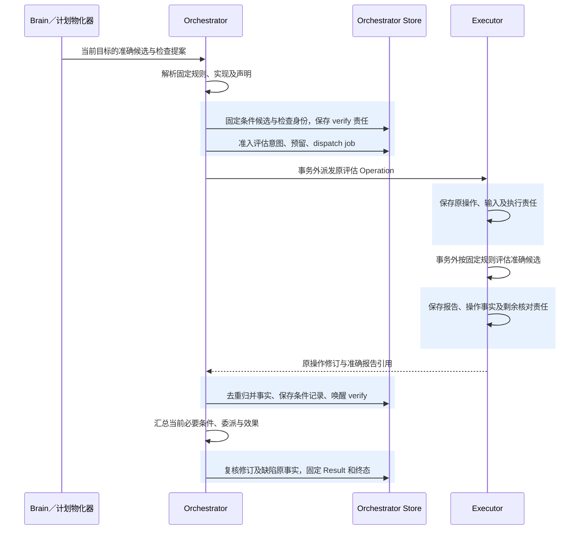

# 任务验证：规则、实现与完成依据

[任务运行](README.md) · [持久记录与事务](implementation.md) · [执行效果](../execution/README.md) · [验证器评测](../evaluation/README.md#task-verifier-evidence)

任务验证把用户条件、准确成果和可采用的证据连起来。Executor 说明操作发生了什么，验证实现按固定规则形成判断，Orchestrator 保存条件记录并裁决任务能否完成。三者的成功含义分别成立：评估操作已完成，可能得到质量不通过的报告；质量通过，也不能证明文件已经保存。

本专题集中定义验证器选择、任务内检查、证据复用和异常处理，支持 C1、C3–C9。默认复用能力目录、TaskPolicy、扩展安装锁及现有执行与评测模块。准确版本可重放不等于判断准确；本文是设计规格，尚无验证器实现或专项准确性实测。验证器登记、条件记录和判断缺陷登记采用宿主受信内部入口，尚未冻结为第三方线方法。装配缺少所需声明、持久责任或当前缺陷核验能力时，按下文限制适用用途，不能从安装成功推定这些前提已经具备。

## 1. 三类检查及事实归属

| 检查 | 目的与触发者 | 执行及持久负责方 | 可以证明什么 |
| --- | --- | --- | --- |
| 执行器效果核对 | Executor 在可能发送、答复丢失或效果未清时继续原操作；Orchestrator 可提交受信补证或有限核对请求 | Executor 按 Capability 的效果谓词取得目标凭据，保存 Operation 事实、证据及执行／核对 job；Orchestrator 保存查询责任 | 声明效果已发生、确定未发生或仍未知；不直接裁决整项任务质量 |
| 中途质量评估 | Brain 提出检查，或计划物化器依据固定计划形成检查候选，Orchestrator 独立准入 | Executor 运行固定评估能力并保存原报告；Orchestrator 归并为条件检查记录并保存后续责任 | 该规则与实现对该候选给出的 pass、fail 或 unknown；不代替操作效果 |
| 最终完成汇总 | 完成提案、条件事实归并或受信验收唤醒任务级 verify job | Orchestrator 核验当前条件、证据适用性、受管委派及效果投影，在完成事务中固定 Result | 全部必要条件及收尾前提满足，完成依据按最弱必要条件归类；不在事务中另作模型评估 |

确定性的本地条件比较可以由 Orchestrator 的受信固定实现完成，例如比较已有读回摘要与候选摘要。凡需新的模型调用、外部取证、工具或设备动作，都先作为普通 Operation 准入。`verify` job 只承载归并与完成核验责任，不能绕过授权、预算和控制门禁启动这些动作。

验证器指按明确适用范围执行某份判断规则的实现；它可以是已有驱动中的效果映射、内置确定性检查，也可以是通过 Executor 调用的质量评估能力。通用编排只处理身份、版本、授权、预算和恢复，能力提供方负责目标凭据、取证方式和判断实现。新工具只需补全既有效果合同；开放式任务可以使用通用质量评估，不要求为每种主题安装任务流程。

## 2. 从声明到任务内固定

复用现有目录和安装锁，可以让验证实现获得与其他能力相同的审查、激活及停用规则。代价由提供方和宿主维护者承担：提供方须交付适用声明和反例，维护者须保留准确装配与审查依据。只有未来出现独立事实归属或无法由现有目录承载的生命周期，才需要另行评估新服务。

### 2.1 谁提供、登记和批准

| 负责方 | 必须交付或保存的内容 | 权限边界 |
| --- | --- | --- |
| 验证器提供方 | 精确实现、支持的准确规则、条件与成果适用范围、所需证据、输出含义、已知局限和失败模式；外部能力另含费用、查询及有限重试合同 | 可以提出声明和候选，不能批准自身取得任务权限或提高完成保证 |
| 宿主／目录维护者 | 核对声明、输入输出与证据绑定、边界反例及代码信任；登记规则和实现映射，固定到安装锁或其准确声明内容 | 登记不代表当前实例就绪、批准有效或判断准确性已经量化 |
| 受信评测维护者 | 维护独立样本、判定参考、覆盖缺口、适用用途的准入证据及已证实判断缺陷 | 按固定口径报告误判与漏判等结果，不能从任务自报成功构造真值 |
| 受信批准者 | 通过既有评测与发布流程批准精确制品、用途范围及目标；专项证据不足时不批准对应保证 | compatibility 只支持其合同及声明用途，不自动取得改善或定量准确率结论 |
| Orchestrator | 按任务固定策略选择、准入，保存证据适用性并裁决完成 | 不修改验证器报告，不以自己的恢复正确性替代判断质量证据 |

声明内容随精确制品或配置版本保存，完整材料使用 ContentRef；不向公共 Capability 或 ConditionResult 任意增加自由字段。TaskPolicy 的内部配置保存允许的规则／实现组合、用途、确定的候选顺序、重试与修订限额，以及需要额外证据的条件。声明、安装锁和策略的任一项不可核验，就不准入依赖它的新检查。

### 2.2 选择顺序与版本边界

Orchestrator 先按以下顺序选择，再独立检查当前使用资格：

1. 从当前 `goal_revision` 的 Requirement 取得准确 `rule_ref`。规则说明判定对象、必需证据、判定方法及允许的依据；不能用模型对条件的另一种解释替换显式约束。
2. 固定候选的 ContentRef、版本和摘要。在任务固定 TaskPolicy 与安装锁限定的候选集合中，筛选明确支持该规则、条件、成果及证据范围的实现。搜索只定位候选，准入须读取完整准确声明。
3. 按策略预先固定的优先顺序选出实现，记录选择及其声明依据。次序必须能确定唯一选择；同优先级如何排序由策略固定，不能用本次评分高低决定。策略不完整时保存配置缺口，交受信管理入口修正。
4. 核验所选实例当前就绪、批准与用途仍有效、没有命中当前已登记判断缺陷，并检查任务控制、权限、费用和剩余次数。暂时离线时等待原依赖；只有策略预先允许因该类不可用切换，才可选择同一固定集合中的后续候选，并重新准入。

多个实现同时可用时不全部运行后挑有利结果。需要多评估器共同判断的业务，须在规则中先固定各自职责、组合方法及分歧处理；其成本与调用数量进入原预算。一次有效 fail 不能通过换评估器、只改评分标签或反复运行同一候选来消除。

组合判断须保留所依赖的原检查及准确实现，完成、复用和缺陷影响处理都检查这份有界依赖集合，不能只核对汇总器的 evaluator_ref。任何组成依据命中缺陷时，汇总判断也须重新核验；不能把失效藏在一个仍有 pass 的汇总值后。公开 ConditionResult 可以保存固定组合规则的汇总判断，内部组成记录及其证据继续可追溯，不把消息数组上限当作已覆盖全部依赖的证明。

候选集合和规则在任务中不追随 `latest`。升级形成新锁或新规则版本，用于之后的任务；原任务只使用已固定集合内仍合法的实现。用户修改目标时可以形成新条件修订，但不能顺便更换 TaskPolicy 或安装锁；新要求超出既有集合时等待合法补充、交付部分材料或另建采用新配置的任务。安全停用仍可封闭原版本的新启动，固定版本从不保证永久可用。

## 3. 条件、候选、评估与完成的处理链

下图表示一次质量检查的责任交接。蓝色区域为各负责方的本地事务；箭头跨越区域时不暗示跨库原子性。效果条件可直接采用已核对的原操作证据，本地确定性比较不需要额外远端评估。

### 3.1 准入和记录

Orchestrator 保存当前条件候选时，固定任务、目标修订、条件、成果、规则和实现的关联，以及本次 `check_id`，与任务级 verify 责任共同提交。检查需要外部评估时，再按普通行动准入保存原 OperationIntent、准确参数、预算预留和 dispatch job；检查记录与原操作的关联在这次准入事务中固定。两步可以共用一个短事务，不能先发外部调用再补身份。

评估的输入含准确条件、规则、候选和已获准证据。Executor 保存报告时记录实际采用的实现、配置及证据引用，模型评估同时固定模型与提示配置；处理地点及正文披露照常受 Grant 约束。评估 Operation 的 `effect=applied` 只表示已取得声明的评估结果；报告内 `verdict=fail` 是正常的判断结果，不是执行失败。未取得完整报告则保留具体错误或 unknown，不制造 pass。

Orchestrator 查询原操作及报告，核对认证来源、身份、目标修订、候选摘要、规则／实现及必需证据，再保存不可变的检查结果。报告正文和详细适用依据使用 ContentRef；ConditionResult 继续按[公共字段](README.md#records)绑定条件、目标修订、准确成果、判断、依据和实现。其规则通过所在任务、`goal_revision`、`requirement_id` 定位不可变 Requirement；不能仅凭相同 requirement_id 采用另一修订的规则。

原报告、原判断和当前适用性分别保存。新成果、目标修订或可信判断缺陷可以使旧 pass 不再适用，但不改写“当时如何判断”的原记录。当前有效条件记录由 Orchestrator 选定；历史检查与迟到结果只增加事实，不能无条件覆盖当前记录。具体表、唯一约束及事务见[实现篇](implementation.md)。

### 3.2 持久责任与恢复

| 交接或提交 | 必须共同保存 | 崩溃或答复丢失后的继续者 |
| --- | --- | --- |
| 固定条件候选 | 检查身份、准确绑定、待核验缺口及 verify 槽 | Orchestrator 恢复同一检查；需要外部评估时再走行动准入 |
| 准入外部评估 | 检查与 operation 关联、原意图、预留及 dispatch 槽 | Orchestrator 查原命令；不能因领取过期创建另一份评估或预留 |
| Executor 保存报告 | 原操作修订、准确报告及尚待核对／交付的责任 | Executor 恢复原责任；Orchestrator 的 poll 槽主动查询，通知仅加速 |
| 归并报告或消费验收 | 去重事实、条件记录、任务修订、费用变化及 verify 槽 | Orchestrator 按原事实修订继续；同修订异内容冲突，不接受较晚到达的另一份正文覆盖 |
| verify 完成或退避 | 当前条件及后续等待，受本次领取代次和责任版本保护的槽状态 | 新责任先提交时旧处理不能标 done 或延后；done 先提交时新责任重开同槽 |
| 提交任务成功 | 固定 Result、终态、控制传播及结果可查事实 | 查询原 Task／Result；后续费用继续结算，终态不重开 |

verify 每次只处理有限检查及当前完成候选，不扫描无限历史；外部事实尚缺时保存 poll、具体依赖或输入请求。暂停时可以归并既有证据并完成汇总，不能新启质量评估。取消或失败后只保存原操作、证据和费用的收尾事实，不生成新的目标工作。

同一检查的执行恢复沿原 operation 和有限尝试合同进行；已经形成的有效报告不以“重试”重新运行。若取得新证据或修订候选需要再次评估，保存新的检查及操作身份，并保留旧记录；它仍计入原任务的总轮数、修订次数、期限和费用，不能靠换身份重置限额。只读重取存在多个结果时按固定规则处理；未规定且结果矛盾时保存 unknown，不挑分数最高的一份。

### 3.3 最终完成与证据复用

完成事务采用当前目标和准确成果，检查每个必要条件均有适用的 pass，且本任务及委派无未知或仍可能迟到效果、内部子任务全部终结、外部目标行动已封闭。随后按[完成依据](README.md#completion-basis)汇总为 verified、assessed 或 user_accepted。账务未结可以继续保守预留，不能把其误作目标效果未知；高质量评分也不能覆盖未满足的客观约束。

旧证据复用必须逐项核验：条件含义及规则仍适用、成果准确版本一致、证据所证明的资源或事实范围一致、观察时点符合任务时效要求、来源及用途仍合法、没有命中已登记缺陷。目标修订后即使全部成立，也保存绑定新 `goal_revision` 的检查记录及复用依据，不把旧 ConditionResult 原样挂到新目标。任一项无法确认则保持 unknown；需要新模型判断或外部取证时按普通操作重新准入。

成果变更后，原质量记录继续只绑定原版本；获准来源材料可以复用，但新的条件记录须重新核验准确成果，不能仅凭原分数继承 pass。操作曾经 applied 的事实不因文件后来被改动而消失，但该历史事实未必满足“当前文件具有该内容”的条件。

## 4. 异常、冲突及自动停止

先核对记录身份、版本及执行事实，再判断质量；任务控制、授权、预算和当前资格分别检查。下表的原因可以同时存在，处理一项不清空其他等待。

| 情形 | 条件及原事实 | 后续责任与停止边界 |
| --- | --- | --- |
| 固定集合无匹配实现 | 条件 unknown，记录不支持的规则或适用范围 | Orchestrator 保存依赖／输入等待；有合法可补充条件时恢复，确定不支持或到期则失败／交付部分材料，不能猜近似能力 |
| 实现离线或当前批准不允许启动 | 已有合法报告独立保留；未执行检查 unknown | 等待原依赖，或按预先允许的固定候选顺序重新选择并准入；不能追最新版本或刷新过期原回执 |
| 评估完成但回执丢失 | 保存原评估身份，尚未取到报告不等于 fail | Orchestrator 查原 command／operation，Executor 继续原责任；不创建替代身份反复收费 |
| 超时、执行失败或报告不完整 | 记录失败尝试、已知费用及证据缺口；条件 unknown | 按能力与 TaskPolicy 的有限恢复规则继续；查询耗尽后转明确等待／受信补证，保留未结费用，不忙循环 |
| 有效评估报告不通过 | 原条件 fail，执行评估本身可为 applied | Brain 根据缺口补源或修订候选，重新评估准确新版本；修订上限、任务期限或预算耗尽后停止，不换评分标签 |
| 候选、规则或目标变化 | 旧报告留存；不自动作为当前 pass | Orchestrator 检查上述复用条件，否则另建检查；在途旧效果和费用沿原操作收尾 |
| 证据互相冲突 | 先区分版本、范围及时点差异；同一判断仍矛盾则 unknown | 固定规则已有来源优先级或组合判定时按其执行，否则补证；开放质量可以请求受信验收，客观冲突不能由满意覆盖 |
| 用户验收开放质量 | 保存准确候选、目标修订及可见限制的验收记录 | 只在原策略和条件允许范围内标 user_accepted；改变客观条件或降低必要性须用户修订目标 |
| 暂停、取消或期限到达 | 保存原报告及效果，不更改已提交终态 | 暂停只采用既有充分证据；取消／失败继续收尾，迟到 pass 不重开任务 |
| 判断缺陷命中原 pass | 原结果不变，当前适用性 unknown | 按下一节阻止活动任务使用该依据完成，并保存重核责任；没有可用替代实现时明确等待或失败 |

停止条件由能力、固定 TaskPolicy 和任务剩余额度共同约束，取能够继续的交集。自动查询、评估次数、成果修订、总轮数、绝对期限和费用分别计量，任一相关限额耗尽即停止该类新工作。依赖变化可以唤醒同一责任，不重置历史次数或原期限。受信处置允许提交可核验证据、补充合法权限或明确结束任务；不能将“视为已完成”作为消除客观未知的入口。

## 5. 停用、判断缺陷与已有证据

实现当前能否运行，与既有证据还能否采用是两件事。普通退役、批准到期或切换版本先关闭新使用，不自动作废在合法启动依据下形成的原报告。已知代码不可信时停止运行原实现；能够读取其历史报告也不代表这些报告仍足够可信。受信评测维护者须将已证实的判断问题登记为准确缺陷，说明影响的实现／规则版本、证据范围及依据。

缺陷范围必须能在完成门禁中判断，采用准确版本和可核对的证据关联。若只能确认所列版本在某些场景可能误判，却不能可靠地区分受影响记录，则保守覆盖该版本范围，不能让模型临时解释范围以放过一个 pass。缺陷记录保留原来源、摘要和登记身份；相同原登记幂等，内容变化须留下新的修订或关联记录，不能抹去已有影响。

默认在 Orchestrator 的受信提交域内保存缺陷原事实及每个准确实现的固定门禁。缺陷登记锁定相关门禁，原子追加缺陷、递增门禁修订并保存唯一的分页影响责任；登记成功表示完成门禁已经能查到该缺陷，不表示所有任务投影已更新。受信登记入口持有原命令并查询回执，提交不明时不换身份丢掉责任。来自其他提交域的材料须经该入口核验来源并导入，普通模型或插件输出不能直接变更证据资格。

完成事务按统一锁序锁定任务、所依赖实现的固定门禁及当前条件记录，直接检查缺陷原事实。缺陷先提交时，命中范围的 pass 不得促成成功；完成先提交时，Result 保持不变，后续查询另展示缺陷说明。固定门禁使后来新增的缺陷也与完成串行，不依赖当前条件投影是否已被扫描。具体锁序与持久表见[实现篇](implementation.md)。

影响工作按有限页处理受影响的检查。活动任务将当前适用性标为 unknown，保存原因并唤醒 verify；它依据当前控制和限额安排重核，不能绕过暂停开始新的评估。终态任务保留固定 Result，通过独立的缺陷说明关联展示原依据受何种影响；默认宿主在获准诊断视图提供该说明，公共 `task.result` 仍返回原 Result，尚不宣称第三方线协议已经支持这项附加展示。扫描中断沿原游标继续；查询说明和新的结果归并同样核对缺陷原事实，投影滞后不能掩盖已登记影响，迟到 pass 不会恢复已失效的适用性。本机制不增加全历史主动通知或自动修复任务。

`evaluation.approval_check` 只核验启动批准，不提供任务证据的当前缺陷资格；其在线启动窗口和离线续用边界仍按[评测与发布](../evaluation/README.md)成立，不能声称跨端即时停止。远端缺陷尚未导入本域时，本域仅能保证已登记事实生效。要求跨域当前缺陷可核验的高保证用途，必须先具备受信缺陷查询或持久交接、范围与时效合同；当前第三方线接口尚未冻结这一能力，缺失时禁用该用途。普通 assessed 应明确已核验的范围及这项传播限制，不能宣称全局实时无已知缺陷。

## 6. 准确性准入与可声明保证

发布 compatibility 证明实现在声明边界遵守合同；单项任务的 assessed 证明准确候选取得了固定方法的质量判断；验证器准确性则需要独立样本与参考判断。三者分别报告，不能用结构合法、恢复测试通过或任务自报成功推导误判率。

| 用途 | 启用所需证据 | 可以声明的完成依据及边界 |
| --- | --- | --- |
| 普通开放质量 | 已审查的规则和适用范围，准确实现及配置，输入／证据／结果绑定的合同测试，已知局限与典型正反例；发布及当前用途资格有效 | 可以 assessed；缺少专项校准时明确披露，不声明定量准确率或适用于声明范围外的任务 |
| 确定性条件 | 上述基础，加上谓词实现、证据到条件的映射、边界与否定反例、目标系统或有状态模拟目标的验证 | 仅对实际覆盖的客观条件可 verified；确定性代码不代表规则已经覆盖所有自然语言要求 |
| 高影响或额外质量保证 | TaskPolicy 预先规定的适用范围、独立样本、参考依据及分歧处理、指标和准入阈值，以及当前缺陷核验边界；由受信维护者审查并经批准 | 证据全部具备才启用相应用途；缺失或不适用时不自动降级为普通 assessed 来绕过要求 |
| 用户验收开放质量 | 受信入口对准确候选、当前目标和可见限制的一次验收，必要客观效果均已证实 | user_accepted 说明用户接受该范围的质量，不是验证器准确率证明 |

维持普通任务的通用 assessed，使开放式研究与写作无需等待每种主题的专用校准集；代价是用户只能得到声明方法下的判断，系统须显示其局限。对需要更强保证的用途，证据准备、专项评测和退化处置由提供方、维护者及批准者共同承担。具体指标与阈值按用途在运行前固定，当前文档不虚构统一误判率，也不把项目的动作正确率与任务成功率目标改作验证器门槛。

专项评测应区分把不满足判成通过的误判、把满足判成失败的漏判，以及 unknown／拒判的比例和原因；按适用类别、证据缺失与冲突情形分别报告。模型与人工一致性只在有明确人工参考依据及分歧处理时有意义；一致不自动等于真值。确定性检查同样验证覆盖范围与实现正确性。评测使用已有固定计划、隔离及报告机制，宣称改善时继续满足保留集与正式发布门禁，职责见[评测模块](../evaluation/README.md#task-verifier-evidence)。

线上按精确版本监测退化。提供方负责复现与修复候选，受信评测维护者核定缺陷范围与证据，批准者负责停用或收窄用途，Orchestrator 负责让已登记缺陷进入条件采信和完成门禁。停止新使用、重新评估活动任务、解释历史依据分别留有责任，不能把其中一项完成写成全部恢复。

## 7. 验证设计与交付边界

| 场景 | 应观察的结果 |
| --- | --- |
| 新工具没有专用任务流程 | 已有能力与通用评估在声明范围内完成；保证仍按实际条件依据汇总 |
| 评估报告保存后 Executor 或 Orchestrator 崩溃，答复丢失 | 原 operation／check 继续，报告与费用只归并一次，verify 责任可恢复 |
| 两个候选实现给出一过一不过 | 选择及组合方法在运行前已固定，不能只保留有利结果 |
| 候选或目标修改后旧 pass 到达 | 旧记录保留；未通过适用性核验不成为当前条件依据 |
| 质量高分或用户接受，但文件效果未知 | 不提交 succeeded；按原效果责任继续核对 |
| 正常退役已有评估实现 | 新使用封闭，旧合法报告不因退役自动作废，原版本不被新版本静默替换 |
| 缺陷登记与完成竞争，影响扫描在两页间崩溃 | 先登记的缺陷立即阻止命中依据完成；先完成的 Result 不变；扫描恢复不漏责任，查询展示独立缺陷说明 |
| 高保证用途只有 compatibility 报告，或跨域缺陷资格不可核验 | 拒绝该用途，不以普通 assessed、旧批准缓存或用户满意补足缺失证据 |
| 自动限额耗尽后依赖恢复 | 可核对原事实和费用，但不重置评估／修订次数或原期限 |

这些判据分别覆盖语义与版本绑定、持久恢复和判断质量。Schema 及构造用例只能检查给定记录的形状和关联；缺陷并发、崩溃恢复、外部效果、数据隔离与准确性仍须运行实现取证。没有相应实验报告时，不把本文的责任划分写成已经达标的保证。
