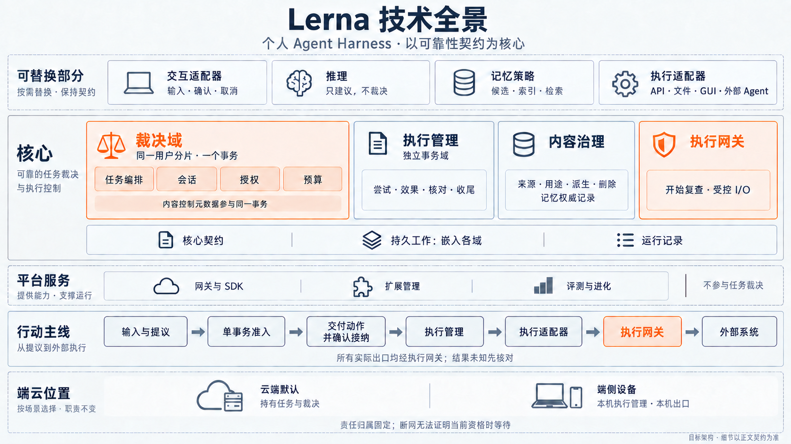
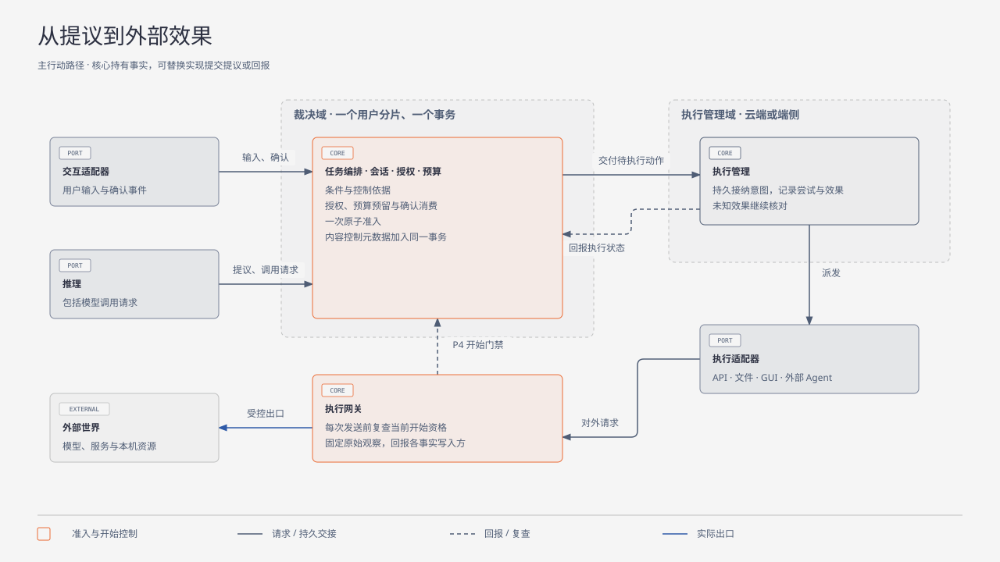
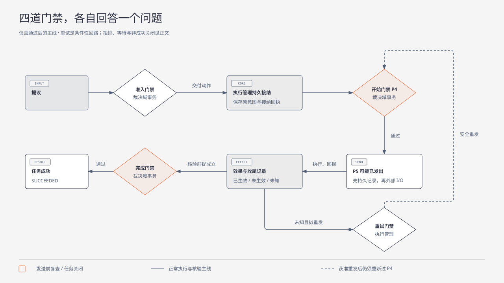
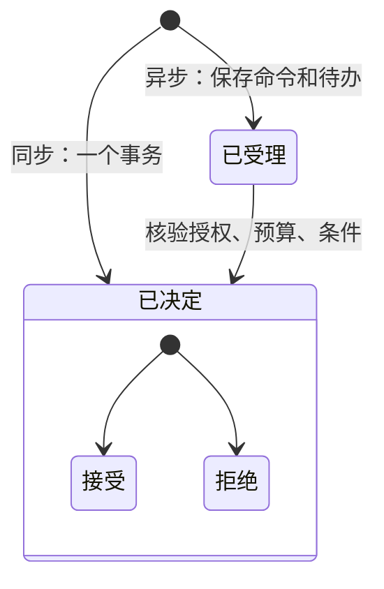
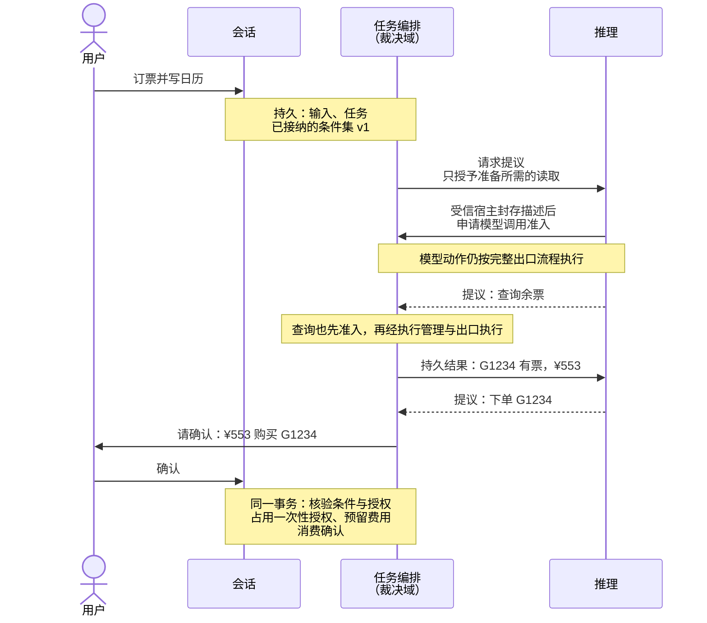
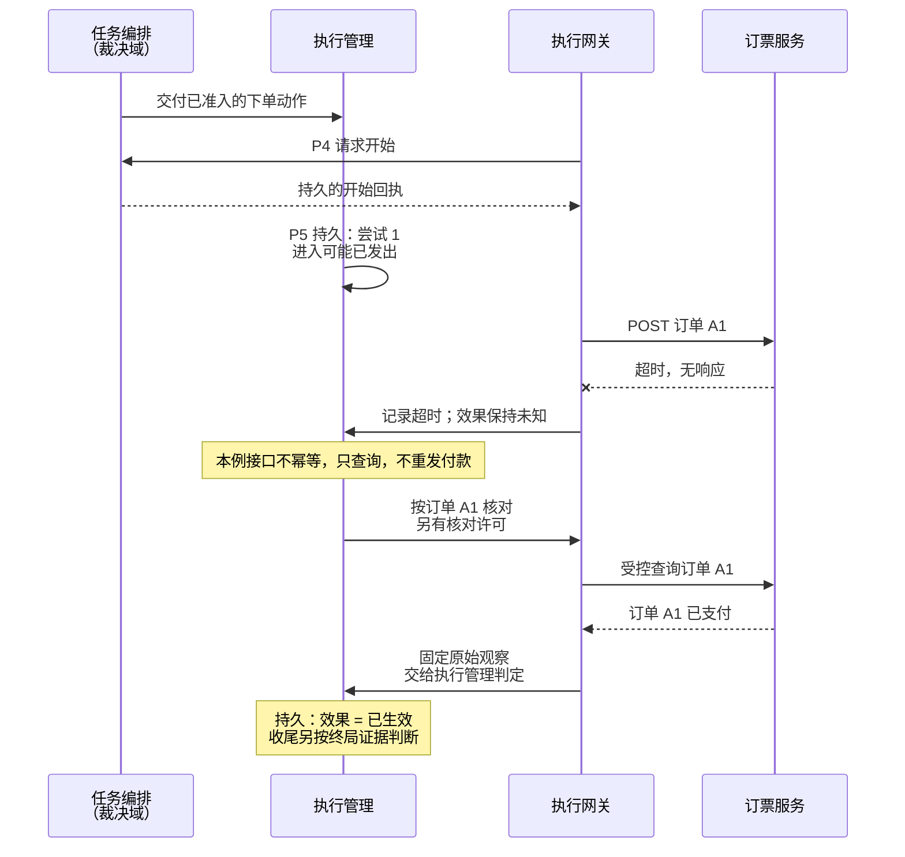
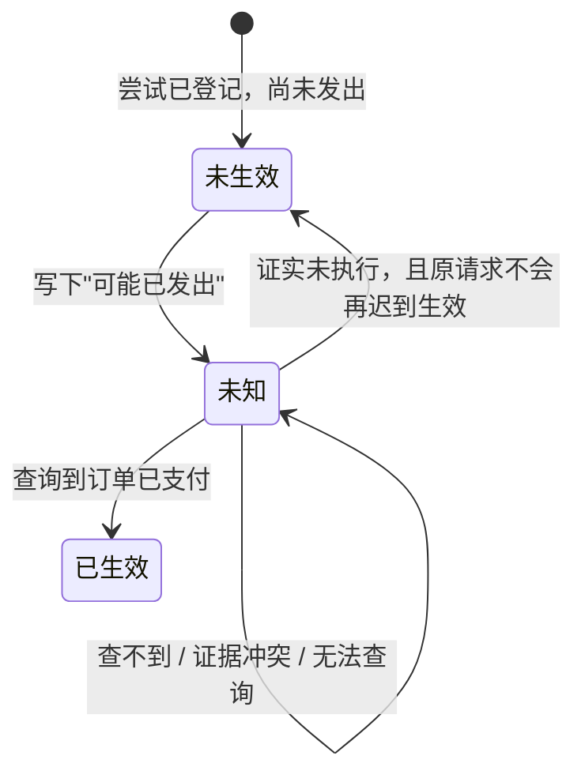
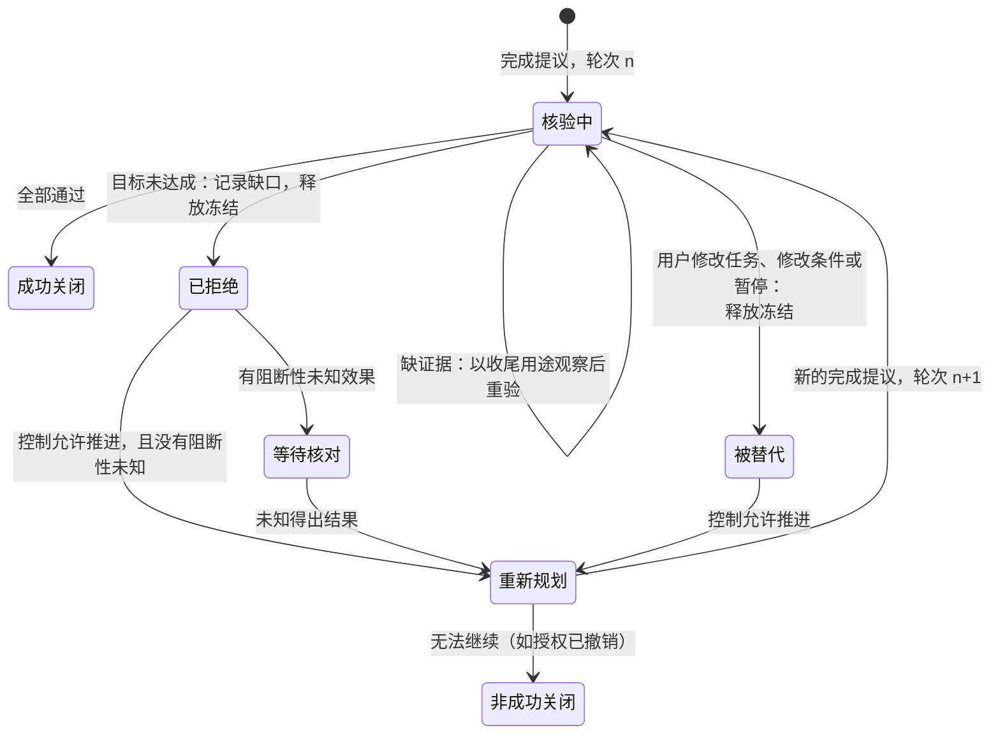
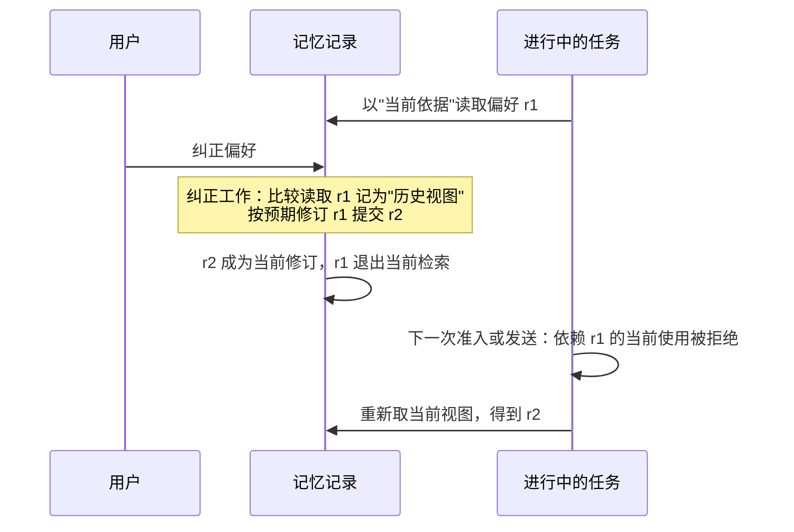

# 整体方案

| 日期 | 修订说明 |
| --- | --- |
| 2026-10-04 | 初版：整体结构、一个任务的完整经过、其他机制一览、主要取舍、当前状态和文档导航。 |
| 2026-10-04 | 去重：取舍只保留场景中出现的三条，路线改为链接项目目标和分层与模块；导航指向新的文档规范和索引。 |
| 2026-10-04 | 术语统一："执行端"改为"执行端点"，授权统一用"撤销"，发布回滚统一为"回滚"。 |
| 2026-10-04 | 按[架构评审处理记录](../review/archive/round-1/README.md)调整：新增"保证必须写明范围"原则；持久性改按档位声明；补充命令受理、授权次数与撤销、完成核验轮次、处理目的、端侧回滚检测、扩展干净实例等机制；取舍表增加三条。 |
| 2026-10-04 | 评审调整已写入项目目标、两篇 ADR 和各模块文档；删除过渡说明，"〔评审 RVn〕"改为来源标注。 |
| 2026-10-04 | 按[第二轮评审处理记录](../review/archive/round-2/disposition.md)调整：新增"动作资格何时成立、何时失效"原则；模型输入先固定再准入；任务修改一经接纳即挡住旧动作；核验轮次可被替代；确认区分签发授权与动作准入；替换资格分三类；记忆语义状态有明确写入方；云端生产档的接管前置条件。 |
| 2026-10-04 | 第二轮评审调整已写入分层与模块、ADR 0003 和各模块文档；删除过渡说明，"〔评审 R2-nn〕"改为来源标注；时序图改为先固定模型输入再准入。 |
| 2026-10-04 | 按[第三轮评审处理记录](../review/archive/round-3/disposition.md)调整：资格原则补充"集中判定的依据"；任务修改处理前目标推进暂停；核验冻结只存在于核验进行中；子任务的 P4 检查祖先控制；模型调用按调用位置恢复；记忆纠正对所有当前依据生效；执行证据由可信出口固定、受信规则解释。 |
| 2026-10-04 | 第三轮评审调整已写入各模块文档；删除过渡说明，"〔评审 R3-nn〕"改为来源标注。 |
| 2026-10-04 | 按[第四轮评审处理记录](../review/disposition.md)调整：开始核验即递增控制代次，已开始的旧动作阻止补建；父任务等子任务全部关闭后才核验；模型调用的位置上限与发送上限分开；记忆纠正时比较旧条目用历史视图；从未开放出口的动作由原执行管理负责方给出内部封闭证明。 |
| 2026-10-04 | 第四轮评审调整已写入各模块文档；删除过渡说明，"〔评审 R4-nn〕"改为来源标注。 |
| 2026-10-05 | 可读性整理：删除正文中的评审来源标注（来源保留在修订表和第 6 节）；第 1 节只保留契约和保证范围；第 2 节新增"谁可以替换"和"四道门禁与开始资格"，配门禁流程图，结构图按事务域重画；3.7 的说明合并为三条；4.4 拆为记忆、子任务、执行证据三小节并配记忆纠正时序图；第 6 节改为按阶段列机制，评审历史改为一张表。规则不变。 |
| 2026-10-05 | 3.2 链接新的[流程：模型调用](flows/model-call.md)；4.4 的依据改为内容治理 2.5。 |
| 2026-10-05 | 项目目标 10.2 撤销 V2（手机 GUI）后同步：阶段表把 GUI 移到 M4 可选，M1、M3、M6 补 API 工具调用和结果未知与恢复两项专项。 |
| 2026-10-05 | 图示整理：整体结构共用 SVG；四道门禁明确条件性重试；订票时序拆为准备与付款核对，补齐核对经过出口的路径。规则不变。 |
| 2026-10-05 | 新增技术全景图，概览可替换部分、核心、平台服务、行动主线与端云位置；图片和生成提示词保存在 assets。 |
| 2026-10-05 | 模块名称统一为“执行网关”，同步正文、时序图、SVG 和技术全景图；规则不变。 |
| 2026-10-05 | 图中的跨域交接改用具体行为说明，规则编号及解释放在图注或正文；交接机制不变。 |
| 2026-10-05 | 模块名称统一为“执行管理”，同步模块简称与图示；存储和连续性语境中的“账本”指其持久执行记录。职责与契约不变。 |

- 状态：草稿
- 读者：新加入的开发者；评审者也可以用它快速把握全貌
- 读完之后：能说清系统怎样运转、关键机制怎样配合、每项保证覆盖到哪里，并知道下一步读哪篇文档
- 篇幅：约 30 分钟

**本文只做解释，不新增或修改任何要求。**规则以[项目目标](project-goals.md)、[分层与模块](layers.md)和各模块文档为准。本文描述的是目标设计，目前还没有实现，也没有经过运行验证。术语以[项目目标第 3 节](project-goals.md#3-核心术语)为准。

本文经过四轮架构评审的调整，各项调整的理由见[第 6 节](#6-当前状态与路线)列出的评审处理记录。

下图概览模块分工、行动主线和端云位置。详细的事务与调用边界见[第 2 节](#2-整体结构)。

图中的“交付动作并确认接纳”包含三步：发送方保存待交付事项，接收方保存并接纳，发送方保存接纳回执。中断后继续原交接；接纳不表示动作已经执行。详细机制见[跨域交接规则 R7](core/durable/README.md#43-跨域交接r7)。

## 1 结论先行

Lerna 是一个面向个人用户的 Agent Harness。它让 Agent 能够替用户行动：调用 API、写文件、操作手机。难点不在"让 Agent 动手"，而在动手之后的**后果**：请求发出后没有回音，钱扣了没有？用户撤销授权时，已经发出的请求怎么办？

方案的核心是一组**可靠性契约**，由不可替换的核心保证：

1. **推理只提议，核心来裁决。**模型说"该付款了"或"任务完成了"，都只是提议。是否执行、是否完成，由核心根据记录决定。
2. **先持久记录，再确认，再执行。**每一步责任都先写入持久记录。进程崩溃后，接替者从记录继续，不靠内存。
3. **结果不明就如实记为"未知"。**超时不等于没执行。系统先核对，确认没执行才会重试；无法确认就停下等待，并告诉用户。

由此得出一条行为准则：**宁可停下等待，不可猜测前进。**代价是有些任务不能自动收尾，这是有意的取舍。

还有一条贯穿全部契约的原则：**每项保证都写明覆盖范围；范围外的情况如实报告，不暗中降级。**例如：

| 保证 | 覆盖 | 不覆盖，此时怎样 |
| --- | --- | --- |
| 先持久再确认 | 所声明档位内的故障（见 4.1） | 档位外的故障：停止新出口，保留未知 |
| 完成需要证据 | 已接纳的条件都有证据 | 条件集是否完整表达了用户意图：Result 列出核验了什么，由用户判断 |
| 端侧回滚检测 | 有云端见证时的回滚 | 离线且无见证时的同机快照回退：明确声明不检测 |

## 2 整体结构

依据：[分层与模块 第 3–7 节](layers.md#3-总体结构)

图中合并了四个裁决模块和各类执行适配器；内容与记忆路径、持久工作、运行记录及平台服务见[分层与模块第 3 节](layers.md#3-总体结构)。

图中有三条边界最重要：

| 边界 | 含义 | 为什么 |
| --- | --- | --- |
| 核心与可替换部分 | 核心持有事实并裁决；可替换部分只提议或回报 | 推理会被提示注入，适配器可能有缺陷，它们不能直接改变事实 |
| 裁决域 | 任务编排、会话、授权、预算在**同一个事务**里完成准入 | 准入时要同时确认条件仍有效、授权有效、预算够用、确认已消费；拆开就会出现"检查通过后授权被撤销"之类的竞争 |
| 执行网关 | 一切离开系统的请求（包括模型调用）都经过它 | 没有旁路，才能保证每个外部效果都有准入依据和记账 |

模块之间有七条调用规则（R1–R7）。读者最常遇到的是两条：

- **R1**：推理不直接调用执行适配器。提议回到任务编排，准入后由执行管理派发。
- **R7**：跨事务域的交接分三步：本方持久记录意图 → 对方持久接纳 → 本方记下回执。回执丢失时查询原交接，不新建。即使两个域在同一个数据库里，也走这三步（理由见第 5 节）。

### 2.1 谁可以替换

可替换的部分是推理、记忆策略、执行适配器和交互适配器，它们写错了也不能破坏上面的契约。"必须受信"和"不可替换"是两回事，所以替换资格分三类：

| 类别 | 例子 | 能否替换 |
| --- | --- | --- |
| 核心裁决语义 | 准入、完成门禁、效果判定 | 只随受审查的版本发布，第三方不能改变 |
| 受信实现 | 存储（PostgreSQL、SQLite）、时钟、密钥、出口基本操作、按目标系统解释终局的规则 | 可以替换，但必须通过专项契约和平台验证 |
| 第三方实现 | 推理、记忆算法、执行和交互适配器 | 可以替换，只能使用被授予的接口和能力 |

### 2.2 四道门禁与开始资格

依据：[核心契约 2.6](core/contracts/README.md#26-四道门禁)

从动作提议到任务成功涉及四道门禁；重试门禁只在准备重发时进入。下图只画通过后的主线与重发回路，拒绝、等待和非成功关闭见后文。每道门禁的完整条件只在核心契约 2.6 写一份，各模块文档引用它。

| 门禁 | 在哪里检查 | 它回答的问题 |
| --- | --- | --- |
| 准入门禁 | 裁决域，一个事务 | 现在能不能成立这个动作？条件、输入、控制、授权、预算、确认、记忆依据都要当前有效，且没有阻断性的未知效果 |
| 开始门禁（P4） | 裁决域，每次发送前 | 这个已准入的动作现在还能开始吗？它所依据的东西有没有在准入之后变了 |
| 重试门禁 | 执行管理 | 结果未知时，能不能再发一次而不会重复生效 |
| 完成门禁 | 裁决域，两阶段核验 | 任务能不能记为成功 |

这里有两个容易混淆的时间点：**准入**时动作的依据被固定下来；**开始**时检查这些依据有没有变。两者之间可能隔很久，例如动作排队等待执行、手机断网、用户改了主意。

**控制代次是"开始资格围栏"。**准入时记下本任务和各级祖先任务的控制代次；之后发生下列任一事件，控制代次递增，所有还没通过开始门禁的旧动作就失去开始资格：

- 暂停、恢复、取消；
- 条件变更；
- 会改变任务依据的输入被接纳（即使模型还没理解它）；
- 开始完成核验。

已经开始的动作不受围栏影响，照常记录和核对；撤销、内容删除、记忆纠正也在开始门禁里检查。3.1 和 3.7 展示了围栏怎样挡住旧动作，3.6 展示了撤销与开始的竞争。

### 2.3 命令：身份、受理与决定

用户和 SDK 发给核心的每个请求都是一条**命令**。命令有两个基本规则：

**命令身份是四元组** `(用户, 调用者命名空间, 目标域, 命令标识)`，全系统只有这一个定义。调用者命名空间由认证得出，不采信请求正文。同一身份重复提交，内容相同就返回原决定，内容不同就报冲突。两个调用者恰好用了同一个命令标识，仍是两条独立命令。

**"已受理"不是"已决定"。**同步命令在一个事务里直接得到决定。异步命令先得到受理回执，表示系统已承担给出决定的责任；之后才得到决定回执（接受或拒绝）。决定只写一次，写入后不变。

界面据此显示"已提交，等待核验"或"已准入"，两者不混用。

## 3 用一个任务走一遍

下面用一个**示例场景**串起各个机制。示例只用于解释，不代表已支持这些具体服务。

> 用户说："帮我订下周二去上海的高铁票，买好后把行程加到我的日历。"

假设：

- 订票服务提供余票查询（只读）和下单付款（会扣钱）。下单接口**不幂等，但可以按订单号查询**；
- 日历服务提供写入接口；
- 用户已授权 Lerna 使用这两个服务；付款需要逐次确认，确认对应一份**一次性授权**。

整个过程分为准备与付款核对两段。标有 **持久** 的地方，都是先写入记录、再继续下一步。图中只展开第一次请求提议，模型发送细节见 3.2；之后每次模型调用都同样先固定输入再准入。写日历的部分见 3.6。

先看目标、提议和付款确认。为突出业务决策，此图省略模型发送细节，完整路径见[模型调用](flows/model-call.md)。

再看已经准入的付款动作。下单和后续核对都经过执行网关；下图省略各次调用的 P1–P8 展开，但保留付款发送前的关键持久点。

### 3.1 接收目标，接纳条件集

依据：[会话 4.1](core/sessions/README.md#41-输入的记录与任务接纳)、[任务编排 4.1](core/tasks/README.md#41-创建任务与请求推理)

会话先把用户输入写入持久记录，任务编排再创建任务和**条件**："已购买下周二去上海的车票"和"日历中有对应行程"。条件带版本（v1）。

如果用户中途改口"改成周三"，有两件事要分开看：

1. **修改被接纳的那一刻**：任务编排在同一个事务中递增输入版本和控制代次，并登记封闭尚未开始的目标动作。此时模型还没理解"周三"是什么意思，但核心已经知道任务依据变了。一个已准入、尚未发出的"下单周二车票"动作，到出口时会因控制代次不符被拒绝。
2. **修改处理完之前**：条件集 v1 记着它已处理到哪个输入版本。修改被接纳后，任务的输入版本前进了，v1 就"暂不适用"。这期间只允许解释修改所需的模型调用、只读读取、向用户澄清和原动作的收尾；普通的目标动作和"任务完成"都会被拒绝。否则，一个带着最新输入版本的完成提议，可以凭仍然有效的 v1 通过门禁，"改成周三"就被悄悄忽略了。
3. **修改处理之后**：处理结果必须是持久的决定，模型说"已处理"不算。要么形成条件 v2 并被接纳；要么依据用户的明确表态或任务模板，确认条件无需改动、把 v1 重新绑定到新输入版本；要么转为向用户澄清。之后才恢复规划。

如果下单请求在修改被接纳之前已经进入"可能已发出"，修改不能把它拉回来，执行管理照常核对它的效果。

条件集要先**被接纳**，才能用于完成裁决。整理中的条件集不能支撑"成功"。每个条件绑定一条核验规则，例如"日历中有行程"由日历查询结果核验，而不是"写入请求返回了 200"。把核验规则换成更弱的规则，与删除这个条件需要同样的可信依据；推理不能自己注册一条恒真的规则。

这里有一条边界要说清：核心能证明"已接纳的条件都有证据"，**不能证明**条件集完整表达了用户的意思。如果整理条件时漏掉了"日历"这一项，核心无从发现。所以 M1 只接受任务模板和显式条件列表，模板之外请用户澄清；最终的 Result 会列出核验了哪些条件，标出哪些是模型整理的，由用户判断是否漏项。

### 3.2 推理给出提议；模型调用也要准入

依据：[分层与模块 8.1](layers.md#81-一个任务怎样流过各模块)、[推理接口](ports/reasoner/README.md)

任务编排请推理给出下一步。请推理思考本身就要调用模型，模型调用会花钱、会把数据发给模型供应商，所以它和其他动作一样：**先准入，再经执行网关发出，用量记入预算**。

准入的对象必须是**确定的**模型调用。推理可能先检索一段历史偏好，再把它和任务材料一起交给模型；如果在检索之前就准入，实际发出的内容就和准入依据不一致。所以顺序是：

1. 任务编排登记提议请求，只授予准备所需的有限读取范围，此时还没有模型发送资格；
2. 推理组装模型输入。受信宿主捕获全部实际读取，核验任务的必要事实没有被裁掉，生成完整、固定的调用描述（模型、参数、全部输入、输出上限）；
3. 核心对这个描述做授权、内容、预算和版本检查，成立模型动作；
4. 经执行管理和执行网关发送。适配器在发送前追加任何内容，出口都会拒绝。

推理需要再调用一次模型时，重复第 2 到 4 步（完整流程见[流程：模型调用](flows/model-call.md)）。每次调用由"提议请求 + 调用位置"标识：推理崩溃重启后再次提交同一位置、同一描述，拿回的是原结果，不会重复发送和计费；提交新位置才是一次新的采样。调用位置的上限和实际发送的上限分开计算：重取已有位置的结果不占任何额度；执行管理按 G1 安全重发时位置不变，但要占一次发送额度，额度不够就等待。推理返回的提议是"查询余票"。

查询余票是只读请求，准入、交接、执行都很快完成，结果作为**内容**登记来源和版本。

### 3.3 付款前：确认与准入在一个事务里

依据：[任务编排 4.2](core/tasks/README.md#42-准入)、[会话 4.2](core/sessions/README.md#42-确认与准入)、[预算 4.1](core/budget/README.md#41-准入执行与结算)、[授权 2.3](core/grants/README.md#23-授权使用记录)

推理提议"下单 G1234"。付款需要逐次确认，所以任务编排先请用户确认，确认的内容绑定具体的车次、金额和收款方。界面显示过确认框不等于用户已确认，只有用户的明确回应才算。

确认有两种：用户在设置页批准"允许 Lerna 使用订票服务"，是**签发授权**的确认，在授权成立时消费；这里的付款确认是**动作准入**的确认，在准入时消费。两者都由会话记录，消费目标是互斥的两种类型，同一个确认只能被消费一次。

用户确认后，裁决域在**一个事务**里执行准入门禁。与本例最相关的是下面四项（完整条件见 2.2）：

| 检查 | 不通过的例子 |
| --- | --- |
| 条件版本仍是 v1 | 用户刚改成周三 |
| 授权有效，且一次性授权还有剩余次数 | 用户刚撤销了订票授权；或这次授权已被另一次下单占用 |
| 预算预留成功（¥553 加手续费上限） | 本月额度只剩 ¥300 |
| 确认已消费 | 同一个确认已被另一次下单用掉 |

全部条件通过，才写下准入决定和动作意图，并把一次性授权**占用**给这个动作。任何一项失败，什么都不留下。

授权的状态只有"有效"和"已撤销"两种。"已用完""已过期"是根据使用记录和有效期**计算**出来的，不是状态。这样，一次性授权被占用之后，用户仍然可以撤销它。

### 3.4 交接给执行管理，记下"可能已发出"

依据：[持久工作 4.3](core/durable/README.md#43-跨域交接r7)、[执行网关 4.1](core/egress/README.md#41-正常调用)

执行管理和裁决域是两个事务域（执行管理可能部署在用户手机上），所以按 R7 交接：裁决域记下意图，执行管理持久接纳，裁决域记下回执。如果回执在网络上丢了，裁决域用原交接标识去查，不会再交接一次。

执行管理为这次下单创建**执行尝试** #1，并在真正发出请求**之前**写下"可能已发出"。这样即使进程在下一毫秒崩溃，接替者看到的也是"可能已发出"，而不会误以为"肯定没发"。

执行网关在发出前再核验一次。这次核验与准入时不同：

| 核验时机 | 检查剩余次数吗 | 其他检查 |
| --- | --- | --- |
| 准入新动作 | 检查，并原子占用 | 授权链、有效期、用途、预算、确认 |
| 已准入动作出口 | **不检查**；改为检查该动作是否持有匹配的使用记录 | 授权未撤销、未过期，任务控制允许 |

否则，一次性授权在准入时被占用，到了出口就会因"次数已用完"而被自己拒绝。

### 3.5 付款超时：未知、核对、不重发

依据：[执行管理 4.2](core/ledger/README.md#42-结果未知后由能力组合决定策略)、[执行管理 2.3](core/ledger/README.md#23-收尾依据)

下单请求超时。这时有三种可能：服务没收到；服务收到了但还没处理；服务已经扣款，只是响应丢了。系统无法区分，所以把效果记为**未知**。

接下来怎么做，由适配器声明的能力决定。订票接口**不幂等但可查询**，所以执行管理**不重发**，而是按订单号 A1 去查：

- 查到"已支付"：记为已生效，任务继续；
- 查到"已关闭、不会再支付"：记为未生效，允许新的尝试；
- 查不到：**不能**记为未生效。订单可能还在处理中，稍后才出现。执行管理继续定期核对。

如果接口既不幂等也不可查询，执行管理就保持未知，请用户去订票应用里看一眼。这比自动重试买到两张票更好。

这一步说明了为什么超时后不能"再试一次"：在不幂等的接口上重试，可能扣两次钱（G1）。

### 3.6 写日历时，用户撤销了日历授权

依据：[授权 4.5](core/grants/README.md#45-撤销与出口的竞争离线)、[任务编排 4.5](core/tasks/README.md#45-条件变更暂停与取消)

订单确认已支付后，推理提议"写入日历"。就在这时，用户在设置里撤销了日历授权。结果取决于撤销和"开始发出"谁先持久成立：

| 先发生的是 | 结果 |
| --- | --- |
| 撤销 | 写日历的准入或出口核验被拒绝；请求不会发出 |
| 写日历已进入"可能已发出" | 撤销不能把它拉回来；执行管理继续记录和核对它的效果 |

撤销分两个阶段：撤销被接纳后，立即拒绝新的准入和凭据；各执行端点确认停止后，撤销才算完成。中间阶段界面显示"撤销处理中"，不会宣称"已全部停止"。

同样的规则也适用于已被占用的一次性付款授权：如果用户在下单请求发出前撤销它，出口核验会拒绝；发出后撤销，已发生的效果和费用照常记录。

### 3.7 完成门禁、核验轮次与 Result

依据：[任务编排 4.7](core/tasks/README.md#47-完成门禁)

推理提议"任务完成"。任务编排不直接采信，而是开启一个**核验轮次**：

1. **固定范围。**暂时冻结新的目标准入，并**递增控制代次**：清单里已准入、还没到出口 P4 的动作，从这一刻起就过不了 P4，不必等封闭请求跨域送到执行管理。同时对这些动作发出封闭，封闭只针对这份清单，永久有效。
2. **核验。**每条条件都有证据（车票：执行管理的已生效记录；日历：查询到行程），每个已准入的动作都已收尾。

核验有三种结果：

图中有三个容易误解的地方：

- **冻结只存在于"核验中"。**核验中的三个出口都在同一事务里释放冻结。用户在等待核对期间修改任务，不会被一个已经结束的轮次永久卡住。
- **被拒绝之后，补建要等两类旧动作。**效果未知的动作，由准入门禁的"没有阻断性未知"挡住补建；开始核验之前已通过 P4、可能已经发出的动作，发出前效果仍是"未生效"，所以准入门禁把它们也列为阻断，等它们收尾，否则可能出现旧动作和补建动作各创建一次。开始核验时还没到 P4 的旧动作，已经被递增的控制代次挡住了。
- **"被替代"不等于"目标未达成"。**它不代表条件不满足，也不向用户报告失败。冻结记录属于哪个轮次，只有该轮次能释放它；用户暂停时，被替代的轮次释放自己的冻结，但暂停本身照常生效。

假设推理过早提议完成，日历还没写。核验发现"日历中有行程"不满足，于是记录缺口、结束本轮、解除冻结，请推理重新规划。补写日历必须是**新动作**，重新经过授权、预算和确认；已封闭的旧动作不会被重新打开。

在本例中，日历授权已被撤销，重新规划也无法写日历。任务编排以非成功关闭，Result 写明："车票已购买（订单 A1）；日历未写入，因为日历授权已撤销。已核验的条件：车票已支付、日历有行程（未满足）。"如果用户重新授权，可以再提交写日历的请求。

费用责任不随任务关闭而结束。如果几天后订票服务退回手续费，预算按原计费来源记录退款。退款不会自动变回可用额度。

## 4 其他机制一览

上面的场景没有覆盖以下机制。

### 4.1 持久档位

依据：[数据与存储 5.4](topics/data-and-storage.md#54-持久档位)、[项目目标 G3](project-goals.md#4-不变量)

"先持久再确认"中的"持久"有两个档位。部署时声明档位，写入负责域配置和接纳回执，客户端不能降级。

| 档位 | 覆盖 | 不覆盖 | 用于 |
| --- | --- | --- | --- |
| 本地档 | 进程崩溃、重启、掉电（以经过验证的平台组合为限） | 存储介质永久丢失 | M1、开发环境、手机上的账本 |
| 云端生产档 | 以上全部，加主机和单个可用区永久丢失 | 多个可用区同时丢失 | 云端生产 |

两点容易误解：

- **配置值不等于屏障。**SQLite 的 `synchronous=FULL` 在 macOS 上不会自动刷新设备缓存，还需要 `fullfsync=ON`。所以本地档的"掉电"覆盖只对**平台准入表**中验证过的组合成立；每条写连接打开时核验实际设置，未经验证的平台不开放依赖掉电保证的能力。
- **手机永久损坏时，守住的是 G1，不是 G3。**云端知道自己交出了哪些动作，会把它们显示为"设备记录不可恢复，效果未知"，不重发。但手机上已确认的记录确实丢了。
- **"开了同步复制"不等于云端生产档。**开放云端生产档之前，必须选定高可用实现并写成 ADR，定义同步成员变更、提升资格和旧主隔离，并通过主可用区丢失、主库与协调服务分区等故障历史的验收。只改 DNS 或摘掉负载均衡地址不算隔离旧主。

### 4.2 端侧账本的回滚检测

依据：[部署 4.2](topics/deployment.md#42-断网与重连)、[执行管理 4.5](core/ledger/README.md#45-端侧补传与云端对账)

手机上的账本可能被系统自动还原到旧快照，此时账本自己的记录彼此完全一致，但已经发出的请求不见了。存在账本里的"连续性标识"也会一起回退，不能用来发现回滚。

对策是**用账本之外的记录作见证**：

1. 执行管理启动时处于"待验证"，通过后才能领取工作和发出请求；
2. 重连时，对比云端记录的开始回执与本地记录。云端有、本地没有，说明本地倒退：该尝试视为未知，停止相关的新发送，转入核对；
3. 账本和端点绑定密钥排除在系统备份和设备迁移之外；任何导入的备份都进入恢复隔离。

**边界：**离线期间、没有云端见证时，无法发现同一设备上的快照回退。文档明确声明这一点，不用"连续性检查通过"掩盖。

### 4.3 授权的操作权利与处理目的

依据：[授权 2.1](core/grants/README.md#21-授权记录)、[内容治理 2.2](core/content/README.md#22-用途与生命周期控制)

授权回答两个独立的问题：

| 维度 | 回答 | 取值 |
| --- | --- | --- |
| 操作权利 | 能对数据做什么 | 读取、保存、同步、行动 |
| 处理目的 | 为什么处理这份数据 | 当前任务、个性化、诊断、评测、生成改进 |

例如，用户允许"读取运行记录用于诊断"，不等于允许"读取同一份记录生成新的 Skill"。两次读取的主体、资源和操作都相同，只有目的不同。

处理目的由受信的任务编排或平台工作流绑定，扩展和推理不能靠改参数获得新目的。缺省不等于全部；派生内容的目的上限取所有输入的交集。

### 4.4 记忆的当前状态与纠正

依据：[内容治理 2.5](core/content/README.md#25-记忆记录)、[记忆接口 3](ports/memory/README.md#3-接口)

用户把"工作日愿意坐飞机"纠正为"工作日优先高铁"后，旧偏好仍可作为历史查询，但不再参与当前推荐。"当前采纳哪一版"由内容模块内的**记忆记录**维护，记忆策略只提候选和排序，替换策略不能重置用户的纠正。

每次使用记忆都标明是**当前依据**还是**历史视图**。纠正对所有"当前依据"的使用生效，包括已经取进上下文的材料、已经生成的提议和派生内容。M2 先用保守规则：修订一变，依赖旧修订的当前使用一律拒绝，重新取当前视图。

纠正本身要读旧条目来比较。这次读取记为"历史视图"，否则新修订一被采纳，就会因依赖旧修订而自己失效；并发纠正由"预期修订"检查排序。

### 4.5 子任务

依据：[任务编排 4.6](core/tasks/README.md#46-子任务与外部-agent)

- 子任务动作准入时记下各级祖先任务的控制代次，开始门禁逐级比较。父任务被取消、修改或暂停后，即使通知还没传到子任务，子任务尚未开始的动作也过不了 P4。
- 父任务要等直接子任务全部关闭、并汇总到递归收尾依据之后，才开始完成核验。等待期间父任务不持有冻结，子任务照常推进。只有子任务的 Result 不够，因为非成功关闭可以遗留未知。

### 4.6 执行证据从哪里来

依据：[执行管理 2.3](core/ledger/README.md#23-收尾依据)、[执行接口](ports/executor/README.md)

宿主能确认"这份内容是插件生成的"，不能确认"这些字节由目标系统在这次查询中返回"。所以证据分两层：可信出口在实际 I/O 处固定**原始观察**；执行适配器只能引用原始观察、提交自己的**解释**。"不会再迟到生效"这类强结论由执行管理判定，只有两条路径：

| 情况 | 证据 |
| --- | --- |
| 从未开放过出口 | 原执行管理负责方的内部封闭证明，不需要外部观察 |
| 至少一次可能已发出 | 原始观察，由受信的解释规则判定；没有受信规则的能力按最保守处理 |

插件不能选择内部路径，也不能用"从未发送"的声明代替证明。

### 4.7 其他

| 机制 | 要点 | 详见 |
| --- | --- | --- |
| 删除与撤回 | 删除后，原文、摘要、索引、记忆、缓存立即停止使用，再逐个清理并跟踪回报。受控存储必须能验证清理完成；已发给外部的副本按对方能力请求删除，如实报告状态 | [内容治理 4.4](core/content/README.md#44-删除和撤回的传播) |
| 端云与断网 | 任务默认由云端持有。断网后，已经开始的本机动作继续记录；尚未开始的，只有本地能证明授权仍然有效才启动。重连后先核对（含 4.2 的回滚检测），再推进 | [部署 4.2](topics/deployment.md#42-断网与重连) |
| 持久工作与接替 | 同一命令只产生一个决定；工作者崩溃后由别的工作者领取。领取过期只能阻止旧工作者改写记录，**不能证明**它没有对外发出请求 | [持久工作](core/durable/README.md) |
| 受管理文件 | 覆盖同一文件前，前一次发布的证据必须已交给执行管理；执行管理不可用时暂停对该文件的覆盖 | [文件适配器 4.2](adapters/file.md#42-受管理的版本布局) |
| 扩展 | 只能接入四类可替换部分；安装不等于授权；不可信扩展每次调用使用干净实例，跨调用的状态只能交还核心登记后再读回 | [扩展管理](platform/extensions/README.md) |
| 评测与自进化 | 契约符合性和任务效果分开评分，契约违反一票否决；正式评测事先冻结全部运行；评分以原始用户请求为独立输入 | [评测与进化](platform/eval/README.md) |
| 安全 | 即使推理完全被提示注入控制，也拿不到未授权的资源、扩不了权、绕不过出口 | [安全](topics/security.md) |
| 数据与存储 | 裁决域按用户分片放在关系型数据库；端侧账本用 SQLite；大内容放对象存储 | [数据与存储](topics/data-and-storage.md) |
| 观测 | 核心记录是事实，日志和追踪只是诊断视图。遥测全部丢失时，未知效果和完成判断仍然正确 | [观测](topics/observability.md) |

## 5 主要取舍与风险

依据：[项目目标 第 5 节](project-goals.md#5-目标冲突时的优先顺序)、[分层与模块 第 12 节](layers.md#12-取舍与待定事项)

| 选择 | 体现 | 得到 | 付出 |
| --- | --- | --- | --- |
| 结果不明时停下等待 | 3.5 付款超时不重发 | 不会重复扣款、重复发送 | 有些任务需要用户或人工补充证据才能收尾 |
| 跨域交接一律走三步（R7），同库也不合并 | 3.4 交接给执行管理 | 拆进程、拆端云时故障语义不变；只有一种交接实现要测 | 多几次持久写入。同库合并为一次事务的方案已评估，暂不采纳，待 M6 实测后再议 |
| 模型调用也准入、也经过出口 | 3.2 请求提议 | 费用和数据外发没有盲区 | 每次推理多一次准入 |
| 持久性按档位声明 | 4.1 | 每个档位的承诺都有对应机制和验证 | 手机上的账本不享有云端生产档的保证 |
| 完成核验拒绝后可重新规划 | 3.7 | 过早的完成提议不会让任务卡死 | 多一个核验轮次概念 |
| 受管理文件串行交接证据 | 4.4 | 不需要第二套历史记录 | 执行管理不可用时，同一文件暂停覆盖 |
| 任务修改一经接纳就递增控制代次 | 3.1 | 复用出口已有的控制代次检查，不给凭据加字段 | 用户每次修改任务，尚未开始的目标动作都要重新准入 |
| 模型调用先固定输入再准入，保留单个 `Propose` 接口 | 3.2 | 准入依据与实际发送一致；一次提议可以多次调用模型 | 每次模型调用都要等一次准入 |
| 有限计划只准入参数已确定的前缀 | — | 确认和请求摘要覆盖真实参数；不需要第二套权限表达 | 多步计划要逐步准入，不能一次批准带变量的整批计划 |

需要关注的风险：

- **适配器的能力声明可能不准确。**如果订票接口其实不支持按订单号查询，核对就会失败。缓解方式是能力声明需要证据，并通过一致性测试验证；未声明的按最保守处理。
- **"未知"积压。**不可查询的动作可能长期处于未知。系统会持续显示它们，但需要用户参与才能收尾。
- **条件漏项。**核心无法证明条件集完整表达了用户意图。缓解方式是任务模板、Result 透明列出核验内容、评测按原始请求评分，但不能消除。
- **"停住"不等于正确。**停下等待总是安全的，但可能永远停着。因此恢复流程的测试除了安全断言，还检查活性：前提满足时，系统最终到达明确结果或明确等待。
- **扩展的跨版本兼容未经验证。**`must_understand` 改为由受控的方法和 Schema 定义确定，不只依赖发送方声明；注册结构和兼容矩阵到 M3、M4 才定型。在此之前，只能对明确的接口、版本和平台组合声明可扩展性。
- **性能和容量尚未验证。**千万注册、十万同时在线等目标只有估算方法，没有实测数据。

## 6 当前状态与路线

目前只有设计文档，没有代码；各文档的状态见[文档索引](README.md#2-文档索引)。

开发分 M1–M6 六个阶段，先做出一条能在故障下正确恢复的主线，再扩展能力的广度。第一阶段 M1 是单用户的可恢复主线，**只用于受控测试**，持久性按本地档验证。各阶段的目标和退出标准见[项目目标 第 11 节](project-goals.md#11-建议的开发顺序)；M1 中各模块做到什么程度，见[分层与模块 第 9 节](layers.md#9-m1-最小切片)。

本文提到的机制按阶段落地：

| 阶段 | 落地的机制 |
| --- | --- |
| M1 | 命令身份与受理；授权次数与撤销；本地持久档；四道门禁及控制代次围栏；任务修改的处理门禁；核验轮次；模型调用先固定输入再准入、按调用位置恢复、两种调用上限；有限计划只准入具体前缀；内部封闭证明；受管理文件串行交接；条件集接纳与 Result 透明；API 工具调用专项（模拟 API 上的故障行为）和结果未知与恢复专项（单进程与进程重启） |
| M2 | 处理目的写入授权；记忆记录与纠正 |
| M3 | 端侧平台准入表；端侧回滚检测；协议协商与混合版本验收；结果未知与恢复专项的端云部分 |
| M4 | 子任务与祖先控制；父任务等子任务关闭后核验；执行证据的信任边界；不可信扩展干净实例；第三方扩展的注册与兼容验收；GUI 适配器与用户接管（可选） |
| M5 | 处理目的在真实运行记录上验收 |
| M6 | 云端生产档的安全接管协议；重新评估同库交接合并；API 工具调用的正确率与覆盖规模实测 |

方案经过四轮架构评审：

| 轮次 | 评审点 | 处理记录 |
| --- | --- | --- |
| 第一轮 | 12 | [round-1](../review/archive/round-1/README.md) |
| 第二轮 | 10 | [round-2](../review/archive/round-2/disposition.md) |
| 第三轮 | 6 | [round-3](../review/archive/round-3/disposition.md) |
| 第四轮 | 5（由 Codex 完成） | [round-4](../review/disposition.md) |

## 7 下一步读什么

| 你想了解 | 去读 |
| --- | --- |
| 项目要达到什么、术语和不变量 | [项目目标](project-goals.md) |
| 有哪些模块、谁能调用谁 | [分层与模块](layers.md) |
| 核心对象、标识和状态的精确定义 | [核心契约](core/contracts/README.md) |
| M1 各模块做到什么程度 | [分层与模块 第 9 节](layers.md#9-m1-最小切片) |
| 某个模块的接口、流程和故障处理 | [文档索引](README.md#2-文档索引) |
| 设计经历了哪些修订 | 各文档开头的修订表；第 6 节的评审处理记录 |
| 写新的设计文档 | [文档规范](conventions.md) |

## 8 读者自查

读完本文后，试着回答下面的问题。答不上来的，说明本文或相关文档需要改进，请反馈给文档维护者。

1. 推理说"任务完成了"，系统会直接把任务标为成功吗？核验不通过之后，任务还能继续吗？
2. 付款请求超时后，系统会自动重试吗？什么情况下可以重试？
3. 按订单号查不到订单，能不能断定没扣款？
4. 一次性付款授权已被占用，用户还能撤销吗？撤销后，尚未发出的下单请求会怎样？
5. 裁决域交接给执行管理时回执丢了，系统怎么办？
6. 为什么模型调用也要准入？
7. 手机上的账本被系统还原到旧快照，系统靠什么发现？什么情况下发现不了？
8. 允许"用于诊断"的运行记录，能用来生成新的 Skill 吗？
9. 用户把收件人从 A 改成 B，模型还没理解这条修改，已准入的发给 A 的动作还会发出吗？
10. 推理检索到一段新材料后再调用模型，准入应该发生在检索之前还是之后？为什么？
11. 用户追加了一项要求，模型还没理解它，这时推理提议"任务完成"，会被接受吗？
12. 父任务被取消，取消通知还没传到子任务，子任务已准入的动作还能发出吗？
13. 核验被拒绝后补建一个动作，清单里一个已准入但还没发出的旧动作，会不会和它各执行一次？
