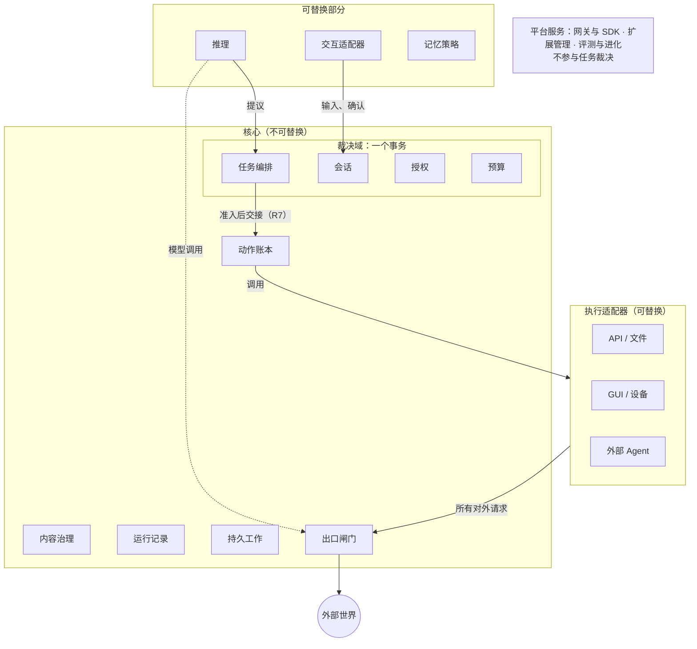
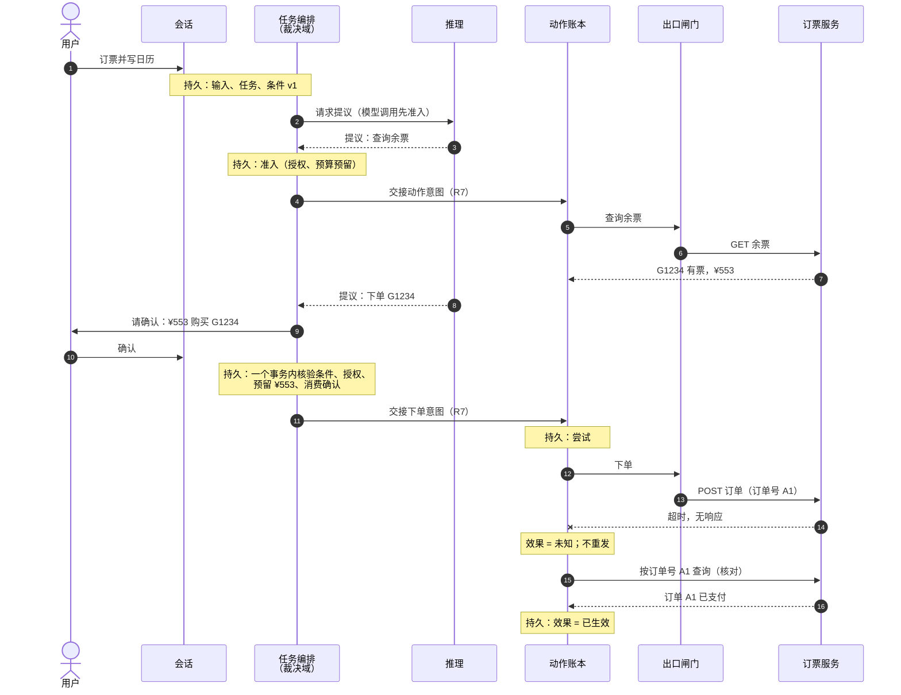
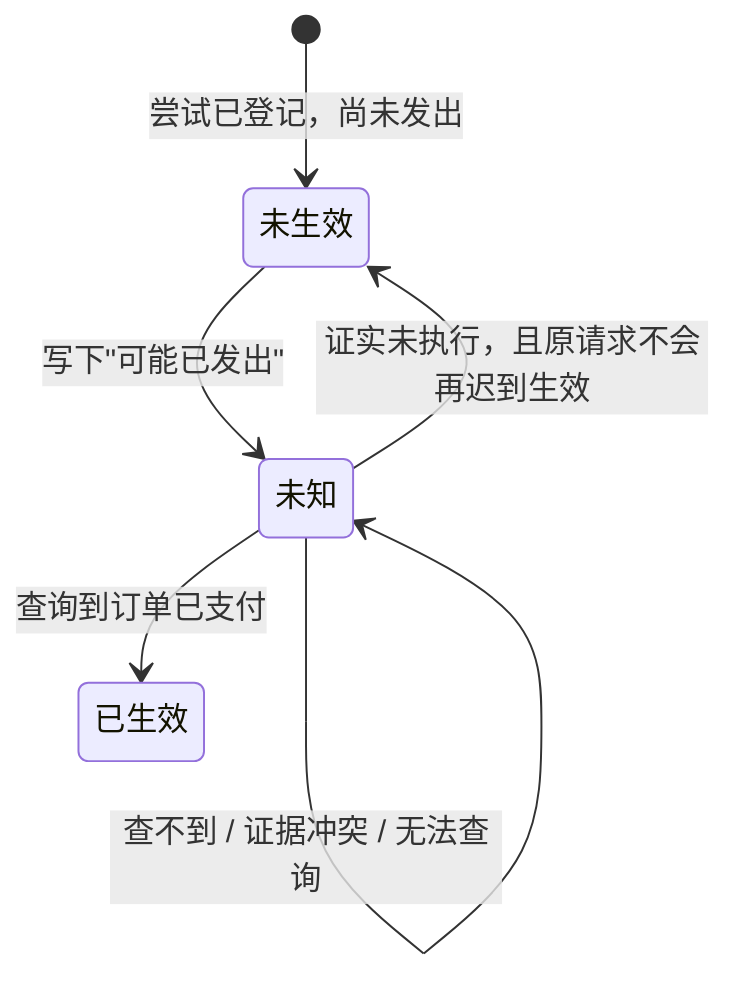

# 整体方案

| 日期 | 修订说明 |
| --- | --- |
| 2026-10-04 | 初版：整体结构、一个任务的完整经过、其他机制一览、主要取舍、当前状态和文档导航。 |
| 2026-10-04 | 去重：取舍只保留场景中出现的三条，路线改为链接项目目标和分层与模块；导航指向新的文档规范和索引。 |
| 2026-10-04 | 术语统一："执行端"改为"执行端点"，授权统一用"撤销"，发布回滚统一为"回滚"。 |

- 状态：草稿
- 读者：新加入的开发者；评审者也可以用它快速把握全貌
- 读完之后：能说清系统怎样运转、关键机制怎样配合，并知道下一步读哪篇文档
- 篇幅：约 20 分钟

**本文只做解释，不新增或修改任何要求。**规则以[项目目标](project-goals.md)、[分层与模块](layers.md)和各模块文档为准；本文与它们冲突时，以它们为准。本文描述的是目标设计，目前还没有实现，也没有经过运行验证。术语以[项目目标第 3 节](project-goals.md#3-核心术语)为准。

## 1 结论先行

Lerna 是一个面向个人用户的 Agent Harness。它让 Agent 能够替用户行动：调用 API、写文件、操作手机。难点不在"让 Agent 动手"，而在动手之后的**后果**：请求发出后没有回音，钱扣了没有？用户撤销授权时，已经发出的请求怎么办？

方案的核心是一组**可靠性契约**，由不可替换的核心保证：

1. **推理只提议，核心来裁决。**模型说"该付款了"或"任务完成了"，都只是提议。是否执行、是否完成，由核心根据记录决定。
2. **先持久记录，再确认，再执行。**每一步责任都先写入持久记录。进程崩溃后，接替者从记录继续，不靠内存。
3. **结果不明就如实记为"未知"。**超时不等于没执行。系统先核对，确认没执行才会重试；无法确认就停下等待，并告诉用户。

由此得出一条行为准则：**宁可停下等待，不可猜测前进。**代价是有些任务不能自动收尾，这是有意的取舍。

可以替换的部分是推理、记忆策略、执行适配器和交互适配器。它们通过固定接口接入核心，写错了也不能破坏上面三条契约。

## 2 整体结构

依据：[分层与模块 第 3–7 节](layers.md#3-总体结构)

图中有三条边界最重要：

| 边界 | 含义 | 为什么 |
| --- | --- | --- |
| 核心与可替换部分 | 核心持有事实并裁决；可替换部分只提议或回报 | 推理会被提示注入，适配器可能有缺陷，它们不能直接改变事实 |
| 裁决域 | 任务编排、会话、授权、预算在**同一个事务**里完成准入 | 准入时要同时确认条件仍有效、授权有效、预算够用、确认已消费；拆开就会出现"检查通过后授权被撤销"之类的竞争 |
| 出口闸门 | 一切离开系统的请求（包括模型调用）都经过它 | 没有旁路，才能保证每个外部效果都有准入依据和记账 |

模块之间有七条调用规则（R1–R7）。读者最常遇到的是两条：

- **R1**：推理不直接调用执行适配器。提议回到任务编排，准入后由动作账本派发。
- **R7**：跨事务域的交接分三步：本方持久记录意图 → 对方持久接纳 → 本方记下回执。回执丢失时查询原交接，不新建。

## 3 用一个任务走一遍

下面用一个**示例场景**串起各个机制。示例只用于解释，不代表已支持这些具体服务。

> 用户说："帮我订下周二去上海的高铁票，买好后把行程加到我的日历。"

假设：

- 订票服务提供余票查询（只读）和下单付款（会扣钱）。下单接口**不幂等，但可以按订单号查询**；
- 日历服务提供写入接口；
- 用户已授权 Lerna 使用这两个服务；付款需要逐次确认。

整个过程的时序如下。标有 **持久** 的地方，都是先写入记录、再继续下一步。为了简洁，图中只画出第一次请求提议；之后每次请求提议同样先为模型调用准入。写日历的部分见 3.6。

### 3.1 接收目标

依据：[会话 4.1](core/sessions/README.md#41-输入的记录与任务接纳)、[任务编排 4.1](core/tasks/README.md#41-创建任务与请求推理)

会话先把用户输入写入持久记录，任务编排再创建任务和**条件**："已购买下周二去上海的车票，且日历中有对应行程"。条件带版本（v1）。如果用户中途改口"改成周三"，条件变成 v2，基于 v1 的提议全部作废。

### 3.2 推理给出提议；模型调用也要准入

依据：[分层与模块 8.1](layers.md#81-一个任务怎样流过各模块)、[推理接口](ports/reasoner/README.md)

任务编排请推理给出下一步。请推理思考本身就要调用模型，模型调用会花钱、会把数据发给模型供应商，所以它和其他动作一样：**先准入，再经出口闸门发出，用量记入预算**。推理返回的提议是"查询余票"。

查询余票是只读请求，准入、交接、执行都很快完成，结果作为**内容**登记来源和版本。

### 3.3 付款前：确认与准入在一个事务里

依据：[任务编排 4.2](core/tasks/README.md#42-准入)、[会话 4.2](core/sessions/README.md#42-确认与准入)、[预算 4.1](core/budget/README.md#41-准入执行与结算)

推理提议"下单 G1234"。付款需要逐次确认，所以任务编排先请用户确认，确认的内容绑定具体的车次、金额和收款方。界面显示过确认框不等于用户已确认，只有用户的明确回应才算。

用户确认后，裁决域在**一个事务**里检查四件事：

| 检查 | 不通过的例子 |
| --- | --- |
| 条件版本仍是 v1 | 用户刚改成周三 |
| 授权有效 | 用户刚撤销了订票授权 |
| 预算预留成功（¥553 加手续费上限） | 本月额度只剩 ¥300 |
| 确认已消费 | 同一个确认已被另一次下单用掉 |

四项全部通过，才写下准入决定和动作意图。任何一项失败，什么都不留下。

### 3.4 交接给动作账本，记下"可能已发出"

依据：[持久工作 4.3](core/durable/README.md#43-跨域交接r7)、[出口闸门 4.1](core/egress/README.md#41-正常调用)

动作账本和裁决域是两个事务域（账本可能部署在用户手机上），所以按 R7 交接：裁决域记下意图，账本持久接纳，裁决域记下回执。如果回执在网络上丢了，裁决域用原交接标识去查，不会再交接一次。

账本为这次下单创建**执行尝试** #1，并在真正发出请求**之前**写下"可能已发出"。这样即使进程在下一毫秒崩溃，接替者看到的也是"可能已发出"，而不会误以为"肯定没发"。出口闸门在发出前再核验一次当前授权和任务状态。

### 3.5 付款超时：未知、核对、不重发

依据：[动作账本 4.2](core/ledger/README.md#42-结果未知后由能力组合决定策略)、[动作账本 2.3](core/ledger/README.md#23-收尾依据)

下单请求超时。这时有三种可能：服务没收到；服务收到了但还没处理；服务已经扣款，只是响应丢了。系统无法区分，所以把效果记为**未知**。

接下来怎么做，由适配器声明的能力决定。订票接口**不幂等但可查询**，所以账本**不重发**，而是按订单号 A1 去查：

- 查到"已支付"：记为已生效，任务继续；
- 查到"已关闭、不会再支付"：记为未生效，允许新的尝试；
- 查不到：**不能**记为未生效。订单可能还在处理中，稍后才出现。账本继续定期核对。

如果接口既不幂等也不可查询，账本就保持未知，请用户去订票应用里看一眼。这比自动重试买到两张票更好。

这一步说明了为什么超时后不能"再试一次"：在不幂等的接口上重试，可能扣两次钱（G1）。

### 3.6 写日历时，用户撤销了日历授权

依据：[授权 4.5](core/grants/README.md#45-撤销与出口的竞争离线)、[任务编排 4.5](core/tasks/README.md#45-条件变更暂停与取消)

订单确认已支付后，推理提议"写入日历"。就在这时，用户在设置里撤销了日历授权。结果取决于撤销和"开始发出"谁先持久成立：

| 先发生的是 | 结果 |
| --- | --- |
| 撤销 | 写日历的准入或出口核验被拒绝；请求不会发出 |
| 写日历已进入"可能已发出" | 撤销不能把它拉回来；账本继续记录和核对它的效果 |

撤销分两个阶段：撤销被接纳后，立即拒绝新的准入和凭据；各执行端点确认停止后，撤销才算完成。中间阶段界面显示"撤销处理中"，不会宣称"已全部停止"。

### 3.7 完成门禁与 Result

依据：[任务编排 4.7](core/tasks/README.md#47-完成门禁)

推理最后提议"任务完成"。任务编排不直接采信，而是检查：

- 每条条件都有证据：车票已支付（账本的已生效记录）；日历中有行程；
- 每个已准入的动作都已收尾：效果确定，或确定不会再迟到生效。

在这个例子里，日历没有写成，所以任务**不能标记成功**。任务编排可以非成功关闭，在 Result 里写明："车票已购买（订单 A1）；日历未写入，因为日历授权已撤销。"如果用户重新授权，可以再提交写日历的请求。

费用责任不随任务关闭而结束。如果几天后订票服务退回手续费，预算按原计费来源记录退款。退款不会自动变回可用额度。

## 4 其他机制一览

上面的场景没有覆盖以下机制。每项给出要点和入口文档。

| 机制 | 要点 | 详见 |
| --- | --- | --- |
| 删除与撤回 | 用户删除一条偏好后，原文、摘要、索引、记忆、缓存全部立即停止使用，再逐个清理并跟踪回报。Lerna 自己控制的存储必须能验证清理完成；已发给外部的副本按对方能力请求删除，如实报告状态 | [内容治理 4.4](core/content/README.md#44-删除和撤回的传播) |
| 端云与断网 | 任务默认由云端持有；手机上运行本机动作账本和出口闸门。断网后，已经开始的本机动作继续记录；尚未开始的，只有本地能证明授权仍然有效才启动，否则等待。重连后先核对，再推进 | [部署 4.2](topics/deployment.md#42-断网与重连) |
| 持久工作与接替 | 同一命令只产生一个决定；工作者崩溃后由别的工作者领取。领取过期只能阻止旧工作者改写记录，**不能证明**它没有对外发出请求 | [持久工作](core/durable/README.md) |
| 扩展 | 插件、Skill、外部 Agent 只能接入四类可替换部分。安装不等于授权；第三方代码在隔离环境中运行，所有出口受控。回滚是一个新的发布代次指向旧版本，已发出的动作保持原版本 | [扩展管理](platform/extensions/README.md) |
| 评测与自进化 | 契约符合性和任务效果分开评分；契约违反一票否决。正式评测事先冻结全部运行，失败不能靠"再试一次"消失。改进后的 Skill 经评测后逐步启用 | [评测与进化](platform/eval/README.md) |
| 安全 | 即使推理完全被提示注入控制，也拿不到未授权的资源、扩不了权、绕不过出口。网页、邮件、工具结果都不能签发授权 | [安全](topics/security.md) |
| 数据与存储 | 云端裁决域按用户分片，放在关系型数据库；端侧账本用 SQLite；大内容放对象存储。"提交待核实"和"确定中止"是两种不同的结果 | [数据与存储](topics/data-and-storage.md) |
| 观测 | 核心记录是事实，日志和追踪只是诊断视图。遥测全部丢失时，未知效果和完成判断仍然正确 | [观测](topics/observability.md) |

## 5 主要取舍与风险

依据：[项目目标 第 5 节](project-goals.md#5-目标冲突时的优先顺序)、[分层与模块 第 12 节](layers.md#12-取舍与待定事项)

第 3 节的场景里出现了三个取舍。完整的取舍表见[分层与模块 12.1](layers.md#121-主要取舍)。

| 选择 | 场景中的体现 | 得到 | 付出 |
| --- | --- | --- | --- |
| 结果不明时停下等待 | 3.5 付款超时不重发 | 不会重复扣款、重复发送 | 有些任务需要用户或人工补充证据才能收尾 |
| 跨域交接一律走三步（R7） | 3.4 交接给动作账本 | 拆进程、拆端云时故障语义不变 | 多几次持久写入 |
| 模型调用也准入、也经过出口 | 3.2 请求提议 | 费用和数据外发没有盲区 | 每次推理多一次准入 |

需要关注的风险：

- **适配器的能力声明可能不准确。**如果订票接口其实不支持按订单号查询，核对就会失败。缓解方式是能力声明需要证据，并通过一致性测试验证；未声明的按最保守处理。
- **"未知"积压。**不可查询的动作可能长期处于未知。系统会持续显示它们，但需要用户参与才能收尾。
- **性能和容量尚未验证。**千万注册、十万同时在线等目标只有估算方法，没有实测数据。

## 6 当前状态与路线

目前只有设计文档，没有代码；各文档的状态见[文档索引](README.md#2-文档索引)。

开发分 M1–M6 六个阶段，先做出一条能在故障下正确恢复的主线，再扩展能力的广度。第一阶段 M1 是单用户的可恢复主线，**只用于受控测试**。各阶段的目标和退出标准见[项目目标 第 11 节](project-goals.md#11-建议的开发顺序)；M1 中各模块做到什么程度，见[分层与模块 第 9 节](layers.md#9-m1-最小切片)。

## 7 下一步读什么

| 你想了解 | 去读 |
| --- | --- |
| 项目要达到什么、术语和不变量 | [项目目标](project-goals.md) |
| 有哪些模块、谁能调用谁 | [分层与模块](layers.md) |
| 核心对象、标识和状态的精确定义 | [核心契约](core/contracts/README.md) |
| M1 各模块做到什么程度 | [分层与模块 第 9 节](layers.md#9-m1-最小切片) |
| 某个模块的接口、流程和故障处理 | [文档索引](README.md#2-文档索引) |
| 写新的设计文档 | [文档规范](conventions.md) |

## 8 读者自查

读完本文后，试着回答下面的问题。答不上来的，说明本文或相关文档需要改进，请反馈给文档维护者。

1. 推理说"任务完成了"，系统会直接把任务标为成功吗？为什么？
2. 付款请求超时后，系统会自动重试吗？什么情况下可以重试？
3. 按订单号查不到订单，能不能断定没扣款？
4. 用户撤销授权时，已经发出的请求会怎样？界面上会显示什么？
5. 裁决域交接给动作账本时回执丢了，系统怎么办？
6. 为什么模型调用也要准入？
