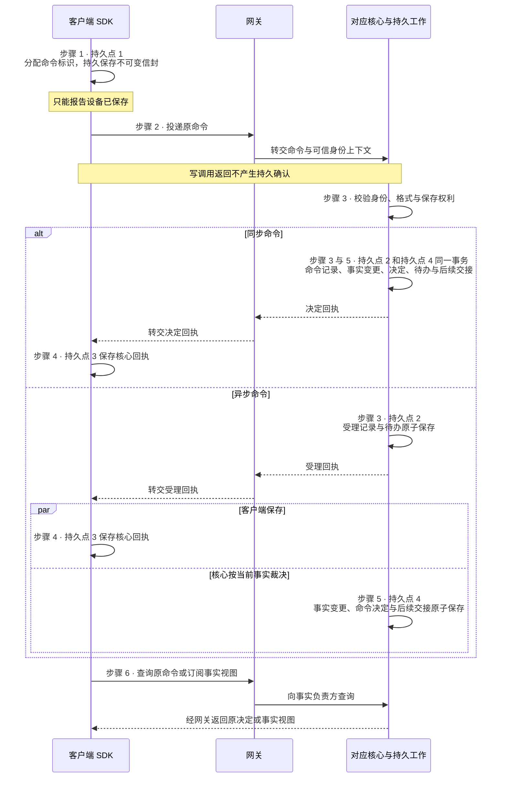

# 网关与 SDK

| 日期 | 修订说明 |
| --- | --- |
| 2026-10-04 | 初版：TLS WebSocket 加一元 HTTP 的连接基线、原命令恢复、快照加重放的视图恢复、应用层流控、端点身份、按用户 cell 的故障域、容量估算方法。 |
| 2026-10-04 | 按 `CLAUDE.md` 写作要求和[文档规范](../../conventions.md)修订用语：约束统一为"必须／不得""建议／不建议"，不再使用"应"；"执行端"统一为"执行端点"，发布回滚统一为"回滚"，授权统一用"撤销"。设计内容不变。 |
| 2026-10-04 | 按[架构评审处理记录](../../../review/archive/round-1/README.md)修订：命令信封、SDK 记录、回执和查询统一引用核心契约的 `CommandIdentity`，补上遗漏的 `issuer_id`（RV1）；区分受理回执与决定回执，查询结果对齐核心契约的五种结果（RV2）。 |
| 2026-10-05 | 本文的局部持久化点由"P1、P2……"改称"持久点 1、持久点 2……"，避免与执行网关的 P1–P8（跨文档说的 P4、P5 都指它）混淆；见[文档规范 5](../../conventions.md#5-写作与链接规则)。含义不变。 |
| 2026-10-05 | 可读性：4.1 增加用户命令持久交接的时序图。规则不变。 |
| 2026-10-05 | "正文已清理、回执已退役"拆为两个独立维度。 |
| 2026-10-05 | 项目目标 10.2 撤销 V2（手机 GUI）后同步：GUI 接入改为 M4 可选。 |
| 2026-10-05 | 模块名称统一为“执行网关”，职责与契约不变。 |
| 2026-10-05 | 模块名称统一为“执行管理”，同步模块简称与图示；存储和连续性语境中的“账本”指其持久执行记录。职责与契约不变。 |

- 状态：草稿
- 负责满足：C5、C6、C7、C8 中的连接、传输和恢复部分；A3、A4
- 涉及场景：S2–S7
- 上游：[项目目标](../../project-goals.md)、[分层与模块](../../layers.md)、[持久工作](../../core/durable/README.md)、[授权](../../core/grants/README.md)
- 首次实现：M3

网关和 SDK 负责端云之间的连接、传输和恢复。它们**不做任何业务判断**：命令的幂等和回执由持久工作保证，动作的效果和重试由执行管理裁决，授权由授权模块裁决。网关只保存**可以全部丢失**的连接状态。

本设计的要点：

- **M3 的连接基线是 TLS WebSocket 加一元 HTTP 接口**；HTTP 加 SSE 或长轮询作为受限网络的回退；原生 gRPC 作为可选的承载；HTTP/3 和 QUIC 推迟到测量证明需要时；
- **SDK 用原命令标识恢复**：重连后先查询原命令，必要时原样重投，不生成新标识；
- **状态视图用"快照 + 增量重放 + 缺口重置"恢复**，视图来自事实的负责方；
- **背压传递到真正的接纳方**：应用层的字节和消息额度，加上核心的接纳限额；
- **按用户归属组织 cell**，网关宿主可以随时替换。

## 1 职责与边界

| 负责方 | 持有或处理 | 分界 |
| --- | --- | --- |
| 网关 | 活跃连接、协议协商、连接额度、短期发送缓冲、连接位置提示 | 不生成业务决定、效果或任务终态；连接状态可以全部丢失 |
| SDK | 原命令的待发记录、已取得的回执、订阅的恢复位置、身份刷新和重连 | 不裁决授权、动作幂等或效果；不自行重试执行适配器 |
| 持久工作 | 命令回执、待办工作、领取、租约、过期领取的隔离 | 网关和 SDK 只用它的公开接口 |
| 会话 | 输入顺序、确认消费、与任务的关联、会话视图 | 传输 ACK、"界面显示过"都不代表用户确认 |
| 任务编排、授权、预算 | 准入、任务控制、权限、预算 | SDK 提交请求，不代替裁决 |
| 执行管理、执行网关 | 动作接纳、尝试、效果、核对和实际出口核验 | 端侧执行必须部署对应的核心；纯 SDK 不得当作执行账本 |
| 内容治理、运行记录 | 内容用途、删除传播、来源和关联轨迹 | 网关和 SDK 的缓存同样受治理 |

网关可以做身份验证、格式校验和资源限流；条件是否有效、授权是否足够、预算是否允许、动作能否重试，都交给对应的核心模块。

**哪些流量算出口。**端云之间的核心契约通信，包括握手、心跳、流控和命令回执，属于[可信基础设施 I/O](../../project-goals.md#3-核心术语)：只能使用固定的身份和固定的目标，不得承载业务载荷。凡是把端侧内容同步到云端的载荷，都必须经过内容治理和授权的同步检查（G8）；业务载荷、遥测和内容上传，都不得借控制通道绕过。

## 2 对象与状态

| 对象 | 关键字段 | 含义与归属 |
| --- | --- | --- |
| 端点绑定 | 用户、端点、密钥引用、凭据代次、状态、版本 | 用户、端点和密钥的绑定；**由授权模块唯一写入**并持久保存 |
| 连接记录 | 连接标识、网关启动标识、连接代次、客户端实例 | 一次连接及其宿主的启动；只在网关内存中，不得作为动作的领取凭据 |
| 连接协商 | 契约版本、能力、限额、认证期限 | 协商契约、可用的传输能力和限额；**不协商降低 G1–G12** |
| 命令信封 | `CommandIdentity`（用户、`issuer_id`、接纳责任域、`command_id`）、方法、目标引用、正文或内容引用、指纹、预期版本、关联标识 | 原命令及其稳定的接纳责任域；连接更替、物理分片迁移、刷新令牌、轮换密钥都不改变它 |
| 身份上下文 | 主体、端点、凭据代次 | 来自经过验证的凭据，不采用正文里自报的用户身份；核心再次验证 |
| SDK 待发记录 | `CommandIdentity`、不可变信封、投递状态、回执引用 | 发送方的持久意图；不保存未获"保存"授权的正文 |
| 核心回执 | `CommandIdentity`、回执种类（受理或决定）、回执引用和版本、决定状态、决定引用 | 由持久工作生成；受理回执不是业务决定；回执不隐含"动作已完成" |
| 订阅记录 | 订阅标识、来源、来源代次、游标、视图版本 | 恢复某个事实来源的视图；游标不表示动作的执行进度 |
| 流控记录 | 连接代次、流标识、字节额度、消息额度 | 当前连接可以接收多少；旧连接的额度不得用于新连接 |

命令的去重范围是核心契约定义的 [`CommandIdentity`](../../core/contracts/README.md#31-命令回执查询通知与错误)，即 `(user_id, issuer_id, target_domain_id, command_id)`。SDK 的主键、查询键、退役记录和数据库唯一键都使用这一类型，不另列字段。`issuer_id` 由认证得到的主体决定，核心核验该主体是否有权使用这个命名空间；SDK 重连、切换网关、重启或轮换密钥后仍使用原 `issuer_id`。两个调用者使用相同的 `command_id` 是两条独立命令。方法、目标和正文属于该命令不可改变的内容，不得随重试改变。

| 对象 | 状态转换 | 约束 |
| --- | --- | --- |
| 连接 | 断开 → 退避 → 建立 → 鉴权 → 恢复 → 就绪 → 排空或断开 | "就绪"只表示传输恢复完成，不保证之后的动作能准入 |
| SDK 命令 | 本地已保存 → 回执待查 → 已受理（异步命令）→ 已取得决定 | 超时停在"回执待查"，不得转成"未执行" |
| 已决定的命令 | 两个独立维度：正文 可用 → 已清理；回执 有效 → 已退役 | 最小去重记录继续阻止重新执行；原决定不会因当前条件变化而重算 |
| 订阅 | 取快照 → 重放 → 跟随；出现缺口 → 重新取快照 | SDK 持久应用了视图之后才推进持久游标 |
| 端点绑定 | 待验证 → 有效 → 撤销 | 密钥轮换通过授权接口和版本检查；旧身份不得自动恢复权限 |

"回执待查"和动作的"效果未知"是两回事：前者是 SDK 还没查清核心是否接纳了命令；后者是执行管理还没确认实际效果。**连接代次**只用来隔离旧的发送缓存、ACK 和额度；业务上对过期领取的隔离由持久工作的租约负责。

## 3 接口

SDK 对调用方提供五类入口：连接、提交、查询、订阅、关闭；退避、投递和恢复都在内部。

| 接口 | 输入 | 成功含义 | 错误 |
| --- | --- | --- | --- |
| 登记、轮换、撤销端点 | 用户认证、密钥证明、原命令标识、预期版本 | 授权模块的持久回执和绑定版本；**不表示获得任何工具权限** | 认证失败、绑定冲突、版本冲突 |
| 建立连接 | 身份凭据或连接票、端点证明、契约版本、客户端实例 | 连接标识、协商结果和限额；只表示连接已认证 | 凭据无效、端点已撤销、协议不兼容、连接数超限 |
| 提交命令 | 不可变的命令信封和当前身份凭据 | 同步命令返回决定回执；异步命令返回受理回执，只表示核心接下了给出决定的责任。界面显示"已提交，等待核验"，决定为接受后才显示"已准入" | 标识与内容冲突、核心不可用；业务拒绝作为核心决定返回 |
| 查询命令 | 原 `CommandIdentity` | 核心契约的五种结果之一：尚未发现、已受理待决定、已有决定、已退役、无法查询；以及可用的回执引用 | 无读取权限（含冒用其他 `issuer_id`）、责任域不可用 |
| 同步执行管理回报 | 原动作、尝试、回报标识、持久证据引用 | 接收方的持久交接回执；不表示任务成功 | 尝试不匹配、没有同步授权、证据冲突 |
| 恢复和订阅 | 来源、原游标、未决命令列表、本机账本记录引用 | 当前授权下的快照、重放位置、缺口或核心的恢复结果；**不创建任务或动作** | 游标过期、来源代次变化、权限变化 |
| 确认接收位置 | 订阅、来源代次、已持久应用的位置 | 更新接收位置；**不代表用户确认或业务完成** | 位置非法、旧代次 |
| 更新信用额度 | 当前连接代次、流、字节和消息额度 | 获得有限的接收能力；**不表示接下了责任** | 旧代次、额度越界 |
| 关闭连接 | 连接标识、原因 | 停止这个连接上的传输；**不取消任务，不封闭动作** | — |

错误信封包含来源（网关、身份认证或某个核心）、错误码、回执引用（只有确实存在核心持久记录时才有）、`retry_after`（**只是传输重试的提示，不是动作重试的许可**）、恢复动作（查询原命令、等待依赖、重新鉴权、重新取快照等）。没有核心回执的断线、超时和 5xx，不得展示为"系统未接纳"。

## 4 关键流程

### 4.1 用户命令的持久交接

| 步骤 | 负责方 | 持久化点与含义 |
| --- | --- | --- |
| 1 | SDK | **持久点 1** 分配命令标识，持久保存不可变信封；只能报告"设备已保存" |
| 2 | SDK、网关 | 投递；写调用返回不产生持久确认 |
| 3 | 对应核心、持久工作 | **持久点 2** 校验身份、格式、保存权利；原子保存唯一的命令记录和待办，然后才返回回执（同步命令为决定回执，异步命令为受理回执） |
| 4 | SDK | **持久点 3** 保存收到的核心回执；之后可以按保留策略释放待发的正文 |
| 5 | 对应核心 | **持久点 4** 本域事实变更、命令决定和后续交接意图原子保存 |
| 6 | SDK | 查询原命令或订阅事实视图；决定不等于动作效果或任务终态 |

同步命令中持久点 2 和持久点 4 合并为一个事务。异步命令的持久点 2 只写受理，持久点 4 按当前事实写决定，见[持久工作 4.1](../../core/durable/README.md#41-首次命令与重复命令)；受理与决定之间撤销授权或预算不足时，持久点 4 写拒绝，受理记录不变。涉及外部效果时，不得把外部调用包进存储事务里假装原子完成，仍然走执行管理。

下图是用户命令六步交接的时序。异步命令中，SDK 保存受理回执（持久点 3）与核心作出决定（持久点 4）是并行的，核心不等 SDK 保存回执才裁决。

### 4.2 云端工作投递到端侧

1. 云端核心保存动作意图和稳定的目标端点，建立待办工作；
2. 网关通知端点来领取；通知丢失时，用有界的补拉恢复；
3. 端侧执行管理持久接纳原意图，然后回执；云端记录交接回执；
4. 端侧执行管理保存执行尝试，执行网关再次核验，然后执行；
5. 端侧执行管理先持久保存回报，再按 R7 同步；
6. 云端保存回报引用和交接回执，用于准入、完成核对和费用处理。

端侧执行管理仍是本机动作效果的事实负责方。连接宿主可以更换，但目标端点和原动作的责任不会因失联而改派。

### 4.3 断线重连与恢复

| 顺序 | 动作 | 保证 |
| --- | --- | --- |
| 1 | 保留原命令、尝试和责任，进入随机的指数退避 | 不创建替代的命令或任务，不用断线推断效果 |
| 2 | 更新身份凭据，重新验证端点状态和契约版本 | 旧的恢复票和旧连接的认证不得代替当前权限 |
| 3 | 核心核对授权、任务控制、条件版本和执行管理进展 | 恢复屏障由核心给出，网关不读业务状态自行判断 |
| 4 | 同步本机已持久保存、当前允许同步的执行管理回报 | 先弄清原尝试，避免推进掩盖未知 |
| 5 | 批量查询"回执待查"的命令 | 已接纳的接着查；尚未看到的可以原样重投；已退役或冲突的停止自动提交 |
| 6 | 从来源的快照和水位恢复订阅 | 有缺口就显式重新取快照；重放时检查当前用途和删除状态 |
| 7 | 端侧持久应用视图并保存位置 | 确认接收位置不消费用户确认，不产生动作 |
| 8 | 核心允许后，恢复工作投递 | 此后每次准入和出口仍重新核验 |

恢复屏障不是一个跨所有事务域的全局快照，它只记录"既定的核对已完成"；之后发生的取消、撤销或条件变化，仍由原子准入和出口核验来阻止。端点在断网期间无法证明当前授权有效时，停止新的出口；已经发出的动作仍保留原责任并记录结果。

WebSocket 规范指出立即反复重连会妨碍服务恢复，建议随机延迟和退避（[RFC 6455 §7.2.3](https://www.rfc-editor.org/rfc/rfc6455.html#section-7.2.3)）。也不得把连接库的"恢复成功"当作业务恢复：Socket.IO 4.8.1 的默认连接恢复适配器用内存 Map 保存会话和消息，而且启用恢复后，默认配置允许恢复成功时跳过中间件（[恢复存储](https://github.com/socketio/socket.io/blob/91e1c8b3584054db6072046404a24e79a17c1367/packages/socket.io-adapter/lib/in-memory-adapter.ts#L409-L458)、[跳过中间件的路径](https://github.com/socketio/socket.io/blob/91e1c8b3584054db6072046404a24e79a17c1367/packages/socket.io/lib/namespace.ts#L343-L350)），这意味着进程重启后无法恢复，恢复时也没有重新鉴权。

### 4.4 背压与流控

| 层次 | 控制方式 | 满额时 |
| --- | --- | --- |
| 单个连接 | 字节、消息数、最大信封、重组后的载荷和解析成本上限 | 停止增加额度；违规就关闭连接 |
| 单个用户 | 连接数、未完成的提交数、订阅数、发送速率 | 公平排队或限流，影响限制在该用户内 |
| 单个网关 | 总缓冲、认证并发、对核心的请求并发 | 拒绝新的连接或提交，已有记录仍可恢复 |
| 核心接纳方 | 待办数量、字节、处理能力 | 核心拒绝或延后接纳，**网关不得提前确认** |
| SDK 和端侧 | 本地存储和待发记录上限 | 不接下无法持久保存的新责任；已有的尝试保留 |

- 读循环持续读取控制帧，不得卡在某个阻塞的核心调用或发送上；
- 控制消息、回执、普通通知分别有有限的缓冲和调度额度；
- 大内容使用引用或有界的分块；
- 只有核心契约声明可以合并的状态提示才能合并；命令、交接回执、删除传播不得按网关的直觉丢弃；
- 撤销授权的通知只用来加快传播，不得代替执行端点的当前授权检查。

只靠 TCP 或 HTTP 的窗口不够：HTTP/2 的流控是逐跳的，仍受 TCP 队头阻塞影响（[RFC 9113 §5.2](https://www.rfc-editor.org/rfc/rfc9113.html#section-5.2)）；gRPC 的写入可能只是进入了框架缓存，双方都只写不读时可能死锁（[gRPC 流控指南](https://github.com/grpc/grpc.io/blob/516c96d2c1c04a141a619b9ffa3c7573ebee4f72/content/en/docs/guides/flow-control.md)）。浏览器的 `WebSocket.send()` 只是入队，`bufferedAmount` 也不包含操作系统的缓存（[WHATWG WebSockets](https://websockets.spec.whatwg.org/commit-snapshots/9879e5cf0d66c66af6990e4c75f72dda794e1b87/)）。**信用额度表示"还能接收多少数据"，持久回执表示"谁接下了责任"**，两者是不同的消息类型。

### 4.5 端点身份

- 有浏览器的应用用授权码加 PKCE 登录；只有输入受限的端点才考虑设备授权流程（[RFC 8628](https://www.rfc-editor.org/rfc/rfc8628.html)），并注意它讨论的设备码钓鱼和暴力猜测风险；
- 建议使用**端点密钥 + 短期身份凭据 + 持钥证明**。HTTP 请求可以用 DPoP（[RFC 9449](https://www.rfc-editor.org/rfc/rfc9449.html)），但 DPoP 定义的是 HTTP 请求的证明，**自定义的 WebSocket 帧认证不得称为标准 DPoP**，连接的绑定必须另外定义；受管理的执行宿主可以用 mTLS 和证书绑定的凭据（[RFC 8705](https://www.rfc-editor.org/rfc/rfc8705.html)）；
- 端点身份表示"已绑定的运行环境和密钥"，不表示物理设备没有被攻陷；
- 插件和外部 Agent 使用各自收缩后的主体和授权，不得继承端点的全部权限。

### 4.6 十万连接与故障域

业务按用户归属分片，连接分配在其归属 cell 的网关池内。连接位置目录保存带网关启动标识的短期记录，失效只影响通知效率；恢复依靠事实来源的持久待办和查询接口。Slack 的做法类似：WebSocket 连接和订阅放在内存网关中，消息路由和在线状态由其他组件负责，并通过 cell 架构隔离可用区的灰色故障（[Slack 实时消息](https://slack.engineering/real-time-messaging/)、[Slack cell 架构](https://slack.engineering/slacks-migration-to-a-cellular-architecture/)）。

| 故障域 | 隔离措施 |
| --- | --- |
| 单个连接或用户 | 独立的配额、有界的队列、公平调度 |
| 单个网关进程 | 不持有唯一的业务事实；限制可承载的连接数；滚动排空 |
| 可用区 | 预留失去一个可用区之后的连接、认证和恢复容量 |
| cell 或用户分片 | 限定用户集合和下游并发；故障不变成全局的重试洪峰 |
| 公共依赖 | 限流、熔断、退避；依赖失效时等待，不产生虚假回执 |

排空时先停止接受新连接，再分批提示重连；网关关闭连接不取消任务。跨区域接入也只能访问该用户原有的写入权威，不得因网络分区新建一个业务主写入方。

**容量估算方法**（以下数字都是待验证的假设，用于说明计算方法）：

| 参数 | 示例 |
| --- | --- |
| 目标连接数 N | 100,000 |
| 单机验证容量 C | 假设 20,000 条连接 |
| 目标利用率 u | 假设 70% |
| 最大故障损失比例 f | 一个可用区，约 1/3 |
| 机器数下界 | ceil(N / ((1−f) × u × C)) = 11；三个可用区均衡部署取 12 台 |
| 正常时 / 失去一个可用区后每台连接数 | 约 8,333 / 12,500 |
| 每连接空闲状态假设 96 KiB | 十万连接约 9.16 GiB，另计内核、代理和运行时开销 |
| 心跳周期假设 60 秒 | 约 1,667 次心跳往返每秒，需要错峰，并测量耗电和代理超时 |
| 一个可用区的 33,333 个连接在 60 秒内恢复 | 平均约 556 次连接恢复每秒；回执查询、重放和身份刷新另算 |

单机容量取内存、文件描述符、CPU、带宽、认证吞吐和下游接纳能力中的最小值，不得只测空闲连接。这里按十万**连接**计算；如果量化目标指的是十万在线**用户**，还要乘以每个用户的设备和客户端实例数。

## 5 故障与恢复

| 情况 | 负责方 | 恢复方式和禁止的推断 |
| --- | --- | --- |
| 接纳回执丢失 | SDK、持久工作 | 查询原命令，必要时原样重投；不生成新标识 |
| 决定已保存，响应丢失 | 持久工作、对应核心 | 返回原决定；当前条件的变化不触发重新裁决 |
| 网关进程崩溃 | SDK、网关池 | 丢弃短期缓冲，重新鉴权、查询、订阅；不得改写业务状态 |
| SDK 进程崩溃 | SDK 的持久记录 | 扫描待发和"回执待查"的记录，先查询再恢复 |
| 端侧执行后崩溃 | 端侧执行管理 | 从已保存的尝试恢复，按能力核对或保持未知；网关不得把它派给别的端点 |
| 同标识不同正文 | 持久工作、核心契约 | 相同命令返回已有记录；同标识不同内容拒绝 |
| 双连接、双设备并发 | 对应核心 | 命令去重、版本检查、确认只消费一次、原子准入；不依赖连接的顺序来解决竞争 |
| 数据库或授权依赖不可用 | 核心、SDK | 不确认接纳，不凭缓存放行新出口；保持"接纳未知"，退避后查询 |
| 位置目录或通知通道不可用 | 网关、持久工作 | 有界补拉；责任仍在持久记录中 |
| 慢客户端、本地存储满 | SDK、网关、内容治理 | 收紧额度；停止新增责任；只合并契约允许合并的提示 |
| 游标过期、历史已清理 | 事实来源、SDK | 显式重新取当前快照；不得假装缺失的事件已被消费 |
| 迟到的效果或费用回报 | 执行管理、预算、任务编排 | 保持与原动作、尝试、计费来源的关联；迟到的通知不得直接覆盖任务终态 |
| 端点被撤销、重装或丢失 | 授权、执行管理 | 不把新身份当作旧执行端点；无法上传时端侧保留记录，云端保持未知 |
| 删除时端点离线 | 内容治理、SDK | 停止使用无法证明仍获准的内容；重连后先清理，再恢复视图 |

## 6 不变量落实

| 不变量 | 本模块怎样保证 | 怎样验证 |
| --- | --- | --- |
| G1 | 区分"接纳待查"和"效果未知"；只重放原交接，不裁决动作重试 | 回执丢失后模拟外部效果已发生，SDK 不产生新动作 |
| G2 | 连接、发送、接纳回执都不映射为完成；只呈现核心的终态和证据 | 接纳成功但效果未知时，不得显示任务成功 |
| G3 | 持久点 1 →持久点 2 →持久点 3；核心持久化之前不确认接下责任 | 在每个持久化点前后断线、杀进程 |
| G4 | 保留原条件、授权、预算的引用；执行端点再次核验 | 旧条件、已撤销的授权、取消竞争都打不开出口 |
| G5 | SDK、网关和端侧执行的出口都纳入执行网关；没有裸执行的旁路 | 出口覆盖检查，注入旁路调用和未获准的内容上传 |
| G6 | SDK 只转交提议和请求，事实由核心裁决 | 伪造"完成""执行成功"的载荷无法直接写终态 |
| G7 | 身份与动作授权分开；扩展的凭据收缩；恢复不继承旧权限 | 插件、子任务、重连的端点越权请求都被拒绝 |
| G8 | 读取、保存、同步、行动分别检查；重放时使用当前权限 | 曾经获准、现已撤销的正文和动作无法被恢复流程使用 |
| G9 | 待发的正文、视图缓存纳入清理；旧事件不得复活内容 | 删除后重放、使用旧快照、恢复离线缓存 |
| G10 | 用量保持原计费来源标识，由预算去重；传输重试不新建费用来源 | 重复、迟到的费用回报只结算一次 |
| G11 | 连接宿主变化不改变动作的执行端点、尝试或任务；领取的隔离在持久工作 | 网关替换、端点失联、工作者接替之后，责任关联不变 |
| G12 | 身份绑定用户；核心再次检查；连接、队列、订阅和资源按用户隔离 | 跨用户的标识碰撞、伪造路由、单用户洪峰 |

## 7 取舍

### 7.1 端云连接的选择

| 候选 | 特点 | 结论 |
| --- | --- | --- |
| **TLS WebSocket + 一元 HTTP** | 持久接纳独立于连接；兼顾浏览器和原生端；需要自己定义信封、额度和恢复 | M3 默认 |
| 原生 gRPC / HTTP/2 | 类型化接口、成熟的双向流和流控；需要协调代理和 keepalive，浏览器接入要适配（grpc-web 2.0.1 只支持一元调用和服务端流，见 [grpc-web](https://github.com/grpc/grpc-web/blob/2.0.1/README.md#streaming-support)） | 原生端优先且已有 gRPC 运维体系时可选 |
| HTTP 一元命令 + SSE / 长轮询 | 上下行分离，兼容路径直接；往返更多 | 受限网络的回退 |
| HTTP/3 或 QUIC 多流 | 可能改善特定弱网场景；需要 UDP 回退和多流调度；0-RTT 有重放风险，状态变更不得进入 0-RTT（[RFC 9001 §9.2](https://www.rfc-editor.org/rfc/rfc9001.html#section-9.2)） | 推迟，测量证明网络迁移或跨流阻塞是主要瓶颈时再引入 |

所有候选都复用同一个持久回执契约；承载方式的切换只改变投递，不改变命令、动作、授权或执行端点。传输层的确认都不等于业务接纳：QUIC 对 STREAM 的 ACK 只要求数据进入待交付队列，不要求应用已经消费（[RFC 9000 §13.1](https://www.rfc-editor.org/rfc/rfc9000.html#section-13.1)）；gRPC-Go 的 `SendMsg` 返回也不等待服务端收到（[grpc-go v1.70.0](https://github.com/grpc/grpc-go/blob/v1.70.0/stream.go#L111-L118)）；gRPC 收到响应头后，该 RPC 就不再重试，所以长流不得依赖内置重试来完成跨连接的恢复（[gRPC 重试指南](https://github.com/grpc/grpc.io/blob/516c96d2c1c04a141a619b9ffa3c7573ebee4f72/content/en/docs/guides/retry.md)）。

### 7.2 其他选择

| 选择 | 得到 | 付出 |
| --- | --- | --- |
| 网关不持有唯一的业务事实 | 任何连接宿主丢失后都能从核心恢复 | 恢复需要查询和持久写入 |
| SDK 只恢复原命令，动作重试留在执行管理 | 守住 G1、G11，避免两套重试决策 | SDK 的恢复流程比连接库默认的重连复杂 |
| 快照 + 重放 + 缺口重置 | 支持长期离线和历史清理 | 来源模块要提供明确的水位和当前权限下的视图 |
| 严格的授权新鲜度 | 不用过期的认知放行新动作 | 离线能力受限 |
| 长期保留最小去重记录 | 防止迟到的命令被再次执行 | 持续的存储成本 |
| 按用户归属隔离故障域 | 限定负载、重连和依赖故障的影响范围 | 路由、迁移和容量规划更复杂 |

被否决：只依赖连接库的 ACK 和重发缓存（不能满足 G3）；网关持久去重并生成业务回执（网关成了第二个事实写入方）；长期的 bearer 凭据（复制即可冒用）；强复制全部连接和重放缓存（增加传输状态的一致性问题，仍然恢复不了已断的底层连接）。

稳定的命令作用范围、回执清理规则、端点身份的归属，正式采纳前必须写成 ADR。

## 8 待定事项

| 事项 | 前提 |
| --- | --- |
| 规范化指纹、回执状态、旧命名空间的关闭、兼容错误 | 核心契约与持久工作共同定义 |
| 快照水位、历史窗口、删除过滤、游标失效 | 会话、内容治理和其他事实负责方提供 |
| WebSocket 在目标浏览器、代理和移动网络下是否足够稳定 | 目标环境的互操作和弱网测试 |
| 示例中的连接容量、内存、心跳和恢复速率是否可行 | 连同核心、认证和存储一起压测 |
| 浏览器存储能否支撑声明的本地恢复等级 | 浏览器存储默认是"尽力而为"，存储压力下可能被清理，persistent 模式仍允许用户清理（[WHATWG Storage](https://storage.spec.whatwg.org/commit-snapshots/1933f424de8d0b2d1073e10f3fb77bd12b11efca/)）；做存储清理、崩溃、配额和用户清除测试 |
| 密钥轮换、连接票消费、WebSocket 的持钥绑定 | 安全专题固定证明格式、信任链和失效规则 |
| cell 数量、区域归属、存储副本和分片迁移 | 数据驻留、容量和写入权威的要求明确 |

## 9 M1 范围

**M1 不交付网关。**M1 为将来的 SDK 保留正式的核心接口（命令标识、持久回执、原命令查询、待办工作和租约；同进程也按 R7 交接），但不实现 WebSocket、设备配对、连接目录、网络心跳、十万连接或多区域排空。M1 的持久回执不得用进程内队列、回调或函数返回值代替。

| 阶段 | 完成内容 |
| --- | --- |
| M3 | 最小网络客户端、网关、端点认证、重连核对、流控、端侧执行管理；S4。GUI 接入随 GUI 适配器在 M4 可选交付（S3） |
| M4 | 完整的扩展 SDK、能力声明、公共接口接入和兼容验证 |
| M6 | 用户隔离、cell、容量、可用区故障和恢复洪峰的实测 |

## 10 测试要点

一致性测试从公开接口观察行为，同时适用于默认实现、后续的 SDK 和不同的协议承载。

| 用例 | 注入 | 必须观察到 | 对应 |
| --- | --- | --- | --- |
| 持久确认的边界 | 在持久点 1、持久点 2、持久点 3 前后分别崩溃 | 没有提前确认；恢复后能找到原命令，或明确处于待查 | G3、R7 |
| 回执丢失与并发重投 | 核心提交后丢弃全部响应，从多个连接重投 | 一条命令记录、一个决定；没有新增的动作意图 | G3、G11 |
| 标识冲突 | 同标识改变方法、目标、正文或契约解释 | 明确冲突，原决定不变 | A4、R3 |
| 命令身份范围 | 两个 issuer 使用相同 `command_id`；轮换凭据后查询；冒用其他 issuer | 两条独立命令互不覆盖；轮换后找回原决定；冒用被拒绝 | G3、G12 |
| 受理与决定 | 异步命令受理后、决定前反复崩溃；期间撤销授权 | 一个受理、一个决定；可以拒绝；SDK 不把受理显示为已准入 | G3、G4 |
| 决定不可重算 | 命令被持久拒绝后条件改变，再重投原命令 | 返回原拒绝 | G3、G4 |
| 未知外部效果 | 模拟 API 已生效，回报之前断线或崩溃 | 不幂等且不可查询的保持未知；可查询或幂等的由执行管理恢复 | G1、G11 |
| 授权变化与重连 | 撤销之后重连、使用旧的恢复票、依赖不可用 | 不得恢复旧权限；无法证明当前授权时停止新出口 | G7、G8 |
| 游标与快照故障 | 快照之后产生更新；在保存视图和游标之间崩溃 | 不会永久漏掉更新；允许重复通知，但不重复消费确认 | C5、C6、G3 |
| 删除与重放 | 删除正文后恢复旧快照、旧事件和待发队列 | 内容不复活；去重仍有效 | G8、G9 |
| 长期离线与回执清理 | 完整回执清理后重投旧命令，包括时钟偏差 | 旧命令被识别为已退役或无效，不重新执行 | G3、G11 |
| 双连接与旧代次的消息 | 新连接就绪后送入旧的 ACK、额度和关闭事件 | 不增加新连接的额度，不误删新的位置记录 | A4、G11 |
| 背压与存储满 | 双向持续写、慢读、超大信封、端侧存储满 | 缓冲有界，读循环存活；不确认未持久的责任 | G3、G12 |
| 跨用户攻击与洪峰 | 相同的业务标识、伪造的用户字段、单用户极端负载 | 没有跨用户的读写；其他用户的正确性不受影响 | G12 |
| 承载一致性 | 在 WebSocket、HTTP 回退和 gRPC 上执行同样的故障脚本 | 回执、错误、幂等范围和恢复结果一致 | A4、C6 |
| 故障域与重连洪峰 | 十万连接下杀网关、断开一个可用区、停掉位置目录或认证依赖 | 责任不丢；重试受限；记录峰值队列、恢复时间和核心负载 | G3、G11、G12 |

容量验收要包括空闲连接、活跃任务、慢客户端、认证刷新、重放积压和故障恢复的混合负载。正确性判据至少包括：零虚假的持久确认、零错误的重复决定、零跨用户访问，所有未知的动作都能追溯。

## 参考资料

- RFC 6455（WebSocket）：https://www.rfc-editor.org/rfc/rfc6455.html ；RFC 9113（HTTP/2）：https://www.rfc-editor.org/rfc/rfc9113.html ；RFC 9000（QUIC）：https://www.rfc-editor.org/rfc/rfc9000.html ；RFC 9001：https://www.rfc-editor.org/rfc/rfc9001.html ；RFC 9114（HTTP/3）：https://www.rfc-editor.org/rfc/rfc9114.html
- WHATWG WebSockets（固定快照）：https://websockets.spec.whatwg.org/commit-snapshots/9879e5cf0d66c66af6990e4c75f72dda794e1b87/ ；WHATWG Storage（固定快照）：https://storage.spec.whatwg.org/commit-snapshots/1933f424de8d0b2d1073e10f3fb77bd12b11efca/
- grpc-go v1.70.0 stream.go：https://github.com/grpc/grpc-go/blob/v1.70.0/stream.go ；gRPC 指南（固定提交）：[重试](https://github.com/grpc/grpc.io/blob/516c96d2c1c04a141a619b9ffa3c7573ebee4f72/content/en/docs/guides/retry.md)、[流控](https://github.com/grpc/grpc.io/blob/516c96d2c1c04a141a619b9ffa3c7573ebee4f72/content/en/docs/guides/flow-control.md)、[keepalive](https://github.com/grpc/grpc.io/blob/516c96d2c1c04a141a619b9ffa3c7573ebee4f72/content/en/docs/guides/keepalive.md)；grpc-web 2.0.1：https://github.com/grpc/grpc-web/blob/2.0.1/README.md
- Socket.IO 4.8.1（固定提交）：https://github.com/socketio/socket.io/tree/91e1c8b3584054db6072046404a24e79a17c1367
- OAuth：[RFC 8628](https://www.rfc-editor.org/rfc/rfc8628.html)、[RFC 9449](https://www.rfc-editor.org/rfc/rfc9449.html)、[RFC 8705](https://www.rfc-editor.org/rfc/rfc8705.html)、[RFC 9700](https://www.rfc-editor.org/rfc/rfc9700.html)、[RFC 7009](https://www.rfc-editor.org/rfc/rfc7009.html)、[RFC 7662](https://www.rfc-editor.org/rfc/rfc7662.html)
- Slack Engineering：[Real-time Messaging](https://slack.engineering/real-time-messaging/)、[Cellular Architecture](https://slack.engineering/slacks-migration-to-a-cellular-architecture/)
