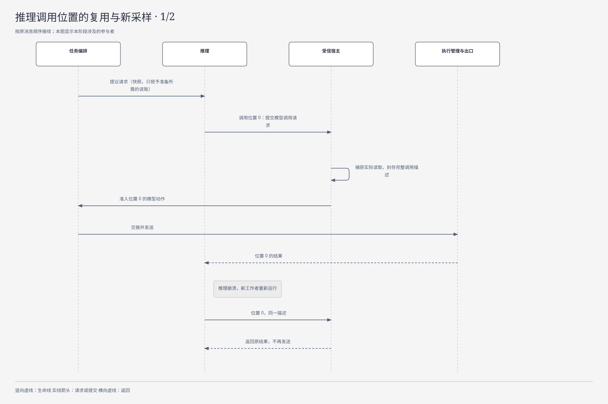
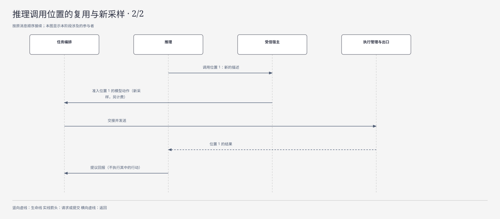

# 推理（接口约定）

| 日期 | 修订说明 |
| --- | --- |
| 2026-10-07 | Mermaid 图按 diagram-design 默认样式重绘为 SVG，正文嵌入图片；HTML 源图同名保存，长时序与分支拆图。节点、关系与设计规则不变。 |
| 2026-10-04 | 初版：上下文快照、四类提议、有限计划、提议请求的生命周期、接口与错误、一次调用的计数口径。 |
| 2026-10-04 | 按 `CLAUDE.md` 写作要求和[文档规范](../../conventions.md)修订用语：约束统一为"必须／不得""建议／不建议"，不再使用"应"；"执行端"统一为"执行端点"，发布回滚统一为"回滚"，授权统一用"撤销"。设计内容不变。 |
| 2026-10-04 | 按[第二轮评审处理记录](../../../review/archive/round-2/disposition.md)修订：`Propose` 的句柄改为模型调用请求接口，每次提交固定的完整调用描述、等待核心准入，统一"先固定输入再准入"的时序（R2-05）；有限计划的 `arguments` 只允许具体值，后续候选步骤在前序结果接纳后再准入（R2-06）。 |
| 2026-10-04 | 按[第三轮评审处理记录](../../../review/archive/round-3/disposition.md)修订：模型调用按"提议请求 + 调用位置"标识和恢复（R3-04）；快照携带未处理的输入和本次允许的用途（R3-01）。 |
| 2026-10-04 | 按[第四轮评审处理记录](../../../review/archive/round-4/disposition.md)修订：`limits` 拆分为调用位置上限和实际发送上限（R4-03）。 |
| 2026-10-05 | 本文的局部持久化点由"P1、P2……"改称"持久点 1、持久点 2……"，避免与出口闸门的 P1–P8（跨文档说的 P4、P5 都指它）混淆；见[文档规范 5](../../conventions.md#5-写作与链接规则)。4.1 增加多次模型调用与按位置恢复的时序图。含义不变。 快照字段 `control_revision` 改名 `control_generation`，与核心契约一致；区分三种"再来一次"；M1 的调用上限写明为一个调用位置、发送上限默认为 1。 |
| 2026-10-05 | 第 4 节开头链接新的[流程：模型调用](../../flows/model-call.md)。 |
| 2026-10-05 | 提议载荷字段 `payload` 改为 `body`；状态表中的模型尝试、提议、摘要标明为展示或推导值；2.2 写明哪些字段只在核心内部使用。 |
| 2026-10-05 | 模块名称统一为“执行网关”，职责与契约不变。 |
| 2026-10-05 | 模块名称统一为“执行管理”，同步模块简称与图示；存储和连续性语境中的“账本”指其持久执行记录。职责与契约不变。 |
| 2026-10-05 | 模块名称由执行网关改回出口闸门，避免与网关与 SDK 撞名；恢复被改写的历史修订行；职责与契约不变。 |
| 2026-10-06 | 按[第五轮评审处理记录](../../../review/disposition.md)修订：模型结果未知对任务完成的影响（X-01）；提问时"是否改变依据"由核心判定（X-14）；供应商编码属于受信实现（X-08）；条件核验约定改为引用任务编排 2.2（RS-05）。 |

- 状态：草稿
- 负责满足：C1；协同 C2、C3、C5、C7、C8
- 涉及场景：S1–S8；M1 重点 S2、S7
- 上游：[项目目标](../../project-goals.md)、[分层与模块](../../layers.md)、[核心契约](../../core/contracts/README.md)、[任务编排](../../core/tasks/README.md)
- 默认实现：[default.md](default.md)

推理是 Lerna 中"想"的那一部分：理解目标、选择能力、制定和调整计划、综合材料，然后给出一个**提议**——做一个动作、修改条件、问用户一个问题，或者判断任务已经完成。它不持有任务、效果、授权或预算的任何权威事实，提议也不是授权。

本接口的核心约定：

- **核心固定事实，推理构造视图。**任务编排固定上下文快照（目标、条件版本、进展、能力目录版本）；推理只能选择和排布这些材料，不得改写它们；
- **推理返回结构化的提议**，与具体供应商的格式无关；模型原生的工具调用只是生成手段，所有调用描述都先转换为提议，**推理自己没有工具执行入口**；
- **多步循环由任务编排驱动。**每次提议请求发出的每一次实际模型调用，都要在发出前由核心准入；默认实现每次请求至多一次；
- **推理的私有状态可以全部丢弃。**恢复只依据核心记录。

## 1 职责与边界

| 职责 | 负责方 | 与推理的关系 |
| --- | --- | --- |
| 固定目标、条件版本、任务控制和进展快照 | 任务编排 | 推理读取，返回提议 |
| 消息顺序、用户的答案和确认 | 会话 | 推理提供问题内容；不得制造用户确认 |
| 当前授权、只读检索凭据、模型出口凭据 | 授权 | 推理只能在签发的范围内使用 |
| 调用上限、费用上限、用量结算 | 预算 | 推理回报用量引用，不得改余额 |
| 模型和工具的尝试、效果、核对 | 执行管理、出口闸门 | 推理不直接派发执行适配器 |
| 内容版本、用途、来源、派生和删除 | 内容治理 | 提议、摘要、缓存和模型输入都受治理 |
| 请求、回执、领取与租约 | 持久工作 | 推理工作者可以被替换，原责任记录保留 |

依赖规则的落实：行动提议回到任务编排（R1）；模型调用、检索引发的外部请求和辅助调用都经过出口闸门（R2）；推理唯一能直接访问的其他可替换部分，是凭有效的只读检索凭据查询记忆策略（R4）；推理实现只依赖核心契约（R6）；跨域的请求和回报按 R7 交接。

## 2 对象与状态

### 2.1 上下文快照

| 字段 | 含义与约束 |
| --- | --- |
| `snapshot_id`、`digest` | 快照标识和完整性摘要；同一标识不得对应不同的材料 |
| `user_id`、`task_id` | 隔离和关联范围，由宿主绑定 |
| `goal_ref` | 用户目标的内容版本引用 |
| `requirements_version`、`requirements[]` | 当前条件集版本；每条条件的标识、是否必要、描述和证据要求 |
| `input_version`、`control_generation` | 任务输入版本和控制代次（与核心契约同名） |
| `unprocessed_inputs[]`、`allowed_purposes` | 已接纳但尚未处理的、会改变任务依据的输入，以及核心按持久来源指定的本次请求用途。有未处理输入时，用途只包括解释输入、整理条件、澄清和收尾，推理的普通行动提议和完成判断会被拒绝（见[任务编排 2.2](../../core/tasks/README.md#22-条件证据与提议)） |
| `progress[]` | 已准入的动作、已确定的效果、**未知的效果**、待核对事项、此前提议的采纳情况 |
| `progress_watermarks` | 各个跨域回报已经纳入快照的序号；**还没收到回报不等于没有执行** |
| `content_refs[]` | 实际观察、工具结果、证据和相关用户消息的不可变版本引用 |
| `capabilities` | 能力目录版本、目录概览、候选能力的详情、能力版本和参数 Schema 摘要 |
| `retrieval_credential_ref` | 限定用户、任务、用途、资源和期限的只读凭据；可以为空 |
| `history_view` | 最近的完整交互、摘要引用、覆盖区间和省略说明 |
| `limits` | 截止时间、输入输出限制、**调用位置上限**、**实际发送上限**、计划长度上限、费用约束。两个调用上限分开计算：新位置的模型动作准入时占用一个位置，重取已有位置的结果不占用；每个新的发送身份（包括执行管理批准的安全重发）在出口 P4 占用一次发送额度，查询或重投同一发送不占用。M1 两个上限都是 1；需要安全重发时，核心事先分配额外的发送额度，G1 的重发许可本身不扩大次数或金额 |

**快照固定的是材料版本和事实依据，不是一份永久有效的授权。**凭据放在调用控制信息里，不进入模型能看到的文本；模型供应商的密钥由出口闸门持有。快照不要求所有模块参与一个全局事务：跨域材料使用不可变的版本引用和回报序号，明确标出哪些回报尚未纳入；准入和完成时仍会检查当前事实。

如果某份材料只允许读取、不允许保存，就只记录经授权的最小责任元数据和引用，不强制保存原文。材料消失后可能无法重建原来的输入，此时明确返回"上下文不可恢复"，不得用旧缓存补回。

### 2.2 提议请求

本表是核心保存的提议请求记录。`Propose` 实际收到的是其中的快照引用、限制和模型调用请求接口（见第 3 节）；`claim_epoch`、`outcome_ref`、`superseded_by` 只在核心内部使用。

| 字段 | 含义与约束 |
| --- | --- |
| `request_id` | 核心生成的命令标识；重复投递使用原标识 |
| `snapshot_id`、`snapshot_digest` | 绑定不可变的输入 |
| `planning_generation` | 规划代次；被替代的代次不得推进任务 |
| `reasoner_version`、`prompt_version`、`model_policy_ref` | 固定本次的实现、提示和模型策略 |
| `model_operation_refs[]` | 本次请求中已准入的模型调用，按**调用位置**索引：位置、封存的调用描述摘要、核心命令、模型动作、结果引用。位置的分配、位置上限的占用和动作关联在同一裁决事务中完成；位置数不超过调用位置上限 |
| `claim_epoch` | 当前领取代次；过期的工作者不得覆盖新的控制状态 |
| `status`、`outcome_ref`、`superseded_by` | 请求的生命周期、持久回报和替代关系 |

同一 `request_id` 但输入摘要不同，报标识冲突，不当作新请求执行。

### 2.3 提议的四种类型

公共字段：`proposal_id`、`request_id`、`snapshot_digest`、`requirements_version`、`kind`、`basis_refs[]`（判断依据和证据引用）、`gaps[]`（明确的缺口）、`body`（按类型的载荷，即核心契约 Proposal 的 `body`）、`implementation_metadata`（推理、提示、模型和转换规则的版本）。

| 类型 | 关键载荷 | 核心怎样处理 |
| --- | --- | --- |
| 行动 | 有限计划、能力引用、参数、预期的观察、依赖 | 验证并准入；每一步生成一个动作意图 |
| 修改条件 | 原条件版本、修改内容、原因、影响范围 | 按用户控制规则批准后发布新版本；旧提议作废 |
| 向用户提问 | 问题、选项或输入要求、要补充的条件、是否涉及确认；可以建议"答案是否改变任务依据" | 会话持久建立输入请求；答案按请求标识投递。"是否改变依据"缺省为改变，由核心的受信规则判定，推理的建议只能让判定更严格（[任务编排 2.2](../../core/tasks/README.md#22-条件证据与提议)） |
| 完成判断 | 每条必要条件的判断（满足、未满足、未知）及对应证据、结果草稿、遗留的不确定项 | 按当前事实执行完成门禁 |

一次提议只有一个主类型。条件修改不会和旧条件下的行动一起生效；问题文本不充当授权凭据；结果草稿不是任务的 Result。完成判断必须**逐条**对应条件和证据，"已经做了很多"不满足 G2。Anthropic 在长任务实践中观察到两类失败：一次做太多、留下半成品；后续实例看到已有进展就宣布完成（[长任务 Harness 实践](https://www.anthropic.com/engineering/effective-harnesses-for-long-running-agents)）。逐条对应正是为了防止后一种。

### 2.4 有限计划

| 字段 | 约束 |
| --- | --- |
| `steps[]` | 数量不超过核心配置的上限（M1 为 1） |
| `step_id` | 计划内唯一；核心据此稳定地映射到动作意图 |
| `capability_ref`、`version`、`schema_digest` | 精确绑定能力的参数约定 |
| `arguments` | 只允许具体值。依赖前序输出的步骤写成后续候选步骤，由核心在前序结果接纳后构造具体参数并另行准入（见[任务编排 4.3](../../core/tasks/README.md#43-有限计划)） |
| `depends_on[]` | 无环依赖；依赖一个效果未知的步骤，不得视为依赖已满足 |
| `preconditions` | 可以核验的前提：条件版本、资源状态、所需的观察 |
| `expected_evidence` | 期望取得的证据形式，不是已经存在的证据 |
| `valid_until` | 计划有效期；到期后未发出的步骤停止推进 |

核心可以一次准入多步，但必须同时证明每一步的资源、权限和费用范围。如果后续步骤的资源取决于一个未知的观察，只准入已知的前缀。ReWOO 把规划、工具执行和求解分成三个阶段，但作者也指出，环境先验不足时，规划者可能需要枚举大量可能路径（[ReWOO §2、§4](https://arxiv.org/html/2305.18323v1)）。所以有限计划只适合路径和资源范围已知的工作，动态探索仍然要在观察之后重新提议。

### 2.5 用量与派生内容

| 对象 | 关键字段 | 权威来源 |
| --- | --- | --- |
| 用量回报 | 尝试标识、供应商请求标识、计量来源、输入、输出、缓存和推理用量、费用单位、暂估或最终或未知 | 出口闸门取得的供应商回报，由预算对账 |
| 历史摘要 | 来源内容版本、覆盖区间、未覆盖区间、摘要版本、生成实现版本、有效状态 | 来源和有效性归内容治理 |
| 实际模型输入 | 基础快照、补充检索引用、模型视图版本、完整的父内容集合 | 内容治理登记，用于撤回传播和诊断 |

提议响应只返回用量记录的引用和已知用量；模型自己生成的数字不参与结算。用量缺失时标为未知，不得填零。

### 2.6 状态

| 对象 | 状态转换 | 负责方 |
| --- | --- | --- |
| 提议请求 | 待处理 → 求解中 → 已回报 → 已结束（原因：已接纳、失效、错误、停止采纳） | 持久工作、任务编排 |
| 模型尝试 | 已准入 → 已持久记录"可能已发出" → 完整回报 / 确定未发出 / 结果未知（流程展示；底层分别是动作、尝试阶段和效果三个维度，见核心契约 2.5） | 执行管理、出口闸门 |
| 提议 | 已接收 → 有效 → 已裁决；条件变化、请求被替代或内容失效会使它作废（提议内容不可变；这里的状态由接收、有效性检查和裁决等独立记录推导） | 任务编排 |
| 摘要或缓存 | 有效 → 失效 → 清理中 → 已清理（这是内容治理的发布、使用、清理三个维度的组合展示，见[内容治理 2.4](../../core/content/README.md#24-清理记录与状态)） | 内容治理和实际持有方 |

**"停止采纳""供应商停止执行""费用已结算"是三个独立的事实**，不得用一个"已取消"状态覆盖它们。

## 3 接口

推理的计算接口保持很小；持久接纳、查询和控制由核心提供。接口的机器定义属于核心契约。

| 接口 | 输入 → 输出 | 成功含义 | 错误与幂等 |
| --- | --- | --- | --- |
| `DescribeReasoner` | 契约版本 → 支持的输入、提议类型、模型调用限制、实现版本 | 可以判断兼容性；不代表模型依赖可用 | 查询幂等 |
| `Propose` | 提议请求、快照、模型调用请求接口 → 提议或错误、用量引用、实际输入引用 | 得到一次求解的回报；**不意味着行动获准或任务完成** | 计算本身不保证相同输出；核心的包装保证重复投递不会重复发起模型调用 |
| `SubmitProposalOutcome`（核心） | 原请求标识、代次、提议或错误、用量引用 → 持久回执 | 核心已保存回报和关联，可以恢复查询 | 同标识同载荷幂等，不同载荷冲突；过期的结果不推进任务 |
| `QueryProposalRequest`（核心） | 原请求标识 → 状态、回执、回报引用 | 读到已提交的接纳结果 | 查询幂等 |
| `StopProposalRequest`（核心） | 原请求标识、控制命令标识 → 控制回执、实际执行状态 | 停止新的推进决定已持久化 | 命令幂等；**不保证已发出的模型请求停止计费** |
| 内容失效通知 | 内容标识、版本、失效修订 → 清理回报 | 持有方已完成对应的缓存清理 | 重复通知幂等；即使通知缺失，使用时的检查仍会拒绝失效内容 |

`Propose` 收到的是一个**模型调用请求接口**，不是已获准的发送凭据。推理每需要一次模型调用，就通过它提交一个调用请求；受信宿主捕获推理实际读取的全部材料，核验任务编排固定的必要事实没有被裁掉，由受审查的供应商编码实现（受信实现，代码位置见[开发规范 2](../../../development.md#2-目录骨架)）生成完整、固定的调用描述（模型、参数、工具声明、输出上限、全部实际输入的引用、规范化摘要）；核心对这个描述准入后才发送，推理等待结果。推理不能只提交一份自报的输入摘要。

**调用位置。**每次模型调用的逻辑身份是"提议请求 + 调用位置"。位置是推理在提交时给出的协议序号，不是代码行号；领取代次、进程标识和重试次数都不改变它。M1 只有位置 0。

| 情况 | 结果 |
| --- | --- |
| 同位置、同描述 | 返回原准入状态或原结果，不再发送；任一上限已满时也返回原结果，不报"上限耗尽" |
| 同位置、不同描述 | 报冲突 |
| 不同位置、同描述 | 两次独立采样，分别准入和计费 |

返回原结果前重新检查内容许可；原结果已被删除或不允许保存时，如实报告不可恢复，不从私有缓存补回，也不重新调用模型冒充原结果。推理无法重现相同的位置和描述时，返回"准备不可恢复"，由核心决定是否建立新的提议请求。执行管理按 G1 进行的物理安全重发与推理请求的新采样分别记录，费用和次数不合并。

推理不得自行提高次数和费用上限，也不得借这个接口调用其他出口。三种"再来一次"要分开：崩溃后按原调用位置拿回原结果，不新准入；执行管理按 G1 安全重发，沿用原动作，重新通过开始门禁并占用发送额度；补充材料、换模型或新的采样，使用新的调用位置并重新准入。这样一次提议可以按需多次调用模型（例如先检索、再生成），每次的准入依据都与实际发送一致。

**"一次实际模型调用"的计数口径**：出口闸门发出的一次、可能单独产生费用的供应商请求。重试、降级、摘要、修复和评审都分别计数；不按 SDK 函数的调用次数计，也不承诺供应商内部只运行一次推理。这个口径很重要：Codex 的一个用户回合中，可能包含流断开后的模型重试和自动的上下文压缩调用（[Codex v0.46.0](https://github.com/openai/codex/blob/b650f912c50ce4ce0a23b877aa8b1174878c30e2/codex-rs/core/src/codex.rs#L1670)）；Claude Agent SDK 的一次 `query()` 会运行完整的模型与工具循环（[Agent loop](https://code.claude.com/docs/en/agent-sdk/agent-loop)）。这些都不得拿来计算预算或执行次数。

| 错误 | 含义与处理 |
| --- | --- |
| 契约或能力不兼容 | 不调用模型；由核心选择兼容的实现，或报告缺口 |
| 上下文不足 | 返回缺少的材料或能力详情；核心补充后建立新请求 |
| 上下文过大 | 确定性裁剪后仍放不下；不临时增加摘要调用 |
| 凭据过期、授权撤销、内容失效 | 停止依赖该材料的新使用；重建快照 |
| 预算不足、调用次数耗尽 | 不发出新调用；等待核心调整 |
| 依赖不可用 | 报告是哪个依赖，以及是否能确定未发出；重试由核心决定 |
| 模型结果未知 | 保留原尝试记录；输出状态和用量状态分别核对。模型调用的能力有证据为"无外部效果"时，原动作凭执行管理的无外部效果封闭收尾，不阻止新的准入，也不阻止任务成功；未取得这类证据的模型能力，未知会阻止完成门禁（[核心契约 2.6](../../core/contracts/README.md#26-四道门禁)） |
| 拒绝、输出不完整、格式或语义非法 | 返回明确的错误和已有的用量；**不在内部自动再次调用模型修复** |
| 请求、快照或领取代次已失效 | 回报可以留作记录，用量照常接收；不得采纳其中的行动 |
| 持久接纳失败 | 不返回接纳成功；重发原回报或查询原交接 |

结构化输出只解决格式问题。OpenAI 的文档说明，结构化输出仍可能包含错误，需要处理拒绝和不完整的响应（[Structured Outputs](https://developers.openai.com/api/docs/guides/structured-outputs)）。授权、参数语义和完成证据必须另外核验。

**幂等的边界**：同一请求只产生一个核心接纳决定；同一提议步骤只生成一个动作意图。这不等于供应商或目标系统恰好执行一次。

## 4 关键流程

一次模型调用跨越任务编排、推理、出口闸门、执行管理和预算，跨模块的完整经过和恢复入口见[流程：模型调用](../../flows/model-call.md)。

| 步骤 | 处理 | 持久化点 |
| --- | --- | --- |
| 1 | 任务编排读取目标、当前条件、控制和进展；内容治理过滤出允许使用的材料；固定能力目录版本 | **持久点 1**：快照清单、版本依据、提议请求、待办工作 |
| 2 | 推理工作者领取请求，构造模型视图；需要只读检索时，凭 R4 凭据取得带来源的结果。通过模型调用请求接口提交调用；受信宿主封存完整、固定的调用描述 | **持久点 2**：登记实际输入和补充内容的派生关系，固定调用描述；没有保存授权的原文不落盘 |
| 3 | 核心对这个确定的调用描述检查当前条件、控制、授权、材料用途和预算，准入这次模型出口。此前推理没有模型发送资格 | **持久点 3**：模型动作意图、授权依据、预算预留、待办；追加到 `model_operation_refs[]` |
| 4 | 执行管理持久接纳；出口闸门在实际出口再次核验，发送前记录"可能已发出" | **持久点 4**：尝试和消费状态；之后才发送 |
| 5 | 取得完整响应或错误；出口闸门记录供应商回报、用量和未知项 | **持久点 5**：尝试回报和用量观察；不等提议成功才记账 |
| 6 | 推理在本地解析和校验提议，**不执行其中的行动**；输出作为派生内容登记 | **持久点 6**：核心持久接纳提议回报，然后确认收到 |
| 7 | 任务编排检查请求代次、条件版本和材料当前的有效性，决定行动、修改条件或提问 | **持久点 7**：裁决和逐步的动作意图；跨域派发遵守 R7 |
| 8 | 执行管理执行、收尾或核对；任务编排根据新进展固定下一份快照 | 回到步骤 1 |
| 9 | 收到完成判断后，核心检查全部必要条件和全部已准入动作的收尾情况 | **持久点 8**：门禁通过才写入 Result 和终态 |

下图展示一次提议请求中两次模型调用的经过，以及推理崩溃后怎样按调用位置拿回原结果：

调用位置复用与下一位置的新采样按阶段拆成两图，后一图接续前一图。

推理需要再调用一次模型时，重复步骤 2 到 5。崩溃后无法重建相同的调用描述时，结束原准备并建立新的准备，不修改已准入动作的载荷。

请求回执丢失时查询持久点 1；模型的发送结果不明时查询持久点 4、持久点 5；提议接纳回执丢失时查询持久点 6。不得新建一个标识来绕过原记录。

## 5 故障与恢复

| 故障 | 负责方 | 恢复方式 |
| --- | --- | --- |
| 回执丢失 | 持久工作、任务编排 | 用原请求或回报标识查询；重新提交原交接，不新建模型调用 |
| 推理进程崩溃 | 持久工作、任务编排 | 新工作者读取原请求，重新运行推理。走到已有调用位置时，按同位置、同描述拿回原结果；已标记"可能已发出"的，先查原尝试；不得因缓存消失就直接重发。也可以由推理把受治理的显式继续状态交还核心，再从该状态继续。无法重现位置和描述时返回"准备不可恢复" |
| 出口进程崩溃 | 执行管理、出口闸门 | 发送标记之前、能证明未发出的，按记录继续；标记之后崩溃的保持未知，包括"记录了但实际没发"的保守情况 |
| 重复请求 | 持久工作、出口闸门 | 同请求同摘要返回原状态；同标识不同摘要报冲突；已消费的单次模型出口不得再次消费 |
| 并发冲突 | 任务编排 | 比较条件版本、任务控制、有效的请求代次和相关进展；过期的提议作废；有限计划的每一步在实际出口再检查 |
| 依赖不可用 | 任务编排、授权、预算、内容治理 | 前提无法证明时，关闭依赖它的新调用；依赖恢复后重新核验 |
| 迟到的结果 | 出口闸门、预算、任务编排 | 原尝试的回报和费用照常接收；已取消、被替代或过期的提议不推进任务 |
| 内容撤回或删除 | 内容治理、授权、推理的持有方 | 阻止新的使用；让关联的输入、摘要、缓存和供应商侧不透明状态失效；迟到的输出登记派生关系后不得使用 |
| 条件变化 | 任务编排 | 发布新版本，旧提议作废；未发出的步骤在出口被拒绝；已发出的动作继续收尾 |
| 私有会话或缓存丢失 | 任务编排、内容治理 | 从允许使用的核心记录重建；不要求输出相同，只要求权威事实和行为约束相同 |
| 用量回报缺失或更正 | 预算 | 保持未知或暂估的上界；按原尝试和计费来源对账，不把未知当零，也不把暂估和最终值重复相加 |

核心可以决定重新求解，但要建立一个**明确关联原请求的新提议请求和新的模型动作**，并重新准入。原模型动作仍由原记录负责核对和结算，不会因为新请求而消失。

## 6 不变量落实

| 不变量 | 本接口怎样保证 | 怎样验证 |
| --- | --- | --- |
| G1 | 快照保留未知效果；模型超时不改写为未执行；推理无权决定有副作用的重试 | 注入"发送后断线"，让模型提议重试；核心保留原未知动作并执行重试门禁 |
| G2 | 完成判断逐条引用条件和证据；核心按当前记录验证，模型的置信度不算证明 | 缺一条必要条件、伪造证据或存在未收尾动作时拒绝成功 |
| G3 | 请求、模型意图、回报和提议接纳各有持久化点 | 在各写入和回执之间崩溃，查询原记录恢复 |
| G4 | 模型调用和计划中的每个动作都绑定条件、授权和预算；出口处复核 | 无凭据调用、条件更新与发送竞争、计划后续步骤权限失效，都被拒绝 |
| G5 | 默认实现只使用模型调用请求接口；重试、摘要、修复、检索引发的外部调用全部计量 | 用模拟出口统计全部实际调用；尝试 SDK 自动重试和直接网络旁路 |
| G6 | 四类输出都无权直接修改任务、授权、效果或完成状态 | 恶意提议自称已授权或已完成，仍无法改变核心事实 |
| G7 | 推理只能选择已声明的能力；委派和扩展提议由核心计算收缩后的权限 | 提议越级委派、扩大资源或调用未声明的能力，准入失败 |
| G8 | 模型发送、保存、缓存、检索和同步分别检查用途；命中缓存也检查当前有效性 | 允许读取但禁止云端处理或保存；撤销后再次命中缓存必须拒绝 |
| G9 | 实际的输入、输出、摘要和缓存都登记完整的派生关系；失效传播不依赖模型的引用是否完整 | 删除一份没被输出引用、但曾进入提示的内容，相关输出和缓存仍然失效 |
| G10 | 用量按实际尝试和计费来源关联；提议回报不是第二条计费事实 | 重复回报、迟到账单和更正都不重复累计；两次真实调用分别计费 |
| G11 | 替换工作者只是接续工作；原模型和工具动作保留负责方和标识 | 租约过期、旧工作者迟到、端点断线都不会产生新任务来覆盖未知动作 |
| G12 | 请求、快照、缓存、凭据和用量都带用户范围；不得跨用户复用内容 | 交叉标识、缓存碰撞、高负载、单个用户的依赖故障 |

M1 中，可以机器核验的条件使用明确的核验规则（目标系统查询、文件内容或版本检查）；主观条件要关联到对应条件版本的用户确认。自然语言里的"看起来完成了"不得自动成为 G2 的证据。

## 7 取舍

| 问题 | 选择 | 被否决的方案及理由 |
| --- | --- | --- |
| 谁组装上下文 | 核心固定事实快照，推理构造模型视图 | 推理自己读取任务和历史：容易混用条件版本，事实访问规则被复制到每个实现；以供应商会话作为事实来源：恢复、删除和版本检查依赖供应商 |
| 提议的格式 | 与供应商无关的带类型提议，内部适配模型格式 | 自由文本：语义含混，可能需要第二次模型调用来解释；直接用供应商的工具调用格式：与模型绑定，SDK 若自动执行工具就破坏 R1 |
| 循环放在哪里 | 任务编排驱动；默认一次请求至多一次模型调用 | 把完整的自主 SDK 循环装进推理：内部自动执行行动就违反 R1、G4–G6；全面拦截又形成第二套编排 |
| 推理的状态 | 核心持有请求和回报，推理只保留可丢弃的缓存 | 推理或供应商会话持有权威状态：状态转移、删除和费用都依赖具体实现 |

"每次请求至多一次模型调用"是可靠性和复杂度上的选择，不是质量规律。Self-Consistency 通过采样多条推理路径再聚合答案，在数学和常识推理基准上取得了提升（[Self-Consistency](https://arxiv.org/abs/2203.11171v4)）。所以接口保留了"受核心约束的调用上限"：以后若允许一次请求内多次调用，每次调用仍必须单独准入、有自己的尝试标识和预算记录。

提议请求与模型尝试的标识语义、调用次数上限的消费语义、快照的一致性边界、供应商不透明状态的可丢弃要求，正式采纳前必须写成 ADR。

## 8 待定事项

| 事项 | 必须明确的内容 | 明确之前的行为 |
| --- | --- | --- |
| 条件核验约定 | 核验规则和任务模板的权威定义在[任务编排 2.2](../../core/tasks/README.md#22-条件证据与提议)；本接口待定的是完成判断怎样引用规则，以及遇到不支持的规则时怎样表达缺口 | 无法核验的完成判断不自动批准 |
| 模型费用来源 | 请求与账单的关联标识、用量更正、未知费用的上界 | 保持暂估或未知；不能证明上界时停止新的付费调用 |
| 跨域快照 | 回报序号、版本引用、哪些进展变化会使提议失效 | 使用保守的失效检查，不把缺失的回报当作未执行 |
| 供应商状态治理 | 保留、删除、继续使用和停止执行的能力 | 默认不依赖供应商的持久会话来恢复 |

## 9 M1 范围

| 领域 | M1 实现 | 推迟 |
| --- | --- | --- |
| 上下文快照 | 目标、条件版本、输入版本、控制版本、进展、证据来源、能力版本；检索凭据可以为空 | 长期记忆和个性化：M2 |
| 提议格式 | 四类提议、版本绑定、证据引用和缺口 | — |
| 模型调用 | 每个提议请求最多一个调用位置；实际发送上限默认为 1，核心可按规则为安全重发另配额度；关闭自动重试、降级、修复和摘要；全部经过出口闸门 | 有限的多次调用策略需另行验证 |
| 多步循环 | 由任务编排驱动，根据实际执行和核对结果重新请求 | 内部子任务：M4 |
| 有限计划 | 保留计划的形式，长度上限为 1，参数只允许具体值 | 多步准入、后续候选步骤和无环依赖 |
| 恢复与幂等 | 请求查询、回报去重、代次检查、未知的模型尝试、迟到的回报 | 不推迟 |

M1 退出标准：S2、S7 主线在回执丢失、崩溃、取消竞争、迟到结果和不可查询效果下都能正确恢复，并能查到提议、条件、动作、授权和用量之间的关联。

## 10 测试要点

所有实现（默认实现和第三方实现）使用同一套一致性用例。

| 测试 | 注入或构造 | 必须观察到 | 对应 |
| --- | --- | --- | --- |
| 模型出口次数 | 重复投递请求；模拟 SDK 重试、格式修复和降级 | 实际模型调用不超过上限；辅助出口不得隐藏 | G4、G5、G10 |
| 接纳回执丢失 | 请求或提议已持久接纳后丢弃回执 | 查询原记录拿到结果；没有新调用、新动作意图 | G3、R7 |
| 发送前后崩溃 | 在准入、发送标记、实际发送、完整回报各点终止进程 | 准确区分"确定未发出"和"未知"；未知不盲目重发 | G1、G3、G11 |
| 双工作者竞争 | 租约到期，旧工作者继续运行，新工作者接续 | 单次出口不被重复消费；旧代次不得覆盖任务控制 | G3、G11 |
| 条件变更竞争 | 求解过程中发布新条件；计划派发前再更新 | 旧提议作废；已发出的动作按原依据收尾 | C1、G4、G6 |
| 取消与迟到的响应 | 取消后返回有效的提议、用量和供应商状态 | 不推进任务；继续保存真实的尝试和费用 | G10、G11 |
| 诱导重复未知动作 | 快照中有一个未知的付费动作，模型提议再执行一次 | 核心要求核对或目标的幂等证明 | G1、S7 |
| 完成声明攻击 | 模型声称完成，但缺证据或有未收尾的动作 | 完成门禁拒绝，不写成功终态 | G2、G6 |
| 条件弱化 | 提议删除必要条件；伪造用户确认或重复消费确认 | 没有有效的用户控制依据就不生效；确认只消费一次 | C7、G2、G4 |
| 输出错误 | 拒绝、截断、非法类型、未知能力、越界参数 | 明确报错；不执行部分输出，不在内部再付费修复 | A4、G4、G5 |
| 有限计划 | 依赖成环、步骤过期、前序效果未知、`arguments` 引用前序输出 | 拒绝非法计划，或只推进参数已确定的前缀 | G1、G4、G7 |
| 调用描述与实际发送 | R4 检索新增一项受限内容；准备后撤回其中一个来源；适配器追加 metadata、媒体或工具定义；替换推理并故意遗漏必要事实 | 准入看到完整输入；撤回后拒绝发送；追加内容被出口拒绝；遗漏必要事实时宿主拒绝封存 | G4、G5、G8 |
| 费用重复与更正 | 重复用量回报、迟到账单、暂估转为最终、更正 | 每个真实的计费来源只计一次；两次真实调用分别计费 | G10 |
| 用途限制 | 允许读取，但不允许保存、同步或发往云端 | 对应的出口和持久化被拒绝；日志不泄露原文 | G8、C2 |
| 删除与撤回 | 内容进入摘要、缓存或模型输入之后被删除 | 所有派生内容失效；迟到的输出不得继续使用 | G8、G9、S6 |
| 状态全部丢失 | 删除推理的私有会话和缓存后重启 | 从核心记录恢复；不自动重放历史动作 | A2、C5、G11 |
| 用户隔离 | 交叉凭据、标识和缓存键，加上单用户高负载 | 没有跨用户的材料、提议或费用污染 | G12 |

故障注入覆盖持久点 1–8 每一个点的**提交之前、提交之后回执之前、回执之后**。测试观察核心的持久记录和实际的出口次数，不只检查函数返回值或界面文本。

## 参考资料

- Yao 等，ReAct（arXiv v3）：https://arxiv.org/html/2210.03629v3
- Xu 等，ReWOO（arXiv v1）：https://arxiv.org/html/2305.18323v1
- Wang 等，Self-Consistency（arXiv v4）：https://arxiv.org/abs/2203.11171v4
- OpenAI Codex v0.46.0 主循环：https://github.com/openai/codex/blob/b650f912c50ce4ce0a23b877aa8b1174878c30e2/codex-rs/core/src/codex.rs
- Claude Agent SDK，Agent loop：https://code.claude.com/docs/en/agent-sdk/agent-loop
- Anthropic，Effective harnesses for long-running agents：https://www.anthropic.com/engineering/effective-harnesses-for-long-running-agents
- OpenAI Structured Outputs：https://developers.openai.com/api/docs/guides/structured-outputs
- MCP 2025-06-18 工具规范：https://modelcontextprotocol.io/specification/2025-06-18/server/tools
