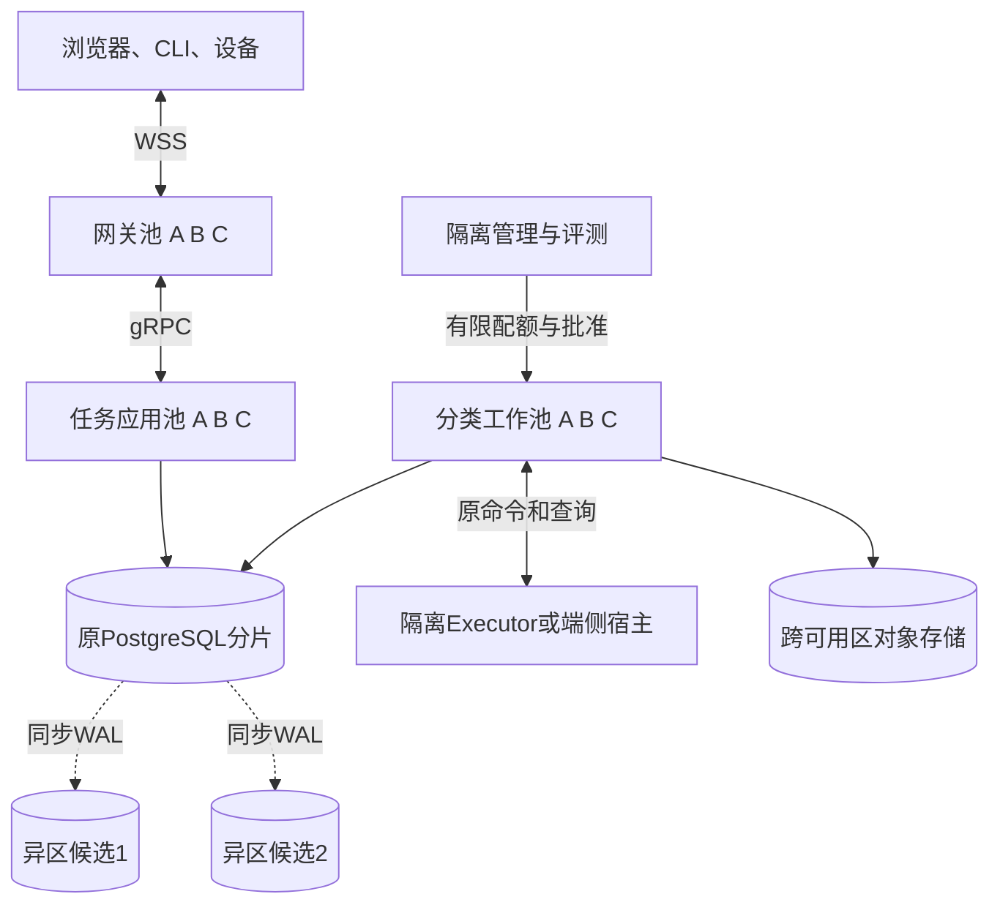
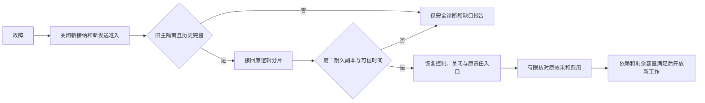

# 生产分布式部署与运行

生产基线是单地域三可用区，独立WSS接入、任务应用、分类工作池和执行宿主。PostgreSQL分片保存责任，对象存储保存不可变字节。单可用区故障的目标是已确认账本RPO=0、控制和权威查询RTO≤60秒；这些是必须运行验收的目标，不是部署副本后自动成立的保证。

本章落实 [ADR 0003](../../adr/0003-production-distributed.md)。整地域采用异地灾备，不启用同一Orchestrator双地域可写。

## 1 角色与故障域

网关保存可丢连接状态；应用裁决短命令与查询；工作池推进原Job；执行宿主持有目标驱动和效果记录。各在线池跨区分布并按失去一区后的容量配置，不得把每区一副本当成容量保证。管理入口可同宿主，实验执行与用户任务资源隔离。

默认Task、条件、任务预算、控制、本地Grant/Confirmation与证据gate同分片装配。Memory、Content和Executor可独立owner；拆出后采用原命令交接。增加worker不能突破同一Task或数据库写主的串行瓶颈。

端云合同同时支持本地Orchestrator配云能力、云Orchestrator配端侧Brain/Memory/Executor，以及全部权威与依赖本地就绪时的离线任务。一个Task始终只有原逻辑owner，断网不触发另一端接管新目标。单进程仅作开发调试；本机多进程和端侧证据也不能替代生产三可用区验收。

## 2 两级路由与新分片开放

逻辑映射为 `orchestrator_id/owner_id → 存储分片`，进程发现再将原逻辑服务解析到健康副本。新Task选择与已有Task恢复是两条不同路径。

1. 受信管理发布租户/用户范围的新Task默认Orchestrator
2. 发布前在身份权威登记所有受影响用户的新来源及披露授权authority，连同目录版本耐久保存；并发开户进入同一发布屏障
3. 调用方通过已认证发现确认目标，在首次发送前保存原服务地址、logical_service_id、Command及摘要
4. 网关核对连接服务、target和Task提交owner一致，只选健康进程，不临时重选Task分片
5. 映射换版后旧命令、Task、去重和未结Job仍去原owner。原目标不可达则未知/等待，不能改投当前默认

来源目录用于完整查询覆盖，不是第二个Task接纳权威。每来源至少登记原Orchestrator及所有可能扩大历史可见性的Grant/共享owner；新增披露authority先登记，再开放披露。不能证明完整范围就返回目录/权限gap。

新分片依次取得数据库唯一写权及同步候选、恢复处理器、故障余量与配额份额、来源预登记，然后发布发现并开放接纳。回退默认映射只影响之后的新Task，已经接纳的新分片任务和目录来源保留。

默认扩容承接新Task，不提供在线重分片。整库维护搬迁先停止新写和发送准入、隔离旧写者、取得包含命令/墓碑/Job/控制/映射的完整切点，再恢复并核内容版本，更新物理放置后先开放控制和核对。两个库不能同时代表同一owner写入。

## 3 PostgreSQL与最少中间件

各模块到物理表/介质、唯一键、访问索引、保留和迁移的完整映射见[存储与一致性](../data/storage.md)，字段不在部署章重复定义。

选用托管PostgreSQL、对象存储、公司身份/密钥/发现和有界连接池。初期不引入第二持久消息系统、Redis权威目录或独立向量库。代价是数据库扫描、维护和热键成本，须真实测量。

活动Job索引按scope/kind/state/due_at/稳定ID领取；已结历史退出热路径。唯一命令/关闭身份按完整业务键保唯一，不能按月分区后只在月表内去重。正文和诊断可按保留期清理，最后墓碑长期保留。

业务与Job共同提交，NOTIFY在提交后独立短事务发hint。无通知依靠有界扫描。连接池不选数据库主；租户上下文每个事务重新设置，RLS受限角色不能绕过。LISTEN走独立少量会话连接，不能经过会丢会话状态的事务池。

默认参数仅作试验：每用户活跃Task16、模型在途4、待处理Task100；控制/收尾各有非零专用份额。存储剩余低于10%时停止新责任和正文，但百分比本身不证明还能取消；每次接纳须为最坏回执、控制和收尾留出可兑现容量。

是否加MQ取决于扫描/通知/跨分片唤醒成为已测瓶颈，且总运维成本下降。作为hint的MQ仍可丢；如果要替代原Job账本，必须重新设计双系统提交，不得借容量优化悄悄转移权威。

## 4 数据库与内容恢复

参考同步配置为 `synchronous_commit=on` 配合 `ANY 1` 异区候选，等待至少一份异区WAL耐久落盘。remote_write不能保证备用OS崩溃后仍在，remote_apply另增加备用可读可见性，本方案关键裁决默认读主。[PostgreSQL WAL语义](https://www.postgresql.org/docs/18/runtime-config-wal.html#GUC-SYNCHRONOUS-COMMIT)

提升必须同时证明旧主已隔离、候选属于同一历史且含全部已确认提交、重新具备第二耐久副本。无法证明则不写，不为可用率静默降异步。readiness消费平台证明，应用Job租约不自行选主。

恢复就绪不要求全部unknown清零，只要求其原责任可定位且处理链可用。某个文件根或设备失联封闭其新动作，不阻塞无关租户。对象字节丢失保留内容缺口，不把原外部效果改成未发生。

备份清单绑定数据库一致切点、准确对象版本、关闭身份、InstallLock、放置历史、用户来源及authority集合、密钥恢复依据。旧备份缺后续撤权/关闭/外部效果历史时只诊断，不重启旧Task或凭据。异地恢复先隔离原地域，不将软件回退变成业务历史回滚。

## 5 时间与租约不是一句now

ClockAdapter提供可信UTC区间、允许暂停期间仍前进的经过时间和信任代次。部署固定UTC误差ε、经过时间速率误差ρ和核查至真实入口最大延迟κ；不能只测普通进程暂停就声称覆盖VM休眠。

远端start_before在实际入口要求 `当前UTC上界 + 签发者误差 + κ < start_before`，同时满足首次换算的本地经过时间截止。重复回执、UTC回拨和重连不能延长原窗口。

进程租约初值15秒、5秒续期。若数据库时钟误差上界ε_db，发起续约本地时刻m0，则最迟停止点不晚于 `m0 + (15s - 2ε_db - κ) × (1-ρ)`，括号必须为正；不能从收到回复时重新计算。续约答复也须早于原已确认截止，失效boot永不复活。

平台暂停恢复必须在业务线程重新出站前使旧时间信任失效或核验截止。数据库提升后先证明新旧主时差，才续约/回收；证据缺失时隔离旧持有者，或在可靠经过时间下等满最大旧窗口及余量，不能先复用其槽再指望旧进程停止。

PostgreSQL在裁决处使用实际当前时间；CURRENT_TIMESTAMP是事务开始时间，不能延长租约。[当前时间函数](https://www.postgresql.org/docs/18/functions-datetime.html#FUNCTIONS-DATETIME-CURRENT) 外部效果已经越过入口仍按原操作核对，时钟变化不撤销它。

## 6 长连接、发布与重连洪峰

网关持有socket；应用持有内部EndpointChannel。应用发布或内部委托轮换优先重绑，外connection_id不变；网关退出才外部重连。新binding_id/binding_revision登记后只接受当前流，迟到旧帧或旧清理不能覆盖新绑定。

在线额度由身份分片统一裁决，不按网关进程各给一份；在线绑定在原逻辑服务分片，待发送Delivery仍归业务owner。发送器按当前绑定集合与待发送索引批扫，无每连接轮询。Reply持久接收后才能推进交付责任，socket write不算完成。

应用排空停止新RPC/绑定，原短请求有界结束并让网关重绑；worker停止领取，已可能发送的Job保留核对；执行宿主封新实际启动并等待可证明退出。网关按批摘除新握手、关socket、条件释放原连接额度，新握手先到且已满额时暂拒并抖动重试。

首轮网关每批最多全池5%连接，排空60秒，应用30秒，容器宽限120秒；这些是待校准输入。liveness不把数据库故障变成所有实例重启；startup/readiness反映恢复和接纳条件。Kubernetes PDB只约束自主驱逐，不防可用区故障。[官方中断说明](https://kubernetes.io/docs/concepts/workloads/pods/disruptions/)

冷缓存重连须把认证、额度、绑定写入、原回执、每订阅快照页数全部计入，而非只报握手/秒。按租户与分片合并相同键回源、限并发并抖动，控制和核对保留数据库容量。缓存miss不创建新owner，权限缓存命中不授予永久披露。

## 7 从用户规模推导实际负载

以下是工作负载假设，不是用户行为事实：100万DAU，每人每天5Task，峰均比5，得平均57.87和峰值289.35个新Task/秒；工程用290作四舍五入基线。若每Task有4个平均8秒的模型调用，则峰值稳态约9280个模型在途。若每Task至少20次业务提交，则约5800次提交/秒下界，尚未计领取、续租、授权、控制和恢复。

10万在线用户 × 每人2个活动端 × 每端1个逻辑服务连接 = 20万WSS。30秒心跳约6667组/秒；60秒全重连平均3333握手/秒，不是瞬时峰值。每连接单向4MiB若全部排满将达781.25GiB，故逐连接上限不是可兑现总内存预算，还须全池/租户背压。

200KiB/Task × 每天500万Task约0.931TiB/日原始内容，未计索引、副本和截图。30天约27.94TiB。每年18.25亿Task身份再乘每条实测字节，并加命令/操作墓碑、WAL、备份和重建空间，不能按正文TTL删去身份成本。

### 故障后积压会不会清空

同一类Job中，λ是新Job/秒，μ是故障后实测处理Job/秒，B是积压Job。只有μ>λ且负载近似稳定，预计清空时间才是 `B/(μ-λ)`。例如正常1800、损失三分之一容量后1200，新到达1000，积压36000，理想清空时间180秒。μ≤λ时没有有限排空时间，应限新接纳或加有效容量。

该公式不适用于无限等待用户/设备的Job，不由CPU利用率推μ，也不把任务QPS和Job/QPS混在一个分母。单副本目标延迟下实测容量C、利用率上限U、损失比例f时，副本初估 `N ≥ ceil(L/(C×U×(1-f)))`，再校验整数区分布、数据库和供应商余量。

[本地解释工具](../assets/design-lab.html)可改变上述输入；结果是敏感性推导。500新Task/秒持续15分钟另作压力场景，不得将它写成现有吞吐或用查询QPS替代。

## 8 运行指标与成本取舍

首轮目标：接纳/控制/权威查询各99.9%调用可用性；同地域p95≤300ms、p99≤1s；控制/核对可运行Job领取p99≤2秒、普通推进p95≤5秒；健康在线控制与内部重绑p99≤5秒。单区RTO≤60秒另测，内容和外部设备另报，以上均不是已签SLA。

每次command/query/receipt_lookup按调用方截止独立计量，初始最多5秒。丢答复超时仍是该次接口失败，随后查到原接纳不改写失败；业务接纳按原command去重。内部透明重绑不增加外部样本，外部重连新调用另算。过载、依赖故障计不可用，权限/约定用户额度拒绝单列。

指标同时包括最老未决责任年龄、unknown数量、控制未确认范围、迟到账单outbox年龄、内容残留、索引落后、WAL/扫描/锁/连接池成本、每完整Task费用和恢复净余量。精确ID放受控结构化记录，不作高基数指标标签；正文和秘密不入通用遥测。

首次生产门槛必须实际测同步提交后杀主区、旧主隔离、冷缓存洪峰、慢端、单租户10倍输入、供应商限流、磁盘水位、缺历史灾备及长时间积压。公司平台未就绪可继续本机多进程开发，但不能省掉这条生产路径。
