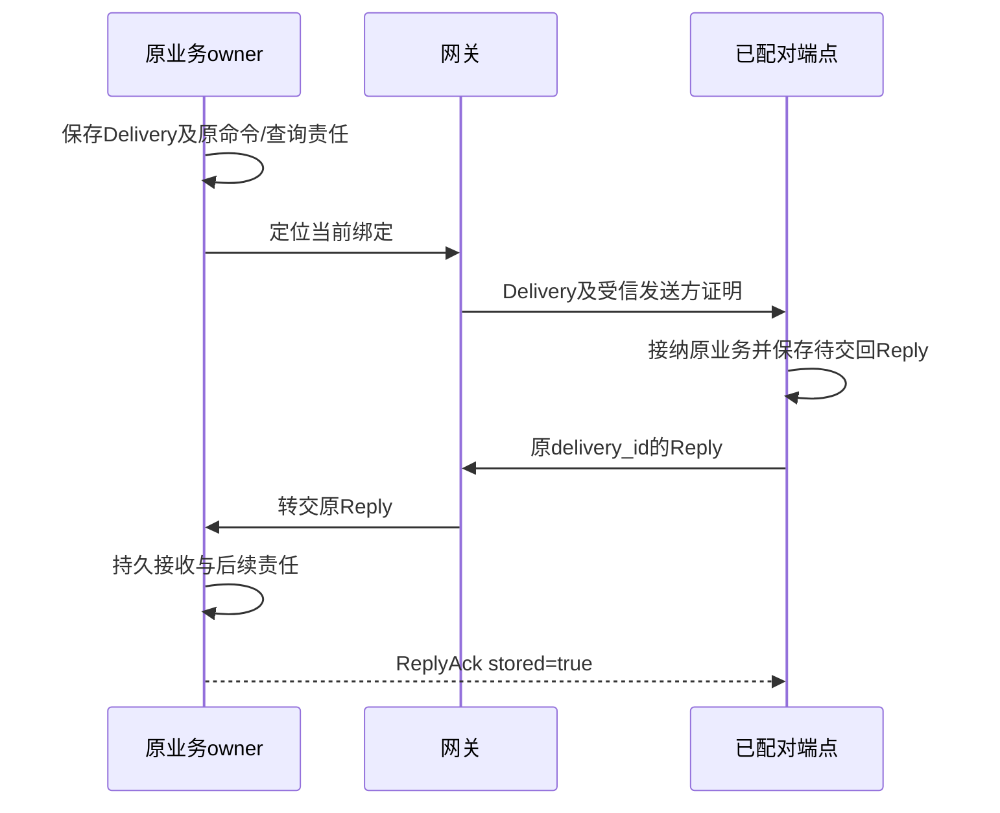

# 共同接口与端云传输

业务身份跨连接保持，网络序号只关联一次传输。命令接纳、原效果、用户输入消费和费用结清各有查询入口；WSS/gRPC的成功码不能代替这些事实。

核心用Go接口，同进程不必编码；独立服务用gRPC的Protobuf外壳承载严格JSON，端云统一WSS，HTTPS负责发现、认证和大内容字节。这保留[ADR 0002](../../adr/0002-go-wss-grpc.md)。

## 1 本系列的合同版本

本次数据合同设计 profile 为 `architecture-2026-10-data1`，协议族为尚未发布的 `harness/1`。本版替代旧设计 profile architecture-2026-10 的候选/条件与引用字段；不能用新解码器重解释旧原命令。新增集合摘要、应用调度、环境、策略接受和证据资格合同必须一起登记版本，不能冒用任何旧profile解释不同字段。已持久命令总是保留原profile、资产摘要和解码器，发布不重解释未结请求。

文档给出语义、负责方和失败路径；[core.schema.json](core.schema.json)严格定义关键对象与五条核心命令；[harness.proto](harness.proto)定义传输外壳。SourceEvidence、Requirement 等嵌入向量只在外层 Task/来源作用域内解释，不能按裸 ID 当独立资源读取。核心Schema不是全部模块方法的完整线协议，不宣称已经提供可发布SDK。扩展发现只能声明已补齐本方法输入/输出Schema、错误、回执阶段、查询恢复和互操作证据的子集；不能因为有一个方法名字就声明支持。

## 2 身份、版本与机器合同

ID为 `类型前缀_32位小写十六进制`。时间使用UTC RFC3339，修订/计数/字节为不超过2^53−1的非负安全整数，业务修订从1开始。金额用带准确unit的非负十进制字符串，不经浮点转换。JSON拒绝重复键、非法Unicode、非有限数字、未知字段和未固定的远程Schema引用，先检查原始字节再普通解码。

ContentRef固定owner/content/version/hash/media_type/byte_length及tenant。ComponentRef固定component_id、版本与digest。ObjectRef固定tenant/owner/object/revision；准确引用的租户必须与受信数据域一致。版本准确不等于当前有权限。

完整对象归责与逻辑字段见[整体数据设计](../data/README.md)和[生成字段字典](../data/field-reference.md)。核心Schema补齐原消息/Submission、GoalRevision、候选与采纳、GoalCoverage、InputRequest、Claim，并定义Task、Operation、DecisionDispatchIntent、DecisionRecord、ContentRef、Requirement、ConditionResult、Result、Grant、Confirmation、BudgetBalance、UsageSnapshot、AllocationClosure、Job、CollectionSummary和Command。跨记录约束由[语义检查](../validation/check_architecture.py)中的独立样例检验，Schema不能证明认证、事务或目标真值。

[核心示例](examples/core.json)给出取消后仍有unknown、成功后账务未结、一次性许可已消费以及费用更正超出原预算等合法记录。示例中的身份/摘要是构造数据，绝不是签名或真实执行凭据。

## 3 命令回执与查询

Command固定protocol/profile、logical_service_id、command_id、method、target_id、expires_at、适用时expected_revision和payload。摘要按RFC8785规范化的完整业务请求计算；认证主体在受信上下文绑定，不从payload选租户。

| 结果 | 方法承诺 |
| --- | --- |
| accepted | 请求及处理责任已持久，业务决定未完成 |
| applied | 该方法定义的决定与必要后续责任已提交 |
| rejected | 原命令已被确定拒绝，以后不因条件改变重新执行 |
| 传输错误/超时 | 这次调用没有取得确定结果，不推出原业务未提交 |

Receipt含command_id、stage、accepted_at或decided_at、合法output或互斥error。当前权限不足时可redacted并省略整个output，不篡改原决定。回执正文清理后返回gone，最小去重记录仍拒绝重新启动。

Query含query_id、method、target和有界payload，不建永久命令墓碑。相同查询身份在保留期内绑定主体、参数和快照/集合；不同条件同query_id冲突。receipt_lookup单独按原command查决定，本身不是新业务命令。

未决多阶段方法要么明确允许accepted，要么超时后继续查询原准备，不伪造rejected或not_found。接口5秒截止不取消已接纳后台责任；领域deadline和首次接纳expires_at独立。

## 4 最小方法族与成功点

以下字段为合同要求，公共身份/期限/CAS从Command继承。模块页补充具体状态和边界。

| 方法族 | 最低输入与applied含义 | 必须配套的恢复 |
| --- | --- | --- |
| task.submit | 原goal/policy/deadline/budget与固定Orchestrator；可选requirement_candidates；Task及提炼/首Job已建立，不代表条件ready | task.read/result/list、原回执 |
| task.pause/resume/cancel/revise/input/accept_result | 原Task/CAS；目标或控制/准确请求的一次消费已保存 | 原Task、请求/控制落实集合；不代表外部已停 |
| brain.decide/cancel | 固定Decision/Snapshot/profile/use/limits；原Decision责任或停止决定已存 | brain.get及原模型费用 |
| execution.invoke/cancel/control/reconcile | 原Operation/完整Intent/TaskGate；接纳、关闭或核对责任已存 | execution.get/list/control.get |
| resource.acquire/renew/release/takeover/observe | 原资源/实例/epoch/期限；资源决定或观察Operation已存 | resource.get和原Operation；lease不证明目标已停 |
| grant.issue/revoke/use/use.settle | 精确主体/范围/确认或原use/账单；许可/消费/结算各按自己的成功点 | grant.read/list/check、use.get/settlement |
| grant.lease.allocate/settle | 原endpoint/instance、严格额度/期限及完整关闭报告 | 原lease状态、使用集合与原计费源 |
| budget.allocate/close/settle | 父方分配或接收方消费关闭/原Closure；不得跨库假原子 | budget.read、原分配和计费源 |
| content.put/register_copy/close/release_copy | 准确字节引用、holder、原控制/清理结果；发布/登记/关闭决定已存 | content.get bytes/control及原upload/ticket |
| memory.create/replace/restrict/delete/extract | 准确Memory/CAS、来源/政策、原候选；语义变更或提取责任已存 | inspect/read/list/query、cleanup.get、view.open/pull/ack |
| interaction.input/present/application_event | 原Submission或准确Surface/请求/事件绑定；交付或呈现意图已存 | input_read/request_read/surface_read/list及withdraw |
| collaboration.delegate/control/submit_input/reconcile | 原Delegation/父goal/子目标/额度/原输入；映射或交接责任已存 | collaboration.read、原创建键、关闭/结算证据 |
| extensions.prepare/activate/deactivate/dispose | 准确InstallLock/Approval/target/expected_generation；准备或激活/停用决定已存 | extensions.read/list、逐实例readiness与残留 |
| evaluation.plan_create/run/cancel/approve/revoke | 冻结计划/样本manifest或准确批准范围；原运行/门禁/批准已存 | evaluation.read/rollout_read、样本/环境分页 |
| policy.acceptance.*、evidence.* | 准确本人接受或资格/缺陷事实；按所属owner一次消费/导入 | 对应read、原回执及缺陷changes |
| session.*、schedule.*、child.*、environment.* | 对应模块固定身份、版本、范围与精确配置；应用/执行责任已存 | 同族read/list和原Task/Operation，禁止隐藏副作用 |

实现时先按[方法共同合同](method-contract.md)选择回执阶段、裁决顺序与错误，再使用各模块接口表。修改型方法必须声明expected_revision是否必需。账单唤醒等无法知道Task当前版本的通知按原来源修订合并，不能强迫调用者先读再猜。新增field或method先冻结profile再开放，不用任意JSON逃逸字段承载新业务。

跨域task.submit的可选delegation_context固定delegation、父Task/goal、真实祖先、准确Agent绑定、原allocation/许可、父ControlSnapshot及受信证明。接收方校验父Task、allocation owner、控制签发owner和目标版本一致，祖先来自可核原关系；再读取原父当前allocation、验证本receiver及权限/预算/期限，并唯一接纳IncomingAllocation与子Task。独立提交省略该字段，不得伪造父身份绕过本地预算。estimate任务另携acceptance_ref，实际准入仍查原策略接受记录。

## 5 错误给出下一步而非猜测

Error固定code、scope、reason、retry和不含秘密的detail。reason是该profile的稳定业务原因。code至少区分invalid_request、forbidden、expired、revision_conflict、idempotency_conflict、not_found、gone、unsupported、invalid_state、overloaded、dependency_unavailable、cursor_expired、snapshot_required、effect_unknown和accounting_unknown。

retry为none、same_request、query_original、after_change或backoff；它是受限恢复建议，不授予重试副作用权限。not_found只有原权威当前确定不存在时返回；失联、读副本落后、权限不可核验均不能用它。gone与not_found不同，旧身份不能因正文清理重用。

同修订异摘要、跨身份游标、目标与payload owner不符、超过累计查询预算均拒绝。结构错误与业务拒绝分开计量，不以一个通用500掩盖效果未知。

## 6 WSS发现、认证与流控

受信同源HTTPS `/.well-known/harness`公开协议和登录能力；认证后返回logical_service_id、profile、Schema/method摘要、精确方法子集、固定connect_path与limits。新Task来源预登记见[生产路由](../production/README.md)。发现只读，不在GET里分配任务权威。

浏览器使用Secure/HttpOnly同源Cookie，验证Origin，HTTP写入口校验CSRF；CLI/已配对端点在TLS保护的HTTP Upgrade握手中用Authorization请求头携带opaque bearer。凭据不放URL或子协议名，帧正文不提供AuthContext。每次新请求及披露检查当前会话/凭据代次，网关mTLS身份不能冒充原业务sender。

握手协商准确transport_profile，网关取得连接额度并完成内部绑定后只发送一次ready。每个UTF-8文本消息恰好一帧完整JSON；应用序号request_seq由唯一发送循环在实际出队时分配，严格递增且不复用。response可乱序；旧connection的相同序号不能完成新连接等待。高水位只在重建外socket后重置。

初始限额：领域JSON256KiB、整个帧1MiB；请求/待投递各32；每连接每方向队列4MiB，其中控制预留1MiB/4项；每身份每服务2连接、总16；订阅8；心跳30秒、90秒超时。还须有全池和租户总字节上限，普通工作不得把逐连接上限全部占满。服务可声明更小且自洽的值，不得静默缩小已Ready合同。

双方持续独立读写，等一个response不能停止读取消和Reply。普通change可合并，但无法证明游标连续须snapshot_required。控制也无法入队或慢端长期不读时断连，原责任仍在账本，不无限缓冲。

## 7 双向Delivery与Reply

Delivery固定delivery_id、sender_service_id、recipient_endpoint/instance、request_digest、kind、原request及deliver_before；kind为command/query/receipt_lookup。Reply固定原delivery、request摘要、目标回执或查询结果。端点持久保存Reply到匹配ReplyAck，重连可重交；服务按原delivery幂等保存。查询仍检查当前披露，旧Reply不能绕过撤权重新泄露正文。

控制与Delivery使用事先登记owner密钥的ES256 JWS，签完整tenant、issuer、audience、原对象/摘要、控制修订和有限窗口；拒绝none、未知算法、消息自带公钥/取钥URL。JCS规范化与实际JWS字节验证分别正确实现。[JWS](https://www.rfc-editor.org/rfc/rfc7515)、[ES256](https://www.rfc-editor.org/rfc/rfc7518#section-3.4)、[JCS](https://www.rfc-editor.org/rfc/rfc8785) 签名证明来源，不证明当前Grant、设备占用或目标效果。

大内容用有限upload_reserve/lookup和mirror_reserve/lookup/control，票据绑定准确holder/来源/目标版本/字节/期限；字节走同源或明确获准存储HTTPS，不能从第三方字段任意下载内网URL。ticket完成仅说明字节阶段，Content发布另有事务。

## 8 内部gRPC与连接重绑

gRPC的Call传原Command、Query或receipt_lookup JSON；EndpointChannel只连接网关与原逻辑服务。Protobuf oneof重复、未知/非法字段以及内层JSON都严格检查，不让宽松解码产生第二份字段权威。

应用失效后网关保留外connection_id及在途请求期限，建立新binding_id与递增binding_revision。原逻辑分片只接受更高代次；同代次必须同候选与实例，旧流不得更新新绑定。网关只有核验新Ready才切流，旧输出丢弃，外Ready不重复发送。

重绑不撤销已进入领域的旧命令。原5秒处理期内可查原回执；超时返回query_original，后台责任继续。内部流断开不影响外心跳，但暂不积压新普通请求；连续60秒不可恢复则有界关闭外socket。身份失效立即停止新请求/披露。

客户端连接池受实际后端数、每后端物理连接、HTTP/2流槽及服务端总量共同限制。新副本只吸收新流，旧长流不假迁移。Call与长流分别留控制容量，发现watch过期不无限使用陈旧地址。deadline/cancel只终止RPC等待，不证明事务或业务未发生。

## 9 订阅与集合

Change只含owner/object/revision、类型和游标提示，不携带可执行许可。客户端对每owner按先订阅缓冲→有限快照→处理后续提示恢复；未知ID也需准确读取。跨owner没有全局原子快照。

CollectionSummary.complete只说明原owner的关系索引覆盖完整，不说明效果已经核清或业务已经完成；total_count和unresolved_count分别表达集合规模与未结数量。

所有可增长集合响应使用集合修订、总量/未结计数、页游标、exhausted、partial和固定gap原因；游标绑定主体、方法、owner、参数、权限向量及不可延长期限。每页限制扫描数、返回数、字节和累计时间；空页可带next_cursor。枚举完截断集合不等于当前全集完整。

Task完成、run取消、环境停止、DelegationClosure和内容清理在owner内部用完整关系及门禁裁决，绝不从一个API数组长度或客户端页推导全集为空。源目录与权限向量变化使原页失效，重新查询；旧权限恢复也不复活原过期游标。
