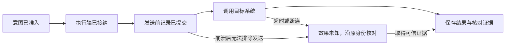

# 持久工作与故障恢复

可靠运行层保存“还有什么工作必须完成”，并防止重复命令和旧工作者破坏已提交事实。领域模块决定工作的含义、外部效果和安全重试条件。框架不承诺任意函数可以透明重放。

本章的机制由默认组件共用。远程第三方实现可以采用其他引擎，但必须满足[能力合同](contracts.md)的接纳、查询、身份和关闭语义。

## 三种身份

| 身份 | 解决的问题 | 重启后是否改变 |
| --- | --- | --- |
| Command | 某个主体向某个 owner 请求一次业务裁决 | 不改变；相同命令重传返回原决定 |
| Job | 已提交的后续工作责任 | 不改变；新增触发可以推进工作修订 |
| Attempt | 一次真实物理尝试 | 新的安全尝试有新身份，仍属于原 Operation |

Claim 是一次暂时领取，包含 worker、租约截止和递增 epoch。Claim 不是新的业务责任。Operation 的逻辑身份不随 Claim 或 Attempt 改变。

## 两个公共模板

| 模板 | 框架承担 | 领域提供 |
| --- | --- | --- |
| 接纳模板 `accept` | 认证上下文、原命令键锁、摘要比较、回执和提交未知处理 | 参数规范化、权限及前态检查、业务变更和后续工作 |
| 有界工作模板 `work` | 领取、续租、epoch 检查、限额、下一次唤醒与回交 | 阶段输入、外部调用准备、事实归并、安全重试与关闭判定 |

模板只接收显式事务和 repository，不隐式把不同 owner 纳入同一事务。所有事务都有截止时间；网络调用、模型调用、对象大文件上传不得放在持锁事务内。

`Tx` 必须覆盖声明的同库记录。业务事实改变需要后续处理时，领域变更、原回执及 Job 必须共同提交。默认不引入独立消息队列来承担唯一责任；通知只加速唤醒，数据库扫描保证遗漏通知后的恢复。

## 命令接纳算法

1. 解码闭合 Schema，校验认证主体、目标 owner、版本和请求大小。格式或认证失败不进入业务接纳。
2. 在服务所属库按 `(tenant_id, owner_id, command_id)` 取得唯一命令记录或键锁。
3. 若原记录存在，比较方法、目标、主体和规范化请求摘要。完全相同返回原回执；不相同返回 `idempotency_conflict`，不得执行新内容。
4. 新命令超过 `accept_before` 时，在原键下固定过期拒绝。否则按当前领域规则决定拒绝、接纳异步责任或完成方法规定的修改。
5. 同事务保存固定接纳决定、业务记录和必要 Job。只有确认提交后才回复成功或允许外部发送。

命令回执有 `accepted`、`applied`、`rejected` 三类。`accepted` 表示异步处理责任已持久接纳；`applied` 表示方法规定的业务变更已持久提交。两者均不自动代表目标外部效果发生。接纳回执一经提交不可改写；异步处理的成功、失败和未知保存到关联业务对象，`command.get` 同时返回原回执和当前进展。接纳后执行失败不能变成“从未接纳”的 rejected，也不能因此允许新建同义 Operation。

提交答复丢失时返回传输层 `commit_unknown` 或断连，调用方查询同一原命令；不得回滚应用侧身份后重建请求。读取不到且原首次接纳期限未过，调用方可以重传原命令。期限已过仍只查询或重传原身份，由接收方返回原决定或固定过期拒绝。

## 领取与完成竞争

Job 至少包含 `job_id`、领域对象、阶段、`work_revision`、`completed_revision`、`due_at`、`lease_until`、`lease_epoch`、`attempt_count` 和 `state`。新增领域事实需要再次处理时，在原业务事务增加 work_revision 并确保该 Job 可唤醒。

工作者领取时固定本次 `claimed_revision` 和 epoch。提交进展必须检查 epoch 仍有效。完成时只能推进到本次处理的修订；若 `work_revision > claimed_revision`，Job 必须保持可继续，不能把新责任覆盖为 done。

租约过期只允许接替者恢复处理，不证明旧进程已停止。epoch 能阻止旧进程更新受控数据库；如果目标系统不核验 epoch，它不能阻止旧进程在网络另一端产生效果。因此必须另有发送记录、真实启动门禁和效果核对。

## 外部效果的四个阶段

外部调用与数据库通常不能共同原子提交。阶段 C 后崩溃，接替者不能仅因看不到结果就回到 D。Executor 必须根据能力声明选择恢复方式：

| 效果能力 | 恢复行为 | 不允许的推断 |
| --- | --- | --- |
| 被目标系统强制执行的幂等键 | 在相同输入、键和有效保留期内重传，核对原效果 | 不能在键过期后继续宣称安全 |
| 可查询原请求或目标版本 | 查询原请求；必要时独立读回，再判断是否可继续 | 当前未找到不一定证明未来不会迟到执行 |
| 无目标幂等，但可证明未发送或不会再发生 | 保存关闭依据后，由领域规则决定同 Operation 的下一次 Attempt | 普通超时不是未发送证明 |
| 不可查询、不可排除已经发生 | 保持 unknown，阻止同义重复效果，请求受信处理 | 人工点击“重试”也不能改写原效果为未发生 |

Effect 取 `applied`、`not_applied`、`unknown`；另有 `may_apply_later` 表示原操作是否仍可能产生迟到效果。只有效果确定且 `may_apply_later=false` 才满足执行责任的效果关闭条件。后续目标变化不改写历史已发生效果。

可查看[效果恢复图](assets/effect-recovery.svg)。图中的恢复由原账本驱动，不代表重放目标动作。

纯读取也可能收费、泄露材料或触发供应商状态。它仍需权限和用量记录。可安全重新读取的能力可以声明重复语义；旧读取结果与新读取结果必须保留各自观察时间。

## 跨 owner 交接

发送方先在自己的事务中固定意图和投递责任，接收方在自己的事务中固定接纳事实，发送方最后保存对方回执。任一步答复丢失，都按原键查询或重传。这是两个本地事务组成的可恢复交接，不是跨库原子提交。

接收方需要回传结果时，同样先保存结果与通知责任。发送方按 `(source_owner, object_id, revision)` 去重归并；消息乱序时不回退当前版本。通知失败不删除结果，查询是恢复路径。

为了完成判断，Orchestrator 必须在派发前登记 Operation 或 Delegation 的未结责任。接收方尚未接纳、失联或返回未知时，这项责任始终保留。取消早于执行命令到达时，Executor 核验原 Task owner 的控制凭据与操作绑定，保存该 Operation 的关闭记录，拒绝迟到启动。关闭记录固定 task_ref、operation_id、intent_digest 和签发 owner；迟到 invoke 绑定不符时报冲突，不得覆盖墓碑。控制方法见[组件接口](contracts.md)。

## 调度与资源隔离

默认采用 PostgreSQL 中的有界工作队列。工作者按 owner、工作类别和租户额度领取，短事务使用行锁跳过其他领取中的行；SQL 隔离和锁序必须通过真实并发测试验证，不能凭接口名称声称正确。

控制与核对、模型推理、普通工具、内容整理、评测分配独立的并发预算。控制和核对保留容量，防止大量模型任务使取消无法处理。公平调度按租户累计使用和队列等待时间分配，不能只按单个任务的最高优先级无限插队。

等待持久事件或用户输入时释放 worker，不长期占用 goroutine、连接或数据库锁。网络退避有最大间隔和总期限；永久 Schema、权限和前态错误不得无限重试。跨租户和跨用途限额必须在领取与实际启动两处落实。

## 崩溃恢复顺序

1. 恢复 owner 的数据库和可信时间，确认旧实例隔离与适用版本。
2. 扫描未结效果、取消传播和命令提交未知，先安排核对。
3. 重新领取过期 Job；按保存的领域阶段继续，不从函数入口重放全部行为。
4. 当前权限、目标与预算满足后，才允许新的决策和行动。
5. 对无合格旧组件或接管器的工作保留等待与限制，不临时换成同名最新组件。

框架不默认保存程序栈或续跑任意用户代码。程序环境中已开始的 cell 崩溃后，先核对其中已登记的 hostcall；重新执行 cell 是新的受控决定，不能透明重放已有副作用。

## 必须验证的反例

接纳提交后丢回执、Job 新修订与旧完成竞争、租约过期后旧 worker 返回、外部写入成功后崩溃、取消先于 invoke、网络恢复后迟到结果、任务终态后费用更正，均必须有可重复测试。具体输入、断言和工程退出条件见[实施与验证](validation.md)。

这些规则的代价包括持久写入、去重记录和恢复扫描。是否引入其他持久引擎，必须比较完整事务边界、端侧成本和故障行为；不能仅因某引擎支持 checkpoint 就移除 Effect 核对。
