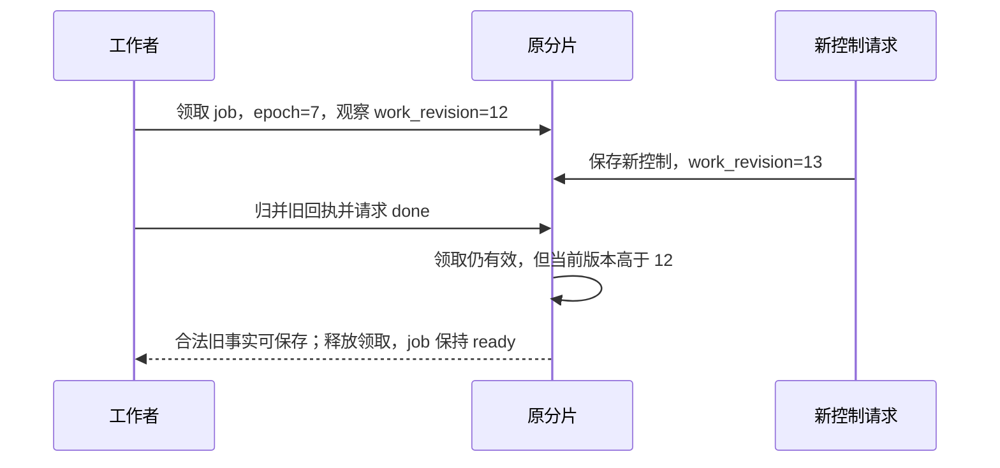
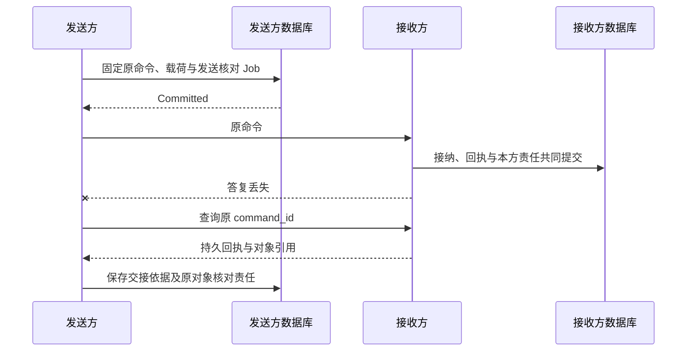

# 持久工作与跨域恢复

业务事实与后续工作在同一本地事务中提交。工作者只暂时领取责任；重启时从原 Command、Job 和领域阶段恢复。公共框架共享接纳、领取和条件提交，具体领域决定效果、重试与完成。

这一选择遵循 [ADR 0009](../../adr/0009-reliable-work-framework.md)。它不引入独立调度服务，也不为所有模块制造同一种业务状态机。

## 1 三种身份分别解决什么

- Command 固定一次业务改变的请求。首次发送前保存目标逻辑服务、完整输入、期限和规范摘要
- Job 固定某个 owner 还需履行的一类责任，例如派发、效果核对、结算或清理
- Attempt 固定 Operation 内的一次物理尝试。领取次数、RPC 重传数和目标尝试数必须分别计量

命令去重键为 `(tenant_id, logical_service_id, command_id)`，并绑定认证调用主体。查询原回执仍检查当前披露权限。原请求的 method、target、payload、expected_revision 和首次接纳期限都进入摘要；SDK 不能在重试时更新默认值。

首次命令的短事务依次判重、检查领域条件、写业务或准备责任、保存回执及必要 Job。占位不能单独提交。`accepted` 只用于方法允许且已有持久处理责任的分支；`applied` 和 `rejected` 是固定业务决定。完整回执清理后，最小身份记录返回 gone，不能把旧命令当新命令。

## 2 提交未知不是失败

| 存储结果 | 允许的后续行为 |
| --- | --- |
| Committed | 返回原决定；提交后尝试唤醒工作者 |
| RolledBack | 只对确认未提交且不含外部行为的本地闭包作有限数据库重试 |
| CommitUnknown | 按原命令或阶段查询，未查清前不发送、不释放未知预留、不报告业务失败 |

真正的领域修订冲突保存固定拒绝。数据库死锁或序列化冲突可重跑纯本地逻辑，但保留原 expected_revision。外部调用始终在事务之外，不能让数据库驱动自动重跑包含工具或模型调用的闭包。

## 3 Job 的字段和并发规则

JobStore 是逻辑接口，各 owner 可用自己的物理表。最小记录如下：

| 字段 | 规则 |
| --- | --- |
| scope、responsibility_key、kind | 原 owner、受信租户和领域责任键构成唯一业务槽 |
| job_id | 不可复用；清理后重建同责任槽使用新 ID |
| source_ref | 定位准确领域记录，不把正文、凭据或完整状态复制进领取索引 |
| state、due_at | ready、leased、waiting、done；due_at 是最早应处理时间 |
| work_revision | 新领域责任随来源事实共同提交时递增 |
| holder_id、lease_epoch、lease_until | 本次启动随机身份、领取代次与数据库裁决的期限 |
| observed_work_revision | Claim 固定的领取观察值；续租、确认领取和回写都不能刷新它 |

领取前先预留实际处理容量。PostgreSQL 以有限批次 `FOR UPDATE SKIP LOCKED` 领取到期工作并递增 lease_epoch，提交后才执行。SQLite 独立适配单写队列；不能照搬 PG 并发假设。

领取提交未知时只核验原holder/epoch/期限及原observed_work_revision；候选快照已丢失不拼造Claim，不开始执行。`Hint`仅提前已有未结Job，不创建、不增版本、不重开done。需要等未来业务变化的责任保持waiting，不能完成第一次查询便只靠通知续命。

`Raise` 只由新领域事实触发：递增 work_revision，将 due_at 取较早值；done/waiting 重新 ready，leased 保留当前领取。重复事实、通知、轮询和续租不增加工作版本。

结束事务先锁领域行，再锁 Job。它检查 holder、epoch、state 和裁决时刻的 lease_until：

1. 领取无效：整笔受保护业务与 Job 更新回滚
2. 领取有效但版本升高：可以保存仍合法的原事实，不能用旧 done 或退避覆盖新责任
3. 领取有效且版本相同：只有领域证明责任完成或已持久交接，才能 done；否则保存具体等待和有限退避
4. 当前版本小于观察值：报存储异常，不重置版本

同一事务产生的新责任也先 Raise，再 Finish。处理函数 return nil 不意味着 done。过期 worker 的可信迟到结果走独立事实归并入口，不恢复其旧领取资格。

## 4 跨 owner 的交接是双方责任

发送方不能因 socket write 成功结束交接。接收方不能先回复 accepted 再落账。发送方取得持久接纳事实后，可以结束“交付命令”责任，但仍须保留领域需要的效果、关闭或结算责任。

默认至少一次传输，不宣称第三方效果恰好一次。原命令重传不等于重执行；接收方按命令和领域对象两层去重。取消早于 invoke 到达时，Executor 保存该 operation_id 的关闭记录，迟到 invoke 仍被拒绝。

通知类新事实允许重新投递，仍按业务来源身份合并。例如迟到账单以 `(source_owner, source_id, usage_revision)` 为语义键；唤醒命令期限耗尽后可以换新的投递 command_id，不能换账单身份。普通执行命令没有这项换 ID 权利。

## 5 发送前保存什么

公共框架要求“原身份、准确输入、可能发送阶段和核对责任”先耐久，领域给出更精确的入口。

- Brain 每个 Decision 至多一次物理模型请求。`send_started` 提交后，接替者只能查原供应商调用，不能透明重发
- Executor 准备 Attempt 后崩溃，无法证明未交接时按可能发送处理。是否可重试取决于目标幂等性及独立效果证据
- 内容先写准确不可变字节，再提交可发布引用；字节孤儿由原 upload/ticket 清理
- 发布和设备使用均先保存精确版本及启动依据，不能在 adapter 构造或恢复对象时隐式执行

所有网络 SDK、代理与中间件的隐式重试必须关闭或纳入同一物理尝试、预算和恢复合同。工作租约只控制账本写入；实际外部入口还要执行领域门禁。

## 6 有界调度与恢复

默认直接扫描 PostgreSQL 原 JobStore，通知只缩短等待。业务事务不发 NOTIFY；独立唤醒器在提交后用短事务发可丢提示，避免通知队列故障使业务提交失败。监听恢复顺序是先提交 LISTEN，再查当前到期工作，再结合提示和周期扫描。

调度按控制、效果/费用核对、目标推进、索引/清理/评测分池。控制与收尾有非零专用并发和数据库连接，普通积压不可占用。每租户有限轮转，每类扫描有限页、字节、查询时间及恢复游标。等待任务不占 goroutine 或数据库连接。

默认退避采用带全抖动的指数退避，由具体能力限定最大次数和总时间。自动查询耗尽后转为低频核对或待受信处置，原责任不消失。`LIMIT` 只限制返回行，物理扫描、死元组和跳锁成本必须测量。

启动依次确认原库与旧写者隔离、可读格式、控制和关闭记录、原未结索引、准确组件与恢复处理器。先开放获准查询与持久控制，再开放新接纳。某个 unknown 不阻止无关任务恢复；其资源和预留仍受限制。原库丢失不能以新空库恢复同一身份。

## 7 事务实现合同

内部接口为 `Within(scope, participants, fn)`、`LookupCommand`、`SaveReceipt`、`Raise/Hint/Claim/Renew/Guard/Finish`。Tx 不逃逸到 goroutine，不跨租户或数据库；Handler 可组织多个短事务，不被强迫成一次 prepare/run/commit。

锁序固定为：原命令键 → 根到叶 Task（同层 ID 排序）→ 各单位预算 → 领域门禁及对象 → Job。Memory 变更头先于其内容门禁；证据 gate 先于条件行。一次 Guard 后发现还需锁新的上游领域行，应回滚重组锁集合。隐式外键锁也纳入死锁试验。

期限检查使用裁决时刻的可信时间，不能用事务开始时间延长租约。未知续租仍按此前确认截止停止。进程暂停、UTC 跳变及数据库提升的时间边界见[生产时间与恢复](../production/README.md#clock)。

最小去重与终态记录长期保留，正文按各自用途和 TTL 清理。只有更高层关闭证明仍能拒绝所有旧对象请求时，才允许合并身份记录。不能按日志保留期删除最后的去重依据。

## 8 必须推翻得了的断言

在提交前、提交后回复前、真实发送后、本方记回执前分别杀进程；再将旧 worker 暂停到领取过期后恢复。验收同时读取双方账本、目标真值和出站计数。应看到：一份原业务责任、可恢复的未知、旧 epoch 写入被拒绝、新工作版本不被旧 done 覆盖。只有构造示例通过，不能说明这些机制已经实现。
