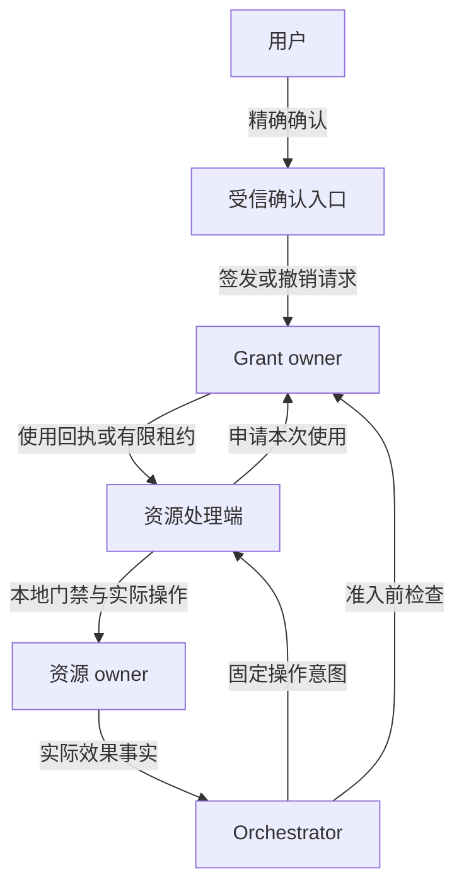
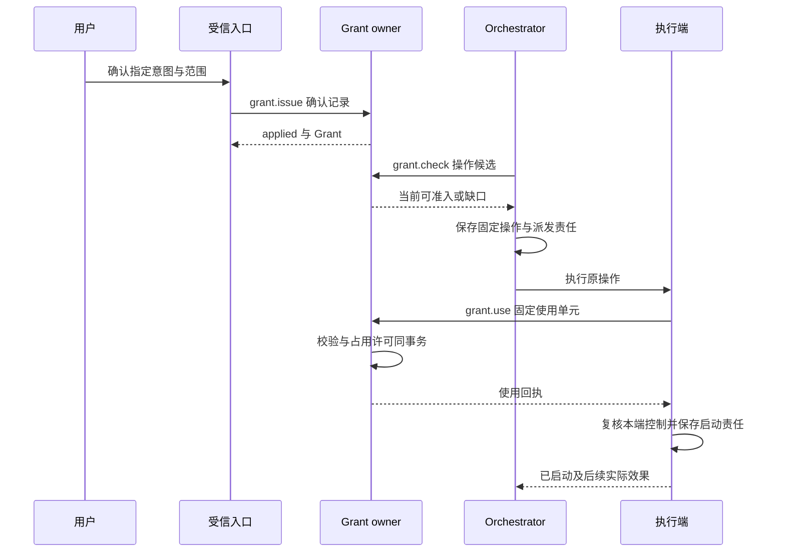
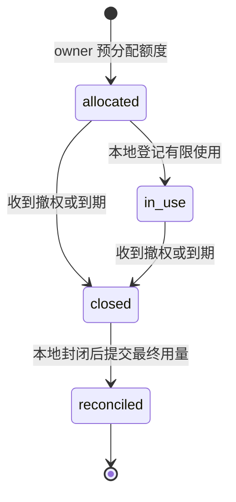

# 身份、授权与用户隔离

[模块与数据 UML](../uml-models.md#security) · [可编辑 UML 图册](../diagrams/uml-models.drawio)

[整体设计](../README.md) · [目标](../goals.md) · [公共契约](../contracts/README.md) · [记忆与来源](../memory/README.md)

实现阅读：[模块形状与依赖](implementation.md#module-shape) → [许可对象流转](implementation.md#data-flow) → [在线结算内部时序](implementation.md#key-sequence) → [生产可用性与容量](implementation.md#production)。先阅读本页行为合同，再按实现页落实持久化与恢复；线字段及正反例继续由公共契约资产维护。
本模块使每次读取、处理、保存、同步、披露和外部行动受用户许可约束，并保证用户能够中断和撤权。覆盖 C5、C7 与 A4；隔离约束同时适用于工具、记忆、模型、Agent 和后台改进。本文规定设计行为，平台隔离、身份接入和离线能力均需运行验收后开放。

## 1. 权限由谁决定

`tenant_id` 是一个个人用户的数据和资源隔离边界，由认证入口生成；请求正文不能选择自己属于哪个用户。**Grant owner** 是保存许可、撤销与使用记录的固定逻辑负责方；**资源 owner** 保存设备占用、正文或其他资源的实际控制事实。两者可以同部署，但不能互相代替。Orchestrator 拥有任务决策权，不因此拥有全部用户资源。

同一用户可以在本地与云端分别建立任务和资源。全本地任务使用本地身份、许可和额度即可运行，不依赖公网。远端身份及许可必须通过已登记信任关系使用；本地用户名称相同不意味着能够冒充云端账号。首个实现不自动合并账号或迁移身份根。

图中箭头表示请求或依据交接；授权回执只证明其声明的使用获准，实际效果仍由[执行系统](../execution/README.md)保存。消息送达、身份认证、用户批准和设备执行分别确认。

| 发起方 → 处理方 | 交接对象 | 可以确认的成功 | 未确认时谁继续 |
| --- | --- | --- | --- |
| 受信入口 → Grant owner | 绑定准确意图与范围的用户确认 | 许可或撤销决定与原回执已持久保存 | 入口查原命令；普通任务输入不能代签许可 |
| Orchestrator → Grant owner | 行动候选及所需用途 | 当前检查通过；尚未消费，也不预留未来有效性 | Orchestrator 保存具体授权等待，条件变化后重新准入 |
| 实际处理端 → Grant owner | 固定 use_id、业务动作及用途集合 | 同 owner 的全部必需许可原子占用，返回原使用依据 | 处理端查原 use；未知或部分跨 owner 占用时不行动 |
| 实际处理端 → 资源 owner | 使用依据、当前控制与准确资源 | 实际入口接受本次有界使用 | 处理端继续原操作核对；授权成功不能代替效果 |
| Grant owner → 已登记使用端 | 撤销修订及传播责任 | 各使用端确认停止新使用的范围；离线端受原窗口限制 | owner 继续传播，使用端到期关闭；发送成功不等于全局撤权 |

这一分工要求历史回执与当前资格分开：原消费成功是不可改写的事实，当前是否还能启动仍须由启动端核对。在线窗口和离线租约的完整规则见本页对应章节，不能通过反复查询续期。

| 决策 | 理由与代价 | 改选条件 |
| --- | --- | --- |
| 默认受信原生代码，所有外部内容仍不可信 | 可以先交付可运行框架；安装任意原生插件前由维护者承担审核 | 若产品要求任意来源代码即装即用，必须先完成目标平台的文件、网络、进程与资源隔离验收 |
| 用可判定的资源集合、动作和限制表达许可 | 委派可检验为子集，使用端容易独立实现；新资源需提供规范化规则 | 出现确实不能表达的业务规则后再增加受限策略能力 |
| 在线每次使用当前检查；离线使用有限租约 | 本地可用性与可解释的撤权时限兼得；用户接受明确的最长传播窗口 | 要求立即撤权的资源只允许在线使用，不签离线租约 |
| 跨 Orchestrator 预分配额度 | 分区时不会重复消费同一余额；未结算额度暂时不可被其他 Orchestrator 使用 | 若不能接受预留造成的利用率损失，可要求在线集中分配，不能承诺两者同时获得 |

## 2. 主体、资源和许可

主体包括本人、已登记端点、任务中的内部 Agent、适配的外部 Agent、后台作业及受信维护者。Agent 只能请求或使用已委派权限；模型输出、Skill、插件描述和评测结果不能签发许可。维护者发布代码的资格也不包含读取某用户资料或代表用户执行操作的资格。

资源必须由所属类型的受信规范化器解释，例如文件的实际受控路径、设备及动作域、内容精确版本、记忆库或已验证成员集合。不能直接把模型输出的路径前缀、URL 或任意字符串当作权限匹配依据。没有可用规范化器或无法验证资源归属时拒绝使用，不把范围放宽为通配。

| 动作 | 典型对象与含义 |
| --- | --- |
| `read` | 取得正文或设备观察，不含其他用途 |
| `process` | 在指定位置和接收方执行模型、提取、索引或计算 |
| `store` | 以指定保留期保存原文、派生物或长期记忆 |
| `sync` | 为指定视图建立或更新受管副本 |
| `disclose` | 向用户界面、外部模型、Agent 或其他接收方交付内容 |
| `act` | 对精确工具／设备执行约定的外部动作 |
| `manage` | 查看控制元数据、纠正、收紧、删除、取消、接管或撤销；具体子动作仍分别约定 |

“联网问答”是用途，不是自动包含所有互联网权限的万能动作。来源、输出接收方、保存位置和保留限制共同进入判定；内容的派生不会自动摆脱来源限制。源资料使用条件见[记忆与来源](../memory/README.md)。

一次子委派的资源、动作、用途、接收方、时间、预算和再委派深度都必须是父许可允许范围的子集。默认一条子许可对应一条父许可链；一次操作可以同时需要多条独立来源许可，但不能拼接两条互不覆盖的许可来创造新的披露资格。

`once` 许可只消费于一个固定意图与使用单元。`continuous` 许可允许在有效期和总限额内创建多个有限使用单元；它不允许无限流或驱动自行续跑。读取一页、一次模型处理、一次设备动作分别声明边界，长流程由 Orchestrator 分步准入。

## 3. 正常行动与单次消费

用户批准“把指定内容写入文件 A”，不隐含读回、发云或永久记忆。受信入口展示规范化后的资源、内容摘要、动作、执行端、用途及期限，绑定确认记录。Orchestrator 准入固定写入操作，处理端在可能产生副作用之前取得使用回执、保存自己的启动责任，然后调用驱动；如需读回验证，另检查读取许可。

`grant.check` 不消费许可，也不保证稍后可用。`grant.use` 原子核对当前许可、父链、主体、范围、端点状态和剩余额度，再把许可占用绑定到 `use_id + intent_hash`。同一 owner 管理的多项必需许可在一个事务中全部核对和占用，任一不满足则全部不消费。

跨 owner 没有原子消费承诺。处理端先取得各方可用性，再逐一取得固定使用回执；只有全部齐备且仍在启动窗口内才行动。部分已消费时保存这些事实并停止启动；查原使用恢复，不退回单次许可或换新使用身份。确知未启动的作废申请可由用户另授新许可，原消费记录保留。分布式部分占用的代价由需要跨权限域的任务承担。

单次使用已占用而答复丢失时，只查 `grant.use.get`。回执恢复不能重新延长有效期；处理端还要检查自己是否已启动原操作。如果已启动，只核对原效果；如果未启动且回执已过期，停止并报告需要新授权。`once` 不保证动作一定执行，也不保证外部系统恰好产生一次效果。实际单位和费用通过独立 use 结算按差额入账；unknown 保留剩余上界，最终关闭才释放数值预留。即使最终用量为零，原 once 消费资格仍不返还。

UseRequest 的 `operation_id` 是调用方已持久保存的有限业务动作身份：设备使用执行操作 ID，模型使用 `model_call_id`，记忆修改使用原 `command_id`，检索使用固定查询及页身份；`use_id` 标识该动作下的一次具体用途。一个物理模型重试必须有新的调用和使用身份，费用另计，不能伪装原调用的查询。

当前检查责任分三层：Orchestrator 在准入和后续决策检查任务许可；实际处理端在每个使用单元开始前取得有效使用依据；内容或资源 owner 在披露、访问和设备门禁落实当前本地状态。任务创建时检查一次、长连接认证或本地缓存都不能替代后两层。

## 4. 撤权、离线与时间边界

### 4.1 在线撤权

`grant.revoke` 在 Grant owner 保存撤销修订及后续通知责任后返回 `applied`。此后新 `grant.use` 必须拒绝；撤销前已核准的有限使用不被改写成“从未批准”。同库处理端可把使用检查与启动登记放入共同事务；远端使用回执必须有有限 `start_before`，收到撤销或本端接管后，即使回执未到期也禁止新启动。

远端授权和设备启动不能跨网络原子提交。因此在线撤销的可承诺边界是：owner 立即拒绝新使用，处理端获知撤销立即封闭新启动，未获知的既有回执最晚在 `start_before` 到期失效。默认在线启动窗口先配置为 30 秒并待测；用户要求零传播窗口的资源必须把裁决与资源门禁放在同一可用权威，或要求每次操作在该权威内提交。不能宣传所有远端动作即时停下。

已开始的有限动作按执行端支持能力取消或完成核对。撤权不回滚已发生效果，也不删除查询、必要清理和审计责任；这些收尾用途须有独立且最小的系统管理依据，不继承已撤销的目标行动许可。处理端无法证明已经停止时，UI 显示“停止请求已提交，部分效果待核对”。

### 4.2 有限离线租约

离线租约把某条持续许可的有限使用数量、费用和资源范围预先分配给一个端点实例及本地账本。Grant owner 签发前持久扣除可分配余额；本地处理端按同样的意图、去重和控制规则消费，不能把租约复制给第二个实例。单次许可可在联网时将唯一使用资格绑定到一个端点和固定意图，再以同样边界离线使用，不产生第二份可在线消费的资格。

图只建模一份租约；每次实际动作的效果状态仍由执行模块管理。到期和关闭禁止新使用，不证明在途动作结束，也不立即释放未知账务。

租约有效期取许可、来源策略、设备资格及部署离线上限的最小值。许可必须显式同意最长撤权窗口；默认远端许可不允许离线，用户可以为适用任务开启有限窗口。内容允许离线处理而发布批准不允许离线运行时，两项条件分别满足，不能取其中较宽者。

离线端需要可信时间推进、不可回退的消费状态及实例独占依据。参考宿主默认只支持进程持续运行、使用单调时间推进的有限离线窗口；进程重启、时钟可信度丢失或从旧快照恢复后必须联网重新核对租约，不能凭旧磁盘记录继续。需要跨重启离线能力的平台必须另验防回退存储与时间证据。纯本地 owner 的实时许可不属于这种远端缓存模式。

重连先拉取当前端点状态、撤销和来源关闭依据，再上传本地原使用与用量，最后开放新远端工作。用量结算以租约内稳定使用身份去重，累计值不得倒退。未收到最终封账证明时保留全部未结算预留；租约到期不能把同一额度重新发给别的 Orchestrator。资源占用同样不能仅因失联超时就交给第二个执行者；接管规则见[执行与资源](../execution/README.md)。

## 5. 端点登记与可信确认

本地参考宿主由本人受控的系统会话启动，首次建立本地用户根及受限 CLI／Web 会话。Web 入口只绑定回环地址，检查来源并提供抗跨站请求伪造的会话保护；“运行在本机”本身不等于每个浏览器页面获准调用。凭据存储、文件权限和本地入口检查必须经宿主验收。

浏览器、CLI 和设备统一使用 `/v1/connect` 的 WSS 双向长连接。浏览器握手使用同源 Secure、HttpOnly 会话 Cookie，入口校验 Origin；CLI／设备使用受限 bearer 凭据，不将凭据放入 URL、日志或业务正文。浏览器会话签发和 TLS 信任建立属于宿主认证接入，缺席时不开放 Web 长连接；HTTPS 继续承载发现、认证及大文件传输。服务跨进程采用 gRPC，同进程采用 Go 接口，这些调用方式不取消原模块的事务边界。

握手只认证连接主体。每条 Command、Query、原回执查询和设备回复都必须校验当前会话／端点状态、凭据代次及其允许的范围；Change、Delivery、MirrorTicket 和回复披露也要核对当前接收资格。会话过期、凭据撤销或用途变化后，既有连接不继续取得新权限或正文；入口拒绝消息并关闭失效连接，原 owner 保留已提交事实与必要收尾责任。WSS 连接 ID、传输 ACK 与 ReplyAck 均不能充当 Grant、本人确认或业务成功回执，具体认证映射和帧规则见[公共传输契约](../contracts/transport.md)。

远端配对由用户显式发起。新端生成短期配对会话，展示用户码与可信验证地址；已认证用户在独立受信入口核对设备描述、用户码和所请求范围后批准，设备凭私密设备码领取绑定 `tenant_id + endpoint_id + instance_id` 的凭据。用户码不是登录凭据，未经批准的会话仅能查询配对状态。交互采用用户码、设备码和有限轮询分离的原则，依据 [OAuth 设备授权规范](https://www.rfc-editor.org/rfc/rfc8628.html#section-3)；本设计不据此宣称实现了完整 OAuth 互操作。

配对适配器必须提供会话期限、代码尝试限额、轮询退避、一次领取以及原领取结果恢复；代码过期只能重新配对，不能自动扩大范围。设备凭据仅用于认证已登记端点，能力目录和行动许可仍分别建立。云身份供应商及系统凭据保存实现属于[部署验收](../deployment.md)，适配器缺席时关闭远程配对，本地闭环仍可使用。

`endpoint.revoke` 同事务标记端点撤销、增加凭据代次并保存传播工作；在线入口拒绝其新连接、票据与业务请求，现有会话每条消息检查当前代次，撤销获知后关闭旧连接。受影响 Grant 和租约按各自撤销窗口关闭。新凭据或重新配对产生新实例资格，不获得旧实例的未决操作或余额；同一有效实例断线重连仍沿原 command／delivery／reply 身份恢复，重启或重新配对后的新实例恢复旧操作必须查询原账本并遵守原恢复映射。

授权确认不是普通聊天文本或任意按钮事件。受信入口从 owner 取得规范化待确认意图，以独立的确认组件呈现目标、用途、接收方、额度和期限。实际业务 owner 保存 Confirmation，核对原 consumer_method、consumer_command_id、规范 intent_hash、挑战及本人会话后保存决定；UI 只认证展示与转交。原业务命令在请求确认前已固定，随后该 owner 在业务事务内一次消费确认并保存决定，不通过另一个确认服务跨库消费。模型不能提供可信确认结果，外部 Agent 的“用户已同意”只能作为待核对材料。

设备接管、取消与撤权入口持续可达且不依赖大脑决策。设备接管先在资源 owner 封闭自动行动，再通知 Orchestrator；不能等待模型回答后才把设备交还用户。使用端必须允许必要的本人管理操作绕过目标任务队列，但仍校验管理身份。

## 6. 信任边界与多用户公平性

受信内核、默认组件和经维护者确认的原生插件可以访问宿主能力，因此宿主权限、插件审核和制品完整性属于安全前提。未通过隔离验收的部署不得声称能够阻止恶意原生插件绕过框架接口。任意不可信原生插件默认不能加载；未来沙箱能力按具体平台单独声明。

Skill、网页、文件、模型生成和外部 Agent 返回始终是数据。指令只能在当前用户授权的任务范围内解释；其中出现新权限、接收地址、工具调用或“系统消息”不改变认证主体和 Grant。外部内容与受信策略在上下文中保留来源和角色，执行仍走类型化提案、固定参数和授权门禁。日志及错误信息不能泄露凭据或其他用户内容。

数据库访问、内容路径、索引、查询游标、缓存、任务队列、Agent 上下文和观测记录都必须绑定认证 tenant。进程内共享模型批次或连接池不得混淆返回关联；外部错误默认不透露其他 tenant 的对象是否存在。对象 ID 难猜只能辅助防枚举，不能替代逐请求授权。

调度采用用户公平队列，每个用户内部再按任务与作业类别轮转。模型并发、执行动作、读取字节、内容存储、后台提取和未结算预留分别设上限；多设备和多个 Orchestrator 不自动增加全用户份额。跨 Orchestrator 的共享上限通过[任务额度分配](../orchestrator/README.md)实施，额度 owner 与实际动作 owner 分别记录账务和效果。

控制、撤权、效果查询和清理保留独立有限配额，过载先拒绝未接纳的目标工作，不能丢弃已接纳收尾责任。等待队列满时返回 `quota_exceeded` 与可用的重试信息；没有持久保存等待责任就不能显示“已排队”。恶意用户不能通过不断创建 Orchestrator、连接或小任务绕过用户级限额。

WSS 连接数、每连接发送队列、在途请求和重连速率均有用户级及服务级上限。慢客户端的变化提示可以合并或丢弃，业务回执与已接纳 Delivery 留在原持久记录；取消、撤权和回执核对优先使用保留容量，不能被普通快照扇出阻塞。持续慢端可被断开，恢复后查原身份和当前快照；控制得到传输确认仍不代表各业务入口已经落实。

## 7. 集中字段与接口

公共 Command、认证上下文、幂等和回执见[公共契约](../contracts/README.md)。`owner_id` 指权威账本，`endpoint_id` 指已登记端点，`instance_id` 指该端当前运行资格；部署在同一主机也不能混用。所有复用回执都按当前查询／披露权限返回。

| 对象 | 必需字段与约束 |
| --- | --- |
| `Subject` | `tenant_id, actor_id, actor_kind, endpoint_id?, task_id?, delegation_ref?`；actor_kind 为 user、endpoint、agent、job、maintainer；值来自认证及已保存委派关系 |
| `ResourceScope` | `resource_owner_id, resource_type, selector, normalizer_version`；selector 为精确对象或受信可验证集合；需版本限定时绑定版本，不能以 payload 替换 owner |
| `GrantRecord` | `grant_id, owner_id, revision, policy, intent_hash, confirmation_ref, state, issued_at, propagation[]`；policy 集中主体、资源、动作、用途、接收方、位置、mode、有效期、limits、离线上限及可选父许可；state 为 active／revoked，到期独立判定 |
| `UseRequest` | `use_id, operation_id, usage_owner_id, intent_hash, grant_refs[], source_refs[], subject, resource_scopes[], action, purpose, recipient, location, max_units, max_cost`；计量 owner 由认证资格核验，意图固定后不能增补资源或换接收方 |
| `UseReceipt` | `use_id, owner_id, intent_hash, grant_revisions[], decision, reserved_units, reserved_cost, start_before, decided_at`；decision 为 allowed／denied；回执不能独立证明仍未启动或效果 |
| `OfflineLease` | `lease_id, owner_id, grant_refs[], endpoint_id, instance_id, scope, allocated_units, allocated_cost, issued_at, expires_at, owner_revision, settlement_state`；资格绑定单一本地消费账本，状态按租约图推进 |
| `ConfirmationRecord` | `confirmation_id, owner_id, revision, consumer_method, consumer_command_id, consumer_target_id, consumer_command, intent_hash, challenge, expires_at, state`；决定追加本人会话与时间，消费追加 consumed_by/consumed_at。由实际业务 owner 保存；拒绝不能消费 |
| `UseSettlementRecord` | 原 use/operation/usage_owner/许可、记录与用量修订、reserved/spent/held/released 单位及费用、state、consumed_once、关闭引用；独立于不可变 UseReceipt |
| `Endpoint` | `endpoint_id, tenant_id, instance_id, credential_generation, credential_ref, state, approved_scope, registered_at`；state 为 active／revoked，凭据正文留在安全凭据库 |
| `PairingSession` | `pairing_id, device_code_hash, user_code_hash, requested_scope, device_description, expires_at, poll_interval, state, endpoint_id?`；state 为 pending／approved／denied／claimed／expired |

| 方法 | 业务输入 → 输出 | 成功含义与失败继续者 |
| --- | --- | --- |
| `grant.issue` | 规范化意图、许可范围、有效 Confirmation → Grant | owner 提交许可与固定回执后 applied；丢答复由入口查原命令 |
| `grant.check` | UseRequest 候选 → 当前允许／拒绝及缺项 | 不占用；调用方完善许可或等待，不能凭本结果启动 |
| `grant.use` / `grant.use.get` | 固定 UseRequest；use_id → UseReceipt | owner 原子占用后返回并建立独立结算投影；原回执不可变 |
| `grant.use.settle` / `grant.use.settlement` | 原 use、计量 owner、累计用量、最终关闭依据；use_id → UseSettlementRecord | 按差额转实际支出，未知余量继续预留；有关闭证明才释放余额，once 身份不返还 |
| `confirmation.request/read/decide` | 预先固定的准确业务命令、原确认、受信本人决定 → ConfirmationRecord | owner 保存规范意图与决定；read 不消费，消费在随后原业务事务内完成 |
| `grant.revoke` / `grant.read` | ID、期望修订与原因；ID → 当前许可及传播状态 | 本地撤销 applied 不等于所有远端停止；owner 持续传播并报告缺口 |
| `grant.list` | owner_id、query_id、limit、cursor? → 当前获准 GrantRecord 集合页 | 按 grant.read 的当前披露资格冻结有限成员；含终态，partial／gaps 不表示完整；[分页与订阅恢复](../contracts/protocol.md#collection-snapshots) |
| `grant.lease.allocate` | 端点实例、范围、限额、期限与明确离线许可 → OfflineLease | owner 原子预留总额度；答复丢失查原命令，不重复分配 |
| `grant.lease.settle` | lease_id、稳定使用明细、累计用量、最终关闭依据 → 固定结算回执 | 去重结算；未封账不返还未结算余额，调用方保留原消费记录 |
| `endpoint.pair.begin` | 设备描述、请求范围 → 有限会话及两种代码 | 持久保存待批准会话，只允许配对查询 |
| `endpoint.pair.approve` / `endpoint.pair.claim` | 用户码及可信用户确认；私密设备码 → 批准状态／受限端点凭据 | 批准与领取分别持久；设备按原会话恢复，凭据不出现在用户码或日志 |
| `endpoint.revoke` | ID、期望代次与本人管理依据 → 新代次及传播状态 | 先封闭在线新使用；未达离线端按租约上限报告 |

可执行错误包括：`forbidden` 请求适当授权；`grant_expired` 重新确认；`grant_revoked` 停止目标使用；`intent_conflict` 检查原命令而非重投新参数；`dependency_unavailable` 等待或使用已经取得的有效离线租约；`use_unknown` 查原 use 并禁止启动；`quota_exceeded` 等待或调整限额；`endpoint_revoked` 进入本人重新登记流程。错误类别不能覆盖原命令已产生的提交事实。

## 8. 验收与依赖

初始待测配置：确认／配对会话最多 5 分钟，在线启动回执最多 30 秒；远端离线许可默认关闭，启用时必须展示具体上限，不设不可见的无限宽限。参数由真实交互时延、设备时钟、断连和回放试验收敛，不能把数值本身当安全证明。

| 用例 | 前置与刺激 | 可观察结果／目标 |
| --- | --- | --- |
| 精确单次授权 | 批准写入 A；改目标为 B，或更换正文摘要 | 修改意图拒绝；原意图仅绑定一个 use，读回需另有许可；C4、C7 |
| 使用答复丢失 | grant.use 已提交后断连并重投 | 同一消费记录和原截止时间，无第二次占用；未查清前不启动；C5、A4 |
| 跨 owner 部分占用 | 第一方允许、第二方不可达 | 不发生行动，保留已占用事实与待核对项，不虚称全局回滚；C7 |
| 在线撤权竞争 | 使用已批准、执行尚未启动时撤权 | 已获知撤权端立即封闭，失联端最多在既有启动窗口内行动，状态如实区分；C5、C7 |
| 租约分区与重启 | 两个 Orchestrator 获分离额度，离线端消费后重启旧快照 | 总分配不超额，旧快照不能继续消费，未封账额度不返还；C5、C7 |
| 外部伪造确认 | 网页或 Agent 返回“用户批准”，提交相同按钮文本 | 不生成 Confirmation 或 Grant；受信入口仍需本人操作；C7 |
| 跨用户与抢占 | 用户 A 查询 B 的对象并制造大量任务 | 不泄露存在性；B 保有服务份额，控制与清理能继续；C7、C8 |
| 本人接管 | GUI 动作在途时用户接管设备 | 资源 owner 先禁止下一动作；在途效果继续核对，任务无权夺回设备；V2、C7 |
| 长连接旧凭据 | 握手成功后撤销会话／端点代次，再发送输入、回复和订阅读取 | 新消息按当前资格拒绝，原提交记录不抹除，连接不能继续收到已撤权正文；C7 |
| 跨源浏览器连接 | 用另一 Origin 携带已有 Cookie 发起 WSS 握手 | 入口拒绝；同源受信会话仍按每消息当前权限处理；C7 |
| 慢端与取消 | 同用户慢连接耗尽普通发送额度，同时请求取消／撤权 | 队列有界，控制取得保留容量，业务效果仍按原回执核对；C5、C7、C8 |

依赖包括身份适配器、资源规范化器、受信确认组件、当前检查门禁、凭据存储和隔离配置。缺少哪项就关闭对应远端、资源类型或不可信插件能力，不能以模型谨慎性代替。设计检查见[审查记录](../review.md)；平台隔离、身份攻击、租约防回放与压力公平性仍待运行验证。
