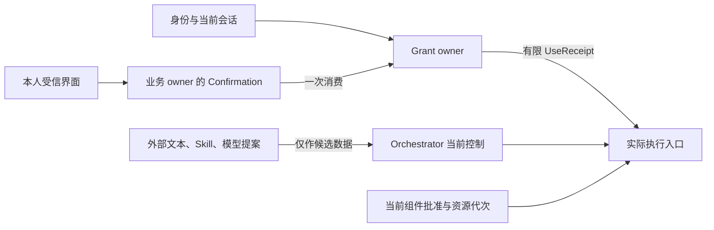

# 身份授权与可信确认

认证回答“谁在请求”，Grant 回答“此主体可以怎样使用哪些资源”，Confirmation 回答“本人对哪一条准确命令作了什么决定”。三个结果不能互相代替，执行端还要在真实入口检查当前资格。

默认每次用途分别授权。读取不自动允许提取、长期保存、同步、向模型披露或执行写动作。插件安装、Skill 指令、模型自述和子 Agent 请求均不能扩大权限。

字段、来源与存储关系统一见[本模块数据记录](../data/module-records.md#6-授权与费用)和[存储附录](../data/storage.md)。本章集中说明业务裁决与恢复。

## 1 信任边界

外部文档、工具返回、网页和普通模型输出均是数据。只有受信身份入口、准确策略和显式本人决定可以提供授权依据。租户来自认证上下文，正文中的 tenant_id 仅供核对，不能选择数据域。

身份适配接公司 OIDC 与凭据托管；开发只用受限 dev 身份，生产拒绝该身份域。每请求核验身份、租户、服务目标、会话/凭据代次和期限。WSS连接存活不代表会话未撤销。

设备配对采用短期单用途 pairing_id，预认证范围只允许 begin/claim，不能自选租户。本人在受信会话批准准确设备公钥/指纹、用途和范围后才绑定账户。claim 沿原配对身份恢复，丢答复不重复生成独立凭据。撤销 endpoint 推进凭据代次、封闭新使用并传播；旧设备账本仍保留核对和最小关闭责任。

## 2 Grant 和使用裁决

Grant 固定 subject、resources、actions、purpose、处理/存储位置、recipient、validity、数值上限及 once/continuous 类型。派生许可只能取父当前范围、Agent上限与本次批准的交集。原 Grant state 为 active/revoked，过期由可信时间裁决。

`grant.check` 是当前预检，不消费许可，也不保证之后一定允许。`grant.use` 按唯一 use_id 和准确 intent_hash 原子检查并消费相应额度/once，返回 allowed/denied、原 grant revisions、reserved_units/cost、cost_bound 和 start_before。相同 use_id 异意图拒绝。

必要许可在同Grant owner范围内共同消费；跨授权域只能逐域取得固定use。部分已消费而后续失败时不行动、不恢复once，只有证明永久未启动才能以零用量封账并释放可释放的数值预留。

UseReceipt 只允许原主体、原操作、原接收方和有限窗口启动。新操作不能复用；零调用、失败或退款也不能恢复已经消费的 once。用量结算由独立 `grant.use.settle` 保存，使用回执不可变。

实际启动取所有截止最小值：Task/Operation期限、ControlSnapshot.start_before、UseReceipt、ApprovalUse、资源租约、观察窗口和宿主安全截止。当前已知撤销或控制更高修订立即阻断新入口。无法核验原 authority 时等待，不缓存永久 allowed。

### 启动窗口到期后

UseReceipt 的 start_before 过期不自动续长。首版不支持修改原use的启动窗口：

- 能证明原使用在所有登记入口都未越过StartBarrier，且旧发送已永久封闭：Executor 保存原操作closed/not_started、may_apply_later=false和零用量依据；授权/预算方按原来源结算可释放的数值预留。once保持已消费
- 是否启动仍未知：保留原Operation、use、预留和核对责任。时间过去、丢回执、设备离线都不证明未启动
- 后续仍需行动：先取得必要的新本人批准或Grant，再由当前Task重新决策并持久准入后续Intent/operation_id与预留，然后为这个已存在的准确身份取得新的UseReceipt；记录retry_of_operation_ref/原逻辑步骤关联，保留累计尝试和续行限制。continuous许可在当前范围内可签新use；once必须取得新的本人批准/许可，不得自动返还旧once

后续行动只允许在原发送关闭、无未知或迟到可能且当前条件允许时准入。它不是“换ID重发未知”。正常同Operation的安全Attempt仍受原UseReceipt窗口和总次数约束；过期后不借重试扩大时间。

grant.use payload 固定 use_id、target_ref/target_kind、intent_hash、grant_refs、requested_units:Amount[]、recipient、location、purposes、start_before；applied返回不可变UseReceipt（allowed或denied）。grant.use.settle 固定原use_id与原来源UsageSnapshot，按源修订归并并返回UseSettlement；不得让调用方自报零费用释放未知。grant.issue/revoke 的变更必须走受信业务策略和准确Confirmation；公开创建不接受任意主体自授权限。特有reason为 scope_exceeded、once_consumed、use_intent_mismatch、window_expired、settlement_unverified。use.get/settlement.read 是原身份查询，不重新消费或续期。

## 3 确认由真正的业务 owner 消费

Confirmation 固定 request_id/revision、business_owner、original_command、canonical_intent_hash、准确预览引用、风险/限制、本人主体、expires_at 和状态。状态为pending、approved、denied、expired、consumed；保存consumed_by/at和受信会话绑定的单用途challenge。消费事务锁定approved且未消费的记录，校验challenge、本人会话与原意图；消费关联不可改写。

1. 业务 owner 保存确认请求、准确待批准命令及恢复责任
2. 受信 Renderer 获取和呈现准确正文、目标、金额、用途及限制
3. 本人决定绑定当前请求版本，owner 保存决定
4. 原业务事务重新核验当前授权、请求与内容版本、期限，并一次消费 approved，同时保存实际业务决定和后续 Job

确认通过后参数变化，必须创建新的确认；不能只更新界面。网络重投只返回原消费决定。确认获准不保证原业务还能执行，例如预算已用尽、目标修订、来源关闭或权限撤销。

依 [ADR 0008](../../adr/0008-trusted-renderer-preview.md)，preview_refs 表达准确版本关联，不是“用户看过”的密码学证明。受信 Renderer 负责取得和显示；业务端无法仅凭引用识别绕过界面的客户端，更不能证明用户理解。这一限制在高风险入口选择时必须显式评估。

### 等待本人决定的原命令

需要 Confirmation 的业务方法允许 P→A/R。首次收到准确待批准命令时，原 owner 同事务保存该命令的 accepted/pending_confirmation、Confirmation 与恢复 Job；不能先固定 rejected 再把确认改绑到新命令。确认创建必须在本方法的受信策略要求内，不接受模型自报“用户同意”。

`confirmation.decide` 是独立命令，payload 为 request_id、request_revision、decision=approved/denied、challenge、preview_refs；target 为原确认 owner。认证主体必须与请求本人一致。applied 输出 confirmation_ref/state，只表示本人决定已存。owner 与决定同事务唤醒原业务准备；客户端不重建原业务命令。读取原确认和原命令都检查当前披露。

| 确认/当前业务事实 | 原业务命令下一步 |
| --- | --- |
| pending且未过期 | 保持accepted，等待原请求；无忙轮询或隐式行动 |
| approved，版本、内容、当前权限、预算、目标均有效 | 原事务一次consume并提交业务决定与Job，原命令applied |
| approved但目标/输入已变或权限失效 | 固定rejected，reason为confirmation_stale或authorization_changed；已批准不保证能执行 |
| denied / expired | 原命令固定rejected，reason为confirmation_denied / confirmation_expired；保留原身份 |
| consumed或同命令重交 | 查原consumed_by与原回执；不恢复challenge或once |

Confirmation.expires_at 是最晚决定且消费的时间；原命令及时accepted后不靠Command.expires_at延长这个时间。新意图或新确认必须是新的明确业务请求，不改旧拒绝。

## 4 估算费用的本人接受合同

本系列新增 `policy.acceptance.create/read/revoke`，由原 Orchestrator 的受信策略入口保存，不另设批准服务。

create 输入为准确 policy_ref/digest、subject、task/能力范围、计价单位、每次有限预留方法、任务预算范围、期限、非硬上限说明和 Confirmation 引用。受信 Renderer 展示上述内容；原 owner 在同一事务消费确认并保存 acceptance_id、显示摘要、原命令与回执。

Task.submit 固定 acceptance_ref。每次新的 estimate 计费准入直接检查该记录当前有效，并取 Task、Grant和能力范围交集。撤回只停止后续使用，不清原账单或已发生费用。

这项合同只在 Task 与相关 Grant owner 可共享同一受信事务时开放。跨事务域、经allocation分配和离线采用strict，避免把只有 policy_ref 的远端请求误当“用户接受了无限风险”。若以后要跨域估算，必须增加独立的准确接受凭据、撤回窗口与验证协议，不得复制原 owner 的 allowed 状态冒充当前授权。

## 5 离线许可是有限窗口

只有已明确批准的离线能力可以在断网后继续。`grant.lease.allocate` 将严格数值额度从原 owner 保守分配到准确 endpoint/instance，固定 lease_id、范围、期限和不可续长的关闭规则。上游额度已被占用，下游不能再分发出超额能力。

端侧设备 SQLite 中的原使用账本是该 lease 的唯一累计报告者。每次 use 在设备数据库事务中核对剩余额度、once、任务控制和期限，保存原操作绑定。重新配对或新实例不能继承旧 lease。默认云端 Task 的离线使用只能绑定原 Orchestrator 已准入的行动；离线 lease 不授予设备新的 Task 裁决权。

撤权提交后，在线新许可拒绝；已签有限离线窗口内的旧实例可能继续。因此 UI 同时显示撤销决定、已确认停止的入口和仍在窗口内的范围，不宣称瞬时全局撤回。需要更强撤回的用途不得离线。

重连先核身份代次、撤权、TaskGate 和原使用，再封账。lease 为 open/closed/reconciled；closed 禁止新 use，reconciled 需 spending_closed 与可信完整累计费用。失联或自然到期不得自动释放未知额度。后续更正只更新原已知用量，不新增 use、不恢复一次资格、不再释放第二遍余额。

## 6 内容披露和设备入口

每次正文使用核验来源当前限制、处理位置、接收方、用途与准确版本。派生内容采用全部实际处理来源的限制交集。摘要、向量、日志、UI缓存和模型metadata都可能是披露载体，不能只检查主请求正文。

默认镜像每次读回原 owner 当前控制；有字节不等于有使用权。正文撤回后，认证 holder 仍可用 `content.get(mode=control)` 查询自己的停止/清理责任，但不能取得下载定位或正文。

Executor 实际入口使用稳定资源身份和 control_epoch；旧回调绑定原实例。签名只能证明声明来源，不能证明目标系统实际已经停止。凭据由受控出口按精确能力注入，不给插件全量环境变量、设备句柄或数据库连接。

## 7 隔离必须由探针证明

默认内核和审核后的内置组件在 Go 进程中；不可信原生扩展只在隔离进程/容器中运行。受限程序工具无直接网络、宿主文件、凭据和子进程，typed hostcall 走正常准入。缺平台边界时关闭该能力。

测试覆盖路径穿越和链接替换、DNS重绑定/重定向、SSRF、私有地址和元数据服务、继承文件描述符、秘密日志、子进程树逃逸、资源耗尽和跨租户猜 ID。还要用真实出口计数验证直调 adapter、后台摘要/标题、嵌套 hostcall 等旁路。仅安装一个 checkpoint 中间件不能证明所有出口受控。

RLS、代码级资源核验、凭据范围和进程隔离叠加使用。后台 worker 不用超级用户绕过租户边界。遥测只含获准结构化标识与聚合值，正文和秘密默认不进入日志；采样日志不能作为权限或计费真值。

## 8 失败时保持什么

授权不可达阻止依赖它的新使用；不相关租户不必全局停机。当前控制无法耐久提交时不能回复“取消成功”。原动作已经可能发送，则保留效果、用量和停止核对，不能因授权后来消失而伪造未发生。

凭据、许可和账本从旧备份恢复前，必须补齐后续撤权和关闭事实；缺历史时只开放安全诊断。可信时间证据失效时不延长 use/lease，也不先回收旧槽再期待旧实例停止。具体时间证明和灾备门槛见[生产运行](../production/README.md)。
