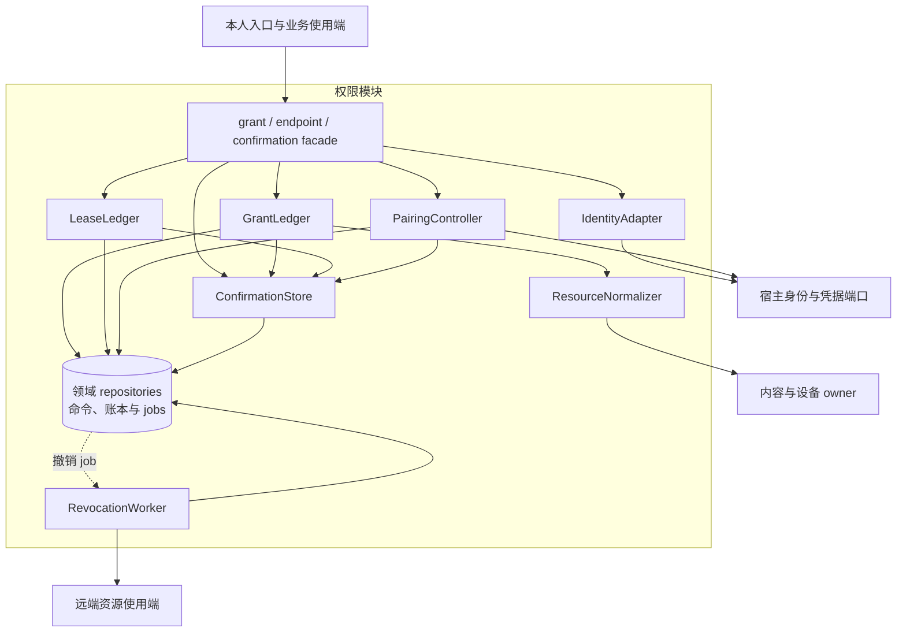
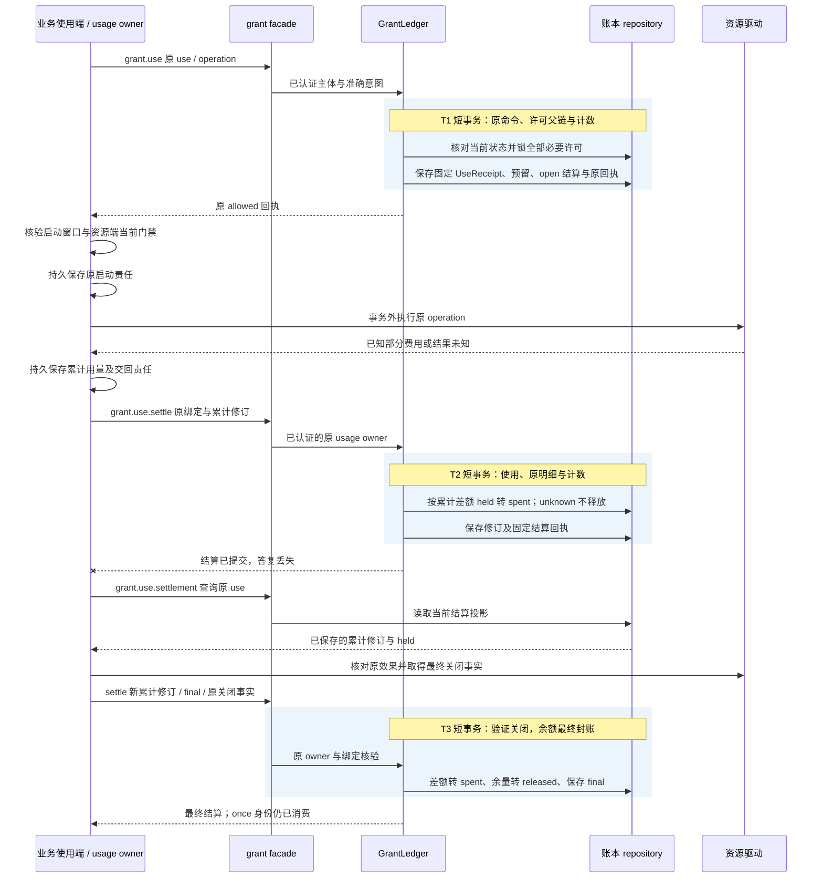
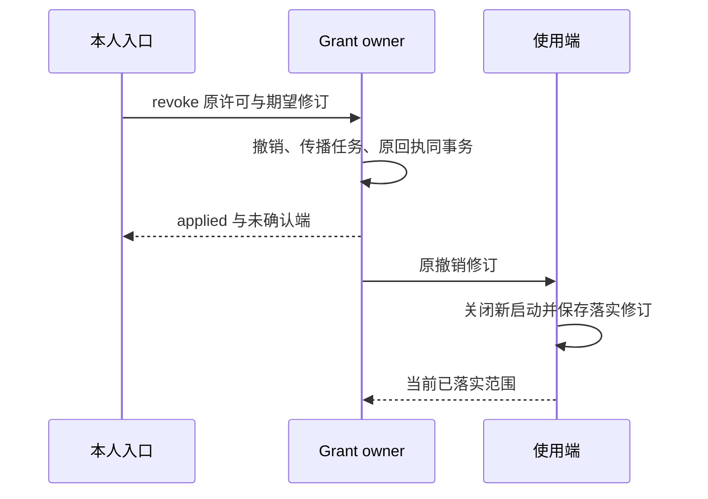

# 授权账本、配对与恢复实现

[模块主线](README.md) · [公共契约](../contracts/README.md) · [线字段](../contracts/protocol.md)

本页把身份和授权合同落实为默认宿主的内部边界、记录及事务。
权限内容、单次消费、撤权窗口仍以模块入口为准。
实现从生产多租户与多副本装配验证当前身份、许可和恢复；开发单体复用这些规则。远端配对和离线租约使用原许可账本，不另造可覆盖历史的缓存授权。
本文中的表名与事务顺序是参考实现，外部保证属于规范。

## 1. 模块形状与内部依赖

权限模块是宿主内的领域包，对外 facade 是已登记的 grant、endpoint 和本 owner 的 confirmation 方法处理器。
处理器先把认证上下文交给 IdentityAdapter，再调用 GrantLedger、LeaseLedger 或 PairingController；这些应用入口组织事务，许可父链、范围收缩与余额守恒规则留在账本内。
ConfirmationStore 和各账本 repository 使用宿主的同一事务句柄，ResourceNormalizer、身份与凭据适配器则隔离外部依赖。
RevocationWorker 是领取持久 job 的后台入口；增加工作进程不会新增一套许可权威，也不要求将表中的单元部署为独立服务。

| 内部单元 | 输入与输出 | 独占责任 |
| --- | --- | --- |
| IdentityAdapter | 已验证会话 → Subject | 绑定 tenant、actor、端点及凭据代次；正文不得改写 |
| ConfirmationStore | 原业务命令、受信本人决定 → 同 owner 的确认记录 | 保存规范意图、挑战及一次消费，与业务决定同事务 |
| ResourceNormalizer | 类型化选择器 → 规范资源集合 | 解析受控文件、内容、设备；验证 owner 与版本 |
| GrantLedger | issue/check/use/revoke → 原记录与回执 | 许可父链、用途及额度的最终裁决 |
| LeaseLedger | allocate/settle → 单实例预留与结算 | 离线额度守恒、使用去重与最终封账 |
| PairingController | 会话、用户批准、设备领取 → Endpoint | 有限预认证窗口，一次领取与原结果恢复 |
| RevocationWorker | 撤销修订 → 逐端应用记录 | 传播与核对，不把发送成功当实际封闭 |

同步处理单元在业务入口内装配，RevocationWorker 在独立工作池领取同 owner 的持久责任；两者共享原授权提交域。开发单体可以合并进程。
IdentityAdapter 与资源类型规范化器是装配端口；许可规则集中在 GrantLedger。
扩展插件不能直接访问许可表；资源规范化器也不能签发 Grant。
许可查询和调用裁决分开：一次 check 的结果不能作为稍后 use 的授权凭证。

图例：实线表示同步依赖；指向 repositories 的实线为同 owner 内的事务读写，虚线为数据库持久 job 的领取。IdentityAdapter 校验宿主身份，PairingController 保存凭据，ResourceNormalizer 解析准确资源，RevocationWorker 向使用端控制与核对；这些外部端口调用均在写事务外执行。
图中 ConfirmationStore 只保存本 owner 的确认；evaluation 和 Orchestrator 在各自提交域装配同一确认能力，由其业务事务消费。
资源解析先取得准确引用，事务内再核对其授权绑定；来自另一 owner 的当前资源状态没有跨库原子保证，实际使用端仍须核验自己的门禁。
资源规范化失败、确认失效、当前身份不匹配都在写事务前或事务内拒绝，不能降级为任意资源范围。
实际启动依然在资源端核验当前门禁，授权账本不记录伪造的外部效果。

grant.list 由现有查询入口读取本 owner 的 GrantRecord 仓储，复用 grant.read 的当前披露策略。共享存储中的有限 collection_queries 保存认证范围、query_id、原参数、按 ID 排序的成员、期限与位置；页读取不固定旧记录修订，也不跨请求持有事务。查询槽、扫描上限、权限变化失效、partial 与提示合并统一按[集合恢复契约](../contracts/protocol.md#collection-snapshots)实现；此表仅为临时查询状态，不增加全局目录或业务 owner。

## 2. 本地身份与远端身份

本地首次启动先取得独占宿主资格，再创建随机本地 tenant 和用户 actor。
系统会话、数据目录访问控制和回环 Web 会话共同构成本地信任前提。
本地 CLI 通过宿主提供的受限会话连接；不允许仅凭知道 socket 路径取得管理员资格。
本地 Web 检查 Origin、会话和 CSRF，不能接受网页代为提交的“本人已确认”。

生产浏览器使用同源 Secure、HttpOnly 会话 Cookie，入口校验 Origin；受信本人确认还须核验当前会话及准确挑战。CLI／设备使用已配对的端点身份，通过 TLS 和不透明 Bearer 凭据认证。
凭据只证明端点是谁，资源权限仍由 Grant 裁决。
签名控制证明的算法、规范化和受众绑定归公共传输契约；本页不另造签名格式。
已认证端点请求中的 instance_id 必须与当前资格匹配。

| 操作 | 认证边界 | 可以得到的能力 |
| --- | --- | --- |
| endpoint.pair.begin | 有限预认证入口，按来源与会话限流 | 创建待批准会话及获取设备码 |
| endpoint.pair.claim | 持有私密设备码及原 client_nonce | 查询原会话、领取原受限凭据 |
| endpoint.pair.approve | 本人受信会话与 Confirmation | 批准精确设备和收缩后的范围 |
| 其他业务方法 | 已认证本人或有效端点 | 继续逐项检查资源与用途许可 |

预认证配对会话尚未属于一个获准用户。
批准时由当前用户会话绑定 tenant；设备不能在 begin 中选择目标 tenant。
公开 user_code 只用于人在受信入口匹配会话，不可作为设备登录秘密。
设备重配对产生新实例资格，旧实例的账务、未知动作和回执查询责任保留在原身份下。

## 3. 记录、键和索引

所有业务表包含认证 tenant；预认证 pairing_session 在批准前只使用独立会话域。
ID 为随机标识，唯一索引承担去重；ID 格式和不可猜测性不能代替鉴权。

| 表 | 主键及关键索引 | 记录内容 |
| --- | --- | --- |
| grants | (tenant, owner, grant_id)；(tenant, subject, state, expires_at) | 不变意图、规范范围、父引用、当前修订和撤销状态 |
| grant_parents | (tenant, child_grant_id)；parent_grant_id | 原父许可及签发时版本；沿父链检查当前撤销 |
| confirmations | (tenant, owner, confirmation_id) UNIQUE；consumer_command_id | 原准确命令、规范摘要、挑战、本人决定及一次消费位置 |
| grant_uses | (tenant, owner, use_id) UNIQUE | 意图摘要、精确许可修订、原决定、窗口与占用 |
| grant_use_items | (tenant, use_id, grant_id, unit) | 每条许可实际预留的单位与费用 |
| use_settlements | (tenant, owner, use_id) UNIQUE | 原 operation、usage_owner、累计支出、保留量、释放量及关闭证明 |
| use_usage_revisions | (tenant, use_id, usage_revision) UNIQUE | 原用量更新与累计摘要，防止重放重复转支出 |
| grant_counters | (tenant, grant_id, unit) | 已分配、已消费、未结预留；十进制定点表示 |
| offline_leases | (tenant, owner, lease_id)；endpoint/instance/state | 固定资格、范围、额度、截止和封账状态 |
| lease_uses | (tenant, lease_id, use_id) UNIQUE | 本地使用摘要、累计费用和是否仍可增长 |
| revocation_targets | (tenant, object_id, endpoint_id) | 要求修订、端侧已落实修订、最后核对时间 |
| pairing_sessions | pairing_id；device_code_hash UNIQUE；user_code_hash | 会话期限、nonce、范围、状态和一次领取索引 |
| endpoints | (tenant, endpoint_id)；credential_fingerprint UNIQUE | 当前 instance、凭据代次、状态与批准范围 |
| closed_security_keys | (scope_hash, object_kind, original_id) UNIQUE | 最小关闭索引，阻止旧身份被当成新请求 |

范围数组在宿主中使用规范排序和固定编码生成意图摘要。
金额以单位和非负十进制值保存，单位不同不直接相加或比较。
对 once 的唯一占用同时使用计数锁与条件更新，不能依赖应用内读后写。
SQLite 在宿主写队列内执行这些短事务；PostgreSQL 按固定 grant_id 顺序锁行，避免多许可消费死锁。

关闭索引只保存防重放所需的域化摘要、原 ID、关闭类别和决定摘要。
原正文、设备码、凭据和敏感错误上下文按自身保留期清理。
查询命中关闭索引返回 gone 及允许的恢复动作，不能重新执行已遗忘正文的原命令。
索引丢失或旧备份无法证明完整时，相关权威以诊断模式恢复，不重新开放消费。

### 核心对象关系与流转

下图聚焦在线许可从决定到封账的关系。连线表示持久引用，数量关系通过中间明细表达；一次使用可以同时依赖多条必要许可。

| 对象链 | 创建与持久化 | 传递、消费与归并 | 清理后必须保留 |
| --- | --- | --- | --- |
| Confirmation → Grant | 业务 owner 验证固定原命令后保存待确认记录；本人决定和业务消费分两次事务 | UI 仅转交；grant.issue 同事务消费批准并创建许可，业务失败不留下已消费确认 | 原消费者、意图摘要和消费位置，防止换命令使用 |
| Grant → UseReceipt / UseItem | 使用端先保存 operation；GrantLedger 再一次提交全部必要许可占用、明细和原决定 | 使用端收到固定回执才取得有限启动依据；原回执不能由后续结算改写 | 原 use、许可绑定、once 占用和决定摘要 |
| UseSettlement → UsageRevision → Counter | allowed 时建立 open 结算；实际计量 owner 持久保存每次累计用量再交回 | GrantLedger 按累计差额转 spent；只有原 owner 的关闭事实可释放 held，重投不重复转账 | 最终累计摘要、关闭事实及不可返还的 once 身份 |
| Endpoint → OfflineLease → LeaseUse | 配对领取固定实例；分配事务从许可余额转入该实例的预留 | 端侧在自己的连续账本消费，重连向原 LeaseLedger 归并；最终封账后释放数值余量 | 实例、分配和使用去重摘要，不能从旧快照恢复可花余额 |
| 撤销修订 → RevocationTarget | 撤销与逐端 job 同事务保存 | Worker 重复交付原修订；各端以实际封闭回执推进已落实修订 | 最高撤销代次与关闭索引；正文清理不降低撤销 |

Counter 和逐端传播进度是可核对投影，原使用、累计用量及撤销决定是其重建依据。
投影重建必须在原提交域停新消费并核对全量未结责任，不能以重新计算得到更大余额为由自动开放。

## 4. 签发与当前检查

`grant.issue` 输入包含固定 grant_id、GrantPolicy、intent_hash 和确认引用。
owner 从认证上下文取得，不接受 payload 自选 owner。
Confirmation 由实际业务 owner 保存：Grant owner 管理许可确认，evaluation owner 管理发布确认，Orchestrator 管理成果验收确认。
交互层只认证、展示和转交，不保存能够代替业务 owner 的消费权威，也不部署远端确认消费服务。

签发在同一事务中完成以下步骤：

1. 查原 command；同键同参数返回原回执，同键异参数拒绝。
2. 锁定确认、待确认请求及需要的父许可行。
3. 检查确认未过期、请求仍相同、意图与规范资源一致。
4. 子许可逐维收缩主体、资源、动作、用途、接收方、位置、时间和额度。
5. 登记一次确认消费，写 Grant 和初始额度，再保存 applied 回执。

确认与其消费业务必须位于同一 owner 的提交域。部署位置不同的 UI 只发送命令，不能把自己的确认数据库当作消费依据。
事务回滚同时回滚确认消费和许可；提交后失答复沿原业务命令查询，不能用另一个命令复用确认。

`grant.check` 仅读当前状态并说明缺项。
父链深度达到装配上限、父引用缺失或范围不可判定都拒绝。
多个独立来源许可分别核验，不能把两条不覆盖所需用途的许可拼成新披露资格。

### 固定命令后请求受信确认

调用端先保存完整原业务 Command，生成 confirmation_id，并把 confirmation_ref 固定为该业务 owner、此 ID 和批准修订 2。
confirmation.request 在该 owner 校验 consumer_method 对应的精确输入 Schema、目标及当前业务前提，再保存 pending 修订 1 和最多五分钟的随机挑战。
UI 调 confirmation.read 展示 owner 返回的规范意图；自绘页面、模型文本或普通输入事件不能代替受信本人会话。
confirmation.decide 只允许认证适配器确认的 user/maintainer 与可信用户会话，核对原挑战、摘要、command_id 和期望修订后保存 approved/denied 修订 2。
决定本身不执行业务。调用端随后提交此前固定的原 Command，业务事务核对本人决定未过期并消费为修订 3，保存 consumed_by 和业务决定。
confirmation.read 可查询该原消费；原业务回执重放不再消费第二次，拒绝或未消费的确认不能被换命令复用。

规范意图为业务 owner 与完整 consumer_command 的 JCS SHA-256；grant.issue 的 payload.intent_hash 是该摘要的派生字段，计算时只移除这一个字段，避免自引用。
confirmation_ref 的 owner、预定 ID 和批准修订也参与摘要，确认后不能改引用。原请求内容、命令截止或期望修订改变都必须创建新的原命令及确认。
受支持消费者固定为 grant.issue、grant.lease.allocate、endpoint.pair.approve、evaluation.approve、task.accept_result；每个分支分别验证准确 Schema，不接受任意 JSON 载荷授权。

## 5. 一次使用与并发裁决

`grant.use` 绑定 use_id、已持久的业务 operation_id 和实际计量负责方 usage_owner_id。
usage_owner 由处理端认证资格核验；正文指定另一个 owner 不能获得代报费用的权限。
入口在事务开始前验证请求结构；精确范围、额度和撤销仍在锁内重查。
同一个 use_id 固定意图、许可集合和上限；重投不能增加资源或延长 start_before。

| 顺序 | 事务动作 | 失败结果 |
| --- | --- | --- |
| 1 | 查原 use 与关闭索引 | 原记录返回；关闭身份返回 gone；摘要冲突拒绝 |
| 2 | 锁当前许可、全部父链、端点与计数 | 任意缺失或撤销，保存 denied 且零占用 |
| 3 | 核验每项用途与全部上限 | 缺一项全部拒绝，不做局部本地消费 |
| 4 | 写原使用、预留明细和固定窗口 | allowed 仅表示授权使用已占用 |
| 5 | 保存命令回执并提交 | 提交后失答复只查原 use |

同 owner 的多项许可必须一次事务全成或全拒。
跨 owner 的消费没有共同原子性；调用端分别保存已取得的依据，全部有效才行动。
部分许可已经占用而另一方不可达时，不行动、不撤销历史消费，也不换身份偷偷再试。
确知从未启动且原窗口过期时，向用户报告需要新授权；旧消费事实仍保留。

资源端只在自己的启动记录尚未存在、窗口仍有效且门禁允许时首次启动。
启动记录与驱动不可原子时保留 unknown 并查原效果，不能依据 use 已获准推定动作发生。
模型物理重试另建 model_call_id 与使用身份，费用另计。

### 在线预留、实际支出和最终释放

UseReceipt 是不可变的原授权结果；结算单独保存为 UseSettlementRecord，不修改原回执、许可修订或 start_before。
grant.use 为 allowed 时同事务建立 revision=1、usage_revision=0 的 open 结算记录，原预留全部计入 held。
使用端通过 grant.use.settle 报告原 operation、usage_owner、许可引用、递增 usage_revision 和累计单位／费用；Grant owner 验证认证发送方及原绑定。
grant.use.settlement 查询这一独立投影，用于发送成功但答复丢失后的恢复；它不能延长授权窗口。

每次更新先按稳定使用身份查询原累计值，再以新累计值减旧累计值的差额从 held 转入 spent。
跨端重放同一个原结算命令返回原回执，不重复转账；新的用量修订不得倒退累计值或更换单位。
对每一精确单位始终满足 reserved = spent + held + released，不能把费用单位和调用次数混算。
多项必要许可在各自 grant_use_items 上执行相同受限使用的计量核对，不把一份必要许可的余量视为另一条许可的额外资格。

open 包括效果或最终费用未知的使用；已知部分费用可转 spent，剩余上界全部留在 held，released 必须为零。
final 必须有原 usage_owner 的关闭证明，证明原有限动作已封闭且费用不能继续增长；随后把全部未支出 held 转 released。
授权撤销、窗口到期、进程超时或一次查询失败都不能单独提供最终关闭证明。

once 的身份消费独立于金额：即使证明从未启动、累计实际费用为零，consumed_once 仍为 true。
数值预留可以结清，原单次执行资格不返还，不允许第二个 use 使用它；需要重做时由本人另授新许可。
最终结算不能再打开或增添用量。收到矛盾的迟到用量时保存诊断缺口，不擅自修改关闭事实或发放新额度。

结算事务锁 use、原 grant_use_items 和计数，核对 expected_revision、原计量 owner 与 usage_revision，保存明细、差额转账、关闭事实和原回执。
并发撤权不删除原结算责任；计量和封账使用最小管理依据继续，不能因目标 Grant 已撤销而丢掉已发生费用。

### 一次在线使用、结算与丢答复恢复

本图展开 GrantLedger 的内部事务与资源端交接。U 是已经保存原 operation 的计量负责方；驱动调用始终在许可事务之外。

查询发现该修订尚未提交时，使用端重投原结算命令；发现已提交但本地未确认时完成原交回 job。
查询不可达保持交回责任，不能另造 use 或把 held 当作可再分配余额；最终关闭需要另一个累计修订和自己的原命令。

## 6. 撤权传播与控制竞争

撤权事务锁许可当前修订，保存 revoked、新修订、原回执及传播 jobs。
提交后新 use 不允许；正在启动的处理端仍受线上窗口及本地已知撤权约束。
使用依据在撤权之前取得不代表可以无期限后启动。

撤销先于 use 提交则 use 拒绝；use 先提交则历史回执不改变。
处理端已获知撤销时，未过期回执也不能启动。
尚未获知时最多存在原 start_before 窗口，不承诺远程即时停止。
传播工作按 object_id 和端点合并到最高要求修订；乱序通知不能降低已落实修订。

端点撤销同事务增加 credential_generation。
现有连接每次业务请求都核对当前代次；连接建立成功不是持续豁免。
控制与收尾使用独立最小管理依据，不继承已撤销的目标行动授权。
必要管理依据只允许查询原效果、封闭、清理及结算，不允许生成新目标动作。

## 7. 配对与秘密的生命周期

begin 保存短期 session 和 client_nonce，生成高熵私密设备码与便于核对的用户码。
设备码仅通过 TLS 返回给发起端；数据库保存摘要，原响应恢复包短期加密保存。
approve 在当前用户会话核对设备描述、用户码、范围和挑战后绑定 tenant。
approve 不返回设备凭据，拒绝决定也要持久以防迟到领取。

claim 用设备码查原会话，再比较 nonce、期限和状态。
pending 返回当前 session 和退避；不得附 credential。
同一 pending 命令的回执不会随批准变化；下一轮有限轮询使用新 command_id，原 pairing_id、device_code 和 nonce 保持不变。
一旦领取成功，后续命令也只能恢复同一领取结果，不能重新签发凭据。
approved 时创建唯一 endpoint/instance，生成受限凭据并保存加密领取结果。
同一会话后续合法领取返回同一 endpoint 和同一凭据结果，不新生成第二份资格。

会话已 claimed 后批准或拒绝不得改写既有领取事实；需要本人撤销 Endpoint。
凭据恢复包过期后清理秘密，仅留下最小领取关闭索引。
后续 claim 返回 gone，客户端重新配对，不能从关闭索引重建凭据。

| 秘密或材料 | 保存形式 | 清理边界 |
| --- | --- | --- |
| user_code / device_code | 比较摘要；短期原响应密文 | 会话及领取恢复窗口结束 |
| 端点 Bearer | 安全凭据库；业务表仅指纹与引用 | 撤销或到期后按安全存储策略销毁 |
| Confirmation 挑战 | 业务 owner 记录；UI 获准展示 | 期限后保留原命令／意图及必要消费索引 |
| 许可正文 | 受控账本 | 原责任结清及保留期后可删正文 |
| 关闭索引 | 域化标识摘要与关闭事实 | 长期保留，不能自动重新开放旧身份 |

## 8. 离线分配、重连与封账

allocate 锁当前持续许可、端点实例及可分配余额。
租约范围必须是许可子集，期限不能超过许可和显式离线上限。
单次许可若分配离线资格，同时关闭对应在线消费资格。
租约固定一个实例账本；复制文件或同账号登录另一端不获得第二份消费权。

本地消费以单调时间判断截止，以不可回退的使用记录扣除额度。
同一本地事务检查租约仍 open、当前控制与期限，保存原 use 并扣除额度；首次使用也保持 open，使用明细是“已使用”的依据。
首次消费与关闭竞争时，关闭先提交则拒绝新 use；消费先提交则保留原使用及其未结费用，再封闭后续使用。使用提交后崩溃沿原 use 恢复，不能凭 open 推断尚未消费。
默认进程重启后不继续远端离线租约，先联网核验当前实例与撤销。
旧快照不能恢复“剩余额度”；无法证明消费连续性时关闭新使用并报告账务缺口。

重连严格先取得当前端点状态及撤销，再上送原用量，最后开放新工作。
settle 的累计费用不得倒退、超过分配或切换单位。
相同 use 的不同意图拒绝；累计值与本批明细的关系按原账本逐项去重检查。
final 必须附资源端的封闭证明，且全部使用不能继续新增费用。
到期仅关闭新使用，不足以最终返还余额。
租约按 open → closed → reconciled 收敛；本地关闭可先于 owner 获知，重连沿原账本报告。非最终用量上报不把 closed 重新打开；最终封账同时记录关闭依据和 reconciled，不要求额外一次网络往返。owner 尚未收到的使用保持未知，不用空明细推导可释放余额。

结算事务写原 usage_revision、明细、累计值、结算回执与可释放额度。
答复丢失沿原命令恢复；已经最终封账的租约不能再次打开或增加新 use。
未知外部费用由原调用核对者继续处理，父许可不能靠管理员改状态提前收回。

## 9. 故障实验与观察点

每项实验同时查询许可账本、原命令与实际资源；不能手工写结果表制造成功。

| 实验 | 注入点 | 必须观察到 |
| --- | --- | --- |
| S-I01 | issue 提交后答复丢失 | 一个 Grant、一次确认消费，重试返回同记录 |
| S-I02 | 两个不同意图竞争同一 Confirmation | 仅原意图可提交；失败方无许可 |
| S-I03 | 两个 use 竞争一次额度 | 一个 allowed，另一个 denied 且零占用 |
| S-I04 | use 与 revoke 并发 | 按提交顺序裁决；旧回执不变化，新启动遵守已知撤权 |
| S-I05 | 一方消费后跨 owner 另一方断线 | 无实际动作，已消费事实仍可查 |
| S-I06 | begin/claim 提交后各丢一次答复 | 同一会话、同一端点、同一领取结果 |
| S-I07 | user_code 猜测与高频轮询 | 有限尝试和退避，不能取得设备凭据 |
| S-I08 | 端点撤销后复用旧长连接 | 下一业务请求拒绝，原效果查询由获准管理入口继续 |
| S-I09 | 租约消费后恢复旧快照 | 不再离线行动，不返还未知费用 |
| S-I10 | final 缺关闭证明或仍有可收费 use | 拒绝最终封账并保留预留 |
| S-I11 | 凭据恢复包清理后重放原领取 | gone；不重新生成 endpoint 或 token |
| S-I12 | 许可正文清理后重投原 use | 关闭索引阻止重执行，不能按“查无记录”准入 |
| S-I13 | 计量提交后失回执、累计值重放 | 差额只转一次，原 UseReceipt 不变 |
| S-I14 | 未核清使用申请释放余量 | open 保留全部未支出预留，released=0 |
| S-I15 | once 最终费用为零 | 金额封账但消费资格不返还 |
| S-I16 | 另一 owner 或另一 command 消费批准 | 拒绝；原确认仍只绑定原业务事务 |
| S-I17 | 确认决定后业务提交崩溃 | 同库消费与业务同时成败，失回执查原命令 |
| S-I18 | 租约首次消费与关闭竞争，消费提交后再崩溃 | 关闭先提交拒绝新 use；消费先提交保留一次扣额及未结责任，open 不代表尚未使用，closed 不提前释放费用 |

记录 check/use/revoke 的提交延迟、冲突率、传播积压和未封账预留。
拒绝与控制使用独立容量，普通任务洪峰不能占尽撤权槽。
以上是待实施运行实验；线序列只检查字段与已给出事实的关联。

## 10. 接口投影与事务返回

GrantRecord 把可收缩范围集中为 policy，身份、修订、状态和传播进度单独返回。
用户读取当前许可时按当前管理资格裁剪；撤权并不允许未认证调用者读取原许可正文。
期望修订比较对象当前记录，旧命令恢复先返回其原决定，不对旧命令重新执行条件更新。

| 方法组 | 查询目标 | 应比较的版本 |
| --- | --- | --- |
| issue / use / lease.allocate | 固定 owner | 原命令及意图摘要；父链仍查当前状态 |
| grant.read / revoke | grant_id | revoke 必填 expected_revision |
| lease.settle | lease_id | 租约 revision、usage_revision 和原使用集合 |
| pair.approve | pairing_id | 会话 revision、挑战与当前用户会话 |
| pair.claim | pairing_id | 原 device_code/nonce；不依赖调用方声明用户 |
| endpoint.revoke | endpoint_id | 当前 credential_generation |

已关闭索引与完整回执查询的权限独立判定；命中索引也不向其他 tenant 泄露对象存在性。

## 11. 生产可用性与性能边界

本模块遵守[公共可用性策略](../deployment-production.md#availability)与[容量和过载策略](../deployment-production.md#capacity)。
默认与同租户业务 owner 共库；将鉴权入口或 Worker 增加为多个进程，不改变 Grant owner、Confirmation owner 和原账本的位置。
按租户扩展授权分区时，一条许可父链及其计数、使用、确认都必须留在同一提交域。
热点共享许可不能通过复制余额横向扩写；只有显式获准、预留已扣除的离线分配能形成独立消费份额，其不可及时回收的代价由分配者承担。

| 工作与扩展单位 | 必须串行的键 | 依赖中断时的行为 |
| --- | --- | --- |
| 命令 facade 按租户增加进程 | 原 command、confirmation_id、许可父链和计数；多许可按固定键顺序锁定 | 权威数据库不可用时不签发、不消费、不宣称撤销已保存；进程尽力阻断新发送 |
| GrantLedger / LeaseLedger 按 owner 分区 | 同一 use 的用量修订、同一 lease 的消费与最终封账 | 计量 owner 不可达时保留 unknown 与 held；不因租约到期提前归还未知费用 |
| 资源规范化与身份校验按请求并发 | 当前身份代次与准确资源绑定仍由原权威检查 | 凭据或资源 owner 不可核验时拒绝对应新使用；已接纳工作的核对与收尾继续排队 |
| RevocationWorker 按对象和目标领取持久 jobs | 同 object / endpoint 合并最高要求修订 | 目标离线时报告未落实，有限窗口不被刷新；恢复后先控制再开放新工作 |
| 配对入口独立限制预认证负载 | 同 pairing_id 只能产生一次领取结果 | 凭据介质不可用时不能宣称领取成功；查原会话恢复，已领取秘密不重新签发 |

吞吐的主要共享点是热门父许可的计数行、一次许可竞争和原 owner 的短事务写队列。
当前检查必须从权威状态裁决，不能通过缓存 allowed 或异步副本读取增加准入容量。
可并行的是身份前置检查、不可变资源摘要读取和不同许可的工作；远端调用、内容解析和秘密介质访问不占业务锁。
结算合并累计上报可减少写次数，但不得超过已批准预留，不能延误有限关闭责任；每次归并仍使用原累计修订。

容量实验分开记录 use / settle / revoke 的提交延迟、锁等待与冲突、每条父许可的使用集中度、未结 held 的金额和龄期、撤销最老未落实龄期、配对拒绝率及关闭索引增长。
按实际每次使用的结算修订数计算写放大，不能只用任务接纳量推算授权吞吐。
超过装配限额时先拒绝新 use、签发及配对，保留撤销、原使用查询和费用封账的工作槽与写入空间。
新增 Worker 只能改善独立键并发；若单条共享许可持续成为瓶颈，应由调用方缩小共享范围或显式预分配，不能降低一次消费和余额保证。
