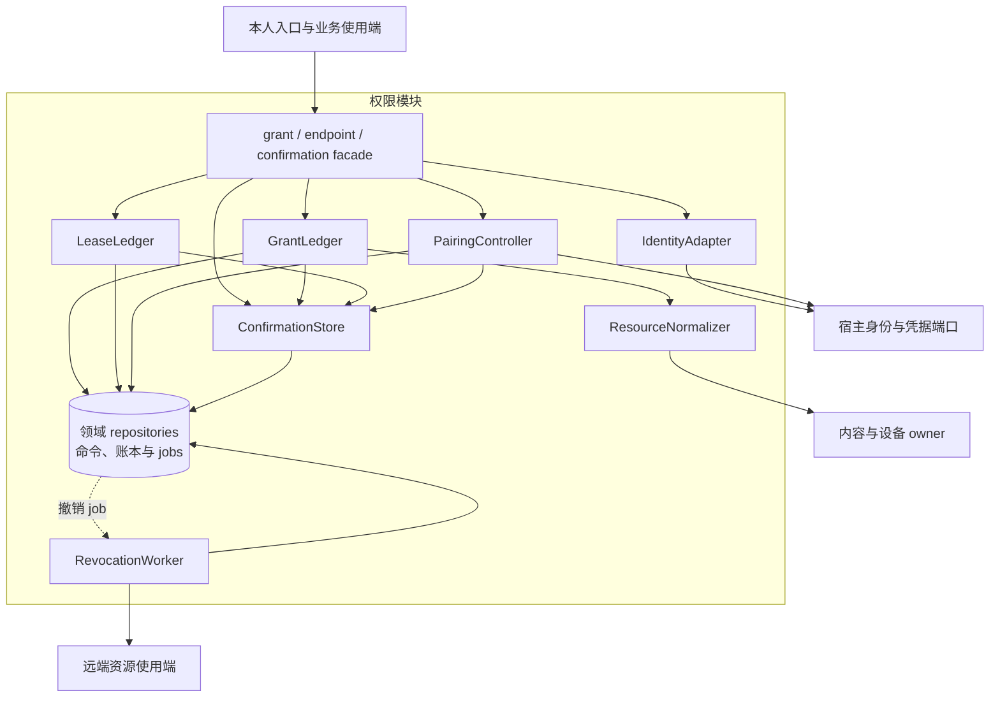
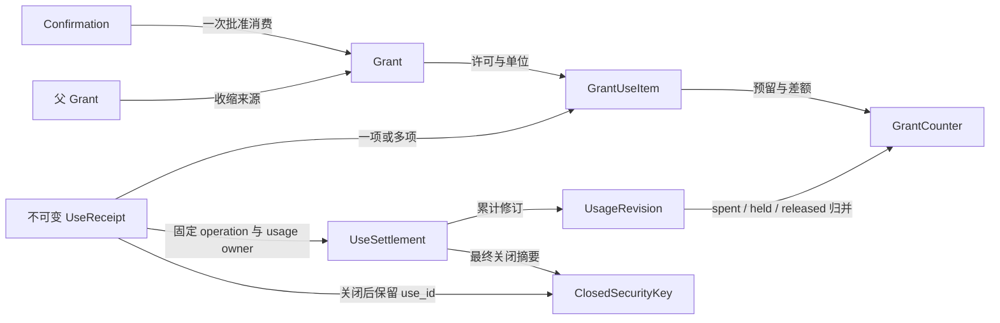
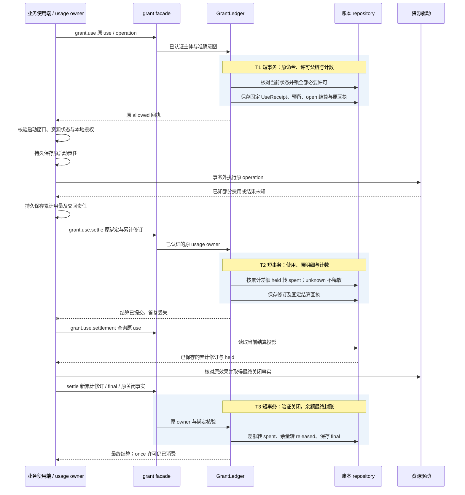
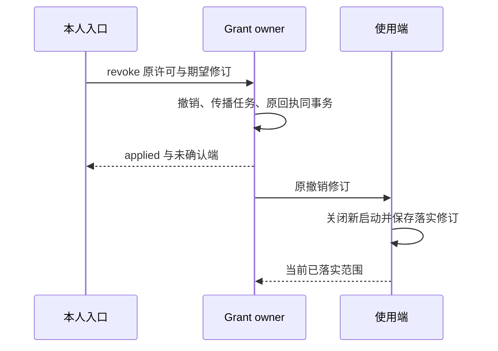

# 授权账本、配对与恢复实现

[模块主线](README.md) · [公共契约](../contracts/README.md) · [协议字段](../contracts/protocol.md)

文件驱动取得一次写入许可后，Grant owner 要能同时解释原决定、已占用额度和后续实际费用。若驱动保存了费用却没收到结算答复，恢复者必须沿原 use 与累计修订继续，不能再消费一次许可，也不能释放仍未知的余额。本页把这条正常使用和结算链落实为账本、唯一键、短事务和后台交回责任。

权限范围、单次消费和撤权窗口的业务含义见[模块主线](README.md)；下文先给内部组件和记录，再展开签发、当前使用、结算、撤销、配对与离线封账。表名与内部组织是默认实现，外部成功和恢复保证属于共同契约。生产多租户、多副本与开发单体复用相同身份、许可及恢复规则；远端配对和离线租约始终使用原许可账本，不以缓存覆盖历史。各部署的运行证据仍需分别取得。

## 1. 模块结构与内部依赖

权限模块是宿主内的领域包，对外 facade 是已登记的 grant、endpoint 和本 owner 的 confirmation 方法处理器。
处理器先把认证上下文交给 IdentityAdapter，再调用 GrantLedger、LeaseLedger 或 PairingController；这些应用入口组织事务，许可父链、范围收缩与余额守恒规则留在账本内。
ConfirmationStore 和各账本 repository 使用宿主的同一事务句柄，ResourceNormalizer、身份与凭据适配器则隔离外部依赖。
RevocationWorker 是领取持久 job 的后台入口；增加工作进程不会新增一套许可权威，也不要求将表中的单元部署为独立服务。

| 内部单元 | 输入与输出 | 独占责任 |
| --- | --- | --- |
| IdentityAdapter | 已验证会话 → Subject | 绑定 tenant、actor、端点及凭据代次；正文不得改写 |
| ConfirmationStore | 原业务命令、受信本人决定 → 同 owner 的确认记录 | 保存规范意图、挑战及一次消费，与业务决定同事务 |
| ResourceNormalizer | 类型化选择器 → 规范资源集合 | 解析受控文件、内容、设备；验证 owner 与版本 |
| GrantLedger | issue/check/use/revoke → 原记录与回执 | 许可父链、用途及额度的最终裁决 |
| LeaseLedger | allocate/settle → 单实例预留与结算 | 离线额度守恒、使用去重与最终封账 |
| PairingController | 会话、用户批准、设备领取 → Endpoint | 有限预认证窗口，一次领取与原结果恢复 |
| RevocationWorker | 撤销修订 → 逐端应用记录 | 传播与核对，不把发送成功当实际封闭 |

同步处理单元在业务入口内装配，RevocationWorker 在独立工作池领取同 owner 的持久责任；两者共享原授权数据库的本地事务范围。开发单体可以合并进程。
IdentityAdapter 与资源类型规范化器是装配端口；许可规则集中在 GrantLedger。
扩展插件不能直接访问许可表；资源规范化器也不能签发 Grant。
许可查询和调用裁决分开：一次 check 的结果不能作为稍后 use 的授权凭证。

图例：实线表示同步依赖；指向 repositories 的实线为同 owner 内的事务读写，虚线为数据库持久 job 的领取。IdentityAdapter 校验宿主身份，PairingController 保存凭据，ResourceNormalizer 解析准确资源，RevocationWorker 向使用端控制与核对；这些外部端口调用均在写事务外执行。
图中 ConfirmationStore 只保存本 owner 的确认；evaluation 和 Orchestrator 在各自本地事务范围装配同一确认能力，由其业务事务消费。
资源解析先取得准确引用，事务内再核对其授权绑定；来自另一 owner 的当前资源状态没有跨库原子保证，实际使用端仍须执行本地授权与状态检查。
默认文件 ResourceNormalizer 只解析受信登记的租户受控根与规范相对段，不接受绝对路径、父目录跳转、路径别名或越界符号链接。规范化结果固定根目录标识、相对路径及需比较的目标版本；执行端在发送入口从根目录句柄逐段打开并复查最终对象，不能先授权字符串路径再由另一次普通 open 跟随可替换的链接。平台缺少可验证句柄相对解析或根目录有不受控旁路写者时，拒绝声称该路径的受管文件读写与可恢复效果保证。来源 ContentRef 向文件驱动披露仍须当前用途许可；目标文件 `act` 许可不包含读取来源或保存读回内容。
资源规范化失败、确认失效、当前身份不匹配都在写事务前或事务内拒绝，不能降级为任意资源范围。
实际启动依然在资源端核验当前资源状态及启动条件，授权账本不记录伪造的外部效果。

grant.list 由现有查询入口读取本 owner 的 GrantRecord 仓储，复用 grant.read 的当前披露策略。共享存储中的有限 collection_queries 保存认证范围、query_id、原参数、按 ID 排序的成员、期限与位置；页读取不固定旧记录修订，也不跨请求持有事务。查询状态记录、扫描上限、权限变化失效、partial 与提示合并统一按[集合恢复契约](../contracts/protocol.md#collection-snapshots)实现；此表仅为临时查询状态，不增加全局目录或业务 owner。

### 1.1 公共框架接入：许可决定与后续收尾

GrantLedger、LeaseLedger、PairingController 复用[原命令接纳模板](../reliable-work.md#admission)，RevocationWorker 及账单交回处理器复用[有限工作循环](../reliable-work.md#claim)。公共层管理去重、领取和条件回写，许可父链、一次消费、额度、撤回及封账条件仍由本 owner 的领域规则裁决。Grant、结算、Confirmation、原命令与必要 jobs 通过 `transaction.Within` 传递同一事务句柄；确认只与其实际消费业务共事务，其他 owner 不通过这一句柄访问授权表。

`grant.issue`／`grant.use` 等短事务入口可以直接提交固定回执，不为已经结束且没有后续责任的调用创建 job。撤回在保存 revoked 和原回执的事务中调用 `jobs.Raise(tx)` 建立逐目标传播责任；可信费用修订在保存账本差额的事务中建立或推进对应交回责任。原费用和使用事实先于外部交回持久，发送和回执核对在事务外，取得回执后另行归并。公共模板不把这些阶段合成一个事务，也不替业务选取继任命令。

常规作业去重键含认证 tenant 和原 owner；下列对象无需关联 Task 才可工作。配对批准前使用宿主固定的预认证会话域，依据 device_code／nonce 等方法所需证明限定原命令和会话；批准事务才绑定认证用户的 tenant，保留此前原会话与命令关联，不能借绑定重新签发已领取的凭据。

| 作业去重键与处理器 | 固定事实与事务参与者 | 完成、等待与恢复判据 |
| --- | --- | --- |
| `revoke / object_kind / object_id / endpoint_id`：RevocationWorker | 原撤销事实、revocation_targets 的最高要求与已落实修订、固定控制命令 | 目标已落实所要求范围后结束；更高撤销事实推进同一作业记录，未知端保留有限核对，发送成功不等于封闭 |
| `billing / use_id / usage_revision`：原 use 账单交回处理器 | use_settlements、累计用量修订、use_billing_outbox 与原 Task 路由 | 原 Orchestrator 的持久 JobAck 才结束本修订交付；同修订摘要固定，r2 不覆盖未交付 r1；use 已 final 也继续 |
| `lease_report / instance_id / lease_id`：原实例串行结算处理器 | 原实例账本、lease_report_outbox、固定未决 usage_revision 和结算命令 | 先取得原报告 applied 并保存输出，再推进后续累计量；未知报告阻止后续自动结算，reconciled 不清除迟到账单责任 |
| `pairing_cleanup / pairing_id`：PairingController 的清理处理器 | 原会话、恢复包保留期限、凭据引用与最小凭据领取记录 | 只清已达到保留条件的秘密；未完成实际清理时保留原责任，不撤销或再次签发既有端点认证绑定 |

这些作业记录映射到原 owner 或原实例的 JobStore，不能把两个本地事务范围的 outbox 合为一笔事务。领域确定新修订是否产生责任以及哪些要求可以合并，JobStore 只原子维护作业版本和 due_at。提交时先按本页顺序锁许可／用量／目标等领域记录，最后锁作业记录，并在同一事务执行 `jobs.Guard`／`jobs.Finish`，完整判定见[公共完成规则](../reliable-work.md#completion)。例如旧撤回工作返回时已有更高要求，已核实的端侧落实事实可单调归并，但旧工作不能结束或延后新要求。

账单交回的安全重试并不相同：在线 use 交回按[在线结算](#5-一次使用与并发裁决)的来源修订去重规则保存有限继任尝试；离线报告按[离线封账](#8-离线分配重连与封账)要求先核清原决定，不可仅凭期限届满或通用失败码换命令。`lease_epoch` 仅约束宿主领取，不能替代授权离线租约、start_before、credential_generation 或资源启动条件。

`grant.check`、read/list、原使用及结算查询保持同步查询；collection_queries 的持久分页状态不形成业务推进 job。`pair.claim` 虽会轮询 pending，仍是保存固定决定的命令；旧 pending 回执不随批准改变，下一轮有限查询使用新命令，领取成功后只恢复原端点及凭据。原回执返回继续复核当前披露权限。共同[观测](../reliable-work.md#observability)按撤权、在线账单交回和离线报告分别计量；控制、封账与原决定查询保留容量，不能因普通 use 洪峰失去继续者。

## 2. 本地身份与远端身份

本地首次启动先确认只有本实例可以初始化宿主，再创建随机本地 tenant 和用户 actor。
系统会话、数据目录访问控制和回环 Web 会话共同构成本地信任前提。
本地 CLI 通过宿主提供的受限会话连接；不允许仅凭知道 socket 路径取得管理员权限。
本地 Web 检查 Origin、会话和 CSRF，不能接受网页代为提交的“本人已确认”。

生产浏览器使用同源 Secure、HttpOnly 会话 Cookie，入口校验 Origin；受信本人确认还须核验当前会话及准确挑战。CLI／设备使用已配对的端点身份，通过 TLS 和不透明 Bearer 凭据认证。
凭据只证明端点是谁，资源权限仍由 Grant 裁决。
签名控制证明的算法、规范化和受众绑定归公共传输契约；本页不另造签名格式。
已认证端点请求中的 instance_id 必须与当前认证绑定的实例一致。

| 操作 | 认证边界 | 可以得到的能力 |
| --- | --- | --- |
| endpoint.pair.begin | 有限预认证入口，按来源与会话限流 | 创建待批准会话及获取设备码 |
| endpoint.pair.claim | 持有私密设备码及原 client_nonce | 查询原会话、领取原受限凭据 |
| endpoint.pair.approve | 本人受信会话与 Confirmation | 批准精确设备和收缩后的范围 |
| 其他业务方法 | 已认证本人或有效端点 | 继续逐项检查资源与用途许可 |

预认证配对会话尚未属于一个获准用户。
批准时由当前用户会话绑定 tenant；设备不能在 begin 中选择目标 tenant。
公开 user_code 只用于人在受信入口匹配会话，不可作为设备登录秘密。
设备重配对产生新的实例标识与认证绑定，旧实例的账务、未知动作和回执查询责任保留在原 endpoint_id／instance_id 下。

## 3. 记录、键和索引

所有业务表包含认证 tenant；预认证 pairing_session 在批准前只使用独立会话域。
ID 为随机标识，唯一索引承担去重；ID 格式和不可猜测性不能代替鉴权。

| 表 | 主键及关键索引 | 记录内容 |
| --- | --- | --- |
| grants | (tenant, owner, grant_id)；(tenant, subject, state, expires_at) | 不变意图、规范范围、父引用、当前修订和撤销状态 |
| grant_parents | (tenant, child_grant_id)；parent_grant_id | 原父许可及签发时版本；沿父链检查当前撤销 |
| confirmations | (tenant, owner, confirmation_id) UNIQUE；consumer_command_id | 原准确命令、规范摘要、挑战、本人决定及一次消费位置 |
| grant_uses | (tenant, owner, use_id) UNIQUE | 意图摘要、精确许可修订、原决定、窗口与占用 |
| grant_use_items | (tenant, use_id, grant_id, unit) | 每条许可实际预留的单位与费用 |
| use_settlements | (tenant, owner, use_id) UNIQUE | 原 operation、usage_owner、累计支出、保留量、释放量及关闭证明 |
| use_usage_revisions | (tenant, use_id, usage_revision) UNIQUE | 原用量更新与累计摘要，防止重放重复转支出 |
| use_billing_outbox | (tenant, owner, use_id, usage_revision) UNIQUE | 上调账单对应的原 Task、首次及当前 task.billing_reconcile 命令尝试、摘要与交付状态；原 use 终态后仍保留待交回责任 |
| grant_counters | (tenant, grant_id, unit) | 已分配、已消费、未结预留；十进制定点表示 |
| offline_leases | (tenant, owner, lease_id)；endpoint/instance/state | 固定授权、范围、额度、截止和封账状态 |
| lease_uses | (tenant, lease_id, use_id) UNIQUE | Grant owner 已核验的原使用绑定、累计费用及关闭事实 |
| 原实例的本地租约账本 | (tenant, instance_id, lease_id, use_id) UNIQUE | 全部原使用及来源账单修订；原计量负责方与账本在同一受信本地事务范围内共同保存费用变更及待报责任 |
| 原实例的 lease_report_outbox | (tenant, instance_id, lease_id) 单一未决报告 | 已确认 owner 修订、待报用量、固定 usage_revision、完整结算命令和原结果；后续账单合并但不越过未决报告 |
| revocation_targets | (tenant, object_id, endpoint_id) | 要求修订、端侧已落实修订、最后核对时间 |
| JobStore 作业记录映射 | 所属本地事务范围及上述稳定业务键唯一；job_id、due_at、lease_epoch、work_revision | 由撤销目标、outbox 或清理记录关联；业务事实与 Raise 同事务，不另建许可或费用权威 |
| pairing_sessions | pairing_id；device_code_hash UNIQUE；user_code_hash | 会话期限、nonce、范围、状态和一次领取索引 |
| endpoints | (tenant, endpoint_id)；credential_fingerprint UNIQUE | 当前 instance、凭据代次、状态与批准范围 |
| closed_security_keys | (scope_hash, object_kind, original_id) UNIQUE | 最小去重与终态索引，阻止旧命令标识被当成新请求 |

范围数组在宿主中使用规范排序和固定编码生成意图摘要。
金额以单位和非负十进制值保存，单位不同不直接相加或比较。
对 once 的唯一占用同时使用计数锁与条件更新，不能依赖应用内读后写。
SQLite 在宿主写队列内执行这些短事务；PostgreSQL 按固定 grant_id 顺序锁行，避免多许可消费死锁。

去重与终态索引只保存防重放所需的域化摘要、原 ID、关闭类别和决定摘要。
原正文、设备码、凭据和敏感错误上下文按自身保留期清理。
查询命中去重与终态索引返回 gone 及允许的恢复动作，不能重新执行已遗忘正文的原命令。
索引丢失或旧备份无法证明完整时，相关权威以诊断模式恢复，不重新开放消费。

### 核心对象关系与流转

GrantLedger 统一管理许可、原使用和结算查询；UseReceipt 是不可变使用决定，UseSettlement 是后续累计核对，不能合成一条随结算改写的批准记录。任务结束和 Grant 撤销不删除已经发生的使用或待交回账务。同 owner 的合法阶段可共同提交相关记录，跨 owner 的原使用仍逐项核对。

下图聚焦 Grant 签发及在线使用，不表示所有 Confirmation 都归 Grant owner。任务结果接受、发布批准等确认继续由实际业务 owner 保存并在原事务一次消费；普通 Message、Session 历史或预览引用不能代替受信决定。连线表示持久引用，数量关系通过中间明细表达；一次使用可以同时依赖多条必要许可。

| 对象链 | 创建与持久化 | 传递、消费与归并 | 清理后必须保留 |
| --- | --- | --- | --- |
| Confirmation → Grant | 业务 owner 验证固定原命令后保存待确认记录；本人决定和业务消费分两次事务 | UI 仅转交；grant.issue 同事务消费批准并创建许可，业务失败不留下已消费确认 | 原消费者、意图摘要和消费位置，防止换命令使用 |
| Grant → UseReceipt / UseItem | 使用端先保存 operation；GrantLedger 再一次提交全部必要许可占用、明细和原决定 | 使用端收到固定回执才取得有限启动依据；原回执不能由后续结算改写 | 原 use、许可绑定、once 占用和决定摘要 |
| UseSettlement → UsageRevision → Counter | allowed 时建立 open 结算；实际计量 owner 持久保存每次累计用量再交回 | GrantLedger 按累计差额转 spent；任务关联的可信费用上调同事务保存对账 outbox，直到原 Task 的持久 JobAck | 最终累计摘要、关闭事实、交回责任及已消费的 once 许可 |
| Endpoint → OfflineLease → LeaseUse | 配对领取固定实例；分配事务从许可余额转入该实例的预留 | 端侧在自己的连续账本消费，重连向原 LeaseLedger 归并；最终封账后释放数值余量 | 实例、分配和使用去重摘要，不能从旧快照恢复可花余额 |
| 撤销修订 → RevocationTarget | 撤销与逐端 job 同事务保存 | Worker 重复交付原修订；各端以实际封闭回执推进已落实修订 | 最高撤销代次及去重与终态索引；正文清理不降低撤销 |

Counter 和逐端传播进度是可核对投影，原使用、累计用量及撤销决定是其重建依据。
投影重建必须在原本地事务范围停新消费并核对全量未结责任，不能以重新计算得到更大余额为由自动开放。

## 4. 签发与当前检查

`grant.issue` 输入包含固定 grant_id、GrantPolicy、intent_hash 和确认引用。
owner 从认证上下文取得，不接受 payload 自选 owner。
Confirmation 由实际业务 owner 保存：Grant owner 管理许可确认，evaluation owner 管理发布确认，Orchestrator 管理成果验收确认。
交互层只认证、展示和转交，不保存能够代替业务 owner 的消费权威，也不部署远端确认消费服务。

若新 Grant 会扩大用户可见的 Task 来源或引入新的披露授权权威，受信签发流程先从准确 Task／共享引用或完整范围查询确定全部受影响来源，并在身份权威的[用户来源目录](../storage-and-middleware.md#source-directory)持久预登记来源和本 Grant owner 的披露权威身份。登记失败、目录版本不可核验或范围不能穷尽时，不提交会扩大披露的 Grant；跨库预登记可能留下空来源，允许保留。与 Grant owner 不同的共享 owner 也遵守相同发布屏障；目录 `GET` 不执行登记。

签发在同一事务中完成以下步骤：

1. 查原 command；同键同参数返回原回执，同键异参数拒绝。
2. 锁定确认、待确认请求及需要的父许可行。
3. 检查确认未过期、请求仍相同、意图与规范资源一致。
4. 子许可逐维收缩主体、资源、动作、用途、接收方、位置、时间和额度。
5. 登记一次确认消费，写 Grant 和初始额度，再保存 applied 回执。

确认与其消费业务必须位于同一 owner 的本地事务范围。部署位置不同的 UI 只发送命令，不能把自己的确认数据库当作消费依据。
事务回滚同时回滚确认消费和许可；提交后失答复沿原业务命令查询，不能用另一个命令复用确认。

`grant.check` 仅读当前状态并说明缺项。
父链深度达到装配上限、父引用缺失或范围不可判定都拒绝。
多个独立来源许可分别核验，不能把两条不覆盖所需用途的许可拼成新披露许可。

### 最后工具意图与使用依据

本节将工具参数变换后的许可检查落在现有 ResourceNormalizer、GrantLedger 和资源入口，完整准入链归[Execution](../execution/implementation.md#final-tool-admission)。没有独立工具授权服务，也不新增 UseRequest 字段。调用端在原 Operation 记录最后参数、准确能力／绑定和安装、规范资源、来源用途、接收方与位置；GrantLedger 用受信原 Operation 核对原 `use_id + intent_hash`，不让 hook 或请求正文自报其已经获准。

| 时点 | 处理端及账本检查 | 原记录及后续 |
| --- | --- | --- |
| 候选准备后、准入前 | 对最后 Schema 合法参数执行规范化，检查准确来源、范围、用途和所需许可；check 只是当前意见 | 原 Orchestrator 保存最后意图及准入依据。变换不能沿用不同意图的确认；已有合法 Grant 覆盖最后范围时仍允许 |
| use 决定 | 从受信原 Operation 复核同一语义与固定成本声明，锁当前许可／父链／端点及额度，保存原 use 和回执 | 同 owner 必需许可一次全成或全拒；跨 owner 部分占用沿原 use 恢复，不因 hook allow 跳过缺项 |
| 实际入口 | 比对原意图与实际资源／请求表示，检查原 use 的 allowed 依据、窗口、当前已知撤权／父链／端点、当前控制及原预算范围 | 在原 Operation／Attempt 留获准的最小检查依据与拒绝原因；检查失败停止新发送，原消费与可能效果不回滚 |
| 保存及交付结果 | 取得结果后按实际保存位置、保留期和接收方重新核验所需 store／disclose；原流片段和派生输出同样受用途限制 | 不把工具 act 当成全部媒体保存许可；返回允许的实际范围及缺口，原效果和费用继续核对 |

这些检查依据可合并在原 Operation／Attempt 或 grant_use 的内部记录中，保留最后输入关联、normalizer／映射版本、实际资源身份、所检查许可修订、检查时间／窗口和拒绝依据；不要求单独表、每个检查一个 job 或额外公开证明对象。禁止保存的正文、秘密和可逆敏感参数不进入诊断日志，必要的最小依据也保存不了时，该用途不能执行。

已经 allowed 的原 `once` use 在合法窗口内首次启动，不再次占用一次许可，也不因“once 已消费”被误判为另取许可；核验的是该原 use 当前还能否启动，而非为新 use 再做余额分配。`grant.use.get` 恢复不可变原回执，不能单独证明当前许可未撤销；使用端还须遵守原[撤权和窗口](README.md#online-revocation)，本地已知新修订优先，跨 owner 不声称最后网络字节与远端撤权共事务。未知原 use 决定时保持禁止发送并查询原 use，不能换身份获取另一份许可。

准入后的请求编码不能增补未核验资源、来源、接收方、用途或成本模式。每次实际 URL／DNS／重定向目标和凭据作用域须与固定绑定及当前使用范围一致；目标响应中的下一游标、下载 URL 或 wrapper 错误上报都不能自行扩权。文件入口检查同一受控根和实际句柄对象。当前合法凭据刷新可生成新的协议签名，但不改变原业务意图，也不延长 use、控制或操作期限。

若参数或真实出口变化在发送前被可靠阻断，保存确定未启动／未生效依据，原 once 消费依既有零用量结算规则收尾；已进入发送边界或无法排除迟到时，保留 held 与原核对责任，不以“最后检查拒绝”改写已可能发生的部分。撤销后的效果查询、必要关闭与费用结算使用原最小管理依据，不借收尾许可发新动作、读新内容或重新披露已撤权正文。

### 固定命令后请求受信确认

调用端先保存完整原业务 Command，生成 confirmation_id，并把 confirmation_ref 固定为该业务 owner、此 ID 和批准修订 2。
confirmation.request 在该 owner 校验 consumer_method 对应的精确输入 Schema、目标及当前业务前提，再保存 pending 修订 1 和最多五分钟的随机挑战。
UI 调 confirmation.read 展示 owner 返回的规范意图；自绘页面、模型文本或普通输入事件不能代替受信本人会话。
confirmation.decide 只接受受信会话核验的主体，按 consumer_method 校验其精确管理权限：grant.issue、grant.lease.allocate、endpoint.pair.approve、task.accept_result 对应本人；evaluation.approve 对应具备该目标发布权的用户或维护者。维护者的发布权不能用于签发某用户 Grant。决定时核对原挑战、摘要、command_id、期望修订及当前主体权限后保存 approved/denied 修订 2；原业务事务消费前再次核验权限，撤权后的旧批准不得继续使用。
决定本身不执行业务。调用端随后提交此前固定的原 Command，业务事务核对本人决定未过期并消费为修订 3，保存 consumed_by 和业务决定。
confirmation.read 可查询该原消费；原业务回执重放不再消费第二次，拒绝或未消费的确认不能被换命令复用。

规范意图为业务 owner 与完整 consumer_command 的 JCS SHA-256；grant.issue 的 payload.intent_hash 是该摘要的派生字段，计算时只移除这一个字段，避免自引用。
confirmation_ref 的 owner、预定 ID 和批准修订也参与摘要，确认后不能改引用。原请求内容、命令截止或期望修订改变都必须创建新的原命令及确认。
受支持消费者固定为 grant.issue、grant.lease.allocate、endpoint.pair.approve、evaluation.approve、task.accept_result；每个分支分别验证准确 Schema，不接受任意 JSON 载荷授权。

## 5. 一次使用与并发裁决

`grant.use` 绑定 use_id、已持久的业务 operation_id 和实际计量负责方 usage_owner_id。
usage_owner 由处理端的认证身份与代报权限核验；正文指定另一个 owner 不能获得代报费用的权限。
任务关联的计费 use 还须从受信原 operation／usage_owner 固定并保存原 orchestrator_id、task_id；不能仅凭 UseRequest 中的 subject 或调用方填入的任务引用决定后续账单交回目标。无法核实这项关联时，不接纳需纳入任务预算的计费 use。
入口在事务开始前验证请求结构；精确范围、额度和撤销仍在锁内重查。
同一个 use_id 固定意图、许可集合和上限；重投不能增加资源或延长 start_before。
GrantLedger 从认证 usage_owner 对应的原 operation 与受信固定 Capability／模型适配器声明核对 `cost_bound` 和 `max_cost`，不能信 UseRequest 自报。`strict` 需要可兑现最大费用；`estimate` 还要求原 Orchestrator 与费用 Grant owner 在同一受信本地事务范围内，能直接读取原 Task 保存的用户接受非硬上限事实，且全部必需 Grant 对该费用单位都没有硬 limit。公开 policy_ref、调用方布尔声明或跨域缓存都不是该事实证明；缺少同一本地事务范围、原动作、声明或同意记录时拒绝估算并保持 strict-only。离线租约及跨 Orchestrator 固定额度只接纳 `strict`；估算费用也不能放宽次数、字节等其他维度的可信上界。

| 顺序 | 事务动作 | 失败结果 |
| --- | --- | --- |
| 1 | 查原 use 与去重与终态索引 | 原记录返回；已终结标识返回 gone；摘要冲突拒绝 |
| 2 | 锁当前许可、全部父链、端点与计数 | 任意缺失或撤销，保存 denied 且零占用 |
| 3 | 核验每项用途与全部上限 | 缺一项全部拒绝，不做局部本地消费 |
| 4 | 写原使用、预留明细和固定窗口 | allowed 仅表示授权使用已占用 |
| 5 | 保存命令回执并提交 | 提交后失答复只查原 use |

同 owner 的多项许可必须一次事务全成或全拒。
跨 owner 的消费没有共同原子性；调用端分别保存已取得的依据，全部有效才行动。
部分许可已经占用而另一方不可达时，不行动、不撤销历史消费，也不换 use_id 重试。
处理端在自己的原操作记录中持久禁止该操作再次发送并证明未跨发送边界后，沿各原 use_id 对已知获准许可报告累计零用量和最终关闭；结算答复丢失仍查原结算。未知的远端 use 决定继续按原 use_id 查询，查明 allowed 后也用同一关闭事实封账。这样只释放未支出的数值预留，不恢复 once 的使用许可。若已有发送准备或跨边界与否不明，则保留相应 held 和原查询责任，不凭“这次没有收到结果”提交零用量最终关闭。确知从未启动且原窗口过期时，向用户报告需要新授权；旧消费事实仍保留。

资源端只在自己的启动记录尚未存在、窗口仍有效、本地资源状态和授权检查均允许时首次启动。
启动记录与驱动不可原子时保留 unknown 并查原效果，不能依据 use 已获准推定动作发生。
模型物理重试另建 model_call_id 与 use_id，费用另计。

### 在线预留、实际支出和最终释放

UseReceipt 是不可变的原授权结果；结算单独保存为 UseSettlementRecord，不修改原回执、许可修订或 start_before。
grant.use 为 allowed 时同事务建立 revision=1、usage_revision=0 的 open 结算记录，原预留全部计入 held，并固定经核验的 cost_bound。
使用端通过 grant.use.settle 报告原 operation、usage_owner、许可引用、递增 usage_revision 和累计单位／费用；Grant owner 验证认证发送方及原绑定。
grant.use.settlement 查询这一独立投影，用于发送成功但答复丢失后的恢复；它不能延长授权窗口。

每次更新先按稳定的 use_id 查询原累计值，再以新累计值减旧累计值的差额转入 spent。`strict` 的实际费用不得超过可信预留；若提供方违反该费用上界约定，仍记录已发生费用与保证失效，停止同范围新计费并告警，不能丢弃真实支出。`estimate` 的累计实际费用可以超过初始预留，超额按 `spent_cost - reserved_cost` 的正差额报告；原 UseReceipt 与结算的 reserved_cost 均不改写，停止同范围新计费，避免后续估算继续扩大暴露。
跨端重放同一个原结算命令返回原回执，不重复转账；新的用量修订不得倒退累计值或更换单位。
对有可信上界的每一精确单位，在符合费用上界约定时满足 reserved = spent + held + released；估算费用按原预留与实际支出分别记账，未结时 `held=max(0,reserved-spent)`，超额为 `max(0,spent-reserved)`，不能假造负 held 或把差额计为另一 use 的支出。final 时未支出 held 才转 released。不能把费用单位和调用次数混算。
多项必要许可在各自 grant_use_items 上执行相同受限使用的计量核对，不把一份必要许可的余量视为另一条许可的额外使用许可。

open 包括效果或最终费用未知的使用；已知部分费用可转 spent，strict 的剩余上界全部留在 held，released 必须为零。estimate 的未支出原预留也暂留 held，但它不是未知最终费用的硬上界。
final 必须有原 usage_owner 的关闭证明，证明原有限动作及正常计费窗口已封闭，不会再主动产生新的使用；随后把全部未支出 held 转 released。它不保证提供方永不更正这次调用的账单。
授权撤销、窗口到期、进程超时或一次查询失败都不能单独提供最终关闭证明。

once 的许可消费独立于金额：即使证明从未启动、累计实际费用为零，consumed_once 仍为 true。
数值预留可以结清，原单次执行许可不返还，不允许第二个 use 使用它；需要重做时由本人另授新许可。
最终结算不能重新开放该 use 的使用许可。若已 final 后出现经原计量 owner 核验的供应商账单更正，允许同一 use 的 final→final 单调费用修订；原 operation、once 消费、启动窗口和使用结束与费用封账依据不变，已 released 的数值不倒流。新增真实支出中超出仍可覆盖预留的差额记为超额债务，停止同范围新计费并保留异常审计；不能抹掉费用或发放新额度。未经核验或相互矛盾的迟到报告进入诊断缺口，不擅自改账。静态结构校验只能核对原 use_id／operation_id 及修订的单调性，账单真伪由运行中的原 usage owner 核验。

这里的 final→final 更正仅指迟到追加收费或上调；退款、贷记等负向账务事件不通过降低累计用量处理。出现这类账单时标记待人工对账，后续若需自动化须另定可审计的负向事件及父子账本传播规则。

结算事务锁 use、原 grant_use_items 和计数，核对 expected_revision、原计量 owner 与 usage_revision，保存明细、差额转账、关闭事实和原回执。任务关联 use 的每次可信费用上调还在同一事务按 `(use_id, usage_revision)` 唯一保存交回 outbox 及首次有限期限的 command_id，目标为原 task_id，`task.billing_reconcile` 携带 `source_kind=grant_use`、原 use_id、原账 usage_revision 和 usage_digest；通知金额不作 Orchestrator 账本的权威输入。交回 worker 先查原 command_id，仍可接纳时原样重投；原尝试到期仍无 JobAck 时，保留旧命令标识及审计记录，并为相同 use／usage_revision／usage_digest 保存新 command_id 的后继尝试。原 Orchestrator 以来源修订业务键归并到同一 JobAck，即使旧尝试已应用也不双扣；直到取得其已持久保存结算 job 的 JobAck；随后只结束该 outbox 交付，不删除原 use 的计费标识与关联。重启扫描所有未获 JobAck 的 outbox，已 final、原任务终态或旧 settle job done 均不跳过。Orchestrator 主动读原 Grant 账并按固定计费来源去重；同一物理收费若也出现在 Executor／Brain 投影，只能由任务已绑定的一个来源计入预算。
每个上调修订保留独立 outbox 行；每次命令尝试固定 ID、载荷和期限，旧尝试保留在原命令记录中，r2 不覆盖未获 JobAck 的 r1。原 Orchestrator 收到 r1 时可主动读到 r2 并先归并较新累计额；以后 r1／r2 迟到或重投按已持久的最高来源修订确认，只有同一修订不同摘要才冲突。原 use 的计费标识、累计费用、已交回修订及供应商更正关联保留至可验证的账单更正期限结束；若没有可验证期限，最小计费账本和查询入口长期保留。完整授权正文可以依清理策略回收，但 `final` 或长期去重与终态索引不能抹掉迟到更正的交回路由。
并发撤权不删除原结算责任；计量和封账使用最小管理依据继续，不能因目标 Grant 已撤销而丢掉已发生费用。

### 一次在线使用、结算与丢答复恢复

本图展开 GrantLedger 的内部事务与资源端交接。U 是已经保存原 operation 的计量负责方；驱动调用始终在许可事务之外。

查询发现该修订尚未提交时，使用端重投原结算命令；发现已提交但本地未确认时完成原交回 job。
查询不可达保持交回责任，不能另造 use 或把 held 当作可再分配余额；最终关闭需要另一个累计修订和自己的原命令。

## 6. 撤权传播与控制竞争

撤权事务锁许可当前修订，保存 revoked、新修订、原回执及传播 jobs。
提交后新 use 不允许；正在启动的处理端仍受线上窗口及本地已知撤权约束。
使用依据在撤权之前取得不代表可以无期限后启动。

撤销先于 use 提交则 use 拒绝；use 先提交则历史回执不改变。
处理端已获知撤销时，未过期回执也不能启动。
尚未获知时最多存在原 start_before 窗口，不承诺远程即时停止。
传播工作按 object_id 和端点合并到最高要求修订；乱序通知不能降低已落实修订。

端点撤销同事务增加 credential_generation。
现有连接每次业务请求都核对当前代次；连接建立成功不是持续豁免。
控制与收尾使用独立最小管理依据，不继承已撤销的目标行动授权。
必要管理依据只允许查询原效果、封闭、清理及结算，不允许生成新目标动作。

## 7. 配对与秘密的生命周期

begin 保存短期 session 和 client_nonce，生成高熵私密设备码与便于核对的用户码。
设备码仅通过 TLS 返回给发起端；数据库保存摘要，原响应恢复包短期加密保存。
approve 在当前用户会话核对设备描述、用户码、范围和挑战后绑定 tenant。
approve 不返回设备凭据，拒绝决定也要持久以防迟到领取。

claim 用设备码查原会话，再比较 nonce、期限和状态。
pending 返回当前 session 和退避；不得附 credential。
同一 pending 命令的回执不会随批准变化；下一轮有限轮询使用新 command_id，原 pairing_id、device_code 和 nonce 保持不变。
一旦领取成功，后续命令也只能恢复同一领取结果，不能重新签发凭据。
approved 时创建唯一 endpoint/instance，生成受限凭据并保存加密领取结果。
同一会话后续合法领取返回同一 endpoint 和同一凭据结果，不新生成第二份凭据或实例授权。

会话已 claimed 后批准或拒绝不得改写既有领取事实；需要本人撤销 Endpoint。
凭据恢复包过期后清理秘密，仅留下最小凭据领取记录。
后续 claim 返回 gone，客户端重新配对，不能从最小领取记录重建凭据。

| 秘密或材料 | 保存形式 | 清理边界 |
| --- | --- | --- |
| user_code / device_code | 比较摘要；短期原响应密文 | 会话及领取恢复窗口结束 |
| 端点 Bearer | 安全凭据库；业务表仅指纹与引用 | 撤销或到期后按安全存储策略销毁 |
| Confirmation 挑战 | 业务 owner 记录；UI 获准展示 | 期限后保留原命令／意图及必要消费索引 |
| 许可正文 | 受控账本 | 原责任结清及保留期后可删正文 |
| 去重与终态索引 | 域化标识摘要与关闭事实 | 长期保留，不能自动重新开放旧命令或使用标识 |

## 8. 离线分配、重连与封账

allocate 锁当前持续许可、端点实例及可分配余额。
租约范围必须是许可子集，期限不能超过许可和显式离线上限；每项可计费使用须有可信最大费用，estimate 模式或无上界费用不能进入离线租约。
单次许可若分配离线使用许可，同时关闭对应在线使用许可。
租约固定一个实例账本；复制文件或同账号登录另一端不获得第二份消费权。

本地消费以单调时间判断截止，以不可回退的使用记录扣除额度。
同一本地事务检查租约仍 open、当前控制与期限，保存原 use 并扣除额度；首次使用也保持 open，使用明细是“已使用”的依据。
首次消费与关闭竞争时，关闭先提交则拒绝新 use；消费先提交则保留原使用及其未结费用，再封闭后续使用。使用提交后崩溃沿原 use 恢复，不能凭 open 推断尚未消费。
默认进程重启后不继续远端离线租约，先联网核验当前实例与撤销。
旧快照不能恢复“剩余额度”；无法证明消费连续性时关闭新使用并报告账务缺口。

重连严格先取得当前端点状态及撤销，再上送原用量，最后开放新工作。原实例的本地租约账本是唯一报告者，负责汇总全部原使用及累计量；Grant owner 内部的 LeaseLedger 负责核验、入账和返回租约记录，两者职责不同。各 Brain／Executor 计量负责方将原账单与本地待报责任共同保存，由原实例串行交回 `grant.lease.settle`，不各自向 owner 猜测全租约累计量。参考装配要求计量负责方与本地账本处于同一端点宿主的受信本地事务范围；若计量事实在其他域，须先落实并验收可靠交回契约，当前缺该依赖的能力不能进入离线租约。

同一 lease 最多一个结果未确定的 settle。报告前固定本批明细、累计值、usage_revision、command_id 和完整命令；expected_revision 来自已持久保存的 allocate 或前一次 applied 输出。后续账单可先更新本地待报账本，待原报告确认后再形成下一批。撤权、到期与端点授权失效时，原权威先禁止新使用，不在后台悄悄推进 OfflineLeaseRecord.revision；租约可见状态与修订由这条串行结算链更新，open 不能单独作为当前使用许可。

`grant.lease.settle` 按 `usage_revision` 接收租约累计事实；每项 `LeaseUsageItem` 固定 use、意图、原 operation、计量负责方 `usage_owner_id` 及 `billing_ref` 的 owner/id。`billing_source_kind` 固定为 brain_decision 或 execution_operation，billing_ref 的 owner_id=usage_owner_id、id=operation_id，分别通过 `brain.get` 或 `execution.get` 读取原 Decision／Operation 的费用事实；这里的 operation_id 是原计费操作标识，Brain 路径填写 decision_id。租约 owner 核认证来源、原使用绑定、准确修订及累计量，不能仅因引用结构合法就相信金额。累计用量不得超过分配，费用不得倒退或切换单位；可信原账单若超过原分配仍全额入账，同时封闭受影响的新计费并保留超额责任，不能丢弃已发生费用。离线准入仍只接受 strict 上界。

每批 uses 最多 100 条新增或修订明细，原实例固定“上一已确认报告账本＋本批更新”的报告截面并据此计算累计值；尚未进入本批的待报更新不能混入累计值。同 use 的多个待报上调先合并或排入后续批。owner 按原 use 归并本批，再核对全账本累计值；本批不必重传全部历史使用。相同 use 的意图、原 operation 或计量来源变化均拒绝。final 只能在全部已发生使用均已纳入报告且关闭后提交，并附资源端封闭证明；未上报使用不能被解释为零。首次 final 保存 `closure_ref`、`final_settlement_ref` 与已释放余额。
到期仅关闭新使用，不足以最终返还余额。
租约按 open → closed → reconciled 收敛；本地关闭可先于 owner 获知，重连沿原账本报告。非最终用量上报不把 closed 重新打开；最终封账同时记录使用结束及费用封账依据和 reconciled，不要求额外一次网络往返。owner 尚未收到的使用保持未知，不用空明细推导可释放余额。

结算事务写原 usage_revision、明细、累计值、结算回执与可释放额度。
答复丢失沿原命令恢复；已经最终封账的租约不能再次打开或增加新 use。
未知外部费用由原调用核对者继续处理，父许可不能靠管理员改状态提前收回。

封账之后，供应商可能更正原调用账单。原计量负责方保存更高修订账单时，同事务更新本地待报责任；原实例在前一报告确认后汇总新累计量，沿串行结算链交回。Grant owner 核验原账后接收，状态保持 reconciled。更正必须保留全部原 use_id、用量、closed 标志及初次封账依据，仅允许已有 use 的费用上调，并绑定同一 billing_ref 对象的更高修订。owner 只追加累计差额，已释放金额不倒回，也不再次释放；余额不足形成可查的费用责任，并停止该范围的新计费。退款／贷记另行对账，不伪装成累计下降。

交回答复丢失时先查询或重投原命令。只有原接纳期限已过、并从原 owner 在当前获准范围内查明 not_found，才能确定原报告未应用，使用新 command_id 发送同一 usage_revision 与完整内容；不得仅凭到期更换 command_id。查询得到 applied 则先保存原输出再推进；gone、失联或结果未知时保留未决报告，停止后续自动结算并显示恢复缺口。这里不承诺未知结果下的跨命令 no-op；原实例失联或原回执不可恢复的代价是补账等待，不能把账本交给第二实例重新开始。已应用的旧命令始终返回原回执，租约当前记录则可包含后来更正。账单来源及交回责任须保留到原计费提供方的更正窗口关闭，不能随首次封账清理。若使用绑定 Task，原 Brain／Executor 另按其原物理计费来源保存 `task.billing_reconcile` 交回责任；租约结算只核对 Grant 范围额度，不制造在线 UseReceipt，也不能让 Task 把租约和原调用重复计费。缺少原账单核验或持久交回依赖时，不开放相应离线计费能力。

## 9. 故障实验与观察点

每项实验同时查询许可账本、原命令与实际资源；不能手工写结果表制造成功。

| 实验 | 注入点 | 必须观察到 |
| --- | --- | --- |
| S-I01 | issue 提交后答复丢失 | 一个 Grant、一次确认消费，重试返回同记录 |
| S-I02 | 两个不同意图竞争同一 Confirmation | 仅原意图可提交；失败方无许可 |
| S-I03 | 两个 use 竞争一次额度 | 一个 allowed，另一个 denied 且零占用 |
| S-I04 | use 与 revoke 并发 | 按提交顺序裁决；旧回执不变化，新启动遵守已知撤权 |
| S-I05 | 一方消费后跨 owner 另一方断线 | 无实际动作，已消费事实仍可查 |
| S-I06 | begin/claim 提交后各丢一次答复 | 同一会话、同一端点、同一领取结果 |
| S-I07 | user_code 猜测与高频轮询 | 有限尝试和退避，不能取得设备凭据 |
| S-I08 | 端点撤销后复用旧长连接 | 下一业务请求拒绝，原效果查询由获准管理入口继续 |
| S-I09 | 租约消费后恢复旧快照 | 不再离线行动，不返还未知费用 |
| S-I10 | final 缺关闭证明或仍有可收费 use | 拒绝最终封账并保留预留 |
| S-I11 | 凭据恢复包清理后重放原领取 | gone；不重新生成 endpoint 或 token |
| S-I12 | 许可正文清理后重投原 use | 去重与终态索引阻止重执行，不能按“查无记录”准入 |
| S-I13 | 计量提交后失回执、累计值重放 | 差额只转一次，原 UseReceipt 不变 |
| S-I14 | 未核清使用申请释放余量 | open 保留全部未支出预留，released=0 |
| S-I15 | once 最终费用为零 | 金额封账但使用许可不返还 |
| S-I16 | 另一 owner 或另一 command 消费批准 | 拒绝；原确认仍只绑定原业务事务 |
| S-I17 | 确认决定后业务提交崩溃 | 同库消费与业务同时成败，失回执查原命令 |
| S-I18 | 租约首次消费与关闭竞争，消费提交后再崩溃 | 关闭先提交拒绝新 use；消费先提交保留一次扣额及未结责任，open 不代表尚未使用，closed 不提前释放费用 |
| S-I19 | 一方已占用 once，另一 Grant owner 拒绝；再分别注入处理端未启动与发送边界不明 | 确证未启动时原使用以零用量最终结算、释放数值预留但 once 不返还；边界不明时保留 held 与查询责任 |
| S-I20 | 在线 estimate 初始预留 10、实际计费 12；另试图以该能力申请离线或跨 Orchestrator 固定额度 | 原 use 记录 spent=12 与超额 2，停止同范围新计费；固定分配拒绝，不把估算额称为硬上限 |
| S-I21 | 原 use 已 final 并释放余量后，供应商对原调用更正费用且原 usage owner 核验通过 | final→final 只增费用修订，已释放数值、once 和启动窗口不回滚，新增差额进超额债务并停新计费 |
| S-I22 | 文件路径在授权和实际打开之间替换为越界符号链接，或另一个租户创建同名相对路径 | 句柄相对解析与租户根复核拒绝越界；已签发 Grant 或规范字符串不能放行目标动作 |
| S-I23 | final 的 Grant use 连续 r1／r2 费用上调分别与交回 outbox 同时提交，随后断网、停机超过原命令期限再以新 ID 交回，令 r2 通知先到；原 Task 已终态且旧 settle job done | r1／r2 原 outbox 均先恢复原尝试，到期后以后继命令交回并按来源修订合并同一 JobAck；Orchestrator JobAck 后各源交付才结束，任务按最新原 use 账只记累计差额一次，迟到 r1 不回退、不重开 use 或 Task，不和 Executor 投影双扣 |
| S-I24 | 租约最终封账后上调原账单，交回丢答复并重启，再重放原结算命令 | 沿原来源修订追记差额，reconciled 不重开，旧回执不改、余额不再次释放；超额照实入账并停新计费，新 use／用量被拒 |
| S-I25 | 撤权 worker 领取后，原作业记录提交更高要求，再返回旧落实答复或退避；另注入领取过期接替 | 有效旧领取只能归并原落实事实，保留新责任及更早 due_at；过期领取不写受保护状态，已核准使用和实际外部效果不被改成不存在 |
| S-I26 | 尚未绑定 tenant 的配对会话与命令已保存，批准后重放原 begin／claim，再让清理 worker 接替 | 原会话、唯一领取和恢复包保持原关联；不能因身份域绑定重新生成会话或凭据，清理后只返回获准关闭状态 |

各本地事务范围的作业存储适配器须运行[公共故障套件](../reliable-work.md#validation)，并以 S-I23–S-I26 核对在线／离线交回、撤权新责任和预认证的不同领域条件。记录 check/use/revoke 的提交延迟、冲突率、传播积压和未封账预留。
拒绝与控制使用独立容量，普通任务洪峰不能占尽撤权作业容量。
以上是待实施运行实验；协议序列只检查字段与已给出事实的关联。

最后意图和实际出口另用以下配对向量，均为待运行设计验收，不增加公共方法或状态。

| 实验 | 拒绝反例及合法正例 | 必须观察到 |
| --- | --- | --- |
| S-I27 | hook allow、工具 consent 或旧确认被套到改收件人／金额后的意图；正例为原 Grant 覆盖的最后合法范围 | 无对应许可时零行动、零新授权；合法范围可用，存在 hook 不造成自动误挡，确认仍绑定准确原命令 |
| S-I28 | wrapper 附加来源正文、日志或错误上报到另一接收方；正例最后请求全部字段均在原声明和当前用途内 | 非法实际出口拒绝且凭据不外泄；合法完整请求通过，不只核验主参数 |
| S-I29 | allowed once use 在窗口内首次启动，又在过期／已知撤权后重放；正例原 use 查询恢复后仍满足首次启动条件 | 恢复不重复占用，合法原 use 可首次启动；原回执不续窗，已知撤权／过期拒绝新启动，unknown 决定先查 |
| S-I30 | act 许可被用于保存全部媒体／披露派生摘要；正例具备准确 store／disclose 范围 | 不落禁止字节、不伪造可读引用，原已发生效果和费用保留；合法结果按准确项及保留期交付 |
| S-I31 | 撤权后借收尾许可读新内容、再写目标或披露旧正文；正例最小管理依据仅查询原效果／结算 | 收尾不扩权，原核对与账务仍可推进；缺管理依据报告具体阻塞，不丢原 unknown 或未结预留 |

## 10. 接口投影与事务返回

GrantRecord 把可收缩范围集中为 policy，标识、修订、状态和传播进度单独返回。
用户读取当前许可时按当前管理权限裁剪；撤权并不允许未认证调用者读取原许可正文。
期望修订比较对象当前记录，旧命令恢复先返回其原决定，不对旧命令重新执行条件更新。

| 方法组 | 查询目标 | 应比较的版本 |
| --- | --- | --- |
| issue / use / lease.allocate | 固定 owner | 原命令及意图摘要；父链仍查当前状态 |
| grant.read / revoke | grant_id | revoke 必填 expected_revision |
| lease.settle | lease_id | 租约 revision、usage_revision 和原使用集合 |
| pair.approve | pairing_id | 会话 revision、挑战与当前用户会话 |
| pair.claim | pairing_id | 原 device_code/nonce；不依赖调用方声明用户 |
| endpoint.revoke | endpoint_id | 当前 credential_generation |

去重与终态索引的查询权限，与完整回执的查询权限分别判定；命中索引也不向其他 tenant 泄露对象存在性。

## 11. 生产可用性与性能边界

本模块遵守[公共可用性策略](../deployment-production.md#availability)与[容量和过载策略](../deployment-production.md#capacity)。
默认与同租户业务 owner 共库；将鉴权入口或 Worker 增加为多个进程，不改变 Grant owner、Confirmation owner 和原账本的位置。
按租户扩展授权数据库分片时，一条许可父链及其计数、使用、确认都必须留在同一本地事务范围。
热点共享许可不能通过复制余额横向扩写；只有显式获准、预留已扣除的离线分配能形成独立消费份额，其不可及时回收的代价由分配者承担。

| 工作与扩展单位 | 必须串行的键 | 依赖中断时的行为 |
| --- | --- | --- |
| 命令 facade 按租户增加进程 | 原 command、confirmation_id、许可父链和计数；多许可按固定键顺序锁定 | 权威数据库不可用时不签发、不消费、不宣称撤销已保存；进程尽力阻断新发送 |
| GrantLedger / LeaseLedger 按 owner 分片 | 同一 use 的用量修订、同一 lease 的消费与最终封账 | 计量 owner 不可达时保留 unknown 与 held；不因租约到期提前归还未知费用 |
| 资源规范化与身份校验按请求并发 | 当前身份代次与准确资源绑定仍由原权威检查 | 凭据或资源 owner 不可核验时拒绝对应新使用；已接纳工作的核对与收尾继续排队 |
| RevocationWorker 按对象和目标领取持久 jobs | 同 object / endpoint 合并最高要求修订 | 目标离线时报告未落实，有限窗口不被刷新；恢复后先控制再开放新工作 |
| 配对入口独立限制预认证负载 | 同 pairing_id 只能产生一次领取结果 | 凭据介质不可用时不能宣称领取成功；查原会话恢复，已领取秘密不重新签发 |

吞吐的主要共享点是热门父许可的计数行、一次许可竞争和原 owner 的短事务写队列。
当前检查必须从权威状态裁决，不能通过缓存 allowed 或异步副本读取增加准入容量。
可并行的是身份前置检查、不可变资源摘要读取和不同许可的工作；远端调用、内容解析和秘密介质访问不占业务锁。
结算合并累计上报可减少写次数；`strict` 的可信预留约束正常支出，`estimate` 超额如实记录并阻止新计费，不能把两种模式都写成“不得超过预留”。归并不能延误有限关闭责任，每次仍使用原累计修订。

容量实验分开记录 use / settle / revoke 的提交延迟、锁等待与冲突、每条父许可的使用集中度、未结 held 的金额和龄期、撤销最老未落实龄期、配对拒绝率及去重与终态索引增长。
按实际每次使用的结算修订数计算写放大，不能只用任务接纳量推算授权吞吐。
超过装配限额时先拒绝新 use、签发及配对，保留撤销、原使用查询和费用封账的作业处理容量与写入空间。
新增 Worker 只能改善独立键并发；若单条共享许可持续成为瓶颈，应由调用方缩小共享范围或显式预分配，不能降低一次消费和余额保证。
