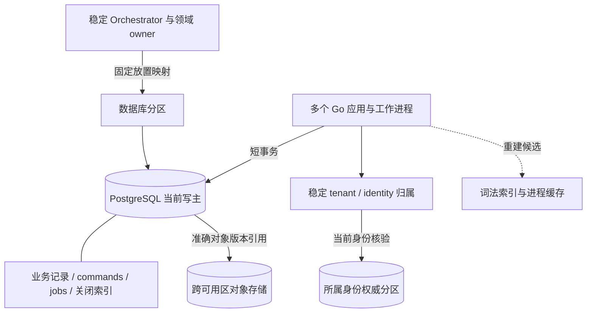
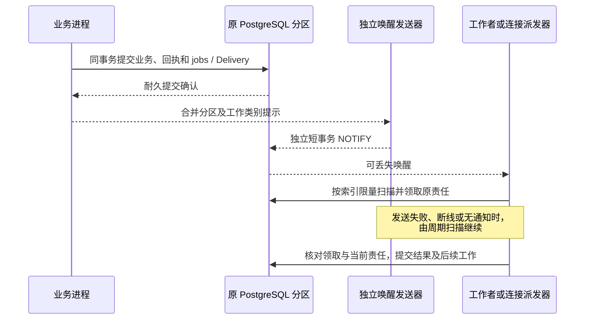
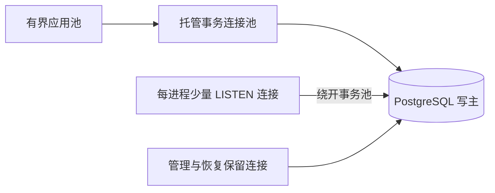
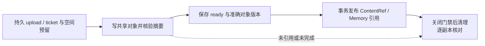

# 生产数据布局与最小中间件

[生产拓扑与恢复目标](deployment-production.md) · [任务事务](orchestrator/implementation.md) · [内容与清理](memory/implementation.md#reference-gate) · [执行入口](execution/implementation.md#entrance-recovery)

生产默认采用托管 PostgreSQL 18、跨可用区对象存储和平台已有的连接池、容器、负载均衡、DNS、密钥及监控能力；供应商可替换。单地域三个可用区、单可用区故障下已确认账本 RPO=0、控制与查询 RTO≤60 秒是待运行验收的目标，完整故障前提归[生产部署](deployment-production.md#availability)。完整单体仅用于开发调试；适用端侧组件也可使用本机 SQLite，其恢复边界与云端生产容灾分别验收。

## 1. 权威记录与物理位置

图展示权威归属及访问路径；虚线是可重建派生数据。数据库分区可以承载多个 Orchestrator 和租户，一个租户也可为新任务使用多个 Orchestrator。Orchestrator 是任务负责端，owner 是领域事实的裁决者，均不等于当前进程或一台数据库机器。

| 数据与归属 | 默认提交域 | 实现边界 |
| --- | --- | --- |
| Task、内部任务树、预算、原命令及 jobs | 原 Orchestrator 所在 PostgreSQL 分区 | 同一 Orchestrator 多进程共享一个写权威；祖先控制、准入和账务仍用短事务 |
| Grant 父链、计数与 Use；Confirmation | 原授权 owner；确认随消费它的业务 owner 放置 | 一条许可父链不拆库，Confirmation 与业务消费共事务；增加 Orchestrator 不复制旧许可余额 |
| Memory、Content 元数据、来源边及清理工作 | 同租户的 Memory／Content 默认共提交域 | 引用登记、关闭门禁和本域发布共同提交；Memory 变化与 [owner 事务头](memory/implementation.md#memory-change-head)共同保存，索引／视图从同一提交序列取切点；跨 owner 分支见[引用门禁](memory/implementation.md#reference-gate) |
| 上传、镜像、正文与制品字节 | 元数据在原 owner；字节在共享对象存储 | 接收实例可以替换，准确对象版本不依赖原 Pod 的临时磁盘 |
| 受管文件根、路径占用与写入 journal | 原 Executor／file owner 的权威分区保存 Operation、路径独占、journal 和原回执；目标字节留在已登记的受控文件根 | 根以稳定 file_owner 定位，不把目标文件混同于上行对象存储的 ContentRef。默认单故障域根不可用时停止该根新写，原操作保留 unknown／核对责任；只有文件存储另经根句柄解析、原子替换、字节及目录持久化、旧写者隔离验收后才允许跨区自动接管 |
| 会话、端点代次、委托凭据校验记录 | 按稳定 tenant／identity 映射到所属身份权威 | 身份路由可缓存，当前有效性不可用任意 TTL 的 allowed 缓存代替；核验不可达时拒绝相应新工作和披露 |
| 词法索引、任务汇总和用户预览缓存 | 原事实的派生物，保存追赶位置或准确版本 | 可重建；展示须标滞后并复核当前披露资格，不提供授权、去重、关闭或余额的最终判断 |
| 运维统计与报告 | 获准、脱敏后的派生记录或只读副本 | 标明观察时间和复制滞后；“无记录”不能证明原命令未接纳 |

放置映射由受信配置和持久目录保存，实例发现只解析当前健康地址。身份权威按账户／端点的稳定键分区，不把全部逐消息核验隐含压到一张全局热行；同一身份的会话撤销与代次仍由原分区裁决。预认证配对按独立 pairing_id 路由，批准时绑定租户，不能由匿名请求选择租户。映射不可确定时等待或拒绝，不把缓存 miss 当作新对象。

### 用户来源目录的内部读写边界

受信管理端在用户所属身份权威分区维护 `(tenant_id, actor_kind=user, actor_id, orchestrator_id)` 来源行、每来源涉及的披露授权权威集合及该用户单调递增的目录版本。增删来源或授权权威与推进版本在同一短事务提交；读端从同一个已确认提交视图返回完整去重集合、每来源权威集合及版本，不用各来源的缓存结果拼凑“完整”。这是应用聚合器的受信内部端口 `read_user_sources(已认证 tenant_id, user_id)`，响应为 `{sources: [{orchestrator_id, disclosure_authority_ids}], directory_version}` 或明确的不可用／不完整结果，不增加公开 `harness/1` 方法。每个来源至少登记原 Orchestrator；涉及另一 Grant／共享 owner 的披露变更须先登记该权威，再让变更生效。各权威按原事实返回可比较的披露范围修订，聚合器必须取得目录所列全部权威的修订；任一权威遗漏、不可达或不能比较时只报权限缺口。聚合器不得让客户端指定来源或授权权威。首屏和每次续页都须从当前身份权威读取目录版本；缓存只有在与该版本相同且内容摘要可核对时才能提供集合，读副本落后、当前权威不可达或版本不符就报来源缺口，不从旧主的“无记录”推断完整。

新用户开户或热点范围切换先耐久登记受影响用户的新来源及其披露授权权威，再发布可由发现返回的新任务映射；后来把另一 Orchestrator 的任务共享给用户，也先登记来源及新授权权威，再让披露生效。会扩大历史任务列表可见范围的 Grant／共享变更，发起方须从准确 Task／共享引用或受信完整范围查询得到全部受影响 Orchestrator，并在每个来源预登记其授权权威；无法界定完整有限集合时，该变更不能声称可完整列举的披露已生效，既有外部变更若无法阻止则相关列表报权限缺口。范围切换期间并发开户须进入同一受信发布屏障：开户使用已生效映射登记，或等待新范围全部登记完成并按新版本登记；管理端确认所有受影响用户和并发开户的登记已满足新版本后才能发布。登记以身份权威的同步耐久和旧主隔离条件确认为准，单个易失副本上的写入不算成功。发现 `GET` 只读已发布结果，不负责登记。

跨库先登记可能留下空来源或暂时多余的授权权威，可以保留；登记失败时依赖新来源的提交或披露变更等待，不先开放再补目录。目录只是[跨来源列表](interaction/README.md#cross-orchestrator-list)的覆盖入口，Task 仍由原 Orchestrator 裁决。旧来源只有在能够证明该用户于此负责方已无可查询 Task、未结提交或目录披露责任后才删除并推进版本；授权权威只有在能证明它不再影响该用户于该来源的任何当前或未决披露时才删除。长期命令关闭索引仍沿原逻辑服务放置映射查询，不靠用户来源目录定位。

身份权威将目录行与版本纳入同等耐久和备份范围。目录损坏或恢复旧快照时，身份权威先从完整备份恢复，再核对已发布路由历史、预登记记录及全部可能的共享／Grant 原 owner 的耐久披露引用与修订；只有证明这些权威范围均已覆盖、且重建结果与当前版本一起提交后，才能重新标记目录完整。枚举租户历来使用过的 Orchestrator 只能找到候选来源，无法找回空预登记和后来发生的跨 owner 披露，因此不能单独作为完整性证明。无法证明覆盖时，列表持续返回已知部分及来源／权限缺口，并暂停依赖该目录的新归属发布或披露扩张；原 Task 与已发效果仍沿原身份核对。

默认扩容增加 Orchestrator 承接新任务；原 `task_id→orchestrator_id` 不变。整库分区搬迁允许维护窗口：停止该分区新写与发送门禁、隔离旧写者、取得包含 commands／jobs／关闭索引及身份映射的完整切点，在目标恢复并验证对象引用后更新放置映射，再先开放控制和核对。旧映射只能拒绝或引导到原逻辑服务，不能继续写旧库；迁移失败保持维护状态，不从两个库择一重试。本方案不承诺在线重分片。

## 2. PostgreSQL 保存责任，通知只缩短等待

实线数据库操作决定业务结果，通知线不决定成功。jobs 与 Delivery 已是待处理责任，不再复制成另一份可靠队列；派发器只扫描本进程可服务的在线目标及有界到期范围，不为每条 WSS 单独建立数据库轮询器。连接位置丢失时原 Delivery 仍在，在线路由恢复后继续交付。

| 路径 | 固定机制 | 失败后继续者 |
| --- | --- | --- |
| 正常领取 | 按分区、工作类别、状态、due_at 和稳定键批量扫描；短事务 `FOR UPDATE SKIP LOCKED` 领取并递增 lease_epoch | 原 job；领域写入核对领取资格，完成／退避另核对当前 work_revision，见[责任槽规则](orchestrator/implementation.md#job-completion) |
| 长期等待与历史完成 | 等待工作有具体期限／依赖，不占 goroutine；终态工作退出活跃领取索引 | 恢复扫描按原责任键检查缺槽，不能新造命令身份 |
| 唤醒合并 | 有限内存集合只保留“某分区／类别需扫描”；载荷不含租户正文或用户凭据 | 集合溢出可丢提示，保留周期扫描 |
| 提交后发送失败 | NOTIFY 使用独立提交与有限超时，失败不回滚原业务、也不让客户端重提已成功命令 | 扫描发现原记录；无需可靠地补发每一条通知 |
| 监听连接恢复 | 先提交 LISTEN，再读取数据库当前到期工作，随后同时消费通知与周期扫描 | 重复提示按原记录去重，不依赖通知序号恢复 |

jobs 的责任版本在业务事务内递增；NOTIFY 只唤醒扫描，不产生新的责任版本。新责任与旧 done／backoff 争用原槽，使两种提交顺序都保留当前工作；周期补扫不承担修复正常并发丢唤醒的义务。Memory 索引、关闭与 copy 校准同样采用此规则，固定外部命令和累计重试预算不随版本变化重置。

NOTIFY 只向当时监听的会话发送提示；同事务相同载荷会合并，且队列满会使包含 NOTIFY 的事务提交失败，因此它不能进入本方案的业务提交事务。监听器不持长事务，也不把 NOTIFY 当作多租户保密通道。[PostgreSQL NOTIFY](https://www.postgresql.org/docs/18/sql-notify.html) 监听重建的先后顺序遵循官方的“先监听，再读取当前状态”规则。[PostgreSQL LISTEN](https://www.postgresql.org/docs/18/sql-listen.html)

## 3. 连接池与当前资格

先复用托管连接池；若不支持所需事务行为或无法满足故障容量，再部署跨可用区的 PgBouncer 事务池副本。连接池不选举数据库主，只连接平台已确认的写主；实例增加前核算所有池、监听和管理连接的总和。

事务池只在事务期间占用后端连接。租户上下文在每次事务内设置并核验，采用事务作用域状态，不依赖上一次请求遗留的 session 设置；RLS 角色不得绕过限制。LISTEN 和会话级 advisory lock 不经事务池，后者也不用于证明外部驱动已经停止。预编译语句及驱动配置按实际池版本验收。[PgBouncer 功能边界](https://www.pgbouncer.org/features.html)

认证会话、Grant 和内容当前资格核验使用各自权威分区的有界查询，不为减少数据库连接而改为长期缓存 allowed。租户洪峰分别受连接、查询并发和控制保留份额约束；身份或授权热点先定位具体键和查询放大，再决定扩分区或改变契约，不能只增加应用副本。

## 4. 对象存储与引用提交

上传和镜像元数据保存原身份、字节长度、摘要、状态和存储定位；存储定位至少绑定 bucket／对象键／不可变版本，属于 ByteStore 内部字段，不改变 ContentRef。只有跨可用区耐久写入与完整字节校验完成后才保存 ready；不能从单实例临时文件或上传请求的成功返回推导正式内容已发布。

新实例按原 upload_id／ticket_id 查询共享对象与元数据：已有准确版本则核对后继续，部分上传按原身份有限整份重传；身份或摘要不同拒绝。对象先写、元数据后提交留下的孤儿由清理工作核对，无引用标记、持有者和发布事务的互斥归[内容引用门禁](memory/implementation.md#reference-gate)。原 owner 关闭内容不等待物理删除，删除失败保留 residual 和重试责任；对象版本或保留能力不满足清理合同的存储配置不得承接该类内容。

备份清单同时固定数据库切点、引用对象版本、关闭依据、放置映射与密钥恢复依据。跨可用区耐久对象是生产依赖，不把仍在异步复制中的对象宣称已达到账本相同恢复保证。恢复发现引用字节缺失时保留内容缺口，不能改成目标操作未发生。

## 5. 热表、唯一性与长期增长

| 数据类 | 布局与访问 | 保留与维护 |
| --- | --- | --- |
| 活动 jobs／Delivery | 只让 ready／waiting／leased 等未结责任进入活跃索引；到期扫描使用固定状态条件、due_at 与稳定键，单批及单次扫描均有限 | 已完成记录按原责任关闭后移出热路径；周期检查最老等待、过期领取、扫描行数与命中比 |
| 命令身份与关闭索引 | 按原完整业务键保唯一；量大时对这些键列做 PostgreSQL HASH 分区，唯一约束仍包含完整原键及全部分区键 | 时间不进入去重身份，不能按月删除最后墓碑；正文到期只清正文和非必要字段 |
| 历史正文／诊断／已结明细 | 与当前投影及最小关闭依据分开；需要时按保留期分区 | 只有原责任已结、必要证据与关闭依据仍可查时才能清理；历史分区不承担全局去重 |
| 内容／来源与副本关系 | 元数据按原 owner 路由；对象按准确版本读取 | 原 copy、来源边及残留责任随未结工作保留，不能按缓存 TTL 回收 |

普通跨库 copy 的持久校准槽经 `content.get(mode=control)` 查原 owner 的当前控制，并与本地发布门禁串行合并；没有正文读取资格仍可查询自身收尾状态。owner 的 pending 直到原 `content.release_copy` 报告实际停止／清理才推进。调度批量领取和可丢唤醒可合并，线查询仍逐准确 copy 执行，不能假定存在批量控制 RPC；机制和跨库时间窗口见[引用门禁](memory/implementation.md#reference-gate)。

例如 Command 的唯一键仍是 `(tenant_id, logical_service_id, command_id)`；HASH 分区使用该组键列，摘要用于核对请求，不以摘要碰撞概率替代唯一约束。PostgreSQL 分区表的唯一约束必须包含分区键，不能按创建时间拆表后只在月表内检查 command_id。[分区约束](https://www.postgresql.org/docs/18/ddl-partitioning.html#DDL-PARTITIONING-DECLARATIVE-LIMITATIONS)

活跃 partial index 的状态条件须与领取查询相符；不能把 `now()` 这样的移动时间边界当作索引中的持久状态，due_at 留给查询过滤。具体索引以执行计划和正常／恢复积压负载测量决定。[部分索引](https://www.postgresql.org/docs/18/indexes-partial.html)

jobs 更新和批量清理会产生旧行版本，按热表单独配置 autovacuum／ANALYZE 并观察死元组、最老事务和膨胀；常规 VACUUM 主要回收可复用空间，不等于磁盘文件立即缩小。[日常维护](https://www.postgresql.org/docs/18/routine-vacuuming.html) 容量同时计入 WAL 生成／保留、同步副本、备份、索引重建空间和长期关闭索引。副本或备份积压超过预算时先限制新接纳，给控制与收尾保留空间；不能删去重记录换取表面恢复。

## 6. 存储保护与备份恢复

数据库和内容存储分别设置保护水位；初始剩余空间低于 10% 时停止新任务、模型调用和上传，不再预留新增正文。每次正常接纳须在预算内留出最坏情况下原回执、控制和收尾元数据空间，生产由平台容量和准入限额兑现保留，不能仅凭百分比声称故障时可写。开发及端侧文件库可按宿主能力使用应急文件，不能假设托管数据库允许应用操作数据目录。连控制决定都无法耐久提交时，入口返回不可用／结果未知，进程内尽力阻止新发送，但不得回复“取消已保存”。优先清理可回收的临时上传和无引用对象；未知效果、命令去重与最后一份关闭依据不能当作可删空间。

最小关闭索引的键、值与合并判据归[共同契约](contracts/README.md)，并长期保留。按每日 500 万任务，仅任务身份一年约 18.25 亿个，命令与操作另计；设每天新增命令关闭数为 `N_cmd`、其他不可合并关闭数为 `N_close`、单条含索引开销为 `B`，一年新增量约 `365 × (N_cmd + N_close) × B`。`B`、WAL、索引页利用率、同步副本、备份和重建空间须实测；普通历史正文保留期不能删去最后的去重与关闭身份。

备份清单绑定数据库一致切点、准确内容版本、安装锁、关闭索引、放置映射、用户来源目录及其授权权威集合／版本、已发布映射历史和凭据恢复依据，完整摘要写入后才标记可恢复。SQLite 使用在线备份 API 或停写一致快照，不单独复制正在使用的主库文件。恢复旧备份时先隔离原写者，再取得切点之后的命令、撤权、关闭和外部效果事实；缺少完整后续记录时只读诊断，不重新启动旧任务／许可／设备动作。身份目录与 Task／Grant 分区无需同刻备份，但开放跨来源完整列表前，身份权威须按[目录恢复规则](#source-directory)证明目录不早于所有已恢复接纳、映射发布与披露事实；无法证明则报缺口并暂停新归属发布／披露扩张。凭据经密钥托管器核对当前代次后才可使用，备份内容与关闭索引分别列保留和授权。空间不足、迁移中断、内容缺失及缺历史恢复须按[故障实验](validation/fault-experiments.md)取得运行证据。

## 7. 为什么当前不再增加一层

| 竞争选择 | 当前选择及承担的代价 | 何时重新选择 |
| --- | --- | --- |
| NATS 等独立通知总线 | PostgreSQL 扫描加可丢唤醒；维护者承担数据库扫描与监听连接成本，减少一套集群、权限和故障恢复依赖 | 扫描、NOTIFY 扇出或跨分区唤醒的实测成本超过预算，且独立通知层能降低总成本时引入；消息仍只定位原记录 |
| Kafka／持久流平台 | 不用另一套日志解释 Task 或 Operation；回放与恢复从领域记录及原 jobs 出发 | 出现独立多消费者、长周期流回放需求并有完整保留／隐私设计时再评估，不能以它替代当前事务 |
| Redis 缓存／在线目录 | 先用进程缓存与可恢复的在线路由；重连可查原账本，部署少一个状态系统 | 不可变数据读取或在线目录查询成为已测瓶颈时加入；缓存 miss 回源，缓存故障不产生新 owner，也不放宽当前授权 |
| 独立向量／全文检索库 | 默认词法候选和有限权威补扫；数据库承担索引及补扫压力 | 冻结质量评测证明检索收益、带来源过滤的负载证明现有索引不足后启用；权威记录、关闭和资格仍在原 owner |
| 自建数据库 HA／全套基础平台 | 优先托管及组织已有能力；接受平台约束，按保证而非品牌验收 | 托管无法兑现明确功能、地域或成本约束时再自建，并由平台负责人承担选主、隔离、升级和灾备值守 |

以上选择尚未证明目标规模通过。首轮实验必须包含无通知扫描、通知队列故障、连接池退出、数据库提升、对象上传后实例退出、长期关闭索引增长，以及[跨库引用关闭竞争](memory/implementation.md#reference-gate)和[旧设备入口恢复](execution/implementation.md#entrance-recovery)。记录控制／查询 RTO、每项责任恢复年龄、提交与 WAL 写放大、连接数、对象残留和恢复期间拒绝率；静态契约与图示检查不替代这些运行证据。
