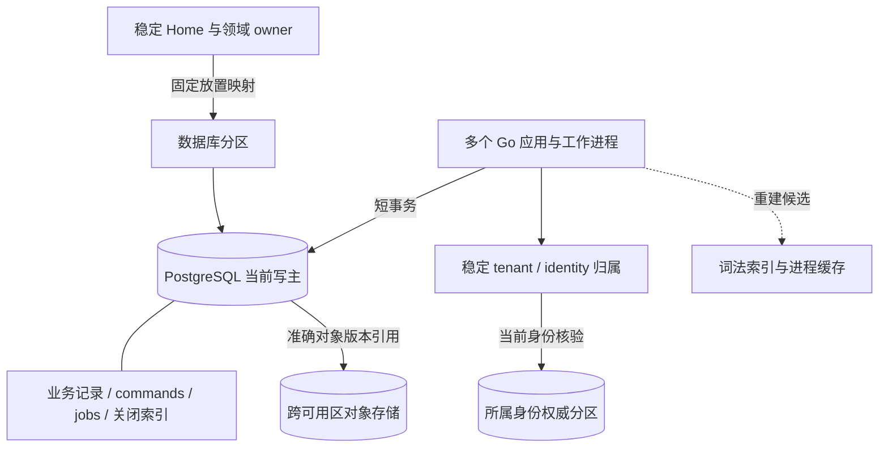
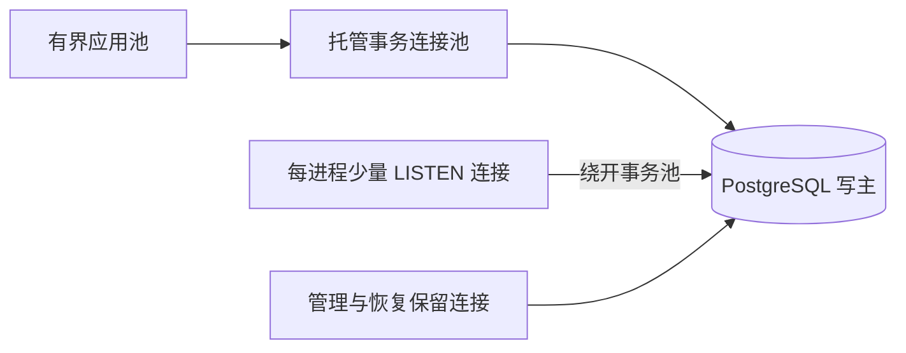
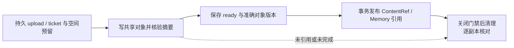

# 生产数据布局与最小中间件

[生产拓扑与恢复目标](deployment-production.md) · [任务事务](task-runtime/implementation.md) · [内容与清理](memory/implementation.md#reference-gate) · [执行入口](execution/implementation.md#entrance-recovery)

生产默认采用托管 PostgreSQL 18、跨可用区对象存储和平台已有的连接池、容器、负载均衡、DNS、密钥及监控能力；供应商可替换。单地域三个可用区、单可用区故障下已确认账本 RPO=0、控制与查询 RTO≤60 秒是待运行验收的目标，完整故障前提归[生产部署](deployment-production.md#availability)。完整单体仅用于开发调试；适用端侧组件也可使用本机 SQLite，其恢复边界与云端生产容灾分别验收。

## 1. 权威记录与物理位置

图展示权威归属及访问路径；虚线是可重建派生数据。数据库分区可以承载多个 Home 和租户，一个租户也可为新任务使用多个 Home。Home 是任务负责端，owner 是领域事实的裁决者，均不等于当前进程或一台数据库机器。

| 数据与归属 | 默认提交域 | 实现边界 |
| --- | --- | --- |
| Task、内部任务树、预算、原命令及 jobs | 原 Home 所在 PostgreSQL 分区 | 同一 Home 多进程共享一个写权威；祖先控制、准入和账务仍用短事务 |
| Grant 父链、计数与 Use；Confirmation | 原授权 owner；确认随消费它的业务 owner 放置 | 一条许可父链不拆库，Confirmation 与业务消费共事务；增加 Home 不复制旧许可余额 |
| Memory、Content 元数据、来源边及清理工作 | 同租户的 Memory／Content 默认共提交域 | 引用登记、关闭门禁和本域发布共同提交；跨 owner 分支见[引用门禁](memory/implementation.md#reference-gate) |
| 上传、镜像、正文与制品字节 | 元数据在原 owner；字节在共享对象存储 | 接收实例可以替换，准确对象版本不依赖原 Pod 的临时磁盘 |
| 会话、端点代次、委托凭据校验记录 | 按稳定 tenant／identity 映射到所属身份权威 | 身份路由可缓存，当前有效性不可用任意 TTL 的 allowed 缓存代替；核验不可达时拒绝相应新工作和披露 |
| 词法索引、查询缓存、统计 | 原事实的派生物 | 可重建；不提供授权、去重、关闭或余额的最终判断 |

放置映射由受信配置和持久目录保存，实例发现只解析当前健康地址。身份权威按账户／端点的稳定键分区，不把全部逐消息核验隐含压到一张全局热行；同一身份的会话撤销与代次仍由原分区裁决。预认证配对按独立 pairing_id 路由，批准时绑定租户，不能由匿名请求选择租户。映射不可确定时等待或拒绝，不把缓存 miss 当作新对象。

默认扩容增加 Home 承接新任务；原 `task_id→home_id` 不变。整库分区搬迁允许维护窗口：停止该分区新写与发送门禁、隔离旧写者、取得包含 commands／jobs／关闭索引及身份映射的完整切点，在目标恢复并验证对象引用后更新放置映射，再先开放控制和核对。旧映射只能拒绝或引导到原逻辑服务，不能继续写旧库；迁移失败保持维护状态，不从两个库择一重试。本方案不承诺在线重分片。

## 2. PostgreSQL 保存责任，通知只缩短等待

实线数据库操作决定业务结果，通知线不决定成功。jobs 与 Delivery 已是待处理责任，不再复制成另一份可靠队列；派发器只扫描本进程可服务的在线目标及有界到期范围，不为每条 WSS 单独建立数据库轮询器。连接位置丢失时原 Delivery 仍在，在线路由恢复后继续交付。

| 路径 | 固定机制 | 失败后继续者 |
| --- | --- | --- |
| 正常领取 | 按分区、工作类别、状态、due_at 和稳定键批量扫描；短事务 `FOR UPDATE SKIP LOCKED` 领取并递增 lease_epoch | 原 job；领域写入再次核对代次与业务前提 |
| 长期等待与历史完成 | 等待工作有具体期限／依赖，不占 goroutine；终态工作退出活跃领取索引 | 恢复扫描按原责任键检查缺槽，不能新造命令身份 |
| 唤醒合并 | 有限内存集合只保留“某分区／类别需扫描”；载荷不含租户正文或用户凭据 | 集合溢出可丢提示，保留周期扫描 |
| 提交后发送失败 | NOTIFY 使用独立提交与有限超时，失败不回滚原业务、也不让客户端重提已成功命令 | 扫描发现原记录；无需可靠地补发每一条通知 |
| 监听连接恢复 | 先提交 LISTEN，再读取数据库当前到期工作，随后同时消费通知与周期扫描 | 重复提示按原记录去重，不依赖通知序号恢复 |

NOTIFY 只向当时监听的会话发送提示；同事务相同载荷会合并，且队列满会使包含 NOTIFY 的事务提交失败，因此它不能进入本方案的业务提交事务。监听器不持长事务，也不把 NOTIFY 当作多租户保密通道。[PostgreSQL NOTIFY](https://www.postgresql.org/docs/18/sql-notify.html) 监听重建的先后顺序遵循官方的“先监听，再读取当前状态”规则。[PostgreSQL LISTEN](https://www.postgresql.org/docs/18/sql-listen.html)

## 3. 连接池与当前资格

先复用托管连接池；若不支持所需事务行为或无法满足故障容量，再部署跨可用区的 PgBouncer 事务池副本。连接池不选举数据库主，只连接平台已确认的写主；实例增加前核算所有池、监听和管理连接的总和。

事务池只在事务期间占用后端连接。租户上下文在每次事务内设置并核验，采用事务作用域状态，不依赖上一次请求遗留的 session 设置；RLS 角色不得绕过限制。LISTEN 和会话级 advisory lock 不经事务池，后者也不用于证明外部驱动已经停止。预编译语句及驱动配置按实际池版本验收。[PgBouncer 功能边界](https://www.pgbouncer.org/features.html)

认证会话、Grant 和内容当前资格核验使用各自权威分区的有界查询，不为减少数据库连接而改为长期缓存 allowed。租户洪峰分别受连接、查询并发和控制保留份额约束；身份或授权热点先定位具体键和查询放大，再决定扩分区或改变契约，不能只增加应用副本。

## 4. 对象存储与引用提交

上传和镜像元数据保存原身份、字节长度、摘要、状态和存储定位；存储定位至少绑定 bucket／对象键／不可变版本，属于 ByteStore 内部字段，不改变 ContentRef。只有跨可用区耐久写入与完整字节校验完成后才保存 ready；不能从单实例临时文件或上传请求的成功返回推导正式内容已发布。

新实例按原 upload_id／ticket_id 查询共享对象与元数据：已有准确版本则核对后继续，部分上传按原身份有限整份重传；身份或摘要不同拒绝。对象先写、元数据后提交留下的孤儿由清理工作核对，无引用标记、持有者和发布事务的互斥归[内容引用门禁](memory/implementation.md#reference-gate)。原 owner 关闭内容不等待物理删除，删除失败保留 residual 和重试责任；对象版本或保留能力不满足清理合同的存储配置不得承接该类内容。

备份清单同时固定数据库切点、引用对象版本、关闭依据、放置映射与密钥恢复依据。跨可用区耐久对象是生产依赖，不把仍在异步复制中的对象宣称已达到账本相同恢复保证。恢复发现引用字节缺失时保留内容缺口，不能改成目标操作未发生。

## 5. 热表、唯一性与长期增长

| 数据类 | 布局与访问 | 保留与维护 |
| --- | --- | --- |
| 活动 jobs／Delivery | 只让 ready／waiting／leased 等未结责任进入活跃索引；到期扫描使用固定状态条件、due_at 与稳定键，单批及单次扫描均有限 | 已完成记录按原责任关闭后移出热路径；周期检查最老等待、过期领取、扫描行数与命中比 |
| 命令身份与关闭索引 | 按原完整业务键保唯一；量大时对这些键列做 PostgreSQL HASH 分区，唯一约束仍包含完整原键及全部分区键 | 时间不进入去重身份，不能按月删除最后墓碑；正文到期只清正文和非必要字段 |
| 历史正文／诊断／已结明细 | 与当前投影及最小关闭依据分开；需要时按保留期分区 | 只有原责任已结、必要证据与关闭依据仍可查时才能清理；历史分区不承担全局去重 |
| 内容／来源与副本关系 | 元数据按原 owner 路由；对象按准确版本读取 | 原 copy、来源边及残留责任随未结工作保留，不能按缓存 TTL 回收 |

普通跨库 copy 的持久校准槽经 `content.get(mode=control)` 查原 owner 的当前控制，并与本地发布门禁串行合并；没有正文读取资格仍可查询自身收尾状态。owner 的 pending 直到原 `content.release_copy` 报告实际停止／清理才推进。调度批量领取和可丢唤醒可合并，线查询仍逐准确 copy 执行，不能假定存在批量控制 RPC；机制和跨库时间窗口见[引用门禁](memory/implementation.md#reference-gate)。

例如 Command 的唯一键仍是 `(tenant_id, logical_service_id, command_id)`；HASH 分区使用该组键列，摘要用于核对请求，不以摘要碰撞概率替代唯一约束。PostgreSQL 分区表的唯一约束必须包含分区键，不能按创建时间拆表后只在月表内检查 command_id。[分区约束](https://www.postgresql.org/docs/18/ddl-partitioning.html#DDL-PARTITIONING-DECLARATIVE-LIMITATIONS)

活跃 partial index 的状态条件须与领取查询相符；不能把 `now()` 这样的移动时间边界当作索引中的持久状态，due_at 留给查询过滤。具体索引以执行计划和正常／恢复积压负载测量决定。[部分索引](https://www.postgresql.org/docs/18/indexes-partial.html)

jobs 更新和批量清理会产生旧行版本，按热表单独配置 autovacuum／ANALYZE 并观察死元组、最老事务和膨胀；常规 VACUUM 主要回收可复用空间，不等于磁盘文件立即缩小。[日常维护](https://www.postgresql.org/docs/18/routine-vacuuming.html) 容量同时计入 WAL 生成／保留、同步副本、备份、索引重建空间和长期关闭索引。副本或备份积压超过预算时先限制新接纳，给控制与收尾保留空间；不能删去重记录换取表面恢复。

## 6. 为什么当前不再增加一层

| 竞争选择 | 当前选择及承担的代价 | 何时重新选择 |
| --- | --- | --- |
| NATS 等独立通知总线 | PostgreSQL 扫描加可丢唤醒；维护者承担数据库扫描与监听连接成本，减少一套集群、权限和故障恢复依赖 | 扫描、NOTIFY 扇出或跨分区唤醒的实测成本超过预算，且独立通知层能降低总成本时引入；消息仍只定位原记录 |
| Kafka／持久流平台 | 不用另一套日志解释 Task 或 Operation；回放与恢复从领域记录及原 jobs 出发 | 出现独立多消费者、长周期流回放需求并有完整保留／隐私设计时再评估，不能以它替代当前事务 |
| Redis 缓存／在线目录 | 先用进程缓存与可恢复的在线路由；重连可查原账本，部署少一个状态系统 | 不可变数据读取或在线目录查询成为已测瓶颈时加入；缓存 miss 回源，缓存故障不产生新 owner，也不放宽当前授权 |
| 独立向量／全文检索库 | 默认词法候选和有限权威补扫；数据库承担索引及补扫压力 | 冻结质量评测证明检索收益、带来源过滤的负载证明现有索引不足后启用；权威记录、关闭和资格仍在原 owner |
| 自建数据库 HA／全套基础平台 | 优先托管及组织已有能力；接受平台约束，按保证而非品牌验收 | 托管无法兑现明确功能、地域或成本约束时再自建，并由平台负责人承担选主、隔离、升级和灾备值守 |

以上选择尚未证明目标规模通过。首轮实验必须包含无通知扫描、通知队列故障、连接池退出、数据库提升、对象上传后实例退出、长期关闭索引增长，以及[跨库引用关闭竞争](memory/implementation.md#reference-gate)和[旧设备入口恢复](execution/implementation.md#entrance-recovery)。记录控制／查询 RTO、每项责任恢复年龄、提交与 WAL 写放大、连接数、对象残留和恢复期间拒绝率；静态契约与图示检查不替代这些运行证据。
