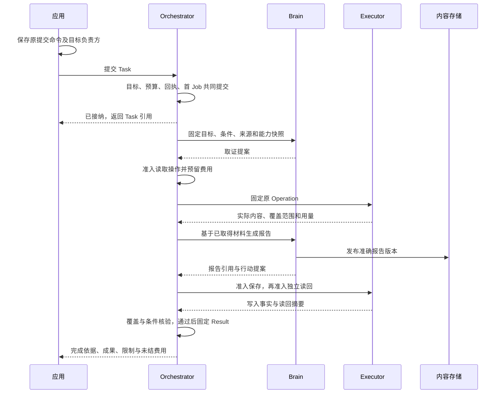
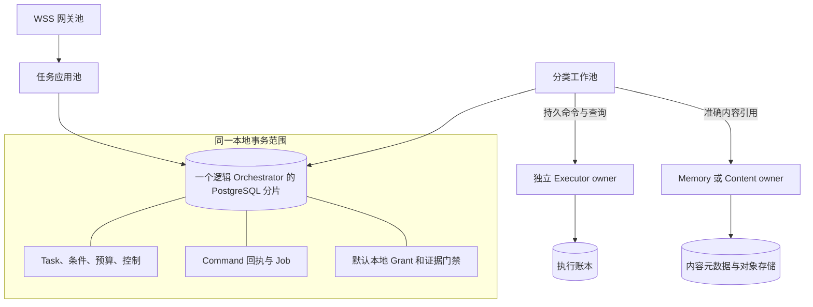

# 系统模型与任务主线

Harness 持续承担一个目标及其后果。系统必须同时回答：用户想要什么、现在允许做什么、实际做了什么、还有什么不知道、凭什么说完成。

这五个问题决定对象、事务和模块边界。它们不能合并成一个 running/done 状态，否则一次超时就会迫使系统猜测外部世界。

## 1 用一个任务推导模型

用户要求：“比较两个软件版本，附来源，把报告保存到指定目录，再读回确认。”

Orchestrator 建立一个 Task。它保留原目标，并把完成要求分成比较质量、来源支撑、保存位置和读回一致性四项 Requirement。Brain 可以建议怎样查资料、怎样写报告；它不能以“已完成”的文字替代文件效果或验收证据。

图略去每次授权检查与效果核对，但没有跨网络事务。Brain 产出正文时仍受保存许可约束；发布失败不代表模型没调用。写入和读回各有自己的 Operation。质量评估可以引用同一报告，但必须由已登记的规则和实现判断。

直接问答不必创建工具 Operation。它仍有 Task、固定 Decision、准确成果和完成依据。无需长期记忆、委派或结构化计划的任务，不创建这些对象。

## 2 六组对象以及两种不同的负责方

领域负责方（owner）保存某类事实并裁决变更。工作者（worker）只是暂时领取处理工作的进程。进程退出不会改变 owner，也不会改变命令或操作身份。

| 对象组 | 持久身份及内容 | 唯一事实负责方 |
| --- | --- | --- |
| Session | 消息顺序、分支、输入投递及关联任务；归档只改变会话展示 | 应用 Interaction |
| Task | 原目标、Requirement、策略、控制、当前事实投影、预算、Result | 固定 Orchestrator |
| Decision | 输入 Snapshot、配置、至多一个物理 ModelCall、提案与用量 | Brain；采纳记录归 Orchestrator |
| Operation | Orchestrator 保存不可变 Intent；Executor 保存接纳、Attempt、Effect、证据和用量 | 两方各自写自己的记录，不能互改 |
| Content | 准确版本字节、来源、用途、持有副本及清理责任 | 原 Content owner；Memory 保存记忆语义与引用 |
| Grant | 许可、使用、离线分配及结算 | 原授权 owner；业务确认由实际业务 owner 消费 |

每条跨域引用至少能定位租户、逻辑 owner、对象及准确版本。内容另有摘要、媒体类型与字节长度。读取准确旧版本仍须检查当前用途权限；“以前读过”不授予再次使用资格。

Surface、Delegation、InstallLock、EvaluationRun 和 Schedule 只在相应能力启用时有独立身份。它们不竞争 Task 的完成状态。Command、Job 和 Attempt 则分别解释业务请求、待处理责任与物理执行尝试，不是新的用户目标。

## 3 五个成功点必须分别观察

| 可见事实 | 能得出的结论 | 仍不能得出的结论 |
| --- | --- | --- |
| Command 回执 applied | 方法规定的决定已持久提交 | 目标效果已发生 |
| Operation.effect=applied | 声明的效果有目标证据 | 用户全部目标已满足 |
| may_apply_later=false | 原操作不会再产生迟到效果 | 效果满足当前任务条件 |
| Task.status=succeeded | 当前目标覆盖、必要条件及效果收尾满足完成门禁 | 账单或数据清理全部结束 |
| spending_closed 且可信当前最终用量，或包含两者的完整Closure | 已关闭相应的新消费并取得当前最终用量 | 供应商以后永远不会更正原账单 |

“文件曾写入”是历史效果。“现在文件仍是该版本”需要带观察时点的读回。后续用户修改文件不会把原 applied 改成 not_applied；它可能让当前成果证据失去适用性。

任务取消同样只决定不再推进目标。已经进入目标系统的动作仍可能完成。UI 必须展示“取消已保存，写入结果仍在核对”，而不是声称所有动作都已停。

## 4 逻辑权威和物理位置分开

一个 Task 终身归属同一个 orchestrator_id。该逻辑负责方可由多个应用副本和工作者提供服务。它们通过原分片短事务串行裁决同一 Task；无需指定一台永久存活的“主 Agent”。

生产默认有四类在线角色：连接网关、任务应用、分类工作池、执行宿主。管理与评测另设隔离进程。模块多于进程角色，因为拆进程应解决伸缩、信任或故障隔离问题，而非照文档目录复制服务。

事务范围由宿主明确装配，不能由图上的相邻关系推断。独立 owner 即使恰好运行在同一机器，也不自动共享事务。需要跨库时采用“本方固定意图与责任 → 对方持久接纳 → 本方记下原回执”的协议，允许中间未知但不允许责任消失。

## 5 正常路径背后的三个屏障

**业务准入屏障。** Orchestrator 在一个短事务中检查当前目标、控制、预算和能力，固定 OperationIntent、来源消费记录和 dispatch Job。没有确认提交，不派发。

**真实启动屏障。** Executor 在实际入口核验 TaskGate、Grant 使用窗口、安装资格和资源占用，保存 Attempt 及核对责任后发送。租约 fencing 只保护账本写入；第三方未验证该 fencing token 时，它不能阻止旧进程的外部副作用。

**完成屏障。** Orchestrator 锁定 Task，检查当前全部必要条件、完整未结效果集合、内部子终结、外部新目标行动封闭和证据缺陷门禁，再共同保存固定 Result 与终态。它不会依赖一页列表或异步缓存证明“没有未决项”。

三个屏障解决不同竞争，不能用一个“事务成功”笼统替代。发送前落账减少遗漏，但数据库与第三方系统之间通常不存在原子提交，因而必须保留 unknown。

## 6 失败后仍闭合的路径

报告写入已发生，回执丢失，用户随后取消。系统按以下顺序收束：

1. Orchestrator 保存 cancelled，关闭新的目标工作，并为所有相关执行端保存控制传播责任
2. 接替工作者查询原 command_id 和 operation_id，不重建写入意图
3. Executor 核对目标文件、原 journal 和原 Attempt；得到可靠证据后保存 applied，或者保留 unknown
4. Orchestrator 归并效果和真实费用；Task 仍是 cancelled，必要时展示迟到效果及处置入口
5. 自动查询达到上限时转为明确待处置，原未决记录、资源限制和预算占用继续存在

[解释工具](assets/design-lab.html)逐步展示这条路径。默认没有自动“补偿”：删除刚写出的文件也是新的有后果行动，必须重新获得相应授权，而且不能假定它等于撤销原动作。

## 7 设计的共同不变量

- 一个原命令在一个逻辑服务内只有一个决定。同键异内容拒绝；固定拒绝不因后来条件改善而变成获准
- 每项已接纳责任都能从持久记录恢复。通知、socket、内存队列和函数返回都不是责任凭据
- 旧目标、旧控制或旧领取不能准入新行动；合法迟到事实仍可归并
- 每个实际计费来源只计一次累计增量。Task 终态不删除原账务责任
- 全部实际处理过的来源共同约束派生结果，不能只保留模型引用的公开来源
- 必要条件逐项满足。高质量评分、用户接受或空的展示列表都不能消除未知效果
- 权限和资源只可在授权范围内收缩。模型、Skill、插件和子 Agent 均不能自行扩大范围

这些不变量决定各章的实现和验收。运行无法证明某项前提时，系统给出具体等待或缺口，并关闭依赖该前提的新行动；它不把不确定性改写成成功。
