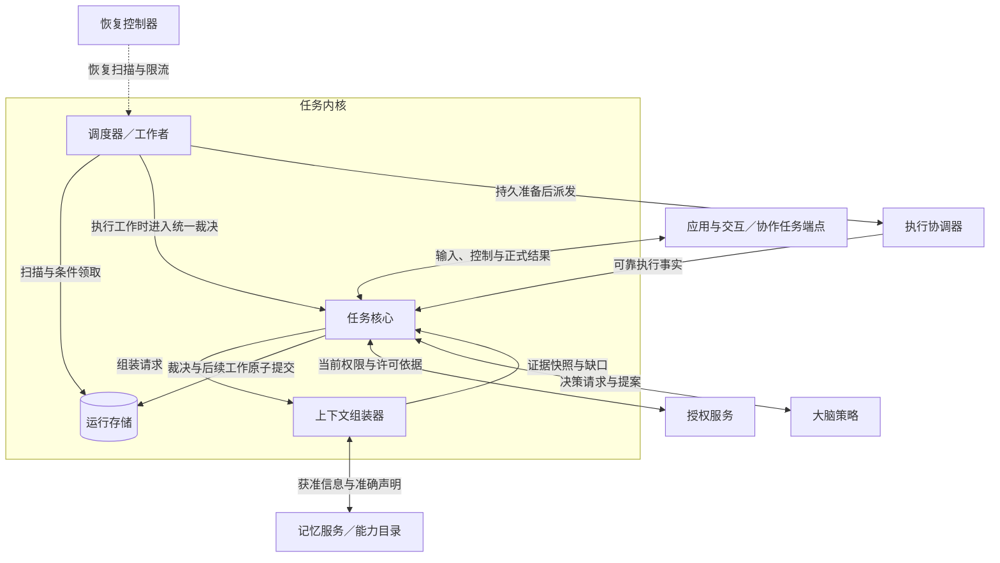
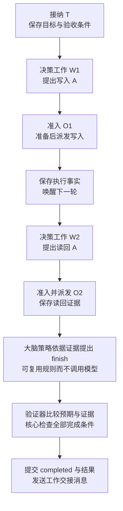

# 任务内核详细设计

任务内核把用户目标、大脑提案和执行事实转换为**可持久恢复的任务推进决定**。任务核心负责裁决，运行存储保存裁决及后续责任，调度器／工作者执行这些责任，上下文组装器为下一轮决策准备获准证据。外部操作的实际效果仍由执行系统核对。

本方案依据[系统全景图](../diagrams/system-panorama.drawio)、[项目目标](../../harness-project-goals.md)及[端点通信协议](../endpoint-communication/protocol.md)，规定任务内核的实现契约。新增控制、跨端目录／事实和远程大脑契约均已纳入设计；参考实现仍待交付，运行保证须通过[实现验收](recovery-and-validation.md#validation)验证。

正文依次阅读[生命周期](lifecycle.md)、[用户控制与管理](control-and-management.md)、[决策与工作](decision-and-work.md)、[接口与存储](storage-and-interfaces.md)和[恢复验证](recovery-and-validation.md)。

上下文缺口沿[结构化补全闭环](decision-and-work.md#context-requirements)保存与推进；新业务目标通过[受信任务策略接口](storage-and-interfaces.md#task-policy)绑定验收条件，通用核心继续负责准入和完成裁决。

## 1. 范围与核心对象

设计固定同用户单一写权威、固定任务控制方，支持提交、决策、执行反馈、输入、动作边界暂停／恢复、预算调整、补证、取消、核验与结果交付。写权威可部署在本地或云端。**写权威**指可以裁决该用户任务及操作唯一性的运行存储；执行端可以分布在其他设备。

| 能力范围 | 实现约束 |
| --- | --- |
| 首期闭环 | 同用户任务与操作索引位于一个提交域；任务核心复用已有执行、授权、内容及消息交付接口 |
| 条件具备后启用 | 离线推进须有显式有限窗口及全部许可／来源／平台依据；跨端委派实现已采用 CO-P1 的结果、预算与控制合同，并回到原固定权威接纳内部子任务；运行中换权威仍不启用 |
| 已有邻接契约 | [消息交付](../endpoint-communication/delivery-and-recovery.md)、[授权与可信时间](../identity-and-authorization/mechanisms.md)、[内容与来源](../content-and-provenance.md)已有设计；实现需满足其交接保证 |
| 用户控制与恢复 | [暂停、预算与补证](control-and-management.md)及完整取消答复查询已定义；跨端委派复用协作合同。控制权迁移与自动接替仍不启用 |

先用“将指定内容保存到路径 A，再读回核验”区分三个对象：

| 对象 | 本方案含义 | 在例子中的对应物 |
| --- | --- | --- |
| 任务 `Task` | 保存用户目标、约束、状态及结果 | T：保存内容并确认正确 |
| 操作 `Operation` | 一次固定意图的业务调用，贯穿请求、查询和结果 | O1：写入 A；O2：读回 A |
| 工作 `Work` | 内核需要继续执行的有限步骤，含领取与恢复状态 | 生成一轮提案、派发 O1、查询 O1 或发送结果各有对应工作 |

大脑返回的 **Proposal（提案）**可建议行动、等待或结束；**准入**是核心把有效提案原子保存为操作及后续工作的步骤。工作上的 **blocker（阻塞条件）**表示尚未满足的输入或依赖。`effects_pending` 表示仍需核对外部效果，与任务主状态分别记录。

首次阅读沿本页正常流程，再读[决策与工作](decision-and-work.md)及[生命周期](lifecycle.md)。实现时查[接口与持久化](storage-and-interfaces.md)，故障与验收查[恢复与验证](recovery-and-validation.md)。

## 2. 模块分工

图从单个任务控制方看任务内核；实线为调用或持久交接，虚线为恢复触发。四个内核模块是逻辑职责，可以在同一进程内实现。

| 模块 | 输入与输出 | 独占职责与限制 |
| --- | --- | --- |
| 任务核心 | 正式输入、提案、事实、控制 → 状态、工作、结果 | 裁决任务状态、准入、预算及完成；按固定验收策略核对证据与评估结果 |
| 上下文组装器 | 固定任务快照、用途及限额 → 上下文快照、来源和缺口 | 核对来源、权限、修订和内容；不把检索命中升级为执行事实，不自行保存长期记忆 |
| 运行存储 | 条件变更 → 持久回执／冲突／提交未知 | 保证任务、工作及关联记录原子保存；不包含 UI、执行或消息交付的独立账本 |
| 调度器／工作者 | 到期工作 → 领取、调用、结果交接 | 有界扫描、公平调度、租约恢复；不能凭“领到工作”跳过任务核心的派发检查 |

内核需要同时解决三个冲突：大脑决策期间事实仍会变化；任务状态与外部效果不能放在一个事务内提交；取消或断网时仍要保留核对责任。对应采用版本准入、持久工作交接、任务终态与效果核对分离。

消息交付在内核之外维护消息、去重和待处理记录；运行存储维护任务、操作和工作。两者的[持久化责任与交接边界](storage-and-interfaces.md#delivery-store)分别定义，可以共用数据库产品。

## 3. 从保存文件看正常闭环

本例的用户输入已明确路径 A 与待保存内容。接纳时固定任务策略；策略将原始输入绑定为“路径为 A、读回内容摘要匹配、没有仍能改写成果的在途操作”等验收条件。读回比对由策略选定的验证器执行，大脑只提出完成建议。需要先澄清路径、联网取证并生成答案时，按[贯穿设计示例](../design-walkthrough.md)固定取值规则，再绑定通过评估的具体答案版本。

图只展示 T 的业务推进；箭头表示取得前一步的持久结果后才能继续。每个操作通过对应工作调度，具体事务与调用位置见[一轮推进时序](decision-and-work.md#round)。

一次准入成功只说明后续步骤已经可靠保存。文件是否写入由执行证据说明，是否满足目标由固定条件核验，结果是否送达由消息交付记录说明。任一处失联时，沿原操作与原消息恢复；[取消与断线实例](recovery-and-validation.md#cancel-example)展示效果未知时的行为。

## 4. 必须保持的约束

| 编号 | 约束 | 主要落实位置 |
| --- | --- | --- |
| K1 | 所有记录、查询、去重和领取按受信用户隔离；返回旧结果也检查当前披露权限 | [接口与存储](storage-and-interfaces.md#commit) |
| K2 | 同一任务只有当前控制方可以产生新的目标工作；所有权版本不等于工作者租约 | [恢复与控制](recovery-and-validation.md#ownership) |
| K3 | 业务接纳及状态变化与后续责任一起耐久提交；提交未知不作为成功 | [提交边界](storage-and-interfaces.md#transactions) |
| K4 | 提案绑定 decide 工作、原领取、decision_revision 及完整来源；失效提案不得派发，费用不因此抹除 | [决策准入](decision-and-work.md#admission) |
| K5 | 操作身份和内容固定；重投、查询原操作、再次业务尝试分别处理 | [派发与反馈](decision-and-work.md#dispatch) |
| K6 | 权限、控制、依赖、期限、预算分别检查；处理端行动前再次复核 | [派发条件](decision-and-work.md#gates) |
| K7 | 执行结束、效果确认、任务完成及结果交付分别判定 | [任务状态与成果](lifecycle.md#completion) |
| K8 | 取消不覆盖真实效果；任务终态不删除取消传播、结果交付和效果核对责任 | [取消](lifecycle.md#cancel) |
| K9 | 重启、换工作者和路由切换不重置预算、期限、操作标识或控制条件 | [恢复](recovery-and-validation.md#recovery) |
