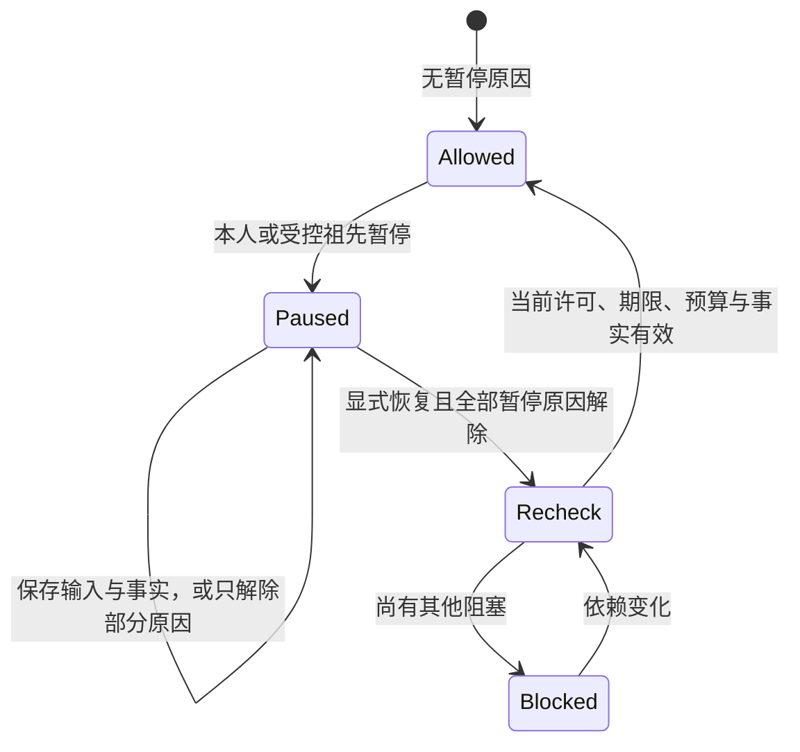

# 用户控制、预算与证据管理

[总览](README.md) · [生命周期](lifecycle.md) · [接口与存储](storage-and-interfaces.md) · [恢复与验证](recovery-and-validation.md)

本页定义已采用的动作边界暂停、显式恢复、用户预算调整及补证。整体目标改变创建新任务。命令由固定用户任务权威裁决；本地类型化入口与网关 WSS 使用相同语义，机器契约见 [task-control Schema](../endpoint-cloud-protocol/schemas/task-control.schema.json)。设计已定义，运行实现与故障证据仍待交付。

[完整消息示例](../endpoint-cloud-protocol/examples/core-domain-flow.json)串联目录、大脑、执行与任务控制，含正常恢复、修订冲突和取消恢复缺口。内容摘要和证明为结构夹具；它们不代表实际字节、签名或运行效果已获验证。

## 1. 暂停作用于推进资格

暂停关闭本任务及受控内部子树的新决策、目标派发和正常完成资格。它不取消任务、不撤销效果、不冻结时间。取消、任务到期、当前授权变化、事实保存、必要收尾与既有结果交接继续按各自条件处理。已真正开始的有界执行可以结束；已经准备或发出但是否开始不明的调用保持原身份核对。处理端已知暂停且调用尚未开始时阻止 Start，不能用 `may_have_sent` 推断动作已经启动而放行。

暂停是独立控制维度：`self_paused` 保存本任务的用户暂停，`paused_by` 保存受控祖先的暂停原因。任一原因存在即限制推进。父恢复只移除相应祖先原因，不清除子任务自己的暂停、取消、期限、撤权或设备接管。暂停投影的 `revision` 只随控制变化递增；任务 `revision` 仍反映全部正式变化。控制变化同时推进 `decision_revision`，旧生成不能在恢复后重新准入。

下图的建模对象是一个任务的有效暂停条件；终态及效果核对另行记录。连线表示持久控制变化或恢复后的重新检查。

暂停与派发准备、成功完成的提交串行裁决。完成先提交则保持终态并拒绝改变其推进控制；暂停先提交则即使证据齐备也等待显式恢复，不能只为完成而发起新模型调用。已准入但未准备的目标操作保留固定映射和预算，等待恢复，不另建替代操作；恢复须重验其前提，已失效项封闭后才可重新规划。

在途模型的旧轮关闭；可用的停止接口尽力停止，未知费用与物理占位保留。恢复开启新轮，旧输出只作为获准诊断和账务事实，不直接复用为新轮提案。暂停时用户可以回答仍有效的输入、查看获准中间成果和提交补证；输入消费、证据接纳或增加预算都不移除暂停原因。输入期限仍按原绝对截止处理。

内部父子任务共用用户写权威。暂停先保存祖先控制切点，后继动作的门禁立即读取全部有效祖先原因；对子任务的投影和通知可有界展开，不能在展开期间放行遗漏子任务。尚未接纳的委派同样检查祖先切点，已接纳但迟到发现的子任务继承原暂停。跨端处理依[协作控制合同](../coordination-and-cloud/peer-contracts.md)传播，接收方未确认前保留传播缺口；暂停答复不承诺远端物理静止。

外部独立 Agent 只有声明并验证暂停能力时才能承诺协同暂停；其余委派列入 `external_unpaused`，仍按原合同执行、回送和核对，不能声称全树已停。需要中断外部工作的用户可另发取消；暂停命令不隐含取消。

## 2. 调额不改变已经承担的成本

金额与用量复用 domain-common 的单金额／累计用量定义。任务账户把每个维度分为 target_limit 与 cleanup_limit，分别映射原用途（goal／extraction／evaluation）和 recovery，不能按不同用途重复预留同一费用。cost 明确 currency 与 scale，所有值是该货币 10^-scale 单位的整数；币种／刻度不一致不能直接相加，不隐式换汇或换算刻度。unit 使用公共单金额定义的相同值与长度限制。

每维度 mode 为 hard 或 estimated，只有处理端能落实该维度上限时才可声明 hard。allocation.mode 是各维度保证的确定汇总：amounts 全为 hard 时为 hard，任一项为 estimated 时为 estimated。处理端缺少某维度硬限制时，该项和汇总一并降为 estimated，不能保留全 hard 的条目再仅修改汇总。映射到单用途公共 budget 时沿用该汇总模式，不提升保证；可信账单本身不证明硬限制成立。

usage_item 仅包装 allocation_id、target／cleanup 归属和公共 usage 值。累计项去重身份为 `(原调用, source_endpoint, item_id)`，首次保存时固定 allocation_id、purpose、dimension、unit 及 cost 的 currency／scale；后续修订改变任一绑定都作为冲突，不另开一条账绕过原项。结算桶按 `(allocation_id, purpose, dimension, unit, currency, scale)` 区分，非 cost 的末两项不适用；余额、预留与用量须匹配同一完整单位才可计算增量。

父委派聚合与子叶用量只进入一个根预算扣减路径。task.query／status 的 budget 投影提供预算修订、完整限额和已结算／预留余额，用户据此调额；权威仍在提交时复核，不能信 UI 计算。

用户可以调整本方根任务及受控内部子任务份额。核心先核对预期预算修订和当前账本，再共同保存新限额、内部份额分配和命令答复。预算维度与整数单位保持固定；请求提供完整新目标／收尾限额，同一维度不得重复。重复原命令返回固定原答复，新的并发命令按修订冲突拒绝后重读。

| 变化 | 核心裁决 | 不能改变的事实 |
| --- | --- | --- |
| 增加根额度 | 当前本人权限、用户可用总额和资源约束满足才批准；预算等待可重新检查 | 暂停、期限、授权范围、已终态任务不因此恢复 |
| 降低额度 | 新限额覆盖已结算与仍承担的全部预留；可先封闭并释放可证明未用的责任，否则拒绝并返回可调整下限 | 未知账单、已派发操作和未封账子份额不能清零 |
| 调整内部子份额 | 父已预留份额与子限制在同一提交域调整；父子聚合不双计 | 子任务自己的暂停、许可与已承担支出不被父调整覆盖 |
| 外部委派需要更多额度 | 原委派上限保持固定；核清原工作并按安全新尝试条件建立新的受信委派 | 不修改原 D，不新建外部动态调额协议，不并行重做未知效果 |
| 终态仍有核对责任 | 仅允许追加原责任的收尾额度，并形成明确限额／期限 | 不追加目标额度、不重开终态、不延长旧操作或许可 |

主动调额改变任务约束，推进决策基线；普通用量结算仍沿[两类修订](decision-and-work.md#decision-version)处理。目标与收尾各自有限，降低目标额度不自动借用收尾，追加收尾也不授予新的读取或执行权限。暂停、恢复、调额均不修改任务、输入、调用、许可或批准的绝对截止。

## 3. 补证先接纳材料，再核验事实

`task.submit_evidence` 绑定原任务、条件版本、原操作、获准材料及固定验证器。核心持久保存候选与验证责任后返回 accepted，不能返回“任务已成功”。同命令重投复用材料及责任，异内容冲突。`task.evidence_result` 固定该次验证的 verified／invalid／unavailable 结果，`task.query_evidence` 在交付窗口之外恢复原结果；暂未结束明确返回 pending。

执行效果材料交原执行权威按准确声明核验；任务条件材料由已固定验证器核验。用户文字、手填状态或无关联图片都不是可信执行效果。材料引用必须先按[内容交接](../content-and-provenance.md#publication)保存并取得当前来源／保留依据。缺少原调用、允许生产者、条件版本或权限时保留明确缺口，不通过人工输入绕过判据。

暂停中可以保存材料并运行已有事实上的本地有界核验；需要新外部观察、付费评估或模型生成时，登记受阻目标责任，显式恢复后才可派发。已经获准的原操作收尾核对继续按其独立权限与额度运行。核验通过只增加正式事实；核心仍按原目标全部条件裁决，暂停时不得正常完成，终态也不得复活。条件或来源后来变化使验证不再适用时保留原验证结果并重新检查适用性，不篡改历史答复。

## 4. 原命令、固定答复与当前视图

所有管理变更使用受信用户作用域内唯一操作身份，保存不可变意图、前置修订、裁决及后续责任。读取先核验当前身份与披露权，再返回原回执；原成功回执不重新授予行动资格。提交未知保持原键查询，不换号。无保留权限或材料已清理时返回恢复缺口，不能从当前状态补造原结果。

| 消息 | 成功含义与恢复入口 |
| --- | --- |
| `task.pause`／`task.resume` | completed 表示本权威控制已持久应用；原命令通过 `task.query_operation.control_result` 恢复，当前控制看 task.query |
| `task.adjust_budget` | completed 表示本权威预算及内部份额已共同提交；原答复同样用 query_operation 恢复 |
| `task.submit_evidence`／`task.evidence_result`／`task.query_evidence` | accepted 为材料与责任接纳；原验证结果可单独恢复，不等于任务完成 |
| `task.query_cancel` | 返回指定取消操作的完整固定 task.cancel_result 及保留边界；不返回后来重建的结果 |

取消答复尚未固定返回 precondition_failed；已清理或无恢复依据返回 recovery_gap；无读取权先拒绝，不暴露其他用户对象。执行取消答复由 `execution.query_cancel` 单独恢复，不能由任务当前状态或协作接纳回执代替。固定结果与后来效果分别保存，迟到成功可能澄清 `effects_pending`，不会改写原取消结果。
