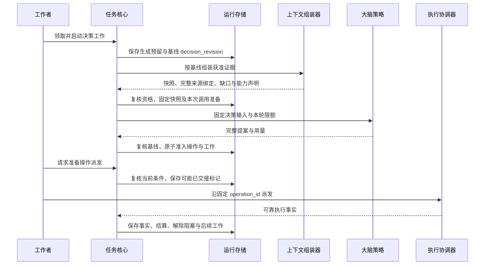
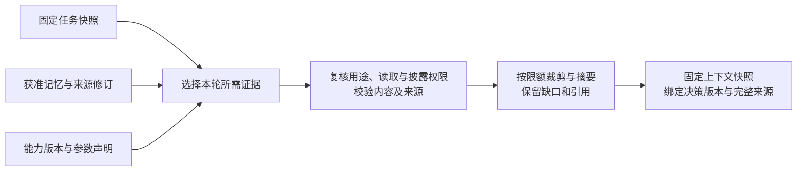
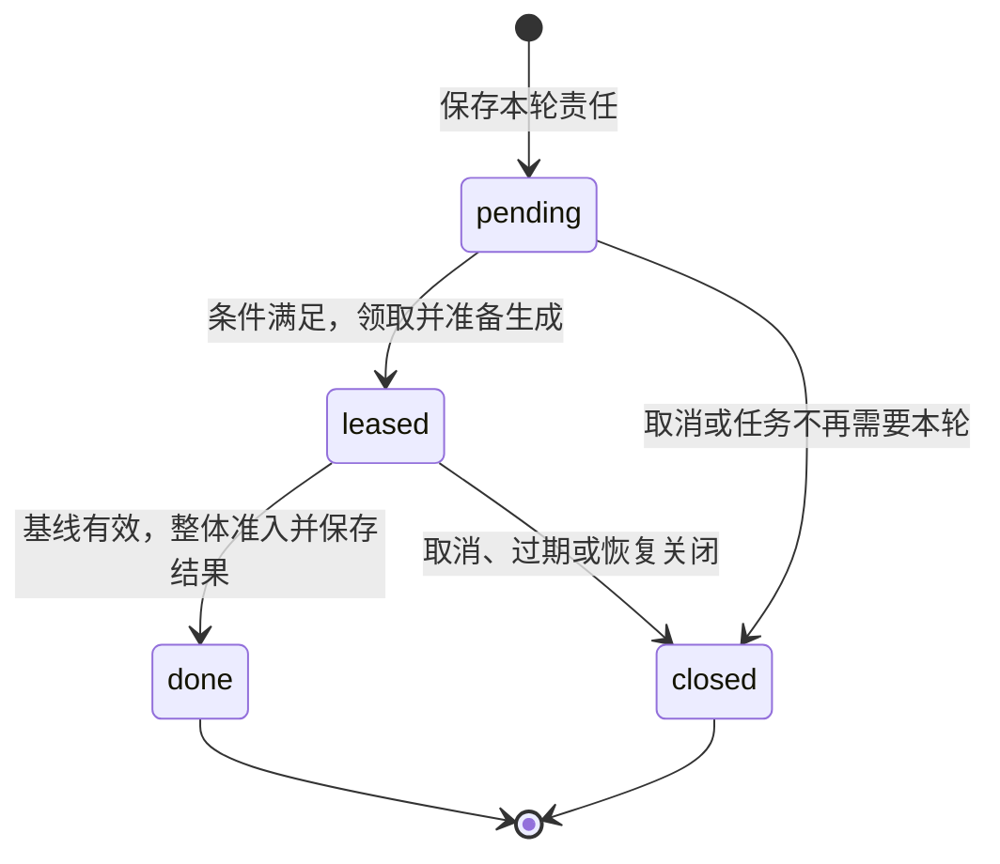

# 上下文、决策与工作推进

[总览](README.md) · [生命周期](lifecycle.md) · [接口与存储](storage-and-interfaces.md)

## 1. 一轮推进的提交点

图表示一轮决策产生操作、操作结果再次唤醒决策；各个运行存储提交点是短事务，其他调用均在事务外。

计划文字、流式模型片段和临时执行进度不进入正式状态裁决。决策结果必须是完整结构，获准后才能转成工作。内核不恢复模型的隐含推理，只恢复持久输入、准入结果和既有责任。

## 2. 上下文组装与来源复核

组装器接受任务一致快照、当前决策身份、用途、可用额度和内容策略。任务事实来自运行存储；记忆和能力声明通过获准接口读取。返回的快照包含目标与约束、已确认事实、未知事项、未消费输入、相关记忆、能力声明、验收规则及内容缺口，并标明各项版本或获取时点。

快照同时保存 `source_bindings`：组装器实际提供给大脑的全部来源、用途和权限证明绑定。摘要及复用计划是派生内容，其绑定递归包含原始来源；裁剪正文或省略引用不能删除这条关系。组装器无法确认来源完整的资料不进入快照，缺失的必要资料作为阻塞原因返回。

| 信息 | 处理规则 | 发生变化时 |
| --- | --- | --- |
| 任务输入与操作事实 | 标明来源、关联操作、可信度与未知项；只读入获准字段 | 改变业务结论的事实使决策版本过期；纯账务变化单独处理，见[版本规则](#decision-version) |
| 记忆与检索内容 | 保留来源、修订、用途及获取时间；区分事实、偏好和推断 | 删除、撤权或修订失效时重新核对；不能把缓存作为继续使用依据 |
| 能力候选 | 检索候选只用于选择，调用前取得准确能力版本、参数和效果语义 | 声明失效或必需能力不在本端可用时等待或重新决策 |
| 大内容 | 先核对访问权、摘要、保留期，再在上下文限额内提取必要内容 | 内容缺失不能以“有引用”填补；派发或完成前再核验所需引用 |
| 摘要与复用计划 | 保存原来源闭包、生成版本和获准用途，明确为派生内容 | 不能提升原证据强度，也不能掩盖冲突、未知效果或原来源撤权 |

预算不足先保留目标、控制约束、必要事实和未决风险，再裁剪可选记忆；必要材料仍放不下时返回明确缺口，禁止静默截断动作参数或验收依据。检索、模型输入、摘要保存和跨端披露分别授权，读取并不意味着长期保存。

生成结果继承快照的全部来源绑定，任务核心负责把绑定复制到后续操作、保存计划和输出责任。模型声明的引用只用于解释，不能缩小权限依赖集合。例如模型读过私密资料 M 与公开资料 P，即使只引用 P，生成参数仍受 M 的用途和披露权限约束。

复核有三个位置：交给大脑前检查模型输入用途；提案准入前检查保存与候选行动用途；派发、发布或跨端交接前检查当前行动及接收方的披露用途。准入之后发生撤权，仍可阻止尚未交接的参数或结果；已经发生的读取、执行和披露不能由内核追溯撤回。接收模块还须落实自己的行动前检查。

权限证明须绑定来源版本、用途、接收方和有效期。对要求实时确认的资料，无法取得符合策略的新证明就等待。跨模块没有分布式快照或瞬时撤权保证。持久化原文、摘要及来源元数据本身也受数据策略约束；不能合法保存恢复所需绑定时，该资料不能用于可恢复行动。

全输入继承会使未被模型实质使用的资料也限制输出。组装器按本轮需要控制输入范围；大脑不能自行删减来源绑定。

## 3. 决策版本与推进时机

`Task.revision` 表示对外任务快照的版本；`Task.decision_revision` 是内部决策语义版本。`decide` 工作保存 `base_decision_revision`；长时间生成绑定这个基线，短事务读取最新 `revision` 并用当前值执行条件提交。两者都由任务核心在同一事务中维护，分类规则随核心版本固定，不能由提案声称“未依赖这条事实”来跳过。

每次变更按下表从上到下分类，命中后不再采用后续类别；同一事务包含多项变更时取影响最大的类别。重复报告须先去重，再判定是否产生实际变化。

| 类别 | 变化 | `revision` | `decision_revision` |
| --- | --- | --- | --- |
| 决策语义变化 | 已接纳输入、目标或约束、用户主动调额、暂停／恢复、控制权或控制状态、终态；已准入 Operation 集合或下一步必要业务条件变化；已确认的策略／验收规则／相关权限变化；改变操作业务结论、证据有效性或冲突状态的正式事实 | 推进 | 推进 |
| 账务或快照记录变化 | 纯用量结算、预留变化、对外任务快照中的交付或同义证据记录变化；业务结论及上述条件均未变化 | 推进 | 不变 |
| 内部维护或无变化 | 领取、续租、心跳、纯消息交接凭据、临时进度、重复消息；均未改变对外任务快照 | 不变 | 不变 |

纯账单可以使剩余预算减少，但不使已生成的提案自动过期。准入使用当前账本核对本轮结算和新行动预留；不足则拒绝新行动并保存后续责任。若账单处理同时作出终止任务等控制决定，则按第一类推进两个版本。

消息交接凭据只说明交接责任已转移。新的业务 `accepted/rejected`、执行效果或冲突证据按第一类处理；含义相同的再报告不使决策过期，只有增加了对外可见记录时才推进 `revision`。任务策略与验收规则默认固定；只有既有契约允许的获准变更才能替换，大脑提案无权自行修改。

调度采用以下规则减少可避免的重复生成：

1. 事实照常入库；核心将同次提交的用量和条件变化一起保存，只登记一条后续 `decide` 责任。首次事实唤醒为后续工作固定有限的合并窗口 `not_before`，后续唤醒不延后该时间；到期处理有界批量并重新检查条件。取消与权限收紧立即生效，不等待合并窗口。
2. 上一批行动仍有下一步必需的结果未确定时，把这些已知依赖保存到后续工作的 blockers。只有条件成立、明确失败或到期需要处置时，才启动下一轮；临时进度不触发生成。
3. 旧轮因业务事实过期时，关闭旧工作，先重新检查已接纳行动的必要依赖，再决定解除阻塞或继续等待。不能在相同缺口未变化时连续创建可领取的新轮。

规则依赖有界行动批次、有限预算和明确的条件到期策略。若必要依赖最终收敛，且存在足够完成一轮生成与准入的业务事实稳定时间，任务可以继续推进；如果外部证据持续冲突或控制要求不断变化，内核只保证有限消耗和可解释的等待／失败，不保证完成。退避用于限制资源消耗，不能替代上述进展条件。

## 4. 大脑提案及整体准入

每任务至多一条未结束的 `decide` 工作，以 `work_id` 标识一轮决策。工作保存生成预留、大脑／模型配置、上下文策略、验收规则版本及 `base_decision_revision`。`claim_epoch` 只隔离工作者，不代表新一轮决策；登记快照和续租不改基线。

提案只有行动、等待和结束三类；执行调用与任务委派是行动项的两种内容，可以同批准入。结束提案不能同时新建目标行动。

| `kind` | 内容 | 准入结果 |
| --- | --- | --- |
| `act` | 有界、当前可开始的行动项。invoke：能力版本、参数、目标及期限；delegate：子目标、约束、结果条件、端点及收缩权限。各项带局部键、预算上限及必要事实依据 | 生成固定操作映射、预留及派发工作；委派项另保存父子关联，子任务不得改写父状态 |
| `wait` | 一个或多个输入／依赖条件，含关联对象、唤醒来源及到期策略 | 把条件保存到后续 `decide` 工作的 blockers；按需创建输入请求，不占工作者槽位 |
| `finish` | `completed` 或 `failed` 建议、摘要、成果引用、逐项验收依据 | 通过生命周期核验后提交终态；缺证据则不宣布成功 |

验收条件集以 `draft/fixed` 状态进入决策输入。`draft` 时核心只允许等待澄清、策略明确列出的只读取证，以及失败结束；仅靠大脑把动作称为“取证”不能放行。固定条件的提交推进 `decision_revision`，目标行动在后续轮次中准入。

`act` 只准入前提已满足、参数已确定且可独立开始的并行批次。串行步骤在前驱事实入库后再次调用大脑策略；策略可以依据保存的计划直接返回下一批，不要求每步重新调用模型。尚未满足的条件保存在阻塞工作中；未来行动尚无操作身份或预算预留。单轮操作数和并发数均受[有限配置](storage-and-interfaces.md#limits)约束。

当前行动保存必要事实引用、判据及适用版本，仅可引用本任务或已建立委派关联的事实。例如读回行动依据保存成功准入后，若派发前出现该证据的冲突，就应阻止读回并重新核对。

可复用计划作为获准数据保存在任务或决策快照中，连同完整来源绑定保存。恢复时依据已提交操作映射和正式事实选下一批，不能依赖进程内游标。计划文字不直接派发；缺少获准持久计划时，从目标与事实重新决策，不承诺免去模型调用。

准入按下列顺序执行；外部证明先在事务外取得，在事务内核对其绑定与有效性：

1. 校验完整提案结构、版本、限额及引用；按验收条件集状态限制行动，行动前提须已满足，不接受任意可执行代码作为能力参数。
2. 核验该 `decide` 工作仍由生成时的有效领取持有、控制方及 `owner_epoch` 匹配、当前 `decision_revision` 等于 `base_decision_revision`。读取最新任务 `revision` 作为本次短事务的条件提交版本。
3. 分别检查有效暂停原因、授权、数据用途、准确能力声明、期限及预算。暂停中禁止新目标提案及正常完成；事实与收尾独立处理。预算按本次变更中“本轮可信结算后，再加入新行动预留”的结果账本计算，未知部分仍占额。
4. 在同一事务内结算本轮尚未入账的已知用量、分配操作身份、固定局部键映射、预留资源、保存后续工作／输入请求／结果，并将本轮工作置为 `done`、保存准入结果。独立账单已经入账的部分不重复结算；任一项失败则整份提案不产生新操作。

决策版本冲突时返回内部 `stale_proposal` 并登记下一轮责任。仅短事务 `revision` 冲突时，重新读取当前账本与条件后重试准入；决策基线仍有效就不重新生成。确定未提交后才增加有限的准入步骤尝试号，提交未知保持原键核对，见[提交回执](storage-and-interfaces.md#commit)。已发生的模型用量独立幂等结算，不因准入失败消失。

上下文无法组装，或准入因权限、能力、预算等前提失败时，任务核心将本轮工作置为 `closed`，结算已知用量、保留未知预留，并保存带明确阻塞条件／退避时间的新工作或明确失败。基线过期同样结束旧工作并登记新轮责任；重新调度遵循上一节的必要依赖规则。

### 同一轮中的有限结构修复

一轮可包含首次生成及配置上限内的结构修复。每次物理模型调用使用持久身份 `(work_id, attempt_no)`，`attempt_no` 只在核心确认上一调用已结束、用量确定、输出已保存且需要结构修复时递增。原工作者还须持有有效领取，并有足够的剩余额度。结构修复沿用固定快照、来源绑定和决策基线；资料或语义变化须关闭旧轮，不能借修复开启另一轮决策。

组装完成登记快照及每次调用准备时，核心重新检查控制方／owner_epoch、有效领取、决策版本，以及完整来源证明的绑定与有效性。过期则关闭旧轮，不启动模型。获准后在短事务中保存该次输入版本及内容引用、输出格式要求、调用身份、额度上限及 `call_prepared` 标记，并从本轮预留中划定该次额度。

原文按数据保留策略保存。确认提交后，原工作者才能调用模型；标记意味着恢复时须按“可能已启动”处理。本节调用用于生成和结构修复；远程语义评估按[验收契约](storage-and-interfaces.md#acceptance-contract)走普通操作，结果入库后再提出 finish。

准备提交响应丢失时核对原提交。进程重启或调用结果未知时保留该次占用并关闭旧轮，不重发同一调用，也不在同一轮递增尝试号。外部用量可能仍未知；新轮次使用独立预留，原工作者不能凭新领取身份继续旧轮。

用量按调用身份和用量项去重。已结束调用的可信结算将其预留转为已用，只有可证明未用的部分才可供本轮下一尝试使用。工作关闭后的迟到账单仍按原调用结算；原调用未知占用不能转给新轮。修复次数、总预留或时间上限达到后，保存明确失败或等待责任。

### 决策工作状态与恢复

图的对象是同一条 `decide` 工作，不表示物理模型调用是否结束。正常准入与恢复关闭竞争该工作：原准入已提交则采用其操作映射；关闭先提交则旧输出永远不能准入。回执查找先于资格检查，使成功重试仍返回原结果。

租约过期后，恢复领取只能核对原准入或关闭旧工作，不能继续同一轮的首次生成或结构修复。关闭事务保留原调用的未知占用，同时创建下一条工作或条件等待；再次生成必须新 `work_id`。旧调用迟到时只结算用量和保存诊断，不恢复旧工作。有效决策数和用户实际模型并发分别限制，不能用关闭工作绕过物理调用上限。

## 5. 领取与派发分别判定

工作状态表示内核责任：`pending`（等待领取）、`leased`（一次有限领取）、`done`（本项责任已完成）、`closed`（后续推进已关闭）。条件直接保存在 `Work.blockers`，另有 `not_before`；条件未齐的 pending 工作不可领取。关闭工作不表示其曾发起的调用已经停止，关联操作、用量和处置责任继续保留。

`Work` 保存领取、到期和恢复所需的调度字段。恢复入口按 `kind` 执行对应的合法步骤和完成条件：发送工作可重交固定消息，过期的决策工作只能关闭旧轮。

| 工作类型 | 有限步骤与完成点 | 受暂停／取消／冻结影响 |
| --- | --- | --- |
| `decide` | 组装、有限生成尝试、准入或关闭一轮决策工作 | 禁止新轮次；在途轮次不能准入 |
| `dispatch` | 原子准备，再交给目标模块或消息交付，保存交接依据 | 未准备项关闭／阻断；已准备项核对原操作 |
| `reconcile` | 查询一个原操作，保存事实及下一次核对时间 | 允许有限核对；仍检查查询权限与收尾额度 |
| `control` | 交接固定暂停／恢复／取消控制，保存结果或后续核对 | 不受目标预算耗尽阻断，仍按权限执行 |
| `publish` | 交接已提交的答复、状态或结果 | 允许必要发布；披露权限失效则记录交付缺口 |

消息交付保存入站消息及待处理责任，并重入任务核心直到业务提交得到确认，见[两处持久交接边界](../endpoint-cloud-protocol/message-contract.md#1-两处持久交接边界)。任务核心事务失败不标记入站已处理。

任务核心收到事实后，复核引用该对象的工作条件。事实满足条件则解除阻塞；已确认失败或到期使条件不可能满足时，按保存的策略结束等待并重新决策或失败。效果未知继续核对。条件包含关联对象及适用版本，旧唤醒通知不能解除新条件。

发送内容直接保存在承担交接的 `dispatch/control/publish` 工作中：消息身份、来源、目标、固定内容、完整来源绑定及期限。业务变化与这条工作共同提交；消息模块持久接纳后该工作进入 done 并保存凭据。交接确认丢失时重交原消息；重交前仍检查当前披露许可，撤权不允许重投敏感内容时只核对交接结果并记录缺口。

调度器按用户轮转，再在用户内按控制／核对与目标工作分配有界份额；工作领取通过条件更新递增 `claim_epoch`，保存领取者与 `lease_until`。更新任务的工作还须持有任务当前权威，领取不能转移控制权。长时间网络等待释放线程或工作槽，续租有上限；租约以存储权威的时间判定，客户端时钟不裁决有效性。

先扫描出候选，再以已知 work_id、预期旧代次、固定领取者及下一代次执行条件领取，使领取响应丢失后仍能重建原提交键。结果未知时核对此次领取，不再领取另一条工作。续租固定本次序号和绝对 lease_until，原样重试不延长租约；两种情况均不靠临时分配新标识恢复。

| 检查 | 准入时 | 派发准备时／处理端 |
| --- | --- | --- |
| 用户、任务控制方与控制状态 | 判断谁可创建后续工作 | 当前控制方未冻结、未取消；处理端核验 `owner_epoch` |
| 行动前提 | 所依赖的正式事实已满足要求 | 相关事实仍适用；例如“执行结束”不能替代“效果确认” |
| 授权与数据用途 | 获准范围覆盖候选行动及快照的完整来源绑定 | 当前许可覆盖行动及接收方披露；执行端行动前落实，不能只信内核已检查 |
| 能力与输入 | 固定准确版本、参数及内容引用 | 实例仍支持原版本，内容仍可用；不能静默切到新能力语义 |
| 期限 | 保存任务期限、操作启动期限 | 两者均未阻止新启动；重投不延长期限 |
| 预算与并发 | 预留有限上限 | 原预留未释放，有可用并发资格，不重复预留 |
| 恢复条件 | 不准入尚未核清的冲突工作 | 对应作用域已经核对；流 `ready` 本身不足以放行 |

## 6. 持久派发与原操作反馈

每个已准入操作从 `unprepared` 开始。派发准备事务与取消／冻结竞争任务记录，成功时固定目标端点、操作身份、请求内容和发送责任，将其变成 `may_have_sent`。这两个内部阶段只表示是否可能跨出内核，不代替执行端 `accepted/running/stopped/finished` 状态。

只有准备提交耐久确认，工作者才可交接。交接超时沿原身份核对；`may_have_sent` 不退回 `unprepared`。控制未变化且交付恢复规则允许时可重投原消息；取消或冻结后不再主动恢复旧目标派发，已在消息交付或执行端的责任通过控制同步和原操作查询收束。

派发内容包含现有协议所需的 `task_id`、`owner_epoch`、能力名称／版本及参数，权限和启动期限放公共信封。内核保存执行端原始事实及其出处，任务中的操作摘要只是投影，不能反向改写执行账本。

可靠 `invoke/cancel` 响应也进入事实处理：按 `reply_to` 和 `operation_id` 绑定原请求，区分消息持久交付与业务 `accepted/rejected`。业务已接纳则跟踪原操作；权威明确拒绝首次接纳且可以排除启动时，关闭该次派发、释放确定未用额度并处理后继，不等待一个不会产生的 result。恢复查询或重投因当前权限、期限被拒绝，只能证明这次请求被拒，不能消除原操作已发生的可能。

### 按执行权威修订合并事实

执行 fact／result／query 携带 `producer_endpoint`、原 operation_id 和 `fact_revision`，查询返回该切点的完整投影；事实修订归原执行权威，不使用 stream seq。原 result 仍为固定历史答复，后来效果以新 fact 和当前 query 表达，完整规则见[执行跨端契约](../capability-and-execution/remote-contracts.md#facts)。

| 情况 | 内核处理 |
| --- | --- |
| 原消息或同修订同内容重复 | 去重；不重复结算或唤醒 |
| 低修订晚到 | 保留必要出处，不覆盖当前投影；其中独立用量仍按其用量身份核对 |
| 更高完整投影 | 核验同一生产者、原意图、合法状态演进与证据关系后更新；无需收齐中间事实才能恢复 |
| 同修订异内容、已知权威证据冲突 | 保存冲突并阻断依赖，查询原执行权威；更高数字不自动消除证据矛盾 |
| 查询切点仍无法解释冲突或生产者改变 | 保留恢复缺口，不因新连接、消息序号或接收时间选择胜者 |

确认外部效果以能力声明和执行权威证据为依据。`execution=failed,effect=unknown` 继续核对；`not_observed` 只有在该能力的权威核验能证明无效果时，才支持新业务尝试。重试需要结束或隔离原执行继续发生效果的可能，并重新检查权限、期限和预算；建立新操作时保存 `retry_of`，不能覆盖原记录。相同意图的安全幂等恢复优先沿原操作进行。

## 7. 预算、委派与可观测性

每个预算维度保存 `limit`、`settled`、`reserved`；可分配量为 `limit - settled - reserved`。预留覆盖尚未结算和用量未知的部分，结算后原子转为已用并释放可证明未用的余额。计费单位使用整数最小单位，时间期限单独判定。外部供应方无法提供或落实消费上限时，只能声明估算预算；要求硬上限的任务拒绝该能力，不能把本地计数当作外部费用保证。

预算账本中的预留标注目标／收尾用途。每个维度配置有限收尾额度 R 和总限额 L（R ≤ L），目标工作已用与预留不超过 L−R，收尾已用与预留不超过 R，二者合计不超过 L。目标额度耗尽不阻止使用尚有余额的收尾额度；追加或降低额度沿[预算管理](control-and-management.md#budget)取得本人批准并核对当前预留，不能自动借用收尾余额；调额不解除暂停、不延长期限。

用量按 `(调用标识, source_endpoint, item_id)` 去重；累计报告只补记已验证的增量。每项固定分配、用途和完整单位，cost 包括 currency／scale；结算桶与汇总保证沿[预算管理](control-and-management.md#budget)定义。执行 observation／query 中的可信累计用量与 execution.usage 使用相同用量身份；生产者修订及封账依据不成立时保留预留并限制继续行动。过期、取消、决策工作关闭和任务终态均不自动释放未知预留。

内部 Agent 经本地协作入口或 CO-P1 远程交接，向同一固定用户任务权威请求受信子接纳。父任务先保存固定委派和预算预留；核心创建子任务时，在同一提交域固定受限子配置及对应父子份额。远程 Peer 保存原 D／C／S 的交接责任，远程 Brain 只执行单轮调用，二者都不另建任务或父子预算写权威。子任务只能消费分配份额；根预算在委派聚合和子叶用量中选择一个扣减路径，不重复累计同一调用。

取消父任务建立对子任务的取消责任；子结果作为父任务输入，父核心独立裁决。外部独立 Agent 沿自身运行时接纳原委派，父预留在明确拒绝或可信结算前不释放；原额度不原地修改，追加须核清旧责任并建立新的受信委派。缺少收缩授权、预算或结果契约的外部 Agent 不作为可派发能力，见[委派交接](../coordination-and-cloud/peer-contracts.md#interfaces)与[提供方依赖](recovery-and-validation.md#gaps)。

运行观测只消费获准的提交后记录：任务／操作／决策／工作关联、各提交耗时、等待原因、预算与恢复缺口。观测故障不得阻断业务事务，观测数据也不能作为重建权威状态的唯一来源；敏感正文、凭证和模型隐含推理不进入默认日志。
