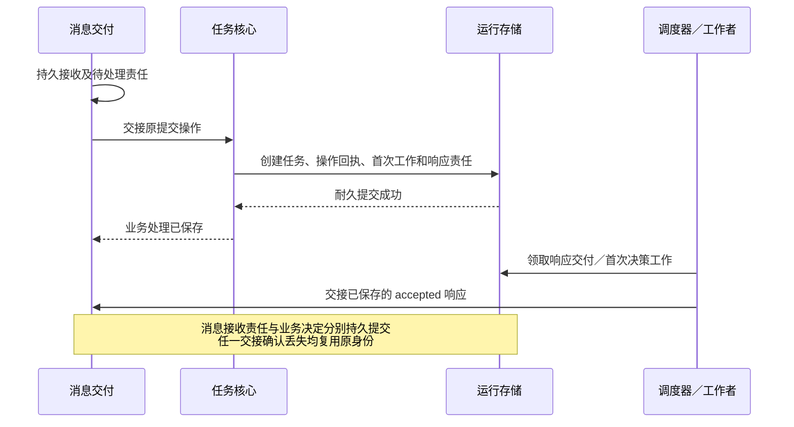
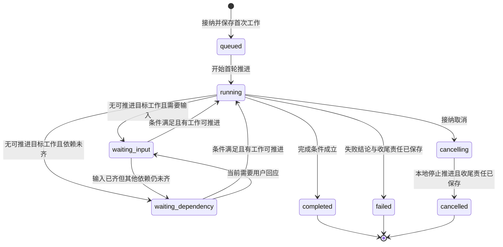
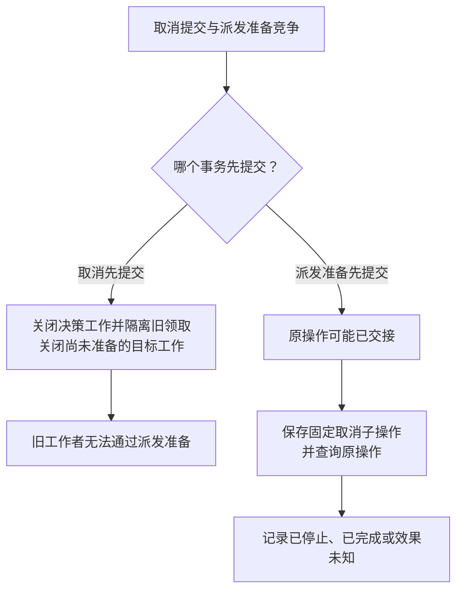

# 生命周期与用户控制

[总览](README.md) · [决策与工作](decision-and-work.md) · [接口与存储](storage-and-interfaces.md)

## 1. 接纳建立可恢复的任务

提交入口先校验受信身份、任务创建权限、请求期限、配额和目标格式。`task_id` 由现行 `task.submit@1` 请求携带；任务预算、策略和控制方来自服务端获准配置，不能让调用方在既有载荷中附加未定义字段。

首期由受信部署配置把同一用户的任务接纳、控制及全部内核 `Operation` 唯一索引固定到一个写权威，可以位于端侧或云侧。各接纳端检查这项归属、实际请求目标及 `grant_ref`，错投不能自行创建或处理控制操作。指定存储在同一事务内约束 `(用户, task_id)` 和 `(用户, operation_id)` 唯一并绑定固定意图；后者覆盖提交、输入和取消等操作。

执行端点可以分布部署，内核写权威保持固定。跨独立存储的任务分区或控制权交接，须先补齐用户级操作身份的路由、去重与迁移契约；[控制权交接约束](recovery-and-validation.md#ownership)用于该条件能力，首期不启用。

接纳结果未知时沿原权威、原标识查询或重投；超时、断线及进程重启不改变路由。离线时指定权威本地可用且授权成立即可接纳，否则等待；已绑定任务的执行端仍可按许可离线续跑。

图中消息交付先保存消息、去重记录和待处理责任，任务核心随后保存业务决定及后续工作。两处提交及丢失确认后的重试规则见[消息契约的持久交接边界](../endpoint-cloud-protocol/message-contract.md#handoff)；入站、出站分别保存哪些记录见[消息交付存储与运行存储](storage-and-interfaces.md#delivery-store)。这是两个逻辑提交边界，不要求使用不同物理数据库；消息交付存储的完整表结构由其模块设计展开。

同一提交操作重投返回原任务；相同标识不同意图拒绝。另一个提交操作占用已有 `task_id` 返回冲突，不创建第二个任务。接纳事务未确认时不回复 `accepted`；先查原提交回执。任务创建、首次工作和接纳答复不可出现部分成功。

## 2. 任务主状态与独立维度

主状态沿用[task@1 Schema](../endpoint-cloud-protocol/schemas/task.schema.json)。下图只描述任务主状态的典型转换；取消可从任一非终态发起，期限或不可恢复失败也可从任一非终态进入 `failed`，均须先满足后文收尾条件。

| 独立维度 | 取值或记录 | 为什么不能并入主状态 |
| --- | --- | --- |
| 控制权 | `owner_endpoint`、`owner_epoch`、`active/frozen/importing` | 冻结中的任务仍可有在途效果，接收快照也不代表取得控制权 |
| 取消 | 请求操作、原因、受影响操作及传播结果 | 多次取消可关联同一控制决定，各自需要可靠答复 |
| 阻塞条件 | 后续 `Work.blockers` 中的输入、依赖、授权、预算及恢复缺口；输入请求独立保存 | 需要输入和等待效果可能同时成立，解决一个条件不自动放行其余条件 |
| 效果核对 | 每个操作的事实及开放核对责任；汇总为 `effects_pending` | 终态后仍可有未确认效果；成功时这些效果必须不影响已核验成果及任务约束 |
| 结果交付 | 每个接收方的发送、持久接收或缺口记录 | 任务计算完成与接收方可获得结果是不同事实 |

主状态按固定顺序投影：已提交终态保持；否则取消意图已生效为 `cancelling`；尚未开始且无阻塞为 `queued`；有可运行或实际在途的目标工作为 `running`；剩余情况下，有有效输入等待为 `waiting_input`，否则为 `waiting_dependency`。工作被领取但受控制阻断不算可运行。纯收尾查询不使任务变成 `running`。每项阻塞条件分别检查，`summary` 说明主要缺口。

任务公开 `revision` 在正式事实、控制、等待、预算或结果改变时递增；重复输入、纯工作续租、未改变任务快照的消息回执和观测记录不推进任务版本。内核另用 `decision_revision` 判断决策依据是否变化，具体分类见[决策版本与准入](decision-and-work.md#decision-version)。终态不再转回执行态，但迟到事实可以推进 `revision` 并更新 `effects_pending`。

## 3. 输入与等待怎样唤醒任务

等待记录在需要继续的 `Work.blockers` 中，包含条件类型、关联对象、满足判据、到期时间、唤醒来源和到期处置。等待提案结束本轮决策工作，并保存带阻塞条件的后续工作。

受阻工作不占工作者槽位。通知加速唤醒，定期扫描保证通知丢失后仍能发现到期或已满足的条件。用户输入由 `InputRequest` 保存内容约束、有效期和消费记录，工作引用该请求。

| 等待类型 | 正式满足依据 | 到期或失败后的处理 |
| --- | --- | --- |
| 用户输入 | 原 `input_request_id` 成功消费 | 关闭旧请求；按已保存策略重新决策或结束，不能把迟到输入绑到新请求 |
| 操作／子任务结果 | 指定原操作的事实满足后续决策所需条件 | 查询原操作；效果未知时保留核对责任，不视为失败已确认；事实齐备后重新决策，不提前准入受阻后继操作 |
| 权限／能力／连接 | 相应模块给出可验证的新事实 | 重新检查其他门禁；失联不改变任务控制方 |
| 预算 | 获准配置变化或可信结算释放额度 | 保存阻塞条件或按任务期限结束；不能通过新工作编号重置预算 |
| 时间 | 持久 `not_before` 已到且时钟依据有效 | 重新检查权限、控制和期限，不凭定时器直接调用工具 |

输入请求的内容、用途与有效期固定。消费事务依次核验：身份与当前权限 → 原操作去重 → 任务仍接纳输入 → 请求有效且格式正确 → 请求未被其他操作消费；随后共同保存输入、消费标记、响应和唤醒工作。同一操作返回原回应，不同操作争答只有一项成功。UI 修订不参与权威输入消费条件，进度刷新不能使有效回应失效。

确认输入仅表示这次回应被应用。需要许可时仍由授权服务签发或确认相应范围；不能把“同意”文本变为长期授权。输入材料涉及保存、披露或核验动作时分别检查权限。`task.input@1` 只返回同步 `completed` 或 `rejected`，内核不得自行加入 `accepted` 阶段。

当前 v1 没有通用目标编辑、暂停／恢复、调整预算消息。本设计不通过 `task.input` 暗中提供这些控制：输入只按原请求约定补充信息；改变整体目标默认创建新任务，并按需显式取消原任务。相关新控制须先补版本化契约。

## 4. 取消与派发竞争

取消提交和派发准备提交竞争同一任务记录。判断顺序如下，不能依据网络包到达顺序裁决。

任务核心在取消事务中共同保存取消意图、输入失效、未结束决策及尚未准备目标工作的关闭，以及在途操作／子任务的取消与核对责任。提交成功后才回复 `accepted`。旧工作者资格同时失效，不能再准入迟到提案或通过派发准备。

派发准备已经提交的操作，即使尚未实际发包，也按可能已发出处理。工作者尽力抑制未发包，内核继续核对原操作；本地未发包的观察不能证明远端未执行。

执行端的用户本地接管可以先阻止自动行动，再向内核提交事实。该能力由执行端实现，不要求用户等待云端确认。

关闭尚未准备的操作时，同一事务确认 `unprepared`、隔离旧领取并释放该操作确定未消费的行动预留；失败及完成收尾沿用此规则。`may_have_sent` 操作及未知模型用量的预留继续保留。

如果取消子操作先到而原调用尚未出现，执行端可能拒绝“未找到目标”。内核保存该拒绝并继续核对。原调用后来出现后，可在权限与收尾预算内建立新的取消尝试，关联同一任务取消和原调用；每次尝试的标识及结果固定。

只有执行端明确声明能持久保存先到的取消意图时，内核才可依赖该能力阻止后到调用；v1 本身不保证这一点。

取消到 `cancelled` 的条件是：本地不再产生或准备任何目标工作、旧工作者资格已隔离、所有可能在途项都有持久处置责任。远端失联不会无限阻止这个本地终态，但必须保留 `effects_pending=true`，说明远端是否停止尚不确定。`cancelling` 表达上述本地屏障尚未完成，不承担无限等候外部效果的含义。

| 时序 | 任务结果 | 取消操作结果 |
| --- | --- | --- |
| `completed/failed` 先提交，随后收到取消 | 保留原终态和真实结果 | 记录取消请求并返回 `already_finished`；`effects_pending` 取当前事实 |
| 取消先提交，随后收到成功执行事实 | 保存成功事实，任务进入或保持 `cancelled` | 全部受影响操作已结束且效果清楚，可为 `stopped`；不得解释为撤销既有成功效果 |
| 仍有远端运行、停止状态不明或效果缺口 | `cancelled`，保留开放处置 | `effects_unknown`，`effects_pending=true` |
| 无在途项，或在途项均结束且效果已知 | `cancelled` | `stopped`，`effects_pending=false` |

同一取消操作重投返回原答复。对已 `cancelled` 的任务发起另一取消操作，保存该操作的接纳与结果，按当前未决项返回 `stopped` 或 `effects_unknown`；复用仍开放的处置责任，不重复创建对子操作的取消。

取消事件用取消请求自己的 `operation_id`；任务最终结果沿用任务提交操作。一个取消操作只固定一次最终答复；后续核对用更高修订的任务状态表达，不悄悄改写原取消结果。取消结果超出交付窗口后的查询限制见[协议缺口](recovery-and-validation.md#gaps)。

## 5. 成果核验与终态

**验收条件**将用户目标转成可检查的要求，例如“指定文件的内容与获准交付内容一致”。任务接纳时固定受信任务策略及其验证器版本；任务策略是任务核心加载的配置与核验函数，声明支持的目标类型、必需条件和可采用的证据。首期采用有限规则，不要求核心理解所有工具的业务语义。

大脑可以从目标中提出条件候选，任务核心按固定策略，用原始目标、已确认输入和能力契约建立条件，并保存这些来源。原始文本中的对象或约束无法按策略唯一确定时，通过输入请求澄清；无法构造受支持的判据则明确告知能力边界，不准入相应目标行动。条件固定前，只能进行策略允许的澄清和只读取证。完整条件固定后才能准入目标行动，当轮提案不能删改条件或降低验证标准。

每项条件保存预期对象、目标值或效果，以及允许的证据来源；每次核验结果绑定实际成果版本和证据。以“保存到 A”为例，保存成功和读回成功还须对应 A、同一获准成果内容及相同文件版本；B 的真实成功记录不能满足此条件。核心机械检查绑定、条件覆盖和验证结果，业务效果由能力契约规定的验证器判断。验证器可以是核心内的函数，或对现有观察事实的核验规则；需要新观察时，通过普通工作取得。

开放式答案的相关性、完整性等由策略指定的语义评估器按固定标准评估，结果记录规则、证据与限制。评估器复用现有能力或策略核验函数；远程／有成本的评估走普通操作并取得正式结果，本地有界函数可随核心核验执行，具体交接见[验收契约](storage-and-interfaces.md#acceptance-contract)。模型评估的 `pass` 只提供该评估方法声明的质量保证，严格的路径、权限、内容版本及副作用条件仍须取得相应事实证据。

若任务要求的保证超出评估方法能力，应澄清或结束为证据不足。V1／V2 的质量目标仍需实测，不能由一次语义评估通过推出。

核验返回值与任务主状态分开：

| 核验结果 | 含义 | 后续处理 |
| --- | --- | --- |
| `pass` | 指定版本成果满足该条件，证据和规则均适用 | 纳入完成检查；成果、来源许可或相关事实变化后重新核验 |
| `fail` | 已有证据证明条件不成立 | 在预算、期限和权限内修复并重新核验；不可修复才结束任务 |
| `unknown` | 缺少证据、目标绑定有歧义或验证暂不可用 | 请求输入、补充观察或等待；耗尽可用条件后以证据不足结束，不能视作通过 |

大脑提出成功的 `finish` 时引用固定条件、证据及已有验证结果。核心运行尚需执行的本地有界规则，并按[现行协议](../endpoint-cloud-protocol/task-and-ui.md#lifecycle)检查全部必需条件为 `pass`，再复核以下完成门禁；需要外部验证时先走普通操作，不在本次准入中完成。条件及验证结果的最小记录见[验收契约](storage-and-interfaces.md#acceptance-contract)。

| 核验项 | 成功依据 | 缺口处理 |
| --- | --- | --- |
| 目标与约束 | 固定条件全部覆盖；验证结果来自策略指定的验证器，并绑定本次成果及适用证据 | 缺条件、绑定不符或结果过期时继续核验；模型自行声明通过不构成验证结果 |
| 操作与依赖 | 所需操作已结束；能力声明所要求的效果证据成立 | `finished`、`executed`、`not_observed` 均不能单独证明业务成功 |
| 成果内容及来源 | 所需内容可获准读取、摘要有效、保留期满足交付策略；组装器记录的完整输入来源及用途闭包仍允许本次保存和披露 | 资料撤权、来源关系缺失或无法取得所需证明时等待或重新生成；不能由模型删减引用绕过来源复核 |
| 子任务与并行分支 | 必需结果齐备；其他未决项不会改变成果或违反约束，且处置责任与缺口已保存 | 缺少不影响目标的依据则继续等待；符合条件的未决项保留 `effects_pending=true`，不忽略支路 |
| 正式发布 | 结果记录和全部必要交付工作能同事务保存 | 提交未知先核对；不先显示“已完成”再补持久化 |

影响目标完成判断的效果必须确认，本任务及必需子任务不能还有会改变成果或违反任务约束的在途行动。其他未决项只有在能力语义及已有证据足以证明其不会影响上述结论、已保存有限取消／核对责任并明确披露缺口时，才不阻止成功；此时 `completed` 可以同时带 `effects_pending=true`。无法证明不影响目标，就仍是完成前的必要条件。

问答完成至少要求正式答案、必要来源及约定的语义评估结果已形成。GUI 任务须包含执行后的观察及能力约定的效果核验，单次点击返回成功不构成完成证据。来源许可的复核采用[组装器保存的完整来源集合](decision-and-work.md#context)，包括复用摘要、计划和历史生成内容的来源。

例如答案已有足够证据，额外只读检索的返回丢失；如果该分支不再影响答案及任务约束，可在披露缺口、保存取消与核对责任后完成。仍可能写入交付文件的并行分支则必须先核清或可靠隔离，不能把它标为“非关键”绕过核验。

任一终态都关闭其他未完成目标工作、阻止新的目标派发，并保留既有取消、核对、用量结算与交付责任。失败与取消不要求目标达成，允许保留影响目标的未知效果。失败原因区分目标不可达、期限耗尽、能力缺失和证据不足；暂时容量不足或依赖失联通常等待，不自动标成任务失败。

默认 `completed` 表示任务成果已经核验并可靠保存待交付，不承诺对端已读。如果目标明确要求“送达指定端点”，应将指定端点的持久接纳／内容可用证据建为完成前依赖；UI 的渲染和人类已读没有对应证据时不得承诺。结果交付不会反向等待自己的 `task.result`，从而避免完成与结果事件互相依赖。

终态时固定一份 `task.result`，将完整正式结果、固定消息及内容引用与终态共同提交。发送 Work 承担交付，任务权威另按业务与内容保留策略维护完整结果的查询依据；发送载荷清理不删除仍须保留的结果。`task.query_result@1` 按任务 ID 返回这份固定结果。终态后的迟到事实继续更新账本、用量和任务状态投影，不重开任务；状态事件采用新 `revision`，`task.query` 返回最新 `effects_pending`，原结果仍是当时修订的记录。
