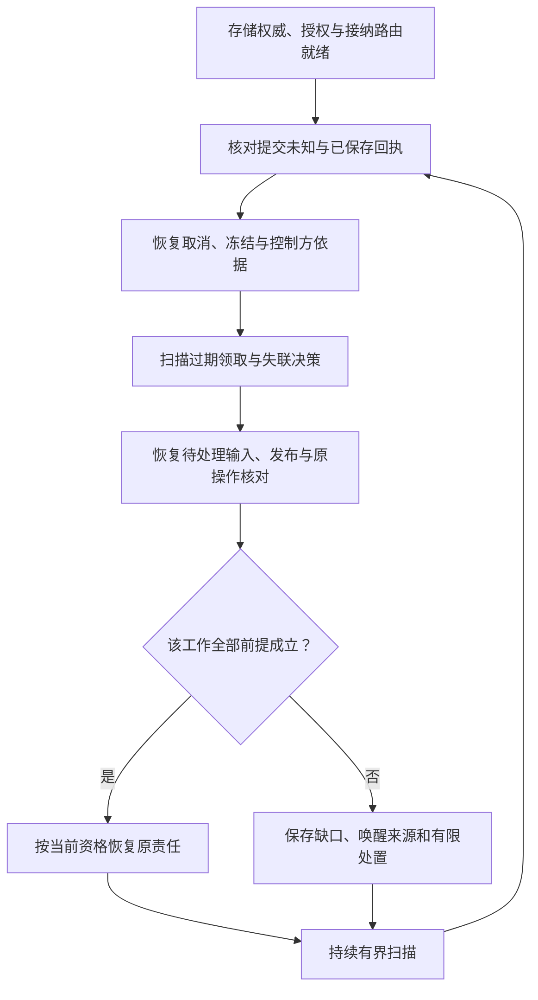

# 恢复、边界与验证

[总览](README.md) · [生命周期](lifecycle.md) · [决策与工作](decision-and-work.md) · [接口与存储](storage-and-interfaces.md)

## 1. 重启恢复已有责任

恢复控制器负责启动协调与限流，调度器执行扫描，任务核心裁决每一项能否继续；恢复控制器不另持一套任务状态。先确认唯一可写存储与依赖配置，再开放工作。内核不可用时，消息交付可以在获准容量内保存入站消息，但不能代替内核返回业务接纳。

图是内核恢复的处理优先序，不是要求全库无缺口后才开始工作。按任务／操作作用域独立核对，异常任务不阻塞其他已就绪任务；同一任务中可能有事实接收已开放、目标派发仍关闭的情况。

| 恢复位置 | 谁继续 | 必须核对什么 |
| --- | --- | --- |
| 提交返回未知 | 原入口／恢复工作者，经运行存储裁决 | 由原操作／消息／工作身份和提交步骤组成的原提交键是否已提交或已封闭，不能仅查一次未见就另建请求 |
| 已接纳但尚未调度 | 调度器 | 原工作仍可扫描，不依赖进程内通知 |
| 决策租约过期 | 核心与恢复工作者 | 先查原 `decide` Work 的准入回执；已准入为 `done`，否则原子置 `closed` 并隔离旧领取，再保存新一轮工作或阻塞条件；未知用量保留 |
| 派发准备后崩溃 | 核心、消息交付与执行协调器 | 原发送责任、原操作事实、当前控制与权限；不还原成“从未发出” |
| 执行发生而结果丢失 | 执行协调器查询原操作，核心消费事实 | 有无可信效果证据；无法判定则等待或有限升级 |
| 结果已保存但 UI 离线 | 发送 Work 与消息交付，UI 管理器恢复投影 | 沿工作中保存的原消息交付；UI 生命周期不改变任务事实 |
| 核对额度耗尽 | 核心保存待处理，获准人员／模块后续介入 | 缺少何种证据、原操作在哪、需要何种权限或额度；不假定失败等于无效果 |

核对到限时保存一次去重的通知责任及 `recovery_exhausted` 内部原因，释放工作者槽位。当前 v1 可通过任务查询／状态摘要暴露缺口；用户追加收尾额度及提交外部核验证据沿[受信管理契约](control-and-management.md)，不能伪装成任意输入请求；终态只追加原责任收尾额度。新的被动事实仍可被处理，不能因主动查询预算耗尽而永远丢弃结果。

普通关闭先停止新接纳和新派发，保存已产生结果及剩余责任，再停止工作者、连接和存储。关闭超时不证明外部动作停止；下次启动沿原操作恢复。观测系统和缓存丢失不影响这些责任的存在。

## 2. 端云重连与离线续跑

连接和消息交付按[恢复协议](../endpoint-communication/recovery-and-control.md#resume)组织恢复。内核先接收授权变化、取消和归属信息，输出本任务允许继续的工作及缺口；执行端负责原操作效果结论，UI 负责快照和待转交输入。三者结论分别保留，不能统一用最后到达状态覆盖。可靠业务消息使用内建必填的 `delivery.scope`；每条流固定一个业务作用域及 lane，交付模块核验声明与真实业务关联一致。单流缺口不阻塞无关作用域，跨作用域的业务依赖仍须由领域模块核对。

离线默认关闭；单独批准有限窗口后，推进必须同时满足当前控制权或有效子任务委派、本地能力与数据齐备、许可明确允许离线且仍有效。需要实时鉴权、无法可信判断许可到期、或依赖失联节点时保持等待。离线子任务不能因父任务失联取得父任务的控制权。

重连时先核对控制和事实，再放行旧消息；已过启动期限的请求不得因重投获得新期限。离线形成的结果是否可上传、长期保存或用于记忆更新分别授权。内核允许有限离线许可内的撤权传播延迟，不宣称云端撤权能即时停止断网设备。

控制处理与恢复查询有保留容量，但现行注册表将 `task.cancel_result`、`execution.cancel_result` 归入 `work` lane。因此内核优先生成这些结果，并要求消息交付在 work lane 内为已接纳工作的必要收尾结果保留有界空间；不得自行把线消息改成 control lane。完整保障依赖消息交付落实相应调度，须单独压测。

## 3. 控制权交接复用既有协议

首期按[用户写权威](lifecycle.md)固定控制方，同用户的全部内核操作共用一个唯一索引。下列控制权交接是条件能力，沿用[先冻结再交接的约束](../endpoint-communication/recovery-and-control.md#ownership)。启用前还须补齐跨权威的用户操作索引归属与去重路由；只迁移单个任务的操作记录不能阻止同一 ID 在另一个任务被接纳。接纳路由或网络路由变化都不授予新控制权。

| 阶段 | 内核必须保存的事实与行为 |
| --- | --- |
| 原方冻结 | 与派发准备串行裁决，保存 `frozen`；关闭未结束的 `decide` Work，隔离旧领取，停止新目标派发；所有 `may_have_sent` 操作纳入核对清单 |
| 状态交接 | 固定 revision 切点，保存任务及 decision_revision、验收条件与验证结果、输入请求、预算及未知预留、操作与完整来源绑定、Work 及其阻塞条件／固定发送载荷、取消与回执；提交未知解决后才能固定切点。接收方保存 `importing`，不继承有效领取，也不能据收到快照启动工作 |
| 唯一生效 | 以原控制方和 owner_epoch 为前提，持久确定同一次交接的唯一目标、新 epoch 和交接切点；重复处理返回原决定。记录可保存在现有权威存储，具体位置及跨端验证方式由协作与授权契约确定 |
| 新方继续 | 验证唯一生效记录、原操作和取消责任，重新核对授权与恢复条件后进入 `active`；沿原操作核对已准备项，未准备项按新 epoch 检查。旧方不能凭旧 epoch 产生新工作 |

切点前的变更全部进入交接状态；切点后原方不再修改被封存的任务，迟到事实和控制请求由消息交付／协作端点可靠保管并转交，未收到权威处理答复前不报告业务已生效。没有获准内容驻留条件或可靠转交路径就不开始交接。原方本地设备接管仍可立即阻止该设备行动。

交接不改写既有消息的 `source`、`message_id` 或操作关联。固定 `source=A` 的发送责任继续由 A 的持久消息交付身份恢复；不能由 B 改名重发。若原身份不能保留，只有身份模块已实现且验证的迁移／代理机制才可替代，否则不交接这些责任。B 新产生的消息使用 B 的身份，接收端须能验证其交接后的业务资格。

已准备但是否发出不明的操作同样进入 `may_have_sent` 清单。执行端对旧 epoch 的例外仅限权威交接记录列明的既有操作恢复，其余旧命令不能创建工作；冻结后的旧目标消息补投也须服从控制同步与原操作恢复规则。

结果未知时查询同一次交接；无法证明唯一生效或原方已停止新派发时保持等待。两个存储各自保存 `owner_epoch` 不能解决双主问题。跨端生效与验证契约缺失时不启用交接，不提供自动强制接管或超时撤回。

## 4. 异常实例：保存可能已发生，用户取消，执行端断线

沿用[总览中的保存与读回任务](README.md#normal-flow)。此处只展开 O1 准备派发后失联的分支，正常链路中的验收条件及操作身份保持不变。

| 步骤 | 持久裁决 | 恢复行为 |
| --- | --- | --- |
| O1 派发准备成功，随后断线 | O1=may_have_sent，效果未知 | 不创建 O1 的替代保存动作；查询原 O1 |
| 用户取消 C | 新目标工作关闭，固定 O1 的取消子操作 C1、核对及结果责任 | 回复取消接纳；C1 无法送达仍可进入 cancelled、effects_pending=true |
| 核对达到有限上限 | 保留 O1、C1、未知用量和缺口，发布一次待处理通知 | 释放主动查询工作槽，不释放未知预算、不声称远端已停 |
| 设备重连 | 消息交付先同步取消，执行端核对 O1 | 若 O1 已保存成功，保留真实效果；若仍未知继续报告未知 |
| 迟到成功事实到达 | 结算可信用量，效果缺口解决，revision 递增 | 任务仍 cancelled；更新状态为 effects_pending=false，不偷偷恢复读回或新目标行动 |

最后一步的 `false` 以执行已结束、效果已知且没有其他开放项为前提。保存失败但效果未知、取消回执丢失、只看到设备重连都不足以清除该标记。

## 5. 已采用合同与启用依赖

固定单一用户写权威可位于本地或云端；已采用的控制、目录、执行事实、远程 Brain 与委派合同均是实现依据，不等于运行提供方已交付。跨端默认网关 WSS，同进程仍沿相同语义。条件缺失时关闭相关行动，事实和收尾按自身资格继续。

| 合同／提供方 | 内核消费与缺席行为 |
| --- | --- |
| [用户控制、预算和补证](control-and-management.md) | 保存原命令、控制原因、预算与验证责任；暂停不取消既有事实，输入／调额不解除暂停 |
| [完整取消答复](control-and-management.md#recovery) | 任务与执行分别查原固定结果；清理后报告缺口，不从当前状态重建 |
| [执行目录与 CE-P1／P2](../capability-and-execution/remote-contracts.md) | 精确声明、完整来源／控制／预算依据，生产者事实修订及累计用量；缺受信依据禁新行动 |
| [远程大脑 BS-P1](../brain-system/contracts-and-runtime.md#remote) | 原 work／attempt／领取／输入绑定，可靠接纳、原调用恢复、停止和用量回送；远端无独立任务权威 |
| [委派合同](../agent-coordination/peer-contracts.md) | 受控内部子树共用写权威；外部未提供暂停能力时单独披露，原外部预算上限不动态修改 |
| [消息交付](../endpoint-communication/delivery-and-recovery.md) | 两处持久交接、原消息恢复和 work lane 收尾空间；未提供不确认相应接纳 |
| [身份与可信时间](../identity-and-authorization/mechanisms.md) | 当前使用与来源证明；离线默认关闭，单独批准的有限窗口且本地依赖齐备才可继续 |
| [任务策略扩展](storage-and-interfaces.md#task-policy) | 安装 Describe／BindGoal／PlanVerification 与固定验证器；依原配置选策略，缺失不报告完成，补证不能替代提供方 |
| [上下文补全](decision-and-work.md#context-requirements) | 核心保存结构化需求及累计进展，Build 消费固定提供方；没有真实推进条件不创建空转等待 |
| [内容与来源](../content-and-provenance.md) | 精确内容、完整来源、保留与当前披露；残留清理如实未完成，不能用索引删除代表全链清理 |
| 任务写权威迁移 | 当前关闭；启用前仍须唯一生效、全用户操作索引归属与旧身份责任交接，见[交接约束](#ownership) |

## 6. 实现验收

以下为实现后的必测场景。测试从任务核心／执行接口注入输入并观察持久状态、可靠消息及实际效果；事务故障注入覆盖提交前、提交后响应前、交接后记账前三个窗口。

跨模块目标、验证层级与证据口径见[系统验证设计](../validation.md)。本节提供场景与通过条件，不表示已执行测试。

| 编号 | 场景 | 必须观察到的结果 | 约束／目标 |
| --- | --- | --- | --- |
| TK-01 | 重投提交、任务 ID 冲突、相同操作不同内容 | 同操作同任务；冲突无第二次创建；回执可恢复 | K1、K3、K5／C5 |
| TK-01a | 同用户首次请求错投另一存储，同操作改绑任务，或创建提交未知 | 只有配置指定权威可接纳；任务与提交操作均唯一；沿原权威查询／重投，超时不改变归属 | K2、K3、K5／C5 |
| TK-02 | 接纳后崩溃、丢通知、响应交接确认丢失 | 任务与首次工作共同存在；扫描继续；原响应固定 | K3／C5 |
| TK-03 | 两端争答、重复输入、进度刷新、输入过期 | 至多一个不同操作消费；同操作复用结果；有效输入不受 UI 文字修订影响 | K3／C6、C7 |
| TK-04 | 模型生成时接收新事实或取消 | 旧提案无新操作；实际用量仍结算；后续轮次有界 | K4、K8／C1、C7 |
| TK-04a | 本轮最终账单先于提案到达；并行操作收到同义事实 | 仅 revision 变化时复用提案并重验当前预算；真正业务结论变化推进 decision_revision、拒绝旧轮 | K4、K6／C1、C5 |
| TK-04b | 一批执行事实密集到达，之后稳定；持续变化的另一组 | 有界合并并保存必要等待条件；稳定且额度／资格满足时能准入，持续业务变化明确退出或等待，不以无限重算保证进展 | K4、K9／C5 |
| TK-05 | 准入与关闭 decide Work 并发 | 准入 done 与退出 closed 仅一个生效；关闭后旧 work_id／claim_epoch 不能再准入；未知预留保留 | K4、K9／C5 |
| TK-05a | 两次结构修复、取消／重启与逐调用迟到账单 | attempt_no 固定且不复用，旧轮不重调；每次用量归原调用且只结算一次，未知额度保留 | K4、K9／C5 |
| TK-06 | 批次含坏参数、前提未齐或超额操作，混合执行与委派 | 无效批次整体拒绝，无部分派发或占额遗留；有效并行批次可共同准入，串行步骤取得事实后再决策 | K3、K6／C4、C5 |
| TK-07 | 取消与派发准备两种提交顺序 | 取消先则零新准备；准备先则沿原操作取消／核对 | K6、K8／C7 |
| TK-07a | 取消先到被拒、原调用随后出现 | 保留第一次取消结果；条件变化后建立新取消尝试，不假定首次拒绝已屏蔽后到调用 | K5、K8／C7 |
| TK-08 | 准备后发包前崩溃，或动作发生后结果丢失 | 不退回未派发；不生成替代副作用操作；先核对原操作 | K5／C4、C5 |
| TK-09 | 租约过期旧工作者继续返回 | 旧资格不能写新决定；可信迟到事实可受控保存 | K2、K4／C5 |
| TK-10 | 提交 Unknown，查询暂时未见，旧事务稍后提交 | 不误判未执行；复用原身份与步骤组成的提交键，最多应用一次 | K3、K5／C5 |
| TK-11 | 乱序事实、重复用量、冲突已知结论 | 不倒退、不双计、不按最后到达覆盖；冲突依赖受限 | K5、K7／C4 |
| TK-11a | 首次调用明确被拒，或等待的原操作确认失败 | 消费业务 response；仅释放确定未用预留，按已存阻塞条件及失败处置唤醒决策；没有预先派发的受阻后继 | K3、K6／C4、C5 |
| TK-12 | cancelled 后收到成功，或控制结果超窗 | 真实效果保留；终态不重开；通过原取消身份恢复固定答复，清理后明确缺口 | K8／C5、C7 |
| TK-13 | 内容引用缺失、撤权、来源删除、能力升级 | 必要内容无效不完成；旧能力不静默替换；获准信息不越用途使用 | K6、K7／C2、C7 |
| TK-13b | 快照含私密 M 与公开 P，M 已撤权但提案只引用 P；另有摘要／计划间接引用 M | 按组装器完整来源闭包拒绝该轮输出或派发；模型漏报引用不能绕过复核 | K4、K6／C2、C7 |
| TK-13c | 验收预期路径 A，可信读回证据来自 B；只有成功回执；修复后沿用旧成果核验 | 分别得到 fail、unknown、过期结果，均不完成；正确版本及全部必需条件 pass 才可成功 | K7／C4 |
| TK-13a | 必需效果已确认，额外只读分支未决；另一情形仍有分支可能写成果 | 前者在不影响目标、责任已存并披露缺口时允许 completed/true；后者不能完成。终态后的事实仍可更新状态及用量 | K7、K8／C4、C5 |
| TK-14 | 父取消与子完成并发、重复委派／账单 | 固定子任务关联；父状态独立裁决；预算不双计不超卖 | K3、K8、K9／C5 |
| TK-15 | 离线许可到期、无法验证时钟、重连撤权 | 停新行动；先控制核对再放行；不自动上传受限结果 | K2、K6／C5、C7 |
| TK-16 | 交接各阶段崩溃、旧 epoch 及旧 source 消息恢复 | 至多一方产生新工作；列明原操作可核对；旧消息身份不改写；无超时接管 | K2、K5／C5 |
| TK-17 | 跨用户任务、操作、工作、内容与恢复引用 | 全部拒绝且不泄漏资源存在性；本地调用同样隔离 | K1／C7 |
| TK-17a | 同用户两个任务复用同一输入／取消 operation_id，并错投另一写权威 | 用户级唯一索引拒绝改绑，错投不另建记录；跨权威分区／迁移契约不齐时拒绝启用 | K1、K5／C5 |
| TK-18 | 单用户洪峰、存储接近满、控制与结果积压 | 新接纳前限流；保留控制和收尾空间；已接纳责任不静默丢失 | K3、K9／C5、C8 |
| TK-19 | 核对额度耗尽、终态后被动结果到达 | 自动查询停止且通知去重；事实仍可接纳，未知预算不提前释放 | K8、K9／C5 |
| TK-20 | 问答及模拟 GUI 的真实闭环 | 分别证明来源支撑与执行后观察；不能用契约通过替代效果成功 | K7／V1、V2 |
| TK-21 | 暂停与派发／完成分别竞争，may_have_sent 实际未启动 | 暂停先则新目标和正常完成受阻；处理端已知暂停不首次 Start；真实在途可结束，未知不当停机 | K2、K6、K8／C5、C7 |
| TK-22 | 父暂停、子自暂停、旧恢复迟到及外部不支持暂停 | 解除祖先原因不清子自暂停；旧修订拒绝；外部缺口单列，不宣称全树已停 | K2、K8／C5、C7 |
| TK-23 | 暂停中输入／补证齐备、期限到、随后恢复 | 输入和验证不解除暂停；不正常完成；期限照走，终态不复活 | K7、K8／C5、C7 |
| TK-24 | 重投增额、降到未知预留以下、内部份额变化、外部扩额 | 重投无重复加额；下限不足拒绝；内部共同提交；外部原上限不改 | K3、K9／C5、C7 |
| TK-25 | 伪造／过期补证、验证响应丢失、取消结果超窗 | 固定验证结果可恢复，未知不变成功；取消原结果与当前事实分别查询 | K3、K5、K7／C4、C7 |
| TK-26 | 需求回送后、Build 读取前后分别崩溃；旧轮迟到，换需求 ID 或查询重复同一缺口 | 需求与后继责任共同保存；旧轮不触发补全；原读取／用量可核对，任务级预算及已取范围不重置 | K3、K4、K9／C1、C5 |
| TK-27 | 目录空页／重复页、游标失效或倒退、无提供方、真实源修订变化与补全到限 | 受信分页前进可只续 Build，空页不调用 Brain；重复／倒退无进展，有限重开仍受累计上限；等待绑定推进者／对象／期限，无提供方或耗尽明确澄清／失败 | K4、K6、K9／C1、C5 |
| TK-28 | 新目标策略接入、同名证据不同保证、运行中卸载／升级验证器 | 不改通用调度接入已支持目标；证据按固定语义拒绝错配；旧任务不热换策略，依赖缺失等待／失败，核心仍独立裁决 | K6、K7／C4、C6 |
| TK-29 | 内部子 C/S 接纳后 Peer 断连，子已完成，父观察重复／迟到 Peer fact | 父观察责任在接纳事务存在；直接原权威继续，源位置与消费共同提交；两条途径只唤醒／结算同一事实一次 | K3、K5、K9／C5 |

先在单任务参考实现验证 TK-01～13、17、19，再开展子任务与跨端 TK-14～16，控制合同并行验证 TK-21～25，新增补全／扩展／内部观察验证 TK-26～29，最后做 TK-18 容量及 TK-20 专项效果。跨端、授权和内容能力缺失时报告未验证，不跳过依赖宣称通过。

文档检查核对图文、状态、所有权、成功条件、链接及图示渲染；协议静态检查校验 Schema 与示例。运行验收须在实际实现上执行上述场景，分别记录持久状态、可靠消息和实际效果，不能用文档或静态检查代替。
