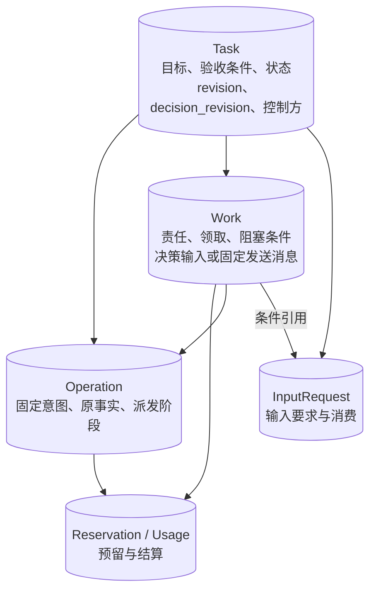

# 接口与持久化

[总览](README.md) · [生命周期](lifecycle.md) · [决策与工作](decision-and-work.md) · [恢复与验证](recovery-and-validation.md)

## 1. 对外接口与协议映射

接口中的 `RequestContext` 由可信入口构造，包含用户、端点、委派主体、授权依据和已校验消息关联；业务载荷不能覆盖这些值。同进程调用保留相同身份、幂等和耐久语义，不强制序列化为 WSS 消息。

| 任务核心接口 | 输入 → 输出 | v1 映射与保证 |
| --- | --- | --- |
| `Submit` | 任务 ID、目标、附件、原操作 → 接纳／拒绝 | `task.submit`；创建任务、首次工作、操作决定和响应责任一次提交 |
| `ApplyInput` | 任务、输入请求、值、原操作 → 已消费／拒绝 | `task.input`；原子消费请求；无异步 accepted |
| `Pause`／`Resume` | 任务、预期控制修订、原命令 → 固定控制答复／拒绝 | task.pause／resume；本人及祖先原因分别记录，原结果可恢复 |
| `AdjustBudget` | 任务、预期预算修订、完整新限额及内部子份额 → 固定调额答复／拒绝 | task.adjust_budget；同一预算提交域裁决，不修改外部委派上限 |
| `SubmitEvidence`／`ReadEvidence` | 条件与原操作关联的获准材料 → 接纳及固定验证答复 | task.submit_evidence／evidence_result／query_evidence；不授予强制完成资格 |
| `ReadCancel` | 任务及原取消身份 → 完整固定答复／拒绝 | task.query_cancel；恢复不依赖消息窗口 |
| `Cancel` | 任务、原因、取消操作 → 接纳／拒绝 | `task.cancel`；接纳表示取消决定持久，不表示远端已停止 |
| `ReadTask` | 任务 ID → 当前快照／拒绝 | `task.query`；返回 revision、主状态、独立 control、effects_pending 及有效输入请求；默认读当前权威 |
| `ReadResult` | 任务 ID → 固定正式结果／拒绝 | `task.query_result@1`；只读恢复接口，返回完整原 task.result 载荷；不依赖交付窗口或 UI |
| `ReadOperation` | 原操作 ID → 控制操作处理状态／拒绝 | `task.query_operation`；`recorded` 为责任已保存，`applied` 为对应控制处理完成，`rejected` 为拒绝；pause／resume／adjust_budget 已 applied 时另返回固定 control_result；不是完整外部效果结果 |
| `Observe` | 原请求的可靠响应、操作／子任务事实与来源 → 已保存／重复／冲突 | 消费执行 invoke/cancel 响应及 fact/result/cancel_result，或协作事实；只接受已绑定生产者；冲突也须持久保存后确认处理 |

表中线消息省略 `harness.`。`task.status/input_requested/result` 关联创建任务的提交操作；`task.cancel_result` 关联取消操作。输入答复沿用输入操作。只读请求响应中的 `status=completed` 表示查询完成，不能解读为任务完成。

`execution.cancel_result` 信封中的 `operation_id` 指取消子操作，载荷 `target_operation_id` 指原执行调用；两项均核验并更新，不能只归档原调用而丢掉取消责任。内部 `control/publish` 工作类型不改变协议注册表的 lane。

| 被查询的任务操作 | `recorded` | `applied` |
| --- | --- | --- |
| submit | 仅允许用于已持久登记但尚未应用的业务责任；本实现创建事务直接完成应用，不单独暴露此阶段 | 任务和首次工作已创建，不等待任务完成 |
| input | 本实现同步消费，不单独暴露此阶段 | 原输入请求已原子消费 |
| pause／resume／adjust_budget | 本地同步提交，不暴露中间接纳 | 原控制／预算及固定答复已共同保存；不表示远端已经物理停止 |
| cancel | 取消决定已保存，取消操作结果尚未固定 | 本地控制处理与固定取消结果已保存；仍可为 effects_unknown，不代表效果已清楚 |

明确拒绝为 `rejected`。不存在、已清理或无权查询的操作采用既有拒绝响应及安全错误信息，不发明 unknown 状态；纯消息保管也不能投影为业务 recorded。

`ReadTask` 的 `input_requests` 最多 64 项，故同一任务同时有效输入请求也限定为 64；超限拒绝该提案，不能截断后让部分请求无法恢复。任务历史、内部操作账本分页通过内部管理接口读取，不伪装成 v1 已有字段。

新增控制与补证的完整边界见[用户控制与管理](control-and-management.md)，机器字段见 [task-control Schema](../endpoint-communication/schemas/task-control.schema.json)。控制修订与预算修订只在相应配置变化时推进，避免普通进度刷新使用户命令无谓冲突。

### 正式结果查询与恢复契约

本节定义 `ReadResult`／`task.query_result@1` 的规范性行为，同进程与跨端实现均须满足。正式结果在[任务终态提交](lifecycle.md#completion)时固定；按 `task_id` 返回完整原 `task.result` 载荷，包括原修订、摘要及成果引用，与返回当前状态的 `ReadTask` 分开。查询不触发重新执行，不要求原消息仍在交付窗口、UI 仍存在或调用方知道执行子操作。任务权威按独立的业务与内容保留策略保存查询依据，交付载荷清理不能删除仍须保留的正式结果。

查询先验证身份、任务访问及当前披露权限，无权时不透露对象是否存在。只有获准查询后，才按以下互斥情况返回；查询不扩大保存、同步或披露权限。

| 查询时的情况 | 返回事实与后续处理 |
| --- | --- |
| 任务尚未终结 | 返回 `core.precondition_failed`，不触发执行或生成结果 |
| 已终态、原结果仍保留 | 返回固定原结果；迟到事实及当前 `effects_pending` 另由 `ReadTask`／`task.query` 返回，不改写原结果 |
| 已终态、结果已按策略清理、删除或依据缺失 | 返回 `task.result_unavailable`、`retry=never`，不以当前摘要伪装完整原结果 |

取得原结果后，调用方还须独立取得并核验所需引用内容。内容暂不可取、失效或无权读取时，保留原结果事实并分别报告内容获取情况，不能确认交付完整。结果不无限保留，内容提供端也不保证永久在线；完整内容确认条件见[内容交付](../endpoint-communication/message-contract.md#delivery)。

某次取消的固定答复属于该取消操作，沿 `ReadCancel`／`task.query_cancel` 按[原控制答复恢复](control-and-management.md#recovery)读取，不能用正式任务结果或当前状态代替。

### 内部协作接口

以下接口定义模块间交接的最小契约；线消息采用上一节的 v1 映射。

| 接口 | 最小输入 | 返回与失败语义 |
| --- | --- | --- |
| `ContextAssembler.Build` | 决策 work_id、任务一致快照、用途、内容／成本限额、固定策略版本 | 快照引用、完整 source_bindings、准确能力声明、缺口；来源集合包括派生摘要与计划的传递来源，缺少依据的内容不进入快照 |
| `Brain.Decide`（本地／远程） | 决策 work_id、快照、draft/fixed 验收条件及缺口、提案约束、模型配置、期限和生成预留；调用模型时附 attempt_no | 完整提案及逐调用用量；draft 只允许澄清、受信策略限定的只读取证或失败结束；返回的引用不能缩小 source_bindings |
| `Delivery.Accept` | 固定消息与交付身份 | 已耐久承担发送责任／拒绝／未知；沿原身份恢复；不返回业务成功 |
| `Core.CheckRecovery` | 任务或操作作用域、当前授权／控制／交付核对依据 | 允许哪些消息处理、哪些行动继续受限及缺口；交付模块负责最终放行 |

启动、准入、关闭决策及派发准备是任务核心处理工作的内部事务步骤。工作者使用已领取工作进入核心规则，不能自行修改业务记录；步骤及原子关系见下文。

执行、记忆、授权及能力目录沿全景图已有模块接入。能力的查询／取消保证、可信时钟、证明有效期等必须显式声明；实现不能靠函数名推测它们可用。

### 验收条件与验证结果

任务策略及验证器使用以下内部值。条件如何建立、澄清及固定见[完成核验](lifecycle.md#completion)。任务核心从已保存条件取得预期值与验证器版本；大脑提案只提交证据引用，不能重写判据。

| 值 | 最小内容 | 校验责任 |
| --- | --- | --- |
| 验收条件 | 任务内 condition_id、固定策略／验证器版本、required、机械核验或语义评估类别、目标依据、预期对象及值或固定取值规则、允许的证据生产者／类型 | 受信任务策略从原目标和已确认输入建立；条件集保存 fixed 状态后才能用于目标行动和完成 |
| 目标依据 | 原提交／输入操作、获准内容引用及版本、与条件的映射 | 核心核对来自本任务；策略覆盖用户明确约束，歧义先通过 InputRequest 澄清 |
| 验证请求 | condition_id、固定条件集版本、证据引用、被验证成果版本／摘要、当前决策版本 | 核心绑定请求；需新读回等外部取证时，先准入正常操作，不在提交事务内调用外部模块 |
| 验证结果 | 原验证请求关联、验证器身份／版本、pass／fail／unknown、证据版本及来源、原因与保证类别 | 只接纳配置绑定的验证器返回；提交完成时检查仍适用，且全部 required 条件为 pass |

首期机械验证使用已安装的有限规则，如目标路径匹配、读回内容摘要匹配、能力约定的效果状态、必要交付回执。任意自然语言或模型生成代码不能作为可直接执行的谓词。开放语义评估使用策略指定的评估器，并保存其评估依据；这类 pass 表示满足该评估策略，不构成内容正确性的形式证明。

固定条件不要求预先知道尚未生成的成果字节。受信策略可以固定“保存通过指定评估的答案版本，再独立读回同一内容”这样的取值规则，并限定允许引用的正式事实、生产者和版本关系。候选内容耐久保存后，核心按该规则绑定具体版本与摘要，验证结果绑定同一候选；写入操作准入时固定这份绑定。大脑不能自行指定判据或把任意结果声明为预期值。更换候选必须重新验证并形成新的行动意图，不能改写已准入操作，也不能绕过原操作效果未知的限制。完整例子见[贯穿设计示例](../design-walkthrough.md)。

本地无副作用且有界的验证函数可在核心核验阶段运行，结果与完成决定一起保存，避免先单独写入本轮验证结果而使自身提案过期。远程、有成本或需要新观察的验证通过策略指定的已安装能力形成普通 Operation，复用预留、派发、来源复核及原操作恢复；结果作为正式事实保存，下一轮再提出 finish。能力未安装时等待或报告缺口，不能在准入事务里隐含模型调用，也不能把提案的自评分当作该操作结果。

例如条件固定 `expected_path=A` 与原输入内容摘要 H，证据报告路径 B 时，验证器返回 fail；只有“写入成功”的证据而无要求的读回摘要时返回 unknown。两种情况都不能提交 completed。

## 2. 标识、版本与持久记录

| 标识 | 解决的问题 | 不表示什么 |
| --- | --- | --- |
| `task_id`／`revision` | 一个任务及其正式状态版本；对外投影与本地短事务比较提交 | 不直接决定长时间生成的提案是否过期 |
| `decision_revision` | 任务内部决策语义版本；提案基线与当前值比较 | 不随纯账务变化递增；远程 Brain 以 base_decision_revision 绑定本轮基线，不加入公共信封 |
| `owner_epoch` | 同一任务控制方的权威代次 | 不随工作者重启、网络重连递增 |
| `work_id`／`claim_epoch` | 持久责任及一次领取资格 | 领取失效不意味着外部动作停止 |
| `operation_id`／`message_id` | 业务意图和逻辑消息，分别去重 | 同操作可有多条消息，消息有序不代表跨操作因果 |

决策轮次由不可复用的 decide work_id 标识；模型调用由 `(work_id, attempt_no)` 标识。本地提交复用下文的请求／工作步骤键。线字段遵守协议 UUIDv4、UTC 时间和十进制 uint64 规则；内部版本同样不得环绕复用，达到上限时拒绝递增并保存可查询故障。

下图表示运行存储内的逻辑记录关联，箭头表示引用关系；不规定实际表数或面向对象类结构。

所有键至少受 `user_id` 作用域约束；查询任务内对象必须同时验证任务归属，不能只凭全局随机 ID 访问。

| 记录 | 必须保存的字段组 | 唯一性与恢复用途 |
| --- | --- | --- |
| Task | ID、提交操作／请求方、写权威、目标、约束与策略版本、验收条件集／版本／固定状态、获准计划引用（可选）、revision、decision_revision、主状态、控制修订／本人及祖先暂停、owner/epoch/阶段、取消、期限、固定正式结果或其获准引用 | 用户写权威内 `(user, task_id)` 唯一；错投请求不得另建任务 |
| Operation | ID、种类、意图摘要及必要原文、生产者／目标、能力版本、原请求、启动期限、必要事实引用／判据／适用版本、source_bindings 引用、派发阶段、结果事实、retry_of | 同用户所有任务共用 `(user, operation_id)` 唯一索引；同 ID 不可跨任务、跨种类或更换内容 |
| Work 公共字段 | ID、任务、类型、关联对象、状态、blockers、not_before、deadline、重试计数、claim_epoch、lease_until、处理结果 | 同一责任只建一次；每任务至多一个未结束 decide；结果与后续工作同事务保存 |
| decide 工作载荷 | base_decision_revision、owner_epoch、生成领取、策略绑定、快照及 source_bindings、每 attempt_no 的调用准备／返回／用量关联、待准入提案及 admit_attempt、预留及准入操作映射 | 不可复用的 work_id 标识轮次；同局部动作键只能映射一个操作；关闭工作后保留迟到账单关联 |
| 发送工作载荷 | message_id、source、target、固定消息／内容引用、source_bindings 引用、原期限、交接凭据与缺口 | dispatch/control/publish 承担发送；交接前仍须检查披露许可 |
| InputRequest | input_request_id、用途、字段、有效期、消费操作及结果 | 同一请求至多一次消费；内容变更必须换 ID；工作 blocker 只引用它 |
| EvidenceSubmission | 原补证操作、条件／验证器版本、原操作关联、候选来源与材料、验证责任、固定验证结果 | 接纳材料、核验事实和正常完成分别保存；原结果可恢复 |
| Reservation / Usage | 预算修订、分配来源、目标／收尾类别、保证模式、维度／整数单位及货币刻度、limit、预留上限、调用关联、已知累计用量、未知余额 | 唯一用量项／调用累计值去重；任务关闭不抹除未结算占用 |
| 处理回执 | 原请求／事实／工作步骤键、内容绑定、结果、应用 revision、响应引用 | 可存对应记录或共用表；不作为独立业务对象，也不能只留“处理过”布尔值 |
| Evidence / Audit | 原消息／来源、原操作、最小获准证据、验证结果及条件／成果版本、冲突与处置、用量出处 | 事实只追加必要记录，投影可更新；不默认复制敏感载荷 |

`source_bindings` 每项保存来源 ID、内容修订或摘要版本、允许用途及接收方、权限证明引用及有效性依据。快照、操作和结果可引用同一份不可变集合；集合由组装器生成，模型无权删减。派生内容必须能追溯到获准原来源，详细规则见[来源复核](decision-and-work.md#context)。

任务快照只包含当前推进所需的数据，历史分页读取。证据内容可以在受控内容提供方中，运行存储持有引用与完整性信息；提交前取得覆盖所需期限的保留确认，引用后按获准策略防止提前清理。无法获准保留到所需期限时报告缺口，不发布可恢复承诺。领域提交未知、孤立上传及到期清理的竞争统一遵守[内容与来源共同交接](../content-and-provenance.md#publication)。

## 3. 原子边界与跨模块交接

推荐首期使用能提供条件更新、唯一约束及本地事务的单一运行存储。同用户的任务、Operation 唯一索引、工作、预算和回执属于同一提交域，覆盖 submit、input、cancel 及内核产生的操作。同任务写入串行裁决；跨任务只在操作唯一性或用户额度等共享条件上协调。

用户总配额若由独立配额模块分配，则先取得有界份额，内核只能在该份额内预留，不能分别检查后同时超卖。

| 事务 | 一起保存 | 必须排除在事务外的操作 |
| --- | --- | --- |
| 接纳任务 | 创建／去重、策略绑定、可确定的验收条件、初始预算、首次工作、操作回执、accepted 发布 | 模型生成、网络交付 |
| 启动决策／调用 | 有效领取、生成预留、base_decision_revision；组装后复核资格并固定输入与来源，每次调用前再复核并保存 attempt_no 及调用准备标记 | 读取远程记忆、模型调用 |
| 准入提案 | 核对决策版本及当前条件，再共同保存本轮结算、decide 工作 done 与结果、操作映射、预留及后续工作／输入请求／终态 | 执行调用及跨模块写入 |
| 决策退出 | 原准入核对、decide 工作 closed、已知结算／未知预留、新轮工作及其阻塞条件 | 旧物理模型调用的实际停止，不假定随关闭完成 |
| 准备派发 | 当前条件检查、may_have_sent、固定请求和发送责任 | 任何可能启动外部操作的调用 |
| 暂停／恢复／调额 | 原命令、当前控制或预算、预期专属修订、决策基线、内部子份额或祖先屏障及原答复共同保存 | 对远端传播、实际停止或外部动态调额的假定 |
| 接纳／验证补证 | 保存原材料、来源、条件绑定、验证责任；验证结束保存固定结果及事实交接 | 未接纳前宣布 verified，或把候选直接写成完成事实 |
| 应用输入／事实 | 去重、消费／事实、投影、按分类更新两种版本、可信结算、阻塞变化、后续工作与回应 | 外部核验动作；须另登记责任 |
| 取消／终态 | 控制屏障、资格失效、未派发工作关闭、处置工作、结果和发布 | 远端停止和用户端显示 |

### 消息交付存储与运行存储

消息交付的持久化责任来自端云协议[“两处持久交接边界”](../endpoint-communication/message-contract.md#handoff)。本节明确内核依赖哪些记录；消息交付模块内部的表、索引、压缩与扫描实现由该模块设计。

| 记录归属 | 必须可恢复的记录 | 对外确认的含义 |
| --- | --- | --- |
| 消息交付的持久记录 | 发送消息与发送责任；接收消息、去重记录与业务待处理责任；流序号／回执／保留窗口依据 | 已承担消息保管和交接责任，业务可能尚未接纳 |
| 内核运行存储 | 任务、操作、输入消费、预算、工作、处理回执与成果；待交付消息先保存在发送 Work | 业务决定及后续工作已保存，外部效果和目标接收仍待证据 |

两组记录可以使用同一数据库产品，分别由各自模块管理。当前契约按两个本地提交边界恢复，不依赖跨模块全局事务；交付侧记录与恢复规则见[消息交付账本](../endpoint-communication/delivery-and-recovery.md)。落盘与崩溃恢复须在实现后验证，内存队列不能满足上述保证。

入站先由消息交付一起保存消息、去重及待处理责任，再调用任务核心。内核提交业务决定后确认处理；消息交付随后清除或标记该待处理项。确认丢失就重交原消息，核心凭业务回执返回原处理结果。

出站先由内核随业务决定保存发送 Work，再调用 `Delivery.Accept`。消息交付持久接纳后，内核将该工作置为 done 并保存凭据。任一确认丢失都沿原 message_id 重交，直到能确认责任已由消息交付接管；后续目标端回执按协议处理。

`publish` 工作完成只表示发送责任已可靠交给消息模块，目标接收、业务效果和内容可用性另行记录。已交接载荷是否可清理依照协议的目标回执及保留窗口；内核按独立保留策略保存操作、完整固定正式结果及成果引用和缺口，不能把交接完成当作删除全部业务依据的理由。`ReadResult` 不依赖发送 Work 的载荷继续存在。

## 4. 条件提交及提交未知

任务核心按创建、消费输入、准入、派发准备、事实和控制执行类型化事务；运行存储不向业务调用方暴露任意行补丁。每种事务用已有身份构成固定提交键，绑定本次不可变意图。

| 提交来源 | 复用键（均在受信用户作用域内） |
| --- | --- |
| 业务请求 | 请求种类与 operation_id；操作跨种类复用仍由操作唯一约束拒绝 |
| 可靠事实 | 来源端点与 message_id；同操作可以有多条不同事实 |
| 工作步骤 | work_id、claim_epoch、步骤名，必要时加已有的有限尝试序号 |
| 领取／续租 | 领取使用已知 work_id、预期旧代次及固定下一代次；续租增加本次序号并绑定绝对到期时间。均在提交前固定参数 |
| 用量 | 调用身份与用量项标识；累计值使用可信的单调结算规则 |

提交先检查身份、归属与披露权限，再查原键回执；同键异意图拒绝。无回执时，核对当前写权威、适用领取、权限与预算等条件，原子保存变化、后续工作及回执。先查回执再比新版本，使成功重试能返回原结果；该结果不授予今天重新执行的权限。

准入先比较 `base_decision_revision`，再以事务读取的当前 `revision` 保存本次变化。准入步骤键采用 `(work_id, claim_epoch, admit, admit_attempt)`，绑定原提案及本次期望版本；`admit_attempt` 是持久递增的本地提交尝试号，与模型的 `attempt_no` 分开，重试受任务期限、领取期限和单次调度次数限制。

纯账务并发造成短事务冲突时，确认原事务未应用后，读取新账本、重验同一提案并递增 admit_attempt。提交未知仍查原键回执，不能换号；达到单次调度重试上限后保存提案及延后重试时间，由原有效持有者继续，不重新调用模型或延长原领取期限。持有者丢失、领取或决策基线失效后按旧轮关闭规则处理。各类变更的基线规则见[决策版本](decision-and-work.md#decision-version)。

| 存储返回 | 调用方行为 |
| --- | --- |
| `Committed(receipt)` | 可交接已保存责任；不据此假定外部模块已完成 |
| `Rejected(reason)` | 仅在确定未应用且事务已结束时使用；按冲突／前提变化重新计算 |
| `Unknown(原提交键)` | 停止依赖该提交的新行动；查原回执或原样重试；不能通过增尝试、换领取或换键绕过 |

原提交键在发起事务前可重建并固定；工作记录保留未决步骤与其领取代次，恢复者先核对此步骤，再关闭旧领取。查询区分已提交、当前未见、已封闭未应用及超出恢复依据。只有原事务结束或被隔离、旧入口封闭且仍在同一写权威，才能认定未应用。首期不带着未解决提交未知迁移任务。数据库不可写时报告不可用／未知，不声称已保存等待。

## 5. 索引、保留与错误

必要索引覆盖 `(user, operation_id)`、`(user, task_id)`、到期／租约过期工作、blockers 引用、有效输入请求及未决效果。发送与等待通过工作索引扫描。扫描有界前进，正确性依赖事务约束，不能依赖内存候选或仅一次启动扫描。

消息保留窗口、业务幂等保留期和审计／内容保留期分别配置。幂等记录至少覆盖允许重投、查询及未完成责任的生命周期；清理载荷后保留获准的最小墓碑／关闭依据，使旧 ID 不能重新创建动作。到达保留边界但效果仍未知时，保留可查询缺口；存储不足在新接纳前限流或拒绝，不删除尚未交接的责任。

数据删除由授权与数据策略决定，内核不无限保留敏感正文。必须删除尚被任务依赖的证据时，先停止相应使用并把缺证据责任持久化；只保留获准的最小控制／去重依据。若策略连必要可靠性记录也不允许保存，应在接纳前拒绝该执行模式。

| 内部拒绝／故障 | v1 对应 | 后续动作 |
| --- | --- | --- |
| 身份、权限、租户不成立 | `core.unauthenticated/forbidden` | 修复前保持受限，不披露其他用户是否有该对象 |
| 原标识意图冲突 | `core.identity_conflict` | 不重试改写原标识 |
| 任务／输入／能力前提过期 | `core.precondition_failed`，UI 输入错误沿 UI 契约 | 条件变化后使用合法新请求；内核 `stale_proposal` 不直接当线错误类型 |
| 容量不足且明确未接纳 | `core.overloaded` | 在原期限内按响应指示重投或等待 |
| 提交／交付是否成功不明 | 不伪装业务 rejected；按交付阶段报告 unknown／恢复缺口 | 查原提交、原操作；`core.error` 不能代替已接纳操作的持久结果 |
| 效果未知／事实矛盾 | `execution.effect_unknown` 或任务等待摘要 | 核对原操作，不用新操作掩盖缺口 |

具体线响应仍遵守[错误对象](../endpoint-communication/wire-format.md#errors)，未知查询结果不得凭空新增查询状态枚举。

## 6. 有限配置与容量边界

以下参数必须配置为有限值并纳入任务／部署版本，具体数值由参考实现压测确定。协议已有上限直接遵守，不能等压测再放开。

| 配置组 | 必要参数 | 不变量 |
| --- | --- | --- |
| 接纳 | 用户活跃任务数、待处理字节数、任务历史保留 | 拒绝发生在接纳之前；控制和已有结果收敛保留容量 |
| 决策 | 用户模型并发、单轮时长／用量、修复次数、上下文大小、事实合并窗口与批量 | 每任务一个未结束 decide 工作；未知用量仍占额；合并窗口有上限 |
| 提案 | 行动数、子任务数／深度、同时输入数 | 输入数不超过 64；只准入前提已齐的行动；禁止无界递归委派 |
| 调度 | 扫描批量、工作租约、最大续租、各类份额、每用户并发 | 非目标工作有保留容量，目标工作也不能被无限恢复队列饿死 |
| 恢复 | 查询间隔、退避上限、次数／时长／收尾费用 | 到限保存待处理与一次通知，停止主动消耗；继续接收获准事实 |
| 期限 | 任务期限、操作启动期限、输入期限、交付窗口 | 重启和重投不延长；不同期限不得共用一个超时字段 |

调度可采用 `min(max_backoff, base × 2^attempt)` 加有界随机抖动，再受剩余期限和预算截断；退避计数持久化。千万注册、百万日活、十万在线是系统规模目标，不能据此直接推导任务吞吐；实现需测任务创建率、活跃任务、模型并发、平均操作数和记录保留量后再分区。

首期按用户分区，同用户任务与操作唯一索引始终落在一个写权威。库内可按任务组织表和调度，但不能据此把同用户任务拆到独立裁决的存储。容量不足后若需跨权威任务分区或单任务交接，必须先定义用户级操作身份归属、请求路由和迁移期间去重；仅复制被迁移任务的操作记录不足以维持全用户唯一性。相应契约未验证前不启用这些能力。
