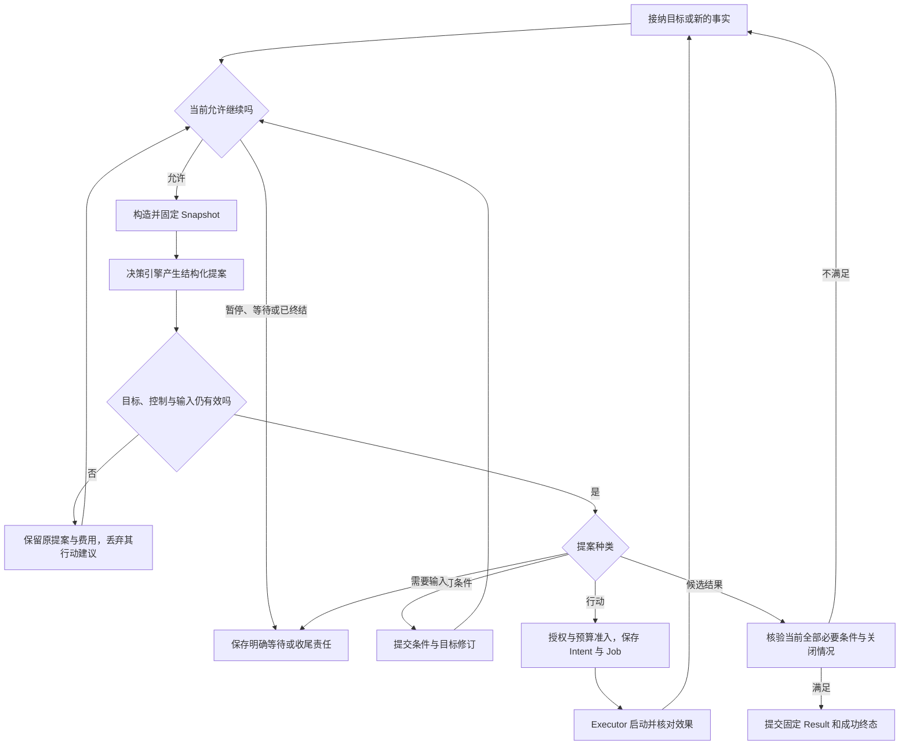
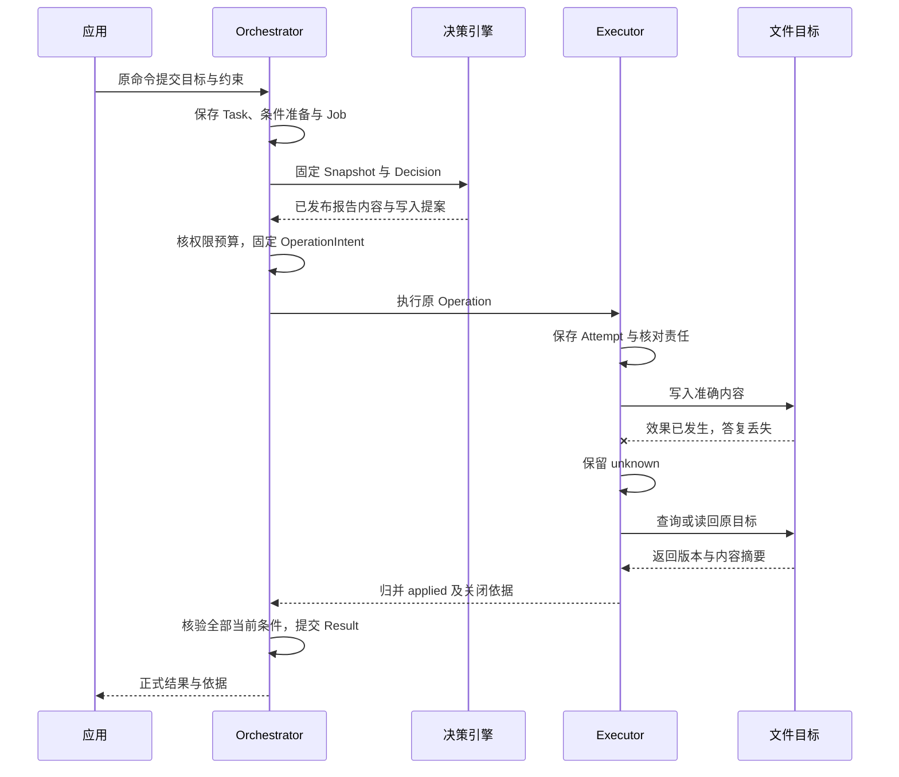

# 任务推进与完成裁决

Orchestrator 对用户目标承担持续推进责任。它固定目标和每次决策的输入，准入有界行动，归并实际效果，并根据当前证据形成最终结果。决策引擎、工具或远端 Agent 的成功回执不能直接完成 Task。

本章规定任务算法和并发规则。记录定义见[数据与存储](data-model.md)，调用字段见[接口与协议](contracts.md)，持久提交方式见[可靠运行](runtime.md)。

## 任务中的五种不同事实

| 事实 | 例子 | 能证明什么 |
| --- | --- | --- |
| 用户目标 | 比较三个方案，报告保存到指定位置 | 需要完成什么，不能证明已经获准读取或写入 |
| 决策提案 | 先搜索，再读取两份文档 | 决策引擎的建议，不能证明行动已经准入 |
| 行动意图 | 以准确内容写入准确路径 | Orchestrator 准入的行为，不能证明外部效果发生 |
| 实际效果 | 指定路径已写入版本 H | Executor 记录的事实，不能证明报告内容合格 |
| 条件判断 | 来源覆盖、结论质量和保存结果分别通过 | 当前条件的判断依据，最终是否完成仍由 Orchestrator 裁决 |

目标、条件和控制采用独立修订：`goal_revision` 随目标或条件实质变化递增，`control_revision` 随暂停、恢复、取消和目标修订等准入条件变化递增。`revision` 是 Task 对象的并发修改版本。三者不能用墙钟时间替代。

## 从原始输入建立可检查目标

应用先持久保存原文、附件引用和投递身份，再向选定 Orchestrator 提交。Task 接纳时保存原目标、预算、期限、策略版本及后续工作；这只证明目标被接纳，不证明目标已足够明确。

Requirement 表示目标中的一项具体要求，至少区分三类：成果必须具备的内容、外部效果、任务过程约束。每项包含原文来源、是否必要、判断规则及适用成果。规则模板或决策引擎可以提出候选；Orchestrator 负责采纳。明确要求不能被模型隐式删除或降级。

研究报告的示例条件如下。实际任务的对象、路径、时效与阈值来自用户要求和 TaskPolicy，示例不暗中增加通用要求。

| 条件 | 核验方式 | 失败处理 |
| --- | --- | --- |
| 覆盖用户指定的三个方案 | 对照当前原文和报告结构检查覆盖 | 缺项则补充，歧义则澄清 |
| 重要事实有实际来源支持 | 检查准确引用与取得的正文，开放质量评估注明限制 | 证据不足则补证或报告缺口 |
| 保存到获准的指定位置 | 独立读回路径、版本摘要和观察时间 | 未写入可重新规划；效果未知先核对 |
| 不超过费用和期限 | 预算与时间门禁，计入失败及核验成本 | 停止新增目标行动，继续必要收尾 |

条件集合必须记录对原始要求的覆盖判断。空集合、只有易检查的条件或缺失明确要求的集合不得进入完成判断。无法可靠提炼时请求用户澄清；不得让模型自己发明验收标准，再用该标准宣布成功。

第一版采用增量条件更新：未提及条件保留，同一语义条件去重，替换必须指出原条件及修订。条件实质变化时，Orchestrator 先提交新目标修订；同一提案中的行动与完成建议全部失效，随后重新构造快照。无实质变化不创建新修订。

## 一轮推进的算法

每次推进只执行有界阶段，不在数据库事务内调用模型、等待用户或等待网络。具体顺序如下：

1. **读取控制。** 核验 Task 状态、期限、预算及待处理输入。暂停或终态只运行符合策略的核对、结算和清理工作。
2. **构造上下文。** 在事务外取得获准材料，保留来源与缺口；提交前重查目标、控制和材料使用资格。保存不可变 Snapshot、Decision 派发意图、预留和 Job。
3. **请求决策。** 决策引擎按固定 Decision 身份接纳；进度输出是临时展示，完成的 Proposal 才能被采纳。模型不可用时保留失败或未知，不把空输出解释为完成。
4. **消费提案。** 在 Task 事务中比较原目标与控制版本，按 Decision 身份唯一消费。过期提案只保留记录和费用，不允许行动。新条件、请求输入、行动和候选完成分别处理。
5. **准入行动。** 在事务外准备准确资源与参数，事务内检查当前权限、预算、能力绑定和控制，保存不可变 OperationIntent、来源消费及派发 Job。
6. **归并反馈。** 接收执行负责方的版本化事实；合法迟到效果仍入账，不能因目标变化而删除。根据当前目标决定后续行动或核验。

默认每个 Task 同时只有一个可消费的前台 Decision。独立读取可以在一个提案中并行准入；第一版每批最多四项，且必须无前后结果依赖。本地准入全收或全拒，外部执行分别成功或失败。串行动作必须等待前一步实际结果，或使用显式依赖计划。

可直接查看[任务推进图](assets/task-flow.svg)。图中的返回路径均受累计预算、截止时间与无进展上限约束，不表示允许无限循环。

## 行动准入与真实启动

准入事务固定实际业务含义，包括收件人、路径、正文、金额、用途、Capability、Binding 和版本。规范化改变这些含义时必须重新获得适用许可。模型、插件或调用方不能靠自报“安全检查”绕过普通门禁。

准入成功后，Executor 在真实发送前再检查当前资源授权、任务启动窗口、组件就绪和资源占用。云端取消与端侧发送之间不存在分布式瞬时原子性；实际启动的限制由[有限使用窗口](governance.md)定义。

所有产生外部效果的路径都经过同样的门禁，包括工具调用、条件核验中的读取、计划步骤、程序环境的 hostcall 和 Agent 委派。程序化工具调用不得从沙箱直接取得供应商密钥或外网执行权限。

## 控制状态与恢复

| 当前状态 | 允许转换 | 触发条件与行为 |
| --- | --- | --- |
| active | waiting、paused、succeeded、failed、cancelled | 按明确事件或完成裁决；不得因 worker 退出直接变 failed |
| waiting | active、paused、failed、cancelled | 持久等待条件满足且当前控制允许时继续 |
| paused | active、failed、cancelled | 只有受信恢复命令可回 active；新输入不自动恢复 |
| succeeded、failed、cancelled | 无 | 终态不可复活；补充工作创建新 Task |

`waiting` 必须包含原因、负责方、关联对象、重新检查条件和最晚处理时间。例如“等待用户确认”“等待原写入效果”“等待获准设备上线”。禁止只有一句“稍后重试”而没有可恢复依据。

进入 failed 或 cancelled 时，必须在控制事务中同时保存 outcome 对应的 Result，说明已经取得的成果、未满足条件、终结原因和未结责任引用。它不是成功声明；后续费用与效果核对更新独立记录，不覆写固定 Result。

暂停和取消在 Orchestrator 的控制事务提交时，立即封闭该 owner 的新行动准入，并保存向已绑定执行端传播控制的工作。应用只能报告该提交已成立，不能报告所有远端动作已停止。

执行端收到更高控制修订后，对可证明尚未发送的旧修订 Operation 保存未发生且不会迟到的关闭依据；已经可能发送的操作继续核对。恢复任务只允许新一轮准入，不复活已关闭 Operation。若需要同样的动作，由新的 Decision 在取得原操作关闭依据后重新提出。

取消可以让 Task 进入 `cancelled`，但 `effects_closed`、`spending_closed` 和 `cleanup_complete` 分别继续更新。失败终态同样不抹去未结责任。用户接管设备时，设备本地资源门禁必须先阻止新的自动输入，再核对已经发出的操作。

用户补充要求必须绑定 active、waiting 或 paused 的原 Task 及预期目标修订。Orchestrator 先持久收紧旧目标的准入门禁，再处理完整新目标；旧提案不能继续采纳。该事务同时登记旧修订下活动 Delegation 的收紧或取消责任，具体继续规则见[多 Agent 协作](capabilities.md)。已经发出的操作照常核对。终态任务拒绝修改目标，应用可以提交关联的新目标。

## 完成判定

Task 的成功事务必须同时满足：

- 当前目标已完成提炼与覆盖检查，全部必要 Requirement 均有针对当前成果的有效判断。
- 外部效果条件具有目标系统证据，不能用用户喜欢成果或模型自评替代。
- 相关 Operation 的效果已确定，不存在仍可能改变成果的迟到行动。
- 内部子目标已终结，外部委托已证明不会继续产生目标行动；无法证明时不能忽略。
- 当前授权与证据适用性门禁允许使用成果；不存在尚未处理的目标修订或输入消费竞争。

Orchestrator 在同一事务锁定 Task，检查当前条件与完整未结责任索引，固定 Result 与终态，并保存交付 Job。列表分页和异步统计不能证明“没有未结操作”。操作建立与关闭必须和 Task 侧责任登记串行协调，完成前不得遗漏已经获准但尚未远端接纳的操作。

Result 固定目标修订、成果引用、逐条件判断、限制和完成时间。正式结果的外部导出可以随后恢复；如果“保存到某路径”本身是用户条件，该保存与读回必须先完成，不能归入完成后的可选导出。

普通开放质量允许 `assessed` 判断：规则、实现和范围明确并经过合同与反例测试，但尚无专项准确率校准时，结果必须明示限制。高影响自动判断或专项准确性声明必须另有独立校准证据。Evaluator 执行成功与条件通过是不同事实。

已成功任务后来发现证据缺陷时，保持原 Result 与终态，另附当前证据失效通知。活动任务不得继续依赖已失效证据。费用更正、清理和缺陷通知可以晚于任务终态。

## 防止无效循环

TaskPolicy 必须规定期限、总费用、模型调用数、工具调用数、同时在途数及连续无进展上限。一次进展必须对应新的适用证据、已确认效果、已解决条件或受信目标变化；重复改写计划不算进展。

达到限制时停止新的探索或行动，形成明确部分结果和未完成原因。不能通过更换决策引擎、子 Agent、工作者或操作名称重置累计计数。必要效果核对与费用收尾使用独立预留的有限额度；额度不足必须报告缺口并等待人工处理，不能无限运行。

## 报告写入丢回执的时序

图中省略搜索和内容质量核验的多轮步骤。它展示的是目标系统可核对时的恢复路径；不支持查询且无法排除迟到写入的目标必须保持未知，不能套用这个成功结局。

可打开[报告写入恢复时序图](assets/report-sequence.svg)查看各方交接。数据库提交与目标写入之间仍有失败窗口，图中没有假设跨系统事务。
