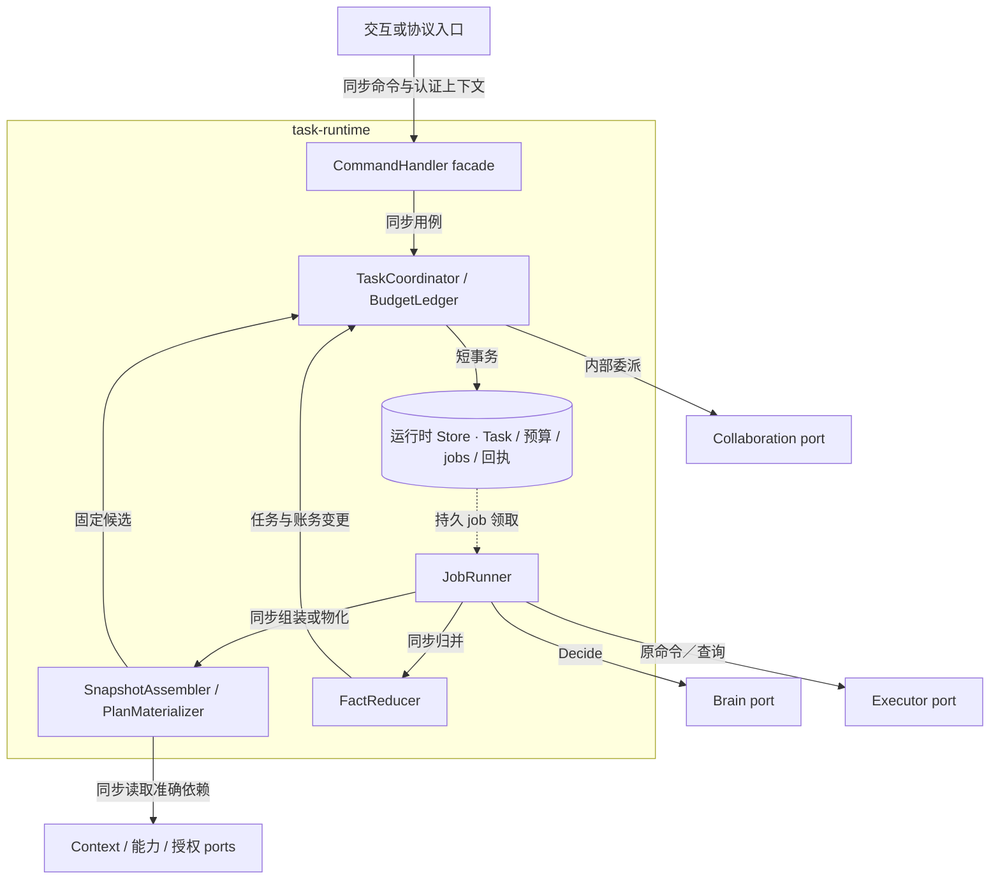
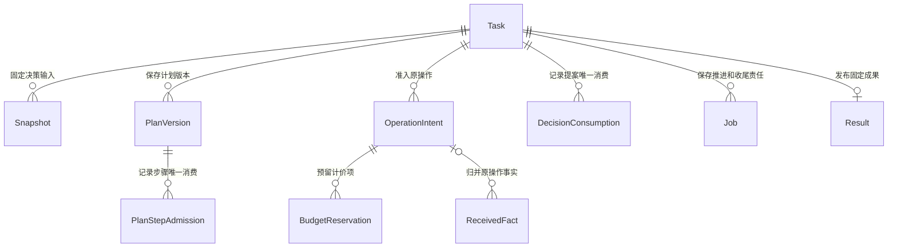
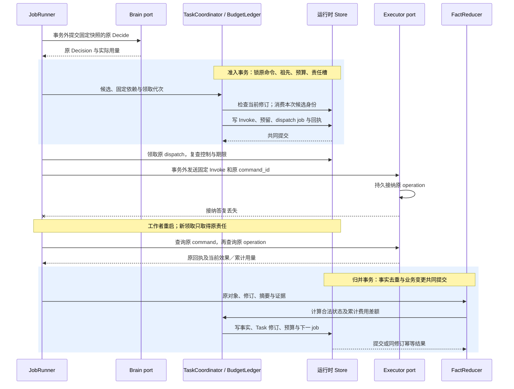
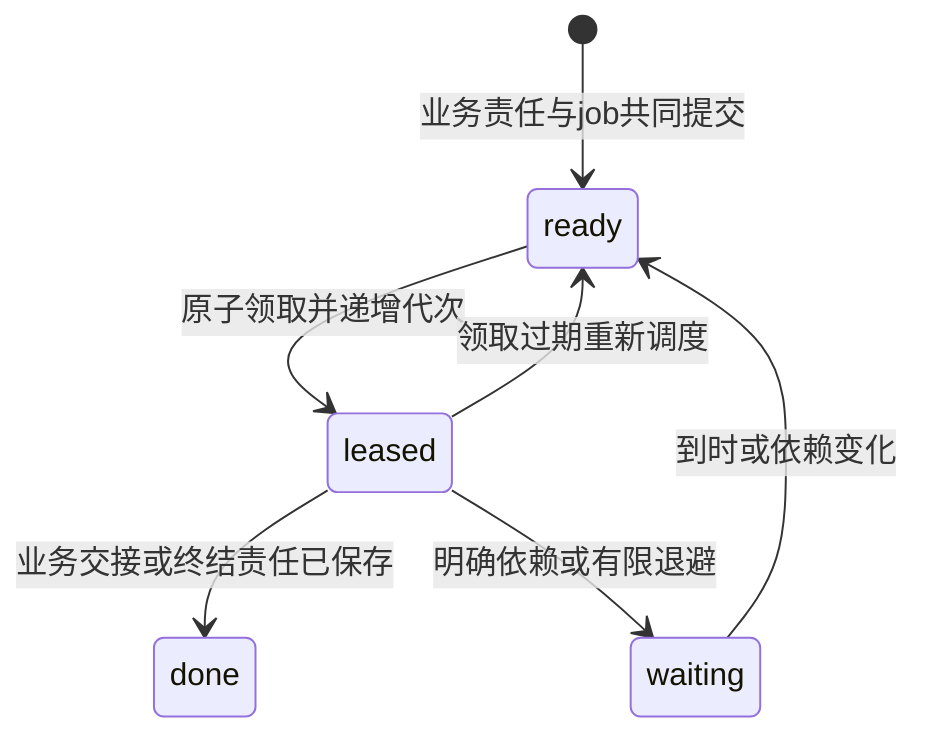

# 任务运行时实现：提交、推进与保留

[模块主线](README.md) · [大脑实现](../brain/implementation.md) · [执行实现](../execution/implementation.md) · [协作实现](../collaboration/implementation.md)

本页给出参考实现的内部组织和算法。Task、Result、控制和预算的对外含义仍以[模块主线](README.md#records)为准；精确消息字段由[共同 Schema](../contracts/schemas/protocol.schema.json)定义。实现可以改变表名、调度器和存储布局，但必须保留相同提交点、原身份和恢复结果。

首个宿主使用既定的本地数据库与 jobs；跨端沿原命令交接。没有可写权威存储、准确能力、可核对授权或有限费用边界时，不接纳依赖该前提的新行动。已经接纳的任务可以等待，原操作与收尾责任继续保存。本文的表和伪代码是实现规格，尚非运行代码或持久性验证结果。

<a id="module-shape"></a>
## 1. 模块形状与内部依赖

运行时是宿主装配的一个软件模块，对外 facade 是 CommandHandler；其后是处理任务用例的 TaskCoordinator 与 JobRunner、执行领域规则的 BudgetLedger／PlanMaterializer／FactReducer，以及存储和外部 port。名称表示参考实现的代码职责，当前没有相应运行代码；这些职责默认共进程、共 Home 提交域，不各建服务。依赖由宿主注入，领域规则不反向依赖 WSS／gRPC、数据库驱动或具体模型 SDK。



图建模固定 Home 内的代码调用依赖；实线是同步调用或事务读写，虚线是已持久 job 驱动后续工作，不代表新增消息中间件。返回值沿原调用返回。内部委派共享宿主事务句柄，Brain、远端 Executor 和其他远端 port 的调用均在事务外。异步答复先成为原对象事实，再由 FactReducer 归并；回调不能直接修改 Task。

| 内部职责 | 输入及产出 | 不拥有的裁决权 |
| --- | --- | --- |
| CommandHandler | 认证主体、固定命令；原 Receipt 或明确拒绝 | 不从连接或 RPC 超时推断业务失败 |
| TaskCoordinator | 当前任务、提案及精确依赖；状态变化与 jobs | 不自行声明外部效果 |
| SnapshotAssembler | 获准目标、证据、能力和上下文；固定快照引用 | 不静默取得新的资料用途 |
| PlanMaterializer | 固定计划、已核实前项输出；完整行动候选或缺口 | 不执行表达式，不把计划当权限 |
| FactReducer | 原 operation／decision／委派事实；新任务修订 | 不把较晚到达当较新事实 |
| BudgetLedger | 精确单位、预留、累计用量和封账证明；余额 | 不按超时释放未知费用 |
| JobRunner | 原 job、领取代次和固定工作输入；处理结果 | job 完成不等于 Task 成功 |

内部 port 返回结构化业务事实及错误。进程内接口可以直接传对象；远端代理增加原 Command／Receipt 和查询义务，不改变以上职责。

存储侧用一个运行时 Store 装配宿主 transaction、command_store 和 job_store；TaskCoordinator 通过它提交任务与责任，BudgetLedger 只写预算所属记录。远端 port 的代理负责协议编码、认证和原回执恢复，不替协调器作准入。将计划推进另拆为服务会复制任务修订、预算及控制判定，因此计划物化继续由既有 JobRunner 调用，只产出候选。

## 2. 持久表与索引

所有主键和关联键均带 `tenant_id`。下表只列为实现原子性和恢复所需的附加组织；Task 等业务字段沿原 Schema 保存。引用大正文时只保存不可变 ContentRef，不把用户内容复制进调度索引。

| 表 | 主键与必要字段 | 唯一约束／索引 |
| --- | --- | --- |
| tasks | tenant、task_id、Home、父任务、业务 Task、created_at | 主键；`(tenant, home, created_at, task_id)` 列表索引 |
| task_requirements | task_id、goal_revision、requirement_id、规则及来源 | 同目标修订内 requirement 唯一 |
| task_snapshots | task_id、snapshot_revision、精确依赖摘要、content_ref | 同任务快照修订唯一，不原地更新 |
| task_plans | task_id、plan_id、plan_revision、goal_revision、正文引用 | 计划版本唯一；当前可用指针由 tasks 保存 |
| decision_consumptions | task_id、decision_id、输入修订、采纳／失效原因 | decision 只消费一次 |
| plan_step_admissions | task_id、plan_id、plan_revision、step_id、固定候选摘要、operation／delegation 关联 | 同计划版本每步骤只准入一次，不复用 decision 消费键 |
| operation_intents | operation_id、task_id、不可变 Invoke、原 command_id | operation 唯一；原命令及摘要唯一关联 |
| received_facts | owner、object_id、revision、摘要、事实引用 | 同来源对象修订唯一；同修订异内容拒绝 |
| task_executor_bindings | task_id、executor_id、最近目标／控制修订 | 同任务执行端唯一；控制传播不能漏端 |
| jobs | job_id、业务关联、kind、状态、due_at、lease_epoch、lease_until、尝试数 | 可领取索引；同业务责任槽只有一个活动 job |
| budget_balances | task_id、unit、limit、spent、reserved | 每任务每计价单位唯一 |
| budget_reservations | reservation_id、task_id、unit、上限、累计已结金额、是否最终 | 每操作每计价项唯一 |
| budget_allocations | allocation_id、父任务、接收方、单位上限、期限、状态、关闭证明 | allocation 唯一；不可换接收方或单位 |
| command_receipts | logical_service、command_id、请求摘要、固定 Receipt | 原命令唯一；接纳与业务提交共事务 |
| closed_identities | 身份类型、ID、原服务、摘要、关闭依据、最小修订 | 长期禁止复用索引；无 TTL 删除 |

任务、操作和账务的写入通过一个存储适配层完成。SQLite 和云数据库使用不同领取语句，但适配层提供相同的条件更新结果；任何数据库重试都只重复事务内逻辑，不能重复一次外部调用。

`jobs` 的业务责任槽由 `(tenant, task_id, kind, object_id)` 确定。例如同一操作只需要一个自动 poll 槽；新的事实可以把 due_at 提前。已经固定原命令的 dispatch 槽不能通过更新 payload 变成另一个操作。

<a id="data-flow"></a>
### 2.1 核心对象关系与流转

Task 是本 Home 的状态聚合根；Snapshot 和 PlanVersion 是不可变输入，OperationIntent 是已准入的固定意图，ReceivedFact 是外部负责方的版本化事实。Job 只保存继续处理这些对象的责任。下图只列持久关联，箭头不表示调度顺序。



DecisionConsumption 与 PlanStepAdmission 是互斥的候选来源登记：一次准入只消费其中一种身份，并在同事务中关联原 operation 或 delegation。图仅展开 operation 分支；委派分支沿同样准入约束进入[协作对象关系](../collaboration/implementation.md#data-flow)。一个 Job 可引用多项固定依赖，业务责任槽仍只属于一个原对象。

| 阶段 | 对象由谁创建、保存与传递 | 消费、归并与释放条件 |
| --- | --- | --- |
| 接纳 | CommandHandler 将原目标交 TaskCoordinator；Task、预算和首 Job 共同持久化 | 原 Receipt 发布 Task 引用；JobRunner 消费工作领取，不消费掉业务对象 |
| 固定输入 | SnapshotAssembler 取得当前获准依赖，保存 Snapshot 与准确正文引用；JobRunner 交 Brain | Decision 绑定该快照；旧提案不能覆盖新任务修订，实际用量仍归原调用 |
| 准入行动 | TaskCoordinator 消费 Decision 身份或 PlanStepAdmission 键，保存 OperationIntent、预留和 dispatch Job | Executor 接收不可变 Invoke；派发重试只传同一原命令，不从 Task 当前值重新拼输入 |
| 归并结果 | JobRunner 取得原事实，FactReducer 按来源修订写 ReceivedFact | 同事务应用累计费用差额、条件证据、Task 修订及下一 Job；重复事实不重复扣费或唤醒 |
| 完成及清理 | TaskCoordinator 固定 Result、终态与控制／结算责任；清理器检查所有保留引用 | 正文和历史可按用途清理；未决原事实继续保留，最小关闭索引长期阻止身份复用 |

这条流转使模型输入、执行输入和最终成果各有固定版本。Result 不保存另一个可独立修改的任务副本；完成时引用准确成果和证据，之后新增费用或效果事实不能把终态改回 active。

<a id="21-锁定顺序"></a>
### 2.2 锁定顺序

所有任务变更先锁原命令键，再按根到叶顺序锁需要判断的祖先任务；同层按 task_id 排序。随后锁预算单位、操作意图与工作槽，各类内部按稳定键排序。控制涉及有界子树时同样遵守此顺序。后台事实归并也采用相同顺序，不能从预算反向锁祖先。

同宿主扩展若要将许可消费或执行接纳纳入共同事务，必须使用同一存储适配层声明的锁顺序。无法保证顺序或不共库时使用原命令交接，不假定两个连接构成同一事务。

事务失败时释放锁，读取当前修订后决定是否重新尝试。同一次用户命令的 `expected_revision` 不因数据库重试而改变；真实修订冲突产生固定拒绝回执。

## 3. 接纳任务及固定原命令

接纳入口先核对认证、消息结构、Home 路由、容量和期限，再执行以下短事务。准确策略及内容依赖在事务前取得并固定；事务内只检查它们仍具有可接纳资格，不能调用远端供应商。

```text
accept_task(command):
  begin
  if original receipt exists: compare fixed request; return original decision
  if closed identity exists: return gone or idempotency_conflict
  require now < command.expires_at
  require target Home == this logical authority
  require tenant capacity and finite task deadline/budget
  insert Task(active, running), original goal and budget balances
  insert first decide job using a unique responsibility slot
  insert applied receipt referring to this Task
  commit
```

同命令并发由唯一键串行。提交之后答复丢失，入口和客户端都查原命令；只有原提交不存在且仍可首次接纳时，才按原命令执行这段事务。固定拒绝也不被后来的能力恢复改写；用户改变请求时使用新命令。

任务 created_at 由 Home 保存。它决定列表稳定顺序，不用于判断跨端事实新旧；领域事实仍按修订比较。

## 4. 一轮工作如何形成行动

领取 decide job 后，工作者读取任务及祖先有效控制，形成快照。快照保存目标修订、策略、能力绑定、可用证据修订与材料准确版本；组装过程中权限改变或必需材料不可读时，保存具体等待原因。

Brain 调用有固定 decision_id。调用在任务暂停之后才返回时，仍保存模型费用和原决策记录；旧提案不获得行动效力。新的决策需要新的快照和新的 decision_id。

行动准入事务执行以下顺序：

1. 比较工作领取代次；比较当前 Task.revision 与候选依赖修订。
2. 检查 active、所有祖先的有效运行条件、目标修订和期限。
3. 按候选来源检查唯一准入键：Brain 提案检查 decision_id 尚未消费；计划物化检查 `(task_id, plan_id, plan_revision, step_id)` 尚未准入。两类都检查准确能力、固定 Schema 和目标约束。
4. 检查本次授权候选、资源冲突、先前未知效果与预算。
5. 保存固定 operation_id、Invoke、费用预留、原执行命令及 dispatch job。
6. Brain 候选保存 decision 的消费记录；计划候选保存 plan_step_admissions 及 operation／delegation 映射。递增任务修订，提交。

本轮可同时准入少量独立行动，但批次内每项仍有独立操作身份和预留。存在依赖、共享设备、重叠不可重复效果或需要前项输出时拆为后续轮次。

### 4.1 有限计划的确定性物化

Brain 可以返回版本化计划，格式见[大脑实现](../brain/implementation.md)。计划正文是有界 DAG，任务运行时只负责取出可开始步骤并把已有事实代入模板。它不拥有另一套流程状态或独立恢复队列。

每个计划步骤的进度由原 operation／delegation 和任务事实派生。`depends_on` 全部结束且可用输出已核实，才是候选；失败、未知或仍可能迟到的前项不满足条件。没有行动模板的步骤回到 Brain，请它基于当前快照提出下一步。

物化仅允许两种输入：计划内的字面值，以及指定前项已核实输出的 JSON Pointer。不得执行代码、网络检索、隐式字符串求值或任意表达式。指针缺失、输出版本变化或参数类型不匹配时产生明确缺口，不填默认猜测值。

```text
materialize(plan, step, facts):
  require plan.goal_revision == Task.goal_revision
  require every dependency is finished with usable verified output
  copy the fixed ActionInvoke or ActionDelegate template
  for each argument binding:
    resolve the exact original operation and output ContentRef
    read the declared JSON Pointer; fail if absent
    copy value to the declared argument field
  validate the completed action against its exact capability/agent schema
  return candidate for the ordinary TaskCoordinator admission transaction
```

上述过程可以减少不必要的模型往返，但不绕过每步准入。相同物化在重启后得到相同参数；计划候选查 plan_step_admissions 返回原 operation／delegation，不能再次产生副作用。第二个可执行步骤拥有自己的 step_id，可以在无需新 Brain 决策时独立准入。

保存计划的 Brain decision 只消费一次；后续步骤不伪造新 Decision，也不再次消费它。物化候选由运行时附加准确计划版本、步骤及当前输入快照关联，通过现有 decide／dispatch jobs 推进。候选来源只决定去重键，授权、预算、控制、目标检查及提交原子性仍完全相同。

计划修订废弃未准入步骤。已经派发的原步骤保留操作身份和事实，不能因为新计划删掉该节点就删除其预算或未知效果。GUI 动作仍需要动作后的新观察，不能从计划模板预先批准后续点击。

## 5. 派发与事实归并

dispatch 工作者在外部调用前重复有效控制及期限检查。失效但可证明未发送的本地意图可封闭；第一次调用前保存的原命令保持不可变。不能证明是否已经交给远端时，切到原命令查询和原操作核对。

Executor 的 applied Receipt 只确认接纳责任。运行时保存该回执后改为 poll 原 operation；变化通知仅提前其 due_at。无通知或进程重启都不影响查询责任。

应用事实时，按 `(owner, object_id, revision)` 去重：

| 输入与现有事实关系 | 本地动作 |
| --- | --- |
| 同修订、同摘要 | 返回既有归并结果；不再次记费或唤醒 |
| 同修订、不同摘要 | 记录负责方冲突，停止依赖该事实的新目标工作 |
| 较旧修订 | 可保留审计引用，不覆盖当前投影 |
| 较新修订且转移合法 | 更新投影、累计费用差额、Task 修订和后续 job |
| 终态被改为可发送或已实现效果被撤销 | 拒绝新投影，保留冲突及原证据 |

事实归并与下一项 job 同事务提交。取消任务仍接收效果和费用事实；它不会生成新的 decide 或写入成果工作。已具备的任务终态不能被迟到成功重开。

<a id="key-sequence"></a>
### 5.1 准入提交、丢答复与原事实恢复

以准入一次文件写入为例，下图展开模块内部提交点。决策请求与派发请求分别使用自己的原命令身份；图中恢复段只恢复已准入 Invoke，不重新调用 Brain 生成替代行动。



若第一段事务提交结果不明，先查原候选消费关联或原命令，不能再次预留。若派发后 Home 故障，Executor 仍拥有原操作核对责任；Home 恢复后读取它的事实。原 command 查询暂时不可达、原 operation 仍未知，或历史只剩 gone 时，保留缺口和预留，不能从缺答复推导 not_started。Brain 答复丢失也沿原 Decide 查询；任务修订失效只阻止行动准入，不抹掉已发生模型费用。

## 6. 控制、目标修订和完成竞争

暂停、恢复、取消及目标修订先在 Home 提交，再向执行端传播。控制事务根据 task_executor_bindings 建立逐端责任；绑定新执行端与派发必须共事务，因此不存在“已派发但不在传播清单”窗口。

对内部子任务，祖先变化在同一事务中更新受影响活动子任务的有效控制修订，并保存各自传播工作。子自身 control 不被父恢复覆盖。子树数量受任务容量和委派上限约束，不能在事务中递归扫描无限历史。

尚未派发的旧目标工作标为失效；已派发操作继续核对。新的目标与旧效果可能冲突时保留 effect 等待，直到有可验证的外部事实。`task.revise` 不修改已发生费用、单次许可消费或旧操作参数。

提交完成时锁任务、必要条件、受管委派及原效果投影，执行以下合取检查：当前目标修订一致；全部必要条件通过；所有内部子任务终结；外部目标行动已封闭；本任务及委派无未知或可能迟到效果。随后固定 Result、终态、控制传播及结果可查事实。

暂停允许既有证据完成；它禁止新的质量评估和行动。完成与取消由条件事务顺序决定：先提交终态的一方胜出，后一命令明确冲突或返回终态事实。费用未最终核清可以保守保留，不伪装成目标效果未知。

## 7. jobs 生命周期与有限调度



图只建模一项 job；Task 状态和外部效果独立。过期领取回到 ready 不表示外部动作未发生。

| kind | 每次处理的有界单位 | 自动尝试耗尽后 |
| --- | --- | --- |
| decide | 一次固定快照决策 | 记录依赖／费用缺口，等待或任务到期 |
| dispatch | 一次原命令提交或原回执查询 | 保留未决操作，转具体查询责任 |
| poll | 一次原操作／委派事实读取 | 停止高频查询，等待恢复事件或受信处置 |
| control | 一个执行端当前固定控制命令 | 保留逐端未确认，继续有限退避 |
| settle | 一个原计费项或 allocation 的累计结算 | 保留原预留与最小收尾责任 |
| extract | 一个独立获准的记忆提取请求 | 不改变原 Task 的完成结果 |

领取只锁 job；业务写入时再次核对 lease_epoch，保证旧工作者不能覆盖新结果。外部提供方返回的真实事实可以由新的归并事务按原身份收取，不依赖旧 worker 的领取资格。

默认先按用户轮转，再按用户内任务轮转；控制和收尾各保留至少一个本机槽。每类任务、提供方和资源的并发上限同时满足。阻塞 job 由 due_at 或具体对象变化唤醒，不进入模型空转。

恢复扫描分页读取未完成 job 和缺少工作槽的未决领域记录，补建时使用同一唯一责任键。这样，程序缺陷或迁移造成的孤立责任可被发现；扫描不能重新发明命令或操作身份。

## 8. 预算分配与最终结算

金额和用量采用精确十进制字符串，按声明单位独立比较。修改预算、预留调用和接收累计费用都锁对应 balance 行，维持 `spent + reserved ≤ limit`。未知费用保留上限；账单迟到只应用累计差额。

`task.adjust_budget` 输入是任务完整单位上限集合。单位集合不能借调额更换计价口径；输出 Task 只增加 revision、修改 limit，并按需解除 budget 等待。它不修改 spent、reserved、goal_revision、control_revision、暂停状态或 deadline，终态拒绝调额。

### 8.1 额度交接

`budget.allocate` 的信封目标为父 task_id。调用方固定 allocation_id、receiver_id、单位上限和 expires_at；父事务扣入 reserved，保存 allocation 与交接 job。applied 只证明父侧预留和交接责任，接收方尚未接纳时额度不能在任一新对象重新分配。

同 Home 子任务直接在共同事务内取得该分配；不同 Home 接收时验证原父权威、准确 allocation 和接收方绑定，在自身账本仅接纳一次。委派携带原分配依据，接收方不能自行填写另一份余额；跨端传输规则见[协作实现](../collaboration/implementation.md)。

`budget.settle` 的信封目标为 allocation_id，比较 allocation revision。输入 RuntimeBudgetClosure 必须绑定原 receiver、allocation、最终用量修订、全部单位及不可再消费证明。接纳方验证证明来自负责方且属于固定原记录；ContentRef 格式本身不证明可信。

```text
settle(allocation, closure):
  lock original allocation and parent unit balances
  require compared allocation revision and exact receiver
  require receiver has closed all new spending and reports final cumulative use
  require each unit is present once and total <= allocated bound
  move final actual amount from reserved to spent
  release only the difference; save closure and settled revision
  commit fixed Receipt and any parent continuation
```

同命令查询和重放返回原结算。另一命令带旧 allocation revision 必须冲突，不能双扣。分配到期只关闭新的消费资格；未证明远端封账不返还额度。父取消、子返回答案及租约到期都不替代封账证明。

### 8.2 跨 Home 接纳与预算关闭

跨 Home 子创建使用 task.submit 的可选 delegation_context，字段为 sender_home_id、parent_delegation_id、allocation_ref、allocation_command_id、permission_refs 和 ancestor_ids。sender_home_id 必须来自认证的 sender_service_id，不能用请求正文声明认证身份。普通任务提交没有该字段，沿原接纳行为处理。

接收 Home 先查询原 allocation_command_id 的固定回执，再通过 budget.read(role=owner) 核对分配当前仍为 allocated、准确修订、receiver、全部单位上限和期限。回执只证明历史接纳；当前已 settled、原记录 gone 或负责方不可达时，不据历史回执建立新子任务。

接收方持久保存 incoming_allocations，以原父 owner 和 allocation_id 为唯一键。子 Task、原委派映射、额度接纳和首 job 在同一事务提交；一个 allocation 只对应一个子任务。已有原委派映射的同意图重投直接返回同一子任务，不重复接纳额度。

| 方法及目标 | 输入与持久结果 | 成功与缺口 |
| --- | --- | --- |
| budget.read，目标 allocation_id | role=owner 返回 `{role, allocation}`；role=receiver 返回 `{role, receiver}` | owner 投影只由父预算负责方服务，receiver 投影只由原接收方服务；role 不改变认证服务身份 |
| budget.close，目标 allocation_id、路由原 receiver | sender_home_id、parent_delegation_id、allocation_ref、allocation_command_id、reason → RuntimeBudgetReceiver | 原接收方关闭该分配的新子接纳及新增消费门禁，保存收尾责任；closing 尚无最终证明，closed 才有 closure |

RuntimeBudgetReceiver 固定 allocation_id、parent_owner_id、receiver_id、parent_delegation_id、revision、state、可选 task_id、final_usage 和可选 closure。state 为 open／closing／closed；closing 和 closed 均禁止新的额度消费。parent 通过 receiver 投影取最终证明，再调用原 owner 的 budget.settle。

关闭与子创建争用同一 incoming_allocations 行。关闭先提交时，即使原创建随后到达且历史分配回执仍为 applied，也被长期关闭索引拒绝；创建先提交时，关闭封闭该子的新消费，保留所有在途费用并等待最终核对。原 task.cancel 仍单独负责目标取消，不能把预算关闭误称为目标动作已经停止。

未知 allocation 的关闭请求先按认证父 owner 保存最小禁止索引及核验 job。尚未取得原分配记录时返回 closing；取得准确单位且证实从未接纳、不会再接纳后，以零最终用量形成 closed 证明。无法查询原父时保持 closing，不虚构单位或释放余额。

父侧只能凭 receiver 的最终关闭证明结算。因关闭证明要求接收门禁已持久关闭，owner 当前查询与子创建之间发生结算竞争也不会重新开放消费；历史快照不具有覆盖接收方关闭索引的权力。

## 9. 查询、清理与长期最小索引

`task.list` 只列本 Home。首请求固定 created_at 上界；后续游标携带上界和最后扫描的 `(created_at, task_id)`。每页重新检查权限，跳过已删除／撤权项并报告 gaps；扫描上限到达时可返回不足一页并给出前进游标，不能为凑满数量无限扫描。

过滤集合和游标必须绑定同一认证主体与查询条件。服务验证游标来源或存储对应查询摘要；调用方传来的游标字段不是扩大披露范围的依据。新任务超过固定上界时留给下一次查询。

完整 Task 历史、模型正文和原回执按获准保留期清理；仍被未决效果、账务、输入或委派恢复引用的事实先保留。清理判断与新引用登记通过同一元数据事务互斥。

长期最小关闭索引保存身份类型、原服务／租户、不可复用 ID、必要请求摘要、终态及关闭修订。该索引不含原目标、参数正文、截图或模型内容，不按 TTL 删除。它是拒绝旧身份的依据，不是可恢复完整业务内容的备份。

完整回执已删除时，原命令查询返回 `gone`；同 ID 同请求的重投仍为 `gone`，不同请求为 idempotency_conflict。不能返回 not_found 后新建同身份。Task 关闭索引同样阻止终态身份再次提交为 active。

<a id="production"></a>
## 10. 生产部署、瓶颈与故障域

生产装配采用[公共可用性策略](../deployment-production.md#availability)：同一逻辑 Home 的无状态命令入口和 JobRunner 可以在多个可用区替换或扩展，权威记录仍落在同一数据库提交域。进程替换不改变 task_id→home_id。内部任务树共域；热点分区只为新任务树选择落点，不能把现存父子拆到不同库后继续声称原子控制。

| 扩展或串行单位 | 具体实现边界 | 代价与替代条件 |
| --- | --- | --- |
| 命令入口、固定快照读取、不同任务的 JobRunner | 入口无业务内存权威；领取按租户与任务公平分配，共用持久责任槽 | 增加 worker 可减少等待，不能消除同任务锁争用；模型并发单独受供应商额度限制 |
| 原命令与候选来源键 | 数据库唯一约束裁决重复；消费与意图、预算、job 同事务 | 不用进程本地锁代替跨副本竞争；重复请求优先读取原结果 |
| 一棵内部任务树的控制及预算 | 祖先按既定锁序、有限子树处理；同 Task 的目标与完成决定串行 | 大任务树会放大写事务和锁等待；先收紧深度／活跃子数，再考虑显式外部委派 |
| 账务与长期关闭索引 | 原 reservation／allocation 及计价单位串行更新；关闭键按原 Home 可查 | 正文清理不能降低全部元数据成本；按实测写放大和长期保留量配置分区 |

| 依赖中断 | 对已接纳任务的表现 | 新接纳及恢复边界 |
| --- | --- | --- |
| Home 数据库无可证明唯一写者或提交结果未知 | 原 jobs 和操作保持待核对；不能发布新的成功提交 | 停新行动与写入接纳；数据库平台完成同步记录恢复及旧主隔离后，按原身份继续 |
| Brain、Memory 或内容负责方不可达 | 固定调用／读取进入 dependency 等待；已知原效果仍可归并 | 不猜内容、不换快照绕过原调用；可独立完成的本地控制和账务继续 |
| Executor 或设备离线 | 原操作与逐端控制保持 pending，效果和费用保守保留 | 不新建替身操作；有限查询恢复后读取原对象，控制提交与全端生效分别展示 |
| 授权当前依据不可取得 | 保存原工作和已发生事实 | 禁止依赖新使用资格的行动；不能用旧快照许可无限延长窗口 |

只读副本或缓存可承担读取投影，但准入、完成、控制和去重必须回到权威事务。跨可用区数据库能力由部署平台验收，运行时不会用 job 租约代替选主。外部请求不占事务连接；固定输入准备和内容读取限制并发与字节量，防止慢依赖耗尽连接池。

按[公共容量方法](../deployment-production.md#capacity)分别测量接纳事务、候选准入、事实归并、祖先控制和恢复领取。至少记录事务 p95／p99、祖先与预算锁等待、每任务提交数、每租户最老 ready job 年龄、过期领取比例、重复事实比例、未决效果／预留年龄，以及关闭索引增长率。对原始错误率低但队列持续增长的情况，按排队年龄触发保护，不能只看入口 QPS。

过载顺序为限制新任务和新目标 job、限制同用户并发与快照字节、保留控制／核对／结算容量；已接纳责任不因队列满丢弃。验收须同时压入单租户洪峰、模型长尾和数据库切换，证明恢复积压有界且其他租户能前进。分区数和 worker 数由这些实验的故障剩余容量推导；本节不新增未经测量的吞吐承诺。

## 11. 可执行故障实验

每项实验从真实入口发起，在指定断点暂停工作者，恢复后读取原回执、业务行、jobs 和独立目标真值。以下仍是运行实现的验收规格；JSON 序列只检验其中可表达的字段及关联。

| 编号 | 初始状态与故障断点 | 恢复步骤及必须观察的结果 |
| --- | --- | --- |
| RT-01 | 两客户端提交相同 command；Task 插入后、事务提交前崩溃 | 重启并重投；一项 Task、一项首 job、一份原回执，未提交残片不存在 |
| RT-02 | 接纳提交后、回执送达前崩溃 | 查原命令得同 Task；Home 自行恢复首 job，不要求用户再提交目标 |
| RT-03 | Brain 已发送，暂停与旧决策返回竞争 | 费用保存；旧提案不准入；无新 operation，暂停既有证据完成仍可提交 |
| RT-04 | dispatch 已保存原命令，worker 失联后被重领 | 两个 worker 只能交接同一 operation；旧 lease_epoch 写入拒绝，原效果继续核对 |
| RT-05 | 文件写成丢答复，用户取消，随后成功事实到达 | Task 保持 cancelled；原文件版本、效果和费用更新；无第二次写入 |
| RT-06 | 父暂停与子创建竞争，子已有远端操作 | 取消／暂停事务顺序决定创建；全部受影响子门禁及传播 jobs 可查，父恢复不清子暂停 |
| RT-07 | 两并发行动各预留剩余额度的大部分 | 最多可满足不变量的事务提交；拒绝项不留下可派发意图 |
| RT-08 | allocation 答复丢失，子继续收费，父试图结算零费用 | 查原 allocation；缺闭合证明拒绝释放，最终累计差额只应用一次 |
| RT-09 | 完成核验读到必要条件后，目标修订抢先提交 | 旧目标 Result 不发布；新核验绑定新修订，旧操作事实仍可查 |
| RT-10 | 清理完整回执和终态 Task 后重放旧 ID | 返回 gone／冲突；最小索引仍在，无新 Task、Invoke 或预算占用 |
| RT-11 | 计划前项输出缺失 JSON Pointer，另一项仍未知 | 不猜参数、不执行模板；显示缺口或交回 Brain，原未知继续核对 |
| RT-12 | 任务分页期间撤权、新建任务并耗尽单页扫描量 | 新任务不跨上界进入旧查询；撤权项不披露，返回缺口及前进游标 |

实现交付应同时记录表约束、事务故障结果和调度负载。静态方法序列覆盖见[20-budget-allocation](../contracts/examples/protocol/20-budget-allocation.json)；它不能证明上述并发和磁盘故障已经通过。
