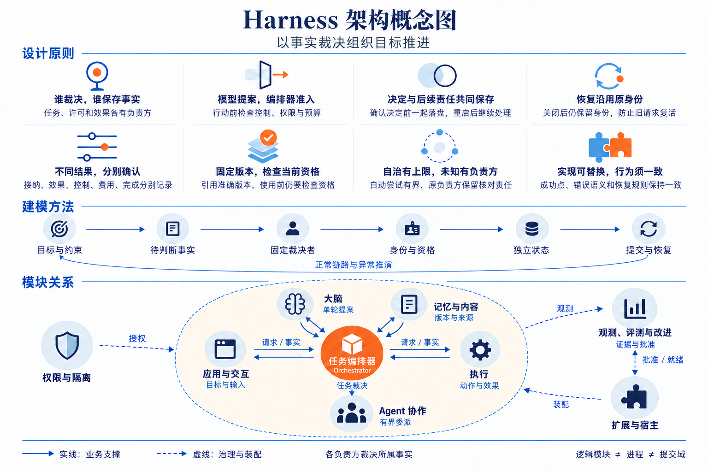

# 技术总览：事实边界、抽象原则与建模方法

[方案入口](README.md) · [可编辑系统全景图](diagrams/system-panorama.drawio) · [设计决策](decisions.md) · [共同契约](contracts/README.md)

Harness 接纳用户目标，组织大脑、记忆、执行与其他 Agent 持续工作。生产主线是面向多用户的分布式服务：各类事实由固定负责方裁决，每次决定和继续履行的责任一起保存，再依据实际证据推进目标。模型输出、网络答复、外部效果和任务完成各自有明确的确认点。

本文解释现有九模块的抽象依据及建模方法，供高级工程师先形成整体判断，再进入模块详设。它不新增行为合同；状态含义归所属模块，精确字段归同版 Schema，跨模块取舍归[设计决策](decisions.md)。当前仍是设计基线，内核、SDK、默认组件及运行验收的交付状态见[交付审查](review.md)。

下文的 owner（负责方）指某类对象的固定逻辑裁决者；Orchestrator（任务编排器）组织任务持续推进，每个任务固定归属的 Orchestrator 是其 owner，决定目标、行动准入、控制和完成。`orchestrator_id` 标识这项逻辑归属，实例重启或工作进程替换不改变它。Operation（操作）则是 Orchestrator 准入的一个有界行动及其持续核对责任，请求重复传送不会使它变成另一项操作。

概念图用直白标题和一句行为说明解释各项原则，再串起建模顺序与模块分工；双向联系概括请求和事实回传，治理连线作用于相应参与者。内部组件和具体交接继续按第 2 节进入可编辑全景图查阅。

## 1. 从用户目标看决定架构形状的矛盾

个人智能应用需要连续完成研究、写作、文件处理和设备操作，也要在用户修改目标、撤回许可或接管设备时及时收束。模型可以解释自然语言并提出行动，却无法仅凭自己的输出证明目标系统发生了什么。外部系统已经写入而连接断开、手机仍离线执行、模型费用迟到，都可能发生在任务已暂停或取消之后。

因此，最小闭环不仅要保存“下一步做什么”，还要保存“已经接受了什么、哪些动作可能发生、哪些责任仍须继续”。否则一次超时就会迫使系统在漏做与重复副作用之间猜测，用户也无法判断取消后的实际结果。

| 决定形状的矛盾 | 现有选择 | 谁承担主要代价 |
| --- | --- | --- |
| 模型需要灵活规划，用户约束必须持续生效 | Brain 依据固定快照提出一轮建议，Orchestrator 每次独立准入 | 多轮任务承担交接与过期提案重算；确定性计划步骤可减少模型往返 |
| 用户需要中断，外部动作与本地提交无法共同回滚 | 按有界 Operation 保存发送、效果与核对责任，控制逐入口确认 | 执行端维护门禁和在途记录；用户可能等待失联端确认 |
| 海量用户需要独立伸缩，任务准入又须共同裁决 | 连接接入、Orchestrator 应用、工作池和执行宿主分开部署；同提交域短事务，跨域持久命令交接 | 运营承担多副本和跨区基础设施成本；跨域调用维护原回执、查询、传播和部分成功的责任 |
| 多端可以独立接纳任务，共享事实又必须有唯一裁决顺序 | 每任务固定 Orchestrator，资源和许可各有固定 owner，跨 Orchestrator 额度预分配 | 分区时依赖原 owner 的步骤等待，未结额度暂时闲置 |
| 资料和组件需要复用，用户又能纠正、撤权和停用 | 精确版本引用与当前使用资格分别保存、逐次核验 | 使用端承担当前检查；持有者承担传播和清理责任 |

这些选择共同限定了保证范围：同提交域内需要共同裁决的事实尽量共库；跨域依靠原身份和证据恢复；无法核清的效果保留未知。模型质量、外部可用性与物理清理能力仍由各自实现和验收证明。任务处理不依赖全局有序事件账本，也不承诺外部效果的全局恰好一次。

## 2. 系统全景图的阅读方法

[system-panorama.drawio](diagrams/system-panorama.drawio) 是原生可编辑的逻辑全景图。图按任务处理、治理装配和外部依赖分区，九个模块分别作为容器，内部用组件框、依赖箭头和精简对象标注表达主要结构。先看模块间交接，再沿模块内部箭头识别入口、裁决、存储与恢复的分工；完整字段、保证边界和异常行为在本文及所属模块详设中查阅。

先沿任务处理主线阅读：交互把目标交给 Orchestrator；Orchestrator 组装获准事实，请 Brain 提出下一步；准入后的行动交给 Executor 或协作模块；效果、子任务结果和费用回到 Orchestrator，形成下一轮或正式结果。Memory／Content 提供可定位版本、来源和当前可用资料。用户输入在实际业务 owner 消费，界面只保存呈现与转交事实。

再读治理关系：实际使用端向 Security 取得使用依据，内容和资源入口落实当前限制；Extensions 装配精确实现并管理实际实例；Evaluation 汇集获准观测，在隔离评测中取得独立证据，再把批准交给 Extensions。治理关系约束任务链，也各自保留撤回、停用和恢复责任。

最后检查外部边界：模型提供方、API／文件／设备目标、其他 Agent 或另一 Orchestrator 都可能独立失败。跨过这些边界前，必须已经固定原对象和后续责任；返回时要确认得到的是接纳、效果、控制还是费用事实。

### 2.1 四种边界分别回答什么

| 视角 | 回答的问题 | 本方案中的例子 |
| --- | --- | --- |
| 软件模块 | 哪段代码封装哪些规则，通过什么接口协作 | 任务编排器把目标修订、准入、事实归并与调度放在一起；Brain、Memory、Executor 可独立替换 |
| owner／Orchestrator | 谁能最终裁决并保存某项事实 | Orchestrator 决定 Task；Executor 保存 Operation；资源 owner 裁决实际设备入口；Grant owner 裁决许可消费 |
| 进程 | 哪些职责共同故障、伸缩或隔离 | 一个宿主可装配多个模块；Brain 与索引工作者也可分池运行，仍读写原 owner 账本 |
| 数据库提交域 | 哪些决定可以原子提交 | 同库 Task、预算、候选消费与 dispatch job 可以共同提交；远端 Executor 接纳另有提交点 |

模块、owner、进程和数据库没有一一对应关系。Memory 模块包含记忆与内容两类 owner 职责；内容 port 也可随其他业务模块装配。Confirmation 能力由实际消费确认的业务 owner 保存并参与其事务，不因代码复用而形成一个跨库确认中心。云端多个工作进程共享原 Orchestrator 的权威库，接替工作进程不会改变任务负责端。

### 2.2 主要交接索引

图中编号标识一组业务关系。请求、回传或查询按该行解释，调用返回沿原关系传递；同一条关系上的不同方法可以有不同成功点。控制与装配边不表示业务事实自动同步。

| 编号 | 交接关系 | 传递的关键内容与回传含义 |
| --- | --- | --- |
| F01 | 交互 ↔ 实际业务 owner | 固定输入／控制命令、准确请求及预览；回传消费决定、任务事实或获准快照 |
| F02 | Orchestrator ↔ Brain | 固定快照、决策身份与限额；回传原提案、错误及模型用量，Orchestrator 再准入 |
| F03 | Brain ↔ 模型提供方 | 准确模型配置与获准输入；回传输出、请求凭据和用量，无法核实时保留缺口 |
| F04 | Orchestrator ↔ Memory／Content | 有界查询、精确内容引用与用途；回传当前获准材料、来源、修订及完整性 |
| F05 | Orchestrator ↔ Executor | 固定 Invoke、控制和核对请求；回传接纳、效果、费用及逐入口控制事实 |
| F06 | Executor ↔ 外部目标 | 原目标键、一次发送及查询／停止；回传目标凭据、实际观察或未知 |
| F07 | Orchestrator ↔ 协作 | 有界子目标、精确 Agent 绑定与预算；回传唯一子映射、进展和未结责任 |
| F08 | 协作 ↔ 外部 Agent／另一 Orchestrator | 原创建、控制、输入与查询；回传原任务、结果、费用及目标行动封闭依据 |
| F09 | 实际使用端 ↔ Security | 固定用途和使用身份；回传许可使用或有限租约，当前资源门禁仍单独检查 |
| F10 | 各事实 owner → Evaluation | 获准且脱敏的关联事实和观测材料；诊断采样不替代领域账本 |
| F11 | Evaluation ↔ Extensions | 精确批准、原激活命令及当前批准核验；回传实际版本、实例就绪和残留责任 |
| F12 | Extensions → 模块实现 | 精确安装锁、配置、隔离与生命周期管理；装配不授予用户业务权限 |

F09 和 F12 概括多方共用的边界关系，不能据此推导所有模块都由同一在线服务裁决。尤其 F10 的观测汇集不改变事实归属；丢失 Trace 或通知时，任务仍由原业务记录恢复。

[模块与数据 UML 图册](uml-models.md)按两种静态视角继续展开：组件页表达提供接口、内部职责与所需接口；领域页表达关键属性、事实归属与关联多重性。全局两页后接九模块各两页，关系成立的条件及完整定义在导读集中链接。

## 3. 八条抽象原则及其取舍

### 3.1 按事实裁决划分职责

从“谁有资格说这件事已经成立”划边界，可以把目标决定、许可消费和实际效果分清。Orchestrator 能裁决任务是否采纳一步行动，只有 Executor 及目标证据能说明动作效果；Grant owner 能允许使用资源，资源 owner 仍须检查实际入口。

同一任务修订下必须共同判断的准入、预算和后续工作留在 Orchestrator。把它们拆成独立服务会增加恢复交接，却没有增加独立裁决能力。真正需要独立实现、信任隔离或部署的位置，通过已有 port 分离；同库协作显式共享事务，业务表仍由所属模块访问。依据见[Orchestrator 内部依赖](orchestrator/implementation.md#module-shape)和[执行门禁](execution/implementation.md#module-shape)。

### 3.2 让提案与行动许可有一次明确交接

Brain 消费固定快照，返回 `act`、`need_context`、`request_input`、`complete` 或 `fail`。Orchestrator 根据当前目标、祖先控制、授权、能力和预算决定是否采纳；输入已过期时保存原调用及费用，再拒绝旧提案的行动效力。模型适配器只处理模型请求，不运行模型返回的工具。

这一选择让任务只有一套推进与恢复进度，代价是长 GUI 流程和多轮推理的交接次数。已确认计划可以由 Orchestrator 将准确前项输出代入后续步骤，再走相同准入，减少无必要的模型调用。若改成 Brain 自管长循环，仍须逐步提供等价的控制检查、恢复身份和可验证检查点，不能只减少接口次数。依据见[单轮决策](brain/README.md)与[计划物化](orchestrator/implementation.md#41-有限计划的确定性物化)。

### 3.3 把决定和后续责任一起提交

接纳任务时保存 Task、回执和首 job；准入行动时保存不可变意图、费用预留和派发 job；取消时保存终态、控制传播和原操作核对责任。这样，一份已返回的业务决定总能在重启后找到继续者。

`job` 是持久的待履行责任，最终业务事实仍在 Task、Operation 或所属领域对象上。领取租约只约束谁能提交本轮处理结果，无法撤回已经发出的网络字节。网络、模型和工具调用位于短事务之外；跨库之后双方分别保存责任，不能把本地共同提交的原子性带到远端。代价是增加少量业务记录和恢复扫描，换得接纳后的责任不依赖进程存活。依据见[提交边界](orchestrator/README.md)和[共同调用成功点](contracts/README.md)。

工作领取仍有效，不代表领取期间没有新增责任；完成工作槽前须比较当前责任版本。类似地，分配过序号不等于该序号之前都已提交，Memory 的索引和视图使用 owner 内共同提交的变化水位。两种比较分别防止新工作被旧完成覆盖、迟提交数据被游标跳过，完整规则归[工作领取](orchestrator/implementation.md)与[记忆索引和视图](memory/implementation.md)。

### 3.4 恢复沿原身份进行，关闭也保留身份

命令身份回答“这次提交处理过没有”，操作身份回答“这个有界意图发生了什么”，尝试身份记录一次实际发送。答复丢失时，先查原负责方、原命令和原对象；允许重投时仍保持原请求及原意图。修订冲突要求读取当前事实重新判断，不能只替换期望修订后盲发。

同键不同请求被拒绝，原回执查询不会延长启动窗口。完整材料清理后，长期最小关闭索引继续阻止旧命令、取消操作或终结任务复活；返回 `gone` 明示原完整依据已不可返回。它带来持续存储与备份成本，正文及敏感材料则独立清理。固定 TTL 无法证明取消先到时迟到请求已失效，因此当前不删除最后一份禁止依据。依据见[保留决策 D-11](decisions.md#retained-identities)与[命令恢复](contracts/README.md)。

### 3.5 分开接纳、效果、控制、账务与完成

`Receipt.stage=applied` 表示该方法规定的决定已持久保存；对 `execution.invoke`，它确认执行责任接纳；对 `task.cancel`，它确认 Orchestrator 取消决定。`Operation.effect=applied` 才表示声明的目标效果有证据，Task 的成功还需核验当前目标的必要条件。

独立维度让异常可以如实表达：任务已取消而写入未知，执行端已封闭后续发送而旧动作仍可能到达，目标已完成而最终账单尚未收到。字段比一个成功布尔值多，但调用方因此知道还能否行动、该查什么、哪些预留必须保留。相同原则也适用于输入转交与消费、记忆删除与物理清理、发布批准与实际就绪，详见第 4 节。

### 3.6 同时固定历史版本与检查当前资格

版本和摘要固定“当时使用的是什么”：目标、候选、能力、模型配置、内容、安装锁和报告都不能在原身份下悄悄换义。当前资格回答“现在能否继续用”：资料可能被撤权，驱动可能停用，报告可能因早期泄露失去正式资格，宿主也可能在重启后尚未就绪。

因此，准确引用并不自动授权，历史成功回执也不保证下一次使用有效。查询分页固定候选集合后，每页仍核对当前披露资格；不可变报告保留原摘要，当前资格另存；历史激活不代替本次实例的开放依据。重复检查增加读取和等待，但避免缓存、旧版本或旧批准绕过用户当前决定。依据见[记忆分页](memory/README.md#memory-pages)、[评测资格](evaluation/README.md)和[实例重启](extensions/implementation.md#key-sequence)。

### 3.7 自治有明确上限，未知有明确继续者

决策轮数、单步尝试、核对期限、查询扫描、预算、委派深度及离线窗口均有限。自动核对耗尽时，负责方保存未知、已取得证据、下一次可检查条件及所需资格，转入等待或受信处置。任务可以失败或取消，原效果和账务责任继续存在。

跨端即时停止和无限离线可用无法同时兑现。当前选择由 owner 拒绝新使用，已获知控制的入口封闭新启动，失联端受原有限窗口约束；跨 Orchestrator 未封账额度继续预留。普通模型 API 也分别声明客户端并发、发起速率、费用和远端物理并发能力。依赖任务承担等待和预留成本，部署为控制、查询、撤权与清理保留容量。依据见[有限离线](security/README.md#offline)、[模型恢复](brain/README.md#model-recovery)与[生产过载处理](deployment-production.md)。

### 3.8 替换实现须保持可验证的行为合同

Brain、Memory、Executor 以及 Agent、UI 和生命周期适配器可以改变内部实现。替换单位须同时提供它声明的方法、准确字段、权限约束、成功点、查询恢复和错误后的动作，不能只实现正常调用签名。普通 JSON 模型、不同索引或远端驱动都按实际能力声明保证。

内部表名、调度算法和进程布局属于参考实现；原身份、当前资格和用户可见行为属于共同合同。安装锁固定制品及依赖，兼容发布验证合同，宣称改善的发布另需完整评测证据。Schema 与序列校验验证结构和关联，实际隔离、耐久提交、恢复及目标效果需要运行证据。代价由适配器开发者承担，换得其他模块不必随替换修改完成规则。依据见[契约层次](contracts/README.md)、[扩展要求](extensions/README.md)与[验收边界](validation/README.md)。

## 4. 从目标到对象和提交边界的建模方法

### 4.1 先提出要裁决的问题，再给对象命名

建模沿同一条顺序展开：用户目标与约束 → 必须判断的事实 → 唯一裁决者 → 身份、修订和当前资格 → 独立状态 → 本地事务及跨域交接。每一步都用正常链和一个最可能推翻设计的异常验证；新增对象应对应独立事实或必须恢复的交接。

以保存报告为例，首先区分“候选质量达到要求”和“指定文件已保存该候选”两个必要条件。再问谁能分别证明它们，哪个版本的候选被评估和写入，答复丢失时能查到哪个原对象。由此得到 ConditionResult、OperationIntent、Operation 和 Result 的分工，而非先设计一个把全部状态塞进去的任务日志。

| 实际对象 | 裁决并持久保存的主体 | 身份与变化 | 决定当前能否继续的依据 |
| --- | --- | --- | --- |
| Task／Result | Orchestrator | `task_id`、固定 `orchestrator_id`；目标、任务与控制各有修订；Result 绑定完成时目标及成果 | 当前任务及祖先控制、期限、必要条件、未决效果和预算 |
| DecisionRecord | Brain | `decision_id` 固定输入快照；原模型调用另有 `model_call_id` | 原决策状态；Orchestrator 当前修订决定提案是否仍可准入 |
| OperationIntent／Operation | Orchestrator 保存意图，Executor 保存执行事实 | `operation_id` 固定意图；`attempt_id` 区分实际发送，Operation 修订归并事实 | TaskGate、准确绑定、许可使用、资源条件、期限和允许的恢复路径 |
| Grant／UseReceipt／UseSettlement | Grant owner | Grant 修订记录许可变化；固定 `use_id` 绑定意图；结算独立更新累计用量 | 当前许可及父链、固定启动窗口、实际端点与资源门禁；一次消费不会因零费用返还 |
| ContentRef／MemoryRecord | 内容 owner／Memory owner | 内容 `version + hash` 固定正文；记忆 `revision` 记录纠正及状态变化 | 来源与用途、当前记录和关闭修订、接收方及副本责任 |
| Delegation／Allocation | 父 Orchestrator 的协作与预算职责；接收方保存自己的接纳与关闭事实 | 固定委派、额度与唯一子映射；内部子 ID 和外部映射互斥 | 父及祖先控制、子目标范围；原接收方封闭、效果与最终费用依据 |
| Surface／InputSubmission／InputRequest | 交互保存快照和转交；业务 owner 保存请求消费 | Surface、输入和请求分别有身份及修订；目标命令首次固定 | 准确请求、未消费状态、预览版本和当前披露资格 |
| ConfirmationRecord | 实际消费确认的业务 owner | 固定原业务命令、规范意图和挑战；本人决定及消费可查 | 本人身份、期限、原命令绑定和未消费状态 |
| EvaluationReport／PlanEligibility | Evaluation owner | 报告摘要不可变；资格记录修订及使其失效的暴露 | 当前正式资格、完整门禁与受信批准，报告分数不自行授权 |
| ReleaseApproval／Activation | Evaluation 保存批准；目标 Extensions 保存激活和实例事实 | 固定批准范围、精确锁和原激活；Activation.revision 表示当前投影修订，generation 表示活动代际；新实例另取开放依据 | 当前批准、活动代际、实际就绪和残留工作，业务 Grant 另行成立 |

表中列的是建模所需的主要字段，完整必填性以[协议 Schema](contracts/schemas/protocol.schema.json)及所属模块为准。一个对象被别的模块引用或投影，不转移写权；修订只在同一对象及其 owner 内比较，不能用接收时间或另一对象的较大修订覆盖它。

### 4.2 互斥状态与独立维度分别表达

同一对象在同一状态维度中只能取一个值；可以同时成立的事实应分字段保存。判定时先选互斥分支，再对授权、控制、期限、费用等独立条件逐项检查，避免用一条 `else if` 隐藏另一项未解决限制。

| 建模对象 | 互斥的状态维度 | 同时成立或独立变化的事实 |
| --- | --- | --- |
| Task | `status=active / succeeded / failed / cancelled`，终态不可重开 | `control=running / paused`、多项 `wait_reasons`、`open_effects` 和布尔值 `accounting_open` 分别保存 |
| Operation | `execution_state=accepted / started / closed` | `effect=not_started / applied / not_applied / unknown`；`may_apply_later=true / false / unknown`；最终用量另由 `usage_final` 表达 |
| MemoryRecord／MemoryControl | 仍可披露的 MemoryRecord 为 `active / needs_review / disabled`；删除后的 `deleted` 由 MemoryControl／墓碑表达 | 逻辑禁止新使用之后，各持有者的物理清理仍可能 pending、residual 或 unknown |
| InputSubmission | `state=queued / sending / applied / rejected / withdrawn` | `withdrawal_requested` 与原目标命令消费分别核对；已发送输入不能直接改为成功撤回 |
| Activation | `phase` 表达原切换进度 | 历史启动依据、当前实例就绪、停止新使用、旧版恢复和残留分别保存 |

例如 `Task.status=cancelled`、`open_effects` 非空且 `accounting_open=true` 合法：目标推进已结束，原动作效果及费用仍待处理。`Operation.execution_state=closed` 只禁止再发送目标动作，旧动作在目标系统排队时仍可 `effect=unknown` 且 `may_apply_later=true` 或 `unknown`。两者都不能凭“已关闭”推导外部世界没有变化。

反过来，`Task.status=active` 与 `control=paused` 也合法。暂停阻止新决策、评估和行动；此前已经取得的证据若满足全部完成条件，Orchestrator 仍可以提交 `succeeded`。完成须核清本任务及委派的未知或可能迟到效果，费用未最终核清则可独立保守预留。完整约束见[任务状态](orchestrator/README.md#state)、[操作效果](execution/README.md)和[完成判断投影](contracts/examples/README.md)。

### 4.3 用提交点确定恢复责任

对每个写方法明确四件事：原请求在哪里固定，何种决定与责任共同持久化，答复能确认到哪一步，提交后失联由谁继续。外部网络调用放在两个本地提交点之间；无法把它合并进事务时，就显式保存这段不确定性。

| 本地提交 | 同时保存的最小事实 | 外部后续及继续者 |
| --- | --- | --- |
| Orchestrator 准入 | 原候选消费、操作意图、预算预留、dispatch job 及执行端绑定 | Orchestrator 工作者发送原命令，查原回执及 Operation |
| Executor 启动准备 | 原操作、Attempt、目标关联与核对责任，并检查当前门禁 | 实际资源入口再次复核后发送；Executor 记录目标证据或未知 |
| Orchestrator 取消 | 任务终态、控制修订、旧工作失效与逐端控制／核对责任 | Orchestrator 传播；执行和资源端报告已封闭入口及在途集合 |
| 业务 owner 消费输入或确认 | 准确请求的一次消费、业务决定、原回执和后续工作 | 交互查原目标命令；业务 owner 继续已接纳责任 |

同宿主、同信任边界且共库时可以合并适用事务，逻辑成功含义仍保留。拆到独立提交域后，发起方保存原请求与查询 job，处理方保存决定与自己的后续工作；返回已收到也不能让处理方丢弃尚未完成的效果核对。

## 5. 贯穿场景：保存文档丢失答复，随后取消

以下场景中，用户要求比较两个方案并保存报告。到写入阶段时，候选质量已有适用评估，写入及必要核查的用途已获准；宿主所用精确版本已通过安装和当前开放检查。示例中的“原写入”始终指同一个 `operation_id`，实际标识遵守共同契约。

### 5.1 从目标到原写入

应用把固定提交命令交给 Orchestrator。Orchestrator 同事务保存目标、条件、预算、原回执和首项工作，应用此时可确认任务已接纳。Orchestrator 从 Memory／Content 取得当前获准材料和准确版本，组装快照；Brain 返回该快照上的候选及行动提案。

Orchestrator 核对当前目标和控制、准确能力、权限与预算，保存原写入的 OperationIntent、费用预留和派发 job。质量记录、写入内容和后续读回必须绑定同一候选；评估通过不预先授权写入，写入也不自动授予读回用途。固定计划能够生成后续候选时仍须逐步准入。

Executor 接纳原 Invoke 后，保存 Operation、回执和执行责任。实际启动前取得原使用依据，再核对 TaskGate、资源、期限和准确绑定，保存 Attempt 后进入实际发送入口。此时 Orchestrator 可以知道原操作被接纳，却还不能宣布文件已保存。

### 5.2 写入已经发生，答复在哪里丢失

目标完成写入后，存在两个不同故障点，必须按保存的事实区分。

| 丢失的位置 | 已有权威事实 | 继续者与下一步 |
| --- | --- | --- |
| Executor 已保存效果，向 Orchestrator 的答复丢失 | Executor 有原目标凭据和 Operation 修订；Orchestrator 尚未归并 | Orchestrator 查询原 command／operation，取得既有事实后同事务归并与结算 |
| 目标答复尚未被 Executor 保存 | 目标可能已写入；Executor 只能证明已发送或可能已发送 | Executor 保存 unknown 和核对责任，使用准确目标关联及原操作证据查询；Orchestrator 保留 poll 与预留 |

两条路径都没有理由再创建一次“保存同一文档”。目标幂等能力只有在原键、参数、作用域和回放窗口仍有效时才允许原键重放；不可重复能力必须先确证未生效且不会迟到，原操作仍开放并获准时才可再尝试。切换 GUI、驱动或执行端是新的行动，不能用来绕开原未知。

### 5.3 用户取消先在 Orchestrator 成为事实

假设 Orchestrator 尚未提交成功终态，此时收到用户取消。Orchestrator 在任务条件事务中保存 `cancelled`、新的控制修订、停止新目标工作以及逐执行端控制和原效果核对责任，随后返回原取消回执。界面可以显示任务已取消，并同时展示外部控制待确认及原文件效果待核对。

取消与完成竞争同一任务决定：若完成先提交，取消不能覆盖已成功终态；本场景取消先提交，迟到证据不能把任务改回 `succeeded`。取消回执也不证明每个远端入口已收到控制，更不隐含删除已保存文件。

### 5.4 执行端封闭后续发送，保留在途事实

Executor 接收更高控制修订后，持久更新 TaskGate，并在实际受控入口封闭旧资格。控制若在发送边界前落实，可以证明相应动作未启动；控制在发送边界后落实，则关闭后续发送，保留在途集合并尽力停止、继续核对。只有全部必要入口确认后，Orchestrator 才能显示该执行端的相应控制已落实。

若原操作取消比 Invoke 先到，Executor 也保存 CancellationTombstone，迟到 Invoke 命中后不得启动。失联时已有控制窗口不会自动延长；原命令查询或重投返回原截止。执行端报告 `closed` 后，目标排队中的写入仍可能生效，需继续读取 `effect` 和 `may_apply_later`。

### 5.5 收束原效果与账务，不再推进原目标

Executor 取得可绑定原操作的写入证据后更新效果修订，Orchestrator 按原 owner、对象与修订归并，核清仍可能迟到的效果，并按累计用量差额结算。只有证明没有相关未决效果后，才移除对应 `open_effects`；只有取得最终费用依据后，才释放多余预留并关闭相应账务。

若当前文件已被用户修改，新的读回版本只说明当前资源变化，不能抹掉原写入曾发生的事实，也不能冒充原候选的完成证据。核对缺权限或依赖不可达时保存具体缺口；自动核对到上限后停止高频查询，保留原身份、未知和受信处置入口。用户补充证据须核验，普通“视为没执行”不能开放重复写入。

最终可能是“任务已取消，原报告确已保存，费用已结清”，也可能长期保持“任务已取消，原效果或费用待核对”。两者都符合已确认控制，区别来自实际证据。原版本及恢复资料按引用和许可保留，收尾继续保存恢复所需事实；取消不触发新的目标综合、报告保存、长期成功经验提取或补偿操作。完整场景及读回分支见[写入与读回异常](walkthrough.md#write-recovery)。

## 6. 部署映射与继续阅读

上述逻辑关系以生产分布式装配为基线：独立 WSS 网关负责端云连接，Orchestrator 应用处理接纳与控制，worker 按工作类别分池，执行宿主及评测按信任边界隔离。各角色可以装配多个模块，同一 Orchestrator 分区内需要共同提交的事实保留短事务；新增进程不新增业务权威，也不要求九套服务和数据库。

默认核心与宿主使用 Go，同进程通过 interface 协作，跨进程服务使用 gRPC。Protobuf 外壳承载现有严格 JSON，字段和 JCS 摘要仍由共同契约裁决；浏览器、CLI 和端侧宿主对云统一使用 WSS 双向长连接。发现、认证及大内容字节保留 HTTPS，上传／镜像管理通过 WSS／gRPC。连接、流和 goroutine 均是有界运行资源，不承担业务事实权威；详见[WSS 契约](contracts/transport.md)与[gRPC 绑定](contracts/grpc.md)。

生产默认托管 PostgreSQL、对象存储与连接池／平台能力，具体厂商不进入业务契约。PG jobs 保存持久责任，有限批量扫描保证未结工作可重新发现，通知仅加速唤醒；默认不增加独立 MQ 或 Redis。完整选择、故障行为与改变选择的条件集中在[存储与中间件](storage-and-middleware.md)。工作池按工作类型、提供方和租户份额伸缩，同一 Orchestrator 分区只有一个当前数据库写权威；共享设备不会因多副本增加控制权。

网关维持外部 WSS，内部 EndpointChannel 可以沿原负责服务重新绑定；内部委托的 30 分钟轮换不要求设备重新建链。重绑期间业务结果不明仍按原命令核对，内部连接更新不续期端侧认证。网关自身退出时，按排空及抖动重连规则恢复端云连接。外部会话与内部通道的身份、在途关联及限额见[生产连接规则](deployment-production.md#connections)。

已确认生产边界为单地域三个可用区，单可用区故障时已确认账本 RPO=0、控制与查询恢复 RTO≤60 秒；整地域故障走受限灾备恢复。数据库切换须先隔离旧主、证明已确认记录完整，并恢复第二耐久副本与同步提交条件，才开放关闭、撤权、原回执及未决工作的业务写入；内容依赖与剩余容量达标后，再逐步开放新接纳。条件不足时停止相应写入，保留可安全执行的诊断与核对；已跨发送门禁的请求仍可能继续，其效果与费用须按原身份核对。目标达成仍须实测，详见[生产拓扑与故障边界](deployment-production.md)。

完整单体仅用于开发与调试，复用相同 Go 接口、领域规则及恢复语义。本地 Brain、Memory、Executor 和本地 Orchestrator＋云能力、云 Orchestrator＋端侧能力的混合装配继续保留；全本地身份、许可和批准仍可就地核验。它们的功能通过不能替代分布式生产的多副本、容量与容灾证据。

连续阅读建议按要回答的问题推进，而非把九模块当作九个服务逐一拆建。

| 阅读问题 | 路径 |
| --- | --- |
| 用户目标怎样成为可解释的任务结果 | [目标与功能](goals.md) → [设计决策](decisions.md) → [任务编排器](orchestrator/README.md) → [大脑](brain/README.md) → [贯穿场景](walkthrough.md) |
| 外部效果、资料和用户控制怎样成立 | [执行](execution/README.md) → [权限与隔离](security/README.md) → [记忆与内容](memory/README.md) → [交互](interaction/README.md) → [协作](collaboration/README.md) |
| 如何实现、替换并运行这套闭环 | [部署基线](deployment.md) → [生产部署](deployment-production.md) → [存储与中间件](storage-and-middleware.md) → 各模块 `implementation.md` 的形状、对象与时序 → [扩展](extensions/README.md)与[评测](evaluation/README.md) |
| 哪些规则已经有机器资产，哪些保证还须运行取证 | [共同契约](contracts/README.md) → [方法与线格式](contracts/protocol.md) → [传输契约](contracts/transport.md) → [验收](validation/README.md) → [交付审查](review.md) |

修改方案时，沿“发起者、裁决者、持久事实、成功点、失败后继续者”复查受影响链路，再对照状态、图示、Schema 和例子。只改接口名称或总览连线不足以改变已确认保证；实际运行证据仍按各模块及系统验收分别取得。
