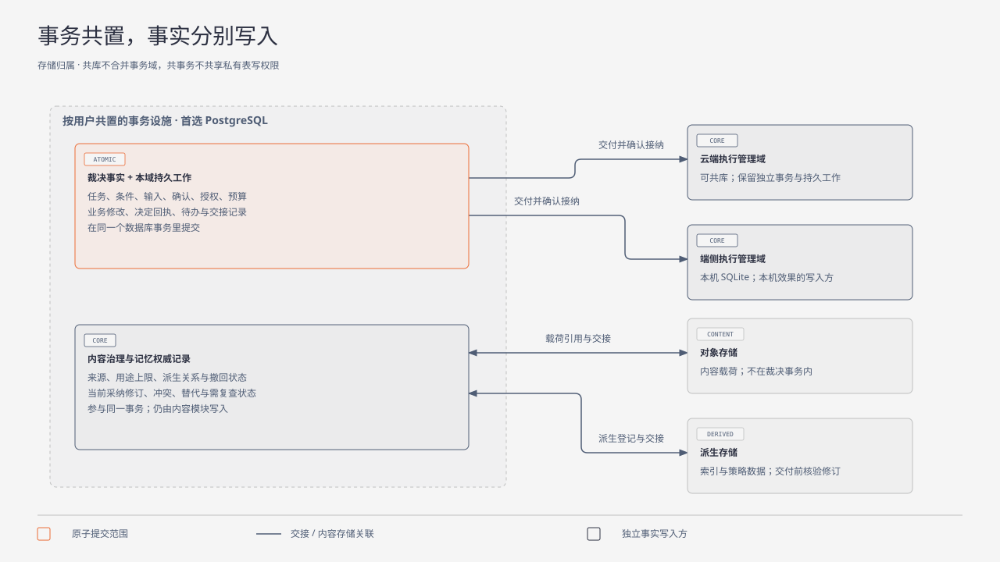

# 数据与存储

| 日期 | 修订说明 |
| --- | --- |
| 2026-10-04 | 初版：事实归属与事务域、按用户分片、存储选型、持久确认、跨域交接、备份恢复、模式迁移、删除与保留、容量估算。 |
| 2026-10-04 | 按 `CLAUDE.md` 写作要求和[文档规范](../conventions.md)修订用语：约束统一为"必须／不得""建议／不建议"，不再使用"应"；"执行端"统一为"执行端点"，发布回滚统一为"回滚"，授权统一用"撤销"。设计内容不变。 |
| 2026-10-04 | 按[架构评审处理记录](../../review/archive/round-1/README.md)修订：5.4 改为持久档位并新增平台准入表（RV4、RV5、[ADR 0001](../../adr/0001-durability-profiles.md)）；5.3 增加端侧账本的备份排除与导入隔离（RV7）；7.1 记录同库合并交接暂不采纳（RV12）；M1 范围和测试补充档位验证。 |
| 2026-10-04 | 按[第二轮评审处理记录](../../review/archive/round-2/disposition.md)修订：命令回执的唯一约束改为完整的 `CommandIdentity`（R2-03）；新增记忆记录（R2-09）。 |
| 2026-10-05 | 可读性：1.2 增加事务域、事实与存储的对应图。规则不变。 确认的消费按事项类型表述；准入接口改为引用核心契约 2.6；正文不再链接评审记录。 |
| 2026-10-05 | 项目目标 10.2 撤销 V2（手机 GUI）后同步：GUI 改为 M4 可选。 |
| 2026-10-05 | 存储归属图改为 SVG，突出原子提交、同一事务设施与独立执行管理域，说明运行记录旁路的省略。规则不变。 |
| 2026-10-05 | 模块名称统一为“执行网关”，职责与契约不变。 |
| 2026-10-05 | 图中的跨域交接改用具体行为说明，规则编号及解释放在图注或正文；交接机制不变。 |
| 2026-10-05 | 模块名称统一为“执行管理”，同步模块简称与图示；存储和连续性语境中的“账本”指其持久执行记录。职责与契约不变。 |
| 2026-10-05 | 模块名称由执行网关改回出口闸门，避免与网关与 SDK 撞名；图中分类标签改为中文；职责与契约不变。 |

- 状态：草稿
- 负责满足：G3、G12 为主，支撑 G1–G11；A3、A4
- 涉及场景：S1–S8，重点 S2、S4、S6、S7
- 上游：[项目目标](../project-goals.md)、[分层与模块](../layers.md)、[持久工作](../core/durable/README.md)、[任务编排](../core/tasks/README.md)、[内容治理](../core/content/README.md)

本专题约定**事实怎样持久保存、怎样跨域交接、怎样备份和恢复**。它不是一个新的业务裁决者，也不是可以改写其他模块事实的公共模块：每类事实仍只有一个写入方。

建议方案：

- **云端裁决域**放在按用户共置的关系型存储里（首选 PostgreSQL），准入是单分片的可串行化事务；
- **端侧执行管理**放在本机的 SQLite（WAL + `synchronous=FULL`）；
- **较大的内容载荷**放在对象存储，元数据和来源关系留在治理记录里；
- **跨事务域必须按 R7 交接**，即使物理上共用一个数据库；
- 数据库提交、责任接纳、外部效果是三件不同的事，分别记录。

这些选择背后有三条结论：原子事务只用于一个域内部；跨域责任靠"意图 → 接纳 → 回执"；外部效果靠目标系统的幂等或核对能力恢复。去重记录、执行尝试、删除记录和计费来源是**正确性数据**，不得按普通日志的方式过期清理。把数据库恢复到某个一致状态，只恢复了数据库自己的历史；与外部世界、当前授权、删除事实之间的关系，还要另外恢复。

## 1 职责与边界

### 1.1 事实归属与事务域

| 模块 | 唯一写入的事实 | 事务域 | 同事务要求 |
| --- | --- | --- | --- |
| 任务编排 | 任务、条件、控制、准入决定、Result | 裁决域 | 准入决定、动作意图、待办和命令回执一起提交 |
| 会话 | 消息顺序、输入、确认的消费、任务关联 | 裁决域 | 确认按事项类型，在授权签发事务或动作准入事务中只消费一次 |
| 授权 | 授权、委派、撤销、使用记录 | 裁决域 | 当前授权检查和使用记录与准入一起提交 |
| 预算 | 额度、预留、实际用量、结算、更正、退款 | 裁决域 | 预留与准入原子；计费来源去重与入账原子 |
| 内容治理（控制元数据） | 来源、版本、用途、保留、派生关系、撤回与清理状态 | 与裁决域同一事务设施 | 发布内容与来源、派生关系、持有方登记原子 |
| 执行管理 | 意图接纳、执行尝试、效果、核对、收尾 | 每个执行端点一个执行管理域 | 接纳与接纳回执原子；尝试在出口之前持久化 |
| 运行记录 | 跨模块关联轨迹 | 运行记录域 | 不参与裁决；原模块保留必要关联，轨迹可补投 |
| 持久工作 | 命令回执、交接回执、待办、领取与租约 | **嵌入各事实所属的域** | 与所属域的业务事实一起提交 |
| 出口闸门 | 没有独立的业务事实 | 使用授权、预算和账本记录 | 不以自己的内存状态证明已执行 |
| 记忆策略 | 策略自身可重建的数据 | 独立的派生存储 | 发布派生数据前在内容治理登记 |

两条容易被误解的规则：

- **持久工作不是一个横跨所有模块的远程队列数据库。**否则"业务事实 + 待办 + 回执"无法在本地原子提交；
- **共享事务不等于共享写权限。**裁决域事务由任务编排协调，但预算、授权、会话仍通过各自的内部写入逻辑修改所属事实（R3）。

### 1.2 存储分界

- 云端的四个裁决模块按用户共置；云端执行管理可以共库，但保留独立事务和 R7 交接；
- 端侧执行管理是本机效果的权威写入方；云端只保存它的接纳回执、报告和查询视图；
- 端侧专有内容的正文、索引、摘要和敏感来源信息不进入云端；可同步的元数据也必须单独授权；
- 数据库、对象存储和索引的连接属于受审查的核心实现，是可信基础设施 I/O，不经过出口闸门，也不作为扩展权限开放；
- 推理、记忆策略和执行适配器通过契约提交提议或回报，不持有核心表的写入凭据（R1–R6）。

下图画出事务域、事实和存储的对应关系。持久工作嵌入各事实所属的事务域；跨域交接分为发送方保存事项、接收方保存并接纳、发送方保存接纳回执三次提交，即使共库也不合并（[跨域交接规则 R7](../core/durable/README.md#43-跨域交接r7)）。

图中把业务事实与本域持久工作放在同一节点，表示原子提交；云端和端侧的执行管理节点也各自包含持久工作。正文、索引的连线表示存储关联与持久交接，不赋予它们裁决权。运行记录的旁路补投省略，规则见[运行记录](../core/trace/README.md)。

## 2 对象与状态

### 2.1 公共字段

| 字段 | 含义与约束 |
| --- | --- |
| `user_id` | 隔离和分片键；来自已认证的主体，调用方不得覆盖 |
| `record_id` | 逻辑标识；迁移和恢复后不变，不复用 |
| `owner_id` | 固定的逻辑负责方；与当前工作者、物理存放位置分开 |
| `revision` | 单对象递增版本，用于并发检查和拒绝旧报告 |
| `schema_version` | 记录格式版本；遇到未知的关键版本时不得裁决或派发 |
| `created_at`、`updated_at` | 诊断用；不作为跨端先后顺序或正确性的唯一依据 |

主键、外键和唯一约束都包含用户范围，例如内容引用是 `(user_id, content_id, content_version)`。不同用户的同名对象不会互相关联。全局命名规则见[核心契约](../core/contracts/README.md)。

### 2.2 关键记录

| 对象 | 关键字段 | 约束 |
| --- | --- | --- |
| 命令回执 | [`CommandIdentity`](../core/contracts/README.md#31-命令回执查询通知与错误)（用户、`issuer_id`、目标域、`command_id`）、命令类型、语义摘要、阶段（已受理／已决定）、决定、结果引用、提交版本 | 唯一约束建在完整的 `CommandIdentity` 上：同一身份只有一个决定，同身份不同内容报冲突；不同 issuer 的同名命令互不影响 |
| 待办工作 | 工作标识、任务、动作、交接、状态、到期时间、领取代次、租约截止 | 领取代次只控制协调写入，**不能证明外部动作没发生** |
| 交接记录 | 交接标识、来源域、目标域、载荷引用、语义摘要、状态、对方回执 | 标识、目标域和内容固定；不得因超时改派 |
| 准入决定 | 动作、任务、条件版本、授权、预算、确认、执行端点、参数 | 必要检查、预算占用、确认消费和意图原子提交 |
| 尝试与效果 | 尝试、动作、端点、发出状态、效果、证据、迟到生效可能、封闭版本 | 超时不写"未生效"；没有收尾证明不得封闭责任 |
| 预算与费用 | 预算、单位、额度、预留、已入账、预留标识、计费来源键、更正版本 | 金额用整数最小单位；不同币种或单位不直接相加 |
| 内容 | 内容、版本、来源、取得时间、存放位置、用途、保留、载荷引用、完整性摘要、治理版本 | 版本不可覆盖 |
| 派生与持有关系 | 来源内容、派生内容、持有方、表示类型 | 摘要、索引、缓存、运行正文都能追溯 |
| 记忆记录 | 记忆标识、当前修订、适用区间、采纳依据、冲突与替代关系、复查状态 | 权威记录，与内容控制元数据同在用户分片的事务设施中；检索索引是可以重建的投影，交付前核验记忆修订 |
| 删除工作 | 删除标识、内容范围、治理版本、需要回报的持有方、已收到的回执、备份期限、状态 | 没有持有方的证据，不得代填完成 |
| Result | 任务、条件版本、结论、证据、未决项、关闭版本 | 固定结论；迟到事实追加关联，不覆盖 |

供应商的计费来源必须通过原请求关联到唯一的用户和动作。同一账单的更正不得作为另一笔费用重复计入；更正和退款分别追加，退款不自动恢复可用额度。

### 2.3 状态门禁

各对象的完整状态由各模块定义（见[核心契约 2.5](../core/contracts/README.md#25-状态模型)）。从存储角度看，有几条门禁必须由事务和约束保证：

| 对象 | 门禁 |
| --- | --- |
| 命令 | 业务事实与回执同事务；"提交待核实"是调用结果，不得当作已中止 |
| 交接 | 对方的接纳事实与其回执同事务；重发使用原标识 |
| 待办 | 租约过期可以接替**协调工作**，不得据此再次产生外部效果 |
| 尝试 | **"可能已发出"在真正调用之前持久化**，消除"已调用但无记录"的窗口 |
| 效果 | "未生效"必须证明原请求不会迟到生效，不得只凭当前查不到 |
| 内容 | 发布时检查来源版本；删除后旧版本不得重新变为可用 |
| 预算预留 | 超时、取消和任务关闭都不自动释放可能已经发生的费用 |

非成功关闭的任务可以固定含未决项的 Result，但未收尾的动作仍保留原任务关联、原负责方和核对工作。**任务的界面终态不得抹掉责任。**

## 3 接口

以下是语义接口，不选定语言、传输或序列化格式。存储的事务句柄只在核心内部使用，不暴露给扩展。

### 3.1 统一的提交结果

| 结果 | 含义 | 调用方行为 |
| --- | --- | --- |
| 已提交 | 决定和回执达到了所声明的持久档位 | 按返回的原对象继续 |
| 确定中止 | 能证明这次数据库事务没有提交 | 可以按原命令重跑**数据库处理**（不重跑外部动作） |
| 提交待核实 | 无法证明已提交或未提交 | 查询原命令；不得新建责任 |
| 版本冲突 | 条件、控制或对象版本不匹配 | 读取当前事实，重新形成提议 |
| 幂等冲突 | 同标识对应不同的语义输入 | 拒绝，不自动换标识 |
| 权限无效或无法核验 | — | 停止依赖该权限的新使用和行动 |
| 预算不足或费用上界无法证明 | — | 拒绝准入 |
| 领取或路由代次失效 | — | 查询当前负责的域；保留原标识 |
| 依赖不可用 | — | 保存等待状态，不确认接下责任 |
| 版本不支持或重放窗口已关闭 | — | 明确拒绝，不得当作新请求 |

**"提交待核实"必须单独表达。**PostgreSQL 在取消同步复制等待时，事务已经在本地提交但可能还没复制，而且不能回滚（[syncrep.c，REL_17_0](https://github.com/postgres/postgres/blob/REL_17_0/src/backend/replication/syncrep.c#L231-L266)）；CockroachDB 也把"可重试"（`40001`）和"提交状态未知"（`40003`）分成两种错误（[事务](https://www.cockroachlabs.com/docs/v24.3/transactions)）。所以超时、取消或驱动报错不得统一解释为"事务失败"。

### 3.2 存储层承担的主要接口

| 接口（负责方） | 成功含义 | 错误与幂等 |
| --- | --- | --- |
| 准入（任务编排） | 准入门禁（核心契约 2.6）、意图、待办和回执已原子保存 | 版本、权限、预算、确认冲突；同标识返回原决定 |
| 查询命令（持久工作） | 原回执及其持久状态，或"仍待核实" | 在副本上没查到不得作为"未提交"的证明 |
| 接纳交接（目标模块 + 持久工作） | 目标已承担约定责任，回执已持久化 | 同标识异内容拒绝；重复返回原回执 |
| 领取、续租、完成工作（持久工作） | 新代次或完成回执 | 拒绝旧领取；不授权再次执行动作 |
| 记录尝试（执行管理） | 尝试已持久，准入和当前出口权限已核验 | 已封闭、端点不符、权限待核实时拒绝 |
| 记入用量（预算） | 唯一计费来源已入账 | 归属不明时等待核查；重复不累加 |
| 发布内容（内容治理） | 内容版本、来源、派生关系和对象引用已原子登记 | 未授权保存、来源已撤回、缺少派生登记时拒绝 |
| 完成裁决（任务编排） | Result 和终态已固定 | 条件变化、证据缺失、动作未收尾时拒绝成功关闭 |

通知只表示"有持久记录可以查询"。消费者需要接下责任时，必须保存自己的接纳回执。

## 4 关键流程

### 4.1 准入、交接与执行

| 步骤 | 行为 | 持久化点 |
| --- | --- | --- |
| 1 | 会话接纳输入并关联任务 | **D1** 裁决域保存输入、关联和原命令回执 |
| 2 | 任务编排固定条件版本；推理提交提议 | 推理调用经出口闸门，调用和费用记入原任务 |
| 3 | 裁决域核验条件、控制、授权、预算和确认 | **D2** 一个事务保存准入决定、预算占用、确认消费、动作意图、交接待办和回执 |
| 4 | 持久工作派发交接 | 派发前确认 D2 达到了所声明的持久档位 |
| 5 | 执行管理去重并接纳 | **D3** 执行管理域保存接纳事实、工作和接纳回执 |
| 6 | 裁决域记录对方已接纳 | **D4** 保存交接回执；丢失时查询 D3 |
| 7 | 执行管理准备尝试；出口核验条件、当前权限和端点 | **D5** 实际出口之前保存尝试和"可能已发出" |
| 8 | 执行适配器调用目标并回报 | **D6** 执行管理保存回报、证据、效果和后续工作 |
| 9 | 效果和费用交回裁决域 | 每次交接独立遵守 R7；费用按来源去重 |

D2 的事务体内**不得包含网络调用、模型调用和设备操作**，序列化冲突只重跑事务体。

D5 之后崩溃，即使实际上还没发送，也先按未知处理。这会造成保守的等待，但不会错误地重试一个可能已经发生的动作。

**为什么事务包住代码还不够。**PostgreSQL 的 `READ COMMITTED` 每条语句读新快照，`REPEATABLE READ` 仍可能出现序列化异常（[事务隔离](https://www.postgresql.org/docs/17/transaction-iso.html)）。普通的"读后写"会导致预算超用、确认被重复消费、按旧条件准入。裁决域初始采用 `SERIALIZABLE` 加唯一约束、版本检查和短事务；以后若改为 `READ COMMITTED` 加显式锁协议，必须专项证明所有相关写入都遵守同一协议。

**事务 outbox 是 R7 的第一步，不是全部。**outbox 把业务更新和待发事件放在同一事务里，但转发仍可能重复，需要接收方去重（[AWS 事务 outbox](https://docs.aws.amazon.com/prescriptive-guidance/latest/cloud-design-patterns/transactional-outbox.html)）。"消息送达"不得代替对方的持久接纳回执。

### 4.2 核对、取消与完成

| 路径 | 行为 |
| --- | --- |
| 未知效果 | 保存核对工作；对外查询同样经过准入和出口闸门，关联原动作 |
| 幂等重试 | 核验保存时和当前的能力声明、参数一致性和幂等窗口；保留原尝试标识和执行端点 |
| 用户取消 | **裁决域先保存控制版本和回执**，停止新准入；未发出的动作由执行管理封闭，可能已发出的继续核对 |
| 动作收尾 | 执行管理保存不可重新开启执行的收尾证明，任务编排接纳 |
| 成功关闭 | 锁定当前任务版本，核验必要的条件证据和全部已准入动作的收尾；**同一事务**保存 Result、终态和回执 |
| 迟到费用 | 任务关闭后仍按原来源记入预算；结果视图显示费用更新，不重写原 Result |

完成门禁只用权威事实和执行管理的收尾证明，不用可能落后的统计视图，也不看消息到达顺序。

**外部幂等有期限。**Stripe 保存同一幂等键的首次响应（包括 `500`），键至少保存 24 小时后可能被清除，清除后复用会产生新请求（[幂等请求](https://docs.stripe.com/api/idempotent_requests)）。所以"支持幂等"必须记录作用域、参数规则和保留窗口；长任务不得无限期地重试。

### 4.3 内容发布与删除

| 步骤 | 行为 |
| --- | --- |
| 准备保存 | 核验保存、处理和同步用途；保存准备记录、预期对象和持有方 |
| 写入载荷 | 写入不可变对象，验证完整性；**上传成功不等于可以引用** |
| 发布引用 | 治理事务保存内容版本、来源、派生关系和对象引用；再次检查来源没被撤回 |
| 上传后提交失败 | 准备记录用于查询；未发布的对象由受控回收处理，不当作可用内容 |
| 接纳删除 | 保存递增的治理版本、停止使用状态、清理工作和回执 |
| 传播清理 | 沿派生关系和持有方目录按 R7 通知：原始内容、记忆、索引、缓存、运行正文、对象版本和副本 |
| 确认完成 | 保存逐项清理证据；备份或离线端点未处理的继续显示为待处理 |

删除与派生发布竞争时，由治理版本决定能否发布。

**对象存储的删除结果不能证明 G9。**S3 单个对象的读写是强一致的，但不支持跨对象原子更新（[一致性模型](https://docs.aws.amazon.com/AmazonS3/latest/userguide/Welcome.html#ConsistencyModel)）；开启版本控制后，普通删除只加一个删除标记，按版本永久删除不会自动传播到复制目的地，Object Lock 保留期内不能删除（[删除标记](https://docs.aws.amazon.com/AmazonS3/latest/userguide/ManagingDelMarkers.html)、[复制范围](https://docs.aws.amazon.com/AmazonS3/latest/userguide/replication-what-is-isnot-replicated.html)、[Object Lock](https://docs.aws.amazon.com/AmazonS3/latest/userguide/object-lock.html)）。返回 `404` 或删除返回 `200`，都必须再核查版本、副本和保留策略。用加密擦除代替部分物理清理时，必须证明缓存、密钥副本和备份都无法再解密，不得默认宣称完成。

### 4.4 用户迁移

初期采用短暂停写，降低迁移的证明成本：

1. 持久标记迁移开始，封闭该用户的新准入和新出口，等待进行中的数据库事务结束；
2. 在源存储建立写入阻断；复制用户的事实、回执、待办、计费来源、治理记录和派生关系；
3. 核验数量、完整性和各域版本；
4. 持久切换路由代次，开放目标写入；源存储拒绝旧代次的写入；
5. 原交接和迟到回报继续用原标识处理；
6. 端侧执行管理和动作的执行端点不随云端迁移而改变。

**只更新路由目录、不阻断源存储写入，不足以避免双写。**GitHub 2018 年的事故中，43 秒的网络分区触发了跨地域的数据库切换，两地都出现了对方没有的写入（[事故复盘](https://github.blog/news-insights/company-news/oct21-post-incident-analysis/)）。选出新主不代表旧主已经停止写入，也不代表新主包含全部已确认的责任。

## 5 故障与恢复

### 5.1 通用故障

| 故障 | 负责方 | 恢复方式 |
| --- | --- | --- |
| 回执丢失 | 原调用方、持久工作；跨域时由发送方负责 | 查询原命令或交接；必要时重发同一个交接，目标返回原回执 |
| 进程崩溃 | 事实所属模块、持久工作 | 从事实、回执和待办恢复；接替者不改变负责方；尝试之后崩溃的进入核对 |
| 重复请求 | 持久工作、事实所属模块 | 唯一约束加语义摘要；同标识同内容返回原决定，不同内容拒绝 |
| 并发冲突 | 裁决域协调者、各事实写入方 | 确定中止的重跑纯数据库事务；版本变化则提议作废；不重复外部动作 |
| 依赖不可用 | 发起责任的模块 | 没持久保存就不确认；已保存的等待；权限或效果无法核验时停止相关推进 |
| 迟到结果 | 原执行管理负责方、预算、任务编排 | 按原尝试、来源和版本接纳；旧领取不得覆盖协调状态，但真实的迟到证据仍交原负责方处理 |

### 5.2 存储特有的故障

| 故障 | 负责方 | 恢复方式 |
| --- | --- | --- |
| 同步副本不足 | 存储实现、持久工作 | 停止关键确认和派发；**不静默降级为异步提交** |
| 提交时连接断开，或复制等待被取消 | 存储实现、原调用方 | 返回"提交待核实"；查询记录并检查持久屏障 |
| 新旧主库同时存活 | 存储运维、出口闸门 | 阻断旧主的写入和派发；不只依赖工作租约 |
| 对象缺失或损坏 | 内容治理 | 内容不可用，关闭依赖它的动作；恢复对象或重新取得，不伪造证据 |
| 磁盘满、SQLite 忙等待、检查点受阻 | 本机执行管理 | 有界等待，停止新出口，保留已有责任；释放空间后恢复 |
| 路由切换中断 | 迁移负责方、持久工作 | 按持久的迁移阶段继续或撤回；未经核验不开放双侧写入 |
| 迁移脚本部分成功 | 存储实现 | 查询实际的模式和迁移进度，继续幂等的步骤；不盲目重跑全部 DDL |
| 从旧备份恢复 | 恢复负责方、各事实模块 | 先封闭出口和读取，再补最新的治理事实，核对原动作和费用 |

**领取代次只能阻止旧工作者修改受控存储。**目标系统不检查这个代次时，它阻止不了旧工作者产生外部效果，所以租约过期不得直接触发非幂等动作的重试。

### 5.3 备份与恢复

| 数据 | 备份与恢复要求 |
| --- | --- |
| 裁决域、执行管理、持久工作 | 一致的基础备份 + 连续日志；核验命令和交接记录的完整性 |
| 内容载荷 | 不可变版本和完整性清单；清单里每个可用引用都有对应的载荷 |
| 删除、撤回和清理记录 | 业务数据按时间点回退后，**仍必须取得最新的有效记录**，不得随旧备份一起回退 |
| 记忆与索引 | 能从允许使用的来源重建；恢复后仍经治理检查 |
| 端侧专有数据 | 本地备份，或用户明确授权的备份；默认不上传云端 |
| 端侧账本与端点绑定密钥 | **排除在平台云备份和设备迁移之外**（Android 用数据提取规则配置，应用私有目录本身不足以排除）。任何导入的备份或迁移来的数据都进入恢复隔离，可用于核对，不自动获得发送资格。判据见[部署 4.2](deployment.md#42-断网与重连) |
| 密钥与配置 | 与载荷分开管理；恢复不得重新打开已销毁或已撤回的解密路径 |

恢复顺序：**阻断旧的运行者和出口 → 恢复存储 → 补上最新的撤权和删除事实 → 核验对象 → 恢复原交接 → 核对未知动作和费用 → 验证路由、版本、持久档位和治理水位 → 开放推进。**

如果恢复的缺口可能漏掉已经发出的动作，不得把恢复出来的 outbox 当作"全部未执行"；无法补齐时保留未知，不得自动重放。

**备份成功不等于能恢复。**GitLab 2017 年的事故中，数据库备份因工具版本不匹配一直失败，告警也没送达，最后只能用约六小时前的快照恢复（[事故复盘](https://about.gitlab.com/blog/postmortem-of-database-outage-of-january-31/)）。PostgreSQL 的时间点恢复需要基础备份加连续的 WAL，官方也说明 `pg_verifybackup` 通过不能代替实际的恢复测试（[PITR](https://www.postgresql.org/docs/17/continuous-archiving.html)、[pg_verifybackup](https://www.postgresql.org/docs/17/app-pgverifybackup.html)）。所以必须定期做恢复演练并独立监测。单分片完整恢复暂以 4 小时作为演练目标，实际恢复时间由数据量、日志回放和跨域核对共同决定。

### 5.4 持久档位

持久性按部署档位声明（[ADR 0001](../../adr/0001-durability-profiles.md)）。档位由部署配置固定，写入负责域配置和接纳回执；客户端不得通过请求降级，副本失联时不得临时降档，已有责任按接纳时的档位核查。

| 档位 | 实现方式 | 覆盖的故障 | 不覆盖 | 用途 |
| --- | --- | --- | --- | --- |
| 本地档 | 本地同步提交，同步屏障符合平台准入表 | 进程崩溃、重启；准入表中验证过的组合上的掉电 | 存储介质永久丢失 | M1、开发环境、端侧账本 |
| 云端生产档 | 跨可用区同步复制 | 以上全部，加主机和单个可用区永久丢失 | 多个可用区同时丢失 | 云端生产的权威记录 |
| （不作为档位） | 异步复制后立即确认 | 有丢失已确认责任的窗口 | — | 不用于关键事实 |

端侧账本的介质永久丢失后，云端把相关动作显示为"设备记录不可恢复，效果未知"，保留原负责方，不重发。这守住 G1，但不算满足云端生产档。

以上与 [G3](../project-goals.md#4-不变量) 一致。PostgreSQL 的 `synchronous_commit=off` 可能丢失已返回成功的事务；配置同步副本时 `on` 等待副本持久化，`remote_write` 不保证副本操作系统崩溃后仍在（[WAL 配置](https://www.postgresql.org/docs/17/runtime-config-wal.html)）。

**查到一行记录不等于满足持久要求。**存在"本地已提交、复制待定"的可能时，查询和派发必须通过复制水位或后续的同步提交屏障，确认记录已达到要求。

SQLite 的 WAL 允许读写并行，但同一个库同时只有一个写入者；`WAL + FULL` 在提交时同步，`NORMAL` 可能在掉电时丢失已提交的事务（[WAL](https://sqlite.org/wal.html)、[synchronous](https://sqlite.org/pragma.html#pragma_synchronous)）。配置正确也不够：SQLite 3.51.3（2026-03-13）修复了一个可能导致 WAL 损坏的竞争（[发布说明](https://sqlite.org/releaselog/3_51_3.html)），端侧固定的构建必须包含该修复。

**配置值不等于屏障。**`PRAGMA synchronous` 只决定何时调用 VFS 的同步；用哪种同步原语是另一回事。在 macOS 默认 Unix VFS 上，`synchronous=FULL` 不会启用 `F_FULLFSYNC`，还需要单独设置 `fullfsync=ON`（[同步标志](https://sqlite.org/c3ref/c_sync_dataonly.html)、[fullfsync](https://sqlite.org/pragma.html#pragma_fullfsync)）；普通 `fsync` 可能只把数据推到设备缓存（[Apple fsync](https://developer.apple.com/library/archive/documentation/System/Conceptual/ManPages_iPhoneOS/man2/fsync.2.html)）。

**平台准入表。**本地档的"掉电"覆盖只对准入表中列出的组合成立。准入表由部署层维护，数据库与[文件适配器](../adapters/file.md)共用，每个组合记录：

| 字段 | 内容 |
| --- | --- |
| 平台 | OS 与版本、文件系统与挂载方式 |
| 数据库 | SQLite 构建与 VFS、`journal_mode`、`synchronous`、`fullfsync` 等同步配置 |
| 文件 | 文件替换和目录同步使用的原语 |
| 覆盖 | 进程崩溃、掉电分别声明；介质永久丢失始终不覆盖 |
| 证据 | 验证方法、日期和结果；杀进程测试不得记作掉电验证 |

每条写连接（含连接池新建的连接、迁移脚本和恢复连接）打开时核验实际设置，不符则拒绝写入关键责任。屏障不可用、同步报错或平台组合不在准入表中时，不开放依赖掉电保证的能力。M1 只在一个开发平台组合上验证；端侧平台在 M3 逐个加入。

## 6 不变量落实

| 不变量 | 怎样保证 | 怎样验证 |
| --- | --- | --- |
| G1 | "提交待核实"和"动作未知"分别记录；超时不写未生效；重试前检查核对证据或有效的幂等保证 | 在提交和外部调用前后断连、崩溃；确认没有新标识绕过未知 |
| G2 | 当前条件证据 + 全部已准入动作的收尾证明；Result 与成功终态原子提交 | 条件修改、迟到效果、落后视图与完成裁决并发 |
| G3 | 事实、待办和回执同事务；确认和派发都检查所声明的持久档位；写连接打开时核验同步配置 | 每个持久化点前后杀进程；复制待定时不得确认；本地档另做掉电或等价的存储故障模型测试 |
| G4 | 准入记录固定条件、授权和预算；尝试先持久化，出口再次核验 | 删掉任一必要依据，出口必须拒绝 |
| G5 | 扩展没有存储写权限和直接的外部凭据；外部效果都关联准入和尝试 | 模型、工具、摘要、嵌入和设备出口的覆盖测试 |
| G6 | 提议和准入决定分开存储、分开写入方 | 伪造成功或授权的提议改变不了裁决状态 |
| G7 | 保存授权的来源和范围；委派写入时核验不扩大 | 并发撤销、扩大范围、旧版本委派都被拒绝 |
| G8 | 用途分开保存；使用时查当前授权和治理状态 | 陈旧的检索凭据、缓存、离线端点 |
| G9 | 完整的派生和持有关系；删除状态单调推进；完成需逐项证据；恢复先过滤 | 历史版本、副本、索引、缓存、旧备份恢复 |
| G10 | 计费来源唯一归属；重复不累加；更正和退款独立追加 | 重复账单、乱序更正、关闭后的迟到账单 |
| G11 | 任务负责方和动作端点固定；工作者可替换，责任不变 | 租约过期、迁移、断网、重启后不生成替代任务，不改派动作 |
| G12 | 带用户范围的主外键、权限检查、存储策略、缓存键和资源配额 | 跨用户引用、连接池身份残留、热点、费用归错用户 |

**分片不是隔离的证明。**按用户共置只提供局部性；错误的外键、缓存键、数据库角色或资源分配仍会破坏隔离。PostgreSQL 的表所有者、超级用户和带 `BYPASSRLS` 的角色可能绕过行安全策略（[行安全](https://www.postgresql.org/docs/17/ddl-rowsecurity.html)），所以行安全只能作为额外防线。

## 7 取舍

### 7.1 已选方案

| 选择 | 得到 | 付出 |
| --- | --- | --- |
| 裁决事实按用户共置 | 准入原子，共享预算一致 | 单个用户的热点不能靠拆分任务来分摊 |
| 共库也保留 R7 | 以后拆进程、拆端云时故障语义不变；只有一种交接实现要测 | 更多回执、待办和提交。同库合并为一次事务的方案已评估，M6 测量后再议 |
| 持久性按档位声明 | 每个档位的承诺都有对应机制和验收方法 | 端侧账本不享有云端生产档的保证 |
| 裁决域默认可串行化 | 正确性容易表达 | 冲突重试和热点竞争 |
| 大内容外置到对象存储 | 降低数据库复制和备份压力 | 发布、孤儿回收和副本清理更复杂 |
| 关键记录同步确认 | 故障后仍有责任依据 | 延迟增加；副本不足时停止推进 |
| 删除先停用、再验证清理 | 及时阻止受控使用，进度真实 | 完成可能要等端点或备份 |
| 最小去重记录长期保留 | 迟到的请求不会被当成新责任 | 容量成本持续存在 |
| 当前事实表 + 不可覆盖的关键记录 | 查询直接，恢复可以解释 | 需要逐项规定哪些记录不得覆盖 |

### 7.2 比较过的方案

| 问题 | 方案 | 结论 |
| --- | --- | --- |
| 事务域 | 整个核心一个大事务域 | 不采用：覆盖不了端侧执行管理，省略交接违背 R7 |
| | 每个逻辑模块一个独立数据库 | 不采用：准入要跨任务、会话、授权、预算协调 |
| | **上游规定的逻辑事务域，物理存储可以共用** | 采用 |
| 记录方式 | 所有状态都从事件流重建 | 不作为默认：事件升级、敏感内容删除、重建都复杂；错误的重放可能重新派发动作 |
| | 只保存最新状态 | 不采用：解释不了重复请求、未知效果和迟到账单 |
| | **当前事实 + 不可覆盖的决定、尝试、回执和费用记录** | 采用；历史用于解释和恢复，**不因历史事件再次出现而重新执行** |
| 分片 | **按用户分片**（执行和大内容可以独立分布，但不拆散裁决事实） | 采用。Citus 建议相关表使用共同的租户分布键，同键数据共置后单组分片支持多语句事务（[Citus 12.1](https://docs.citusdata.com/en/v12.1/sharding/data_modeling.html)） |
| | 按任务分片 | 不作为默认：共享的预算和授权与任务分离，准入跨分片 |
| 跨域操作 | 全局两阶段提交 | 不作为默认：包不住离线设备和第三方效果；准备事务需要外部管理器，长期持锁（[PREPARE TRANSACTION](https://www.postgresql.org/docs/17/sql-prepare-transaction.html)） |
| | **持久意图 + 接纳去重 + 持久回执（R7）** | 采用 |
| | 业务写入后直接发消息 | 排除：崩溃会丢责任 |
| | 自动补偿式 Saga | 排除为默认：补偿本身是新动作，上游不提供自动补偿 |
| 云端存储 | **按用户分片的 PostgreSQL** | 优先验证 |
| | 分布式 SQL（CockroachDB、Spanner） | 实测证明分片运维或跨地域需求超过前者时再采用；它们能提供跨分片原子性，但不消除协调成本，也包不住第三方效果（[Spanner 论文](https://www.usenix.org/system/files/conference/osdi12/osdi12-final-16.pdf)） |
| 小载荷 | 允许随治理记录存储，大的外置 | 阈值按实际内容大小分布和备份成本确定 |
| 模式迁移 | 停机一次迁移 | M1 可用：先封闭出口并验证恢复 |
| | **兼容扩展 → 分批回填 → 切换读取 → 延后收缩** | 生产默认 |
| | 假定数据库的在线 DDL 自动解决兼容 | 排除：PostgreSQL 并发建索引不能放在事务块里，失败会留下无效索引；CockroachDB 部分多语句 DDL 可能部分提交（[CREATE INDEX](https://www.postgresql.org/docs/17/sql-createindex.html)、[CockroachDB 限制](https://www.cockroachlabs.com/docs/v24.3/online-schema-changes#known-limitations)） |
| 线格式 | JSON + 显式模式版本，或 Protobuf | 不在此选定；无论哪种都必须固定标识、错误语义和语义摘要规则，**不得直接对序列化字节计算幂等摘要** |

按用户分片、持久档位的故障范围、删除与备份的语义、记录和协议的兼容策略，都是难以撤回的决定，实施前必须写成 ADR。

## 8 待定事项

### 8.1 规模估算

以下全部是**待验证的假设**，用于确定压测布置，不是性能承诺。设日活用户 100 万，每个动作（含模型、工具和辅助调用）约 10 次持久提交，高峰系数 10：

| 情景 | 每人每天任务 | 每任务动作 | 动作/天 | 平均动作/秒 | 高峰提交/秒 |
| --- | ---: | ---: | ---: | ---: | ---: |
| 轻量 | 2 | 4 | 800 万 | 93 | 约 9,300 |
| 基准 | 6 | 8 | 4,800 万 | 556 | 约 55,600 |
| 重量 | 20 | 20 | 4 亿 | 4,630 | 约 463,000 |

基准情景的数据增长（单副本、不含索引）：

| 数据类别 | 假设口径 | 每天 | 示例保留 |
| --- | --- | ---: | ---: |
| 任务、条件、会话关联、Result | 每任务 3 KB | 18 GB | 30 天 0.54 TB |
| 动作意图、尝试、效果、费用 | 每动作 4 KB | 192 GB | 30 天 5.76 TB |
| 命令、交接、回执、待办 | 每动作 6 条 × 400 B | 115 GB | 30 天 3.46 TB |
| 内容元数据 | 每动作 2 条 × 500 B | 48 GB | 30 天 1.44 TB |
| 运行关联 | 每动作 6 条 × 250 B | 72 GB | 30 天 2.16 TB |
| 派生关系 | 每动作 2 条 × 100 B | 9.6 GB | 30 天 0.29 TB |
| **关系型合计** | | **约 455 GB** | **30 天约 13.6 TB** |
| 内容载荷 | 每动作 20 KB | 960 GB | 90 天 86.4 TB |

还要计入：索引和膨胀（关系型数据的 1.5–2.5 倍）、三副本、备份和 WAL；长期保留的去重记录（基准每天约 2.9 亿条，压缩到 64 B 保留 180 天约 3.3 TB）；长期记忆和向量（每注册用户 100 条记忆、1536 维向量，千万用户约 6 TB 向量值）；GUI 截图（5% 的动作存 1 MB 图像，每天约 2.4 TB）。长期未知的动作不得按普通历史期限清理。十万在线连接不等于十万数据库连接，通过有限的连接池和持久待办解耦。

示例保留天数只是计算口径，**不得据此删除未收尾的责任或仍需去重的记录**。

可以先用 32 个物理存储组作为压测布置：基准情景下每组约 1,740 次高峰提交/秒、30 天 0.64–1.07 TB 关系型数据。事务内语句数、复制等待、索引写入和数据倾斜都可能让这个布置失效。

### 8.2 待决定

| 事项 | 当前倾向 | 依据 |
| --- | --- | --- |
| 单用户并发上限 | 限制裁决竞争，执行可以并行 | 用户负载长尾、预算行竞争、重试率 |
| 分片数和虚拟分片粒度 | 路由与物理位置分离：`user_id → 逻辑分片 → 物理存储组`，标识不编码物理地址 | 峰值、倾斜、迁移和恢复成本 |
| 热点用户的处理 | 依次采用用户配额、调度公平、独占分片、整用户迁移；不把同一用户的预算拆成多个可独立消耗的副本 | 实测 |
| PostgreSQL 与分布式 SQL | 先验证前者 | 运维能力、跨地域故障目标、实测成本 |
| 内容内置的大小阈值 | 按大小分布和备份成本 | 小对象请求成本、WAL 增长 |
| 去重和计费来源的保留期 | 至少覆盖未收尾的责任和有效的重放窗口 | 供应商契约、最长离线时间、费用更正周期 |
| 多版本协议的保留 | 保留旧记录的解码和安全拒绝能力 | 端点最长离线时间、升级政策 |

需要测量：单用户长尾、事务冲突率、提交尾延迟、WAL 增长、恢复时间、内容大小分布。

## 9 M1 范围

M1 先验证**单用户、单个物理关系型数据库**。PostgreSQL 单实例可以直接验证云端方案；如果更需要免外部数据库的本地运行，可以用 SQLite，但必须通过同一套适用的一致性测试。M1 不要求实现两种后端。

| M1 必须实现 | 通过条件 |
| --- | --- |
| 逻辑事务域 | 裁决域、执行管理域、治理记录分明；共库也不合并 R7 |
| 持久工作 | 命令去重、持久回执、待办、领取代次、租约、补投、按原标识查询 |
| 原子准入 | 条件、控制、授权、预算和确认消费在一个事务里；失败不留下可派发的意图 |
| 执行管理 | 接纳、尝试、未知、核对、幂等边界、不可查询的动作、迟到效果、收尾 |
| 完成门禁 | 条件证据和全部已准入动作收尾；不得凭提议或 HTTP 状态成功关闭 |
| 来源与派生关系 | 从第一天记录；所有实际保存的内容都能追溯来源和版本 |
| 出口记录 | 覆盖模型、辅助调用、API 和文件；出口之前有持久依据 |
| 预算 | 按单次调用上界做最小预留并结算；上界无法证明的调用拒绝（与[预算](../core/budget/README.md)一致） |
| 本地恢复 | 进程重启、提交回执丢失、磁盘错误；恢复后不自动重新执行未知动作 |
| 持久档位 | 本地档在一个开发平台组合上验证并列入准入表；写连接核验同步配置 |
| 模式与备份 | 初始版本、兼容检查、停机迁移流程，以及一次实际的恢复演练 |

| 推迟内容 | 阶段 |
| --- | --- |
| 完整的用途限制、删除传播、记忆、多维预算 | M2 |
| 端侧执行管理部署、断网与重连 | M3 |
| GUI（可选） | M4 |
| 子任务、外部 Agent、扩展沙箱 | M4 |
| 评测与进化的数据治理 | M5 |
| 多用户生产隔离、分片扩缩、在线迁移、多故障域复制、规模验证 | M6 |

M1 不宣称已完成尚未实现的 G7–G10 治理能力，但必须保存以后实现所需的标识、来源、派生关系和责任关联，也不得提供与这些不变量冲突的旁路。

## 10 测试要点

| 用例 | 必须成立 | 对应 |
| --- | --- | --- |
| R7 的三个持久化点前后杀进程、丢回执 | 原交接可恢复；最多一份接纳；责任不消失 | G3、G11、R7 |
| 同命令并发提交；同标识不同内容 | 同内容返回原决定；不同内容报冲突 | G3 |
| 两个任务争抢最后的预算、同一个确认、单次授权 | 只有一个合法准入；失败的不留下动作和待办 | G4、G7、G10 |
| 条件变更、撤销、取消与准入竞争 | 结果符合规定的原子顺序；旧提议过不了门禁 | G4、G6、G8 |
| 注入序列化失败和"提交状态未知" | 前者只重跑数据库事务；后者查询原命令 | G1、G3 |
| 主库本地提交后阻断副本并取消复制等待 | 不当作回滚；复制未确认前不向上确认或派发 | G3 |
| 暂停旧工作者使租约过期，再恢复它 | 旧的协调写入被拒绝；不可查询的动作不因租约过期重发 | G1、G11 |
| 目标已生效，执行管理保存回报前崩溃 | 保留原尝试并核对；没有第二次非幂等效果 | G1、G11 |
| 目标暂时查不到，原请求随后生效 | 不把"暂时查不到"当作"不会迟到生效" | G1、G2 |
| 幂等窗口过期；适配器升级改变了重试声明 | 不越过窗口自动重试；固定原标识和端点 | G1 |
| 取消后的迟到效果、迟到账单、重复和乱序的费用更正 | 效果不丢；实际费用只计一次；关闭后不清零 | G10、G11 |
| 完成裁决时修改条件、补入迟到报告、读落后视图 | 没有当前证据或收尾证明就不得成功关闭 | G2 |
| 对象上传后元数据写入失败；删除与派生发布竞争 | 未发布的对象不可用；已撤回来源的派生内容不得重新发布 | G8、G9 |
| 删除只产生删除标记，旧版本或副本仍可读 | 不报告清理完成；列出未完成的持有方 | G9 |
| 恢复到撤权、删除、动作发出之前的时间点 | 先补治理事实并核对；旧内容和 outbox 不直接恢复使用或执行 | G1、G8–G11 |
| SQLite 提交前后掉电、磁盘满、长读与检查点竞争 | 声明范围内已确认的责任仍在；新出口被正确阻断 | G3、G11 |
| 连接重建时漏设同步参数；屏障调用失败 | 该连接不得写入关键责任；不开放出口 | G3 |
| 超出档位的故障（端侧介质丢失、多个可用区丢失） | 判据是停止新出口、保留已知责任、不从旧快照重发；不得记作持久性通过 | G1、G3 |
| 用户迁移时的重复请求、旧路由写入、迟到的端点报告 | 只有当前位置可写；负责方和标识不变 | G3、G11、G12 |
| 新旧程序混跑；回填崩溃；索引或 DDL 部分失败 | 关键语义不变；无效状态不得准入或派发 | A4、G3、G4 |
| 跨用户的外键、缓存、对象引用、计费来源、连接池身份残留 | 数据和费用不串用户 | G12 |
| 一个用户耗尽工作队列、连接和存储配额 | 其他用户的正确性不受影响 | G12 |
| 漏登摘要、索引、运行正文或端点缓存的派生关系 | 发布被拒绝或审计发现；删除完成不得漏项 | G9 |
| 恢复演练时故意缺 WAL、对象、最新的删除记录或密钥 | 发现缺口并保持恢复门禁；数据库能启动不等于恢复完成 | G1、G3、G9 |

测试检查持久记录和最终行为，不只看返回码。建议用生成的并发历史覆盖准入、撤销、取消和费用的竞争，并持续检查：每个动作都能追溯到唯一的合法准入；每个成功的 Result 都有当前的条件证据和完整的收尾证明；每个实际计费来源只有一次原始入账；每个未完成的责任都保留原负责方；每个可用的派生内容都有有效的来源和用途依据。

## 参考资料

- PostgreSQL 17：[事务隔离](https://www.postgresql.org/docs/17/transaction-iso.html)、[WAL 配置](https://www.postgresql.org/docs/17/runtime-config-wal.html)、[PITR](https://www.postgresql.org/docs/17/continuous-archiving.html)、[pg_verifybackup](https://www.postgresql.org/docs/17/app-pgverifybackup.html)、[CREATE INDEX](https://www.postgresql.org/docs/17/sql-createindex.html)、[PREPARE TRANSACTION](https://www.postgresql.org/docs/17/sql-prepare-transaction.html)、[行安全](https://www.postgresql.org/docs/17/ddl-rowsecurity.html)；源码 [syncrep.c（REL_17_0）](https://github.com/postgres/postgres/blob/REL_17_0/src/backend/replication/syncrep.c#L231-L266)
- Citus 12.1 数据建模：https://docs.citusdata.com/en/v12.1/sharding/data_modeling.html
- Corbett 等，Spanner（OSDI 2012）：https://www.usenix.org/system/files/conference/osdi12/osdi12-final-16.pdf
- CockroachDB v24.3：[事务](https://www.cockroachlabs.com/docs/v24.3/transactions)、[在线模式变更限制](https://www.cockroachlabs.com/docs/v24.3/online-schema-changes#known-limitations)
- SQLite：[WAL](https://sqlite.org/wal.html)、[synchronous](https://sqlite.org/pragma.html#pragma_synchronous)、[3.51.3 发布说明](https://sqlite.org/releaselog/3_51_3.html)
- AWS 事务 outbox：https://docs.aws.amazon.com/prescriptive-guidance/latest/cloud-design-patterns/transactional-outbox.html
- Stripe 幂等请求：https://docs.stripe.com/api/idempotent_requests
- Amazon S3：[一致性模型](https://docs.aws.amazon.com/AmazonS3/latest/userguide/Welcome.html#ConsistencyModel)、[删除标记](https://docs.aws.amazon.com/AmazonS3/latest/userguide/ManagingDelMarkers.html)、[复制范围](https://docs.aws.amazon.com/AmazonS3/latest/userguide/replication-what-is-isnot-replicated.html)、[Object Lock](https://docs.aws.amazon.com/AmazonS3/latest/userguide/object-lock.html)
- GitLab 数据库事故复盘（2017-02-10）：https://about.gitlab.com/blog/postmortem-of-database-outage-of-january-31/
- GitHub 2018-10-21 事故复盘：https://github.blog/news-insights/company-news/oct21-post-incident-analysis/
