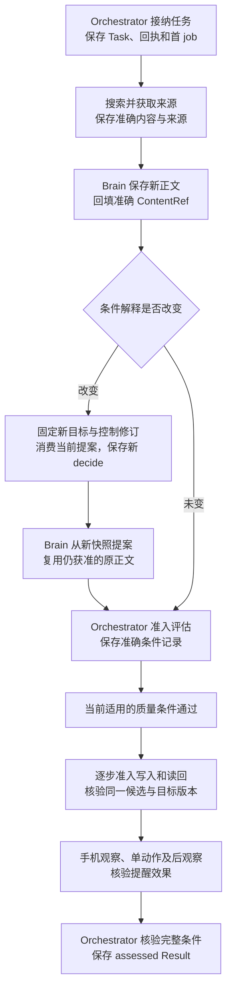
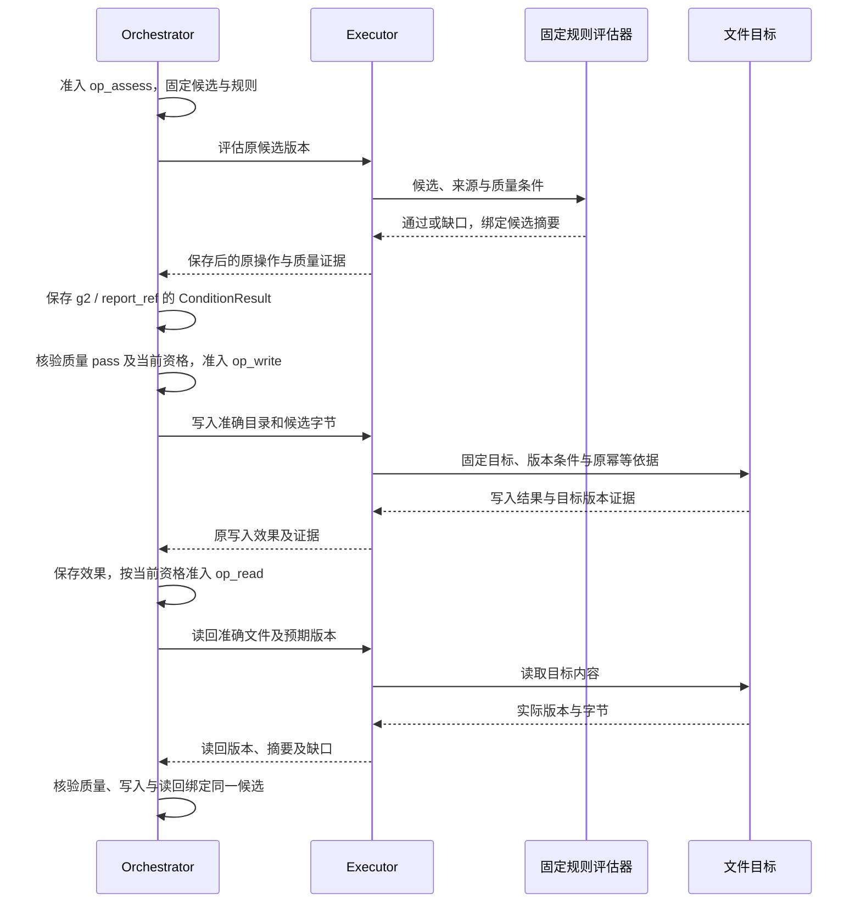
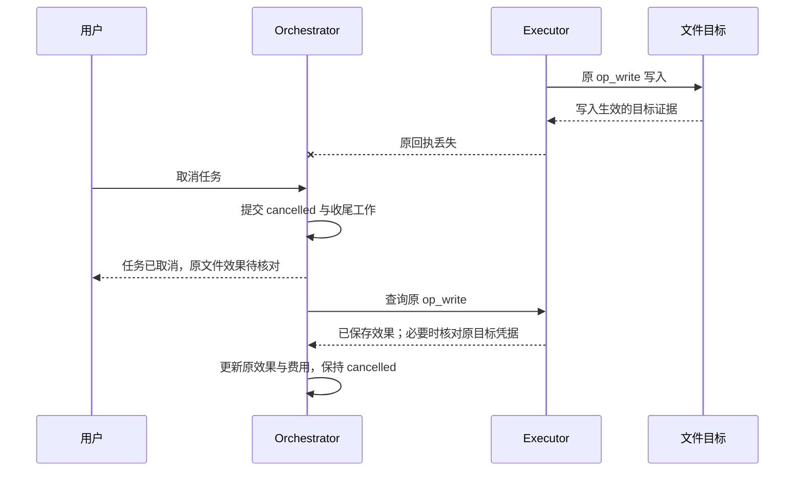

# 一次任务如何完成，以及中断后谁继续

[总览](README.md) · [任务编排器](orchestrator/README.md) · [验收](validation/README.md)

贯穿目标：“查清 A 与 B 两个软件版本的差异，附来源，保存到我指定的目录；随后在模拟手机中建立一条提醒。”例子同时包含开放质量与客观效果。它是设计推演，不表示搜索服务、模型或模拟器已经实现。

## 1. 场景装配与用户可见承诺

本例使用混合装配说明交接：Orchestrator、大脑和记忆在本机，搜索经网络适配器，文件由本机 Executor 操作，模拟手机可以在另一端。同一逻辑链在生产进程中的放置见[部署映射](deployment-production.md#1-软件模块怎样装进生产进程)。用户已有读取指定来源、处理资料、暂存及保存候选正文和写入报告目录的许可，但尚未授权创建提醒。写入目录若不明确先询问；手机行动则建立绑定准确内容的授权请求，两者分别处理。

所需能力是 search、fetch、候选质量评估、file.write、file.read、phone.observe、phone.action，各有精确版本和可核对性声明。这里的质量评估是执行域中的有限能力，返回候选的质量记录；[评测改进](evaluation/README.md)中的候选发布评测另有生命周期，二者不混用。手机不存在或没有持久原操作记录时，任务不得默默改用“已发送操作”作为成功条件。若只有本地文件能力，仍可接纳报告部分，并明确等待或拆分尚不支持的手机目标。

| 必要条件 | 依据 | 完成判断 |
| --- | --- | --- |
| 比较准确、覆盖指定范围 | 实际获取的来源、获取时间、固定质量规则和候选答案版本 | 开放质量评估；有缺口则披露或继续取证 |
| 报告保存到准确位置 | 用户输入消费、目录规范化、候选摘要、写入和读回证据 | 文件对象及读回摘要匹配 |
| 提醒内容正确且已建立 | 当前授权、目标设备、准确文本及时间、动作前后观察、模拟器事实 | 原操作关联的状态变化通过检查 |

本任务整体最多按 assessed 完成，因为比较质量仍依赖评估。文件与手机操作必须各自得到客观证据，不能被“用户觉得答案不错”替代。

第一次装配时先完成[首装与当前实例核验](extensions/implementation.md)，端侧手机再按[配对和 WSS 双向连接](contracts/transport.md)建立通信。候选报告和截图须先保存为准确 ContentRef；WSS Delivery 到达只表示收到请求，原操作仍须由 Executor 持久接纳。下文中的 `report_ref`、`d1`、`assess` 等是阅读标签，实际引用和 ID 遵守[机器契约](contracts/protocol.md)。

## 2. 正常主链

图按持久交接顺序表达本例，节点是处理阶段，不是独立服务。条件补全的分支只改变当前目标；后续动作重新从新快照准入。质量未通过、效果未知及权限缺失的分支在后文展开。

### 2.1 取证与候选形成

用户目标先成为准确 `goal_ref`；应用保存原服务与完整 `task.submit` 命令，Orchestrator 共同保存 Task、预算、原回执和首 decide job。目录不明确时，应用转交绑定原 `request_id` 和 `request_revision` 的回答，Orchestrator 消费后固定保存位置；这个回答不授予永久记忆保存权。

Brain 根据固定快照提出搜索。Orchestrator 准入搜索操作，取得结果后才能选择来源，再分别准入内容获取操作。Executor 保存实际正文、来源和限制，返回精确内容引用；Orchestrator 保存这些事实后创建新快照，Brain 才形成候选报告。搜索命中、正文取得和候选生成是三个交接点，不能把搜索摘要当成已经读取的来源。

本轮 `decision_id=d1` 的模型输出采用内部 `brain-generation/1`：报告正文放在 `contents` 中，`local_id=report`，提案模板用 `{"$local_ref":"report"}` 引用它。Brain 的内容 port 从实际字节、完整处理来源和当前保存许可形成原保存命令，沿同一 `content.put` 恢复并取得 `report_ref`；随后回填模板，校验公共 Proposal，才保存 `DecisionRecord.status=completed`。公共提案不交付局部标识或让模型自报的摘要。部分保存、保存答复丢失与取消的处理见[新正文保存](brain/implementation.md#generated-content)。

假设 d1 同时补充“比较必须覆盖兼容性差异”的派生质量条件，并提出评估该报告。`requirements_proposal.base_goal_revision=1` 对应当前目标；Orchestrator 核验完整条件仍保留用户显式约束后，只提交新的 `requirements`、`goal_revision=2`、控制修订和下一轮责任。d1 的评估动作不执行。`report_ref` 已保存，可在当前许可下进入新快照；新 `decision_id=d2` 依据 g2 再提出评估。这是[条件先采纳](orchestrator/implementation.md#proposal-consumption)的变更分支；条件完全不变时直接继续原提案。

### 2.2 评估、保存与读回

d2 以 `kind=act` 提出评估 `report_ref` 的一项行动，Orchestrator 按 g2 和当前门禁准入 `op_assess`。评估结果归并后保存绑定 `goal_revision=2`、质量 `requirement_id`、`artifact_ref=report_ref` 的 ConditionResult；只有当前适用的 verdict=pass 才继续。本例沿逐轮提案展开：新决策提出写入，取得写入事实后的下一决策再提出读回。每轮都使用当前快照；`op_assess`、`op_write`、`op_read` 是不同操作，不在一次独立 actions 数组中提前准入依赖步骤。

下图聚焦这三次行动的执行交接，省略它们之间按 2.1 节建立的新决策。写入参数引用同一 `report_ref`，读回使用原写入已核实的目标版本；参数名称由准确文件 Capability 的 Schema 定义，操作身份和结果引用由原 owner 提供。

评估器是装配时允许的具体实现；这里采用与生成步骤隔离输入的固定规则评估，并保留来源支撑记录，不声称独立模型天然无偏。评估 Operation 执行成功只说明检查完成，`verdict=fail` 仍阻止 write，并交 Brain 补源或修改候选；unknown 或缺失保留原核验责任。新候选重新评估。若任务允许保存草稿，必须把“草稿”作为另一个明确产物及操作意图。

评估通过不预先允许写入，写入成功也不自动允许新的读取。Orchestrator 在各次交接检查当前控制、目标、用途和预算。读取被撤权时保存已有写入事实，并明确读回条件尚未完成。

实现也可用[有限计划](brain/implementation.md#finite-plan)减少上述后续模型调用：评估通过的门禁由 `pass_conditions` 表达，未来输出通过 `argument_bindings` 的 `step_output` 在[物化时](orchestrator/implementation.md#41-有限计划的确定性物化)解析。该方式保持相同准入和证据要求，完整计划规则只在对应专题定义。

### 2.3 手机观察、动作与后观察

用户对提醒的确认由受信授权入口处理，限定准确设备、内容、时间和用途；普通目录回答不能替代它。下图展示“页面已经定位到待保存提醒”后的一个动作，其前面的导航、输入和返回同样按[单动作规则](execution/README.md)逐项推进。

后观察属于该动作能力已声明、已授权的验证步骤，不能据此继续点击；下一项改变目标状态的动作必须重新回到 Orchestrator。模拟器能提供原子界面前提与目标日志，真实平台的较弱能力必须单独声明，不能沿用同等保证。

用户对手机的许可不包含读取通讯录。任务成功后，只有用户启用了相应用途，才创建独立记忆提取任务；提取失败不改写原成果。

## 3. 写入与读回异常

### 3.1 写成后丢回执，随后取消

目标可能已经保存报告，但“丢回执”有两个故障点，继续者取决于最后已经保存的事实。

| 丢失的位置 | 已有权威事实 | 继续者与下一步 |
| --- | --- | --- |
| Executor 已保存效果，向 Orchestrator 的答复丢失 | Executor 有原目标凭据和 Operation 修订；Orchestrator 尚未归并 | Orchestrator 查原 command／operation，取得已有事实后归并与结算 |
| 目标答复尚未被 Executor 保存 | 目标可能已写入；Executor 只能证明已发送或可能已发送 | Executor 保留 unknown 和核对责任，查准确目标关联及原操作证据；Orchestrator 保留 poll 与预留 |

下图取第一种情况：Executor 的答复丢失后，用户取消先于任务成功提交。Orchestrator 保存 cancelled、新控制修订及收尾工作，阻止创建提醒；原文件 operation_id 和核对 job 保留。取消与完成竞争同一个 Task 条件事务；若完成先提交，取消不能覆盖成功终态。

第二种情况中，Executor 依据准确文件目标、版本条件及原操作日志核对；不能证明未发生时保持 unknown。两条路径都沿同一 operation 恢复。是否允许重放原目标请求由[驱动恢复合同](execution/README.md)裁决，切换 GUI、驱动或执行端不能绕过原未知。

Executor 收到更高控制修订后，在实际入口封闭后续发送并回报在途集合；取消回执本身不证明远端已经停止。目标队列中的旧写入仍可能迟到，因此 `execution_state=closed` 后还要检查 effect 与 may_apply_later。核对继续要求当前用途资格；缺权限或依赖时保存缺口，到达自动核对上限后保留原身份及受信处置入口。

取得原写入证据后，Orchestrator 归并效果并按累计用量差额结算，保持 cancelled。确认已经写入只收束原效果，不删除用户文件，也不启动提醒。最终可以是“任务已取消，报告已保存，费用已结清”，也可以长期保留“任务已取消，效果或费用待核对”；区别来自实际证据，迟到账单仍沿[原计费来源](orchestrator/README.md#budget)补记。

### 3.2 读回内容或版本不同

| 取得的事实 | Orchestrator 的判断 | 后续入口 |
| --- | --- | --- |
| 原写入有证据，读回版本和摘要均匹配 | 该候选的文件条件成立 | 与质量记录及其余条件一并核验 |
| 原写入有证据，当前文件已被修改 | 原效果仍成立，当前读回不满足该候选的条件 | 保留新旧版本差异；用户决定采用现状或以新操作纠正，禁止盲目覆盖 |
| 只有不同的当前内容，没有原写入证据 | 不能据此断言原写入未发生 | Executor 核对原凭据；无法证明则保持 unknown |
| 无法读取或内容引用已经失效 | 原写入事实不变，缺少读回证据 | 等待负责方恢复、取得有效用途资格或明确未完成条件 |

任何新候选都要有相应质量与文件证据。不能把候选 v1 的评估、v2 的写入和 v3 的当前读回拼成“完成”。界面允许查看原操作、补充可核验证据或结束自动核对；普通用户满意或“视为没执行”不能改写未知效果。

### 3.3 用户看过预览，提交时已失效

用户确认之前，候选被替换、截图到期或来源被关闭时，业务负责端拒绝依赖旧预览的输入，保留固定拒绝回执。交互服务刷新请求和缺口；用户取得有效预览后重新提交，不能把原确认静默套在新内容上。完整字段及拒绝行为见[交互恢复](interaction/README.md#interaction-recovery)。

## 4. 手机失联、接管和目标修订

| 变化 | 负责方与行为 | 用户可见结果 |
| --- | --- | --- |
| 提醒动作尚未接纳就失联 | Orchestrator 留下原命令，重连后按同键查询／接纳 | 明确等待设备，不创建第二个提醒操作 |
| 手机已经点击保存但答复丢失 | 手机 Executor 保存启动和核对责任；Orchestrator 查询原操作 | unknown 阻止成功，不再点击“保存” |
| 用户在手机本地接管 | 设备负责方更新控制代次，拒绝旧代次的新动作；已发生动作照实核对 | 接管本机新动作立即受阻，云界面确认可能延后 |
| 用户把目标改为只要报告 | Orchestrator 更新目标修订，撤销未启动提醒意图；已开始的提醒仍核对 | 不用新目标消除旧目标的副作用责任 |
| 远端授权已撤回而手机离线 | 设备按最后有效许可和已接受窗口判断；到期停止新行动 | 窗口内可能仍行动，不能宣称全局即时撤回 |
| 原任务 Orchestrator 失联 | 设备只完成已接纳且仍获准的有限操作 | 另一端不自动成为同任务的 Orchestrator |

## 5. 哪一刻可以说成功

任务接纳由 Orchestrator 的事务证明；Executor 接纳由原操作回执证明；效果由目标系统事实或适用观察证明；任务成功须先核对完整原目标与条件集合的覆盖依据，再核对当前条件和准确成果；用户完整取到成果还需要内容读取成功。这五个时点可以相隔很久。

若报告质量只得到评估，最终 Result 明确标 assessed。如果用户验收取代某项质量评估，标 user_accepted，仍须完成文件及提醒效果核验。若整个任务改成“把我给定的字节保存并读回”，且全部必要条件都有机械证据，才可以标 verified。

即使写入、读回和报告质量都通过，也须确认没有漏掉原目标要求；覆盖报告缺失或仍有缺口时继续原核验，详细链路与新增成本见[目标覆盖](orchestrator/verification.md#goal-coverage)。模型总结、UI 完成标记与原 Result 不一致时，以原负责方事实展示缺口，组合反例见[优化验收](validation/optimization-evidence.md#scenarios)。

以上正常与异常路径对应[系统测试](validation/README.md#scenarios)的持久接纳、未知效果、控制竞争和隐私检查。贯穿场景通过不能替代联网问答或手机 GUI 的独立质量验收。
