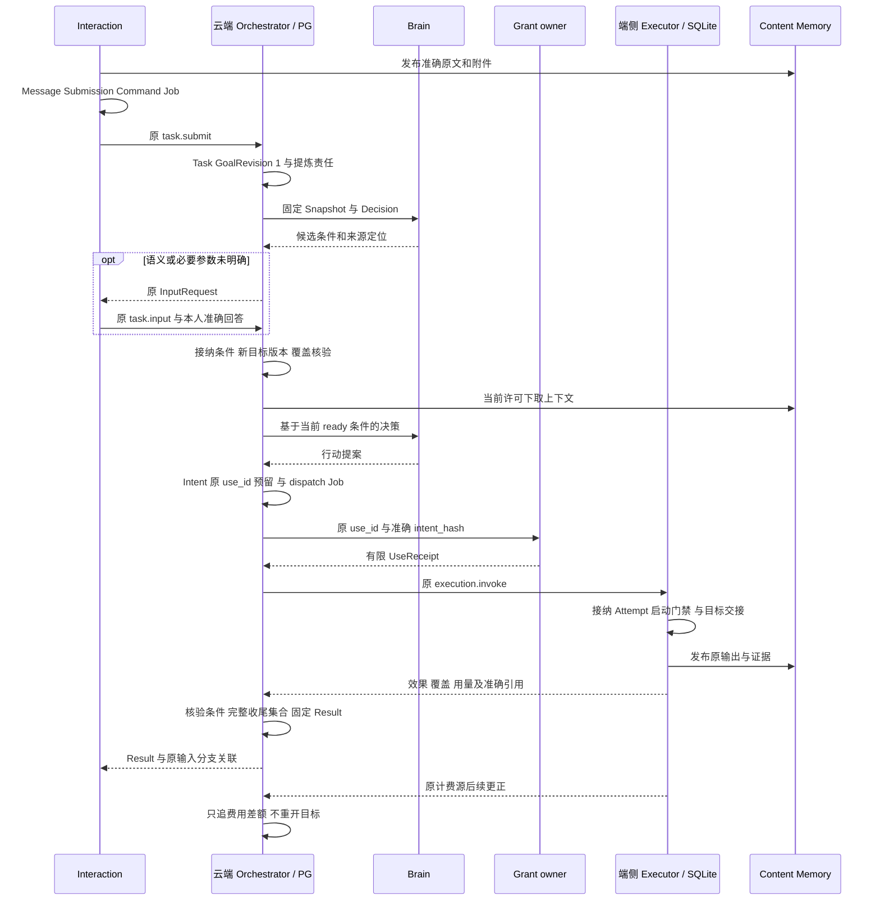

# 端到端流程与时序

一次目标从用户输入到交付，会经过多个 owner 在各自服务所属库中的提交。系统保留每次交接的原身份，把“已保存输入、已接纳责任、实际发生效果、完成条件通过、费用结清”分别呈现。超时不改变这些事实。

先看正常主线，再看同一数据在中断、修订和取消时如何收束。[整体数据设计](data/README.md)说明对象、基数和归责；[存储附录](data/storage.md)说明各次 Tx 的物理范围。以下时序是目标合同，不是已测运行结果。

## 1 完整任务链路

以下按默认生产部署，以“比较两个软件版本，附来源，保存到设备指定目录并读回”为例。O 是云端 Orchestrator，Task 相关事务在其所属 PG 分片；E 是端侧 Executor，其执行、门禁和补传账本在设备 SQLite。其他服务各用自己的服务所属库。表中的 Tx 只包已声明的同一数据库事务，任何网络、模型或目标副作用都在事务之外。

| 阶段 | 输入与产生方式 | 权威输出及各库事务边界 | 下游交接和成功点 |
| --- | --- | --- | --- |
| 1 接收 | 本人原文、准确附件、受信身份、Session/Branch 截止 | 内容先耐久；应用 Tx 保存 Message、Submission、原 submit Command 和 Job | “已保存输入”；不代表 Task 已接纳 |
| 2 建立目标 | 原 goal_ref、策略、期限、预算；可无候选条件 | O Tx 判重，创建 Task、GoalRevision 1、预算、回执、首 Job | task.submit applied 表示承担目标；requirements_state 可仍 collecting |
| 3 提炼并澄清 | 确定性已登记模板或固定 Snapshot 的 Brain Decision；模型只能产候选 | B 保存原提案；O 校验来源/规则/显式约束，必要时创建 InputRequest | 原回答沿 Submission/Command 一次消费；歧义未解不开始依赖它的目标动作 |
| 4 接纳条件 | 完整原文及补充、候选、校验报告 | O Tx 保存 RequirementAdoption、条件版本、GoalRevision 2、失效旧快照和后续 Job | 仅提交条件，不消费同轮行动/完成建议；覆盖检查 pass 后 ready |
| 5 决策 | 当前目标、条件、控制、未知效果、能力、获准记忆和内容 | O Tx 保存 Snapshot、DecisionDispatchIntent、预留、Command/Job；B Tx 接纳 Decision | B 生成 Proposal；O 唯一消费。模型输出不是 Task/Grant 真相 |
| 6 行动准入 | 准确参数、来源 Decision/plan/check、Binding、当前 Grant | O Tx 保存不可变 Intent、来源消费、reservation、完整关系及 dispatch Job | execution.invoke applied 只表示 Executor 持久接纳 |
| 7 实际执行 | 原 Intent、有限 use、当前 TaskGate、资源代次 | E 保存 Attempt 和核对责任；真实入口检查后发送；随后归并 Effect、Content 与用量 | 读取、写文件、读回各为独立 Operation；unknown 继续沿原 ID 核对 |
| 8 成果与证据 | 报告准确 Content 版本、写入/读回证据、完整来源 | O 建 ConditionCheck/GoalCoverage；原 evaluator 生成固定报告；适用性单独管理 | 效果 pass、质量 pass、覆盖 pass 均绑定当前版本；工具成功不等于条件通过 |
| 9 交付 | 当前所有必要条件、完整未结效果与子任务、证据 gates | O 完成 Tx 在原库固定 Result、succeeded、控制及导出 Job；随后发布Content副本，应用保存原分支呈现意图 | 正式完成只能来自 Result；Surface/网络送达是另一事实 |
| 10 收尾 | 原累计用量、关闭证明、内容/安装 holder、可能迟到事实 | 各 owner 追记费用差额、释放可释放预留、关闭副本并保留最小身份 | Task 终态不删除账务、去重、缺陷或清理责任 |

图把授权放在交接前以便阅读。准入先固定 use_id/意图，取得的 UseReceipt 后来保存到派发记录，不能回写不可变 Intent。实际 use 可由获准执行宿主准备；唯一意图、原使用身份、一次消费和真实入口窗口必须相同。跨 owner 部分许可已消费后失败，不执行目标、不恢复 once。内容读取、模型披露和长期记忆保存各需独立用途许可。

### 可选支路如何接入

- 长期记忆：Task/Content 只提供候选来源。Memory extraction 在独立保存许可下生成候选，获准后才写 MemoryRecord；本次上下文不会自动永久保存
- 内部子任务：父 Task、Delegation、子 Task、Allocation、Job 共原分片事务；外部子任务采用原创建命令及双方账本，父只读子事实
- 周期任务：Schedule 产生固定 Occurrence；其模板/来源/许可和预算在实际启动重新核验，之后使用同一主线
- 程序环境：Environment 是 Executor 的资源；每个 cell 是 Operation，hostcall 仍回到 Orchestrator 准入；Session 不接管环境效果
- 安装与评测：准确 Capability/Binding/InstallLock 进入 Snapshot 和 Intent；新版本的 EvaluationRun 与发布批准影响未来使用资格，不改旧记录的解释

## 2 关键边界和恢复

| 断点或竞争 | 必须保留的数据 | 恢复及禁止行为 |
| --- | --- | --- |
| 内容已上传，提交尚未发送 | upload/ticket、准确字节身份、引用意图 | 查询原发布；未引用孤儿按门禁清理；不重新生成不同原文 |
| Task 已接纳，应用未收到 | 原 submit command 与固定目标 owner | 查原 Receipt 建唯一映射；不按相似文字新建 Task |
| 提炼后用户补充/取消 | 原 Snapshot、候选、输入消费、goal/control 修订 | 旧提案可留审计和费用，不可改成当前提案；合法迟到事实仍归并 |
| 采纳条件事务提交未知 | 原 adoption 来源键及 Job | 查原消费决定；未确认提交不启动同轮行动 |
| 模型发送后无回复 | Decision、ModelCall/send_started、用量占用 | 查原供应商调用；不可透明重新推理掩盖未知 |
| 工具写入后失答复 | Intent、Operation、Attempt、目标幂等键/证据 | effect=unknown，继续核对；cancel ACK 不证明未写入 |
| 来源关闭与上下文/发布竞争 | SourceEdge、held_copy gate、当前用途、原有限 use | 封新使用；跨库有限窗口明示；不能以缓存命中绕过撤权 |
| 完成与缺陷/取消并发 | Task 锁、证据 gate、准确选中 checks、Result | 云端 Orchestrator 所属 PG 的同一事务决定先后；旧 Result 追加 notice，不回滚历史 |
| 云端与设备断网 | 云端 Task/Intent、设备 Operation/TaskGate/原有限许可、补传 Job | 设备只继续原准入与许可允许的工作及收尾；不得依据 Task 缓存准入新目标或裁决完成，重连沿原身份补传 |
| 终态后到费用更正 | 原 source→reservation 绑定、usage_revision、outbox | 单次差额入账，保留 gross_spent；不复活 Task/once |
| 删除/备份恢复 | 关闭/撤权/墓碑、holder 与清理状态 | 先恢复禁止事实再开放读取；缺历史只诊断 |

一致性只承诺各原事务内的原子性，以及跨 owner 可查询、可去重的持久交接。没有全局数据库事务，也不宣称任意第三方效果恰好一次。通知和索引可落后，必须显示 partial/gap；它们不能裁决授权、无未决项或已完成。

## 3 如何查看图和解释工具

上面的时序图从上到下阅读，每条库内保存只属于该 owner 的服务所属库。跨线箭头是独立网络交接，不代表双方共事务。逐模块细节从[总导航](README.md)进入。

回执丢失、取消和迟到效果容易混淆时，可用已有[架构解释工具](assets/design-lab.html)。浏览器打开本地 HTML，在“回执丢失之后”逐步前进；切换“查询原操作”和“换标识重试”，观察为什么后者会重复副作用。工具不联网，也不模拟实际数据库；当前静态测试不能替代浏览器视觉和真实故障验收。
