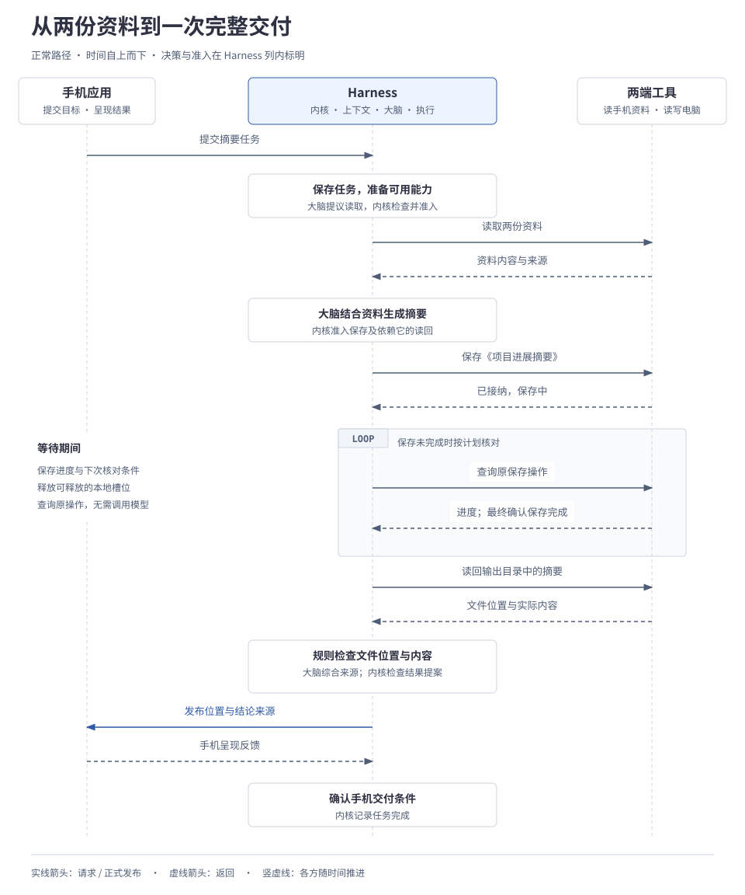

# 示例 1 · 一次任务的正常过程

用户要求的是一份保存到指定位置、带有来源说明的摘要。Harness 要依次取得资料、准入行动、跟踪异步保存，再读回核验并交付。本篇沿下面的请求解释这条过程，特别区分请求已接纳、文件已保存与任务已完成：

> 请结合手机里的《会议记录》和电脑“项目资料”目录中的《需求说明》，整理项目进展，把《项目进展摘要》保存到电脑的“输出”目录，完成后在手机上告诉我文件位置和各项结论的来源。

## 1. 从两份已有资料开始

手机和电脑属于同一用户，两端与所需工具在线可用。读取资料、在允许的位置处理内容、必要的跨端传递，以及在电脑指定目录保存和读回摘要均已授权。电脑保存工具以异步方式工作：先接受请求，随后可以查询保存进展。

下面是两份资料的教学摘录，后续生成、保存和核验都围绕这些假设内容展开：

| 资料位置 | 段落 | 摘录 |
| --- | --- | --- |
| 电脑“项目资料”中的《需求说明》 | 交付要求 | 支持资料导入和摘要导出；两项均须通过验收。 |
| 手机里的《会议记录》 | 进展 | 资料导入已验收；摘要导出仍在联调，尚未验收。 |

本篇把整项任务记为 T，两份已取得的证据记为 E1、E2，生成的摘要记为 D，保存、读回与外部作业分别记为 S、R、J。这些是教学标识，按本篇过程逐步产生；初始时尚未创建保存操作或外部作业。

本例将输出位置写作 `输出/项目进展摘要.md`，指电脑上的示例文件。目标是交付一份有来源依据的进展摘要；“资料导入已验收”是资料记载的事实，Harness 在此负责准确整理和交付。

## 2. 先看完整过程

读图前先固定本章的交接分工：手机应用提交目标并呈现结果，内核保存目标和已接纳工作，大脑根据受控输入提出有限方案，执行系统读取两端资料并核对保存。图中将后三项合并为 Harness 一列，详细模块关系见[1.2 系统全貌](../main/01-system/02-architecture-overview.md#1-先看职责怎样连接)。

时序图自上而下阅读，合并展示 Harness 内部职责，框内文字标明决策与准入位置；两端工具分别读取各自资料，保存和读回都发生在电脑。可点击查看大图。

图中的三处交接各有不同的完成依据，不能用前一处的成功替代后一处的核验：

| 交接 | 已确认什么 | 还需要什么 |
| --- | --- | --- |
| 内核准入行动 | 提案符合当前任务、授权和预算，已接纳工作已保存。 | 执行端实际调用工具并报告结果。 |
| 电脑工具接纳保存 | 保存请求已被接受，系统可以跟踪原操作。 | 确认保存效果，再读回检查文件。 |
| 手机呈现正式结果 | 本例要求的文件位置与来源说明已交付。 | 内核结合内容核验和交付事实确认任务完成；呈现不代表用户已经阅读。 |

这些是过程中的事实描述；正式状态字段由[对象与状态参考](../reference/01-data-model.md)维护。下文按实际发生顺序继续，直到完成交付。

## 3. 先读取资料，再生成摘要

用户提交了资料位置，内核此时还没有正文。它先保存目标、资料位置、输出要求、授权约束和运行预算，再通过能力目录找出可用的读取工具及准确参数说明，将目标、约束和候选能力组成第一轮上下文。大脑提出“读取这两份资料”的有限提案；内核检查当前任务、授权、处理位置和预算，记录已接纳工作后，才调度执行系统读取。

执行系统返回实际内容，并保留来源位置、段落、获取时间及可取得的来源版本。内核记录这些事实，重新组装上下文。大脑据此调用模型整理摘要，例如：

| 摘要分组 | 内容 | 来源依据 |
| --- | --- | --- |
| 已完成 | 资料导入已通过验收。 | 《会议记录》“进展”。 |
| 待办 | 摘要导出仍在联调，后续需完成验收。 | 《会议记录》“进展”＋《需求说明》“交付要求”。 |
| 整体判断 | 按本次资料，项目尚未满足两项均通过验收的交付要求。 | 两份资料对照得出，属于综合判断。 |

### 草稿怎样变成保存与读回工作

摘要草稿形成后，大脑请求将其保存到指定位置，并将读回作为保存完成后的依赖动作。读回也必须成为明确请求、通过准入，才能执行；仅在计划文字中写“随后读回”不会产生工作。这份行动提案只安排有限工作，任务完成判断留到结果回来以后。

内核再次检查提案是否仍适用于当前任务，来源、权限和预算是否有效，再保存摘要内容或受控引用、目标位置与已接纳工作。执行端在实际处理时复核权限和条件，记录启动准备后调用电脑工具。来源或用户要求已变化的提案需要重新决策。

资料进入当前上下文，足以支撑本例；跨任务保存为长期记忆另按授权和用途处理。上下文与决策的完整机制见[2.2 上下文、记忆与证据](../main/02-subsystems/02-context-and-memory.md)、[2.3 规划、决策与模型调用](../main/02-subsystems/03-planning-and-decision.md)。

## 4. 保存已接纳，任务继续等待

电脑工具返回“已接纳，保存中”。这条反馈说明工具接受了保存工作，尚未确认保存成功。执行系统保存原操作与外部作业的关联，安排下次查询；内核记录未决工作，使等待后的推进有据可查。

等待保存时，本轮处理暂时不用的本地执行资源可以释放，模型也无需持续参与。电脑上的保存作业仍在运行，系统继续跟踪它的进展和资源占用。到达查询时机，执行系统检查原保存操作；如果仍在处理，就更新等待记录，不触发新的模型推理。这样可以把等待与内容判断分开，但系统必须持久保存查询关联和下一次检查时机，才能在重启后接着等待。

本例随后查到保存已完成。内核纳入该事实后，在当前条件仍有效的情况下，调度此前已准入的依赖读回。新信息需要判断、用户要求变化或后续行动尚未准入时，再准备上下文、请求新的决策；单纯查询进度和推进已准入工作按运行规则进行。

保存、查询与读回的执行契约见[2.4 能力与执行](../main/02-subsystems/04-tools-and-devices.md)。

## 5. 核对实际文件，再向手机交付

保存成功后，执行系统从电脑输出目录读回摘要，将实际位置和内容返回内核。此时要检查的对象从“准备写入的草稿”变成“实际保存的文件”：

| 要核对的问题 | 本例的核对依据 |
| --- | --- |
| 文件是否落在指定位置？ | 原保存操作的结果与电脑指定目录中的读回结果相对应。 |
| 文件是否包含预期内容？ | 读回内容与本次获准保存的摘要一致，包含已完成、待办和来源说明。 |
| 结论是否有依据？ | 将实际摘要逐项对照本次读取的资料；仍在联调、尚未验收的导出功能保留为待办。 |
| 手机是否收到要求的交付？ | 正式结果包含电脑文件位置和结论来源，并取得手机应用的呈现反馈。 |

位置、内容一致性等条件可以机械检查；结论与来源的关系由大脑结合证据综合判断，并向内核提交结果提案。缺少必要证据或仍有未决效果时，完整成功条件尚未满足。开放式摘要的质量仍需独立评测，单凭“有引用”也不足以证明表述正确。

内核检查结果提案，保存正式结果及待发布工作。此时可以交付一份仍含项目待办的摘要，因为本任务的目标是准确整理进展。手机应用按授权呈现，例如：

> 已保存并读回核对：电脑 `输出/项目进展摘要.md`。
>
> 已完成：资料导入已验收。来源：《会议记录》“进展”。
>
> 待办：摘要导出仍在联调，需完成验收；项目尚未满足整体交付要求。来源：《会议记录》“进展”及《需求说明》“交付要求”。

本例明确要求在手机交付，因此内核还须核对相应呈现反馈，再确认任务完成。发布结果、任务终态和用户实际阅读是不同的事实；手机已呈现并不证明用户已经理解或同意。交付机制见[2.5 应用与交互](../main/02-subsystems/05-interaction.md)。

## 6. 从正常过程进入独立分支

正常过程到此结束。若要观察条件变化，请从下面各自标明的阶段重新开始，不把所有分支串成一次执行历史：

| 起点与改变的条件 | 继续阅读 |
| --- | --- |
| 生成中新增确认要求、删除已使用偏好，或改存目录需要新许可。 | [输入、来源与权限变化](02-input-and-permission-changes.md) |
| 保存回执丢失、Worker 退出、数据库切换，或文件完成但手机尚未呈现。 | [外部效果与恢复](03-effects-and-recovery.md) |
| 把资料核对委派给子任务，或规定原文留端并移交任务。 | [协作与端云](04-edge-cloud-and-collaboration.md) |
| 固定旧实现继续在途工作、迁移存储，或对照评测候选。 | [组装、升级与评测](05-implementation-and-evaluation.md) |

本篇是教学过程，尚无运行验收证据。文件整理、真实联网问答与手机 GUI 专项分别取证；完整验证入口见[实施路线与能力验收](../main/04-engineering/05-roadmap-and-validation.md)。

[返回示例目录](README.md) · [系统协作过程](../main/01-system/04-system-collaboration.md) · [机制核查图](../diagrams/system-flow-map.html)
