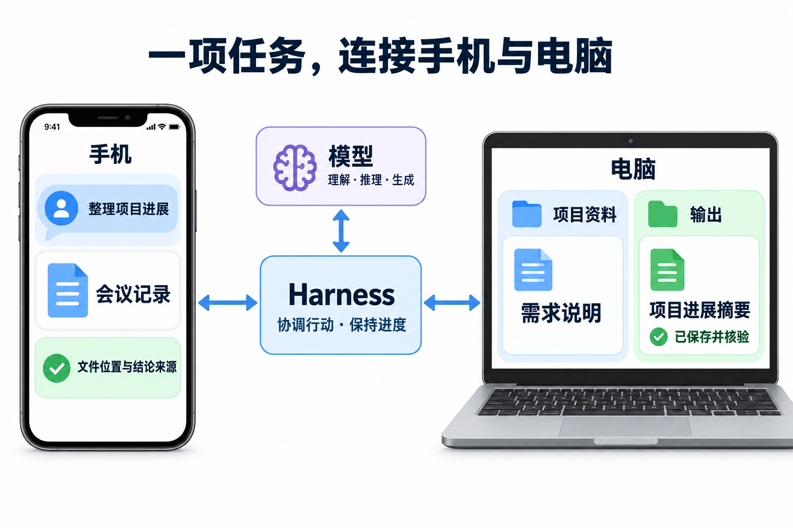

# 1.1 目标与边界

Harness 是面向个人智能应用的任务运行框架：应用提出目标，模型参与理解与生成，框架组织资料、工具和持久进度，直到取得可核对的交付结果。本篇说明开发者可以用它构建什么、任务必须遵守哪些边界，以及各类能力需要怎样验证。

## 为什么需要持续管理一项任务

应用提出的交付目标可能跨越多次模型调用、工具等待和设备连接。Harness 采用以下分工来维持这段过程；后文先用一项交付说明它们的用途，再给出能力范围和建设目标。

| 设计选择 | 对开发者意味着什么 | 需要承担的约束 |
| --- | --- | --- |
| 内核持续维护任务，模型参与理解与生成 | 模型返回后，未完成工作仍有推进与恢复责任。 | 目标、进展、原操作和结果必须持久关联。 |
| 记忆、大脑和执行可独立替换 | 可以从默认实现起步，再更换具体能力。 | 替换后共同的授权、结果和恢复规则仍须验证。 |
| 单机开发保留端云的行为契约 | 同机模拟设备能先验证完整交付。 | 模拟、实际跨节点及真实平台支持分别取证。 |

当前提供架构设计，计划中的实现和量化目标仍需后续运行证据。

## 1. 从分散在两端的资料，到一项完整交付

用户在手机上提出一项任务：

> 请结合手机里的《会议记录》和电脑“项目资料”目录中的《需求说明》，整理项目进展，把《项目进展摘要》保存到电脑的“输出”目录，完成后在手机上告诉我文件位置和各项结论的来源。

用户只提出一个目标，系统却要协调两端的资料与工具。下图标出资料来源、成果位置与协调关系，可点击查看原图。

《需求说明》给出目标与验收要求，《会议记录》提供进展与问题。摘要据此整理已完成事项、待办问题和来源对应关系，在电脑上保存并读回核对后，再向手机报告文件位置和结论来源。

示例假设两端属于同一用户、在线且工具可用，资料已存在，所需读取、跨端传递与处理、指定目录读写均已授权。图中连线表示逻辑交互，不限定模块在端侧或云端的位置。

从提出目标到收到成果，任务可能经过多次模型调用和工具等待。仅有摘要草稿还不足以交付：框架还要知道文件是否保存、内容是否核验、手机是否收到结果。Harness 因此持续保留目标、进展与执行结果，让等待和恢复都能接回原任务。

## 2. 开发者用 Harness 构建什么

本项目向开发者提供可复用的任务运行框架，用于构建服务个人用户的智能应用，覆盖问答、多步骤和跨设备任务。应用、模型与 Harness 各有职责：

| 部分 | 职责 | 在摘要任务中 |
| --- | --- | --- |
| 应用 | 定义用户入口、业务目标和可用资源。 | 让用户提交要求、查看进展与成果。 |
| 模型 | 理解信息、推理与生成。 | 分析资料、建议下一步、起草摘要。 |
| Harness | 组织上下文、协调工具、维护进度和运行规则。 | 安排读取、保存与核验，处理授权、等待和恢复。 |

框架内部由记忆系统管理受控信息与经验，大脑系统规划决策，执行系统对接工具与设备，运行内核维持任务进度和公共规则。三系统提供默认实现，也允许独立替换。这样，开发者可以更换某一项能力，并继续使用内核维护的任务进度；替换实现必须满足共同的任务、授权与结果规则，不能只验证调用是否成功。

计划长期维护的开源交付包括架构规范、共同接口协议、可运行内核、三系统参考实现、扩展开发工具包（SDK）与一致性测试。开发者可从默认组件起步，再接入自己的模型、存储或设备驱动；任务支持范围取决于实际接入的能力。当前交付为架构设计，这份清单不表示实现已经完成。

## 3. 一项任务需要哪些共同能力

### 3.1 理解目标，准备有依据的信息

系统先明确输入、交付内容和完成条件，再安排读取、整理、保存与核验。资料携带来源和获取时间，结论须有实际内容支撑：会议记录若只说某项工作“已开始”，摘要就不能写成“已完成”；信息矛盾或缺失时保留冲突或待确认项。

目标、进展、资料和工具结果构成当前任务的上下文，供后续决策使用。长期记忆用于跨任务复用，例如另行获准保存的摘要格式偏好。本次读取权限不会自动授予长期保存或跨任务使用的权限。

### 3.2 执行行动，保持可继续的进度

执行系统调用工具读取资料、保存文件并返回观察结果。运行内核持久保存进度与执行记录，安排后续工作，处理等待、超时和恢复。保存结果不明时，先核对原操作再决定是否重试；无法确认时保留待处理状态。

可独立处理的工作可以委派给具有自身目标、上下文和决策过程的工作单元，即 Agent，并在约定的权限、预算和期限内协调其进展与结果。基础摘要例子由一项任务调用两端能力即可，设备数量不决定 Agent 数量。

### 3.3 让用户控制资料和行动

用户决定资料读取、内容传递和目录写入的范围，系统在实际处理与执行的位置落实限制。用户可以补充要求、暂停、恢复、取消任务或接管设备；已经开始的操作仍须核对并报告实际结果。任务委派和扩展接入不能扩大已有授权。

### 3.4 接入新能力，持续改进任务效果

接入新应用或设备时，插件提供可安装的组件，技能（Skill）提供可复用的操作知识与流程；共同契约约束它们的调用、授权和失败处理。

运行记录关联资料、决策、授权、执行与结果，帮助定位问题；能力评测用可比较的任务集衡量质量、耗时和成本。受控自进化据此提出改进，经隔离评测后按权限启用，持续监测并保留回滚能力。记忆按授权更新，配置经评测逐步启用，插件与内核代码由维护者确认后发布。

这些能力如何在时间上衔接，将在[示例 1 · 一次任务的正常过程](../../examples/01-task-lifecycle.md)中沿同一示例展开，包括保存过程中的接纳、等待和核验。

## 4. 联网问答、手机操作和个性化分别交付什么

联网问答和手机图形界面（GUI）操作须分别完成专项验收；个性化属于上下文与记忆能力，也须在适用任务中产生实际影响。

| 能力 | 用户能看到的结果 | 必要边界 |
| --- | --- | --- |
| 联网问答 | 通过可替换的搜索与内容获取能力取证，回答正确、引用支持结论且满足时效要求。 | 保留来源与获取时间，说明检索失败、证据不足或来源冲突；实际联网与固定资料重放分别验证。 |
| 手机 GUI | 操作目标应用，完成观察、动作、再次观察与结果核验。 | 覆盖点击、滑动、输入、返回、中断与接管；动作执行后仍须确认效果。 |
| 个性化 | 获准的“先列待办问题，再列已完成事项”偏好改变后续适用摘要。 | 记忆可查看、纠正、删除或限制用途，后续使用须体现这些控制。 |

行动以程序接口（API）为主，手机 GUI 用于没有适用 API 的应用及合适的兜底场景。开篇的手机入口负责提交任务与呈现结果；GUI 专项检查系统实际操作目标应用的能力。

进一步阅读：[2.4 能力与执行](../02-subsystems/04-tools-and-devices.md)、[4.4 评测、比较与发布](../04-engineering/04-evaluation-and-release.md)。

## 5. 从单机开发走向多端与生产

多端描述资料与动作的位置，单机描述开发环境，两者可以同时成立。同一摘要任务可先在一台机器上的模拟手机和电脑中完成，再进入实际跨节点与生产环境验证。

| 环境 | 如何运行 | 验证重点 |
| --- | --- | --- |
| 单机开发 | Go 核心与参考入口、SQLite 持久化；同机运行多个有状态模拟设备。 | 动作产生可观察、可核对的状态变化，可重复验证执行、协作和故障处理。 |
| 跨节点运行 | 组件与设备能力分布到实际节点；记忆、大脑、执行可位于端侧或云端。 | 通信、离线等待与重连核对；真实手机平台另行适配和验证。 |
| 生产配置 | 独立配置生产存储与运行组件，面向大量个人用户，保持共同的行为契约。 | 用户间数据、任务与资源隔离；分别评估连接、任务、模型并发和存储负载。 |

### 5.1 开发与部署的条件

最小完整系统无需另行部署数据库、队列或工作流集群等独立基础设施服务，允许使用第三方库、接入模型和网络信息源，也允许同机多进程。当前设备验收以多个有状态模拟设备为范围。

扩展到端云部署后，重要隐私数据可以按策略留在端侧，在许可范围内检索、处理或提供结果。本地模型、工具、资料与持久化能力齐备，且授权仍有效时，任务可以离线继续；依赖失联节点的步骤等待，重连后核对授权、进度与执行结果。

### 5.2 量化目标与验证范围

以下均为已确认的建设目标，尚需运行证据证明达标。具体计分与负载配置在[工程实现与验证](../04-engineering/README.md)展开：

| 维度 | 目标 |
| --- | --- |
| API 覆盖 | 超过 1000 个独立业务 API。 |
| 调用质量 | 首次调用正确率至少 90%；有限重试后的任务成功率至少 95%。 |
| 服务规模 | 千万注册用户、百万日活用户、十万同时在线，并落实个人用户隔离。 |

后续验证须注明环境、版本、测试集与预算，分别记录契约符合性和实际任务效果。API 覆盖数量与调用质量分别验证；在线规模也须结合任务和模型容量检验。模拟设备、实际跨节点和真实平台支持分别报告验证范围。

本文依据[项目目标基线](../../../harness-project-goals.md)与[设计输入和硬约束](../../../archive/architecture-v1/00-design-constraints.md)，[技术格局研究](../../../research/agent-harness-landscape-2026-09.md)提供定位背景。新增生产组合和优化建议须经评审、验证。

进一步阅读：[4.2 部署、存储与规模扩展](../04-engineering/02-deployment-and-storage.md)、[4.1 技术选型与开发组装](../04-engineering/01-implementation-and-technology.md)、[4.5 实施路线与能力验收](../04-engineering/05-roadmap-and-validation.md)。

[返回阅读导航](../../README.md)

---

[正文目录](../README.md) · [下一章：1.2 系统全貌](02-architecture-overview.md)
