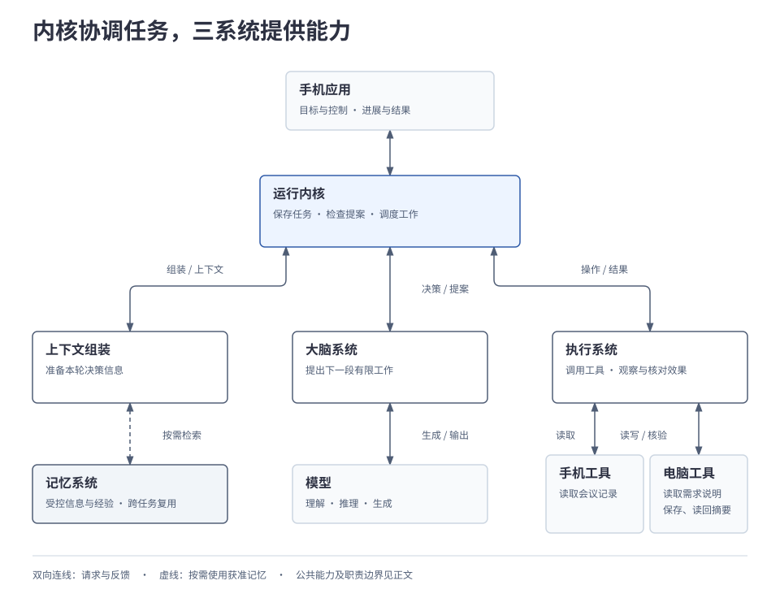
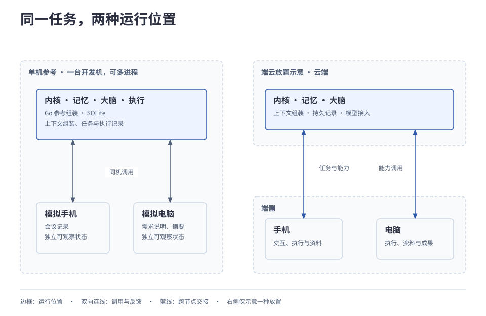

# 1.2 系统全貌

Harness 以运行内核维护任务进展，由记忆、大脑和执行三个系统分别提供信息、决策和行动能力。应用提出目标，内核协调这些能力并保存可恢复的责任，直到取得可核对的结果。本章先建立职责和核心对象，再说明各方维护的事实与可选择的部署位置。

## 本章的整体分工

先沿内核与三系统认识请求和反馈，再定位各自保存的事实。这样，读到任务、操作或 Agent 时，可以把它们放回具体的运行责任中。

| 核心选择 | 解决的问题 | 保留的边界 |
| --- | --- | --- |
| 内核推进任务，三系统提供信息、判断和执行 | 模型调用结束后仍能等待、恢复并继续交付。 | 大脑只提案，执行结果需要核对后纳入任务。 |
| 任务事实、执行事实和界面状态分别维护 | 能判断“文件已保存但手机未呈现”究竟缺哪一步。 | 需要可靠交接，断连本身不决定业务结局。 |
| 逻辑职责与部署位置分开 | 同一契约可用于单机及端云组合。 | 放置仍取决于能力、权限与数据处理位置。 |

本章用一个局部例子对应这些职责：用户要求结合手机《会议记录》和电脑《需求说明》，将《项目进展摘要》保存到电脑“输出”目录，读回核验后向手机呈现位置和结论来源。两端在线、工具可用，读取、处理、跨端传递和指定目录读写均已授权。后文表格中的摘要任务仅用于解释组件分工。

## 1. 先看职责怎样连接

Harness 以运行内核组织任务，由记忆、大脑和执行三个系统提供相应能力。下图展示主要请求与反馈关系，可点击查看大图；模块的位置不代表进程或端云部署位置。

运行内核保存任务进展，组织上下文准备，调用大脑，并检查提案是否符合当前任务、授权和预算，再记录已接纳的工作、安排执行。任务进展保存在内核中，因此一次模型调用结束后，等待中的工作仍有明确的推进责任。

上下文组装是本轮决策的准备环节：汇集目标、进展和执行系统读到的资料及来源，按需检索获准记忆。大脑利用这些信息提出下一步；执行系统落实获准的行动，反馈观察与效果，由内核纳入任务。记忆系统提供受控的长期信息与经验，本次读到的资料不会自动存成长期记忆。

图中的手机应用与手机工具分别表示交互和执行职责，可以位于同一设备。交互、授权、连接等公共能力贯穿这些交接，其参与位置在第 5 节说明。

## 2. 谁维护进展，谁报告实际效果

假设电脑已经保存文件，手机却暂时没有显示结果。要判断还缺哪一步，系统必须分别查看任务进展、执行事实与界面状态。

| 信息 | 由谁维护 | 在本例中的作用 |
| --- | --- | --- |
| 任务进展与控制 | 运行内核 | 记录已取得哪些资料、哪些工作未决，以及暂停、取消等控制要求。 |
| 操作执行事实 | 执行系统 | 记录保存进展、工具观察与效果核对依据，向内核报告。 |
| 长期记忆 | 记忆系统 | 保存另行获准的跨任务信息；基础摘要例子无需预存偏好。 |
| 界面呈现状态 | 交互模块 | 记录手机显示的进展与结果，转交用户输入和控制。 |

内核依据执行反馈和完成条件推进任务，界面据此呈现。保存报告暂时不明时，先由执行系统核对原操作；手机断线只说明通信中断，不能据此判断文件未保存、取消任务或重复执行。

每项任务在任一时刻由一个逻辑拥有者负责推进，也就是运行内核中有资格提交该任务状态的责任单元。模型调用结束、工作进程重启或手机重新连接，都不会自动把这份责任转交给另一方。任务、资料与结果归属受认证的个人用户；同一用户的多端协作，仍须遵守各项资源和行动权限。

状态转换、持久化与准入细节见[2.1 任务运行内核](../02-subsystems/01-runtime-kernel.md)。

## 3. 在同一段工作中认识核心对象

下面取“整理资料后，保存并核验摘要”这一段，将用户看到的工作对应到系统概念。表中的对象帮助各部分交接信息，不要求每个对象对应一张数据库表。

| 对象 | 在摘要任务中代表什么 |
| --- | --- |
| 任务（Task） | 整理并交付摘要的目标、约束和持续进展；一次任务可包含多次读取、保存及核验。 |
| 上下文 | 供本轮决策使用的目标、进展、已取得资料、来源和工具反馈。它按需组装，不能代替持久运行记录。 |
| 决策提案 | 大脑建议的下一段有限工作，例如“将这份摘要保存到指定目录”。提案还需内核准入。 |
| 操作（Operation） | 有稳定身份的一次逻辑变更意图，例如保存指定内容到指定位置；准入后才能安排执行。 |
| 结果 | 一次工作报告的结论，例如工具报告保存成功；它的范围可能小于整项任务。 |
| 产物 | 实际交付的内容，例如保存到电脑的摘要文件。 |
| 证据 | 支持判断的可核对信息，例如读回内容、文件位置及结论与来源的对应关系。 |

提案经内核检查并记录后，执行系统处理相应操作；结果返回后更新任务事实，并可进入下一轮上下文。操作身份贯穿接纳、执行和结果核对，网络重试不会把原保存意图变成另一项新操作。

判断“完成”时必须说明对象：接纳保存请求只确认工作已被接受；保存成功只覆盖这个操作；整项任务还要核对内容、来源与交付位置。简单问答也可以直接形成回答提案，无需经历所有外部动作。

## 4. 区分 Agent、大脑与模型

“整理项目进展”需要生成内容，也需要决定接下来做什么，并持续承担交付责任。这三个层次分别对应模型、大脑与 Agent：

| 概念 | 承担什么 | 在摘要任务中 |
| --- | --- | --- |
| 模型 | 根据输入进行理解、推理与生成。 | 分析两份资料，生成摘要草稿。 |
| 大脑 | 组织决策策略，利用模型和规则形成有限提案。 | 提议保存摘要，并在取得结果后决定下一步。 |
| Agent | 持有目标、上下文和决策过程的工作单元。 | 承担摘要任务，持续判断交付是否满足要求。 |

内部 Agent 由 Harness 管理生命周期，借助内核及三系统完成任务。三系统按职责划分，Agent 按所承担的目标组织；多个 Agent 可以复用同一组组件实现。独立子目标可以委派给其他 Agent，普通的跨端工具调用则可以留在原任务中。外部 Agent 通过任务契约协作，保留自己的运行时。

大脑每次提出有限的行动、委派、等待或结果提案，由内核检查后推进；模型输出先进入大脑的解析与校验。大脑不能自行绕过内核执行工具、写入长期记忆或创建子任务。

模型接入和大脑策略可以分别替换，三系统也各有默认实现并允许独立替换。职责分离让更换模型、决策策略或工具驱动时能够分别验证其行为；代价是各实现都要遵守共同的授权、结果与恢复契约。已有任务的运行责任继续由内核承担。

## 5. 公共能力在交接处参与

除了三系统的业务分工，系统还需要接收用户控制、落实授权、递交消息，并支持扩展和诊断。它们在现有交接位置工作：

| 公共能力 | 参与位置与作用 |
| --- | --- |
| 用户交互 | 将新要求、输入和控制送到对应业务模块，将进度与正式结果呈现给用户。 |
| 授权 | 为资料读取、模型处理、内容传递和设备行动提供统一判定；内核准入与实际处理端分别落实检查。 |
| 连接 | 交付请求和反馈，处理断连与补读；通道在线、消息送达和任务完成分别表达。 |
| 扩展接入 | 接入模型、记忆后端、工具驱动、Skill 或外部 Agent，检查共同契约与能力声明。 |
| 观测、评测与改进 | 关联运行记录以诊断问题，用任务结果比较质量与成本，为受控改进提供证据。 |

这些职责不要求各自部署为独立服务。无论组件怎样组装，真正处理数据和发起动作的位置都要落实当前权限；扩展接入不能增加授权，观测记录也不能反向改写业务事实。

## 6. 同一职责怎样放到不同位置

逻辑模块按职责划分，进程是程序的运行实例，部署节点承载运行与通信，设备提供可访问资源和可观察状态。一个节点可以运行多个进程，一个进程也可以承载多个模块；多个模拟设备可以共处一台开发机。

下图将同一任务放入两种环境。左侧是单机参考形态，右侧选择一种端云放置说明跨节点交接；它们沿用相同的行为契约。

单机开发时，Go 参考入口组装内核与三系统，以 SQLite 持久化，默认进程内调用，也允许同机多进程。模拟手机和电脑各自持有状态，动作须产生可观察、可核对的变化；模型和网络来源按所需能力接入。

跨节点运行时，图示把内核、记忆和大脑放在云端，执行能力接近手机与电脑资源；这些职责也可以按能力与策略部署在端侧。资料原文、模型处理位置和可返回内容分别受授权约束。由端侧内核负责推进的任务，在本地模型、工具、资料与持久化能力齐备且授权有效时，可以离线继续；依赖失联节点的步骤等待。

改变位置后，仍须明确谁推进任务、谁接纳操作、谁核对效果。模拟验证、实际跨节点验证与真实手机平台适配分别取得证据；图中的放置不代表平台支持或运行验收已经完成。

跨篇查阅：[系统组件全景](../../diagrams/system-panorama.svg)展开本篇职责对应的关键组件，以短能力标签和组件连线说明组成与协作；可在 [draw.io 文档](../../diagrams/system-panorama.drawio)中编辑，[读图与机制索引](03-component-panorama.md)补充运行条件和正文定位。

---

[上一章：1.1 目标与边界](01-purpose-and-scope.md) · [正文目录](../README.md) · [下一章：1.3 组件全景](03-component-panorama.md)
