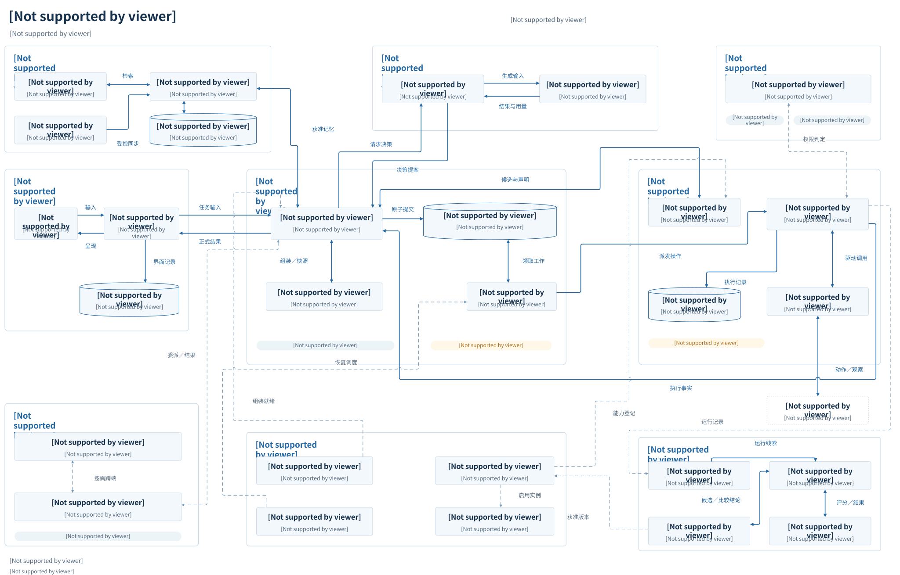

# 1.3 组件全景

全景图展示系统由哪些模块组成、各模块有哪些关键组件，以及组件之间交接什么。每个组件只保留“名称＋一行能力”，等待、恢复和跨端移交的完整条件由下方读图说明与正文承接。

**[打开可编辑 draw.io 文档](../../diagrams/system-panorama.drawio)** · [查看 SVG 预览](../../diagrams/system-panorama.svg) · [生成与维护说明](../../../../scripts/architecture/README.md#系统运行全景图)

draw.io 文档只有一页，所有内容默认展开，模块、组件、存储、标签和箭头均可编辑。SVG 从同一文档的原生图形导出。原 imagegen [PNG 与生成记录](../../diagrams/system-panorama.prompt.md)保留为历史版本。

## 怎样阅读

先看中央任务核心，再沿箭头向外看：左侧交互提交输入；内核组织上下文、获准记忆与能力信息，向大脑请求决策；接纳提案后保存任务及后续工作，由调度器交给执行协调器。驱动连接外部 API 和设备，执行事实返回内核，正式结果再交给界面。

| 图形 | 含义 |
| --- | --- |
| 大外框 | 逻辑职责分组，全部展开；不限定进程、部署位置或共同事务。 |
| 小矩形／圆柱 | 组件／存储；框内第二行列出关键能力。外部 API 与设备使用虚框。 |
| 胶囊标签 | 所属模块承担的能力或约束，如等待唤醒、离线续跑；不额外创建一个管理器。 |
| 实线箭头 | 组件之间的请求、提案、工作或事实交接；标签说明交接内容。 |
| 双向箭头／细虚线 | 双向箭头合并请求与返回；细虚线表示支撑或管理交接。授权、观测等共享职责只画代表性连接，各处理端仍须执行自己的检查。 |

例如，手机请求综合《会议记录》和电脑“项目资料”中的《需求说明》，生成《项目进展摘要》。任务记录保存在内核的运行存储中；摘要文件由驱动写入电脑“输出”目录。内核核验成果后，界面再向手机交付位置、结论与来源。沿图阅读的是这次任务经过的组件，完整时序见 [正常任务示例](../../examples/01-task-lifecycle.md)。

从图中组件继续进入[子系统设计](../02-subsystems/README.md)，先沿[系统协作过程](04-system-collaboration.md)理解交接，再按需查阅[契约参考](../../reference/README.md)。未来逐组件详细设计的章节与问题见[详细设计规划](../../design/README.md)，本次只预留目录。

## 组件名称与责任

主图共 9 个职责分组；下面将中文名称对应到正文中的组件和边界。分组用于阅读，不固定源码包的拆分方式。

| 模块 | 关键组件与正文名称 | 责任边界与正文 |
| --- | --- | --- |
| 应用与交互 | 界面渲染器 Renderer、界面状态管理器 UIStateManager、界面存储 SurfaceStore | 采集与路由输入、保存呈现和待交接记录；正式任务状态归内核。[2.5 应用与交互](../02-subsystems/05-interaction.md) |
| 任务内核 | 任务核心 Core、上下文组装器 ContextAssembler、调度器／工作者、运行存储 | Core 协调上下文组装；图中的运行存储合并展示同一持久化单元内的 RunStore 与 WorkStore，任务变化与后续工作原子保存。[2.1 任务运行内核](../02-subsystems/01-runtime-kernel.md)、[2.2 上下文、记忆与证据](../02-subsystems/02-context-and-memory.md) |
| 大脑系统 | 大脑策略 Brain、模型适配器 ModelAdapter | Brain 组织规划与提案，ModelAdapter 负责模型调用及用量返回；提案由内核复核接纳。[2.3 规划、决策与模型调用](../02-subsystems/03-planning-and-decision.md) |
| 能力与执行 | 能力目录服务 CapabilityService、执行协调器 ExecutionCoordinator、执行存储 ExecutionStore、驱动 Driver | 目录内部由 CapabilityCatalog 提供检索与准确声明；协调器管理资源和执行事实，驱动完成启动、查询与取消。ExecutionStore 保留独立原子组。[2.4 能力与执行](../02-subsystems/04-tools-and-devices.md) |
| 记忆系统 | 记忆服务 MemoryService、索引适配器 IndexAdapter、记忆同步 MemorySync、记忆存储 MemoryStore | 记忆修改经过服务与权威存储，索引可重建；组装器使用获准记忆，记忆权威仍归本模块。[2.2 上下文、记忆与证据](../02-subsystems/02-context-and-memory.md) |
| 身份与授权 | 授权服务（合并展示 Authorizer、GrantAuthority） | 基于受信身份判定权限，管理有限许可与撤销；任务、执行、记忆及交付等处理端分别复核。[2.6 身份与授权](../02-subsystems/06-identity-and-authorization.md) |
| 协作与端云 | 协作任务端点 TaskService、连接适配器 ConnectionAdapter | 任务端点概括内部／外部 Agent 的任务接口，父子各自提交；连接适配器支持跨端路由与交接，也供其他运行链路使用。[2.7 协作与连接](../02-subsystems/07-collaboration-and-connection.md)，机制见[3.3 多 Agent 协作](../03-coordination/03-agent-collaboration.md)、[3.4 端云协同与离线运行](../03-coordination/04-edge-cloud-coordination.md) |
| 扩展与运行保障 | 启动组装器 Bootstrap、恢复控制器 RecoveryController、扩展管理器 ExtensionManager、扩展运行器 ExtensionRuntime | 分别承担实现装配、恢复协调、版本激活和隔离运行；业务事实继续由所属组件保存。[2.8 扩展与运行保障](../02-subsystems/08-extensions-and-runtime.md)、[4.3 故障恢复与运行保障](../04-engineering/03-reliability-and-recovery.md)、[4.1 技术选型与开发组装](../04-engineering/01-implementation-and-technology.md) |
| 观测、评测与改进 | 运行观测、评测执行器 Evaluation、效果判定器 Evaluator、改进管理器 Evolution | 观测提供线索；Evaluation 执行计划并比较结果，Evaluator 独立评分；Evolution 提出候选并按授权启用。[2.9 观测、评测与改进](../02-subsystems/09-observation-and-improvement.md)，工程过程见[4.4 评测、比较与发布](../04-engineering/04-evaluation-and-release.md) |

## 箭头背后的关键条件

箭头概括组件交接，原子提交和异常处理仍遵循以下规则。跨 Store 的调用各自提交，不形成全系统事务；底部支撑组件也不是每次任务结束后必须顺序经过的步骤。

| 场景 | 需要保留的规则 | 完整解释 |
| --- | --- | --- |
| 输入与决策 | 应用区分新任务、原任务补充、等待项回应和控制请求；聊天会话不自动等于任务。提案准入复核任务版本、来源、资格、权限和预算。 | [2.1 任务运行内核](../02-subsystems/01-runtime-kernel.md)、[2.3 规划、决策与模型调用](../02-subsystems/03-planning-and-decision.md)、[2.5 应用与交互](../02-subsystems/05-interaction.md) |
| 保存后派发 | 任务变化与后续工作一起保存，满足耐久要求后才派发。内部提交结果未知时，以原变更标识查询所属 Store，不能直接另起一次提交。 | [2.1 任务运行内核](../02-subsystems/01-runtime-kernel.md)、[4.3 故障恢复与运行保障](../04-engineering/03-reliability-and-recovery.md) |
| 等待与恢复 | 保存下次处理责任 → 到期复核条件并领取 → 查询原操作 → 保存事实及下一轮核对或回传安排。每轮结束释放工作者；到期不等于获准执行，调用结束也不等于效果已明确。 | [2.1 任务运行内核](../02-subsystems/01-runtime-kernel.md)、[2.4 能力与执行](../02-subsystems/04-tools-and-devices.md) |
| 外部效果未知 | 查询原操作／外部作业，未知不当作失败重做。再次发送须有“确认未发送”或目标端仍有效的幂等保证，并满足当前权限、控制与预算条件。 | [2.4 能力与执行](../02-subsystems/04-tools-and-devices.md) |
| 确认、取消与交付 | 普通确认不自动授予权限；呈现不等于正式输入或业务成功。取消先阻挡适用的新动作，再落实停止与已发出动作的效果核对。 | [2.5 应用与交互](../02-subsystems/05-interaction.md)、[2.6 身份与授权](../02-subsystems/06-identity-and-authorization.md) |
| 委派、移交与离线 | 子任务使用收窄权限和已分配预算，父任务核验结果。移交先准备目标，确认源端封存且旧执行者无法再启动新动作后，才激活目标；目标确认持久激活后恢复调度，结果未知查询原移交。离线续跑须本地依赖与有限许可等条件齐备。 | [3.3 多 Agent 协作](../03-coordination/03-agent-collaboration.md)、[3.4 端云协同与离线运行](../03-coordination/04-edge-cloud-coordination.md) |
| 扩展与改进 | 已接纳操作保留准确版本绑定。候选经过隔离执行、独立评分和结果比较；启用需要相应授权，代码发布仍由维护者放行。 | [2.8 扩展与运行保障](../02-subsystems/08-extensions-and-runtime.md)、[4.4 评测、比较与发布](../04-engineering/04-evaluation-and-release.md) |
| 确认任务完成 | 本例先确认保存效果，再读回核验并完成必要呈现；在途工作、未知结果及预算处置均满足条件后，才确认成功。 | [示例 1 · 一次任务的正常过程](../../examples/01-task-lifecycle.md)、[2.1 任务运行内核](../02-subsystems/01-runtime-kernel.md) |

## 模块与正文依据

以下字母与局部编号对应[可缩放机制核查图](../../diagrams/system-flow-map.html)及其[静态 SVG](../../diagrams/system-flow-map.svg)，用于定位接口、事务记录和精确规则。该图按机制组织 10 个职责分组、26 条跨模块交接及 60 项处理内容；组件全景图按组件职责归组，两者的分组数量不作为一一对应关系。

| 图中分组 | 内部责任主体 | 正文 |
| --- | --- | --- |
| [A 交互与呈现](../../diagrams/system-flow-map.html#interaction-system) | 应用 · UIStateManager · Renderer | [2.5 应用与交互](../02-subsystems/05-interaction.md)、[示例 1 · 一次任务的正常过程](../../examples/01-task-lifecycle.md) |
| [B 任务内核](../../diagrams/system-flow-map.html#task-core) | Task Core · Scheduler / Worker | [2.1 任务运行内核](../02-subsystems/01-runtime-kernel.md)、[2.5 应用与交互](../02-subsystems/05-interaction.md)、[示例 1 · 一次任务的正常过程](../../examples/01-task-lifecycle.md) |
| [C 上下文与决策](../../diagrams/system-flow-map.html#decision-system) | Core 协调 ContextAssembler → Brain | [2.2 上下文、记忆与证据](../02-subsystems/02-context-and-memory.md)、[2.3 规划、决策与模型调用](../02-subsystems/03-planning-and-decision.md) |
| [D 执行与效果核对](../../diagrams/system-flow-map.html#execution-system) | ExecutionCoordinator · Scheduler / Worker | [2.4 能力与执行](../02-subsystems/04-tools-and-devices.md)、[2.1 任务运行内核](../02-subsystems/01-runtime-kernel.md)、[4.3 故障恢复与运行保障](../04-engineering/03-reliability-and-recovery.md) |
| [E 记忆与能力目录](../../diagrams/system-flow-map.html#knowledge-services) | 两个独立提供方，各自保留权威 | [2.2 上下文、记忆与证据](../02-subsystems/02-context-and-memory.md)、[2.3 规划、决策与模型调用](../02-subsystems/03-planning-and-decision.md)、[2.8 扩展与运行保障](../02-subsystems/08-extensions-and-runtime.md) |
| [F 身份与授权](../../diagrams/system-flow-map.html#authorization-system) | Authorizer · GrantAuthority | [2.6 身份与授权](../02-subsystems/06-identity-and-authorization.md)、[2.5 应用与交互](../02-subsystems/05-interaction.md) |
| [G 多 Agent 与端云接续](../../diagrams/system-flow-map.html#coordination) | 各任务、各 Owner 独立提交 | [3.3 多 Agent 协作](../03-coordination/03-agent-collaboration.md)、[3.4 端云协同与离线运行](../03-coordination/04-edge-cloud-coordination.md) |
| [H 扩展与激活](../../diagrams/system-flow-map.html#extensions-system) | ExtensionManager · ExtensionRuntime | [2.8 扩展与运行保障](../02-subsystems/08-extensions-and-runtime.md)、[4.1 技术选型与开发组装](../04-engineering/01-implementation-and-technology.md) |
| [I 组装、部署与恢复](../../diagrams/system-flow-map.html#runtime-operations) | Bootstrap · 路由／HA／RecoveryController | [4.2 部署、存储与规模扩展](../04-engineering/02-deployment-and-storage.md)、[4.3 故障恢复与运行保障](../04-engineering/03-reliability-and-recovery.md)、[4.1 技术选型与开发组装](../04-engineering/01-implementation-and-technology.md) |
| [J 观测、评测与持续改进](../../diagrams/system-flow-map.html#improvement-loop) | 运行事实、评测结论、发布批准、节点生效分别记录 | [4.4 评测、比较与发布](../04-engineering/04-evaluation-and-release.md)、[4.5 实施路线与能力验收](../04-engineering/05-roadmap-and-validation.md) |

## 正文覆盖

下表提供各篇在同一张图中的阅读入口；完整字段与故障组合继续在契约参考维护。

| 正文 | 图中位置 |
| --- | --- |
| [1.1 目标与边界](01-purpose-and-scope.md) | [输入怎样成为明确的任务请求](../../diagrams/system-flow-map.html#input)（A、B）；[怎样核对建设与验收覆盖](../../diagrams/system-flow-map.html#validation)（D、J） |
| [1.2 系统全貌](02-architecture-overview.md) | [输入怎样成为明确的任务请求](../../diagrams/system-flow-map.html#input)（A、B）；[大脑怎样形成有限提案](../../diagrams/system-flow-map.html#decision)（B、C、E）；[操作怎样变成可核对的外部效果](../../diagrams/system-flow-map.html#execution)（D）；[同一逻辑怎样放到单机与生产环境](../../diagrams/system-flow-map.html#deployment)（A、D、G、I） |
| [示例 1 · 一次任务的正常过程](../../examples/01-task-lifecycle.md) | [怎样准备受控的上下文与能力](../../diagrams/system-flow-map.html#context)（B、C、E）；[操作怎样变成可核对的外部效果](../../diagrams/system-flow-map.html#execution)（D）；[什么时候才算核验、交付与完成](../../diagrams/system-flow-map.html#delivery)（A、B） |
| [2.1 任务运行内核](../02-subsystems/01-runtime-kernel.md) | [准入事务到底保存什么](../../diagrams/system-flow-map.html#admission)（B）；[任务版本与来源版本怎样阻止旧提案](../../diagrams/system-flow-map.html#version)（B、C、E）；[等待中的工作怎样再次被处理](../../diagrams/system-flow-map.html#waiting)（B、D）；[反馈回来后，怎样决定下一步](../../diagrams/system-flow-map.html#facts)（B、D） |
| [2.2 上下文、记忆与证据](../02-subsystems/02-context-and-memory.md) | [怎样准备受控的上下文与能力](../../diagrams/system-flow-map.html#context)（B、C、E）；[任务版本与来源版本怎样阻止旧提案](../../diagrams/system-flow-map.html#version)（B、C、E）；[跨端位置、拥有权与离线怎样配合](../../diagrams/system-flow-map.html#edge)（D、E、G） |
| [2.3 规划、决策与模型调用](../02-subsystems/03-planning-and-decision.md) | [大脑怎样形成有限提案](../../diagrams/system-flow-map.html#decision)（B、C、E）；[反馈回来后，怎样决定下一步](../../diagrams/system-flow-map.html#facts)（B、D）；[什么时候才算核验、交付与完成](../../diagrams/system-flow-map.html#delivery)（A、B） |
| [2.4 能力与执行](../02-subsystems/04-tools-and-devices.md) | [操作怎样变成可核对的外部效果](../../diagrams/system-flow-map.html#execution)（D）；[等待中的工作怎样再次被处理](../../diagrams/system-flow-map.html#waiting)（B、D）；[暂停、取消与接管怎样落实](../../diagrams/system-flow-map.html#control)（B、D） |
| [2.5 应用与交互](../02-subsystems/05-interaction.md) | [输入怎样成为明确的任务请求](../../diagrams/system-flow-map.html#input)（A、B）；[任务版本与来源版本怎样阻止旧提案](../../diagrams/system-flow-map.html#version)（B、C、E）；[什么时候才算核验、交付与完成](../../diagrams/system-flow-map.html#delivery)（A、B）；[暂停、取消与接管怎样落实](../../diagrams/system-flow-map.html#control)（B、D） |
| [2.6 身份与授权](../02-subsystems/06-identity-and-authorization.md) | [权限在哪些处理位置检查](../../diagrams/system-flow-map.html#authorization)（A、B、C、D、F）；[暂停、取消与接管怎样落实](../../diagrams/system-flow-map.html#control)（B、D） |
| [2.8 扩展与运行保障](../02-subsystems/08-extensions-and-runtime.md) | [扩展怎样进入系统而不改变旧工作](../../diagrams/system-flow-map.html#extensions)（D、E、H）；[委派怎样产生独立子任务](../../diagrams/system-flow-map.html#collaboration)（B、G） |
| [3.3 多 Agent 协作](../03-coordination/03-agent-collaboration.md) | [委派怎样产生独立子任务](../../diagrams/system-flow-map.html#collaboration)（B、G）；[暂停、取消与接管怎样落实](../../diagrams/system-flow-map.html#control)（B、D） |
| [3.4 端云协同与离线运行](../03-coordination/04-edge-cloud-coordination.md) | [跨端位置、拥有权与离线怎样配合](../../diagrams/system-flow-map.html#edge)（D、E、G）；[权限在哪些处理位置检查](../../diagrams/system-flow-map.html#authorization)（A、B、C、D、F） |
| [4.2 部署、存储与规模扩展](../04-engineering/02-deployment-and-storage.md) | [同一逻辑怎样放到单机与生产环境](../../diagrams/system-flow-map.html#deployment)（A、D、G、I）；[准入事务到底保存什么](../../diagrams/system-flow-map.html#admission)（B） |
| [4.3 故障恢复与运行保障](../04-engineering/03-reliability-and-recovery.md) | [故障后怎样继续原工作](../../diagrams/system-flow-map.html#recovery)（B、D、G、I）；[等待中的工作怎样再次被处理](../../diagrams/system-flow-map.html#waiting)（B、D） |
| [4.1 技术选型与开发组装](../04-engineering/01-implementation-and-technology.md) | [开发者怎样组装、替换与迁移](../../diagrams/system-flow-map.html#assembly)（H、I、J）；[扩展怎样进入系统而不改变旧工作](../../diagrams/system-flow-map.html#extensions)（D、E、H） |
| [4.4 评测、比较与发布](../04-engineering/04-evaluation-and-release.md) | [运行经验怎样进入评测与受控改进](../../diagrams/system-flow-map.html#evolution)（H、J）；[怎样核对建设与验收覆盖](../../diagrams/system-flow-map.html#validation)（D、J） |
| [4.5 实施路线与能力验收](../04-engineering/05-roadmap-and-validation.md) | [怎样核对建设与验收覆盖](../../diagrams/system-flow-map.html#validation)（D、J）；[故障后怎样继续原工作](../../diagrams/system-flow-map.html#recovery)（B、D、G、I） |

## 能力与约束覆盖

对应[项目目标基线](../../../harness-project-goals.md)；这里只说明机制与验证入口的归属，不声明达标。

| 基线 | 图中机制与验证入口 |
| --- | --- |
| C1 理解、规划与决策 | [输入怎样成为明确的任务请求](../../diagrams/system-flow-map.html#input)（A、B）；[大脑怎样形成有限提案](../../diagrams/system-flow-map.html#decision)（B、C、E）；[反馈回来后，怎样决定下一步](../../diagrams/system-flow-map.html#facts)（B、D） |
| C2 上下文、记忆与个性化 | [怎样准备受控的上下文与能力](../../diagrams/system-flow-map.html#context)（B、C、E）；[任务版本与来源版本怎样阻止旧提案](../../diagrams/system-flow-map.html#version)（B、C、E）；[跨端位置、拥有权与离线怎样配合](../../diagrams/system-flow-map.html#edge)（D、E、G） |
| C3 信息获取与证据 | [怎样准备受控的上下文与能力](../../diagrams/system-flow-map.html#context)（B、C、E）；[操作怎样变成可核对的外部效果](../../diagrams/system-flow-map.html#execution)（D）；[什么时候才算核验、交付与完成](../../diagrams/system-flow-map.html#delivery)（A、B） |
| C4 工具与设备 | [操作怎样变成可核对的外部效果](../../diagrams/system-flow-map.html#execution)（D）；[暂停、取消与接管怎样落实](../../diagrams/system-flow-map.html#control)（B、D） |
| C5 持久运行与端云 | [准入事务到底保存什么](../../diagrams/system-flow-map.html#admission)（B）；[等待中的工作怎样再次被处理](../../diagrams/system-flow-map.html#waiting)（B、D）；[委派怎样产生独立子任务](../../diagrams/system-flow-map.html#collaboration)（B、G）；[跨端位置、拥有权与离线怎样配合](../../diagrams/system-flow-map.html#edge)（D、E、G）；[故障后怎样继续原工作](../../diagrams/system-flow-map.html#recovery)（B、D、G、I） |
| C6 扩展与互操作 | [扩展怎样进入系统而不改变旧工作](../../diagrams/system-flow-map.html#extensions)（D、E、H）；[开发者怎样组装、替换与迁移](../../diagrams/system-flow-map.html#assembly)（H、I、J） |
| C7 授权与用户控制 | [权限在哪些处理位置检查](../../diagrams/system-flow-map.html#authorization)（A、B、C、D、F）；[暂停、取消与接管怎样落实](../../diagrams/system-flow-map.html#control)（B、D） |
| C8 观测与评测 | [运行经验怎样进入评测与受控改进](../../diagrams/system-flow-map.html#evolution)（H、J）；[怎样核对建设与验收覆盖](../../diagrams/system-flow-map.html#validation)（D、J） |
| C9 受控改进 | [运行经验怎样进入评测与受控改进](../../diagrams/system-flow-map.html#evolution)（H、J） |
| A1 逻辑职责 | [大脑怎样形成有限提案](../../diagrams/system-flow-map.html#decision)（B、C、E）；[准入事务到底保存什么](../../diagrams/system-flow-map.html#admission)（B）；[操作怎样变成可核对的外部效果](../../diagrams/system-flow-map.html#execution)（D）；[怎样准备受控的上下文与能力](../../diagrams/system-flow-map.html#context)（B、C、E） |
| A2 默认实现与独立替换 | [开发者怎样组装、替换与迁移](../../diagrams/system-flow-map.html#assembly)（H、I、J）；[扩展怎样进入系统而不改变旧工作](../../diagrams/system-flow-map.html#extensions)（D、E、H） |
| A3 端云位置可变 | [跨端位置、拥有权与离线怎样配合](../../diagrams/system-flow-map.html#edge)（D、E、G）；[同一逻辑怎样放到单机与生产环境](../../diagrams/system-flow-map.html#deployment)（A、D、G、I） |
| A4 共同契约与统一授权 | [权限在哪些处理位置检查](../../diagrams/system-flow-map.html#authorization)（A、B、C、D、F）；[扩展怎样进入系统而不改变旧工作](../../diagrams/system-flow-map.html#extensions)（D、E、H）；[准入事务到底保存什么](../../diagrams/system-flow-map.html#admission)（B） |
| V1 联网问答 | [怎样准备受控的上下文与能力](../../diagrams/system-flow-map.html#context)（B、C、E）；[怎样核对建设与验收覆盖](../../diagrams/system-flow-map.html#validation)（D、J） |
| V2 手机 GUI | [操作怎样变成可核对的外部效果](../../diagrams/system-flow-map.html#execution)（D）；[暂停、取消与接管怎样落实](../../diagrams/system-flow-map.html#control)（B、D）；[怎样核对建设与验收覆盖](../../diagrams/system-flow-map.html#validation)（D、J） |

## 关键处理项覆盖

原先平铺的 60 项处理内容归入下列框内流程，不再各自占据一个外部节点。旧主题和处理项链接定位到对应框内流程，并标记所属模块；例如 D3 同时展示等待登记、工作领取、原操作查询与本轮保存。

| 处理项 | 框内位置 | 正文依据 |
| --- | --- | --- |
| 01 接收用户请求与定位 | [A1](../../diagrams/system-flow-map.html#request) | [1.2 系统全貌](02-architecture-overview.md)、[2.5 应用与交互](../02-subsystems/05-interaction.md)、[2.6 身份与授权](../02-subsystems/06-identity-and-authorization.md)、[4.2 部署、存储与规模扩展](../04-engineering/02-deployment-and-storage.md) |
| 02 规范化意图，固定转交目标 | [A1](../../diagrams/system-flow-map.html#ui-route) | [2.5 应用与交互](../02-subsystems/05-interaction.md) |
| 03 正式接纳任务或输入 | [B1](../../diagrams/system-flow-map.html#task-admit) | [2.1 任务运行内核](../02-subsystems/01-runtime-kernel.md)、[2.5 应用与交互](../02-subsystems/05-interaction.md) |
| 04 领取决策工作，预留生成预算 | [B2](../../diagrams/system-flow-map.html#decision-claim) | [2.1 任务运行内核](../02-subsystems/01-runtime-kernel.md)、[2.3 规划、决策与模型调用](../02-subsystems/03-planning-and-decision.md) |
| 05 读取任务事实与获准信息 | [C1](../../diagrams/system-flow-map.html#read-context) | [2.2 上下文、记忆与证据](../02-subsystems/02-context-and-memory.md) |
| 06 检索候选能力 | [E2](../../diagrams/system-flow-map.html#catalog-search) | [2.3 规划、决策与模型调用](../02-subsystems/03-planning-and-decision.md)、[2.4 能力与执行](../02-subsystems/04-tools-and-devices.md) |
| 07 加载准确版本声明 | [E2](../../diagrams/system-flow-map.html#catalog-describe) | [2.3 规划、决策与模型调用](../02-subsystems/03-planning-and-decision.md)、[2.4 能力与执行](../02-subsystems/04-tools-and-devices.md) |
| 08 组装并复核本轮上下文 | [C1](../../diagrams/system-flow-map.html#assemble) | [2.2 上下文、记忆与证据](../02-subsystems/02-context-and-memory.md)、[2.3 规划、决策与模型调用](../02-subsystems/03-planning-and-decision.md)、[2.6 身份与授权](../02-subsystems/06-identity-and-authorization.md) |
| 09 组织本轮决策策略 | [C2](../../diagrams/system-flow-map.html#brain) | [2.3 规划、决策与模型调用](../02-subsystems/03-planning-and-decision.md) |
| 10 调用受限生成 | [C2](../../diagrams/system-flow-map.html#model) | [2.3 规划、决策与模型调用](../02-subsystems/03-planning-and-decision.md)、[2.6 身份与授权](../02-subsystems/06-identity-and-authorization.md) |
| 11 校验完整输出，形成有限提案 | [C2](../../diagrams/system-flow-map.html#proposal) | [2.3 规划、决策与模型调用](../02-subsystems/03-planning-and-decision.md) |
| 12 复核提案与依据 | [B3](../../diagrams/system-flow-map.html#precheck) | [2.1 任务运行内核](../02-subsystems/01-runtime-kernel.md)、[2.2 上下文、记忆与证据](../02-subsystems/02-context-and-memory.md)、[2.3 规划、决策与模型调用](../02-subsystems/03-planning-and-decision.md) |
| 13 核对原提交身份与回执 | [B3](../../diagrams/system-flow-map.html#commit-receipt) | [2.1 任务运行内核](../02-subsystems/01-runtime-kernel.md)、[4.3 故障恢复与运行保障](../04-engineering/03-reliability-and-recovery.md) |
| 14 原子准入提案 | [B3](../../diagrams/system-flow-map.html#admit) | [2.1 任务运行内核](../02-subsystems/01-runtime-kernel.md)、[2.3 规划、决策与模型调用](../02-subsystems/03-planning-and-decision.md) |
| 15 确认提交后按类型派发 | [B3](../../diagrams/system-flow-map.html#dispatch) | [2.1 任务运行内核](../02-subsystems/01-runtime-kernel.md)、[2.3 规划、决策与模型调用](../02-subsystems/03-planning-and-decision.md)、[4.3 故障恢复与运行保障](../04-engineering/03-reliability-and-recovery.md) |
| 16 持久接收执行请求 | [D1](../../diagrams/system-flow-map.html#execution-inbox) | [2.1 任务运行内核](../02-subsystems/01-runtime-kernel.md)、[2.4 能力与执行](../02-subsystems/04-tools-and-devices.md)、[3.4 端云协同与离线运行](../03-coordination/04-edge-cloud-coordination.md) |
| 17 去重并接纳原操作 | [D1](../../diagrams/system-flow-map.html#execution-admit) | [2.4 能力与执行](../02-subsystems/04-tools-and-devices.md)、[2.8 扩展与运行保障](../02-subsystems/08-extensions-and-runtime.md) |
| 18 持久准备启动 | [D2](../../diagrams/system-flow-map.html#prepare-start) | [2.4 能力与执行](../02-subsystems/04-tools-and-devices.md)、[2.6 身份与授权](../02-subsystems/06-identity-and-authorization.md) |
| 19 在事务外发出原动作 | [D2](../../diagrams/system-flow-map.html#driver-start) | [2.4 能力与执行](../02-subsystems/04-tools-and-devices.md) |
| 20 实际工具、设备或外部服务 | [D2](../../diagrams/system-flow-map.html#target) | [示例 1 · 一次任务的正常过程](../../examples/01-task-lifecycle.md)、[2.4 能力与执行](../02-subsystems/04-tools-and-devices.md)、[4.5 实施路线与能力验收](../04-engineering/05-roadmap-and-validation.md) |
| 21 保存返回事实及作业关联 | [D3](../../diagrams/system-flow-map.html#job-association) | [2.1 任务运行内核](../02-subsystems/01-runtime-kernel.md)、[2.4 能力与执行](../02-subsystems/04-tools-and-devices.md) |
| 22 扫描持久未决工作 | [D3](../../diagrams/system-flow-map.html#scan-work) | [2.1 任务运行内核](../02-subsystems/01-runtime-kernel.md)、[2.4 能力与执行](../02-subsystems/04-tools-and-devices.md)、[4.3 故障恢复与运行保障](../04-engineering/03-reliability-and-recovery.md) |
| 23 复核条件并领取核对轮次 | [D3](../../diagrams/system-flow-map.html#query-claim) | [2.1 任务运行内核](../02-subsystems/01-runtime-kernel.md)、[2.4 能力与执行](../02-subsystems/04-tools-and-devices.md) |
| 24 查询原操作及原作业 | [D3](../../diagrams/system-flow-map.html#inspect) | [2.4 能力与执行](../02-subsystems/04-tools-and-devices.md)、[4.3 故障恢复与运行保障](../04-engineering/03-reliability-and-recovery.md) |
| 25 原子保存观察与后续责任 | [D3](../../diagrams/system-flow-map.html#persist-observation) | [2.1 任务运行内核](../02-subsystems/01-runtime-kernel.md)、[2.4 能力与执行](../02-subsystems/04-tools-and-devices.md) |
| 26 可靠交付事实报告 | [D1](../../diagrams/system-flow-map.html#report-handoff) | [2.1 任务运行内核](../02-subsystems/01-runtime-kernel.md)、[2.4 能力与执行](../02-subsystems/04-tools-and-devices.md)、[3.4 端云协同与离线运行](../03-coordination/04-edge-cloud-coordination.md) |
| 27 内核去重消费新事实 | [B4](../../diagrams/system-flow-map.html#consume-facts) | [2.1 任务运行内核](../02-subsystems/01-runtime-kernel.md)、[2.5 应用与交互](../02-subsystems/05-interaction.md)、[3.3 多 Agent 协作](../03-coordination/03-agent-collaboration.md) |
| 28 依据事实决定后续路径 | [B4](../../diagrams/system-flow-map.html#next-work) | [示例 1 · 一次任务的正常过程](../../examples/01-task-lifecycle.md)、[2.1 任务运行内核](../02-subsystems/01-runtime-kernel.md)、[2.3 规划、决策与模型调用](../02-subsystems/03-planning-and-decision.md) |
| 29 核验读回内容与交付要求 | [B4](../../diagrams/system-flow-map.html#verify-readback) | [示例 1 · 一次任务的正常过程](../../examples/01-task-lifecycle.md)、[2.3 规划、决策与模型调用](../02-subsystems/03-planning-and-decision.md)、[2.4 能力与执行](../02-subsystems/04-tools-and-devices.md) |
| 30 保存正式界面投影并发布 | [A2](../../diagrams/system-flow-map.html#publish) | [2.5 应用与交互](../02-subsystems/05-interaction.md)、[2.6 身份与授权](../02-subsystems/06-identity-and-authorization.md) |
| 31 终端应用界面并反馈 | [A2](../../diagrams/system-flow-map.html#render) | [2.5 应用与交互](../02-subsystems/05-interaction.md)、[3.4 端云协同与离线运行](../03-coordination/04-edge-cloud-coordination.md) |
| 32 核对条件并持久收尾 | [B5](../../diagrams/system-flow-map.html#finish) | [2.1 任务运行内核](../02-subsystems/01-runtime-kernel.md)、[2.5 应用与交互](../02-subsystems/05-interaction.md)、[3.3 多 Agent 协作](../03-coordination/03-agent-collaboration.md) |
| 33 受控记忆读取与变更 | [E1](../../diagrams/system-flow-map.html#memory) | [2.2 上下文、记忆与证据](../02-subsystems/02-context-and-memory.md) |
| 34 索引重建与获准副本同步 | [E1](../../diagrams/system-flow-map.html#memory-sync) | [2.2 上下文、记忆与证据](../02-subsystems/02-context-and-memory.md)、[3.4 端云协同与离线运行](../03-coordination/04-edge-cloud-coordination.md) |
| 35 使旧来源依据失效 | [E1](../../diagrams/system-flow-map.html#invalidate) | [2.2 上下文、记忆与证据](../02-subsystems/02-context-and-memory.md)、[2.3 规划、决策与模型调用](../02-subsystems/03-planning-and-decision.md) |
| 36 判定当前授权与限制 | [F1](../../diagrams/system-flow-map.html#authorize) | [2.6 身份与授权](../02-subsystems/06-identity-and-authorization.md) |
| 37 处理授权申请、回应与撤销 | [F1](../../diagrams/system-flow-map.html#grant) | [2.6 身份与授权](../02-subsystems/06-identity-and-authorization.md) |
| 38 保存任务等待条件或问题 I | [B5](../../diagrams/system-flow-map.html#interaction) | [2.1 任务运行内核](../02-subsystems/01-runtime-kernel.md)、[2.5 应用与交互](../02-subsystems/05-interaction.md) |
| 39 持久接纳暂停、取消与接管 | [B5](../../diagrams/system-flow-map.html#control) | [2.4 能力与执行](../02-subsystems/04-tools-and-devices.md)、[2.5 应用与交互](../02-subsystems/05-interaction.md)、[3.3 多 Agent 协作](../03-coordination/03-agent-collaboration.md) |
| 40 处置在途动作与资源占用 | [D5](../../diagrams/system-flow-map.html#cancel-inflight) | [2.4 能力与执行](../02-subsystems/04-tools-and-devices.md)、[2.6 身份与授权](../02-subsystems/06-identity-and-authorization.md)、[3.3 多 Agent 协作](../03-coordination/03-agent-collaboration.md) |
| 41 交付已准入的委派 | [G1](../../diagrams/system-flow-map.html#delegate) | [3.3 多 Agent 协作](../03-coordination/03-agent-collaboration.md) |
| 42 子任务独立接纳与运行 | [G1](../../diagrams/system-flow-map.html#child) | [3.3 多 Agent 协作](../03-coordination/03-agent-collaboration.md) |
| 43 核验子任务结果，结算父预留 | [B4](../../diagrams/system-flow-map.html#join) | [3.3 多 Agent 协作](../03-coordination/03-agent-collaboration.md) |
| 44 准备移交并封存原 Owner | [G2](../../diagrams/system-flow-map.html#seal-owner) | [3.4 端云协同与离线运行](../03-coordination/04-edge-cloud-coordination.md)、[4.3 故障恢复与运行保障](../04-engineering/03-reliability-and-recovery.md) |
| 45 验证并持久激活目标 Owner | [G2](../../diagrams/system-flow-map.html#activate-owner) | [3.4 端云协同与离线运行](../03-coordination/04-edge-cloud-coordination.md)、[4.3 故障恢复与运行保障](../04-engineering/03-reliability-and-recovery.md) |
| 46 离线判定与重连恢复 | [G3](../../diagrams/system-flow-map.html#reconnect) | [3.4 端云协同与离线运行](../03-coordination/04-edge-cloud-coordination.md)、[4.2 部署、存储与规模扩展](../04-engineering/02-deployment-and-storage.md) |
| 47 从持久记录恢复原责任 | [I1](../../diagrams/system-flow-map.html#recover) | [4.3 故障恢复与运行保障](../04-engineering/03-reliability-and-recovery.md) |
| 48 保留未知效果并安排核对 | [D4](../../diagrams/system-flow-map.html#unknown-effect) | [2.4 能力与执行](../02-subsystems/04-tools-and-devices.md)、[4.3 故障恢复与运行保障](../04-engineering/03-reliability-and-recovery.md) |
| 49 锁定并验证扩展资产 | [H1](../../diagrams/system-flow-map.html#extension-lock) | [2.8 扩展与运行保障](../02-subsystems/08-extensions-and-runtime.md)、[4.1 技术选型与开发组装](../04-engineering/01-implementation-and-technology.md) |
| 50 准备兼容实例与资源 | [H1](../../diagrams/system-flow-map.html#extension-ready) | [2.8 扩展与运行保障](../02-subsystems/08-extensions-and-runtime.md)、[4.1 技术选型与开发组装](../04-engineering/01-implementation-and-technology.md) |
| 51 提交激活并应用新绑定 | [H1](../../diagrams/system-flow-map.html#extension-activate) | [2.8 扩展与运行保障](../02-subsystems/08-extensions-and-runtime.md)、[4.4 评测、比较与发布](../04-engineering/04-evaluation-and-release.md) |
| 52 收集受控信号并检查覆盖 | [J1](../../diagrams/system-flow-map.html#observe) | [4.4 评测、比较与发布](../04-engineering/04-evaluation-and-release.md) |
| 53 固定评测计划，运行隔离任务 | [J2](../../diagrams/system-flow-map.html#evaluation) | [4.4 评测、比较与发布](../04-engineering/04-evaluation-and-release.md)、[4.5 实施路线与能力验收](../04-engineering/05-roadmap-and-validation.md) |
| 54 独立评分并区分证据不足 | [J2](../../diagrams/system-flow-map.html#score) | [4.4 评测、比较与发布](../04-engineering/04-evaluation-and-release.md)、[4.5 实施路线与能力验收](../04-engineering/05-roadmap-and-validation.md) |
| 55 比较候选并受控发布 | [J3](../../diagrams/system-flow-map.html#release) | [4.4 评测、比较与发布](../04-engineering/04-evaluation-and-release.md)、[4.5 实施路线与能力验收](../04-engineering/05-roadmap-and-validation.md) |
| 56 组装实现并开放服务入口 | [I1](../../diagrams/system-flow-map.html#bootstrap) | [4.2 部署、存储与规模扩展](../04-engineering/02-deployment-and-storage.md)、[4.1 技术选型与开发组装](../04-engineering/01-implementation-and-technology.md) |
| 57 停写、迁移并切换唯一配置 | [I1](../../diagrams/system-flow-map.html#migration) | [4.2 部署、存储与规模扩展](../04-engineering/02-deployment-and-storage.md)、[4.1 技术选型与开发组装](../04-engineering/01-implementation-and-technology.md) |
| 58 汇总同一候选的验收证据 | [J4](../../diagrams/system-flow-map.html#validation) | [4.5 实施路线与能力验收](../04-engineering/05-roadmap-and-validation.md) |
| 59 提供分片、隔离与耐久保障 | [I1](../../diagrams/system-flow-map.html#production) | [4.2 部署、存储与规模扩展](../04-engineering/02-deployment-and-storage.md)、[4.3 故障恢复与运行保障](../04-engineering/03-reliability-and-recovery.md) |
| 60 登记阻挡原因及后续处置 | [B5](../../diagrams/system-flow-map.html#blocked) | [2.1 任务运行内核](../02-subsystems/01-runtime-kernel.md)、[2.3 规划、决策与模型调用](../02-subsystems/03-planning-and-decision.md)、[2.4 能力与执行](../02-subsystems/04-tools-and-devices.md)、[2.6 身份与授权](../02-subsystems/06-identity-and-authorization.md) |

机制核查图及其覆盖索引由同一内容源生成；组件全景图单独维护原生 draw.io 对象，并从该文档导出 SVG。原 imagegen 插图与生成记录保留为历史版本。维护方法见[图示构建说明](../../../../scripts/architecture/README.md#系统运行全景图)。静态检查不代替状态机、模型质量、容量和故障恢复的运行验收。

[返回阅读导航](../../README.md)

---

[上一章：1.2 系统全貌](02-architecture-overview.md) · [正文目录](../README.md) · [下一章：1.4 系统协作过程](04-system-collaboration.md)
