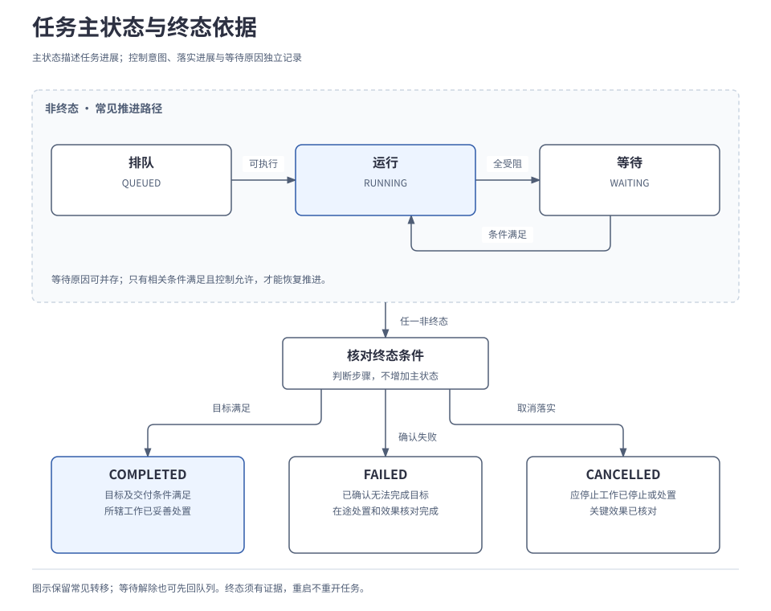
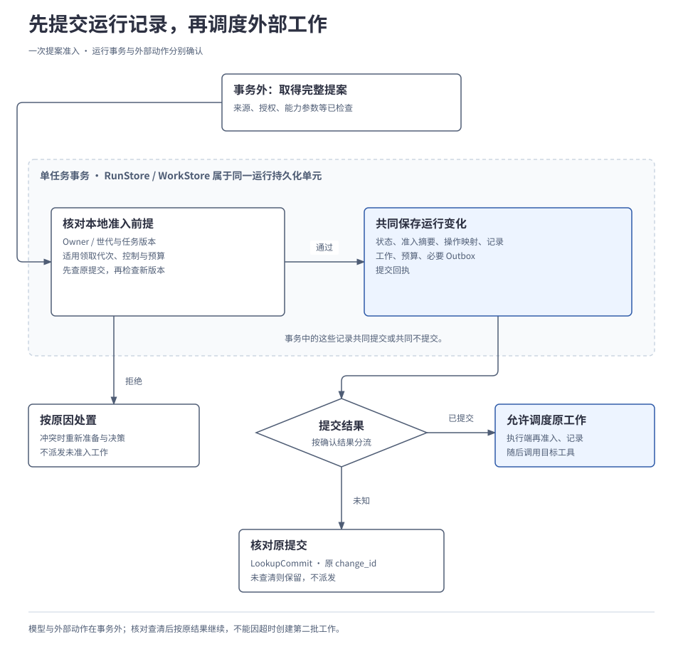
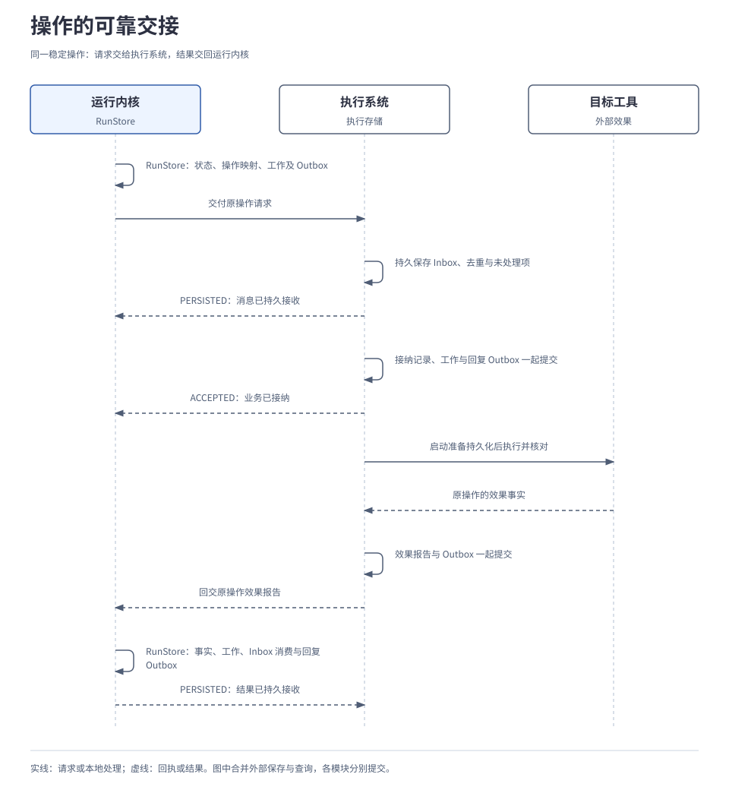

# 2.1 任务运行内核

<a id="04-任务运行内核"></a>

运行内核负责把用户要求、有限提案与执行报告转化为正式任务事实，并保存后续处理责任。Core 定义推进规则，RunStore／WorkStore 共同提交状态和工作，Scheduler／Worker 取得资格后处理有限步骤。它们使任务跨过模型调用、异步等待和进程重启，同时保留当前版本、控制与预算约束。

内部规则组织、Go 接口、工作状态、SQLite 事务与表结构已展开为[任务运行内核详细设计](../../design/01-runtime-kernel.md)。本章保留架构职责和运行解释，具体实现规格在详细设计维护。

## 本章要解决的问题

任务的推进责任要跨过模型调用、工具等待和进程重启。内核必须同时回答：已经接纳什么、下一步由谁处理、依据是否仍有效。采用以下选择来保存这些关系：

| 选择 | 得到什么 | 需要承担什么 |
| --- | --- | --- |
| 当前状态与记录共同保存 | 可直接读取进展，定位未完成工作。 | 维护两者一致性、数据迁移与保留规则；完整事件溯源则另需管理重放兼容。 |
| 内核持有任务规则，调度实现可替换 | 调整工作顺序和唤醒方式时保留相同生命周期。 | 实现并验证并发、公平性、期限和恢复资格。 |
| 自建内核，按共同契约接入持久工作流等实现 | 直接表达单机嵌入、端侧权威及本项目控制语义。 | 比较适配与总维护成本；既有恢复机制值得复用，接口可替换并不证明替换成本低。 |

<a id="components"></a>
### 状态规则、存储与工作执行怎样分工

| 职责 | 输入与输出 | 保存或维护的依据 |
| --- | --- | --- |
| 内核的任务规则 | 接收要求、提案与结果，决定能否形成新任务事实。 | 任务版本、控制、预算和依赖。 |
| `RunStore`／`WorkStore` | 原子提交任务变化和后续工作，再受约束地领取工作。 | 当前状态、回执、待办与领取资格。 |
| 调度逻辑与 Worker | 找到到期候选，领取后完成一轮有限处理。 | 领取代次与期限；通知只帮助发现工作。 |
| 执行系统 | 接纳已准入操作，调用工具并报告核对结果。 | 独立的执行记录、外部关联与效果证据。 |

这些是逻辑职责；任务存储和工作存储必须共同满足本篇的原子提交要求。下面先定义状态和推进资格，再沿“决策准入—持久提交—等待唤醒—可靠交接”展开。

<a id="1-内核保存哪些进展"></a>
## 1. 任务状态怎样表达等待与控制

运行内核保存任务目标、当前状态、已准入提案与操作关联、待处理工作、预算和控制要求。待处理工作说明接下来还要做什么，例如派发保存请求、等待保存结果、取得结果后读回。它们随任务变化持久化，使后续处理不依赖某个进程一直存活。

执行系统负责记录实际执行事实，包括操作的启动记录、外部作业关联及效果证据；内核将经过核对的报告纳入任务。上下文供大脑决策，不能代替这些恢复记录。

所有记录按个人用户隔离。每项任务由一个逻辑拥有者（Owner）负责推进，具体的一轮工作由执行者（Worker）领取和处理。Owner 的推进责任、Worker 的领取资格，以及进程和连接的存活分别管理，所以更换 Worker 不会自动转移任务所有权。

任务采用六个主状态。下图保留常见推进路径，并集中列出终态条件；终态判定框是判断步骤，不是新增状态。

[](../../diagrams/04-task-state.html)

例如，一项任务的全部可调度工作都在等待外部操作结果，此时可以进入 `WAITING`。这说明推进条件未满足；如果用户同时请求暂停，还需另行记录控制意图及落实进展。

同一个 `WAITING` 可以有不同原因，用户控制也可能尚未落实，因此分别记录：

| 维度 | 局部举例 | 含义 |
| --- | --- | --- |
| 主状态 | `WAITING` | 当前全部可调度工作受阻；存在可推进分支时仍可保持 `RUNNING`。 |
| 等待原因 | 等待原保存操作的结果 | 指明缺少什么事实或条件，允许多个原因并存。 |
| 控制意图 | `RUN`、`PAUSE` 或 `CANCEL` | 表达允许运行、暂停或取消的要求。 |
| 控制进展 | 已受理，尚未停稳 | 表达执行端落实到了哪一步。 |

暂停或取消受理后停止发起适用的新工作，在途动作仍须停止或核对；主状态可能继续为 `RUNNING` 或 `WAITING`。有效取消优先于暂停；恢复只解除指定暂停来源，保留其他暂停、等待和取消。`RUN` 也不意味着依赖已经齐备。

完成、失败和取消都须有对应证据，关键效果未知时继续核对。终态不会因迟到消息或重启重新打开；新的目标另建任务。所有权移交与用户控制的完整过程分别见[3.4 端云协同与离线运行](../03-coordination/04-edge-cloud-coordination.md)、[2.5 应用与交互](05-interaction.md)。

## 2. 大脑返回提案，内核决定能否接纳

大脑生成需要时间，期间用户可能补充要求，工具也可能返回新结果。内核需要判断：提案依据的任务情况，现在是否仍然成立？

内核用任务版本 `state_version` 表示单个任务运行状态的修订号。版本随任务记录保存在运行存储 `RunStore` 中，由内核在正式接纳相关变更的事务里推进；大脑读取对应快照，不自行改写版本。即使任务主状态一直是 `RUNNING`，目标、进展或控制依据也可能已经更新。参考存储使用 SQLite，提交边界在下一节展开。

| 变化 | 任务版本怎样处理 |
| --- | --- |
| 正式接纳补充要求、目标修改或任务所等的回答 | 随输入与后续工作一起提交新版本。输入仅到达或仍是草稿时尚未生效。 |
| 纳入执行结果、接纳提案或改变任务控制 | 随相关运行事实提交新版本；大脑此前读取的依据可能已经过期。 |
| 领取决策工作并预留生成预算 | 先提交，再以提交后的版本组装本轮输入。 |
| 编辑 UI 草稿、普通界面刷新或呈现回报 | 不直接推进任务版本；若交付是任务完成条件，内核仍须接纳对应的交付事实。 |
| 重复提交已经接纳的操作或结果 | 核对并返回原处理结果，不重复应用同一变更。 |

调用方提交修改时携带自己所依据的版本，称为预期版本。内核将它与当前版本比较，匹配才按该依据接纳，否则报告冲突。版本推进不等于每次都要调用大脑：保存结果确认后，可以直接继续已准入的读回工作。上述规则也不要求每次存储写入或续租心跳都推进任务版本。

生成开始前，内核先持久领取决策工作并预留预算。上下文使用这次提交后的任务版本，大脑在事务外生成；回来后还要按同一版本提交准入。这样，模型生成不会占住任务事务，而生成期间的变更仍能在准入时被发现；冲突后可能需要消耗剩余预算重新决策。下面只展开一轮决策，中文动作为行为示意，原子提交的内部检查见下一节。

```text
一次决策:
  读取当前事实与控制，优先恢复应先处理的既有工作
  领取本轮决策工作，并持久预留生成预算
  若该提交尚未确认: 转入原提交核对或故障处理，返回
  v = 领取与预算提交后的任务版本
  提案 = 在事务外按 v 组装受控上下文并生成完整提案
  若结构、来源、位置、能力、授权或预算校验不通过: 记录原因并返回
  结果 = 按预期版本 v 原子提交准入记录与待处理工作
  若已确认提交: 允许调度已保存的工作
  若版本冲突: 读取新状态，在剩余预算内重新决策
  若提交未知: 查原提交，查清前不派发、不重新决策
  若其他明确拒绝: 保留原因，按当前控制与准入条件处理
```

例如，大脑按版本 7 生成提案时，用户补充了一项新的输出要求，正式更新将任务推进到版本 8。旧提案即使参数合法也会冲突，须按新状态重新决策。版本号仅作示意；提案被拒绝也要结算已知生成用量，未知用量继续保留预算预留。

能力检查包含参数校验，准入提交仍须原子复核运行控制与资格。计划文字只有变成明确请求并通过准入，才会成为持久工作；重新生成不能改写已准入操作的目标和参数。

一个有限批次可以整体准入，各个外部动作分别确认。例如，提案请求“保存文件，并在保存效果确认后读回”，两个动作的准入记录一同提交，读回仍须等待保存的效果证据。实际处理端仍须再次检查当前权限和条件。来源复核与远端来源删除也没有全局原子性，其有效性边界由[2.2 上下文、记忆与证据](02-context-and-memory.md)说明。

## 3. 把状态与后续工作一起提交

如果只记录“已接纳保存”，却没保存需要派发的工作，进程退出后就可能漏掉这一步。因此，一次准入必须在同一任务事务里保存新状态、关联记录、操作映射、待处理工作、预算及必要的待发送记录（Outbox），让后续发送责任也能恢复。

运行存储 `RunStore` 提供读取、提交、核对原提交和枚举待恢复任务的接口。工作存储 `WorkStore` 负责受约束的领取、续租与完成更新；二者属于同一运行持久化单元。默认 SQLite Adapter（存储适配实现）共同承担这两个职责，不能以“任务已写库、工作仅发往另一队列”替代原子提交。

提交时还要确认调用方现在是否有权推进任务。任务已经移交后，原拥有者不能继续提交新状态；一段工作已被其他 Worker 接手后，旧 Worker 也不能沿用原领取凭据写入。

为此，存储在提交事务中核对 Owner 世代和适用的 Worker 领取代次：前者记录任务推进权的更替，后者区分同一工作先后的领取资格。任务版本检查提案依据是否仍有效，这两项检查提交者是否仍有资格；三者必须分别核对。

下图标出本任务事务的范围。模型生成、工具调用、记忆修改、子任务及 UI 调用都在事务外，执行系统另行保存自己的执行记录。

[](../../diagrams/04-admission-commit.html)

以下沿“准入—派发—等待”对照两方各自持有的事实。表格表达记录之间的关系，不是数据库表结构，工作进展描述也不是新增状态枚举。

| 时点 | 内核的运行记录 | 执行系统的记录 |
| --- | --- | --- |
| 准入提交前 | 尚无这批新工作的准入记录。 | 尚无这批操作的执行记录。 |
| 准入已提交，尚未派发 | 稳定操作映射、依赖、派发工作、预算和提交回执已共同保存。 | 尚未接纳操作，不能推断外部效果。 |
| 已派发，进入异步等待 | 保存等待依据；所有可调度分支受阻时才将任务记为 `WAITING`。 | 已接纳操作，保存外部关联、实际进展及后续核对责任。 |

例如，保存和读回一同准入时，内核登记保存的派发工作，并保留读回依赖。执行端接纳保存只建立处理责任，不能据此解除读回对保存成功的依赖。

一次原子变更用内部 `change_id` 标识，提交结果未知时按它查原回执。事务中的检查次序与伪代码见[详细设计的提交过程](../../design/01-runtime-kernel.md#commit)。

先查原提交，再判断新的版本冲突，使成功提交的重复请求返回原回执。资格检查与写入在同一事务中完成，避免“检查时有效、落盘时已过期”。达到存储声明的耐久条件后，才允许派发。这只确认运行记录已经保存；文件是否写入，仍由执行结果证明。

## 4. 等待中的工作怎样再次被处理

<a id="41-一个保存操作可以跨越多轮处理"></a>
### 4.1 异步操作可以跨越多轮处理

外部系统返回“仍在进行”后，Worker 可以结束当前轮次，后续再查询进度。任务、操作、外部作业和工作轮次因此具有不同的生命周期：

| 对象 | 持续范围与责任 |
| --- | --- |
| 任务 | 管理整体目标、工作依赖和交付条件，满足终态要求后才结束。 |
| 稳定操作 | 固定一次逻辑行动，从发起、多次查询到结果报告始终关联同一身份。 |
| 外部作业 | 目标系统实际进行的异步工作，可以在调用者结束本轮处理后继续。 |
| Worker 的一轮工作 | 领取后做一段有限处理，持久提交本轮进展及后续安排后结束。 |

一轮处理结束后，持久记录承接后续责任。Worker 可以释放本地执行槽供其他工作使用，外部作业仍占用的配额继续保留。例如，文件保存仍在外部服务中进行时，发起保存的 Worker 不必一直驻留；查询责任及原作业关联必须已经保存。

### 4.2 从记录等待到再次查询

执行系统保存原作业关联、安排查询并报告事实；内核把核对后的事实纳入任务，推进依赖已满足的后续工作。正常过程如下：

1. 执行端 Worker 取得外部作业关联后，共同保存原操作、作业关联、当前进展及下次核对条件；确认提交后结束本轮。
2. 调度逻辑分批扫描持久保存的未决工作，找出到期候选。唤醒通知可加快发现，漏通知或进程重启后仍能从记录找回。
3. 下一轮 Worker 取得有效领取，读取原操作、外部关联及当前进展，在事务外查询原作业。处理者可以更换，更换不改变原操作或任务拥有者。
4. 作业尚未完成或效果仍需核对时，保存新事实及下一次有界核对安排，再结束本轮处理。
5. 效果确认后，执行系统保存结果及待发报告。内核核对报告，更新依赖和后续工作；当前控制、授权和预算允许时，才继续调度。

到期只意味着可以尝试领取。调度策略从候选中选择先后顺序，领取时还要通过存储约束检查依赖、当前资格、控制、授权、期限和资源预算。扫描周期与通知方式由实现选择；恢复依据保存在持久记录中。

执行端每轮都把新事实、后续核对或报告责任一起保存，再释放可释放的槽位；提交未知先查原提交。对应扫描与提交伪代码见[内核细则 B](../../reference/runtime-details.md#poll)。

查询原作业不重新发起保存，也不需要反复调用模型。内核只有在全部可调度分支受阻时才将任务记为 `WAITING`；某个分支符合推进条件时可以继续。调度器与 Worker 始终遵守内核的任务状态转换规则。

### 4.3 正常交接与故障接手

领取凭据带有代次和有效期，后者称为租约。Worker 在本轮实际处理期间按需续租，正常结束时提交进展和后续安排，无需等租约过期。外部等待由已保存的核对工作承接。

如果 Worker 崩溃，领取过期后，其他合格 Worker 可以竞争恢复责任。过期不证明旧外部调用已停止，新处理者仍须查询原作业；旧领取不能直接推进状态，迟到事实的处理见[第 6 节的局部故障示例](#6-两个局部故障怎样继续)。领取代次约束本轮执行者，任务版本约束所依据的进展，Owner 世代约束任务推进权，三者不能互相替代。

相关持久存储不可用时停止发起新的外部动作，已发动作可能继续发生；保留最后确认的状态并标明其可能陈旧，不声称已持久化新的 `WAITING`。单次调用超时、租约、任务硬期限和授权有效期分别处理。重启不清零预算、不清除控制，也不自动延长期限；预算耗尽仍保留有界的取消、核对与处置路径。

## 5. 模块怎样可靠交接

行动提案通过内核准入后，还要交给执行系统接纳。一次逻辑操作可能经历多条消息和多次提交，必须分别关联：

| 标识 | 关联什么 | 重试时怎样使用 |
| --- | --- | --- |
| `operation_id` | 本次行动的种类、目标、输入等逻辑意图。 | 同一次行动及其核对沿用原操作；改变输入或目标是新的意图。 |
| `change_id` | 一个存储作用域内的一次原子变更。 | 提交结果未知时查原变更；一个业务操作可经历多次提交。 |
| `message_id` | 一条应用消息。 | 原样补发保留身份；新的查询、响应使用新消息身份，仍可关联原操作。 |

待发送记录（Outbox）保存交付责任，收件记录（Inbox）保存接收及待处理责任。下图沿同一个稳定操作展示请求与结果的两次交接；外部执行和异步查询合并展示，每次持久提交只覆盖所属模块的本地记录。

[](../../diagrams/04-reliable-handoff.html)

[查看 Mermaid 源码](../../diagrams/04-reliable-handoff.mmd)。图中的 `PERSISTED` 只确认消息持久保存，`ACCEPTED` 只确认业务接纳；资源是否取得、文件是否写入仍需另行核对。执行端在外部调用前落实当前权限等启动检查，并持久化启动准备记录。

最后一次内核提交合并保存接收到的结果、核对后的任务事实、后续工作、Inbox 消费标记及必要回复 Outbox。重复结果不重复推进状态或结算预算；后续操作和交付仍按原依赖继续，收到某项操作的报告不直接使任务完成。

接收与消费可以分两阶段，但持久接收后必须能找回未处理记录。跨独立存储转交时，用同一操作幂等受理并查询原结果；目标已受理而转交方尚未记账，不得再创建一个业务操作。稳定身份与消息去重提供恢复依据，外部动作是否可安全重试仍取决于工具的幂等、核对能力及当前授权。

消息去重记录、操作记录和提交回执分别按恢复义务保留。清理关键明细前，既要确认没有剩余恢复义务，也要先保存关闭水位，标明已停止首次受理的旧请求范围。查不到已清理记录时明确报告恢复边界，不能当作“从未执行”。完整执行行为见[2.4 能力与执行](04-tools-and-devices.md)。

## 6. 两个局部故障怎样继续

以下分支各自从明确的故障位置开始，均由原任务的逻辑拥有者处理；更换 Worker 不等于迁移任务所有权。

| 独立分支 | 恢复动作 | 必须守住的边界 |
| --- | --- | --- |
| 准入提交回执丢失，尚不清楚该批操作是否已登记。 | 用 `LookupCommit` 查询原 `change_id`；确认后沿原操作映射和工作继续。 | 未查清前不派发、不新建第二批工作；一次未查到不证明旧提交永远不会成功。 |
| Worker A 的领取过期，B 取得新代次，A 随后返回保存报告。 | 拒绝 A 用旧领取直接推进状态；保留带来源的报告，由当前有资格的处理者核对并纳入任务。 | 领取过期不证明旧外部调用已停止，B 不能据此重新保存。 |

本地提交未知查原提交；执行端受理或外部效果未知查原操作，由执行系统核对实际效果。不能把这两种不确定性都转换成“让模型再生成并执行一次”。若已确认提交未发生，可以按原变更及当前前提恢复；若版本已变化，则重新读取、重新决策。

数据库事务不覆盖电脑上的文件写入，已发生的效果也不会因任务取消自动撤销。更完整的故障组合、耐久确认及恢复调度见[4.3 故障恢复与运行保障](../04-engineering/03-reliability-and-recovery.md)。

## 7. 这套运行模型的收益与代价

当前基线是可嵌入的 Go 内核，以 SQLite 提供默认持久化，保存当前状态并追加关联记录。恢复从当前状态和未决工作开始，按需核对原操作；历史记录用于追溯和诊断。

这套设计增加持久提交、去重及核对开销，收益须通过相同任务、预算和故障条件的比较验证。机制研究见[持久运行机制与存储选项](../../../research/harness-durable-runtime-options.md)，它提供设计依据，不代表相关引擎已被项目集成。

验证至少覆盖原子提交各故障窗口、并发版本冲突、重复提交、旧 Worker 迟到和文件数据库重启恢复。内存替身只能提供基础契约证据；持久后端替换还需共同耐久性测试。本文及图示是设计说明，实际运行证据由[4.5 实施路线与能力验收](../04-engineering/05-roadmap-and-validation.md)交付。

完整[标识与版本对照](../../reference/01-data-model.md#identity-version)、[任务字段](../../reference/01-data-model.md#runtime)及[原子组与保留规则](../../reference/01-data-model.md#atomic-retention)见附录 01。

---

[上一章：1.6 关键选择与代价](../01-system/06-key-decisions.md) · [正文目录](../README.md) · [下一章：2.2 上下文、记忆与证据](02-context-and-memory.md)
