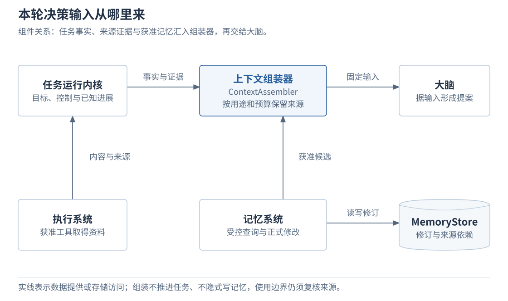
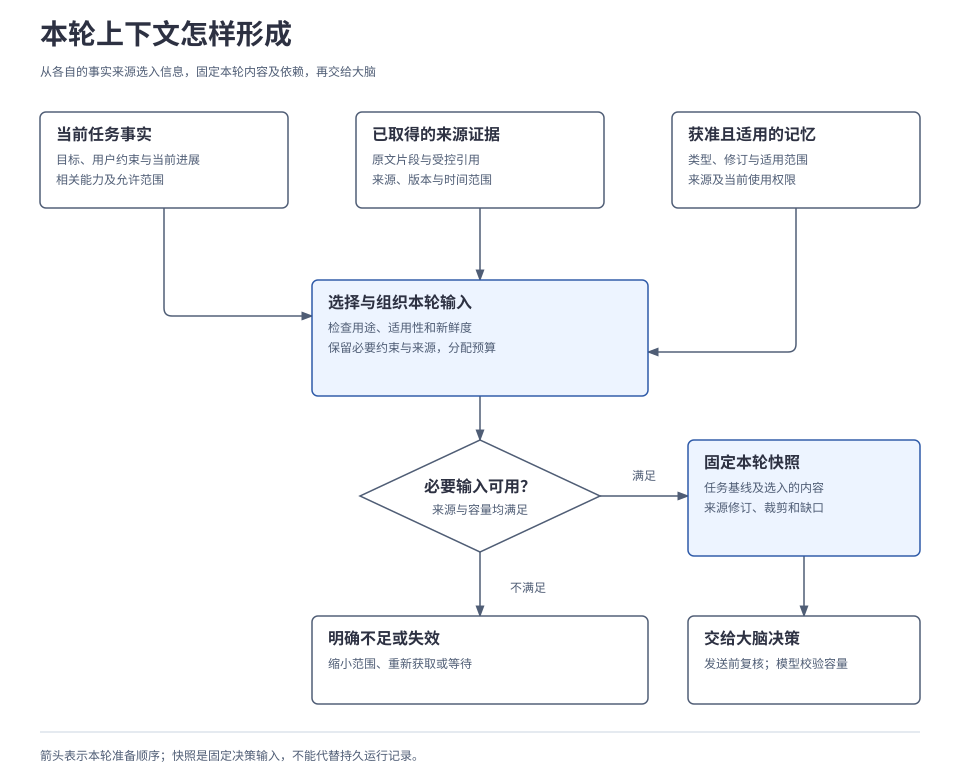
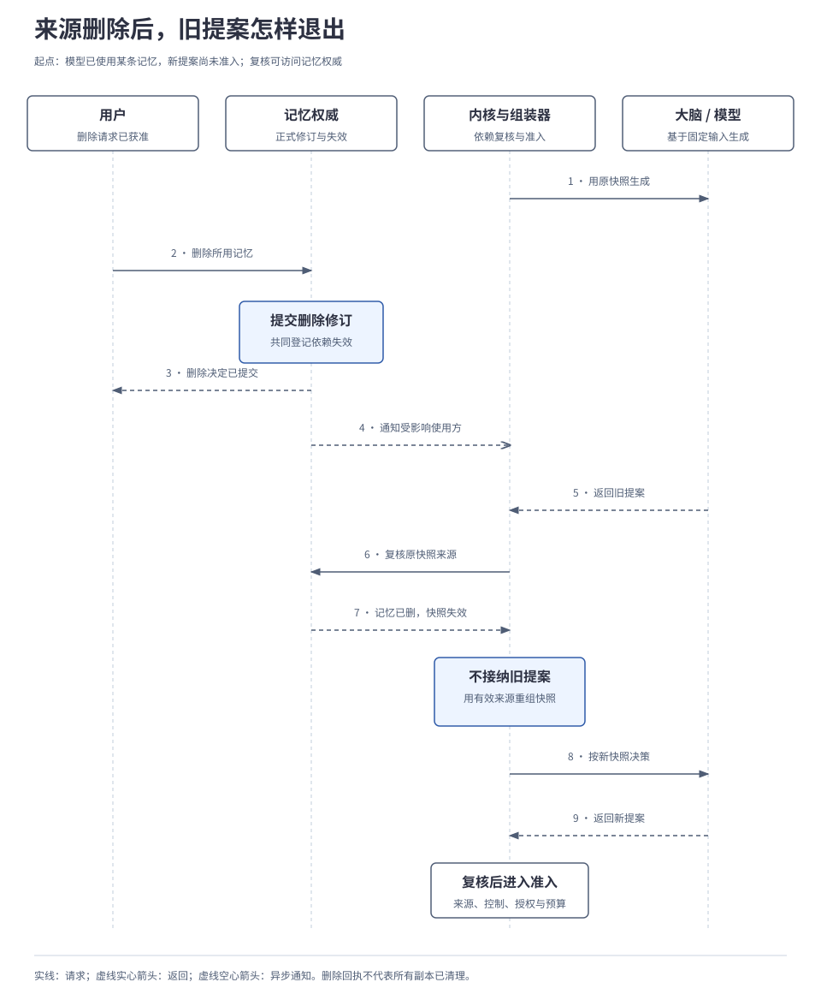

# 2.2 上下文、记忆与证据

<a id="05-上下文记忆与证据"></a>

大脑需要知道当前目标、已取得的资料和适用的用户偏好，才能决定下一步。系统按本轮用途与预算组装上下文，并保留来源依赖，以便资料或权限变化后停止使用旧依据。本篇说明信息怎样成为证据、长期记忆怎样参与决策，以及纠正和删除怎样影响已有上下文。

## 本章要解决的问题

一次决策需要同时使用运行事实、来源资料和获准记忆，它们的修改权威与有效期不同。把它们组织成一份输入之后，仍要能追溯每个判断依据，并在来源变化时停止使用受影响的内容。

| 问题 | 设计选择与限制 | 展开位置 |
| --- | --- | --- |
| 任务进度、材料和偏好容易混为一份历史。 | 分别保存，按当前用途组装；上下文不能代替恢复记录。 | [信息分工](#components) |
| 模型输入有限，裁剪可能丢掉约束或来源。 | 保留必要事实与条件，再选片段；装不下时报告不足。 | [组装过程](#3-一次决策实际收到什么) |
| 生成期间偏好可能被纠正或删除。 | 快照登记依赖，在使用边界复核；无法撤回已发送给外部的数据。 | [来源变化](#5-记忆变化后已有上下文怎样处理) |

<a id="components"></a>
### 先看本轮输入从哪里来

上下文组装器（ContextAssembler）把当前任务事实与获准候选组织成一份固定输入。记忆系统提供候选及来源，大脑消费组装结果；组装器不推进任务，也不隐式保存长期记忆。

[](../../diagrams/05-information-components.html)

内核提供已接纳的运行事实，执行系统取得外部材料，记忆权威维护正式修订；组装器消费这些依据。后文先区分这些输入的用途，再走通本轮组装、记忆写入和失效处置。

## 1. 保存下来的信息各有什么用途

运行事实、决策输入和长期记忆具有不同的写入方与生命周期。ContextAssembler 读取这些信息，只形成一次决策的输入；它不会把来源的维护权转移到快照中。各类信息按下表分工：

| 信息 | 用途与边界 |
| --- | --- |
| 任务状态与执行记录 | 内核保存已取得哪些资料、哪些操作已接纳及其结果；执行系统提供实际执行事实。这些记录是推进与恢复的依据。 |
| 当前上下文 | 为本轮决策选出的目标、约束、进展、资料片段和相关记忆；随决策需要重新组装。为恢复而保存它，不会增加长期使用权限。 |
| 长期记忆 | 获准跨任务复用的格式偏好等信息，带来源、类型、修订和适用范围。当前任务的资料不会自动写入。 |
| 来源证据 | 实际取得的来源内容及其受控引用，用于支撑或检查结论；来源和时间仍需判断。 |
| 产物与派生内容 | 任务要求的文件等产物是交付物；检索索引、压缩摘要是从来源派生的内容，需跟随来源失效或重建，不能成为唯一事实记录。 |

例如，“电脑已保存摘要”须由执行事实及核验依据支持；模型生成的一句“已保存”不能替代它。“项目尚未满足交付要求”这类综合判断，则应保留实际进展与验收要求的来源，以便核对推导依据。

## 2. 从取得内容到形成证据

用户提供的文件位置只是获取入口。执行系统仍要通过获准工具取得内容，将内容或受控引用、来源位置、片段、获取时间和可取得的来源版本交回任务。原文未提供发生时间或版本时，应明确缺失；获取时间不能冒充事实发生时间。

例如，要判断项目能否交付，需要同时取得实际进展和验收要求。假设以下两个片段已获准读取并用于本次判断：

| 已取得的证据 | 能支持什么 |
| --- | --- |
| 会议记录：“资料导入已验收；摘要导出仍在联调，尚未验收。” | 说明记录时的完成与未完成事项，不能证明之后的进展未变化。 |
| 需求说明：“支持资料导入和摘要导出；两项均须通过验收。” | 提供整体交付判断的要求依据。 |

对照这两份材料，可以得到“依据现有资料，尚未满足全部交付条件”的判断。结论保留两个来源，并说明其时间范围；资料没有提供的后续进展仍是缺口。格式偏好即使获准使用，也只能改变表达方式，不能补充缺失的事实。

若任务需要搜索，搜索结果先提供候选来源，再按需要获取支持结论的实际内容。只有标题或摘要时，应明确证据范围；不能把检索命中写成已读取全文。执行系统负责取得信息，大脑负责结合证据形成判断，记忆系统不会替不同来源裁决真假。

来源冲突时并列保留各自主张、时间和适用范围；获取失败时记录未取得哪部分。来源更新更晚、检索排名更高或模型置信分数更大，都不能单独证明其主张正确。必要证据不足时，大脑缩小结论范围、请求补充或提出后续获取，不能补写成确定事实。

## 3. 一次决策实际收到什么

<a id="31-把本轮输入摆出来"></a>

### 3.1 明确输入的用途与有效范围

组装器接收内核已经确定的任务基线、当前决策用途和可用预算，返回固定输入、来源清单及缺口说明。调用方需要知道的不只是“拼出了哪些文字”，还包括这些文字在什么条件下可继续使用。

| 输入部分 | 组装要求与调用方可作的判断 |
| --- | --- |
| 目标与约束 | 保留当前目标、用户限制、完成依据与允许的数据处理范围，防止裁剪改变任务。 |
| 运行事实 | 来自内核已接纳的任务版本；实际执行进展由核对后的报告提供，模型叙述不能补成事实。 |
| 证据 | 选择支持本轮判断的内容及来源、版本，显式表达冲突、缺失和新鲜度范围。 |
| 记忆 | 仅选择获准且适用的修订；命中不代表允许使用，偏好不代替事实。 |
| 能力 | 提供当前可用能力的说明、准确版本与参数约束；选择过程见[规划与决策](03-planning-and-decision.md)。 |
| 容量与缺口 | 说明输出预留、裁剪、不可用来源与估算方式，让大脑能判断输入是否足够。 |

任务版本与来源修订分别跟踪：前者固定运行基线，后者表达证据或记忆的有效性。一份来源已过期的输入，不会因为任务版本未变就重新有效。

### 3.2 怎样选入、压缩和复核

把所有历史内容都塞入模型，会挤占必要证据和约束的位置。组装过程先限制可使用范围，再选择与当前目的相关的信息，最后检查预算和来源。下图按输入的维护方展示一轮组装：任务事实、来源证据和获准记忆分别进入，输出固定本轮内容及其依赖。

[](../../diagrams/05-context-assembly.html)

目标、用户约束、关键执行结果的确定性和必要授权条件必须保留。长正文可以选片段或压缩，压缩结果仍携带来源修订，并区分资料事实与综合判断。为模型输出和协议包装预留容量；不能精确计数时采用声明的保守估算，再由实际模型 Adapter 在发送前核验。

下面的伪代码仅说明组装顺序，中文动作为行为示意，省略协议字段和排序算法：

```text
组装本轮上下文(任务事实, 用途, 预算):
  在当前授权范围内取得证据与相关记忆候选
  必留 = 目标、约束、关键运行事实及必要证据片段
  为输出和协议包装预留容量
  若必留内容仍无法容纳: 返回预算不足
  在剩余预算内选择适用记忆与正文片段
  压缩时保留来源修订、冲突、缺失及裁剪说明
  若必要来源已失效或不可用: 返回重新组装或缺失
  固定本轮内容、任务版本、来源清单和组装策略版本
  返回上下文及选择依据
```

这份固定结果称为上下文快照，用于核对一次决策实际采用的输入。允许留存的正文才保存进快照；否则保存受控引用，恢复时重新获取或报告缺失。只保存引用可以遵守正文留存限制，但恢复依赖来源仍然可用。来源引用本身不授予访问权，诊断与重放也不能成为额外保留副本的理由。

快照便于核对“当时依据什么决策”，但只反映检查时及声明的新鲜度范围。发送模型前、模型返回后，以及发布答案或启动新行动前仍要检查适用性；具体失效过程见[第 5 节](#5-记忆变化后已有上下文怎样处理)。若必要约束无法装入预算，应报告不足或缩小输入范围，不能静默删掉约束继续执行。

## 4. 一条长期记忆怎样形成和复用

### 4.1 类型、来源与用途一起保存

用户明确说出格式偏好，可以产生候选记忆；系统也可以从获准交互中提取候选。读取、提取、长期保存和同步分别检查权限。一次任务中使用了某种格式，不足以自动认定用户长期偏好该格式。

各类信息可以使用同一套带类型和修订的记录模型，避免把每一种记忆都做成独立服务：

| 类型 | 局部举例及适用限制 |
| --- | --- |
| 事实 | “会议记录记载资料导入已验收”，关联具体项目、来源及时间；获准保存后才能跨任务使用。 |
| 偏好 | 用户明确要求“先列待办，再列已完成”，仅用于获准的项目进展摘要。 |
| 推断 | “用户可能更关注待办”只能标为推断，保留推导来源和依据，不能冒充明确偏好。 |
| 经验 | 从已完成任务提取的处理经验须关联运行证据和适用条件；保存经验不等于批准其自动改变执行策略。 |

记录还需表达描述对象、内容 Schema、置信判断及依据、保留期限和允许用途。发生时间、记录时间与有效区间各有含义；不同来源的置信分数不能直接当成同一尺度。策略引用用于找到约束，不能代替授权凭证。

### 4.2 写入正式修订，再按需检索

一个记忆集合由一个逻辑修改权威提交正式修订，其位置可以在端侧或云侧，且不等同于任务拥有者。一次记忆写入经过授权后，记忆存储在同一本地事务中写入记录、操作回执、集合变更及必要失效通知。它与 RunStore 通过持久交接协作，不能假定存在跨库事务。

重试沿用同一操作身份；提交结果未知时查询原记忆操作。纠正或删除携带目标记录及预期修订，冲突则读取获准的新版本后形成新的修改意图，不能按设备时间覆盖，也不默认让模型自动合并。跨端草稿与正式修订的同步过程见[3.4 端云协同与离线运行](../03-coordination/04-edge-cloud-coordination.md)。

下一次组装时，先限定用户、用途、可见范围和新鲜度，再检索相关候选。例如，一条已获准保存、仅适用于项目进展摘要的排序偏好，在其他任务中命中时仍需核对用途，不能一律采用。无权记录不能通过命中数、片段、索引或排序解释泄露。

参考实现支持元数据过滤与文本检索，可用 Adapter 增加语义检索或重排，无需把 Embedding 服务或向量数据库作为单机运行前提。效果取决于是否找到了适用信息并正确使用，单次关键词命中不能证明个性化有效。

## 5. 记忆变化后，已有上下文怎样处理

### 5.1 只使受影响的依赖失效

任务版本只说明运行事实是否变化。上下文还依赖来源修订，所以即使任务版本未变，记忆被纠正或删除也可能使本轮依据失效。内核必须分别检查任务版本和上下文来源。

| 变化 | 对当前使用的影响 |
| --- | --- |
| 已使用的记忆被纠正为新修订 | 普通检索使用可用的新修订；依赖旧修订的索引、摘要和上下文失效，重新选择输入。 |
| 已使用的记忆被删除或不再允许用于本任务 | 阻止新的使用，清理受控内容及派生副本；已知失效的上下文和提案不能继续采用。 |
| 必要来源不可访问或过期 | 明确报告缺失或新鲜度不足，重新获取、缩小范围或等待；不把不可访问直接说成已删除。 |
| 无关的另一条记忆变化 | 不使所有任务重启；失效范围由实际来源依赖决定。 |

同一来源被压缩进混合摘要时，先使整个摘要失效，再从仍获准的来源重建。显式复制到其他受控对象的内容也须登记来源依赖，否则无法可靠判断清理范围。重启或长期等待后，也从当前有效来源和内核事实恢复；不能仅凭旧摘要继续。

<a id="52-模型生成期间用户删除了-p"></a>
### 5.2 生成期间来源失效，怎样阻止旧提案被采用

删除提交与决策生成可能并发发生。记忆权威保存删除及失效责任，使用方在模型返回后复核实际依赖；收到失效通知可以提早停止，未收到通知也不能省略复核。

下图假设本轮模型输入已使用一条获准记忆，新的行动尚未准入；用户有权删除该记忆，复核时能够访问记忆权威。图将内核与组装器合并展示，重点是删除提交与决策复核的交接。

[](../../diagrams/05-memory-invalidation.html)

例如，被删记忆规定“先列待办、再列已完成”。发现删除后，使用方停止采用依赖它的旧提案，从当前任务事实、仍有效的证据和其他获准输入重新组装。删除只意味着旧偏好不再参与排序，并没有指定相反的新顺序。

新提案仍须复核来源、任务控制、授权与预算，再走[《任务运行内核》的准入过程](01-runtime-kernel.md#2-大脑返回提案内核决定能否接纳)。持续变化使输入无法稳定时，有界重试后等待；不能无限调用模型。

复核没有覆盖所有存储、节点和外部动作的全局原子性。严格要求最新状态的用途须在线核验；离线使用须暴露最后核验依据及有限有效窗口。已发送给外部模型的数据无法靠本地删除撤回；已启动动作按取消、核对和处置契约处理，已发生效果仍保留最小事实记录。

### 5.3 “删除完成”需要说明完成到哪里

删除须覆盖指定记录的受控内容、副本、缓存、索引和摘要；只从列表隐藏不够。提交决定、阻止使用和清理传播的速度不同，结果按维度报告：

| 维度 | 应报告的事实 |
| --- | --- |
| 权威提交 | 删除未提交、已提交或结果未知；本机先抑制使用不等于权威已提交。 |
| 本地使用与清理 | 是否已阻止新使用，正文是否仍在清理。异步清理期间也不能经索引或旧操作回包读出被删内容。 |
| 副本传播 | 哪些受控节点已应用，哪些待应用或不可联系；离线和移出管理的节点不能算作已清理。 |
| 派生内容与归档 | 摘要、上下文缓存及受控备份的失效或清理进度，以及超出控制范围的部分。 |

离线副本重返时不能复活已删除内容。因此，清理正文后仍保留必要删除标记与同步水位；只有相关副本已应用删除，或旧同步资格已持久关闭并要求重建后，才能清理这些元数据。游标失效和旧备份恢复须先重建或隔离，具体规则见[记忆细则 A](../../reference/memory-details.md#replicas)。

运行记录保留动作是否发生及最小核对身份，敏感载荷另行清理。受控输出和改进产物接收来源失效通知，按自身生命周期下架或重建。原始外部来源、用户已导出的副本不因删除一条记忆自动消失；备份按声明的生命周期清理，也不承诺立即物理擦除。

## 6. 实现如何替换，效果怎样验证

调用方依赖行为接口，检索算法和存储实现可以分别替换。接口名表示设计职责，尚非已实现的代码签名。

Memory 负责受控读写与原操作核对，ContextAssembler 负责组装和复核，MemoryStore 与 MemorySync 分别承接持久化和同步。查询必须区分完整零命中、部分覆盖与可见但不可用；索引命中仍须复核当前权限。完整方法边界及默认存储方式见[记忆细则 B](../../reference/memory-details.md#interfaces)。

| 验证问题 | 必须取得的证据 |
| --- | --- |
| 偏好真的起作用了吗？ | 在相同任务、模型配置和预算下比较有／无适用偏好的输出，检查排序遵从性及事实正确性；同时覆盖无关、冲突和已删除偏好。 |
| 缺口会被误说成完整吗？ | 获取失败、部分查询、过期来源和容量不足均可观察；必要约束不会因压缩丢失。 |
| 生成期间删除是否有效？ | 已知失效后旧提案不被采用，重新组装不含被删记忆；索引、缓存及回执不再返回其正文。 |
| 重试和恢复是否保留语义？ | 原操作核对不生成重复记忆，版本竞争明确冲突，旧副本与备份不复活删除内容。 |
| 替换实现后是否仍成立？ | 共同契约覆盖权限、修订、幂等、查询完整度和失效；持久 Adapter 另测重启耐久性，不能用内存替身测试代替。 |

这些是设计与验收要求，尚无运行结果。局部例子中的固定文件证据不代替真实联网问答验收；检索、个性化与引用质量的比较方法见[4.4 评测、比较与发布](../04-engineering/04-evaluation-and-release.md)，能力验收见[4.5 实施路线与能力验收](../04-engineering/05-roadmap-and-validation.md)。

---

[上一章：2.1 任务运行内核](01-runtime-kernel.md) · [正文目录](../README.md) · [下一章：2.3 规划、决策与模型调用](03-planning-and-decision.md)
