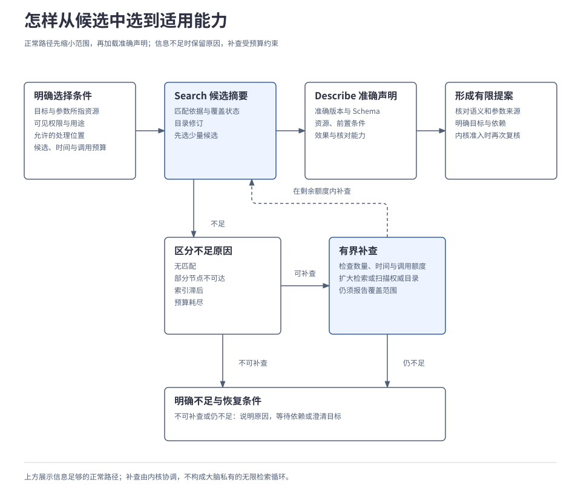
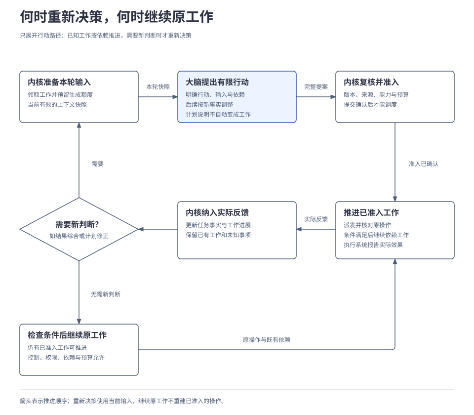

# 2.3 规划、决策与模型调用

<a id="06-规划决策与模型调用"></a>

Brain 根据受控上下文和当前任务事实提出有限工作，ModelAdapter 承接具体模型调用；Core 检查并接纳完整提案，执行系统产生实际反馈。这样的决策循环把模型判断和行动准入分开，也要求大脑依据持久事实恢复，不能只靠模型会话记住进度。本章解释能力选择、提案形成、继续与停止，以及模型调用的预算边界。

## 本章要解决的问题

大脑负责作出新判断，内核负责保存已经接纳的工作。两者以有限提案交接：先找到适用能力，再形成可检查的目标、参数和依赖；执行反馈回来后，才判断是否需要新的决策。

<a id="components"></a>
### 谁决定内容，谁决定能否行动

| 边界 | 输入与输出 | 负责的行为 |
| --- | --- | --- |
| `Brain.Decide` | 版本化任务、受控上下文、能力和额度 → 完整有限提案或明确失败。 | 规划、能力选择、参数准备、结果综合；不推进任务权威状态。 |
| `Model.Generate` | 受控内容、所需模态、输出 Schema 与生成限制 → 完整结果、结束原因及可获得的用量。 | 适配供应商差异，区分流式增量和完整输出；不自动执行工具调用。 |

内核提供已预留额度的版本化输入，收到完整提案后复核来源、控制、权限与预算并原子准入。大脑和模型都不能直接推进任务状态或启动工具。这样可以分别替换决策策略与供应商，但要承担输入准备、完整输出校验和冲突后重新决策的成本。

| 关键选择 | 解决什么问题 | 成立条件或代价 |
| --- | --- | --- |
| 候选检索后加载准确声明 | 大目录无需全部进入模型输入。 | 必须表达覆盖缺口，补查和加载也计入预算。 |
| 有限提案，完整校验后准入 | 把模型建议变成可恢复且有边界的工作。 | 生成结束时依据可能过期，合法格式不等于准入成功。 |
| 已知等待按规则推进 | 保存进度查询无需反复规划。 | 查询责任、依赖与预算必须持久保存。 |

<a id="3-从大目录中选到真正适用的能力"></a>
## 1. 先从大目录中取得适用能力

能力目录超过 1000 个 API 时，把全部 Schema 放进上下文会增加输入成本，也让近义能力更容易混淆。参考设计先按权限、资源、用途和允许处理位置限制范围，检索少量候选摘要，再按准确版本加载必要声明，由大脑选择行动并准备参数。

能力选择需要先取得候选，再核对候选的精确契约：

| 目录入口 | 返回什么 | 用来判断什么 |
| --- | --- | --- |
| `Search` | 候选、匹配依据、目录修订和覆盖状态。 | 哪些能力可能适用，以及候选范围是否完整。 |
| `Describe` | 指定版本的完整参数规则、前置条件与效果保障。 | 本次目标、输入和恢复要求是否满足声明。 |

准确版本不可用就明确失败，不能悄悄使用最新版。补查和声明加载通过内核协调的上下文准备进行；其中用到模型也要计入预算。查询和声明本身同样受数据策略约束，本地可见的能力不要求上传云端目录。

例如，用户要求把一段已确定的内容写入指定文件。假设目标设备、路径和内容均已明确，目录中有两个获准候选，但当前没有编辑器会话。只比较它们的前置条件，就能说明为什么检索命中还不等于可用：

| 候选 | 所需前提 | 当前是否适用 |
| --- | --- | --- |
| 在指定路径保存文档 | 显式接收设备、路径和内容，并提供所需的效果核对能力。 | 具备这些输入后，可继续核对准确声明。 |
| 保存编辑器中的当前文档 | 已建立编辑会话，当前文档及内容已确定。 | 缺少会话事实，不能靠名称相近推定适用。 |

若任务还要求读回核验，需要另选读取能力，并将读取目标绑定到同一文件。Schema 校验只说明参数形状和取值合法；用户、设备、目录和其他前提仍须核对。检索排名不授予执行权限，发现时的许可在实际准入时还要复核。

下图展示正常选择与信息不足时的补查边界；四个主步骤属于同一受控准备与决策过程，不要求四个独立服务。

[](../../diagrams/06-capability-selection.html)

候选缺失也可能来自检索覆盖不足。例如，能力已经登记且可用，但索引尚未更新，首次 Search 漏掉了它。此时应保留“索引滞后、覆盖不足”，不能把候选列表解释为完整目录，更不能据此断言目标系统没有该能力。

内核协调的准备步骤可在候选数量、时间及调用预算内扩大检索，必要时扫描权威目录；找到候选后仍须 Describe 准确版本。若补查后仍不足，就报告缺少哪项能力信息，以及等待目录恢复、补充目标信息或其他处理所需的条件。无匹配、部分节点不可达、索引滞后和预算耗尽分别表达，不能靠一个空数组掩盖差别。

优先使用适用、可用且获准的 API。没查到候选不自动授权 GUI 兜底；API 超时、限流、拒绝访问或效果未知也不等于没有 API。改走 GUI 仍须满足相同目标、权限、数据位置和效果核对要求；原保存效果不明时先核对，不能再点击一次“保存”制造重复写入。完整目录与执行规则见[2.4 能力与执行](04-tools-and-devices.md)。

<a id="1-从-c1-到一份可以准入的提案"></a>
<a id="2-从-c1-到一份可以准入的提案"></a>

## 2. 从受控输入到有限提案

受控输入包含目标、约束、当前运行事实、证据与适用记忆、能力的准确版本及预算。内核先领取本轮决策工作并预留生成额度，再以提交后的任务版本调用 `Brain.Decide`。大脑据此形成有限提案：明确请求哪些工作、各自使用什么输入、依赖什么结果。计划中提到的后续步骤，只有成为明确请求并通过准入，才会成为可执行工作。

生成内容时，资料事实、综合判断和格式偏好分别处理。综合判断保留推导来源，偏好只影响组织方式；被描述的业务目标是否完成，与当前整理或交付任务是否完成也分别判断。完整的资料对照和摘要产物见[任务示例](../../examples/01-task-lifecycle.md)。

下面仅用“保存后读回”说明如何表达依赖。假设内容已经形成，目标和必要权限已明确，两项能力的准确声明已加载。中文键名是提案内的教学依赖键，字段不是已发布协议；认证材料和完整 Schema 从略。

```text
类型：请求行动
决策基线：本轮输入对应的任务版本与上下文快照
计划说明：保存内容 → 读回核验 → 交付结果
本次明确请求：
  保存：指定路径写入能力（准确版本）
     设备、路径：任务已确定的目标
     内容：本轮形成的完整内容及必要来源
  读回：指定文件读取能力（准确版本）
     设备、路径：与保存请求相同
     依赖：保存效果已确认成功
     用途：取得实际文件内容，供核对
```

这份提案只请求保存和读回两个动作，核验判断与交付仍须后续落实。准入时内核把局部依赖键绑定为稳定操作，整个批次的运行记录一起保存，各个外部动作分别产生效果。读回不能因为保存请求已被接受就提前执行，也不能因保存失败而照常读取旧文件。

大脑还可能返回其他类型的提案；主要类型互斥，不能一边请求新动作，一边宣告完整成功。

| 提案类型 | 要交代什么 | 接下来由谁落实 |
| --- | --- | --- |
| 请求行动 | 有限请求、目标、参数与依赖。 | 内核准入，执行系统产生并报告效果。 |
| 请求委派 | 有限子目标、可披露输入、约束和结果要求。 | 内核建立持久委派关系，生命周期见[3.3 多 Agent 协作](../03-coordination/03-agent-collaboration.md)。 |
| 请求等待 | 缺少什么、为什么影响继续、满足什么条件能恢复。 | 内核记录等待；其他分支仍可运行时，不把整项任务置为等待。 |
| 提交结果 | 回答或产物、证据、完成判断与未解决事项。 | 内核复核发布与终态条件；部分结果可以先交付。 |

简单问答可以直接提交结果。提案可附简短依据，无须保存模型内部思维过程。大脑不能私下执行工具、写长期记忆或创建子任务；供应商返回的工具调用 ID 也只用于 Adapter 内的响应关联，不能充当 Harness 的稳定操作身份。

<a id="2-哪些反馈需要再次决策"></a>
## 3. 哪些反馈需要再次决策

执行反馈到达后，先判断已有工作是否已经规定下一步。查询进度、满足依赖后派发操作和推进既有发布都可按规则处理；需要选择新行动或综合新结果时，才准备下一轮决策。这一区分使已知等待无需反复调用模型。

[](../../diagrams/06-decision-loop.html)

| 当前事实 | 由谁继续什么工作 | 是否需要新的决策 |
| --- | --- | --- |
| 本轮必要输入与能力信息已齐备，尚无可用提案 | 大脑组织内容与行动。 | 需要。 |
| 已准入操作仍在进行 | 内核与执行系统按已记录责任查询进度、保存反馈。 | 通常不需要。 |
| 前置操作的效果已确认 | 内核检查当前控制、权限和预算，调度依赖已满足的操作。 | 不需要重新提出原批次。 |
| 新结果需要综合，或与要求不符 | 大脑结合新事实判断交付内容或修正办法；可机械核验的部分由规则或验证能力完成。 | 需要新判断时调用。 |
| 正式结果已接纳，仍待交付反馈 | 发布与交互模块推进已有工作。 | 通常不需要重新生成答案。 |

例如，一次保存仍在进行时，只需按原操作查询；保存效果确认后，内核可以调度已准入且依赖满足的读回。读回内容与要求不符，才可能需要大脑决定怎样修正。图仅展开请求行动的路径，结果、等待与拒绝分别按相应条件处理。

图中的“继续原工作”以还有可推进的已准入工作为前提；条件未满足时按持久等待机制处理，不空转。一次 `Decide` 可以包含有限次模型生成，例如修复输出格式，因此“决策轮次”和“模型请求次数”分别计数。

用户改变目标、必要证据失效，或执行失败使剩余计划不再适用时，需要基于新事实调整。返回的提案若已不匹配当前任务版本，参考实现拒绝旧提案，再重组上下文；重新生成不能改写已准入操作的目标或参数。

内核首版在目标更新后冻结尚未派发的目标工作，由新决策显式复核；KEEP／DROP、仅复核提案和可能已发送操作的限制由[详细设计](../../design/01-runtime-kernel.md#updates)维护。同一任务最多一轮有效决策，失联旧调用按[决策恢复](../../design/01-runtime-kernel.md#decision)处理，未知用量不释放。

如果短时间内连续到达多条尚未处理的反馈，内核可以集中处理这些已持久化事实，再基于更新后的状态触发一次决策。这样减少的是决策次数；可靠业务结果仍须保留，决策也继续受预算约束。

若不清楚内核是否已提交提案，先核对原提交，再决定恢复工作或重新决策。版本化准入、等待唤醒和提交核对的完整机制见[2.1 任务运行内核](01-runtime-kernel.md)。

## 4. 一次决策内部怎样调用模型

模型配置固定本轮所用能力；一轮决策可以包含有限次生成，各次请求分别计量。

策略与供应商接口的职责见[开篇分工](#components)。这里展开 Model.Generate 怎样在一轮 Decide 的限制内完成生成。

模型声明需反映实际支持的模态、结构化输出、容量、流式能力和处理位置。先满足任务必需能力与数据位置约束，再按配置选模型；本地模型不足时，不能把只允许留端的资料自动发给云端，也不能丢掉必要图像假装完成同一请求。

以下伪代码说明一次 Decide 内怎样控制生成。输入已经过上下文组装，额度已经由内核持久预留；省略适配器字段和内核最终准入事务，不在循环内另开无界预算。

```text
固定本轮大脑、模型配置、Skill 与上下文组装版本
在本轮已预留的生成额度、修复次数和期限内：
  若已知输入失效或收到停止控制：返回明确原因
  生成结果 = Model.Generate(受控输入, 输出规则, 本次限制)
  记录本次请求及可获得的用量；未知用量保留待结算
  若能力不支持、输入无效或生成被取消：返回明确原因
  若暂不可用或输出截断：仅按有界重试／回退配置继续，否则返回失败
  若完整输出格式无效：在原约束下有限修复，否则返回失败
  若得到完整合法提案：返回提案，交内核复核与准入
额度或期限耗尽：返回不足原因与已有引用
```

格式修复只解决结构问题，不能放宽用户要求、增加权限或编造缺失参数。截断的工具参数不能执行；连接断开不等于确定失败或零用量，重新生成也不保证逐字相同。每次供应商请求分别计数，模型 Adapter 不能额外隐藏重试。输入变化需要重组上下文，不能靠改写旧输出绕过版本检查。

流式增量是临时输出，正式答案须经过完整校验、来源复核与发布准入。可选预览还要求允许逐段披露，且界面能标明草稿和失效。如果必须看完全文才能判断是否允许披露，就先缓冲完整内容。已经显示的内容无法保证撤回。

增量积压也必须有上限。消费者处理不过来时，发送方需要放慢或暂停交付，这称为**背压**；消费者中止后，生成侧不能继续无界生成。界面契约由[2.5 应用与交互](05-interaction.md)展开。

## 5. 什么时候停止，什么证据才算完成

预算限制自主工作的范围。每次生成、行动和委派在使用前预留，得到消耗证据后结算；修复、回退和最终未采用的生成同样消耗额度。崩溃或超时造成用量未知时，预留保持占用，重启不能恢复成未使用余额。

| 停止条件 | 接下来的行为 |
| --- | --- |
| 必要信息或能力暂不可用 | 有限尝试后等待具体依赖，记录恢复条件与期限。 |
| 重复建议已处理动作，且没有新观察或验收进展 | 达到配置阈值后报告无进展依据；可澄清则等待输入，否则进入失败处置。 |
| 目标工作预算耗尽或业务期限已过 | 停止增加目标工作；允许补充时等待有权主体提交调整，否则进入失败处置。 |
| 仍需取消、核对或恢复 | 使用另设的有界处置额度；不能用于扩展目标，关键效果未核清时不伪造终态。 |

无进展判断综合规范化请求、已记录工作、观察变化和验收条件，不能只比较模型文字是否相似，也不能保证识别所有循环。预算调整须由有权主体提交并持久化，模型修改自己的预算描述不会生效；暂停、取消由内核落实，不依赖模型自行遵守。父子任务的额度分配与回收在[3.3 多 Agent 协作](../03-coordination/03-agent-collaboration.md)完整说明。

决策次数、调用次数和本地已知配额可以强制限制。外部模型金额通常还受供应商计量能力制约：没有可执行的保守上界或可验证配额，仅凭 token 价格估算不能承诺精确账单上限。

停止增加工作与目标已经完成分别判断。完成判断沿任务的验收要求核对证据，不能把较早阶段的回执当成最终结果：

| 已取得的事实 | 能确认什么 | 仍须核对什么 |
| --- | --- | --- |
| 请求已被持久接纳 | 对应模块承担了处理责任。 | 实际动作及其效果。 |
| 效果已确认，产物可以读取 | 指定操作产生了相应结果。 | 内容是否满足要求、结论是否有来源。 |
| 产物与来源已核对 | 相应产物符合要求。 | 任务是否还有必要交付或其他未完成工作。 |
| 必要交付已有反馈 | 已取得约定的交付事实。 | 是否仍有未处置的必要工作或关键未知效果。 |

例如，任务要求生成文件并在手机呈现位置时，文件生成成功还不足以证明任务完成；需要取得手机呈现反馈。呈现也不证明用户已阅读、理解或同意。

路径、文件存在和交付反馈可按规则核验；内容是否忠实于资料还要检查证据支持、冲突和缺口，开放回答的质量另需评测。不存在能证明任意自然语言目标已完成的通用判定器。

若必要分支失败或关键效果未知，可以交付已验证部分并标明缺口，不能宣告完整成功。目标额度耗尽也不能把尚待核对的工作直接标成失败或已取消；即使处置额度不足，仍要保留待核对事实及所需资源。

## 6. 实现怎样替换，效果怎样验证

参考大脑从版本化任务事实和已准入工作恢复，供应商会话 ID、隐藏上下文或模型内部状态不能成为唯一恢复来源。下一轮可以更换大脑或模型；新大脑须能读取工作信息的版本，不兼容时先迁移或等待明确处置。已准入工作继续按原身份核对，不能把旧计划再执行一次。

默认能力目录使用 SQLite 和嵌入式文本检索，支持关键词、分类与别名，保持无需独立检索服务的单机起点。索引可重建，语义检索和重排序可按接口替换。更复杂的检索可能提高召回，也增加准备时延、输入和模型成本；候选扩大、上下文裁剪、记忆选取与最终模型调用需要一起比较。

候选数量、补查幅度、重试和无进展阈值由版本化配置固定。[决策参考策略](../../reference/decision-details.md)中的示例参数仍是设计建议，本篇不把它们升级为统一默认值或运行结论。

| 验证问题 | 必须观察的结果 |
| --- | --- |
| 有限提案与内核边界是否成立？ | 非法参数、未知必需类型、循环依赖、过大或超预算批次明确拒绝；过期提案不准入，部分流式参数零执行。 |
| 候选是否真的适用？ | 覆盖近义能力、缺失前提和索引遗漏；候选不足可解释，参数与目标正确，不虚构能力或绕过权限。 |
| 停止与恢复是否保留事实？ | 修复、回退均计入用量，无进展有界；未知用量不归零，已准入操作不因恢复而重复，未核清效果不被终态掩盖。 |
| 大脑、模型能否分别替换？ | 两种独立策略及模型 Adapter 通过共同契约检查；能力差异显式表达，不要求输出逐字相同。 |
| 真实模型是否有效？ | 固定目录、样本、模型与预算，比较选择、参数、最终任务效果、时延及全流程成本；同时报告正确不执行的情况。 |

超过 1000 个 API 指不同业务能力规模；多个驱动实现不重复计数。首次调用正确率至少 90%、有限重试后任务成功率至少 95% 是**验收目标，尚非实测结果**。候选遗漏计入适用样本的首次失败；内部修复或重试不能重写首次记录，错误写入后再改正确也不能抹去原副作用。

脚本化大脑和模型替身可检查契约、预算与恢复；它们不能证明真实模型达到质量目标。当前本篇交付的是设计正文与静态文档检查，评测和验收方法分别归[4.4 评测、比较与发布](../04-engineering/04-evaluation-and-release.md)与[4.5 实施路线与能力验收](../04-engineering/05-roadmap-and-validation.md)。

---

[上一章：2.2 上下文、记忆与证据](02-context-and-memory.md) · [正文目录](../README.md) · [下一章：2.4 能力与执行](04-tools-and-devices.md)
