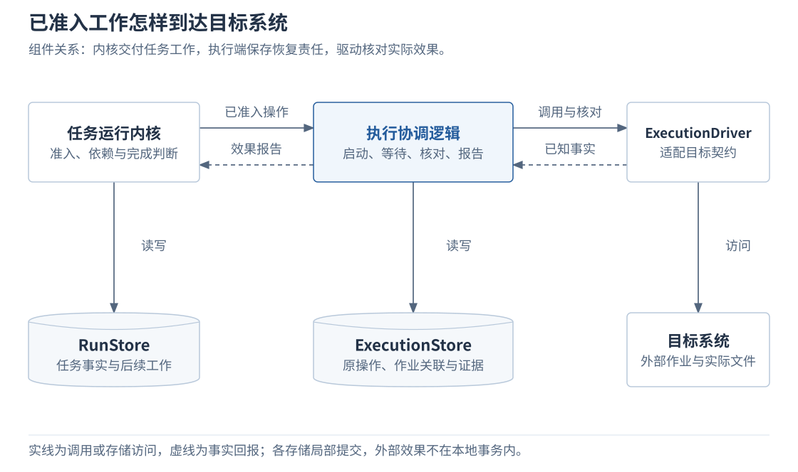
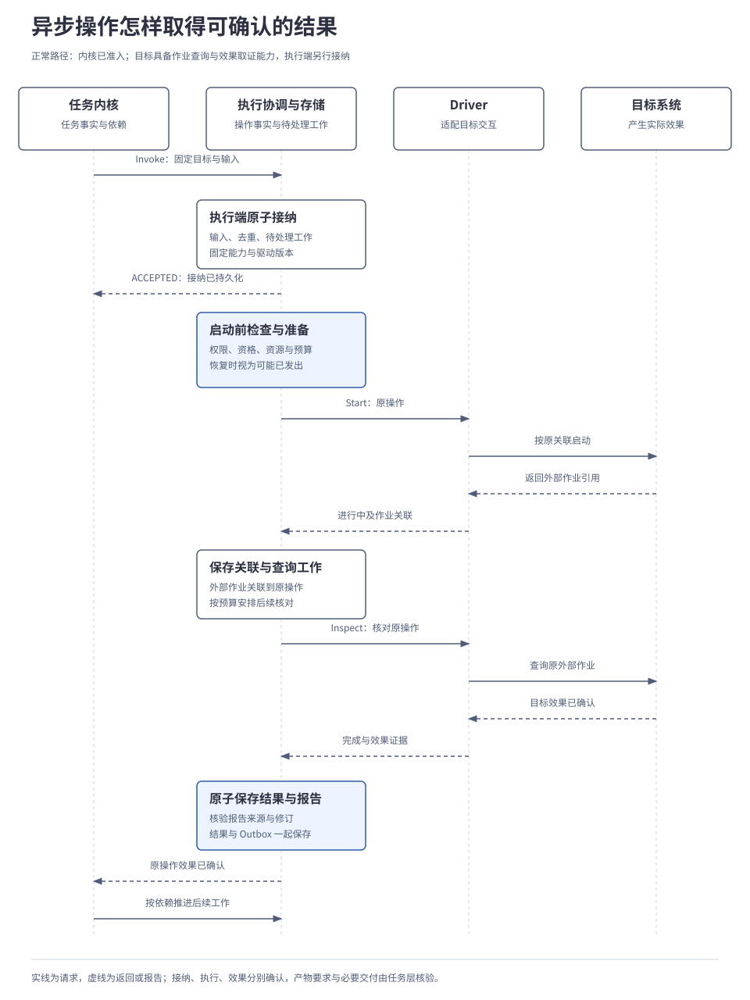
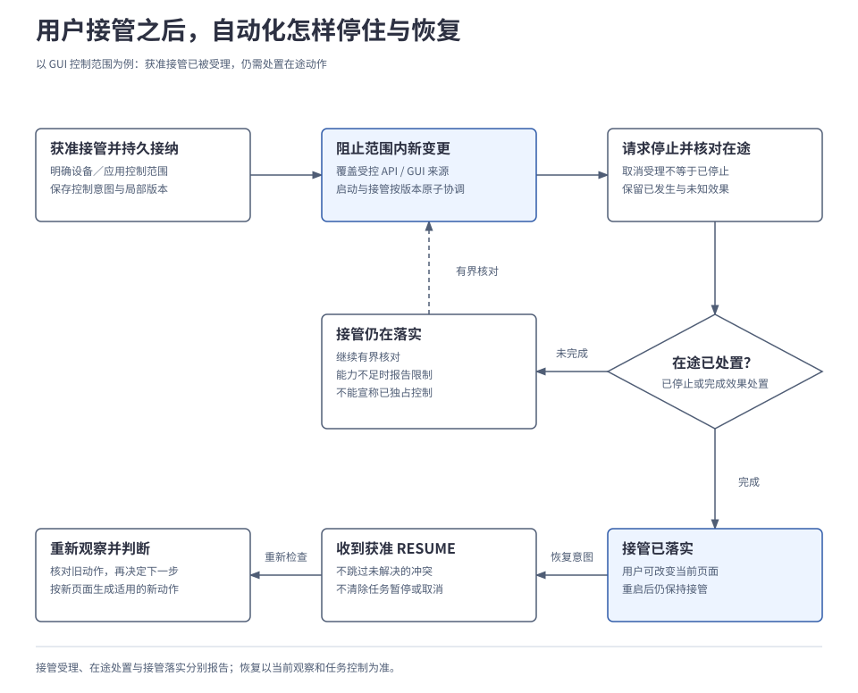

# 2.4 能力与执行

<a id="07-工具执行与设备操作"></a>

执行系统负责持久承接已准入操作，将固定输入和实现交给 Driver，并分别确认请求进展与实际效果。能力目录提供可发现的候选和准确声明，ExecutionCoordinator 管理执行、资源与核对责任，ExecutionStore 保存原操作依据。本章先说明这些边界，再展开异步执行、未知结果和 GUI 控制。

## 本章要解决的问题

执行端接纳请求后，外部动作与本地记录可能暂时不同步。本章围绕“能够证明哪一步已经发生”安排执行、核对和接管；关键取舍如下。

| 问题 | 设计选择与代价 | 展开位置 |
| --- | --- | --- |
| 内核已准入，目标系统仍可能拒绝或失联。 | 执行端独立持久接纳并复核启动条件，增加一次事实交接。 | [执行分工](#components)、[执行过程](#save) |
| 保存可能发生，回执却没有落盘。 | 启动前保存恢复责任，之后沿原操作核对；证据不足时需要等待或人工处置。 | [回执丢失](#unknown) |
| 页面和用户控制会在动作前变化。 | GUI 动作绑定观察前提，接管覆盖资源范围；恢复时重新观察。 | [GUI 闭环](#gui)、[资源接管](#takeover) |

<a id="components"></a>
## 1. 执行端怎样承接内核的工作

内核决定哪些动作可以成为任务工作，执行系统负责把已准入操作落实到目标，并报告实际效果。驱动负责对接目标系统；执行协调逻辑保存原操作、安排启动与核对，不能把恢复责任交给一次网络调用。

[](../../diagrams/07-execution-components.html)

执行模块向调用方提供四种行为：接纳调用、读取已记录状态、安排效果核对和请求取消，分别对应 `Invoke`、`GetInvocation`、`Reconcile` 和 `RequestCancel`。

模块内部，执行协调逻辑安排这些工作，通过 `ExecutionStore` 保存事实与后续责任，再调用 `ExecutionDriver` 与目标系统交互、取得证据。目标系统若不支持幂等或可靠停止，共同执行模块也不能替它提供这些保证。这里的接口名表示设计契约，尚非已发布 SDK。

图中是逻辑职责。内核的任务事务、执行端的本地事务和目标系统的实际变更分别发生；任何一边提交成功，都不能替另一边证明完成。

<a id="1-选好的能力怎样对应到具体实现"></a>
<a id="capability"></a>
## 2. 开始前固定能力、版本与恢复保证

能力声明表达目标行为，驱动（Driver）负责与目标系统交互。同一能力可以有不同驱动实现；能力的语义版本、参数 Schema 和驱动实现版本分别记录。一次调用固定所用版本，使恢复仍按原契约解释输入和结果。版本绑定也需要维护：原实现失效或需要隔离时，按[扩展升级规则](08-extensions-and-runtime.md)处置，不能悄悄换成最新版。

`Search` 查候选，`Describe` 取指定版本的准确声明；分页、覆盖范围及失效规则见[细则 A](../../reference/execution-details.md#catalog)。选择与补查策略在[2.3 规划、决策与模型调用](03-planning-and-decision.md#3-从大目录中选到真正适用的能力)展开，本篇关注执行必须依赖的声明：

| 声明内容 | 执行前需要核对什么 |
| --- | --- |
| 行为、输入输出与资源 | 目标资源与输入明确，用户作用域匹配，内容或其受控引用可以获准读取。 |
| 版本与实现 | 能力及 Schema 的准确修订、内容校验值、实现引用与固定的驱动版本。 |
| 前置条件与运行范围 | 当前权限、处理位置、资源控制、离线与并发条件是否允许调用。 |
| 副作用与恢复保证 | 动作如何生效，能否去重、查询原操作、确认效果和取消；相应作用域与有效期是什么。 |

例如，“指定路径写入”能力需要固定目标设备、路径和内容，还要说明能否查询原操作、取得本次写入的证据。即使路径合法、工具可用，也不能据此推定具备去重或取消保证。

目录负责提供声明，执行端仍须检查真实可用能力和当前条件。查询、声明、输入、截图与日志也受数据策略约束；只允许端侧使用的信息不能因工具或本地模型不足而自动发送到云端。

<a id="2-一次保存怎样开始等待并报告"></a>
<a id="save"></a>
<a id="3-一次保存怎样开始等待并报告"></a>

## 3. 操作怎样开始、等待并报告

内核准入后，执行端还需持久接纳操作，保存启动准备，再在事务外调用 Driver。以下展开目标系统以异步作业处理请求的情况：目标已声明可查询原作业及提供所需效果证据，当前权限、位置、控制与预算允许执行。

稳定操作身份来自内核准入结果；外部作业引用由目标系统提供，用于关联这次实际执行，不是新的 Harness 操作。图中把执行协调逻辑和执行存储放在同一列，本地提交与外部调用仍分别发生。

[](../../diagrams/07-execution-sequence.html)

执行端先鉴别调用者及其访问权限，再查询是否已接纳原操作。同一操作、相同语义返回原回执；同一身份携带不同目标或参数必须拒绝。真正的新操作才应用当前接纳窗口与版本检查，并把去重记录、输入、固定实现及可执行工作原子保存。敏感载荷清理后若已无法可靠比对，不得将旧请求重新当成新操作接纳。

启动操作前，执行端检查当前授权、数据位置、任务与 Worker 资格、资源控制和预算，并持久保存启动准备。提交确认且启动条件仍允许时，才在事务外调用 Driver。

恢复时如果只找到这条准备记录，仍不能判断外部请求是否已发出：进程可能在调用前退出，也可能在调用后、结果落盘前退出。因此，恢复者须核对原操作，不能据此直接重发。

下面是启动顺序示意，省略传输和完整授权字段。单次许可的消费须与原操作启动登记原子关联，具体授权与凭证机制在《身份与授权》展开。

```text
启动原操作：
  领取执行工作，读取原操作的固定输入与已知事实
  若已有启动准备或执行事实：转入原工作恢复，返回
  在执行存储事务中：
    校验记录版本、当前资格、控制及适用准入条件
    保存启动准备、可预先确定的关联、资源占用与恢复工作
  若提交结果不明：先查原提交，查清前不调用 Driver
  仅提交确认且启动条件仍允许时，在事务外调用 Driver.Start(原操作)
  通过版本和资格检查，保存返回事实、外部关联及后续工作
```

`ExecutionStore` 管理操作事实，`RunStore` 管理任务事实。二者可由同一个 SQLite 文件承载，仍保留各自的逻辑原子组，不把外部效果装进本地事务。执行存储提供 `Load / Commit / LookupCommit / ListRecoverable`；恢复扫描只得到候选，处理前还要重新领取并检查资格。

Driver 在启动、检查和取消时分别报告已知事实：作业号只说明可跟踪，检查不得暗中重做原操作，取消受理也不证明停止。方法边界见[细则 B](../../reference/execution-details.md#driver)。

取得外部作业引用后，将原操作与外部作业的关联、当前进展和下次查询工作一起持久保存，再结束本轮处理。等待期间通过有界轮询或经来源验证的推送取得反馈。进度可以合并，可靠结果不能丢弃。迟到的“处理中”不覆盖已确认完成，相互矛盾的终局证据保留来源并进入核对。

报告必须分开表达几个维度，以下列出常用值，完整枚举归入查阅附录：

| 维度 | 示例 | 说明 |
| --- | --- | --- |
| 业务接纳 | `ACCEPTED` | 执行端已持久接纳原操作，外部动作未必开始。 |
| 执行阶段 | `IN_PROGRESS`、`FINISHED`、`UNKNOWN` | 原调用进行到哪里，或当前无法判断。 |
| 调用结果 | `SUCCESS`、`FAILURE`、`UNKNOWN` | 调用报告了什么结果。 |
| 效果核对 | `UNVERIFIED`、`CONFIRMED`、`CONTRADICTED` | 证据是否支持声明的效果，或与之矛盾。 |

例如，接口返回成功却没有足够证据关联到目标写入时，不能直接把效果标成已确认。取得充分的效果证据后，执行端将结果与待发送报告（Outbox）一起保存；内核按原操作和报告修订消费，再按当前控制、授权及预算推进依赖已满足的工作。产物是否符合内容要求、必要交付是否完成，仍由任务层核验。

<a id="3-保存已经启动作业号却丢了怎么办"></a>
<a id="unknown"></a>
<a id="4-保存已经启动作业号却丢了怎么办"></a>

## 4. 启动回执丢失后怎样核对原操作

外部调用与本地记录之间存在故障窗口。例如，文件服务已经启动一次保存，但包含作业号的回执丢失，执行端只保留启动准备，没有持久保存外部作业引用。即使本地没有“发送成功”，也不能断言外部没有执行。这时需要核对原操作是否生效。

下面对照两种预先声明的能力条件，不是在故障后临时更换驱动：

| 目标提供的核对能力 | 恢复者怎样处理 |
| --- | --- |
| 可按原操作对应的幂等键或可证明的业务关联查询 | Driver 沿该关联找回外部作业引用或结果，继续核对原保存；确认效果后才允许依赖保存成功的后续工作。 |
| 只能凭随机作业号查询，且外部作业引用已丢失 | 明确缺少关联，保留未知效果与待核对工作。等待获准证据或人工处置，不能另发一次保存。 |

文件恰好存在、界面弹出成功提示，或相同目录中出现一个同名文件，都不自动证明“这次保存已按要求产生效果”。证据必须说明目标、来源、观察时间和能够支持的结论；读取文件或其他取证若需要新动作，也要单独准入，不能绕过既有操作对保存成功的依赖。

```text
恢复可能已经发出的原操作：
  读取原输入、固定实现、已知关联与控制状态，并取得核对资格
  若本地提交仍未知：先核对，未查清则等待，不推进后续
  若已有足够终局证据：恢复待发报告，返回
  若有可用关联且 Driver 声明支持核对：
    事实 = Driver.Inspect(原操作, 已知关联)
    保存核对事实、证据及后续工作；按依赖推进或继续等待
  否则：保留未知效果，说明缺少的关联或核对能力
  不因超时、重启或查询无记录，直接创建新的保存操作
```

核对请求同样受权限、频率、时间和处置预算限制，不能无限轮询。查询不到记录只有在目标保证查询覆盖充分，且旧请求已不可能稍后执行时，才可作为未生效证据；过期幂等键和不完整查询都不足以支持这一结论。

重新发送只有在确定未发送，或目标仍提供适用于原操作的有效幂等保证等条件下，才由执行协调逻辑按预算安排。Driver 不开启隐藏的 SDK 副作用重试。这样避免因回执丢失重复产生效果，但核对能力不足时，任务可能需要持续等待证据或人工处置。

更改目标或参数须建立新操作，原操作的未知效果仍要先处置；本地去重不构成外部动作“恰好一次”的通用保证。

取消也沿用这组事实：先阻止适用的新动作，对在途工作请求停止并核对。若取消与完成同时发生，按证据报告实际结果；不可取消时继续跟踪，不能清空记录或提前释放仍被占用的资源。超时只结束本次等待，未证明外部停止。

<a id="4-gui-怎样形成观察动作和核验闭环"></a>
<a id="gui"></a>
## 5. GUI 怎样形成观察、动作和核验闭环

API 包括本地与远程接口，适用、可达且获准时优先使用。缺少适用 API 或满足已声明的兜底条件时，可以考虑符合相同目标、授权、处理位置与核对要求的 GUI 路径。超时、限流、拒绝访问和未知效果各自处理，不能用点击绕过权限，也不能在原操作效果未知时改走 GUI 再保存一次。

显式切换到 GUI 通常会改变能力目标和参数，因此使用新的操作身份并关联原工作；原 API 记录继续保留。若 Adapter 内部确实提供统一逻辑调用契约，内部切换也必须遵守其去重与效果保证。

GUI 需要反复观察，才能确认动作目标和实际效果。以修改一条待办备注为例：

> 把手机待办应用中已有事项“检查附件”的备注替换为“周五前完成”。

这个局部例子假设：该模拟应用没有适用 API，目标事项唯一且已存在，用户已授权必要观察及该事项的备注修改，模拟驱动支持原子校验观察前提。

| 当前观察 | 本次动作 | 下一次观察要确认什么 |
| --- | --- | --- |
| 待办列表可见，目标尚不在当前区域 | 按允许范围滑动，再观察列表。 | 找到目标事项及其当前定位。 |
| “检查附件”已定位 | 点击该事项。 | 进入的确实是目标详情，备注字段可编辑。 |
| 正确详情和备注字段已确认 | 以**替换**模式输入“周五前完成”。 | 当前字段内容正确；此时尚不能断言已保存。 |
| 目标和输入仍符合前提 | 点击保存，再观察反馈。 | 保存发生了什么，是否需要继续等待或核对。 |
| 已取得保存反馈 | 返回列表，重新观察、定位并打开同一事项。 | 备注仍为目标内容，支持“已保存”的结论。 |

这张表表达行为顺序，每一步仍经过有限提案、内核准入和执行端检查，不是一段不看反馈的点击脚本。重新打开后的内容可支持备注保存成功，但不能单独证明物理动作只执行了一次。

观察携带设备与应用定位、采样时间、设备生命周期和视图版本，以及结构树或图像引用、坐标系和定位方式。结构树提供当前可见控件信息；图像路径则须用声明支持的感知能力理解画面。坐标依赖图像尺寸与方向，控件引用也只在对应观察范围内有效。

动作携带必要观察前提，页面或设备已经变化就拒绝旧前提并重新观察。新观察改变动作语义时创建新操作，不能改写旧动作的参数。输入明确区分替换与追加，重复追加不是幂等。

真实驱动若不能把“核对页面仍符合观察前提”和“执行动作”作为一个不可分割的步骤，页面就可能在检查之后、动作发生之前再次变化。驱动必须说明这个检测窗口及其竞态限制，不能仅凭截图版本承诺消除错点。

<a id="5-多个任务使用设备用户接管怎样落实"></a>
<a id="takeover"></a>
## 6. 多个任务使用设备，用户接管怎样落实

如果只取消当前这一次点击，另一个任务仍可能继续操作手机。因此，接管作用于明确的资源控制范围，并由该范围的执行协调方持久管理。

| 情形 | 默认控制方式 |
| --- | --- |
| 同一设备的 GUI 变更 | 串行执行；不同设备可并行。更细粒度并行须有驱动声明与验证，只读观察的并发及一致性也由驱动说明。 |
| API 操作 | 按业务资源、版本前提及接口能力控制并发，不因在同一设备就全部串行。 |
| API 与 GUI 会修改同一资源 | 映射到共同控制范围；关系不明时保守扩大到获准的相关应用，避免换一条路径继续干扰用户。 |

一个受控范围由可验证的协调方管理，不让任意节点独立授予竞争控制权。协调方不可达时新竞争动作等待，心跳超时不能证明旧执行者已停止。一般任务的离线授权也不自动授予共享资源的新控制权。Harness 无法锁住不受它控制的第三方写入，只能通过观察和版本冲突发现变化。

用户接管需单独取得对应资源范围的控制权限，修改一条业务记录的许可不能自动扩大为设备控制权。下图以设备的 GUI 控制范围为例，从获准接管已提交开始，展示阻止新动作、处置在途动作到恢复自动化的过程。

[](../../diagrams/07-resource-takeover.html)

接管和恢复请求绑定稳定操作、资源范围、预期版本与授权，重复请求返回原回执；查询与请求字段见[细则 D](../../reference/execution-details.md#resource-control)。

接管接纳与动作启动登记在同一控制范围内串行化、原子核验：接管先接纳，后续启动被拒绝；启动先登记，该动作计入在途处置。外部效果不在这个事务中，旧 Worker 产生的迟到效果仍须核对。只有相关在途动作已停止或完成处置，才能报告接管已落实；某条路径无法保证停止时必须报告限制。

已接纳的接管状态在重启后保留，恢复自动化必须有独立获准的 `RESUME`。恢复不能跳过未解决的冲突，也不清除任务原有暂停或取消。用户改变了页面后，任务重新观察、核对旧动作并作出新判断，不能沿用旧坐标点击“保存”。资源控制责任与任务 Owner 分开，用户接管设备不转移任务状态的推进权。

多个独立控制范围分别安排工作，不承诺跨范围原子加锁或业务回滚。接管和恢复的界面呈现、任务控制入口在[2.5 应用与交互](05-interaction.md)展开，权限依据在[2.6 身份与授权](06-identity-and-authorization.md)展开。

<a id="6-怎样验证执行成立并替换驱动"></a>
<a id="validation"></a>
## 7. 怎样验证执行成立，并替换驱动

参考验证以有状态模拟环境为基础：动作真实改变文件、页面、焦点、文本、滚动位置或业务记录，支持布局变化、弹窗、异步更新和用户插入操作。固定返回“成功”的桩无法证明执行闭环成立。

验证须分别覆盖独立 Adapter 替换、手机 GUI、API／GUI 共享资源、故障恢复及数据限制。测试判定器可核对模拟环境内部状态，大脑只能使用正式观察；模拟通过不证明真实手机平台受支持。完整环境和证据要求见[细则 C](../../reference/execution-details.md#validation)。

千级 API 的规模和 90%／95% 两项目标仍按[2.3 规划、决策与模型调用](03-planning-and-decision.md#6-实现怎样替换效果怎样验证)的独立计分原则执行：在超过 1000 项不同业务能力的完整目录下，分别验证首次调用正确率和有界任务成功率，记录错误副作用；注册数量、Schema 校验或模拟通过均不代表模型达标。计分、比较与发布方法见[4.4 评测、比较与发布](../04-engineering/04-evaluation-and-release.md)，完整配置归[附录 05](../../reference/05-validation-profiles-and-traceability.md#api)，阶段验收归[4.5 实施路线与能力验收](../04-engineering/05-roadmap-and-validation.md)。

以上是已确认设计的解释与验证要求，当前未取得执行模块、模拟后端或模型运行结果。

---

[上一章：2.3 规划、决策与模型调用](03-planning-and-decision.md) · [正文目录](../README.md) · [下一章：2.5 应用与交互](05-interaction.md)
