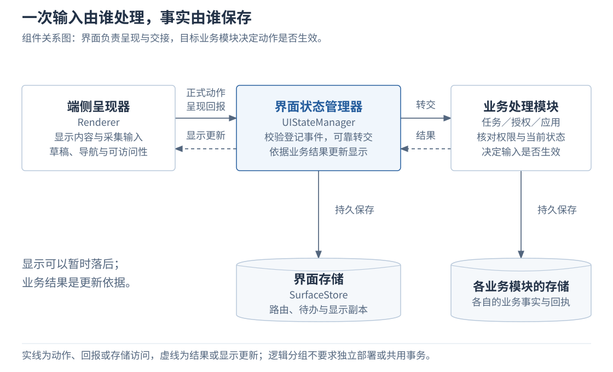
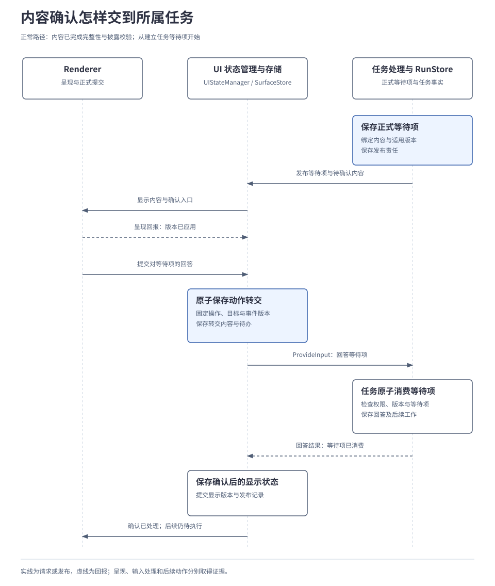
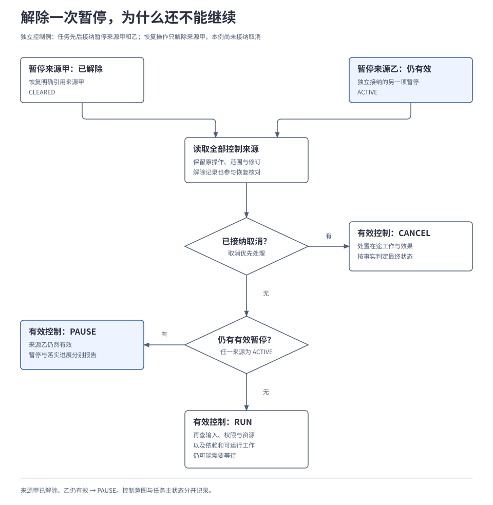
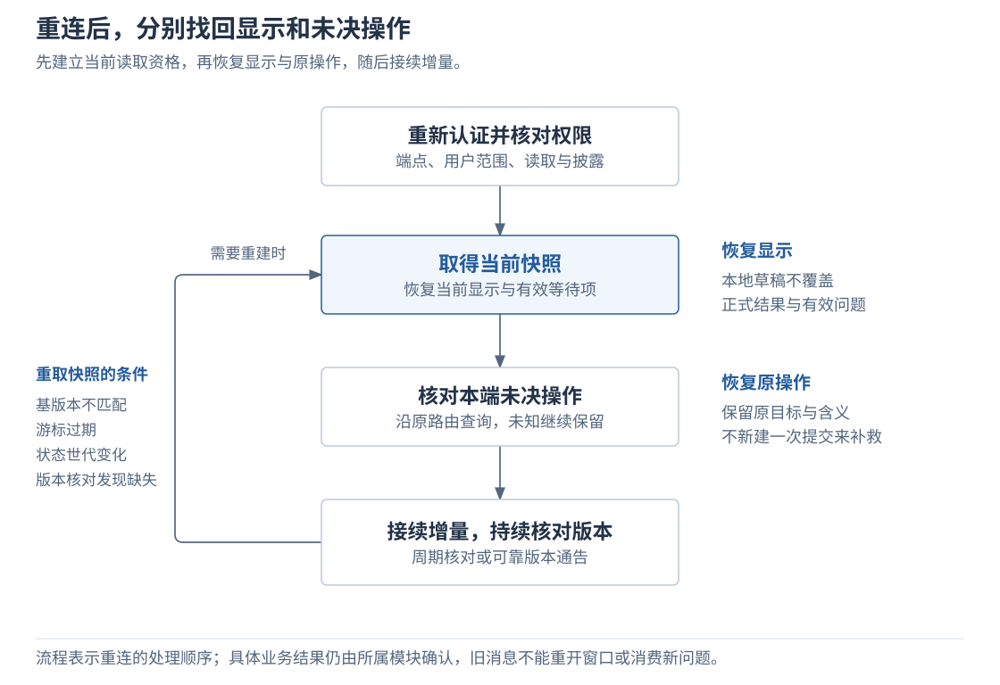

# 2.5 应用与交互

<a id="08-用户交互与任务控制"></a>

交互系统把用户输入绑定到明确的业务对象，持久保存转交责任，并根据业务结果维护显示副本。Renderer 负责采集和呈现，UIStateManager 负责路由与恢复，目标业务模块决定输入是否生效。本章解释正式输入、内容确认、任务控制与重连，区分显示进展和业务事实。

<a id="problem"></a>
## 本章要解决的问题

一次点击可能已被业务模块处理，界面却还没收到结果；换设备后，旧按钮也可能仍然可见。交互机制需要固定输入的目标和含义，可靠转交，并分别确认业务处理与显示进展。界面可以暂时落后于业务，但必须让用户知道哪些结果已经确认。

<a id="key-decisions"></a>
### 关键设计决策

| 问题 | 设计选择 | 展开位置 |
| --- | --- | --- |
| 同一窗口里的输入，可能指向不同任务或问题。 | 先绑定业务对象，再形成正式动作；目标有歧义时澄清。 | [第 2 节](#targets) |
| 点击之后可能断线、重启或丢失回执。 | 界面持久保存原操作与转交责任，业务模块保存生效事实，再据此更新显示。 | [第 1 节](#components)、[第 3 节](#handoff) |
| 新要求或取消到达时，旧工作可能仍在进行。 | 业务端核对版本与当前条件，分别报告请求受理和实际落实。 | [第 4 节](#application)、[第 5 节](#control) |
| 多个暂停来源、多端显示可能同时变化。 | 暂停按来源解除；显示版本独立管理，重连分别恢复界面与未决操作。 | [第 5 节](#control)、[第 6 节](#surface) |

<a id="components"></a>
<a id="界面和任务为什么各自保存记录"></a>
## 1. 先看谁负责显示、转交和业务处理

端侧负责呈现与采集，界面状态管理器负责可靠交接，实际业务模块决定输入是否生效。各模块分别保存状态，因此“点击已收到”只能说明其中一个环节的进展。



| 职责 | 负责什么、保存什么 |
| --- | --- |
| 呈现器 `Renderer` | 显示内容、采集输入，管理本地草稿、导航与可访问性；用 `PresentationStatus` 报告显示版本已应用、显示失败或组件不支持。 |
| 界面状态管理器 `UIStateManager` | 实现 `UserInteractionService`，校验登记事件、转交输入，依据业务结果维护显示副本。 |
| 界面存储 `SurfaceStore` | 保存可恢复的显示、版本和转交记录，参考实现使用 SQLite。 |
| 任务、授权或应用模块 | 分别保存任务回答、权限回应或应用设置。只有已登记为界面自有业务的偏好，才由界面存储自行接纳。 |

这些是逻辑职责与设计契约，不要求独立进程，也尚非已发布 SDK。本章讨论 Harness 或接入应用自身的交互；操作第三方应用的点击、滑动和输入属于[《能力与执行》的执行能力](04-tools-and-devices.md#4-gui-怎样形成观察动作和核验闭环)。

<a id="targets"></a>
<a id="1-从提出任务到补充要求"></a>
<a id="这句话接到哪项任务上"></a>


## 2. 把输入绑定到正确的任务或问题

聊天窗口组织消息，任务管理目标、要求和运行进展。一个窗口可先后处理多项任务，一项任务也可出现在多端界面中，因此窗口相同或文字相近都不足以确定输入归属。

| 输入意图 | 绑定的业务对象 | 形成什么请求 |
| --- | --- | --- |
| 提出新目标 | 新任务及其交付条件。 | `TaskService.Submit` 创建任务并返回 `task_ref`；同次创建重试关联原任务。 |
| 修改进行中的要求 | 已存在的任务。 | `TaskService.SubmitUpdate` 修改要求，任务身份保持不变。 |
| 回答一个具体问题 | 任务保存的待回答记录，即等待项 `interaction_id`。 | `TaskService.ProvideInput` 回答该问题；同一任务可以有多个等待项。 |
| 暂停、取消或接管 | 明确的任务或资源范围。 | 形成对应控制请求，见[第 5 节](#control)。 |
| 基于已完成结果开展后续工作 | 新任务，按权限引用原结果。 | 新建任务；终态任务不重新打开。 |

例如，“确认后再保存”是在修改任务要求；对界面上某版内容点击“确认”，是在回答已登记的问题。前者绑定任务，后者还必须绑定等待项及内容版本，不能只凭两句话都提到“确认”而使用同一入口。

后续补充、查询和控制都沿用 `task_ref` 定位原任务。应用先沿用任务卡片或回复入口的明确绑定，再判断输入是在更新要求、回答问题还是请求控制。普通聊天结合当前任务和上下文解释意图，明确独立的新目标可另建任务；多个任务都在等待时，一句“继续”若不能确定目标，先澄清。目标已明确的输入无需每轮重新询问。

这是可用规则或模型实现的应用侧参考流程。界面通过 `SubmitAction` 提交正式动作，再转交具体业务入口，由业务模块检查权限与状态；未提交文字仍是本地草稿。独立应用表单也可走这条路径，不必先创建任务，见[细则 C](../../reference/interaction-and-task-control-details.md#independent-form)。

<a id="handoff"></a>
<a id="4-点击已经处理界面为什么还在等待"></a>
<a id="怎样让重启后的界面找回原操作"></a>
## 3. 先保存转交责任，再按原操作取得结果

为使重启后的界面仍能找到原输入，正式动作使用稳定的操作标识 `operation_id`。它跨重试和模块转交保持不变；具体消息可有不同的 `message_id`。

| 界面保存的记录 | 固定什么 |
| --- | --- |
| 动作路由 `ActionRoute` | 原输入、处理目标、转换后的请求含义，以及当时的事件映射和输入约束 Schema 版本。事件映射决定按钮对应什么请求，Schema 规定输入字段与类型。 |
| 转交待办 `Outbox` | 哪份原请求尚待交付，与动作路由在同一事务中保存。 |
| 结果显示副本与发布记录 | 根据业务模块结果更新的显示及发布责任，二者一同提交；显示副本也称为结果投影。 |

目标模块另行提交业务事实，界面事务不包含外部业务调用。代价是显示可能滞后，需要沿持久记录继续核对；按钮或表单升级后，旧输入仍沿原路由解释。

下面保留已有操作与新操作的处理顺序，省略完整字段、传输和重试预算：

```text
收到正式动作：
  校验当前认证端点、用户作用域和原操作查询／结果披露权限
  若操作标识已有路由：
    核对原输入摘要；不同输入拒绝
    沿已保存的目标和含义核对原操作
  否则：
    校验当前界面、组件、登记事件、输入约束、权限和预期版本
    固定操作标识、目标、输入含义与映射版本
    在一次事务中保存：动作路由和待转交记录
    返回“转交责任已保存”

恢复工作：
  扫描待转交、待核对和待发布记录
  按当前权限查询或补投原操作，保留原身份、目标和含义
  取得目标模块结果后：
    在一次事务中保存：结果显示副本和发布记录
```

例如，任务已保存用户确认，但回执丢失，手机仍显示“结果待确认”。界面应查询这次确认的原结果；即使等待项已被该回答消费，也不把原重试当成新回答。暂时无法核实就保留待核对，不能另外创建一次确认来弥补。

并发路由创建、两种提交未知、保留窗口与当前披露限制见[细则 B](../../reference/interaction-and-task-control-details.md#handoff-recovery)。

<a id="application"></a>
## 4. 业务模块核对条件，决定输入怎样生效

<a id="updates"></a>
<a id="补充要求怎样阻止旧方案继续执行"></a>
### 追加要求使旧提案失去适用性

任务要求的正式变更会推进任务版本 `state_version`。内核将要求和后续工作一起保存，晚到的提案必须重新核对版本，避免按旧要求安排动作。

例如，大脑正在生成直接保存的提案，保存尚未准入，用户补充“确认后再保存”。新要求被接纳后，旧提案便不再适用。下表只追踪这次更新与旧提案的竞争。

应用先读取有权查看的任务状态，随更新提交它所依据的预期版本。下表的 v7、v8 是状态修订示例，不表示聊天轮次。

| 时点 | 核对与提交 |
| --- | --- |
| 大脑开始生成 | 内核已领取工作并预留预算，以提交后的 v7 组装上下文；大脑在事务外生成提案。 |
| 用户提交更新 | 更新指向原任务，携带预期版本 v7。内核在事务中确认版本匹配，保存新要求和后续工作，推进到 v8。 |
| 旧提案返回 | 它仍依据 v7，不能用于当前任务；内核按新要求重新组装上下文、安排决策。 |
| 更新首次到达就遇到版本冲突 | 返回冲突；应用取得新状态后，再判断是否形成新的更新。 |
| 同一次更新重试 | 查询原处理结果；后来的版本变化不能使它再次修改任务或误报新的冲突。 |

本例保存尚未准入。若已有动作发出，只能按能力取消或核对实际效果，不能把新要求写成原动作已经改变。更新也不增加权限或预算；在途工作、版本推进及仍适用工作的规则见[细则 A](../../reference/interaction-and-task-control-details.md#updates)。

<a id="confirmation"></a>
<a id="2-看到摘要后确认怎样让任务继续"></a>
### 内容确认只消费它所回答的那个问题

需要用户确认内容时，任务先完成该内容的完整性与披露校验，再保存正式等待项：等谁回答、回答哪版内容、适用条件及何时失效。通过 `RequestInteraction` 发布后，界面才能展示内容和确认入口。

界面先保存回答的转交责任；任务核对回答者权限、输入、等待项状态和适用版本，在自己的事务中保存回答，把等待项标记为已处理，并登记后续工作。这称为消费等待项。图中只展开任务所有的内容确认，授权和应用表单由各自业务模块处理。



| 已知进展 | 可以据此判断什么 |
| --- | --- |
| 界面保存了转交责任 | 原输入可继续转交，目标业务尚未必接纳。 |
| 端侧报告内容已显示 | 对应显示版本已应用；不能据此判断用户已阅读、理解或同意。 |
| 任务接纳了确认 | 回答合法生效，可以安排后续工作；后续操作仍须满足当前控制、授权、预算和执行条件并经过准入。 |
| 后续动作取得效果证据 | 可以确认该动作的实际结果；是否完成任务仍按原交付条件判断。 |

例如，用户正在确认一版待保存文档，此时又修改了内容要求。任务应撤销不再适用的问题，为新内容建立新等待项；旧按钮不能确认新版内容。仍适用的问题可以保留。关闭弹窗也不自动回答或撤销等待项，撤销由所属模块决定。

若内容呈现本身是任务完成条件，任务还须正式纳入对应呈现事实，普通刷新不因此都成为任务更新。

内容确认不增加权限。权限申请由授权模块保存和处理自己的等待项，批准只在原申请范围内生效，见[2.6 身份与授权](06-identity-and-authorization.md)。

<a id="control"></a>
<a id="3-暂停恢复取消和接管怎样生效"></a>
## 5. 控制请求先受理，再确认是否已经落实

“先停一下”需要明确作用于任务还是设备。关闭窗口、暂停任务和接管设备有不同的业务含义。

| 用户动作 | 接纳后的处理 |
| --- | --- |
| 关闭界面 | 关闭显示容器，任务可以继续；正式等待项由所属模块另行处置。 |
| 暂停任务 | 新增暂停来源，阻止新的自主工作；已开始动作按能力暂停、取消或核对。 |
| 恢复任务 | 解除指定暂停来源，再检查其他阻挡条件。 |
| 取消任务 | 停止新工作并处置在途动作，保留已发生和未知效果；与完成交错时按实际结果判定。 |
| 接管设备或应用 | 在指定资源范围内交还用户控制；获准恢复自动化后重新观察，再检查能否继续。 |

入口分别为 `CloseSurface`、`RequestPause`、`RequestResume`、`RequestCancel` 和 `RequestResourceControl`。恢复资源不会清除任务暂停，恢复任务也不能撤销已接纳的取消或重新打开终态任务。

<a id="control-sources"></a>
<a id="为什么恢复一次任务仍然暂停"></a>
### 多个暂停来源分别保留、分别解除

任务先后接纳暂停来源甲和乙，解除来源甲时，来源乙 仍应有效。因此控制保存按来源区分的暂停集合，每项关联原操作和范围；恢复明确引用要解除的来源。



<a id="control-progress"></a>
<a id="收到暂停请求什么时候才能显示已经停下"></a>

| 核对的维度 | 含义 |
| --- | --- |
| 暂停来源 | 来源甲、乙各自有效或已解除，不能用一次恢复清空全部来源。 |
| 合并控制意图 | 已接纳取消时为 `CANCEL`；否则有有效暂停则为 `PAUSE`；两者均无才是 `RUN`。 |
| 任务状态与落实进展 | `RUN` 只表示控制不再阻挡调度，输入、权限、资源和依赖仍可能使任务等待。暂停刚受理时，任务也可能仍处于 `RUNNING`。 |

任务受理暂停时，一起保存暂停来源、合并意图和必要传播工作。只有在途工作已停稳或完成必要处置，才能报告暂停已落实并进入相应 `WAITING`。覆盖子任务树时，还需确认相关后代已停稳或处置，且无关键效果未知；离线后代无法确认时，显示待落实。

暂停默认覆盖子任务树，也可只作用于当前任务。来源修订、乱序消息、解除记录与传播规则见[细则 D](../../reference/interaction-and-task-control-details.md#control)。设备接管也分别报告受理与落实，由执行系统停止和处置，具体交接字段与边界同见该细则。

<a id="surface"></a>
<a id="5-换设备或重新连接怎样接着操作"></a>
<a id="先定位窗口再核对显示版本"></a>
## 6. 重连时，分别恢复显示和未决操作

界面要恢复两件事：此刻应显示什么，以及本端已提交的操作究竟怎样处理。当前快照回答前者，原操作结果回答后者。

一个可独立恢复的窗口或面板称为界面容器 `Surface`。`surface_ref` 由用户作用域、受认证端点和端内窗口键定位，组件键再定位其中的按钮或卡片。窗口重开使用新的局部键或状态世代，不能复用关闭前的版本空间。

显示版本 `revision` 与任务版本分别管理：界面可从“提交中”变成“确认已处理”而不改变任务要求；任务已更新时，离线界面也可能仍在旧版。快照是某版完整显示，补丁描述从基版本到目标版本的变化。持有第 12 版才能应用“12 → 13”；若仍是第 10 版，先取当前快照。

<a id="reconnect"></a>
<a id="重连时按什么顺序恢复"></a>



| 重连或多端场景 | 必须保持的规则 |
| --- | --- |
| 另一端还显示旧确认按钮 | 同操作重试查原结果；新操作回答同一等待项，由任务事务裁决合法首次消费，另一端据结果刷新。 |
| 问题已处理、过期或撤销 | 不接受新的回答；已有操作仍沿原路由查询。普通应用表单遵守自己的版本规则，不一律采用首次提交者胜出。 |
| 快照恢复与本地草稿冲突 | 正式结果和有效等待项须可恢复，本地草稿不能覆盖它们；关键来源不可读、无法重建时明确不可用。 |
| 基版本、游标或状态世代失效 | 重新取快照；旧连接消息不能重开窗口或消费新等待项。 |
| 最后一条补丁丢失，之后再无消息 | 通过周期版本核对或可靠版本通告发现落后，不能只依赖后续补丁暴露断档。 |

同一账号不自动拥有所有窗口权限。快照保存或重建、恢复顺序及临时预览的披露和保留限制见[细则 E](../../reference/interaction-and-task-control-details.md#surface-recovery)。

<a id="extension"></a>
<a id="6-对话卡片和表单怎样共用交互机制"></a>
## 7. 不同界面共用交互契约

对话、卡片、表单、多模态和自定义界面共用“显示什么、等什么输入、允许哪些动作、交给谁处理”的契约；控件与布局由端侧呈现器决定。

内容预览组件应声明完整内容怎样呈现、确认事件携带什么，以及缺少组件时的等价交互。客户端支持已登记的等价表单时，可改用表单展示完整内容并收集确认；缺少确认能力则报告不支持、保持等待。只有明确可忽略且不承担关键操作的装饰内容可跳过，显示说明文字不能代替正式提交。

<a id="没有关联任务的表单也能这样恢复"></a>

独立应用表单也可靠转交：例如开启“项目通知订阅”，可以没有任务和等待项，设置事实归应用保存。其完整回执丢失示例见[细则 C](../../reference/interaction-and-task-control-details.md#independent-form)。

<a id="validation"></a>
<a id="7-怎样验证交互与控制符合预期"></a>
### 实现与验证

| 要查的细节 | 位置 |
| --- | --- |
| 更新与版本、在途工作的处理 | [细则 A](../../reference/interaction-and-task-control-details.md#updates) |
| 路由竞争、提交未知、原操作恢复与保留窗口 | [细则 B](../../reference/interaction-and-task-control-details.md#handoff-recovery)、[独立表单示例 C](../../reference/interaction-and-task-control-details.md#independent-form) |
| 控制来源、传播与资源接管 | [细则 D](../../reference/interaction-and-task-control-details.md#control) |
| 窗口恢复、增量与临时预览 | [细则 E](../../reference/interaction-and-task-control-details.md#surface-recovery) |
| 类型登记、协商、编码、插件与流控 | [细则 F](../../reference/interaction-and-task-control-details.md#extensions) |
| 完整验证场景与可观察结果 | [细则 G](../../reference/interaction-and-task-control-details.md#verification) |
| 等待项、容器、路由与呈现回报字段 | [附录 01](../../reference/01-data-model.md#interaction)及[版本规则](../../reference/01-data-model.md#identity-version) |

本章描述既定交互契约及聊天接入参考流程，尚无聊天归属、呈现器互操作或交互恢复的运行证据。验证应观察动作是否改变了正确业务对象，以及重试、断线和多端操作后能否恢复有依据的显示。

---

[上一章：2.4 能力与执行](04-tools-and-devices.md) · [正文目录](../README.md) · [下一章：2.6 身份与授权](06-identity-and-authorization.md)
