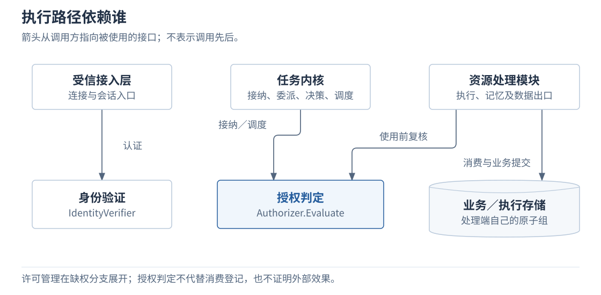
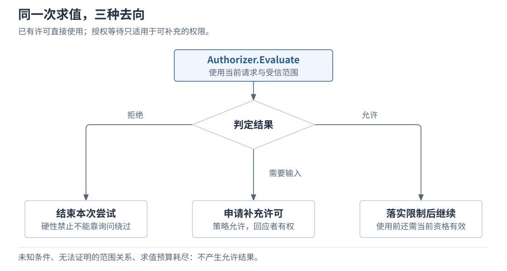
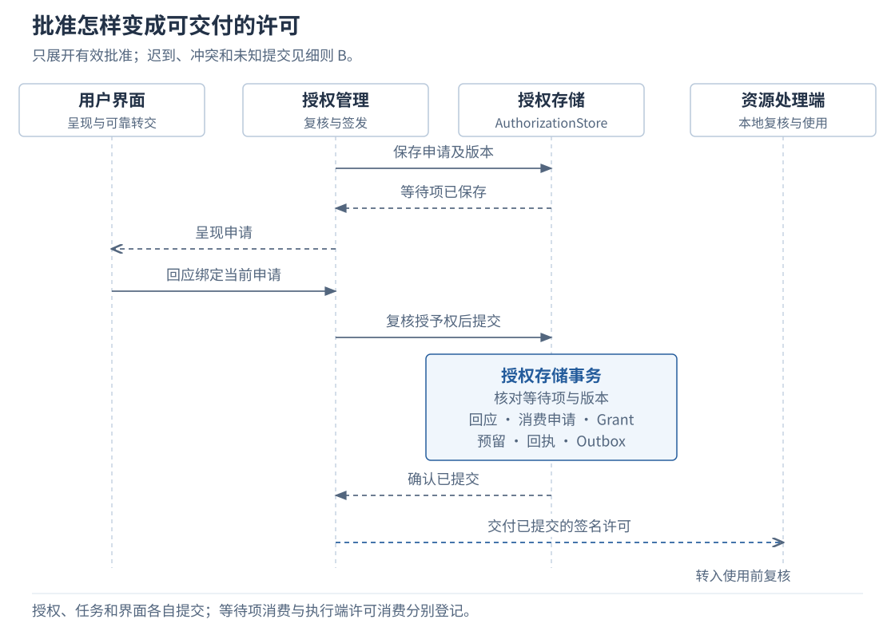
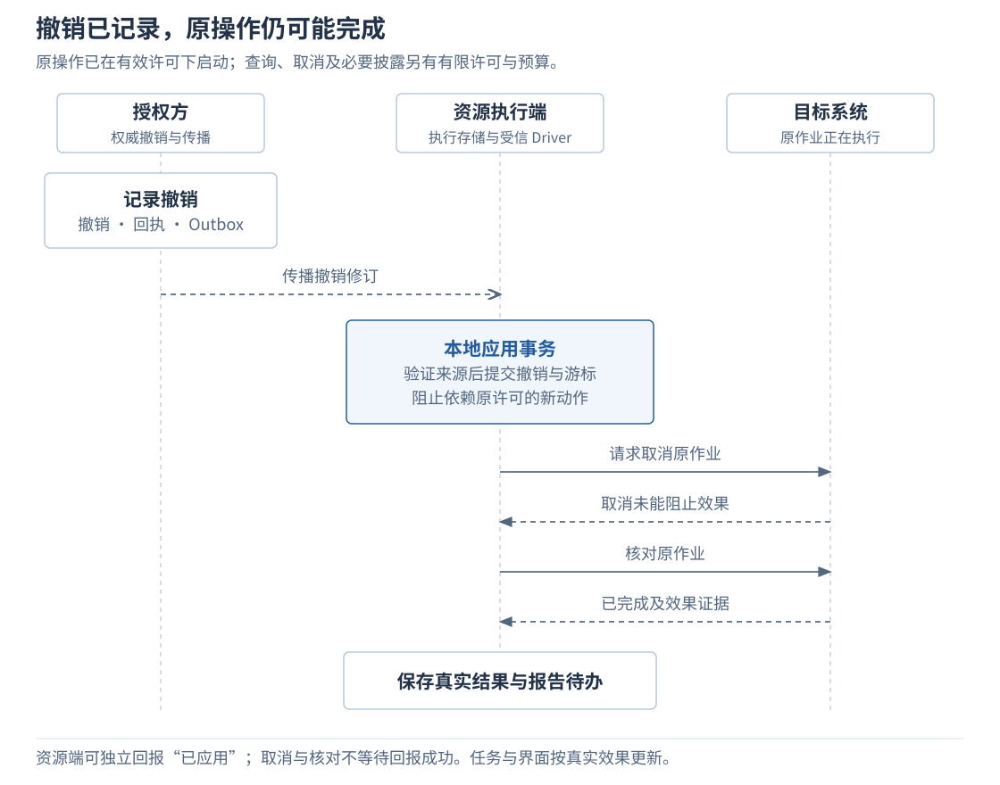
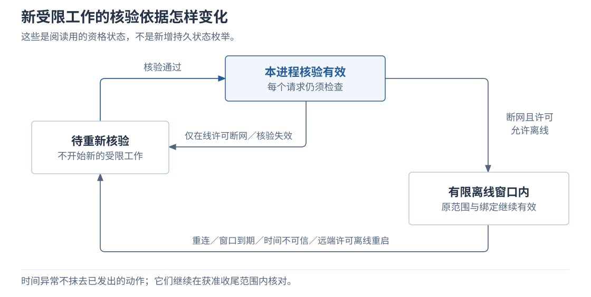
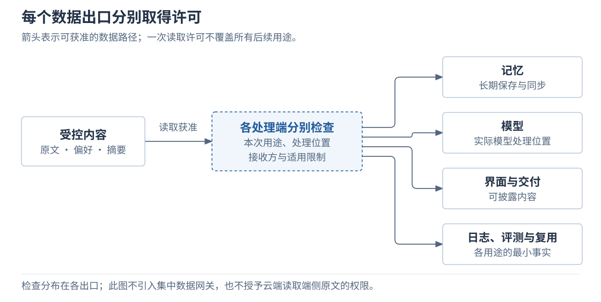
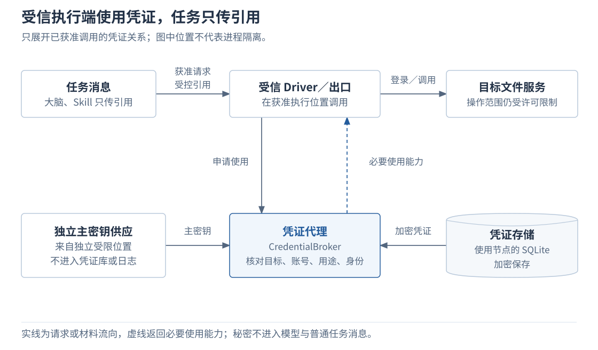

# 2.6 身份与授权

<a id="09-身份授权与数据权限"></a>

身份与授权系统为各处理端提供可信主体、权限判定、有限许可和撤销依据。内核判断是否安排工作，读取、模型调用、写入和交付等资源处理端在实际使用前分别复核。批准、签发、消费和外部效果有各自的提交边界，本章解释它们如何形成可核对的授权过程。

<a id="problem"></a>
## 本章要解决的问题

Agent 需要在用户授予的范围内自主完成任务。资料获准读取后，发给模型仍须满足用途与位置限制；一次保存许可不能因重试而增加使用次数；电脑离线时，也需要可核验的继续条件。本章把这些限制落实到实际使用资源的模块，并让许可签发、消费和外部效果分别留下可核对记录。

<a id="key-decisions"></a>
### 关键设计决策

| 要解决的问题 | 本章采用的设计选择 | 展开位置 |
| --- | --- | --- |
| 任务接纳后，权限或运行条件仍可能变化。 | 共用授权判定规则，内核检查是否安排工作，处理端在使用资源前再次复核。 | [第 1 节](#components)、[第 2 节](#decision) |
| 批准、签发和执行分属不同模块，可能重复或丢失回包。 | 签发与消费分别本地提交，通过原操作记录恢复。 | [第 3 节](#issue)、[第 4 节](#execute) |
| 离线执行与远端撤销之间存在时间差。 | 只允许有限离线窗口，分别确认撤销记录、应用进展和实际效果。 | [第 5 节](#revocation) |
| 数据和账号能力可能随任务流转而越界。 | 各出口按用途检查，凭证只在获准的受信执行位置使用。 | [第 6 节](#data) |

正文按这些问题展开，配置、异常细则与完整验证要求见[实现细则](../../reference/identity-and-authorization-details.md)。

<a id="1-手机发来请求电脑怎样确认身份"></a>
<a id="1-身份授权与实际检查"></a>
<a id="components"></a>
## 1. 先看组件怎样分工

入口建立可信身份，内核在接纳任务、委派、接纳决策和调度时判断是否安排工作。授权可能在排队、转交或恢复期间变化，因此资源处理模块在实际读取、写入、发送和启动前再次检查。图中的箭头表示调用依赖。



| 职责 | 负责什么 | 首次展开 |
| --- | --- | --- |
| 入口认证 | 将连接或会话验证为受信身份上下文。 | 本节 |
| 授权判定 `Authorizer` | 返回允许、拒绝或需要输入，并给出适用限制。 | [第 2 节](#decision) |
| 授权管理 | 保存申请，签发、收缩或撤销许可；管理状态归 `AuthorizationStore`。 | [第 3 节](#issue) |
| 资源处理模块 | 落实限制、登记消费并核对实际效果；包括执行、记忆及各数据出口。 | [第 4 节](#execute) |
| 凭证代理 `CredentialBroker` | 为受信 Driver 或出口提供受限的账号使用能力。 | [第 6 节](#credentials) |

以上是逻辑职责，可以在单机组装；图中方框不要求独立部署。参考实现采用 Go 内嵌判定和 SQLite 持久化。

### 身份上下文包含谁

| 身份 | 在本次任务中的角色 |
| --- | --- |
| 用户 | 原始发起主体。 |
| Agent | 在获准范围内代表用户处理任务。 |
| 节点 | 手机或电脑，经过认证与受信登记后确认可代表谁。 |

连接入口从受信登记建立代理关系；转交时保留原发起主体，中间节点不能换用自己更宽的权限。进程内身份由受信宿主提供，普通消息或工具参数不能自报、覆盖身份。

用户命名空间贯穿路由、存储键、缓存、索引、对象访问及订阅。同一用户的设备仍逐项取得资源权限。任务 Owner 的资格只允许推进任务状态，资源读写另外授权。设备登记、认证边界见[细则 A](../../reference/identity-and-authorization-details.md#identity)。

<a id="decision"></a>


## 2. 一次请求怎样得到判定

已有许可覆盖时复用原授权；只有策略允许补充且存在有权回应者，才进入授权等待。这样，任务可以在已授权范围内自动推进，用户只需处理具体的授权缺口；硬性禁止直接拒绝。



恢复、重连或策略变化后重新核验，API 与 GUI 使用同一套限制。一次判定须同时回答：谁使用哪一版资源，做什么，用于什么目的，在何处处理，交给谁，以及许可何时到期。有额度或委派时，还要核对相应份额和委派限制。资源策略规定谁能补充或修改授权，不能仅凭请求来自同一用户就扩大范围。

```text
求值当前请求：
  按受信登记解析精确资源、枚举集合或已登记资源树范围
  逐项比较动作、用途、位置、期限、额度与委派深度
  遇到未知条件、不能证明的范围关系或求值预算耗尽：不产生允许结果
  返回判定 + 必须落实的限制 + 策略/撤销修订 + 有效区间

收到“允许”后：
  处理端若无法落实任一必要限制：停止，不继续执行
```

这是行为伪代码，未定义新的接口字段。界面显示的路径只帮助用户理解请求，授权范围仍来自受信登记。`Authorizer.Evaluate` 判定本身不登记消费。

<a id="3-改存归档目录怎样申请并取得许可"></a>
<a id="2-一次保存许可的生效过程"></a>
<a id="确定申请范围"></a>
<a id="issue"></a>
## 3. 缺少许可时，批准怎样变成可用材料

请求缺少许可且策略允许补充时，授权模块建立范围明确的申请，交给有权主体回应。申请要固定代理、资源、动作、内容或版本、用途、次数及有限期限，用户批准之后才能签发与该申请绑定的许可材料。

例如，任务准备将已形成的文档写入一个指定目录，但缺少一次写入许可。假设目录存在、能力适用、签发方可用，资源策略允许该用户授予这项权限：

> 申请：允许本任务的指定代理，在这台设备的指定目录写入当前这版文档，限一次。签发时确定受资源策略约束的有限到期时间。

如果申请源于用户更改保存目录，先按[目标更新规则](05-interaction.md#补充要求怎样阻止旧方案继续执行)接纳目标变化，使旧提案失效，为新目标形成新操作；已有操作的业务含义保持不变。其他目录的写权限不能派生为当前目录权限，读回也另须读取许可。完整改存过程见[权限变化示例](../../examples/02-input-and-permission-changes.md)。

<a id="用户批准后系统保存什么"></a>
<a id="从用户批准到许可签发"></a>
回应可能重复，也可能在申请变化后才到达。因此，授权模块把回应绑定到固定申请和版本，在自己的存储事务中核对申请并保存签发结果。



读图时只需区分四份记录：

| 记录 | 用途 |
| --- | --- |
| 授权等待项 | 固定申请内容和版本，归授权模块所有。 |
| 用户回应 | 指向这份申请；界面负责呈现和可靠转交。 |
| 授权记录 `Grant` | 说明谁可在什么范围和期限内执行。 |
| 通知待办 `Outbox` | 提交后继续负责交付已保存的许可材料。 |

执行权与签发权分别判断；文件、内容或用途改变后重新求值，写入许可也不扩大读取范围。

签发事务的完整原子组：

```text
在 AuthorizationStore 的同一事务中：
  核对等待项、申请版本和预期策略
  记录有效回应，消费等待项
  保存 Grant、必要额度预留、管理回执和 Outbox

确认提交成功后，才交付已绑定本次申请的签名材料
```

消费等待项表示“这份申请已经处理”；一次写入额度要由执行端另行登记。授权、任务和界面分别持久保存状态，通过可靠交接协作，没有共同事务。拒绝、迟到回应、冲突和提交未知见[细则 B](../../reference/identity-and-authorization-details.md#issuance-failures)。

<a id="4-电脑收到许可后怎样验证和使用"></a>
<a id="电脑验证并使用许可"></a>
<a id="3-重复请求未知结果与委派"></a>
<a id="一次许可怎样只用在这次保存上"></a>
<a id="用记录约束一次许可"></a>
<a id="execute"></a>
## 4. 一份单次许可怎样只用于原操作

授权判定回答“当前请求是否允许”，不会占用一次许可。两个执行者可能都得到允许，因此资源处理端必须把单次消费与原操作的启动准备一起原子登记，重试沿原操作恢复。签发方在交付前预留一次额度，并绑定处理端与指定操作；交付或消费结果不明时，原额度继续占用，不能立即重新分配。

| 使用前检查 | 必须成立 |
| --- | --- |
| 来源与出示关系 | 签发者受信、接收方为本端；当前出示节点有权代表原主体。 |
| 操作范围 | 资源、内容、用途、期限符合许可；全部上级授权限制仍成立。 |
| 当前状态 | 当前授权、已知撤销、任务及执行者资格、控制、预算均允许。 |

合法签名证明来源和完整性。材料仅携带必要且获准披露的范围与引用；签名不保密，也不让私有正文自动离端。

```text
准备执行原操作：
  验证当前身份及查询原操作的权限
  若已有启动登记：
    核对并恢复原操作，不重复消费或盲目启动
    结束本次启动流程

  否则，在执行存储的同一事务中：
    复核当前授权、已知撤销、有效期
    核对任务/执行者资格、控制和预算
    校验许可绑定本端、原操作及固定语义
    原子保存许可消费、启动准备与恢复工作

  提交不明：先核对原提交
  确认提交：在事务外调用目标工具，另行核对实际效果
```

这段伪代码省略完整认证字段和恢复算法。入口把已验证的出示关系绑定到原操作；本地恢复沿受信记录核对当前资格，无需保留原连接。更新材料不能改变业务含义或期限。

<a id="提交或回应不确定时"></a>
<a id="转交给其他节点时权限怎样收缩"></a>
<a id="委派范围与额度"></a>
### 未知结果和委派的边界

| 情况 | 继续工作的条件 |
| --- | --- |
| 交付或消费结果不明 | 保留原预留；重发、查询不增加次数。 |
| 原处理端失联，想把额度改给另一节点 | 先证明旧端不能再使用，并核对历史消费，才能回收。 |
| 把工作委派给另一 Agent | 资源、动作、用途、位置、期限、委派深度和额度均保持或收缩；全部祖先约束有效，各接收方额度不重叠。 |
| 子任务需要更多能力 | 接收方不能换用自身更宽权限；写一个文件的权限不能扩大到管理目录。 |
| 调整任务预算 | 授权额度与运行预算分别满足；增加一个不扩大另一个，缩减预算不抹去已消费或未结算额度。 |

许可也可在限定范围内持续使用，仍受期限、额度与撤销约束。其他业务模块的单次消费、代理出示和材料轮换见[细则 C](../../reference/identity-and-authorization-details.md#consumption)。

<a id="4-撤销离线与重新核验"></a>
<a id="5-用户撤销许可正在进行的保存怎样处理"></a>
<a id="撤销与在途保存"></a>
<a id="revocation"></a>
## 5. 撤销或离线后，哪些工作还能继续

### 撤销传播与实际效果分开确认

撤销有三个需要分别确认的进展：授权方提交撤销，资源端应用撤销，以及在途操作停止或完成处置。前两项管理状态不能替代实际效果证据。

下图假设授权方与资源端分开运行，原操作按有效许可启动且仍在进行；用户有权撤销，通知存在传播延迟。查询、取消及必要结果披露另有有效的有限许可和处置预算。图中取消未能阻止外部效果，用来说明撤销的实际边界。



| 看到的状态 | 能证明什么 |
| --- | --- |
| 撤销已记录 | 授权方已保存撤销、管理回执和通知；界面可报告“资源端待应用”。 |
| 消息已接收 | 通知已持久接收，仍不能报告撤销已应用。 |
| 资源端已应用 | 已验证来源，并一起提交本地撤销状态和已应用游标；阻止依赖该许可的新动作。 |
| 原操作已停止／已完成／待核对 | 必须由原作业的实际结果确认；取消请求不保证成功。 |

应用撤销后的进展回报与作业处置分别推进，回报成功不是取消的前提。撤销操作以稳定身份和预期修订去重，重放返回原回执；撤销上级授权也限制派生授权。

已发生的效果如实记录，未知结果继续核对。例如，保存已经发生时，撤销不自动删除文件，也不取消整个任务；清理文件需要另行获准的删除操作。收尾仍受权限、保留策略和有限预算约束，恢复不能重新取得已撤销的执行资格。权威不可达时可在自身权限内收紧本地准入，不能声称远端权威已完成撤销。

<a id="6-断网或重启后哪些工作还能继续"></a>
<a id="离线许可与可信时间"></a>
<a id="offline"></a>
### 离线资格由本地证据限定

离线节点看不到远端刚发生的撤销，因此采用有限离线窗口保留部分执行能力。相应的边界是：远端撤销不能保证立即在离线端生效，要求在线核验的工作要等待连接恢复。



图中状态描述“本进程是否具备开始新受限工作的核验依据”，不定义新的持久状态枚举。每个请求仍检查自己的资源、用途、接收方、操作／额度绑定和运行资格。

```text
离线开始新受限工作，必须同时成立：
  许可事先允许离线，并有有限窗口和可验证条件
  仍在原核验进程，时间可信，许可有效
  当前请求满足原范围及操作/额度绑定
  截止时间不晚于许可到期和最大离线窗口
```

离线时未收到撤销，不能推断远端没有撤销；连接存在本身也不延长许可。

| 恢复情况 | 先完成什么 |
| --- | --- |
| 远端有限许可，离线进程重启 | 默认重新验证；文件中的剩余时长不是有效证明。 |
| 本机就是授权权威 | 可在受信本机重新核验本地策略与时间，建立新资格，无需强制联系云服务。 |
| 重新连接 | 通过获准快照及连续变更取得当前策略和撤销，再接纳依赖在线状态的新工作。 |
| 游标／视图失效，或恢复旧备份 | 前者重新取快照；后者先隔离再核验。不能先清空旧撤销状态再执行。 |

时间锚点、异常处理、防回滚前提及同步信任关系见[细则 D](../../reference/identity-and-authorization-details.md#time)。

<a id="7-数据与凭证怎样留在获准范围内"></a>
<a id="5-数据用途凭证与执行环境"></a>
<a id="2-完成这次摘要任务需要哪些权限"></a>
<a id="本次任务的许可范围"></a>
<a id="用户限制用途后已有数据怎样处理"></a>
<a id="用途收紧后的数据处理"></a>
<a id="data"></a>
## 6. 数据和凭证分别沿什么路径流动

### 读取获准后，每个用途仍要检查

同一份资料可以获准用于当前任务，同时禁止长期保存或评测。因此，用途检查放在各个数据出口，每个处理端都要落实对应限制。



| 使用行为 | 处理位置核对的范围 |
| --- | --- |
| 取得来源资料 | 资源及修订、当前位置使用、跨端传递。 |
| 读取记忆或偏好 | 当前任务用途；长期保存、其他用途和同步另外获准。 |
| 查能力、调用模型 | 只发现可见能力；发送前核对内容、用途和实际模型处理位置。 |
| 写入并读取产物 | 分别取得写入、读取权限，检查当前授权及运行资格。 |
| 发布结果及来源 | 接收方、用途及可披露内容；“已显示”不产生新权限。 |
| 日志、评测和后续复用 | 仅使用各用途获准的最小事实；诊断不能成为上传受限正文或密钥的理由。 |

策略和签发权按资源范围配置，可在端侧或云侧。云端管理身份不自动允许读取端侧私有原文或放宽端侧策略。

```text
查看、纠正、删除或限制用途的请求到达：
  授权模块检查发起权限
  记忆、内容存储、界面和执行模块落实各自处理

用途策略收紧：
  阻止新的不合规使用
  触发上下文失效和副本处理
  已发生事实只保留允许的最小范围
```

策略管理的去重和修订检查见[细则 E](../../reference/identity-and-authorization-details.md#policy)。删除范围见[2.2 上下文、记忆与证据](02-context-and-memory.md)，呈现副本与恢复见[2.5 应用与交互](05-interaction.md)。

<a id="外部账号凭证怎样使用"></a>
<a id="凭证的使用路径"></a>
<a id="credentials"></a>
### 任务传引用，受信执行端使用账号能力

接入需要账号登录的外部服务时，Harness 许可约束本次操作，账号凭证用于登录或调用；持有凭证不自动取得账号的全部使用权限。本机文件写入这类不依赖第三方账号的操作，无需为此新增第三方令牌。

为避免长期密钥随任务和委派分发，任务只传受控引用，由凭证代理在获准位置提供必要使用能力。这个选择依赖受信执行路径，接口检查本身不提供内存隔离。



引用本身也须授权，不能成为任意下载密钥的地址。大脑、Skill 和普通消息只传引用；外部 Agent 经委派获得受限能力入口，不取得长期密钥。

<a id="扩展运行在什么信任环境中"></a>
<a id="扩展的信任前提"></a>
| 异常或环境 | 处理边界 |
| --- | --- |
| 凭证缺失、过期或主密钥不可用 | 暂停依赖它的新调用，其他独立工作可继续。 |
| 诊断与错误返回 | 仅保存受控引用和原因；秘密不进入模型、索引、普通载荷或错误文本。 |
| 同进程 Go 扩展 | 仅用于明确受信代码；接口检查不能隔离进程内存。 |
| 不受信扩展 | 独立执行环境、受控入口及文件／网络／进程隔离证据；独立进程若仍有全部宿主权限，不足以证明强隔离。 |

代码发布、配置改进各自遵守管理权限，自进化不能扩大授权或降低限制。加密保存、主密钥供应和轮换见[细则 F](../../reference/identity-and-authorization-details.md#credential-storage)。

<a id="6-实现说明与验证"></a>
<a id="设备怎样成为受信节点"></a>
<a id="设备登记与认证配置"></a>
<a id="授权判定消费与材料维护"></a>
<a id="凭证保存与轮换"></a>
<a id="8-怎样验证权限限制确实生效"></a>
<a id="验证与查阅"></a>
<a id="validation"></a>
## 7. 实现时从哪里查细节

验证时分别检查判定、消费和效果：被拒绝的请求是否实际停止，原操作重试是否增加了消费次数，撤销后已发生或未知的效果是否仍有记录。单看“允许”“已撤销”等日志无法证明这些条件成立。下表按实现问题定位细则和完整契约。

| 要确认的内容 | 查阅位置 |
| --- | --- |
| 设备登记、mTLS、浏览器会话与认证边界 | [细则 A](../../reference/identity-and-authorization-details.md#identity) |
| 签发失败、重复回应与提交未知 | [细则 B](../../reference/identity-and-authorization-details.md#issuance-failures) |
| 其他模块消费、材料绑定与轮换 | [细则 C](../../reference/identity-and-authorization-details.md#consumption) |
| 离线时间、快照与信任更新 | [细则 D](../../reference/identity-and-authorization-details.md#time) |
| 策略修改与凭证实现 | [细则 E、F](../../reference/identity-and-authorization-details.md#policy) |
| 8 类行为的可观察验证证据 | [细则 G](../../reference/identity-and-authorization-details.md#verification) |
| 对象、接口、完整故障矩阵 | [附录 01](../../reference/01-data-model.md#authorization) · [附录 02](../../reference/02-api-and-message-catalog.md#authorization-service) · [附录 03](../../reference/03-state-and-failure-matrices.md#authorization) |

本篇采用已确认的[授权生命周期设计](../../../archive/architecture-v1/08-authorization-lifecycle-and-interfaces.md)，机制依据见[身份、凭据与离线时间研究](../../../research/harness-identity-credentials-and-offline-time.md)。当前尚无认证、密码互操作、离线时钟或安全实验结果；验证应观察实际允许／拒绝、原操作恢复和效果保留，日志只提供线索。

---

[上一章：2.5 应用与交互](05-interaction.md) · [正文目录](../README.md) · [下一章：2.7 协作与连接](07-collaboration-and-connection.md)
