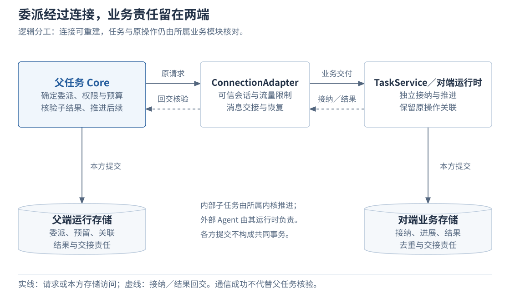

# 2.7 协作与连接

跨 Agent、跨设备处理任务时，请求发出后可能断线，对端也可能已经接纳却没有及时回报。系统需要保留两类不同的依据：业务模块保存“这项工作由谁承担、已经处理到哪里”，连接模块保存“消息怎样送到获准的对端、从哪里继续交接”。这样，连接可以重建，原任务和原操作仍可核对。

本章解释任务端点、连接适配器与两端内核怎样配合，走通一次委派及其结果交接，再说明断线恢复和任务移交的区别。父子控制与预算分配的完整机制见[多 Agent 协作](../03-coordination/03-agent-collaboration.md)，所有权转移见[端云协同](../03-coordination/04-edge-cloud-coordination.md)。

## 1. 任务端点与连接适配器各自承诺什么

任务端点 `TaskService` 是外部进入任务内核的业务入口。调用方通过它提交目标、补充输入、查询任务和请求控制；委派复用带父任务关系的提交入口，由接收端建立自己的任务。连接适配器 `ConnectionAdapter` 将这些请求及返回消息送到已认证、获准的对端，承接连接协商、路由、流量限制和交接恢复。

下图展开跨端委派的逻辑关系。父端已确定目标端点及允许披露的输入，双方可建立获准连接；图中的连接适配器合并表示两端的通信适配职责，各业务存储仍分别提交。内部子任务由所属内核推进，外部 Agent 则由其运行时维护事实并经适配端点交接。

| 职责 | 维护的事实 | 调用方可以据此判断什么 |
| --- | --- | --- |
| 父任务的 Core 与运行存储 | 委派操作、子任务关联、权限与预算安排、等待和后续工作。 | 父任务已决定交付哪些工作，还在等待什么。 |
| 对端 TaskService 与任务运行时 | 原请求的接纳、关联任务、进展、结果及控制落实情况。 | 对端是否承担了工作，以及它报告的完成范围。 |
| ConnectionAdapter | 可信会话、协商配置、消息与流位置、订阅和流量进展。 | 哪段通信可继续、哪些内容需要补交或重新取得。 |
| 各业务模块的存储 | 本方受理、去重、结果及可靠转交记录。 | 本方已经持久承诺的责任；不能据此推断另一方已提交。 |

将业务恢复放在任务和操作上，使一次委派可以跨过连接重建，也使进程内、跨进程和跨端实现能够遵守相同的业务含义。代价是双方都要维护持久关联和未决交接，连接恢复后还需核对业务结果。TaskService 不因此成为中央任务数据库，父端也不能直接修改子任务状态。

上述名称表示设计职责，尚非已发布 SDK。公共连接入口 `ConnectionService` 的协商与双向消息方法，由连接实现承接；它与 TaskService 的业务方法分别定义，完整目录见[任务接口](../../reference/02-api-and-message-catalog.md#task-service)和[连接接口](../../reference/02-api-and-message-catalog.md#connection-service)。

## 2. 一次委派怎样经过连接

委派开始前，父任务必须明确子目标、验收要求、输入范围、权限、期限和预算。子任务只能取得分配给它的范围，不能借自己的更宽权限绕过父方约束。连接建立时另行验证对端身份、协议与必需能力，并协商消息大小、待确认窗口和队列限制；协商通过不代替业务授权。

正常过程沿原委派操作推进：

1. **父端保存交付责任。** 父任务在本方事务中保存委派映射、预算预留、待处理工作及必要待发送记录。提交确认后，才能向对端提交。
2. **连接送达原请求。** 适配器保留可信主体、原操作关联及固定输入，通过 `TaskService.Submit` 交给受委派方。对端持久接收消息后仍须完成业务检查。
3. **子端独立接纳。** 接收方核对主体、委派关系、权限和输入，在自己的事务中建立子任务、关联原委派并登记获分配额度。同一原操作重投返回原任务，不重复授额。
4. **父端保存关联。** 父任务取得接纳结果后，保存子任务引用或适用的远端关联，再按依赖等待或推进其他工作。对端接纳未知时保留预留，先查原操作，不创建替代子任务。
5. **结果回交并核验。** 子任务保存自身进展与结果，关键结果可靠交回。父任务核对范围、来源、验收依据及预算消耗，再保存本方事实并决定下一步；子任务成功不直接决定父任务终态。

这里存在不同层次的回报，读者不能仅凭“调用成功”判断委派已经完成：

| 已取得的回报 | 已确认的事实 | 尚不能确认什么 |
| --- | --- | --- |
| 消息持久接收 `PERSISTED` | 接收方保存了消息和后续处理责任。 | 请求是否通过业务检查、子任务是否已建立。 |
| 业务接纳 `ACCEPTED` | 对端已承担该委派，原操作可关联到任务。 | 子目标是否完成、结果是否符合父任务要求。 |
| 子任务结果 | 对端报告了产物、证据和完成范围。 | 父任务是否已核验、整体目标是否满足。 |

例如，父任务委派“核对给定资料是否覆盖三项验收要求”。假设子端获准读取资料并返回结论，结果须逐项列出依据或缺口。子端返回“已读取”只证明取得了材料，父端还不能据此认定核对完成；收到有来源的逐项结果并通过核验后，才能满足这项依赖。这个例子不要求子任务写文件或接管父任务。

临时进度与关键结果使用不同的交付要求：临时进度可以按声明合并或丢弃，关键结果仍须持久保存、可靠交接并幂等消费。快照和补读恢复可恢复的业务状态，不承诺重现每一次临时进度。输入中的正文和引用也分别遵守处理位置与披露许可。

## 3. 断开后怎样继续原交接

断线只改变可用的通信路径，不能证明对端未接纳、任务已取消或外部动作已停止。已保存的业务事实继续作为恢复依据；查询视图则应标明最后确认的位置和可能的陈旧性。恢复必须分别处理连接、消息和业务操作。

| 恢复对象 | 先核对什么 | 怎样继续 |
| --- | --- | --- |
| 连接和订阅 | 当前身份、连接世代、访问范围及协商配置。 | 建立当前获准会话，恢复适用订阅；旧连接消息不能重新取得已失效权限。 |
| 消息与视图 | 原逻辑流、已确认位置和记录保留范围。 | 在有效范围内补交可靠消息、补读进展；游标失效则按契约取得快照并重建视图。 |
| 原业务操作 | 原委派是否接纳、关联到哪个任务、结果是否已消费。 | 通过原操作查询和任务查询核对，由业务模块幂等保存结果及后续责任。 |

以“子端已接纳，父端未收到回执”为例：连接恢复并通过当前权限核验后，父端使用原委派操作调用 `LookupOperation`。子端返回原接纳结果和任务关联，父端保存关联后继续原等待。已经持有任务引用时，可通过 `Get` 取得当前可见状态；任务快照与某一次提交的接纳回执仍是两种依据。

若查询暂时没有结果，父端不能据此断言子任务不存在：原提交可能尚未完成，记录也可能超出可查询范围。应保留接纳未知及预留，按查询确定性和保留契约继续核对。外部 Agent 不支持可靠的原操作查询时，Adapter 必须暴露这个限制，不能虚构去重保证或换身份重建任务。

恢复流量也有边界。队列满时需要让发送方减速、等待或拒绝新受理，这称为背压；不能静默丢弃已受理工作所需的可靠控制。大产物分块、控制额度和独立流恢复避免单个设备或窗口阻塞所有无关工作，具体规则见[流与保留细则](../../reference/edge-cloud-details.md#streams)。没有新补丁不代表已同步，连接恢复也不代表结果已被业务消费。

## 4. 跨设备调用与任务移交有什么关系

执行地点、任务关系和推进权是三个不同问题。选择机制时，先确定需要改变哪一项：

| 机制 | 改变什么 | 谁继续推进任务 |
| --- | --- | --- |
| 调用另一设备的能力 | 某个操作的执行位置。 | 原任务拥有者继续推进；执行端保存该操作的事实。 |
| 委派给另一个 Agent | 增加一个有独立目标和生命周期的子任务。 | 父子各自推进，父任务核验子结果。 |
| 移交任务所有权 | 同一任务的唯一推进权。 | 经目标准备、源端封存、旧执行者约束及目标持久激活后，由目标接续。 |

例如，任务由云侧推进，但文件只能在电脑处理，可以先判断是否允许将一个受限操作交给电脑执行。若任务后续必须完全依赖电脑本地资料和本地决策，则需按放置与权限条件评估是否移交任务。仅因电脑连上或云侧暂时不可达，不能自动认定电脑取得推进权。

离线能否继续，还取决于本地是否具备权威状态、必要依赖、资源、预算、控制及有效许可。缺少其中的必要条件时等待或报告限制，不让重连逻辑自行接管。完整准备、封存、激活和恢复条件见[端云协同](../03-coordination/04-edge-cloud-coordination.md)。

## 5. 需要验证的外部行为

进程内可以直接使用 Interface，同侧跨进程采用 gRPC，端云采用 WebSocket。gRPC 的具名请求与双向 Exchange 分工，WebSocket 按统一信封承载对应操作；这些绑定保留同一业务含义，不要求把全部请求再次封入同一条流。外部协议的实际恢复能力则需单独适配和验证。

| 验证问题 | 必须观察到的结果 |
| --- | --- |
| 重复提交或回执丢失会不会重复委派？ | 同一原操作关联同一子任务，预算不重复授予；双方重启后仍能核对原关系。 |
| 通信成功会不会掩盖业务失败？ | 消息接收、业务拒绝、接纳和最终结果分别可见，父任务不能绕过核验直接成功。 |
| 重连是否恢复了错误的权限或状态？ | 过期身份、旧连接消息和失效订阅不能越权恢复；缺口与游标失效明确报告。 |
| 拥塞会不会丢失控制责任？ | 队列有界，可靠控制仍可恢复，临时进度丢失不破坏关键结果交接。 |
| 替换连接实现后业务行为是否一致？ | 经真实协议、独立对端及独立持久化边界，验证原操作恢复、控制和结果核验；共享内存模拟不能替代这些证据。 |

以上是设计与验收要求，尚无对应运行证据。完整方法和消息见[接口目录](../../reference/02-api-and-message-catalog.md#delivery-recovery)，父子收尾和故障组合见[协作细则](../../reference/collaboration-details.md)。连接内部缓冲、任务端点实现结构及具体并发算法继续列入[组件详细设计](../../design/README.md)，本章只确定外部职责与可观察行为。

---

[上一章：2.6 身份与授权](06-identity-and-authorization.md) · [正文目录](../README.md) · [下一章：2.8 扩展与运行保障](08-extensions-and-runtime.md)
