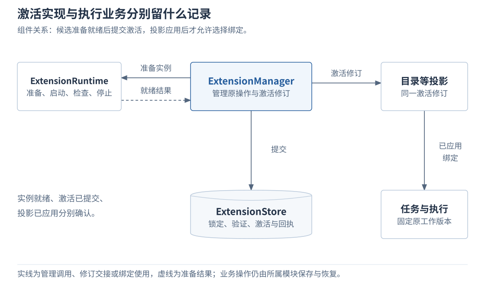
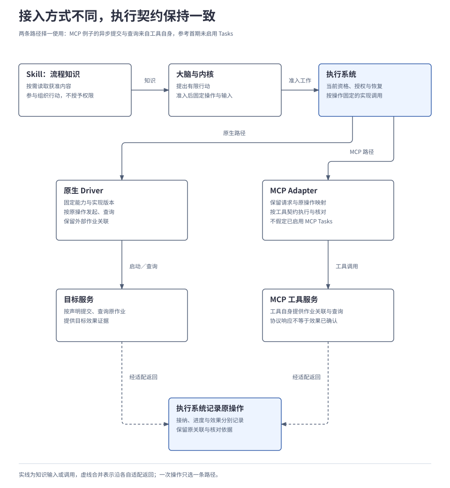
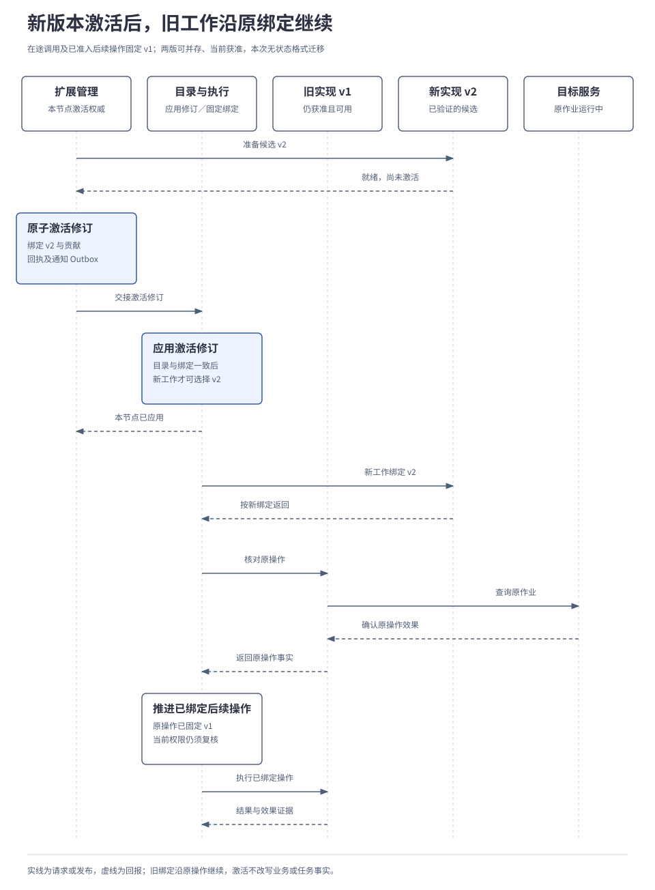

# 2.8 扩展与运行保障

<a id="10-扩展接入与协议互操作"></a>

扩展与运行保障负责把实现准备好、装配到系统并保持可恢复。Bootstrap 选择并连接实现，ExtensionManager 管理验证与激活，ExtensionRuntime 承接受控运行，RecoveryController 协调故障后的恢复流量。任务、执行等业务模块继续维护本方事实。本章重点展开扩展接入、协议映射与版本生命周期；装配和跨层恢复在工程部分深入说明。

## 本章要解决的问题

接入管理决定哪份实现可以被选择；任务准入固定一次工作实际采用的版本；执行端负责该工作的效果。三条生命周期必须相互关联，升级时才能改变新选择，同时保住旧工作的恢复依据。

| 问题 | 设计选择与代价 | 展开位置 |
| --- | --- | --- |
| 文件已到位，依赖或实例却未就绪。 | 准备、验证和激活分别留记录，投影应用后才可发现。 | [激活过程](#activation) |
| 换成外部协议后容易误认成功含义。 | Adapter 显式映射原操作、外部关联与结果证据；缺少必要保证就拒绝等价接入。 | [调用映射](#mapping) |
| 知识包可能附带可执行脚本。 | 内容按预算加载，脚本单独登记并由获准运行器执行。 | [Skill](#skill)、[运行位置](#runtime) |
| 升级时原操作仍在运行。 | 新工作选新绑定，旧工作固定原实现；隔离和失效仍优先检查。 | [升级](#upgrade) |

<a id="components"></a>
### 扩展管理与业务运行在哪里交接

管理入口由 `ExtensionManager` 承接准备、验证、激活、停用和查询；`ExtensionRuntime` 负责实例准备、启动、检查和停止；`ExtensionStore` 保存锁定引用、验证结果、激活状态、节点进展与恢复记录。

[](../../diagrams/10-extension-components.html)

上述接口表示逻辑职责，不要求各自部署成服务。管理事务只覆盖本地激活记录；实例启动、投影应用和业务操作分别确认。

### 装配、运行与恢复的分工

Bootstrap 在启动时选择接口实现、连接依赖并检查就绪，在关闭与迁移时保留未决责任；它不代替各模块提交业务状态。ExtensionRuntime 负责被授权实现的实例生命周期，实例启动不表示对应能力已激活。RecoveryController 合并故障范围、限制恢复流量并调用业务模块，业务事实仍由原负责者核对。

这几项职责组成全景中的一个阅读分组，不要求同进程或共同事务。组装顺序与实现替换见[开发组装](../04-engineering/01-implementation-and-technology.md)，集中恢复与高可用见[运行保障](../04-engineering/03-reliability-and-recovery.md)。下文讨论它们共用的实现接入和绑定条件。

## 1. 接入的究竟是工具、插件，还是 Skill

一个扩展包可以同时贡献能力实现和流程知识。前者由执行系统调用，后者进入决策输入；按贡献类型分别登记，才能明确验证对象与运行责任。

| 对象 | 提供什么 | 接入后由谁负责 |
| --- | --- | --- |
| 工具／能力 | 声明可请求的行为、输入与效果，例如指定路径写入或文件读取。 | 目录提供准确声明；执行系统调用对应 Driver 并记录事实。 |
| 插件 | 提供 Driver、模型、记忆后端或 Renderer 等实现。 | 按所实现的接口登记、验证和激活；插件包版本与能力版本分别记录。 |
| Skill | 提供知识与流程建议，例如要求产物保留来源并在写入后核验。 | 大脑按需读取并提出行动；工具调用仍经过内核和执行系统。 |
| 内部 Agent | 持有目标、上下文与决策循环，承担可委派的工作。 | Harness 管理其生命周期，配置与实现通过对应入口组装。 |
| 外部 Agent | 独立承担受托任务，返回进展和产物。 | 登记受信端点，通过任务 Adapter 协作；其运行时仍由对方管理。 |

统一登记不意味着统一安装：插件安装实现，Skill 导入内容包，外部 Agent 注册端点。Agent Card 的技能描述是能力元数据，不自动成为用户 Skill。一个工具调用也不必生成新的 Agent。

接入沿用任务协作、能力调用、记忆访问、端云连接四个基础契约领域，UI 在其上使用交互与呈现契约组。扩展管理归入任务协作领域的 `ExtensionService`；扩展只取得获准接口，不能直接改写任务终态或访问内部存储。身份及实际处理端的权限检查沿用[2.6 身份与授权](06-identity-and-authorization.md)。

<a id="activation"></a>
管理权限与业务权限分别核验。有权登记、验证和激活一个实现，不代表任务已经获准使用它访问资源；任务准入与执行仍须取得各自需要的许可。

<a id="2-保存实现怎样从文件变成可调用能力"></a>

## 2. 实现怎样从文件变成可调用能力

把包复制到电脑，只证明资产到了。若此时就让目录发布能力，任务可能选中缺少依赖、尚未就绪的实现。因此，准备、验证、激活和运行分别留下记录。

| 阶段 | 需要完成什么 | 得到的结果 |
| --- | --- | --- |
| 导入与准备 | 在有界暂存区取得本地目录、离线包或获准来源；检查路径、链接、大小和摘要。 | 不可变资产快照；不执行安装钩子。 |
| 解析依赖 | 根据清单选择依赖、接口与 Schema、运行器配置及非秘密配置修订。 | 精确锁定结果；运行时不临时下载“最新版”。 |
| 验证 | 检查资产、兼容性、处理位置、运行限制及对应契约行为。 | 对这份锁定结果和测试配置的验证记录。 |
| 准备实例 | 在事务外准备并启动获准实现，检查真实就绪状态。 | 候选实例就绪，尚不能接纳正式工作。 |
| 激活并应用 | 原子保存本节点激活修订、贡献绑定和通知；目录等投影应用同一修订。 | 已应用且当前获准的能力可被发现和选择。 |
| 接纳与执行 | 准入业务操作时固定能力、Schema 和实现；启动前再次检查当前条件。 | 原操作的执行记录、外部关联及后续核对入口。 |

包内容与依赖锁定必须不可变：同名同版本不同内容拒绝覆盖，缺失必需依赖不能激活，可选依赖缺失则撤去贡献。清单字段、旧版本并存和验证环境见[扩展细则 A](../../reference/extension-details.md#assets)。

下面只展开激活的提交边界，省略完整字段与错误结构：

```text
激活原管理操作：
  校验管理与查询权限，查找原操作
  已有记录：核对语义并返回原回执
  事务外：完成资产、依赖与实例准备
  在本地扩展存储事务中：
    复核原操作与预期管理修订
    检查当前信任、权限、位置和限制
    保存激活修订、精确绑定、
      操作回执和通知 Outbox
  提交不明：先查原提交，候选等待
  确定未提交：隔离或停止候选实例
  提交确认：幂等交接目录等投影
  投影应用对应修订后，才使用新绑定
```

目录、Skill 发现、UI 类型和模块组装必须读取同一激活修订，或检查投影携带的修订，避免只发布半套贡献。投影是各模块为查询和使用建立的状态副本：激活记录已提交，而目录尚未应用对应修订时，新绑定仍不能用于选择。

已经通过验证的版本也可能因权限收紧而失去激活资格。激活事务只管理本地绑定，不包含运行中的任务状态或外部文件写入。这使扩展管理能够独立恢复，但它也必须跟踪目录等投影是否真正应用，不能以一次激活回执宣告全部可用。

<a id="mapping"></a>
<a id="3-保存-s-换一种调用方式哪些含义必须保留"></a>

## 3. 协议映射必须保留哪些行为

接入成功后，大脑提出行动，内核接纳，执行系统按固定实现调度。Adapter 负责把原生行为契约映射到外部协议：标识如何关联，哪类回应代表接纳，怎样查询原操作，以及效果证据从哪里取得。读取 Skill 只影响提案，不形成绕过准入的执行通道。

下图比较原生 Driver 与 MCP Adapter 两种路径。图中的异步查询以目标工具本身具备相应能力为前提：例如一个文件工具明确提供提交保存、查询原作业及取得写入证据。参考首期未启用 MCP Tasks，不能据协议名称推导出异步查询或取消保证。

[](../../diagrams/10-contract-mapping.html)

| 契约要表达的行为 | Adapter 怎样映射 | 必须保留的边界 |
| --- | --- | --- |
| 命令 | 以稳定操作请求固定目标及输入；取消用另一操作引用原操作。 | 重发仍指向原操作，不能改目标、换输入或新建一次行动。 |
| 查询 | 读取本地操作状态，或经 Driver 核对原外部作业。 | 本地快照与最新外部效果分别说明；没有核对能力就保留未知。 |
| 接收与接纳 | 持久接收为 `PERSISTED`，业务接纳为 `ACCEPTED`。 | 协议响应或网络送达不能冒充任一持久事实，更不能证明写入。 |
| 事实与结果 | 分别记录执行阶段、成功／失败／未知、效果核验状态。 | 即使工具返回成功，仍须有相应证据；若任务还要求内容核验，效果确认后仍须推进相应工作。 |
| 流式更新 | 传递进度、临时预览或正式结果。 | 进度可缺失或被合并；正式结果按可靠消息保存与交接。 |
| 委派 | 将一部分目标交给外部 Agent，并保留本地任务与远端句柄的关联。 | 对方返回的状态由内核校验，不能直接改写本任务终态。 |

业务操作、应用消息和外部作业分别关联。原消息补发保留消息身份；新建查询或重新构造请求使用新消息身份，仍引用同一业务操作。MCP 的请求 ID、A2A 的消息或任务标识由 Adapter 显式映射，不能拿网络请求 ID 代替业务去重。远端关联还需包含服务端身份、协议配置和保留范围。

若外部效果已发生而响应丢失，超时只说明这次等待失败。Adapter 将可能生效的结果报告为未知，由执行系统在授权与预算内查询原操作及其外部作业；句柄丢失且无法按已有关联找回时保持未知，有副作用的请求不能由 SDK 自动重做。取消、断开流和真实停止也分别记录。原生 Driver 与外部工具都只能提供实际声明并验证的恢复保证；缺少本任务必需的核对能力时，不能作为等价实现准入。

可靠交接的完整规则见[2.1 任务运行内核](01-runtime-kernel.md#5-模块怎样可靠交接)，启动与未知效果处置见[2.4 能力与执行](04-tools-and-devices.md)。连接恢复不能代替这些业务规则。

<a id="5-skill-怎样加载实现又在哪里运行"></a>
<a id="skill"></a>
## 4. Skill 内容怎样进入一次决策

把所有 Skill 正文都塞入上下文，会增加成本，也可能把端侧私有知识送到不允许的位置。发现阶段只读取获准名称、用途与适用条件，选中后才在预算内加载正文和必要资料，并固定这次决策所用的内容快照。

Skill 的流程建议服从任务目标和适用的用户要求。例如，某整理 Skill 建议先列已完成事项，而用户已获准保存并用于本任务的偏好要求先列待办，则采用当前适用偏好；内容依据仍须来自实际资料。偏好修订与 Skill 内容快照分别维护。工具建议只能收缩可用范围，`allowed-tools` 不代替授权。

读取 Skill 正文不会执行附带脚本。脚本须单独登记为可执行资产，并交给声明支持其语言、依赖和限制的运行器。用户编辑原目录形成新候选快照，经验证再激活，不改变当前决策。

<a id="runtime"></a>
## 5. 可执行实现在哪里运行

内容已获准读取，不代表附带代码也获准执行。运行器须声明能约束哪些资源，再选择适合的实现形态；进程独立本身不能证明权限隔离。

| 运行方式 | 适用实现 | 实际边界 |
| --- | --- | --- |
| 受信 Go 编译组装 | 高频领域接口、模型／存储 Adapter、Driver 等。 | 代码已包含在获准宿主构建中；共享权限与故障域，导入清单不产生热编译或安全隔离。 |
| 独立进程 | 通过原生 gRPC 接口接入的实现。 | 地址空间独立不等于文件、网络或凭证隔离；受限模式须有实际可验证的后端。 |
| 受限 Wasm | 按固定 ABI 编译、只使用获准宿主接口的模块。 | 参考采用 wazero、显式 Interpreter，先验证 Linux amd64；不承诺任意 Python／Shell 脚本可直接运行。 |
| 远程服务或 Agent | MCP 能力服务、A2A 外部 Agent 等。 | 分别检查端点身份、协议和处理位置；本地登记无法证明远端二进制始终未变。 |
| 端侧 Renderer | 已登记 UI 类型及事件的呈现实现。 | 按端侧宿主声明的信任范围加载，参考只加载获准的受信实现；类型兼容不产生安装权限。 |

受限运行必须真正约束目录、网络、内存、期限及宿主调用；限制不足时拒绝运行。Wasm 不保存执行栈透明续跑，中断后先核对子动作，纯计算也仅在声明允许且预算足够时重算。具体限制与恢复规则见[扩展细则 C](../../reference/extension-details.md#runtime)。

<a id="upgrade"></a>
<a id="6-保存尚未结束时升级旧工作怎样继续"></a>

## 6. 实现升级时在途工作怎样继续

激活决定后续可以选择哪份实现，已准入工作则继续绑定原版本。每次决策也固定大脑、模型配置、Skill 和上下文组装版本，不能在生成途中换包。保留旧绑定使在途工作可以按原语义结束，同时增加旧资产和恢复数据的保留责任。

以下用两个可并存的受信独立进程版本说明切换：旧版仍获准且可用，新版已完成验证，管理员有权激活；本次不涉及持久状态格式迁移。旧版已有一个在途异步调用，以及一个已经准入、等待前置结果的后续操作。图中的版本指实现版本，不是协议版本。

[](../../diagrams/10-upgrade-sequence.html)

图将目录投影与执行路由合并为一列，内部仍各守自己的状态。只有尚未固定版本的工作才可选用当前激活且兼容的配置。已绑定旧版也不意味着能够无条件执行，当前权限、隔离状态与恢复条件仍须满足。

| 管理动作或异常 | 对新工作与在途工作的影响 |
| --- | --- |
| 正常停用旧版 | 停止接纳新的非恢复工作，排空已有调用及必要收尾；保留原操作与恢复绑定。 |
| 风险隔离旧版 | 阻止新的受限执行并请求停止。若后续操作尚未执行，也不能因旧绑定而绕过隔离；原操作的真实效果和可用核对路径仍保留。 |
| 旧版无法安全继续 | 暂停受影响工作，核对事实并进入待处理；不能把效果未知的原操作交给新版当成新工作重做。 |
| 回滚到旧版本 | 重新检查当前信任、权限、依赖与数据兼容，再激活旧锁定结果；已写文件、授权消费和撤销状态保持事实。 |
| 需要迁移持久状态 | 显式声明版本前提、范围、失败恢复及权限并验证；迁移后旧实现不兼容时，回滚等待处置，不能覆盖回旧数据库。 |
| 删除旧资产 | 已停用且不存在在途、恢复或其他须保留引用后才清理；业务记录按各自生命周期处理。 |
| 其他节点离线 | 分别报告准备、激活、失败或待联系；仅在旧版本仍获准且满足离线条件时继续，不能显示全体已升级。 |

需要保留的旧实现、Schema、Skill 和恢复数据使用持久引用追踪。用户删除受限内容时，应使相关上下文或工作失效并处置引用，不能以恢复为由无限保留。编译进宿主的 Go 实现还受宿主发布与重启约束，不承诺同进程热卸载。

跨节点激活逐节点准备与应用，不存在一次全局原子切换；不兼容节点在协作准入时等待或拒绝。停用外部 Agent 只停止新分派，原任务仍沿远端关联核对；Agent Card 快照不能当作远端代码版本证明，本地卸载也不能证明外部任务已经停止。

<a id="4-传输编码和外部协议怎样分工"></a>
<a id="protocols"></a>
## 7. 协议兼容需要证明什么

同一原生契约在进程内使用 Go Interface，同侧跨进程使用 gRPC，端云使用 WebSocket；固定结构来自 Protobuf，动态载荷来自已登记的 JSON Schema。调用位置改变后，稳定操作、业务接纳、未知效果和授权语义保持一致。

外部适配目标分别是 MCP `2026-07-28`、A2A `1.0` 与已锁定的 Agent Skills 内容格式快照。版本、方向、绑定和可选能力逐项验证：首期未启用 MCP Tasks，A2A 的幂等、流式和推送取决于对端，Skill 内容兼容也不提供脚本运行授权。

完整编码、能力协商、流控和外部适配范围见[扩展细则 B](../../reference/extension-details.md#protocols)，HTTP、媒体类型、SDK 与补丁的精确锁定见[附录 02](../../reference/02-api-and-message-catalog.md#compatibility)。这些是项目的已锁定设计目标，不表示当前已经实现互操作，也不声明它们是外部协议的最新版本。

<a id="7-怎样证明接入后仍遵守共同契约"></a>
## 8. 怎样验证接入、升级和实际效果

结构校验能发现字段错误，运行用例才能证明重复请求、未知结果、版本切换和权限变化的行为。原生 SDK 提供领域接口、生成消息、具名绑定、清单校验和共享测试夹具，同时公开取消与未知结果等语义；外部 SDK 留在 Adapter 内。

验证分别覆盖原生调用等价、外部协议双向互操作、内容加载与脚本执行、激活投影、升级恢复和权限变化，完整矩阵见[扩展细则 D](../../reference/extension-details.md#validation)。契约兼容与实际任务效果分别计分；千级 API、90% 首次正确率和 95% 有界任务成功率仍是目标，尚非运行结果。

本篇整理的是已确认设计，尚无 SDK、运行器或互操作的运行验收结果。完整逻辑字段见[附录 01](../../reference/01-data-model.md#extension)，服务与组件方法、消息、固定配置及一致性矩阵见[附录 02](../../reference/02-api-and-message-catalog.md)；[协议研究](../../../research/harness-protocol-contracts.md)、[来源核对](../../../research/harness-protocol-source-check.md)、[运行器研究](../../../research/harness-extension-runtime-boundaries.md)及[SDK 快照](../../../research/harness-extension-sdk-and-skill-snapshots.md)保存设计依据。

---

[上一章：2.7 协作与连接](07-collaboration-and-connection.md) · [正文目录](../README.md) · [下一章：2.9 观测、评测与改进](09-observation-and-improvement.md)
