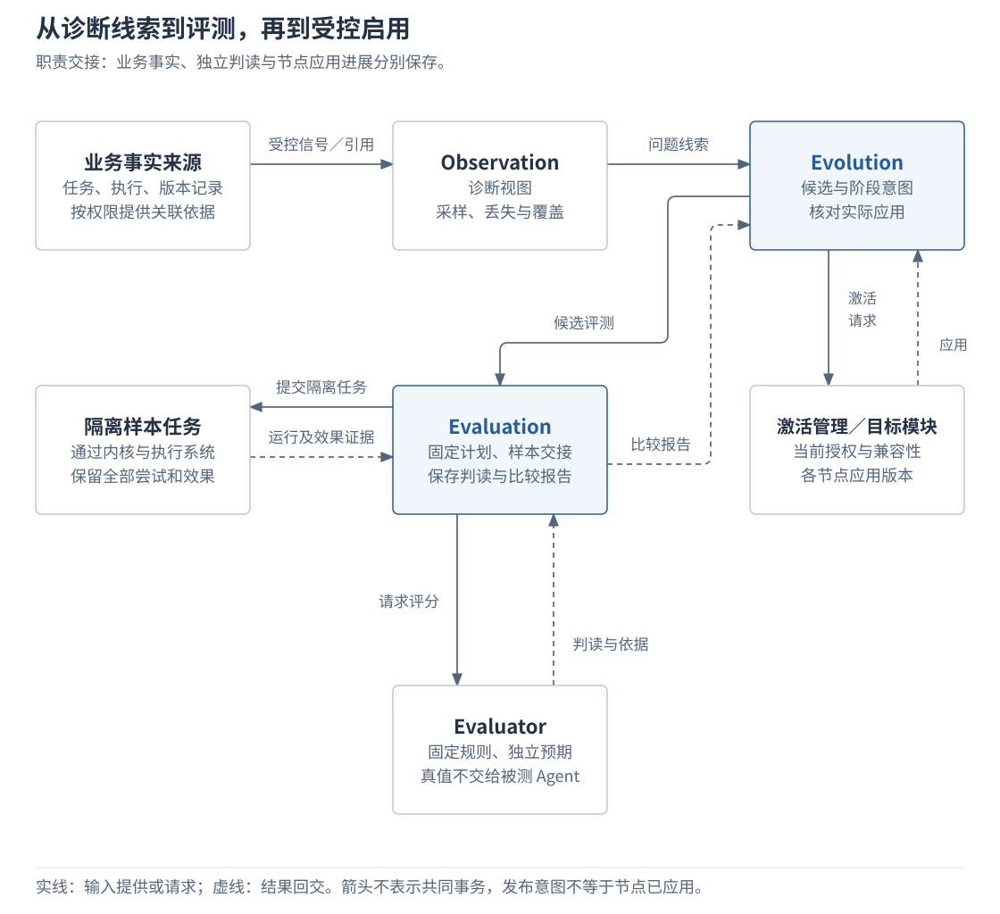

# 2.9 观测、评测与改进

任务自报完成、日志显示正常，都不足以说明实现质量已经达标，也不能直接作为启用新版本的依据。系统需要先保留可核对的运行线索，再用固定条件和独立判定检验候选，最后由有权主体控制启用范围。

观测负责帮助定位问题，评测负责形成可比较的证据，改进管理负责候选及发布进展。本章沿这三项职责说明输入、记录和交接，重点区分业务事实、评测结论与实际启用。完整计分、统计比较及阶段门槛由[评测、比较与发布](../04-engineering/04-evaluation-and-release.md)维护。

## 1. 运行事实、评分和候选由谁维护

任务、执行、授权、记忆和界面模块各自保存业务事实。观测从获准来源取得信号及引用，组织成可检索的诊断视图；这个视图用于追查发生了什么，其缺失或滞后不改写原模块已经确认的结果。

评测还需要独立于被测 Agent 的预期和效果证据。Evaluation 管理计划和运行，Evaluator 执行评分规则；Evolution 则保存候选、评测关联、发布意图与阶段进展。将三类事实分开，才能分别回答“动作是否发生”“候选是否通过评测”“哪些节点真正用了候选”。

下图表达职责交接，不规定部署进程或共同事务。图中的样本任务运行在获准的隔离环境，真实模型和动作仍经过任务内核与执行系统；业务来源到观测的箭头只表示受控信号和引用，不表示复制全部业务数据库。

| 职责 | 输入与输出 | 保存或维护什么 |
| --- | --- | --- |
| Observation | 获准事件、指标、关联引用 → 诊断视图与覆盖说明。 | 来源接纳和投影进展、采样或丢失情况；不维护第二份任务终态。 |
| Evaluation | 不可变计划、版本、预算和授权 → 逐例结果、证据完整性与比较报告。 | `EvaluationStore` 保存评测状态、样本交接及恢复责任。 |
| Evaluator | 固定评分规则、独立预期、环境效果与获准证据 → 判读、依据及评分器版本。 | 产生判定，由评测模块保存；无权修改被测任务或直接发布候选。 |
| Evolution | 问题证据、精确候选、比较结论、授权及回滚依据 → 候选资格与启用安排。 | `EvolutionStore` 保存候选、固定分组、阶段意图及交接责任；节点应用另行核对。 |

这些是逻辑职责和设计接口，尚非已实现的 SDK。分开管理增加了证据关联、版本核对和恢复记录，但避免把日志、评分或发布意图误当业务结果。管理接口与可替换组件的对应关系见[接口目录](../../reference/02-api-and-message-catalog.md#observation-service)。

## 2. 从问题线索到可比较结果

### 2.1 先定位失败边界，再决定检验什么

一次调用出现错误时，Observation 沿任务、操作、节点、版本和因果关联查找记录。先确定输入和提案发生在哪个阶段，再检查准入、执行及效果证据。记录来源须受信，跨端日志的显示顺序和墙钟时间不能直接决定业务先后。

| 观察到的问题 | 需要核对的依据 | 可以形成的判断 |
| --- | --- | --- |
| 所需能力没有出现在候选中 | 目录修订、查询条件及覆盖状态。 | 检查召回或覆盖缺口，不能直接归因为模型选错。 |
| 候选存在，但提案选用了不适用能力 | 实际提供的声明、任务输入及首次提案。 | 检查是否正确使用能力前提与参数要求。 |
| 提案原本适用，准入时被拒绝 | 提案基线、当前版本、控制与授权事实。 | 区分正常阻止过期提案与实现错误。 |
| 请求超时或报告不足 | 原操作记录、外部关联及效果证据。 | 可能需要继续核对，超时本身不证明动作失败。 |

例如，一项任务首次提出不适用的能力调用，内核阻止了错误动作，任务随后在预算内纠正并完成。诊断需要同时保留首次错误、阻止副作用和最终成功三项事实。后续评测才能分别统计首次正确性与有界任务成功，不能用最终成功覆盖第一次错误。这个判断依赖实际输入、提案和执行事实，无须采集模型内部思维链。

Observation 查询结果同时提供覆盖信息：来源记录接收到哪里、诊断视图应用到哪里、哪些信号被采样或丢失。查询没有返回记录时，先看这些范围，再到获准业务依据核对；不能把“没看到动作”写成“动作没有发生”。

### 2.2 固定计划，由独立判定者检查效果

发现问题后，可登记一个有明确内容和作用范围的候选，例如调整能力声明的呈现配置。评测开始前，需要明确允许变化的对象，并冻结样本、预期、目录、模型与配置、初始环境、故障条件、评分器、预算及基线。开发、筛选和独立保留确认使用不同用途的材料，参与候选修改的数据不再作为未见证据。

一轮正常评测按以下责任交接：

1. **接纳计划。** Evaluation 校验管理权限、计划及预算，在本方存储中保存评测和样本工作，经持久交接提交隔离任务。
2. **运行样本。** 基线与候选分别重置业务状态、记忆和缓存，使用独立测试身份与资源。被测 Agent 通过正式接口运行，保留首份提案、全部尝试及实际效果；任务内有界纠错不重置首次记录。
3. **独立评分。** Evaluator 在自己的获准范围读取预期及环境效果，按固定规则给出判读、依据和缺失说明。隐藏答案与判定器特有观察不能进入被测 Agent 的上下文。
4. **保存报告。** Evaluation 将判读和受控证据引用纳入逐例结果，保留失败、未知、成本与覆盖缺口。必要证据不能按临时遥测采样，不能多跑后只挑最好尝试。
5. **比较同计划运行。** 基线与候选按同一样本配对，检查改善、退步和代价。评分器、预算或环境发生未受控变化时报告不可比；只有适用方法支持时，才能作相应改善判断。

评测运行收尾与评测通过分别表达。运行的 `COMPLETED` 表示流程已经收尾，报告的 `PASS`、`FAIL` 或 `INCOMPLETE` 才说明判定。既有失败项与缺失项都保留，流程结束不能自动生成“通过”。

Evaluation 与 Evolution 各自提交本方状态、回执和待交接记录，没有共同事务。提交结果未知时核对本方原提交；样本接纳回执丢失时查询原样本操作，不能换身份再次执行并覆盖旧记录。取消先持久保存意图，再停止新样本，并沿原身份收束在途任务与迟到结果。

证据接收、评分和报告可以幂等恢复；更换评分器产生新的判读版本，原结果保留。历史重放默认只重建投影或重新评分，不重新发送真实写操作。完整运行和计分方法见[工程评测章](../04-engineering/04-evaluation-and-release.md#2-一轮评测如何产生可信结果)，统计条件和验收配置分别见[评测细则](../../reference/evaluation-details.md#statistics)与[附录 05](../../reference/05-validation-profiles-and-traceability.md)。

## 3. 从比较结论到受控启用

Evolution 管理有版本的提示、Skill、配置或实现候选。候选记录问题证据、精确产物、预期改善、作用范围及回滚依据，通过 Evaluation 取得隔离评测、配对比较和独立保留确认结果；登记候选本身不授予发布权。

通过评测只建立相应发布资格。实际启用前仍须检查当前授权、证据有效性、产物信任和兼容性；插件、内核或打包代码还需维护者确认精确产物。候选 Agent 不能自行修改评分器、发布门槛、保留答案或自己的权限。

正常启用时，Evolution 先保存阶段意图、固定分组、原管理回执及待交接记录，再沿稳定操作调用 ExtensionManager 或对应模块。目标节点各自应用，Evolution 核对节点实际版本与阶段证据后更新进展。发布意图已提交、部分节点已应用、阶段检查通过是不同事实。

试运行只分配给符合条件的新任务或关联工作组，分配与版本绑定持久保存，同一任务不能在途中随意切换候选和对照。候选与基线涉及的可变资源须隔离或排他；影子验证只在模拟环境执行或生成提案，不能把真实写入做两遍。固定绑定也使后续结果能够归因到实际使用的版本，代价是需要保留旧绑定及其恢复依据。

例如，能力选择配置已经通过离线评测，但试运行中暂时缺少独立效果证据。Evolution 应停止扩大并等待补足证据，不能仅凭任务自报完成继续晋级。若确认发生禁止动作，则优先停止相应新路由并处置在途工作；这与单纯缺少证据的处理不同，完整条件见下一节。

回滚改变后续选择，不撤销已发生的业务效果，也不恢复旧业务数据库。原工作保留版本、输入及操作关联，是否继续仍受当前授权和控制约束；回滚目标不可信或不兼容时保持隔离，等待处置。常规记忆更新按记忆生命周期进行，保存个人偏好不等于批准自动改变执行策略。

## 4. 证据缺失或失效时怎样处理

### 4.1 先分清任务失败、设施缺证据和发布条件缺失

缺失发生在哪一层，决定谁继续处理，也决定可以得出什么结论：

| 条件变化 | 应采取的动作 | 不能得出的结论 |
| --- | --- | --- |
| 诊断导出失败或临时 Trace 缺失 | Observation 标明覆盖，按获准来源补投或重建；必要时核对业务记录。 | 不能把已确认的业务成功改成失败，也不能凭缺日志断言未执行。 |
| 被测任务自身没有完成规定的效果确认 | 按原计划记任务未成功，保留失败和分母，未知效果继续核对。 | 不能改称评测设施缺证据以免计失败。 |
| 评分器故障或设施丢失必要证据 | Evaluation 标明原因和不完整范围，保留样本与已有判定。 | 不能删掉这些样本后宣布通过。 |
| 试运行样本、时长或独立证据不足 | Evolution 停止扩大，补足后重查条件；到期仍不足则待评估。 | 等待超时不会自动晋级，证据不足本身也不证明质量退化。 |
| 目标节点的应用状态未知 | 沿原激活操作查询，保留待核对状态。 | 阶段意图已提交不代表所有节点已切换。 |
| 必要运行或执行授权依据缺失 | 停止受影响的新执行，恢复可判断条件后再处置。 | 不能仅维持当前试运行比例而继续受限执行。 |
| 已确认硬性违规或达到退化处置条件 | 按对应规则停止新路由或扩大，核对在途工作并请求有条件回滚。 | 回滚请求不证明已撤销效果，也不允许启用不可信或不兼容的旧版。 |

已确认的硬性违规优先处理，即使同时存在证据缺口。数值门槛、观察窗口和各类条件的精确处理由[阶段启用规则](../04-engineering/04-evaluation-and-release.md#6-候选怎样逐步启用)维护，本章保留判断所需的职责区别。

### 4.2 来源变化时，证据与派生内容一起处理

诊断视图、正式评测证据和业务原文分别管理留存范围。引用不自动授予读取或长期保留权；输入、截图、参数、评分理由和候选产物继承来源的用途、处理位置、披露及删除限制。端侧评分可以只返回明确获准的汇总或引用，统计数量也不能默认视为匿名。

来源被纠正、删除或用途收紧后，受影响样本和派生内容停止使用，按依赖关系删除、失效或重建。报告标明证据已删除或不可复核，仅保留获准的最小历史；关键证据不再支持新的发布推进。已经激活的候选是否撤回，要结合内容依赖、当前授权和风险判断，不能为了复核而恢复被删除正文。

已经发生的业务效果与历史发布事实仍如实保留最小依据，诊断保留期不能清理任务恢复、去重或授权消费尚需的权威记录。具体期限和通知方式见[证据留存细则](../../reference/evaluation-details.md#retention)。

## 5. 实现可以怎样替换，怎样证明职责成立

开发期可从 SQLite 诊断索引和受控文件开始，观测后端通过 Adapter 替换。Evaluation 与 Evolution 分别依赖本方 Store 的提交和恢复能力，Evaluator 按固定规则返回判读；接口相同仍须验证来源约束、覆盖信息和未知结果处理，不能只比较正常路径输出。

| 验证问题 | 必须取得的证据 |
| --- | --- |
| 诊断是否保留事实与缺口的区别？ | 来源去重和覆盖可查询，采样或导出失败不改写业务状态，未经验证的载荷不能自报审计事实。 |
| 评测能否独立判定？ | 被测 Agent 无法取得隐藏真值或改分；首次错误、后续纠正和副作用分别保留，设施故障不会被记成通过。 |
| 重启是否复制样本或真实写入？ | 原管理提交和样本关联可核对，取消后的在途结果可收束；历史重放不重新执行真实副作用。 |
| 发布是否按真实应用和当前资格推进？ | 原激活回执丢失后能恢复，任务分组固定；授权、证据或产物变化后重新判断资格。 |
| 来源限制能否传播到评测与改进？ | 受限正文不因诊断或重放被额外保留，删除后相关证据和派生内容按依赖失效。 |

完整管理接口、证据查询与存储交接见[评测细则](../../reference/evaluation-details.md#persistence)。这些是设计与验收要求，尚无证明模型质量、改进收益或生产稳定性的运行结果。内部执行器、调度和具体存储组织继续列入[详细设计规划](../../design/README.md)。

---

[上一章：2.8 扩展与运行保障](08-extensions-and-runtime.md) · [正文目录](../README.md) · [下一章：3.1 持久交接与结果确认](../03-coordination/01-reliable-handoff.md)
