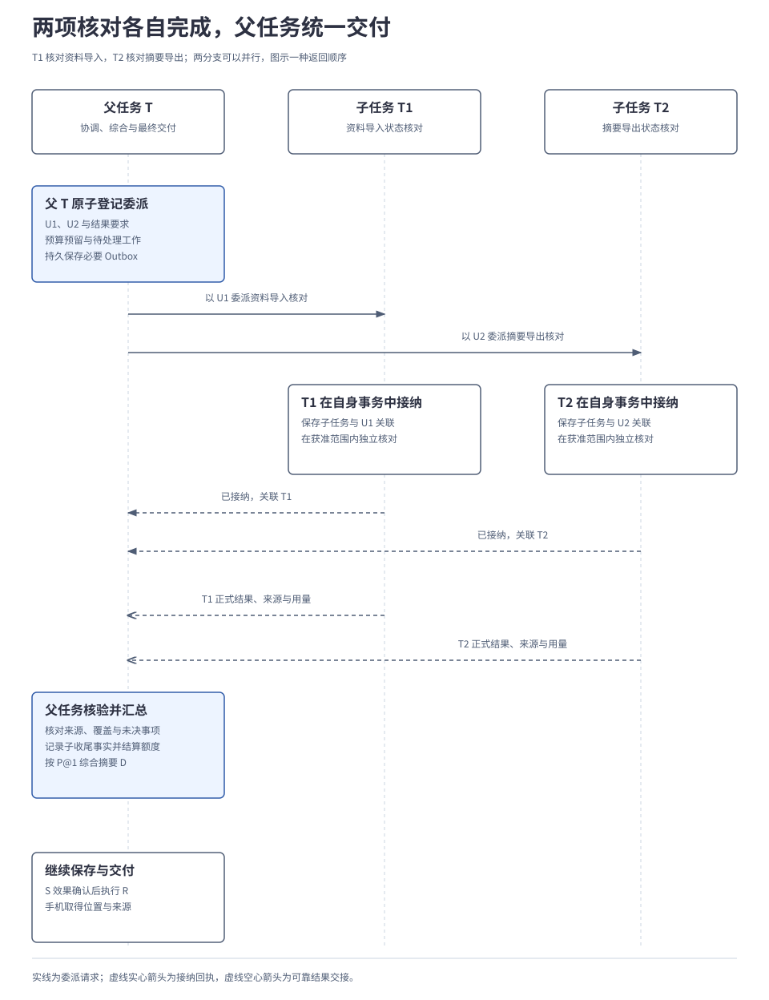
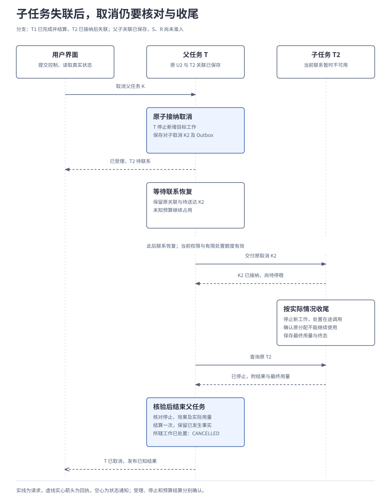

# 3.3 多 Agent 协作

<a id="11-多-agent-协作"></a>

委派使一个目标由多个独立决策循环共同完成。父任务持久保存委派关系、权限与预算安排，子任务在自己的运行责任内接纳并推进，父任务再核验结果和收尾条件。业务端点与连接职责已在[协作与连接](../02-subsystems/07-collaboration-and-connection.md)建立，本章展开跨任务的正常过程、控制传播及失联处理。

## 本章要解决的问题

委派把一个目标拆成多个独立决策循环，也把提交、额度和控制分成多份事实。父任务需要证明子工作已被唯一接纳，结果足以支持汇总，且所辖工作已经收尾。

| 选择 | 解决的问题 | 必须承担的代价 |
| --- | --- | --- |
| 子任务独立推进，父任务保存委派关联 | 子目标可以自行判断和处理局部问题。 | 多份持久记录需要核对，子完成不能直接决定父完成。 |
| 父先预留、子在份额内消费 | 并行和重试不复制预算。 | 未知用量继续占用，失联不能立即退款。 |
| 控制按来源传播，逐层确认落实 | 父恢复时不会清除子自己的暂停。 | 全树停止可能等待不可达子任务及在途处置。 |

<a id="components"></a>
### 父子任务各自维护什么

父 T、子 T1、子 T2 各有一个逻辑任务拥有者（Task Owner），分别负责提交自己的状态。它们可以运行在同一进程或不同位置，共用数据库也不把三个任务变成一项事务。子任务因此能独立推进，父任务则必须靠持久委派记录跟踪接纳和收尾，不能把一次远程返回当成共同提交。

内部 Agent 的生命周期由 Harness 管理；外部 Agent 保持独立运行时，Adapter 保存本地任务与远端句柄的映射，按实际支持范围处理查询、取消和证据，边界见[2.8 扩展与运行保障](../02-subsystems/08-extensions-and-runtime.md)。

| 交接 | 发出方保存什么 | 接收方决定什么 |
| --- | --- | --- |
| 委派 | 父保存原委派、预留与交付责任。 | 子接纳方决定是否创建并关联唯一子任务。 |
| 结果 | 子保存来源、效果、用量和待发报告。 | 父核验后纳入自己的事实与结算。 |
| 暂停或取消 | 父保存控制来源及每个目标的传播责任。 | 子保存来源，处置自己的工作并继续向下传播。 |

以下先判断是否值得委派，再沿接纳、结果、额度和取消展开。两张时序图分别用于正常汇总与失联收尾。

本章用两个只读子任务说明委派。父任务 T 要综合手机《会议记录》E1 和电脑《需求说明》E2，生成 D《项目进展摘要》，在电脑指定目录保存、读回核验后向手机交付位置与来源。两份资料已取得，D 尚未形成；所需读取、处理、跨端传递和目标目录读写均已获准。T1 核对“资料导入”，T2 核对“摘要导出”，允许向子任务传递所需内容或受控引用并在获准位置处理。保存 S、读回 R 和手机交付仍由父任务负责。

## 1. 哪些工作值得成为子任务

只有两段简短资料时，一个 Agent 就足以完成整理。本篇采用两个子任务，是为了说明独立判断、状态与恢复责任怎样组合；不能据此推导多 Agent 一定更快、更准确或成本更低。

| 组织方式 | 适合什么情况 | 谁持续作出判断 |
| --- | --- | --- |
| 单 Agent 顺序执行 | 后一步依赖前一步，目标与上下文集中。 | 同一任务的大脑根据反馈推进。 |
| 同一任务并行调用工具 | 已经知道要做哪些独立动作，例如同时读取两份资料。 | 工具报告事实，同一大脑综合；不必增加子任务。 |
| 委派给 Agent | 子目标需要自行选择步骤、判断证据、处理局部问题，并能交付可核验结果。 | 子任务有自己的有限决策循环；父任务处理分工与汇总。 |

教学分工按项目工作项划分，不按手机和电脑各设一个 Agent。两个子任务都能对照获准的 E1、E2，但不共享可随意改写的任务状态，也不需要取得保存摘要的权限。

| 子任务 | 交付要求 | 本例的核对结果 |
| --- | --- | --- |
| T1：资料导入状态核对 | 对照交付要求与进展，返回资料记载、来源和缺口。 | E2 要求资料导入通过验收；E1 记载已验收。 |
| T2：摘要导出状态核对 | 对照交付要求与进展，返回资料记载、来源和缺口。 | E2 要求摘要导出通过验收；E1 记载仍在联调、尚未验收。 |

两项结果只说明资料记载的状态，子 Agent 没有实际执行产品验收。T2 正确指出“尚未验收”可以完成自己的核对目标；父任务也可以完成摘要交付，而项目本身仍未满足全部交付条件。每项委派都有额外的上下文、模型、记录与协调成本，拆分前应确认独立判断带来的收益值得这些成本。

## 2. 一份委派怎样成为唯一的子任务

父任务的大脑只提出有限委派；内核检查当前任务、授权、位置和预算后，才把它变成持久工作。否则，父任务重启后可能既不知道对方是否启动，也不知道是否已经分出资源。

| 委派时固定的内容 | 本例怎样表达 |
| --- | --- |
| 子目标与交付要求 | 分别核对资料导入、摘要导出的资料状态，返回结构化结论与来源。 |
| 输入与披露范围 | E1、E2 的获准片段或引用、来源修订及用途；子任务在自己的上下文中使用，结果只向获准接收方披露。 |
| 权限、位置与期限 | 允许的读取、处理及结果传递范围；授权只收缩，子任务不能借自己的宽权限扩大执行范围。 |
| 预算与自主范围 | 有限的决策、生成、行动、并发和委派深度；本例不允许子任务继续向下委派。 |
| 结果结构与验收条件 | 结论、证据、覆盖、缺口和效果状态；“已读资料”不足以完成核对。 |
| 必需性与依赖 | 本例 T1、T2 都是必需分支；父任务综合依赖两份有效结果，两个子任务互不等待对方完成。 |
| 稳定身份与接纳方 | U1、U2 是两项委派操作的教学名称，分别关联 T1、T2；操作与任务引用属于不同对象。 |

父任务在自己的 RunStore 事务中保存准入映射、委派份额、待处理工作和必要 Outbox；提交确认后，才经 `TaskService.Submit` 交给受委派方。接收方校验受信主体、委派关系、当前权限和输入，在自己的事务中建立子任务、关联原委派并登记获分配额度，再返回接纳结果。

下面以 U2 示意恢复顺序，省略完整字段与交付重试细节：

```text
推进原委派 U2：
  读取 T 中的 U2、预留与当前控制
  若父提交不明：先核对原提交
  若已有 T2 关联：沿原 T2 推进并返回
  若远端接纳不明：
    查询 U2 的原接纳结果
    查清前保留预留，不创建替代子任务
  仅在确认可以交付时，以原 U2 提交
  接收方在自己的事务中：
    校验权限，核对 U2 的固定语义
    已接纳则返回原 T2，不重复授额
    新接纳才创建 T2、额度与持久工作
  父端按版本保存关联，继续原工作
```

同一 U2 携带不同目标或参数必须拒绝；回执丢失不允许换一个委派身份再创建 T2。若此时父任务已暂停或取消，仍须查清原委派是否存在，将当前控制传播给确认存在的子任务；核对不构成启动新目标工作的许可。外部对端若不能提供原提交查询或其他可靠关联，应保留接纳未知，不能由 Adapter 假造去重保证。

## 3. 子任务怎样交付，父任务怎样综合

正常情况下，两条独立分支可以并行推进。下图只排列一次可能的反馈顺序；每列表示任务及其运行模块，不表示固定进程或设备。图中返回的是子任务完成时的正式结果，包含所辖工作的收尾事实；运行中的进度和部分结果可以提前交接，但不代表子任务已结束。

[](../../diagrams/11-collaboration-sequence.html)

“T2 已完成”只说明它报告了某种状态。父任务还需取得足以核对这项子目标的内容：

| T2 的正式结果 | 父任务怎样使用 |
| --- | --- |
| 结论 | “资料记载摘要导出仍在联调、尚未验收”；核对是否回答了指定子目标。 |
| 来源与修订 | E1 的进展、E2 的交付要求及对应受控引用；检查来源仍有效且可用于此次汇总。 |
| 覆盖与缺口 | 仅覆盖提供的 E1、E2，未执行实际验收；不能补写成“已经验收失败”。 |
| 产物与效果状态 | 获准的结果内容或引用；本例没有写文件动作，其他任务须如实报告已发生及未确认效果。 |
| 子任务收尾与用量 | 终态、所辖工作处置及可核实消耗；用于判断依赖已满足、额度能否结算。 |

父任务检查结构、来源、覆盖和未解决事项，再把可用结果纳入自己的任务事实。进度、聊天消息、置信分数或多个 Agent 的多数意见不能替代证据。来源已失效或两份结果冲突时，保留原报告及差异，在当前授权和预算内补查或请求澄清；不能让最近返回的结论直接覆盖其他来源。

本例两项核对都有效，父任务据 E1、E2 得出“项目尚未满足两项均验收的要求”，按仍获准用于此类摘要的格式偏好 P@1，先列待办、再列已完成，形成摘要 D。随后才提出并准入 S、R：S 的保存效果确认后执行 R，核验正文并向手机交付位置与来源。这段保存与交付工作仍由父任务负责。

协作中的补充事实沿 `SubmitUpdate` 的正式输入语义交给接收方；具体等待项的回答使用 `ProvideInput`。接收方检查权限、版本和适用状态，决定是否接纳，其他 Agent 不能直接改写它的目标或状态。子结果到达会改变父任务的决策依据，过期提案按[2.3 规划、决策与模型调用](../02-subsystems/03-planning-and-decision.md)拒绝并重新决策；批量消费已持久化结果可以减少重复生成，但不能丢弃可靠事实。

依赖也要能结束。例如“父任务等 T2 完成，T2 又必须等父任务完成”应被拒绝。跨运行时无法完整探测的依赖仍受有限期限和无进展检查约束，不能无限互相等待。

## 4. 权限、预算和期限怎样分给子任务

委派允许子任务在边界内自主决定步骤，不把父任务的全部权限和余额复制过去。父任务只能派生其有权授予的范围；读取、模型处理位置、结果披露、有效期和全部祖先限制继续生效。授权额度与任务预算分别管理，增加预算不授予额外数据权限，具体派生与消费规则见[2.6 身份与授权](../02-subsystems/06-identity-and-authorization.md#转交给其他节点时权限怎样收缩)。

父任务先预留委派份额，子任务在自己的权威存储中原子扣减，父任务取得可核实用量后再结算。预留随父任务的待处理工作一起保存；重复接纳原委派不再取得一份额度。允许继续委派时，向后代分出的总额也不能超过自身可分配范围。

下面单独演算“模型请求次数”这一项额度。假设起始剩余 10 次，向 T1、T2 各预留 3 次，暂不计父任务后续生成；其他预算维度分别记账。这些数字仅用于教学，不是默认配置或实测消耗。表中每一行的父可用、未结算预留和已结算用量之和都保持为 10，失联不会产生新的可用额度。

| 阶段 | 父可用 | 未结算的委派预留 | 已结算的子用量 |
| --- | --- | --- | --- |
| 分配前 | 10 | 0 | 0 |
| 向两子任务各预留 3 | 4 | 6 | 0 |
| T1 已不能再用原份额，核实用了 2 | 5 | 3 | 2 |
| T2 失联，尚不清楚其使用情况 | 5 | 3 | 2 |
| T2 已不能再用原份额，核实用了 1 | 7 | 0 | 3 |

T1 只退回未用的 1 次，T2 失联时其 3 次预留仍占用。父已提交、子是否接纳不明，同样不能把余额恢复后再交给另一个 Agent。即使执行资格已可靠失效，历史用量仍不明，也应保守占用或明确记录未结算。并发槽位也不能在旧工作仍可能运行时重复分配。

决策次数、生成请求、token、动作、并发与委派深度分别限制；一次决策内部的格式修复、模型回退及最终未采用的请求也消耗预算。次数预算不等于精确账单上限；只有具备可执行保守上界或可验证配额机制的 Adapter，才能承诺对应的费用硬限制。

子任务期限在父分配与授权允许的范围内固定，到期后停止增加目标工作。必要取消、效果核对和恢复使用另设的有界处置额度及适用权限；它们不能拿来继续扩展目标。处置资源也不足时保留待核对事实，等待获准资源或证据。预算和期限只有经有权主体明确提交才能调整，重启、重新规划或恢复操作都不增加余额。

这套记账属于任务运行状态，无需新增必需的预算服务。生产环境的用户账本和分层配额由[4.2 部署、存储与规模扩展](../04-engineering/02-deployment-and-storage.md)承接，子任务离线时如何判断可继续则由[3.4 端云协同与离线运行](04-edge-cloud-coordination.md)展开。

## 5. 父任务的暂停与恢复怎样传给子任务

父任务受理暂停，不代表所有子任务在同一时刻停下。每个任务先保存自己的控制与传播责任，再由受辖子任务分别接纳并落实。暂停可以有多个来源，合并规则沿用[2.5 应用与交互](../02-subsystems/05-interaction.md#3-暂停恢复取消和接管怎样生效)。

| 控制情形 | 子任务应怎样处理 |
| --- | --- |
| 父 T 接纳暂停 P，范围为 SUBTREE | 记录来自 T 的暂停来源，阻止新的目标工作，并向所辖后代传播；已开始工作按能力处置。 |
| T2 另有自己的暂停 Q | 同时保留 P、Q，任一来源有效都继续暂停。 |
| 父任务解除 P | 只解除来自 P 的控制；T2 的 Q、其他等待、资源接管和取消均保留。 |
| 解除 P 的新修订先到，旧暂停后到 | 保存关闭修订，拒绝迟到的旧状态，避免重新暂停。 |
| 父任务已接纳取消 | 取消优先，恢复不撤销取消；按实际子状态继续传播与收尾。 |

暂停默认作用于 `SUBTREE`；显式 `SELF` 只作用于本任务，不代表子任务也已暂停。范围仅覆盖受其管理的委派树，不包含无关独立任务。有效控制回到 RUN 只表示暂停／取消不再阻挡，还须满足输入、权限、资源与依赖条件。

控制按来源和修订持久传播；每个目标使用自己的稳定子操作，接纳与实际落实分别报告。父端只有取得相关后代已停稳或完成处置的证据，才能报告全树已落实，具体交接见[协作细则 A](../../reference/collaboration-details.md#control)。

暂停期间不新建自主子任务，已经发出但接纳不明的委派仍要核对并补上控制。没有通用的“冻结外部副作用”能力，停止过程和任务主状态分别记录；关闭来源及其修订须按恢复窗口保留，清理后仍拒绝过期接纳。

## 6. 子任务失联后取消，父任务何时才能结束

现在另开取消分支：T1 已完成并结算，T2 已接纳且父子关联已持久保存；T2 所在运行实例暂时失联，S、R 尚未准入。此时用户要求取消父任务。本例保留有效的子任务控制、查询、结果披露权限与有限处置额度；图中选择联系恢复后能够确认 T2 停止、核清用量的路径。

[](../../diagrams/11-cancellation-recovery.html)

K 是取消父 T 的操作，K2 是针对子 T2 的另一项控制操作。父端保存 K2 与待发送责任，重复交付仍使用原 K2。失联期间可向用户说明取消已受理、T2 待核对，并交付获准的已知部分结果；不能宣布整项任务已取消，也不能回收仍可能被使用的份额。失联侧是否还能工作取决于实际能力、已分配额度和当前有效授权，父端看不到进展不能代替停止证据。

联系恢复后先重新认证并检查当前权限，交付原控制、查询原 T2；“K2 已接纳”仍只是受理事实。T2 处置在途工作后保存可核对的结果、效果与用量，父任务幂等消费报告并记录结算。停止已确认但历史用量仍未知时，应保存停止事实并保留未结算占用；图中不把这种情况画成零消耗退款。

| 其他局部情况 | 父任务的处理 |
| --- | --- |
| 委派已接纳，关联回执丢失 | 按原 U2 查询并补齐关联；不新建另一子任务，不重复授额。 |
| 必需子任务明确失败 | 停止依赖其成功的工作；独立分支可在剩余预算内继续，保留有效部分结果。 |
| 可选子任务失败 | 明确缺口，按原验收条件判断；不能为了成功把本例必需分支临时改成可选。 |
| 子结果冲突或证据不足 | 保留不同来源与缺口，有限补查或澄清；不按多数、置信分数或返回先后直接裁决。 |
| 取消之前子任务已经完成 | 保留真实结果与用量，核对是否还有所辖工作；不能把已完成事实改写成“从未执行”。 |
| 对端无法停止、无法查询或长期失联 | 保持待送达／待核对及明确保证范围；不能靠本地超时、删除关联或重新委派制造完成。 |

父任务进入终态前，所辖子任务及外部操作须已经完成、明确未启动，或已停止并完成必要处置，关键效果没有待核对项。本例 T1 已收尾、T2 已确认停止、S／R 未准入，父任务才可记录 CANCELLED；正常分支则还须完成保存、读回和手机交付，才能记录成功。父任务不再需要某个分支时，也要按这些条件处置它。

默认不允许子任务悄悄脱离父任务继续后台运行。确需独立长期工作，应在已有授权范围内明确创建拥有独立目标、预算与责任的任务；不能用“脱离”规避取消或重复启动未知工作。失败和取消也不自动回滚既成效果；补偿须作为新的、获准的业务操作，并核验补偿结果。

## 7. 怎样验证多个任务仍受同一套规则约束

先用脚本化大脑、可控模型替身及真实进程边界检验协作事实，再用真实模型评估拆分、判断与汇总质量。契约通过不能证明多 Agent 比单 Agent 更有效。

共同测试分别验证原委派恢复、权限收缩、预算守恒、乱序控制和收尾条件；内部与外部 Agent 按实际能力提供证据。完整矩阵见[协作细则 B](../../reference/collaboration-details.md#validation)。质量、耗时和成本仍须与同条件单 Agent 对照，未实测不宣称收益。

本篇沿用已确认的[大脑与协作设计](../../../archive/architecture-v1/06-brain-and-agent-collaboration.md)、[委派与预算契约](../../../archive/architecture-v1/06-decision-admission-and-collaboration.md)及[控制传播补充](../../../archive/architecture-v1/12-data-path-and-protocol-semantics.md)。当前没有多 Agent 运行或质量对照结果；完整字段和故障矩阵由[契约参考](../../reference/README.md)维护。

---

[上一章：3.2 任务控制与来源变化](02-control-and-lifecycle.md) · [正文目录](../README.md) · [下一章：3.4 端云协同与离线运行](04-edge-cloud-coordination.md)
