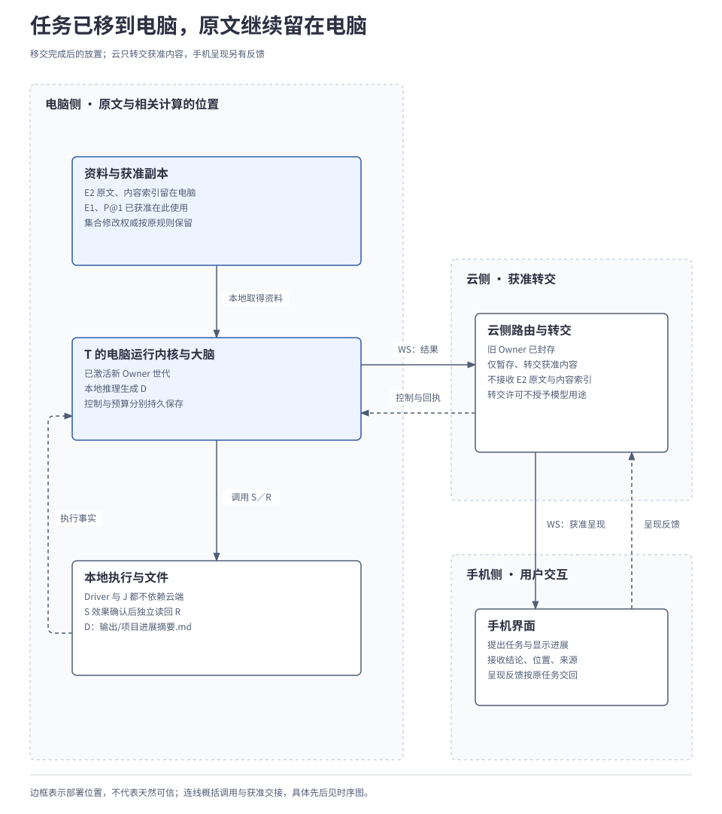
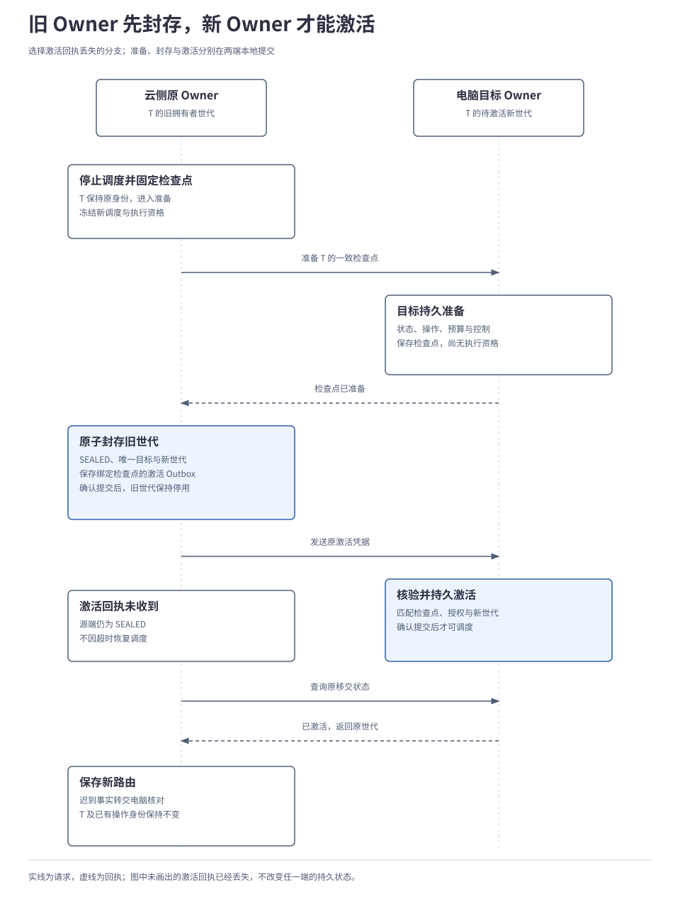
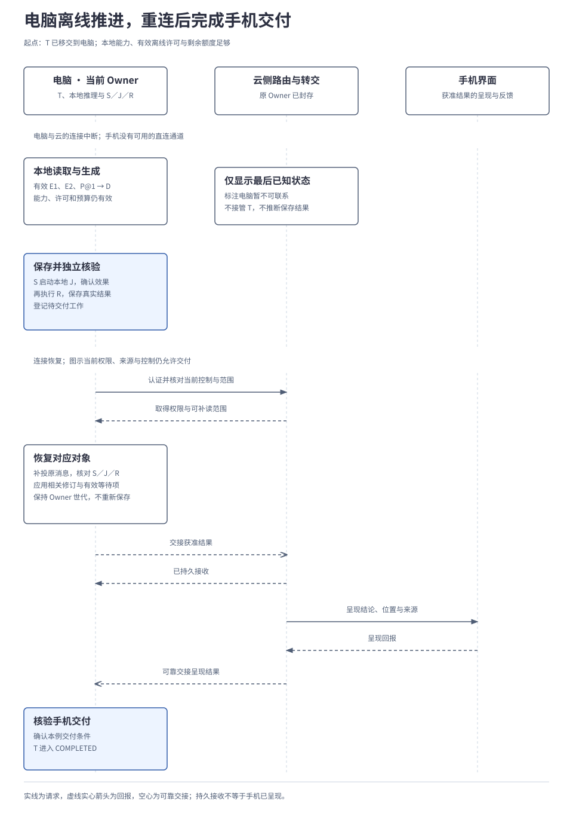

# 3.4 端云协同与离线运行

<a id="12-端云协同与离线运行"></a>

端云协同分别管理任务推进权、能力与资料的放置以及消息转交。调用远端工具不自动转移任务，断开连接也不授予接管资格。本章先比较放置方式，再解释受控移交如何建立端侧权威、离线续跑需要哪些条件，以及重连后怎样核对原操作和副本。

## 本章要解决的问题

“能连接”“有副本”和“有权继续”是三项独立条件。端云协同先固定谁推进任务、谁修改资料以及内容可在哪里处理，再讨论离线和重连。

| 职责 | 维护的事实 | 连接变化时仍保留的边界 |
| --- | --- | --- |
| 任务 Owner | 所属任务的状态、控制、预算和持久工作。 | 只有显式移交才改变推进权。 |
| 电脑执行模块 | 保存与读回操作、外部作业关联及实际效果。 | 断云不证明保存失败，重连也不重新保存。 |
| 记忆集合权威 | 所属记忆集合的正式修订。 | 任务移交不迁移集合修改权。 |
| 云侧路由与交付、手机呈现 | 获准消息的转交、界面版本和呈现反馈。 | 缓存视图不能代替任务权威或扩大披露范围。 |

| 关键选择 | 理由与代价 | 展开位置 |
| --- | --- | --- |
| 先封存旧 Owner，再激活唯一目标 | 防止双方同时推进；中间允许暂时不可用。 | [在线移交](#2-在线时怎样把-t-移交到电脑) |
| 离线逐项检查本地条件 | 本地工作可以继续，远端依赖独立等待；许可窗口限制继续时间。 | [离线条件](#3-断云后电脑还能完成哪些步骤) |
| 查询靠近数据，结果按出口约束返回 | 原文可以留端参与判断；本地能力不足时不能自动外发。 | [原文留端](#5-原文留在电脑怎样检索和形成记忆) |
| 原任务、可靠消息和记忆副本分别恢复 | 快照不证明历史操作从未提交。 | [重连](#6-重连后任务事实和记忆怎样收敛)、[记忆同步](#memory-sync) |

## 1. 同一任务怎样放在端云两侧

记忆、大脑和执行是逻辑职责，端与云是部署位置。节点声明实际能力，任务再按资料策略、当前可用性和授权安排工作；“端侧”不自动代表可信，“云侧”也不自动拥有全部资料。

| 放置方式 | 怎样推进任务 | 主要条件与代价 |
| --- | --- | --- |
| 单端完整运行 | 本地内核、记忆、大脑与工具协作，默认可用 SQLite 持久化。 | 无需独立云基础设施；本地模型和资源要满足当前工作。 |
| 云侧协调、调用端侧能力 | 云侧 Owner 推进任务，电脑维护被调用操作的执行事实。 | 每次远程调用不必建子任务；失联后云侧不能替电脑断言结果。 |
| 端侧自主、按需联系云侧 | 端侧拥有任务，或拥有一项已受委派的子任务；云只提供获准能力。 | 本地条件齐备的工作可继续，远端依赖与结果交付分别等待。 |

下面的局部例子以生成并交付项目进展摘要为目标，尚未读取电脑资料 E2《需求说明》，也未生成摘要 D：任务 T 最初由云侧协调，在双方在线时显式移交到电脑。此时没有在途外部动作，也没有未收尾子任务。

本分支要求 E2 的原文、内容索引和相关模型处理只留在电脑。手机 E1《会议记录》和格式偏好 P@1（先列待办、再列已完成）的获准副本已在电脑，仍满足用途、新鲜度和来源要求。保存操作 S 将摘要 D 写入电脑，工具以外部作业 J 跟踪保存，效果确认后由操作 R 读回核验。

手机可以接收本任务的摘要结论、文件位置和受控来源引用。云端只获准暂存、转交这些内容，不因此获得 E2 原文或任意模型处理权限。资料位置、计算位置和可返回内容是分别约束的。

本例选择第三种放置，并用一次受控移交解释它如何从第二种到达。也可以从任务创建时就由电脑拥有；移交是教学中的明确管理动作，不是每次断网的固定流程。

下图展示移交完成后的位置。电脑既保存受限资料，也承担本地推理和 S／R；云端原 Owner 已封存，剩余的路由与转交职责不授予它继续推进 T 的资格。

[](../../diagrams/12-data-placement.html)

跨端调用沿用[2.8 扩展与运行保障](../02-subsystems/08-extensions-and-runtime.md)的传输约定：部署侧内部跨进程使用 gRPC，端云使用 WebSocket，进程内可直接调用 Interface。同机模拟端云也要经过真实协议和独立持久化边界，不能用共享内存替代交接验证。

<a id="2-在线时怎样把-t-移交到电脑"></a>

## 2. 在线时怎样移交同一任务

任务的逻辑拥有者（Task Owner）是有资格提交该任务状态的内核责任单元，责任由持久记录确定，不随进程重启或连接变化自动转移。它可以远程调用工具，也可以委派其他任务；更换工具位置或 Worker 也不等于更换 Owner。

同一任务的**拥有者世代 `owner_epoch`** 区分前后推进资格；任务版本描述业务状态变化，Worker 领取代次限制本轮处理资格，连接及流位置描述交付进展。这些元数据各有用途，不能互相替代；重连不增加拥有者世代，移交也不更换任务身份 T。

每次状态提交都在 RunStore 的同一事务中核验当前 Owner、世代、预期任务版本及适用的 Worker 资格。先查询资格、再无条件写入，无法阻止查询后已经失效的旧执行者推进任务。

如果电脑仅拿到一份任务快照就开始运行，云和电脑可能同时发出保存。移交因此分成准备、封存和激活，目标在准备完成后仍须等待源端正式交出资格。源端已封存而目标尚未激活时，允许任务暂时不可用；这段等待用于避免双方同时推进同一任务。

| 阶段 | 云侧原 Owner | 电脑目标 Owner |
| --- | --- | --- |
| 停止新调度 | 进入准备阶段，记录唯一目标，停止新增调度与发放执行资格。 | 尚无 T 的推进资格。 |
| 准备检查点 | 固定一致的任务版本与检查点；既有动作须纳入核对或收尾。 | 持久保存检查点及内容摘要，处于准备阶段，不启动任务。 |
| 封存旧世代 | 在本地原子提交中保存旧世代封存、唯一目标、新世代和激活 Outbox；提交确认后才发凭据。 | 继续等待有效激活凭据。 |
| 激活新世代 | 保持封存，不因目标未回包恢复旧调度。 | 校验凭据、确切检查点及授权，原子提交新世代；确认提交后才恢复调度。 |
| 核对与路由更新 | 核对同一次移交，保存新 Owner 路由，转交迟到事实。 | 重复激活返回原结果，不再增加世代或创建另一个 T。 |

检查点是供目标端接续原任务的一致恢复记录，必须覆盖以下内容：

| 内容组 | 要保留的依据 |
| --- | --- |
| 当前任务与既有工作 | 任务状态、原操作及结果、持久工作、必要待发送记录 Outbox。 |
| 控制与资源 | 控制意图、有效等待项、剩余预算与预留。 |
| 重试边界 | 适用的接纳窗口及去重水位，用于识别原请求和过期请求。 |
| 已有委派 | 若已有子任务，保留委派关系与结果路由；子任务继续由各自 Owner 管理。 |

所有内容按位置策略传递；本例云侧尚未读取 E2，检查点中没有 E2 原文。

下图选择电脑已经激活、激活回执却丢失的分支。云侧看到的是“尚未确认”，电脑持久记录的却可能已经是“可推进”；只有核对同一次移交才能消除差异。

[](../../diagrams/12-owner-transfer.html)

下面只展开源端恢复判断，省略凭据字段与传输退避：

```text
恢复 T 的原移交：
  若封存提交不明：按原提交身份核对
  未核清前，不发激活，也不恢复调度
  若已封存：
    保持旧世代停用，查询原目标
    必要时补投原激活，不更换目标
    得到原激活结果后更新路由
  若确认未封存、未发激活：
    可继续准备，或安全撤销本次准备
```

激活凭据绑定 T、源与唯一目标、旧／新世代及确切检查点版本和摘要，并验证受信来源。源端封存时发现任务版本已变化，应重新准备一致检查点；冻结期间的迟到结果保存在可恢复收件记录中，封存后由新 Owner 核对，不能在快照之外悄悄推进旧状态。

数据库拒绝旧 Owner 写入后，旧执行者仍可能产生外部效果。移交前须确认旧端不能再启动新动作；已有动作按实际情况结束、停止或留下可核对记录。无法证明这一点时等待受约束资格可验证地失效并核对，或暂停移交。本例无在途外部动作，便于先看清交接本身。

若目标长期失联，不能凭超时或一次人工“重试”重新启用源端。默认参考实现支持原 Owner 恢复与协作移交；自动故障接管另须可验证的排他资格和旧执行者隔离，生产及永久丢失场景见[4.3 故障恢复与运行保障](../04-engineering/03-reliability-and-recovery.md)。

<a id="3-断云后电脑还能完成哪些步骤"></a>

## 3. 离线时哪些工作具备继续条件

回到正常分支：移交已经完成，电脑拥有 T，随后电脑与云断开连接；本例没有可用的手机直连路径。电脑进程未重启，仍有足够额度和有效离线授权，也没有已生效的暂停或取消。

| 要检查的条件 | 本例允许继续的依据 | 条件不足时怎样处理 |
| --- | --- | --- |
| 任务与执行资格 | 电脑的新世代已持久激活，工作领取及控制条件有效。 | 仅有快照或连接恢复不能开始；保留相应等待。 |
| 资料与记忆 | E2 可本地读取；获准 E1、P@1 仍满足用途、新鲜度及来源要求。 | 缺少必要资料则等待或明确部分覆盖，不用旧缓存冒充当前事实。 |
| 模型、工具与作业 | 推理在电脑完成；保存 J、查询原 J 和读回均不依赖失联云端。 | Adapter 装在本地不代表其后端可离线；缺失的依赖单独等待。 |
| 持久化与预算 | 能保存任务、操作、结果与待发消息，剩余额度足够。 | 不在无法记录恢复依据时启动新受限工作，不因重连补发新额度。 |
| 授权与时间 | 各处理端可本地核验适用许可，尚未超过有效期及有限离线窗口。 | 要求在线核验、期限到达或时间不可信时停止新受限动作。 |
| 手机交付 | 当前无法将结果送到手机并取得呈现反馈。 | 保存待交付工作，报告“本地已核验，手机待交付”。 |

因此，电脑可以用 E1、E2 和有效 P@1 生成 D：先列摘要导出仍在联调、尚未验收，再列资料导入已验收，并附两份资料的来源。结论仍是资料记载的综合，不是实际产品验收。之后准入 S，跟踪本地 J，确认保存效果后独立执行 R，核对 `输出/项目进展摘要.md`。

下图把本地读取、推理和保存内部步骤归并展示，重点观察断连前后是谁继续 T，以及手机呈现何时才得到证据。主线假定重连后权限、资料与控制仍允许此次交付；条件发生变化的情况在后文处理。

[](../../diagrams/12-offline-reconnect.html)

S／R 完成不等于全部目标完成。等待手机交付时，T 保留待处理工作和真实结果；所有可调度分支都受阻时才进入 `WAITING`。云侧副本不能代替电脑写入任务状态；它只显示最后已知进展及陈旧性，不能把失联标为任务失败或保存未执行。

离线过程中，另一端新发出的暂停、取消或撤销，在送达前无法改变电脑尚未知晓的本地事实；界面应显示待送达。需要即时远端核验的动作本来就不能离线启动。远端有限许可在离线重启后默认重新验证，本机即授权权威时可按受信本地机制恢复，完整边界沿用[2.6 身份与授权](../02-subsystems/06-identity-and-authorization.md#6-断网或重启后哪些工作还能继续)。

## 4. 连接中断后，哪些消息需要补齐

一条连接既可能承载取消，也可能承载不断刷新的进度。若一律重放，旧预览会挤占控制通道；若一律取快照，又可能遗漏已经受理的用户输入。因此按消息用途决定交付与恢复方式。

| 内容 | 持久交接要求 | 重连后的处理 |
| --- | --- | --- |
| 任务指令、必要输入、控制、最终结果 | 发送前登记 Outbox，接收方持久保存并去重；业务处理另有接纳结果。 | 在有效范围内补投原消息，按原操作核对结果。 |
| 明确声明为临时的进度、预览、实时状态 | 可按契约合并或丢弃；作为最终判断或审计依据前须成为持久证据。 | 获取当前快照及版本，不依赖恰好还有下一条增量。 |
| 大产物与连续数据 | 使用有界分块或获准引用，限制大小、并发、队列及保留时间。 | 按产物契约恢复，控制消息保留独立额度和调度机会。 |

可靠交付只累计确认没有缺口的持久接收前缀；`PERSISTED` 不表示业务已应用。消息超出保留期时，改用快照和原操作核对，不能换新 ID 重做。接纳窗口及其关闭水位约束旧请求能否首次受理；窗口关闭不取消已接纳长任务，重连也不重开窗口。

这些规则需要有界队列、分块和单独保留的控制额度。完整序号示例、清理条件和背压规则见[端云细则 A](../../reference/edge-cloud-details.md#streams)。

<a id="5-原文留在电脑怎样检索和形成记忆"></a>

## 5. 数据位置策略怎样约束检索和记忆

“原文没有写进云数据库”不足以满足本例限制：把它送给云模型、远程向量化服务或重排器，同样发生了外发。策略必须分别约束**存储、计算、可发现范围、返回内容以及留存再使用**，并由取得数据、组装上下文、模型调用和消息出口各自落实。

未分类或策略不明的数据不自动上传；取得数据的位置本身也须获准保存，不能把“留端”当作无条件落盘。下表将这些规则对应到本例的具体内容。

| 数据或处理 | 本例允许的位置与用途 | 不能随之推导的权限 |
| --- | --- | --- |
| E2 原文及内容索引 | 电脑保存、检索、提取与推理。 | 同一用户的其他设备不自动获准复制，云端也不建立完整内容目录。 |
| E1、P@1 的本地副本 | 已获准在电脑按当前用途和有效窗口使用。 | 任务移交不把记忆集合的修改权威一并迁走。 |
| 摘要结论、位置与来源引用 | 按本例出口范围交给手机；云仅作获准暂存与转交。 | 引用不是公开下载地址，解引用重新授权；转交不授予长期保存或模型处理权限。 |
| 从 E2 提取的事实、推断与经验 | 默认继承来源限制；混合来源遵守全部适用限制。 | 模型称“已脱敏”不能自行放宽策略，短摘要或布尔结果也未必可外发。 |
| 上下文、截图、日志、缓存与备份 | 随实际内容落实位置、用途和保留限制。 | 诊断、恢复或评测用途不能让原文绕道进入云端。 |

### 查询到资料所在处执行

联合检索把获准查询送到数据所在节点，再合并允许返回的结果，无需先建立全量云索引。协调者可以在端或云；本例电脑可以合并本地私有资料与其他节点返回的获准内容。

1. 查询携带用途、主体、接收位置、期望结果、新鲜度和有限预算。查询文本本身也受限制，不能把私密条件广播到全部节点。
2. 协调模块只选择获准节点或集合；各节点重新检查权限，在本地过滤、检索和形成可返回内容。节点能力目录不默认暴露私有记录标题、数量或命中目录。
3. 节点返回允许的投影、受控引用或本地处理结果。完全禁止离端的内容就在获准位置参与推理和呈现；需要自主决策时可委派子任务，普通检索无需强制增加 Agent。
4. 协调者只合并可见结果，并保留来源、修订、新鲜度与覆盖情况。不同后端的相似度分数不能直接视为统一尺度；取正文、缓存和后续模型使用分别再次检查。

| 查询反馈 | 读者应怎样理解 |
| --- | --- |
| 获准范围已查完，零命中 | 只说明这次允许查询且实际完成的范围内没有命中。 |
| 某个可见来源不可联系 | 当前覆盖不完整；可用仍获准且满足新鲜度的已有投影，否则等待或返回部分结果。 |
| 接收方无权知道某集合是否存在 | 连覆盖报告也过滤，不能泄露隐藏集合、记录存在性或命中数。 |
| 本地缺少合适的处理能力 | 明确能力不足或等待；不因云模型可用就外发禁止离端的内容。 |

主线预先取得有效 E1，所以断云后仍可综合；若任务后来要求核对手机里的最新会议记录，电脑不能把旧 E1 当作最新资料。最终允许披露的来源也可能只是受限引用，无法读取全文的接收方应看到这一限制。

### 端侧提取也沿用来源与权限

端侧可用规则、文本处理或本地模型提取候选记忆，记录来源修订并区分事实、偏好、推断与经验。持续扫描需要持续读取和提取授权，单次任务读取不自动成为后台监听；获准保存才写入正式记忆，临时候选不冒充长期记录。

派生内容默认与来源同等或更严格。只有已获授权的投影或转换才能产生可共享部分，所有输出继续经过范围检查；字段校验不宣称消除了任意自然语言的隐私推断风险。来源纠正、删除或策略收紧时，候选、索引、派生记忆及已披露投影一起参与失效与清理。完整生命周期沿用[2.2 上下文、记忆与证据](../02-subsystems/02-context-and-memory.md)。

## 6. 重连后，任务事实和记忆怎样收敛

重连只恢复通信。电脑仍是 T 的 Owner，云继续履行获准路由职责；恢复时先确认当前资格和控制，再核对消息与实际效果，最后开放受影响的工作。本例 S／R 已在电脑留下结果，不能因为云侧没有看见回报就再次保存。

下面按受影响对象展示恢复顺序，省略完整接口、快照分页和退避；每一步由相应权威模块持久化，不是一项跨节点事务：

```text
恢复 T 及其关联交接：
  认证连接，协商所需协议与能力
  核对 Owner、授权、撤销和任务控制
  对每条受影响可靠流：
    交换连续接收位置与可补读范围
    能补投则沿原消息交接
    有过期缺口则转快照与原操作核对
  按原 S、J、R 核对已有记录与未知效果
  应用相关记忆修订，恢复有效等待项和 UI
  仅当前置条件满足时开放对应工作
  手机呈现反馈核验后，确认本例交付
```

恢复发现新的暂停、取消或权限收紧时，先按当前规则停止不再允许的新工作，对已开始或已经发生的动作核对、收尾；不能先补发旧目标动作再处理控制。若 S 的结果仍未知，就查询原 J 或其他已声明证据；无法核对时保留待处理，重连不提供重新保存的理由。

<a id="memory-sync"></a>
## 7. 记忆副本怎样追上正式修订

任务结果可以已经恢复，记忆副本仍可能落后。两者分别核对：

记忆的正式修订由**集合修改权威**管理，其位置必须允许处理完整记录。任务 Owner 负责 T，不自动成为 E2 或 P 所属集合的修改权威；当前基线不支持靠断连自动抢占记忆权威。

| 需要收敛的内容 | 恢复行为 |
| --- | --- |
| 获准共享记录的副本 | 建立绑定集合、字段范围、用途和策略版本的视图；先取一致快照及其变更边界，再读取后续增量。 |
| 副本收到新修订 | 在本地事务中同时应用内容与推进游标，持久应用后报告；消息已收到不等于修订已应用。 |
| 非权威副本上的离线修改 | 保存原操作及基础修订的待提交意图；重连先核对是否已受理，再校验版本提交或报告冲突。不能按设备时间覆盖，也不自动让模型合并。 |
| 视图、游标或权限范围失效 | 按当前权限重建快照，清理旧视图残留并隔离待提交修改；不得把旧字段投影当完整记录写回。 |
| 纠正、删除与策略收紧 | 使受影响的上下文和派生内容失效，阻止新增使用并跟踪副本清理；离线节点仍显示待应用，旧副本不能复活已删除内容。 |

例如电脑离线修改了 P@1，而集合权威已提交 P@2，电脑只能报告待提交意图与冲突，不能把本地草稿宣称为共享偏好已更新。若允许任务临时使用草稿，应明确它是临时输入；已经完成的 S 则保留实际效果，后续改写文件需要新的获准操作。

同步快照须有一致边界，分页不能混合不同时间的状态。快照反映当前可见的内容，不能代替历史操作回执：一项修改可能已经提交，相关内容后来又被纠正或删除。因此，快照里没有某条记录时，仍要沿原操作查询历史受理状态，不能据此断言原修改从未提交。

策略收紧时，先阻止不再允许的计算和外发，再跟踪清理；策略放宽不会自动上传全部历史资料。原文记录与语义不同的共享摘要分别管理并关联来源，不能当作可互相覆盖的同一副本。

独立 UI 按自己的业务操作、有效等待项和界面版本恢复；已关闭的窗口、过期输入或旧连接消息不能重开交互。备份回滚、节点身份并行克隆和永久丢失超出普通重连，须隔离新调度并按[4.3 故障恢复与运行保障](../04-engineering/03-reliability-and-recovery.md)核对，不能将旧数据库直接视为当前权威。

<a id="7-怎样验证跨位置运行仍然正确"></a>
## 8. 怎样验证跨位置运行仍然正确

同机参考验证可运行电脑、模拟手机和模拟云节点，各自使用独立数据库、索引与内容目录，经真实协议交接，无需独立数据库集群。实际跨节点边界、数据路径与结果都要留下证据；仅在进程内换一个“端／云”标签不能证明这些行为。

验证使用独立数据库和真实协议，分别注入移交、离线、重连、流缺口和来源变更。除正确交付外，还要检查云数据库、模型请求、消息、索引、日志与缓存均未出现禁止外发的 E2 内容。完整验证矩阵见[端云细则 B](../../reference/edge-cloud-details.md#validation)。

本篇整理已确认的[端云所有权与恢复](../../../archive/architecture-v1/04-edge-cloud-and-recovery.md)、[移交故障窗口](../../../archive/architecture-v1/04-recovery-state-and-failure-matrix.md)、[数据驻留与联合检索](../../../archive/architecture-v1/05-edge-cloud-memory.md)及[记忆同步契约](../../../archive/architecture-v1/05-memory-data-and-lifecycle.md)。以上是实现与验收要求，尚无端云运行、离线故障或数据隔离实验结果；普通内容检查也不证明所有时序侧信道均不存在。

---

[上一章：3.3 多 Agent 协作](03-agent-collaboration.md) · [正文目录](../README.md) · [下一章：4.1 技术选型与开发组装](../04-engineering/01-implementation-and-technology.md)
