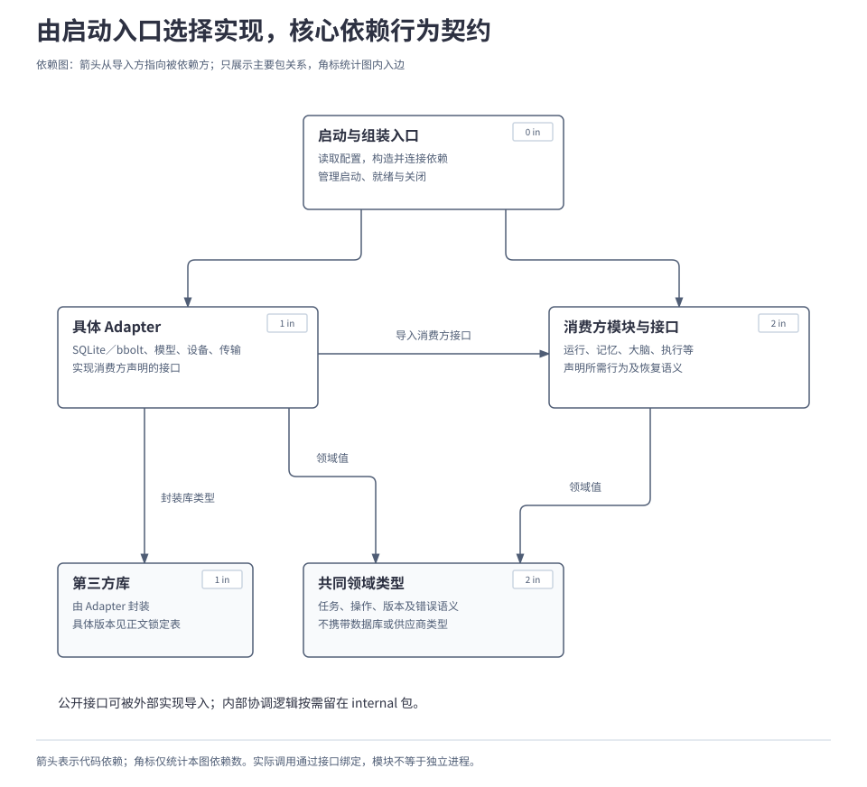
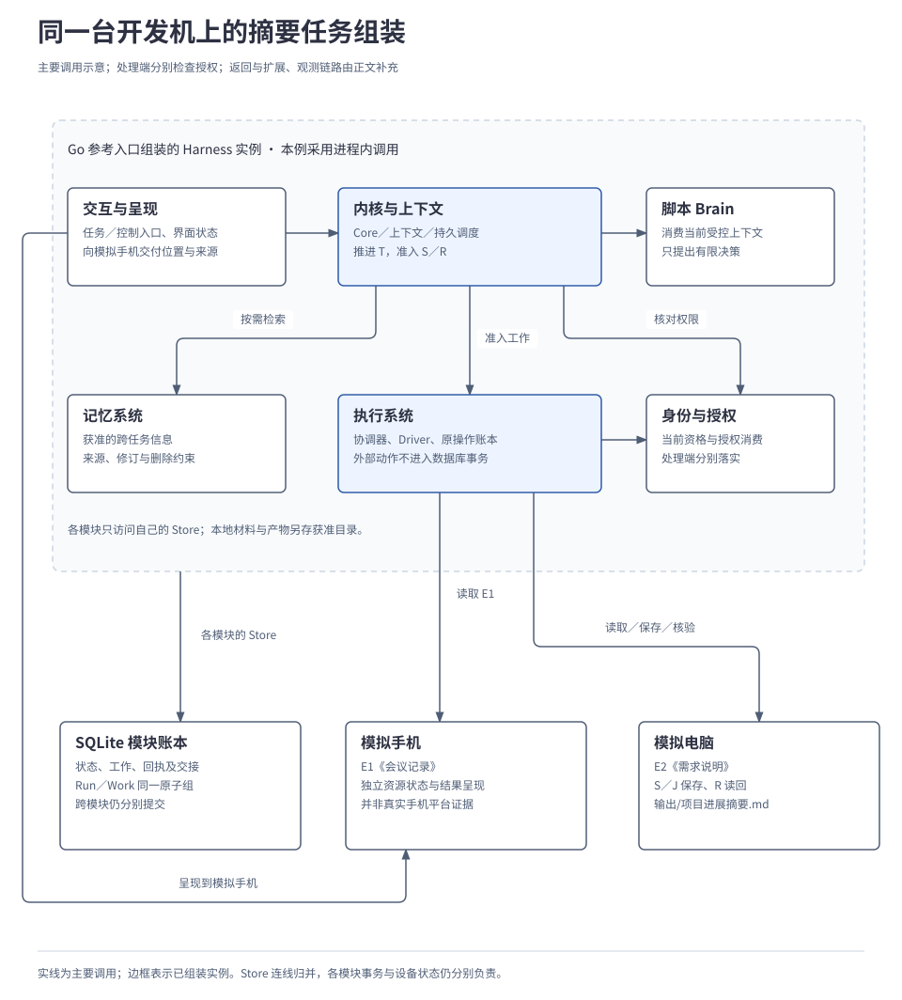

# 4.1 技术选型与开发组装

<a id="15-技术选型与开发组装"></a>

本章给出单机参考系统的组装方案：用 Go 入口连接内核、各子系统和 SQLite，先验证完整执行与恢复，再接入真实模型并验证独立替换。实现者据此确定依赖方向、启动关闭顺序及 SQLite 与 bbolt 的双向迁移条件。单机开发不要求独立基础设施服务，生产实现按同一契约另行装配。

Go 核心、SQLite 默认持久化、独立替换和双向迁移是已确认要求；下文包路径、组装顺序和代码用于说明工程落点，尚无对应实现或运行证据。生产部署与故障保障分别见[4.2 部署、存储与规模扩展](02-deployment-and-storage.md)和[4.3 故障恢复与运行保障](03-reliability-and-recovery.md)。

## 本章要解决的问题

单机参考系统要能真实跑通任务，也要能在更换实现后继续原工作。组装入口因此需要管理依赖、就绪、关闭和迁移，而模块接口必须承载失败与恢复语义。

| 关键选择 | 理由 | 需要承担的限制 |
| --- | --- | --- |
| Go 入口嵌入默认组件与 SQLite | 开发机无需先建设独立基础设施服务。 | 真实模型和网络来源仍按能力配置。 |
| 消费方声明行为接口，入口选择 Adapter | 替换供应商或存储时保留调用方契约。 | 原子性、未知结果和恢复也必须独立验证。 |
| 脚本夹具先固定运行行为，再接真实模型 | 能区分组装故障与模型判断质量。 | 脚本通过不能证明智能能力达标。 |
| 停写后进行逻辑迁移，切换唯一活动配置 | 原任务、消费账本和删除水位随同迁移。 | 迁移期间入口受限；目标有新写入后回切也要重新迁移。 |

下面先说明最小组成与依赖方向，再走启动、运行和关闭；独立替换通过后，用已准入但未派发的保存与读回操作检查后端迁移。

本章把摘要任务记为 T。局部验证例使用同一用户的有状态模拟手机与电脑，在开发机上分别保存 E1《会议记录》和 E2《需求说明》。权限允许所需处理、保存和读回摘要 D，并向模拟手机交付结果。先用脚本化大脑形成可重复决策，再接入真实模型。迁移例独立从保存 S 与读回 R 已准入、S 尚未派发的位置开始，此时没有外部作业 J。

## 1. 开发机上先接起什么

最初的组装用例完成本章定义的交付：读取 E1／E2，形成 D，异步保存 S，确认保存结果后读回 R，向模拟手机呈现文件位置与结论来源。资料内容保持一致：资料导入已验收，摘要导出仍在联调、尚未验收；摘要任务完成不代表项目已经通过全部验收。

| 组成 | 开发配置 | 要保留的行为 |
| --- | --- | --- |
| 内核与启动入口 | Go 库，由独立入口选择实现；默认进程内调用。 | 准入、授权、预算与恢复从首个任务生效。 |
| 持久化 | SQLite 文件和本地获准材料、产物目录。 | 重启保留任务、原操作、待处理工作及各模块账本。 |
| 记忆与上下文 | 本地记忆参考实现、上下文组装器。 | 只选取获准且适用的信息；资料不自动变成长期记忆。 |
| 大脑 | 教学夹具使用脚本 Brain，按当前上下文提出有限提案。 | 提案仍经内核准入；脚本不直接写任务状态或驱动设备。 |
| 执行与模拟设备 | API Adapter、执行协调器，以及各自有状态的模拟手机、电脑。 | 保存确实改变电脑文件状态，读回取得实际内容。 |
| 公共模块 | 身份授权、交互、扩展登记与观测。 | 处理端检查权限，呈现可核对，版本和事实可追溯。 |

单机完整运行无需独立基础设施服务。第三方 Go 库可以嵌入；真实模型可按条件接入本地或远程实现，联网问答需要实际网络来源。模型与来源依赖按能力配置表达，不能因此要求每位开发者先部署数据库、队列或工作流集群。

脚本组装用例用于检查连接和运行契约。完整参考系统仍需模型驱动大脑、各能力及专项验证；模拟手机上的任务提交和结果呈现，也不代替手机 GUI 的观察、动作、再次观察与效果核验。

## 2. 哪些包依赖接口，谁选择实现

如果内核公开参数里出现 SQLite 连接或某个模型供应商的响应类型，替换实现就会牵动调用者。设计因此由消费方声明所需行为，适配器（Adapter）实现接口，启动入口连接两者。接口须表达原子提交、失败和恢复等行为；只隐藏类型、却把这些责任留给调用者，仍无法独立替换。

下图只表示主要 Go 导入依赖。运行时由调用者经接口进入 Adapter，与代码依赖的方向分别理解；模块之间的细分依赖在各专题维护。

[](../../diagrams/15-package-dependencies.html)

消费方接口、领域类型和 Adapter 分别组织；启动入口选择实现并管理生命周期。可供外部实现的接口必须可导入，具体路径及生成消息的组织见[组装细则 A](../../reference/implementation-details.md#packages)。这些路径是拟议组织，尚非已发布 SDK。

例如，`RunStore.Commit` 一次提交任务状态、关联记录、工作与回执；运行存储 RunStore 和工作存储 WorkStore 由同一运行持久化单元实现。其他模块通过各自 Store 访问账本，共用 SQLite 文件不扩大为跨模块的共同事务。具体原子边界见[2.1 任务运行内核](../02-subsystems/01-runtime-kernel.md#3-把状态与后续工作一起提交)。

## 3. 启动和关闭怎样保留任务

组装完成后，模拟手机通过交互入口提交 T；内核准备上下文、调用 Brain，并将获准工作交给执行系统。执行系统分别访问两个模拟设备，保存和查询沿同一个 S 及其外部作业 J 进行。下图归并各模块自己的 Store 连接；扩展与观测的生命周期由后面的表格补充。

[](../../diagrams/15-local-assembly.html)

启动入口既要构造依赖，也要判断何时允许接纳工作。它先确认本节点当前启用哪一份存储配置，并取得对应的启动代次。代码中的“活动代次”用于区分先后的启动配置，配合共同维护屏障保持唯一活动入口、隔离旧进程。尤其在 SQLite 与 bbolt 切换后，旧进程不能继续使用旧库写入；任务 Owner 和操作身份则保持原样。

下面只示意启动顺序，省略具体构造参数。每一步均需检查错误，失败时撤销尚未开放的入口并关闭已取得资源，保留已经提交的业务记录。完整迁移过程在[第 6 节](#6-sqlite-与-bbolt-怎样带着原任务切换)展开。

```text
配置 = 校验配置、依赖锁与支持范围()
活动代次 = 确认唯一活动配置和维护状态()
存储组 = 打开并校验各模块持久存储(配置)
授权 = 恢复身份、策略及凭证引用(存储组)
实例 = 组装模块(存储组, 授权, 活动代次)
实例.加载已固定版本、恢复引用及原待处理工作()
实例.建立受控的结果接收与原操作核对入口()
实例.完成必要恢复核对和就绪检查()
实例.启动有界调度与后台处理()
实例.开放获准的新任务入口()
```

“必要恢复核对”要求当前活动配置、账本和处理资格明确；仍有外部效果未知的任务可以保留等待，并由已恢复的核对工作继续处理，不要求所有历史任务先完成。初次启动的空库与已有数据的重启分别处理，重启不会重新生成用户身份、清空授权消费记录或把旧任务作为新任务接纳。

| 生命周期阶段 | 启动入口和模块需要完成什么 | 留下什么依据 |
| --- | --- | --- |
| 准备依赖 | 校验格式、存储可用性、身份、凭证引用与支持配置；不兼容升级走受控迁移。 | 实际配置、存储格式、活动启动代次。 |
| 恢复与就绪 | 加载固定扩展、上下文与产物引用；重建所需索引和呈现；接起观测及恢复入口。 | 已恢复范围、缺失依赖、待核对事项；缺失索引不能报告无数据。 |
| 开放处理 | 合法领取工作，按当前权限、控制、期限和额度派发；新任务准入有界。 | 任务事实由所属 Store 保存，观测索引可重建。 |
| 受控关闭 | 停止新增准入和新派发，排空或按契约停止 Worker；保存未结工作，再关连接与存储。 | 迟到结果和未完成交接的恢复入口；外部在途占用继续保留。 |

关闭超时不证明设备动作已经停止。外部请求可能仍在运行时，保留原身份、查询依据和待交接责任；下次启动先核对。`context.Context` 结束只限制本次调用等待，用户取消由持久控制契约表达。迁移还需要比普通退出更严格的全范围停写屏障，见第 6 节。

## 4. 每种开发配置提供什么证据

同一份教学资料可以进入不同验证配置。夹具固定初始状态、允许效果及故障窗口，判定器从设备状态、文件和持久记录独立核验，不能照抄 Brain 的“已完成”声明。

| 配置 | 主要观察 | 证据边界 |
| --- | --- | --- |
| 脚本 Brain＋有状态设备 | 正式提案、授权拒绝、S／J 查询、R 读回、手机呈现和重启续跑。 | 证明组装与契约，不证明模型规划质量。 |
| 模型驱动 Brain | 从 E1／E2 形成符合事实、带来源的 D，并选择适用能力。 | 记录模型、配置和预算；一次成功不代表完整质量达标。 |
| 同机多进程 | 用既定 gRPC／WebSocket Adapter 验证断连、重复、取消与回执丢失。 | 与进程内共用业务断言，另测传输故障；不等于跨机部署已验收。 |
| GUI 模拟环境 | 结构树／图像观察、点击、滑动、输入、返回及接管后的实际变化。 | 保留独立专项用例；模拟通过不声明真实手机平台支持。 |
| 信息获取环境 | 固定资料重放与实际联网分别检查来源、时间、冲突和获取失败。 | 重放用于复现，联网证据必须来自实际获取。 |
| 持久化与故障夹具 | 提交前后退出、未知回执、磁盘满、旧 Worker、迁移中断。 | SQLite 和 bbolt 分别取证；内存替身只承担基础接口检查。 |

本篇选定的迁移夹具会在准入提交确认后保持派发闸门关闭，并检查没有发送保存请求。它证明“尚未派发”的具体起点；没有收到发送回执本身不能证明这一点。模拟器也应保留独立可核对的状态，Harness 重启测试不能顺手将设备重置为初始状态。

开发快速回归按改动选择共同契约和小型真实模型用例，报告覆盖范围。完整千级 API、联网问答、GUI 与个性化的质量判定由[4.4 评测、比较与发布](04-evaluation-and-release.md)和[4.5 实施路线与能力验收](05-roadmap-and-validation.md)承接。

## 5. 替换一个实现，怎样确认边界仍成立

接口能编译只是起点。被替换对象需要至少一个独立实现，使用共同输入与断言，观察授权、失败、未知结果和恢复行为是否仍成立；同一实现换两份配置不算独立替换。

| 替换对象 | 实际更换什么 | 必须保留的检查 |
| --- | --- | --- |
| Brain | 决策策略及其检查点实现。 | 消费受控上下文、输出有限提案；旧版本工作有可恢复实现或兼容迁移。 |
| Model | 模型接入与能力映射。 | 输入位置、结构化输出、错误和用量；更换供应商不等于更换 Brain。 |
| Memory | 记忆访问、组织与检索实现。 | 来源、修订、删除、权限和覆盖范围；换数据库不代表替换全部记忆策略。 |
| Execution | 执行接口后的实现；API Adapter、设备 Driver 也可分别替换。 | 准入、实际效果、原调用核对和接管；执行协调与持久账本责任继续成立。 |
| 持久 Store | SQLite 与独立 bbolt 实现。 | 原子组、条件提交、回执、快照、重启与迁移；内存实现不提供耐久性证据。 |
| 获取、传输与 UI | 搜索／内容获取、进程内／远程 Adapter、Renderer。 | 原来源与结果、业务语义、重复输入、独立界面和故障边界。 |
| 外部生态与治理 | MCP／A2A 对端、扩展运行器、评分与改进组件。 | 独立对端或一致性夹具、差异能力、授权与发布约束；不以自连代替互操作。 |

共同契约约束允许的输入、结果和失败行为，能力声明记录实现差异，不要求两种模型逐字生成相同文本。执行验证保留两种独立 API Adapter 与结构树、图像观察驱动；局部 Driver 替换和整个执行接口的替换按各自范围取证。

S／R 已固定的实现版本继续受[2.8 扩展与运行保障](../02-subsystems/08-extensions-and-runtime.md)的规则约束；激活新实现不能重绑旧操作，更不能靠重新询问模型判断旧动作是否发生。

## 6. SQLite 与 bbolt 怎样带着原任务切换

### 6.1 第二后端需要实现哪些责任

SQLite 保持默认；bbolt 用于验证核心脱离 SQL 后，仍能维持同一持久化契约。第二后端及双向迁移已纳入第三实施阶段 M3，范围覆盖所选完整配置需要的运行／工作、执行与资源控制、记忆、授权、界面、扩展及评测发布存储。完整阶段条件见[4.5 实施路线与能力验收](05-roadmap-and-validation.md)。

bbolt Adapter 必须完整实现条件提交、原子组、回执、删除水位与恢复，不能仅以文件事务替代这些契约。一个文件由一个读写进程持有，跨进程按需经受控 gRPC 访问；同步、I/O 故障和快照分页限制见[组装细则 B](../../reference/implementation-details.md#bbolt)。

### 6.2 从已准入、未派发的切点开始

本分支已经取得 E1／E2，生成的 D 保存在获准的恢复材料中。S／R 共同准入的提交已获耐久确认；测试闸门尚未开放 S 派发，R 依赖 S 成功。此时没有外部作业 J，电脑“输出”目录还没有本次摘要。受控停写进一步排空或隔离旧 Worker，冻结全部相关后台写入。

迁移包采用带格式版本、模块范围、内容摘要、恢复引用和水位的逻辑格式。全范围停写使各模块能一起取得可恢复切点，代价是相关入口在迁移期间需要拒绝新输入或等待补送。各模块仍保留自己的权威和原子组，以下记录都须在导入后核对。

| 切点上的记录 | 导入后必须保持什么 | 缺失会造成什么 |
| --- | --- | --- |
| T、S／R 与待处理工作 | 原身份、固定输入和版本、依赖、控制、期限、预算及提交回执。 | 任务丢失、重复创建保存，或绕过 R 的依赖。 |
| 模块间交接 | Inbox／Outbox、已接纳未应用工作、界面状态及动作路由。 | 丢失输入或重复接纳迟到消息。 |
| 执行与权限账本 | 原操作记录、资源屏障、授权消费／撤销、接纳窗口及资格依据。 | 将旧操作重新当作首次调用，或恢复已经失效的权限。 |
| 材料与生命周期 | 获准 E1／E2、D 的引用和来源修订、记忆墓碑、删除及同步水位。 | 无法续跑、来源错配，或让已删除内容重新出现。 |

即使本例没有 J，其他历史任务的执行账本也不能省略。凭证密文和密钥引用单独受控，主密钥不进入通用导出包；模拟设备状态、文件和大产物单独核对可用性，不会因换后端自动搬迁。导出不得扩大数据驻留与保留权限，目标格式无法保留必需字段时拒绝迁移。

| 阶段 | 具体动作 | 进入下一步的条件 |
| --- | --- | --- |
| 1. 停止新增工作 | 管理入口校验迁移权限并持久登记；关闭相关准入、派发和后台写入。 | 旧 Worker 已排空或按契约隔离，无法继续写入。 |
| 2. 固定持久切点 | 暂停入口交接，记录未应用消息、各 Store 水位及产物引用。 | 所有相关写入已停止，已提交内容可恢复。 |
| 3. 导出与导入 | 生成逻辑包，在未开放服务的 bbolt 目标库导入并重建索引。 | 格式、摘要、跨模块引用及恢复计划检查通过。 |
| 4. 完成耐久校验 | 持久保存导入结果、管理记录和产物清单；补足文件及适用目录同步。 | 目标完整可恢复，不能以复制函数返回代替耐久完成。 |
| 5. 切换唯一入口 | 在共同维护屏障下持久更新唯一活动配置与启动代次，确认旧进程不能按旧配置写入。 | 切换结果已确认；两个后端文件锁不能单独防止双写。 |
| 6. 核对并续跑 | 新入口检查原记录、当前控制、权限、时间、额度与恢复材料。 | 仍满足条件时领取原工作，首次派发原 S；确认保存成功后继续原 R。 |

目标启动后，执行模块为原 S 启动并记录 J，随后查询、核验和手机交付沿既有契约完成。任务 T、操作 S／R 不重建；启动代次用于隔离旧进程，不自动改变任务 Owner。迁移耗时照常经过，授权、期限和预算不能因导入而续期或清零。

### 6.3 失败和反向迁移怎样处理

停写窗口里的输入要按协议明确拒绝或等待补送；无法重放的第三方通知没有默认无损保证。恢复必须同时检查迁移记录与当前唯一活动配置。

| 情况 | 处理方式 |
| --- | --- |
| 无法排除旧写入 | 保持维护状态，不导出或切换；先解决未停止的 Worker 或后台任务。 |
| 切换前导入失败 | 不启用部分目标；确认源仍是唯一活动库后清理目标、恢复源入口。 |
| 切换提交结果不明 | 查询原迁移记录与活动配置，确认唯一入口；超时不授权两边同时启动。 |
| bbolt 已产生新写入，需要回到 SQLite | 再次停写，以当前 bbolt 为源执行完整反向逻辑迁移；不能直接启动陈旧的原 SQLite。 |
| 其他分支的 J 已在外部运行 | 保留原 S／J 关联、未知效果和占用，恢复后查询原作业；迁移不会停止或重建 J。 |

SQLite → bbolt 与 bbolt → SQLite 均需实际验证。测试覆盖每阶段中断、同步错误、引用缺失、旧 Worker、迟到回执和旧备份恢复，并检查切换记录自身可恢复。文件重新打开、目标记录条数相同，都不足以证明迁移成功；要验证原任务继续、无重复效果，以及授权和删除水位未回退。

本节范围是同一受控节点上的停写迁移。生产用户分片迁移见[4.2 部署、存储与规模扩展](02-deployment-and-storage.md)，备份之后的事实核对见[4.3 故障恢复与运行保障](03-reliability-and-recovery.md#6-从备份恢复为什么还不能立刻运行)。

## 7. 依赖和支持范围怎样锁定

能够复现组装，才有可比较的替换证据。下表沿用既有设计的参考基线；版本被选定不表示已经集成，也不表示其全部平台和协议能力都已获得支持。

版本清单集中在[组装细则 C](../../reference/implementation-details.md#versions)：保留 Go 最低版本、SQLite 默认、bbolt／Wasm 首个验证平台和 MCP／A2A／Skill 的既定配置。选定版本、完成集成与取得平台支持证据分别记录。

扩展模块路径、完整提交和格式快照见[附录 02 的固定兼容配置](../../reference/02-api-and-message-catalog.md#compatibility)，可替换接口见[组件目录](../../reference/02-api-and-message-catalog.md#component-interfaces)；差异映射与生命周期见[2.8 扩展与运行保障](../02-subsystems/08-extensions-and-runtime.md)。SDK 尚未覆盖的行为需要 Adapter 或明确记录的补丁补齐，并通过相应测试；运行中不能自动换成最新依赖。升级时先锁定候选、检查格式和旧绑定兼容，再运行共同套件与适用回归，最后受控激活。

数据库提供事务，协议库提供编解码和通信，运行器提供声明范围内的执行能力；任务准入、授权消费、未知效果、持久交接和恢复仍由 Harness 的实现负责。引入工作流引擎时也必须明确实现哪一层契约，不能让它与内核各自维护一份任务终态。生产 Adapter 按[4.2 部署、存储与规模扩展](02-deployment-and-storage.md)另行组装和取证，保持单机配置无需独立基础设施服务。

本篇整理自[Go 内核与本地持久化](../../../archive/architecture-v1/02-runtime-and-state.md)、[专项与迁移方案](../../../archive/architecture-v1/11-specialized-validation-and-handoff.md)及[设计约束](../../../archive/architecture-v1/00-design-constraints.md)。当前交付是文档、组装示意与验证入口，尚未运行 Go 参考系统、迁移或协议测试。

---

[上一章：3.4 端云协同与离线运行](../03-coordination/04-edge-cloud-coordination.md) · [正文目录](../README.md) · [下一章：4.2 部署、存储与规模扩展](02-deployment-and-storage.md)
