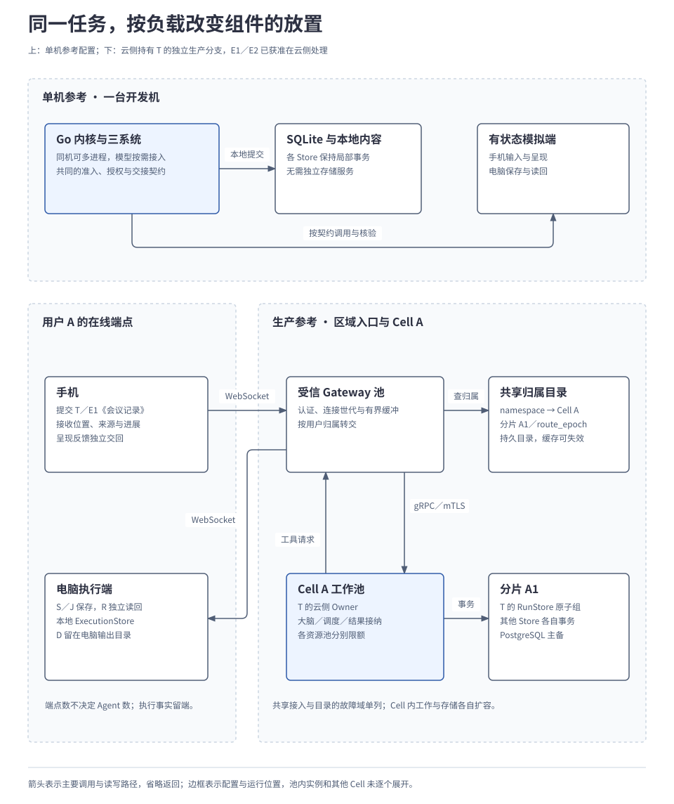
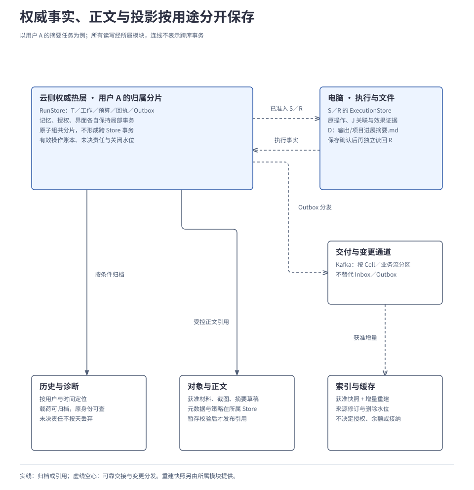

# 4.2 部署、存储与规模扩展

<a id="13-部署存储与规模扩展"></a>

部署方案将同一组逻辑职责放入不同运行环境。单机配置支持完整任务与恢复，生产配置还要承接大量用户的连接、决策、执行和存储负载。本章先说明部署单元与数据边界，再解释请求路由、容量推导、隔离与迁移；实例数须由各类实际负载计算，不能只从用户数推定。

千万注册、百万日活、十万同时在线和个人用户隔离是已确认目标。下文的生产组件组合、容量演算及高可用拓扑沿用现有设计建议，尚无实现、压测或故障演练证明。

## 本章要解决的问题

生产部署要把请求送到唯一的可写归属，同时分别承接连接、模型和存储负载。先确定路由与权威记录的放置，再计算容量；随后改变用户负载分布，判断限流、扩容和迁移边界。

| 选择 | 解决什么问题 | 代价或限制 |
| --- | --- | --- |
| 用户归属固定到区域、Cell 和分片 | 定位云侧可变数据，限制工作竞争和局部故障范围。 | 依赖归属目录，跨单元配额及迁移另需协调。 |
| 权威热层保存完整局部原子组 | 已接纳任务不会因拆库丢失后续责任。 | 一个原子组不能任意拆散，热用户可能需要整体迁移。 |
| 正文与可重建投影分层 | 避免领取工作时扫描大载荷，分开扩容与保留。 | 引用可读性、投影水位和删除传播必须维护。 |
| 封存源分区后再激活唯一目标 | 迁移期间保住唯一写入资格。 | 用户有有限停写窗口；封存后不能靠超时回退。 |

这里的选择是生产参考方案，须以同条件共享池对照和故障演练评估收益；不从 Cell 数量或副本数量直接推导容量与可靠性。

<a id="1-同一任务在两类配置中怎样放置"></a>

## 1. 同一组职责在两类配置中怎样放置

单机参考配置把完整运行所需的组件放到开发机，默认采用 Go 与 SQLite，不要求独立数据库、队列或编排服务。生产配置沿用任务、操作、授权和交接契约，把承载不同负载的资源分开部署。

| 责任 | 单机参考配置 | 生产参考方案 |
| --- | --- | --- |
| 运行与执行 | Go 内核与三系统；多个有状态模拟端，允许同机多进程。 | Task／Brain、执行、后台处理分别形成可限额、可扩容的工作池。 |
| 持久记录 | SQLite 与本地存储 Adapter。 | 按用户分片的 PostgreSQL；每个原子组完整落入一个事务分区。 |
| 连接与交付 | 进程内 Interface，按需使用 gRPC／WebSocket，持久 Inbox／Outbox。 | 长连接 Gateway 与可靠交付层分开；Kafka 承接区域内异步投递和变更分发。 |
| 正文与查询 | 本地文件和索引。 | 获准正文进入对象存储，检索索引和 Redis 缓存可以重建；受限内容继续留端。 |
| 部署与故障域 | 无需集群；模型及网络来源按能力接入。 | Kubernetes 等编排应用资源，数据库与控制服务另有高可用配置。 |

生产方案按用户分散数据，每份数据库分片承载一部分用户。相关分片、应用资源池和交付责任组成一个服务与存储单元（Cell）。一个用户的云侧可变数据默认归属一个区域、一个 Cell，分别称为 Home Region、Home Cell。

多个 Cell 分开领取业务工作，避免全部处理者竞争同一张全局任务队列表。代价是需要维护用户归属目录、跨单元配额和受控迁移；Cell 能否改善隔离与成本，仍须按第 5 节的方法比较。

下文用云侧推进任务说明生产路由。任务 T 从创建时由云侧 Owner 推进；用户允许 E1《会议记录》和 E2《需求说明》在本任务范围内进入云侧处理，并保留必要材料和恢复记录。电脑通过保存操作 S 与外部作业 J 写入 D《项目进展摘要》，R 独立读回，目标文件为 `输出/项目进展摘要.md`，手机接收位置与来源。这不包含长期记忆或其他用途许可，也不继承[原文留端示例](../../examples/04-edge-cloud-and-collaboration.md)的数据限制。

下图比较两种放置，并展开用户归属 Cell A 的生产路径。图中的工作池可以包含多个实例，目录和接入服务有独立的共享故障范围；实际实例数仍需测量。

[](../../diagrams/13-deployment-comparison.html)

模块数量不决定服务数量。初期可合部署 Task API 与监督逻辑、上下文与大脑；长连接、执行和后台批处理按资源或信任边界拆开。上图是配置对照，未描述在途 SQLite 数据迁入 PostgreSQL；同机 SQLite／bbolt 替换与迁移由[4.1 技术选型与开发组装](01-implementation-and-technology.md)展开。

<a id="3-手机请求怎样找到用户的任务"></a>
<a id="2-手机请求怎样找到用户的任务"></a>

## 2. 请求怎样找到用户的可写归属

<a id="31-先确定用户再查数据归属"></a>
### 2.1 先确定用户，再查数据归属

令正常提交摘要的用户为 A，其身份绑定作用域 `uA`；后文批量提交的用户 B 使用 `uB`。这两个值只是教学标记，客户端不能通过修改请求字段切换身份。

| 映射或资格 | 回答的问题 | 发生什么才会改变 |
| --- | --- | --- |
| 身份 → `namespace` | 本次请求属于哪个用户？ | 由可信认证结果绑定，不能用自报用户头替换。 |
| `namespace` → 区域／Cell／分片 | 用户的云侧数据在哪里？ | 归属目录记录 `route_epoch`，经受控迁移改变。 |
| 端点 → Gateway／连接世代 | 下行应交给哪个当前连接？ | 同一端点的连接更新；其他合法端点不被挤掉。 |
| T → Owner／`owner_epoch` | 谁有资格推进任务？ | 遵守任务拥有权规则；另有 Worker 领取代次约束每轮处理。 |

归属目录（NamespaceDirectory）先把用户映射到稳定的逻辑分组，称为**虚拟桶**，再查目录找到对应分片。需要单独安置的用户可以显式记录归属，覆盖默认的桶映射。一个路由版本内的桶数保持固定；增加物理分片时，通过受控迁移调整所选用户的归属和映射，避免机器数量一变，大量用户就随之换位置。

普通请求访问自己的归属分片；跨用户分析走另行获准的派生数据路径。

<a id="32-gateway-怎样安全地转交请求"></a>
### 2.2 Gateway 怎样安全地转交请求

生产方案采用登记的**受信代理 Gateway**，它终止客户端连接，再以服务 mTLS 连接后端。因此需要在原身份与实际转交者之间建立可验证关联，不能只透传一个 `X-User-ID`。

Gateway 必须验证原主体，并把原授权约束绑定到实际代理和目标服务；后端再核对持有者及当前动作权限。客户端自报用户头不能成为身份，换网关或证书也不能沿用不匹配的代理材料。节点与浏览器入口的认证条件、直连替代路径见[部署细则 A](../../reference/deployment-details.md#gateway)。

<a id="33-接收推进与手机交付分别在哪里完成"></a>
### 2.3 接收、推进与手机交付分别在哪里完成

1. 手机连到 Gateway，完成认证与协议协商；持久会话登记保存新连接世代，在线缓存只加速定位。
2. Gateway 将 A 的请求送到 Home Cell 的可靠接收与业务入口。可靠消息落盘后才报告 `PERSISTED`；Task Core 提交 T 和后续工作后才报告 `ACCEPTED`。
3. 工作池从 A 的归属分片领取工作，云侧生成 D 并准入 S／R。电脑在自己的 ExecutionStore 保存执行事实，沿原 S 查询 J；确认保存效果后再执行 R。
4. 云侧接纳执行结果，持久保存交付责任。交付层按当前权限和登记订阅找到手机，手机呈现反馈再交回；网关发出消息并不证明任务已经完整交付。

Gateway 只保留有界缓冲。可靠输入、控制和结果由持久交接负责；进度投影可按版本合并，token 预览、心跳等临时流按契约丢弃，不占用可靠流序号。离线和慢客户端通过限额、补读或快照恢复，大正文用受控引用／分块；同用户在线不授权向全部窗口广播内容。游标绑定作用域、视图、世代和保留窗口，重放仍检查当前权限，详见[3.4 端云协同与离线运行](../03-coordination/04-edge-cloud-coordination.md#4-连接中断后哪些消息需要补齐)。

增加网关主要承接新连接，已有长连接不会自动均摊；缩容先停接新连接，再有界排空。重连需抖动，并分别限制握手、快照、未决操作查询和新任务，避免恢复流量同时穿透目录与数据库。连接数与数据库连接池独立计算，不能一条客户端连接占一个数据库连接。

<a id="4-哪些数据必须一起存哪些可以分层"></a>
## 3. 哪些数据必须一起存，哪些可以分层

<a id="41-先保住原子组"></a>
### 3.1 先保住原子组

如果 T 已接纳 S，却把“待执行 S”写到另一数据库后失败，任务就可能失去后续入口。因此，[2.1 任务运行内核](../02-subsystems/01-runtime-kernel.md)定义的运行原子组必须完整位于同一事务分区；物理分片不能拆开它。

| 责任边界 | 必须一起保存的关键内容 | 本例中的位置 |
| --- | --- | --- |
| T 的 RunStore／WorkStore | Owner 与版本前提、状态、操作映射、持久工作、任务预算、回执及必要 Outbox。 | A 的云侧归属分片。 |
| 执行与相关资源控制 | 原操作、输入与资格、许可消费、启动准备、执行状态和结果交接。 | 电脑本地 ExecutionStore；J 与实际文件仍由执行端核对。 |
| 记忆、授权、界面 | 各自修订与准入前提、操作回执、必要变更及交接记录。 | 各所属 Store；云侧可共用用户分片，各自保留局部事务。 |

同库不授予模块直接修改其他 Store，也不扩张跨模块事务。用户总额度与分给 T 的额度通过稳定操作交接；云侧记录和电脑上的执行记录同样分别提交。模型调用、工具动作及远程模块调用始终在本地事务之外。

<a id="42-热层留下推进与核对依据"></a>
### 3.2 热层留下推进与核对依据

下图区分直接负责当前事实的存储（权威热层）、持久历史和正文，以及可重建的查询副本（投影）。电脑上的文件 D 与执行事实仍留在电脑。所有读写经所属模块授权和提交，图中的连线不表示跨库事务。

[](../../diagrams/13-storage-layers.html)

| 数据层 | 主要访问与保存方式 | 清理或重建的条件 |
| --- | --- | --- |
| 权威热层 | 按用户和稳定对象键查当前状态、未决工作、预算及有效操作回执；工作扫描只看可处理集合。 | 责任未结清不能删掉唯一恢复依据；关闭接纳窗口后仍保留拒绝旧请求所需水位。 |
| 历史与诊断 | 在用户物理分片内按时间组织追加记录；历史载荷可归档，原操作仍可定位受控结果。 | 同时满足恢复、评测和隐私保留要求；过期明确报告，不能把“查不到”当成首次操作。 |
| 对象与正文 | 获准附件、截图、任务材料或摘要草稿；所属 Store 保存版本、摘要、策略与可见引用。 | 暂存并校验可读性后，事务发布引用；孤儿、对象历史版本和备份分别清理。 |
| 消息交付层 | Inbox／Outbox 保存交接责任；Kafka 按 Cell、业务流和稳定聚合键分发。 | 消费允许重复；消息保留期不能令未完成交接丢失唯一载荷，不提供外部效果的恰好一次保证。 |
| 索引与缓存 | 从获准快照和增量重建，记录来源修订及覆盖水位；Redis 也可缓存在线位置。 | 不独自决定权限、余额、拥有权或操作接纳；旧变更不能覆盖新删除，缓存命中仍复核权限。 |
| 控制数据 | 身份绑定、归属目录、会话世代及管理配置有独立持久权威。 | 缓存可重建，路由激活和资格签发不能仅由缓存决定；控制面故障范围单列。 |

用户分片用于分散负载，时间分区用于控制单库历史体积，两者不能代替操作去重。假如昨天已接纳的保存请求今天再次送达，而接收方只检查今天的新表，就可能把原请求误当成新操作。

因此，参考布局让有效操作账本和窗口关闭水位保留稳定唯一键，在完整恢复窗口内核对原操作；历史载荷再按时间分区，并按各自条件清理。即使任务跨天，T、S 和原提交身份也不改变。

核心状态、版本、期限、领取信息及用量采用明确列，动态内容放有 Schema 的载荷；大段模型输出和截图用受控引用，避免为领取工作扫描正文。列表采用作用域内的稳定键集分页，待处理工作使用适用索引；具体索引、查询计划、锁等待和写放大需要实测。

接纳回执、未决操作核对、当前权限／额度和变更准入读取权威事实。允许滞后的列表可读副本，但需标明版本或覆盖；副本缺记录不证明未接纳。提交后的进度读取应满足指定版本或转权威读，避免把旧进度呈现成回退。

<a id="2-怎样把用户规模换算成实际负载"></a>
## 4. 怎样把用户规模换算成实际负载

十万在线可能大多在看进度，也可能集中发起新任务。连接、活跃任务和正在调用模型的数量因此需要不同输入。

| 资源 | 主要推导关系 | 还要计入什么 |
| --- | --- | --- |
| 连接与下行 | 在线用户 × 每用户同时连接端点数。 | 每连接的逻辑流、消息扇出、带宽、缓冲、认证及重连；逻辑流不必各占物理连接。 |
| 任务与持久工作 | 日活 × 每人每日任务数；峰值任务率 × 平均活跃时长估算活跃状态。 | 等待、长尾、每任务操作及提交次数；等待任务不各占一个常驻 Worker。 |
| 模型与执行 | 峰值任务率 × 每任务调用数；调用率 × 平均占用时长估算并发。 | 模型请求／token 配额、设备串行限制、查询与核对、费用及未知占用。 |
| 数据库与正文 | 各类业务率 × 每项实际提交数；每日新增量 × 保留期 × 放大系数。 | 索引、WAL、副本、备份、存量、迁移余量，以及 UI、记忆、授权和消息更新。 |

以下教学演算用于估计负载量级：假设百万日活，每人每日发起 5 个顶层任务，峰值系数 10，基准无委派，每任务 3 次模型调用，每次平均占用 8 秒。子任务、后台处理和恢复另算增量；这里的行为参数均不是实测或默认配额：

```text
每日任务 = 100 万 × 5 = 500 万
峰值任务率 = 每日任务 ÷ 86,400 × 10
           ≈ 579 / 秒
峰值模型请求率 = 峰值任务率 × 3
               ≈ 1,736 / 秒
模型在途量 ≈ 1,736 × 8 ≈ 13,900
```

最后一步只是在稳定负载和相应平均占用时长下的估算，突发、排队与长尾需单独测量。它已经足以说明：增加接入网关无法补足模型配额，十万连接也不意味着十万模型并发。

实例数量要用实测容量倒推。例如网关数量的下界取决于“连接总量 ÷（单实例容量 × 目标利用率 × 故障后存活比例）”，并同时满足带宽、TLS、内存和消息速率限制。数据库分片还要满足持续写入、热索引、锁等待、复制带宽及恢复扫描上限，不能只按存量字节数切分。

存储预算分别累计各数据族的每日增长与有效保留期，再加入副本、索引、备份和迁移余量。未决工作不能为凑预算而按固定天数删除。完整逐项演算、端云分账与参数来源见[附录 04：容量演算与存储预算](../../reference/04-capacity-model.md)。

## 5. 热点用户出现后，怎样隔离与扩容

现在加入用户 B：他批量提交独立摘要任务，每项有自己的资料、输出文件、操作身份和授权，不并发覆盖 A 的 D。A 仍只提交正常摘要请求。B 的任务多只是压力信号；先看队列年龄、模型额度、写入、锁等待和存量，才能判断瓶颈在哪里。

### 5.1 先控制竞争，再扩对应资源

| 观察到的压力 | 先落实的控制 | 对应扩容及其限制 |
| --- | --- | --- |
| B 占满待运行队列 | 按用户限额，先轮转／加权选择用户，再按该用户任务优先级领取。 | 工作池有余量且下游可承载时增加 Worker；不能解决数据库热写或电脑串行限制。 |
| 长连接、缓冲或重连过多 | 限制每端缓冲和未确认字节，分别限流握手、补读与新请求。 | 扩 Gateway，仍受带宽、认证与下行扇出约束。 |
| 模型请求或 token 额度不足 | 用户 → Cell → 区域／供应商分层准入，明确排队、限额或拒绝。 | 模型配额与费用另行安排；更多连接或 Worker 不增加供应商额度。 |
| 单个用户持续占用热分片 | 先限制该用户增长，观察写入、锁等待、热索引与恢复积压。 | 可迁到独立分片／Cell；一个任务、集合或资源控制原子组不能任意拆散。 |
| 后台或恢复挤占交互资源 | 交互、后台记忆／评测、控制／核对分别留有界处理能力。 | 恢复和新流量共同计入余量，避免刚恢复又过载。 |

持久用户账本是额度权威，可向任务或节点预分配有限额度。上游先保留，下游按原分配消费和结算；多副本失联时不能各使用完整余额。超时、断连或 Worker 租约到期不自动归还未知费用与仍可能占用的并发槽。Redis 快速限流只用于减压；无法取得保守消耗上界时，费用只能报告估算与待结算。

工作领取使用短事务，当前任务控制、Owner、版本、额度和领取条件一起裁决；过期 Worker 的完成提交同样受条件校验。行锁跳过等实现手段仅缓解队列竞争，不能替代持久领取或证明旧外部调用已停止。生产派发还须满足下一节的耐久条件。

已经受理的工作保持持久责任；队列到达上限时停止扩大新接纳，未落盘的请求明确背压或拒绝。目标执行预算耗尽不能封死取消和核对入口。Kafka 投递故障时可恢复扫描，不能按千万用户建立千万主题，也不能随机拆散热点聚合后继续宣称保持其顺序。

### 5.2 用户隔离要贯穿整个数据路径

用户范围贯穿数据库键、对象引用、候选检索、缓存、订阅和 Worker 临时状态；路由找到数据不等于获准读取。每次写入还检查分区可写状态与路由世代，资源及用途授权仍由应用落实。数据库行级安全、连接池和逐层核对要求见[部署细则 B](../../reference/deployment-details.md#isolation)。

Cell 能缩小局部积压和事故影响，但共享身份、目录、模型供应商与区域网络仍可能影响多个 Cell。需在相同资源和故障余量下比较共享池与 Cell：健康用户延迟、受影响范围、迁移停顿及每成功任务成本。共享池已经满足目标且成本更低时，可以保留更简单的部署。

## 6. 怎样保护生产记录并迁移用户分片

### 6.1 副本保护原分片，新增分片承接新容量

生产验证建议在区域内三个可用区分散应用副本，每个数据库分片一主两备；PostgreSQL、Patroni 与 etcd 是自托管 HA 参考组合，托管替代也需同等证据。副本复制同一分片的数据，不构成新的业务分片；etcd 管理 HA 仲裁，不保存任务或用户正文。

关键提交须达到规定的跨区同步耐久条件。同步副本条件不足时停止相应新写入；提升候选必须具有所需记录，旧主必须可靠隔离。三副本不保证任意两个故障仍可服务，三个可用区也不直接等于已达到 RPO=0。

扫描到记录不一定证明它已满足对外派发所需的耐久性：记录可能在主库可见，却尚未取得规定的复制确认。工作领取、Outbox 发布、执行启动与未知提交核对，需要由存储 Adapter 建立相应耐久确认；确认不明时不开放新的外部动作。具体屏障、旧主隔离及切换窗口由[4.3 故障恢复与运行保障](03-reliability-and-recovery.md)完整解释。

跨区域默认不采用同用户多主。异步灾备按实际滞后报告数据损失窗口，切换前隔离旧区域，核对可能丢失的操作、预算、撤销和删除记录；不能用旧备份直接恢复执行资格。区域内结论也不能充当跨区域 RPO／RTO 的证据。

### 6.2 热点用户怎样有限停写地搬迁

如果监测确认 B 的用户分片需要迁移，先固定唯一目标与新的 `route_epoch`。迁移只让 B 的云侧数据暂时停写，其他用户继续按自己的条件服务。`route_epoch` 更新数据归属，不自动增加任务的 `owner_epoch`；更换 Worker 也不重新创建任务。

| 阶段 | 源分区和控制面做什么 | 目标何时可以处理业务 |
| --- | --- | --- |
| 准备 PREPARE | 记录迁移，停止 B 的新接纳、新调度及新资格签发，排空或挂起各 Store 后台写入。 | 只准备资源，尚不可运行。 |
| 静止 QUIESCE | 建立各原子组稳定边界，复制检查点、原操作、预算、控制、修订／墓碑、界面、Inbox／Outbox、回执和水位。 | 校验各 Store 检查点与摘要，尚不可运行。 |
| 封存 SEALED | 持久化源分区不可写栅栏，核对所有路径拒绝旧世代；封存提交不明先查询。 | 没有源封存证据，不能激活。 |
| 激活 ACTIVATE | 目录按预期版本条件更新，绑定唯一目标和新世代。 | 验证目录绑定、源封存和完整检查点，持久激活后才恢复处理。 |
| 核验与清理 | 对账原操作及交接，旧路由拒绝或重定向；经过恢复保留期后清理旧副本。 | 按当前权限、控制和资格继续原工作，保留尚未核清的事项。 |

暂停 Scheduler 还不够：Memory 修订、UI 输入、异步执行结果和其他后台写入都必须纳入静止与封存。冻结期间到达的可靠消息，由明确的持久缓冲承接并纳入交接，或在尚未接纳前返回暂不可用；不能在复制边界之后继续遗漏写入旧分区。

若 B 的一个保存作业仍在电脑运行，搬云侧分片不会停止、搬走或重新创建那个作业。迁移保留原操作和外部关联，结果交到新位置后继续核对。不能证明旧执行资格已停止发起新动作时，不重新发放资格；端侧私有内容和独立 Owner 也不随云分片搬迁。

目录更新只是路由变化，真正阻止旧写入的是各存储路径都执行的持久栅栏。封存前可按证据安全中止；封存后不能因为超时解封。激活回执丢失时查询或补投同一次迁移、同一目标。目标已经产生新写入后，回退也是一次新的迁移，不能重新打开旧快照。

## 7. 怎样证明部署方案满足目标

同一候选版本和拓扑需要同时接受正常负载、热点与故障叠加验证。仅测连接保持、单表写入或实例重启，不能证明完整摘要任务仍可交付。

| 验证方向 | 必须留下的证据 |
| --- | --- |
| 规模与容量 | 千万账户元数据、百万日活对应日轨迹、十万在线及多端放大；混合运行任务、记忆、UI 和恢复，报告吞吐、队列年龄、分位时延、资源和费用。 |
| 隔离与公平 | A 正常请求与 B 突发并行；验证数据库、对象、检索、缓存、消息和 Worker 不串用户，健康用户不被持续饿死，合法多端仍可协作。 |
| 交付与过载 | 慢消费者、网关缩容、批量重连、消息重放／不可用和缓存清空；已受理责任仍可恢复，未受理请求明确拒绝或背压。 |
| 数据与迁移 | 对象发布失败、索引滞后、来源删除，以及各迁移阶段中断；仅一个有效可写分区，原操作、额度、墓碑与水位可核对。 |
| 故障与业务连续性 | 丢失可用区、数据库切换和旧 Worker 迟到；原任务保留已完成步骤，未知效果不盲目重做，记录首次有效推进与最终交付。 |
| 成本与运维 | 同资源比较共享池与 Cell；提供可复现配置、表与索引迁移、保留策略、告警、备份恢复和已知不能自动恢复的范围。 |

现有生产设计提出的局部时延建议是：正常在线、单区域、额度可用且未触发背压时，提交至 `ACCEPTED` 的 P95 ≤ 300 ms，业务提交至网关发出更新的 P95 ≤ 1 s。它们尚未成为实测 SLA；排队、模型、外部执行和公网端到端耗时要完整另报，不能用网关发出时间代替用户交付时间。

本篇整理[生产部署与存储](../../../archive/architecture-v1/13-distributed-deployment-and-storage.md)、[局部原子组](../../../archive/architecture-v1/12-data-path-and-protocol-semantics.md#2-原子提交组与跨组交接)、[高可用参考](../../../archive/architecture-v1/14-distributed-recovery-and-operations.md#4-数据库自动切换的参考配置)和[隔离收益的对照方法](../../../archive/architecture-v1/review.md#claim-scale)。组件版本、实际配置及容量上限仍须在实现与验证中锁定；文档和图示检查不构成生产放行。

---

[上一章：4.1 技术选型与开发组装](01-implementation-and-technology.md) · [正文目录](../README.md) · [下一章：4.3 故障恢复与运行保障](03-reliability-and-recovery.md)
