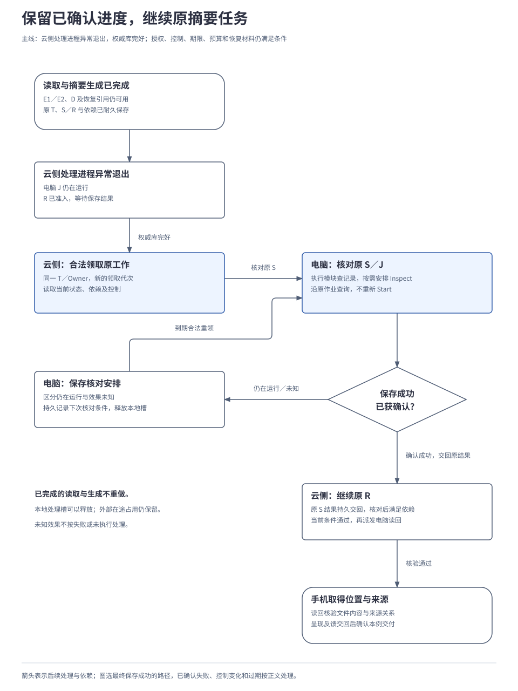
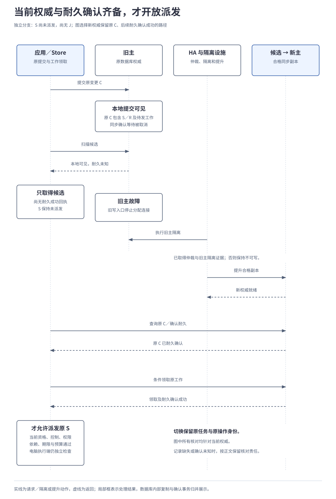

# 4.3 故障恢复与运行保障

<a id="14-故障恢复与运行保障"></a>

故障恢复先恢复合法推进资格，再核对持久记录和原外部操作，最后允许符合当前条件的工作继续。基础设施、业务状态和外部效果各有证据，重启成功或数据库可写都不能直接证明任务恢复。本章依据生产部署的存储与故障域，分别讨论进程退出、数据库切换、集中恢复及旧备份。

持久运行、原操作核对和用户控制是已确认要求；下文的生产恢复控制器、高可用组合与耐久屏障沿用现有设计建议。尚无实现、故障演练或恢复时间实测；单机开发仍采用 Go 与 SQLite。

## 本章要解决的问题

故障后首先恢复合法的推进资格，再核对原提交和原操作，最后决定哪些工作可以继续。进程重新启动、数据库重新可写和用户取得成果，需要不同的证据。

| 关键选择 | 为什么采用 | 代价或适用边界 |
| --- | --- | --- |
| 从持久业务记录恢复 | 已完成步骤、原操作和后续责任跨进程保留。 | 依赖材料、固定实现和核对依据仍可用。 |
| 恢复协调只安排流量，各模块核对自己的事实 | 同一故障不触发无界重复探测，也不新增业务写入权威。 | 协调状态本身需要持久保存与接手。 |
| 对外派发前取得耐久确认 | 主库可见不必然表示规定的复制条件已满足。 | 增加确认与等待；同步条件不足时停止相应新动作。 |
| 旧备份隔离恢复 | 防止遗漏后来发生的消费、撤销与删除。 | 证据缺失的范围不能立即重新执行或披露。 |

<a id="2-谁恢复连接谁决定任务可以继续"></a>
## 1. 先区分基础设施恢复与业务恢复

实例恢复、数据库可写、原任务推进和用户取得结果，是不同的事实。生产恢复需要让各层完成自己的责任。

| 层次 | 负责者与动作 | 完成这一层后仍需核对什么 |
| --- | --- | --- |
| 实例与连接 | 编排系统重建实例；Gateway 和客户端恢复认证、连接世代及受控订阅。 | 当前业务权威、原操作和披露权限；重连不转移 Owner。 |
| 数据库高可用（HA） | HA 管理器依据仲裁、复制完整性和旧主隔离证据切换数据库角色。 | 当前任务资格与外部效果；数据库切换不证明动作尚未发生。 |
| 持久工作 | Scheduler 与模块恢复扫描器条件领取、查询原提交、补交可靠消息。 | 当前控制、预算和执行前提；领取租约过期不证明旧调用已停止。 |
| 业务效果 | Core、执行、记忆和交互等原负责模块核对事实并提交业务更新。 | 任务要求与真实结果；连接、消息回执和模型声明不能单独证明完成。 |

大量任务可能因同一依赖失效而同时受阻，因此生产设计建议增加恢复协调职责（RecoveryController），在预先配置的运维权限内归并故障、限制流量并调用模块恢复接口。集中安排恢复可以限制重复探测和恢复流量，但控制器自身也要持久保存进展，供接手者继续处理。

控制器只保存故障范围、策略修订、恢复阶段、领取代次、扫描游标、下次检查时间和证据引用。业务状态仍归原模块，数据库角色仍由 HA 管理器管理。

控制器按检测、限制影响、建立权威、核对、分批续跑和核验退出推进。这些是运维阶段，不新增任务状态；接手者从持久阶段继续，各模块也能独立找回未决责任。逐阶段结果、竞争领取及控制器故障规则见[恢复细则 A](../../reference/recovery-details.md#controller)。

<a id="1-处理进程退出后摘要任务从哪里继续"></a>
本章的局部进程故障例中，任务由云侧推进，两份资料《会议记录》《需求说明》获准在本任务范围内进入云侧处理。电脑负责保存与读回摘要，文件在 `输出/项目进展摘要.md`，手机接收位置和来源。权威数据库完好，原材料、固定实现与核对依据仍可用，当前授权、控制、期限和预算允许继续。数据库故障在后文从“保存请求尚未派发”另起分支。

<a id="2-处理进程退出后摘要任务从哪里继续"></a>

## 2. 进程退出后怎样恢复原任务

故障发生时，两份资料已读取，摘要已生成，获准的恢复材料仍然保留。保存与后续读回已经共同准入；电脑上的保存作业还在运行，读回等待保存结果确认。此时云侧处理进程异常退出，新的 Worker 需要接着处理原任务。

下表和后续图沿用原有引用：T 是任务，E1／E2 是两份资料，D 是摘要，S 是保存操作，J 是电脑执行的外部作业，R 是读回操作。电脑已经持久保存 S 与 J 的关联。这里讨论进程故障；等待期间正常结束一轮 Worker 工作的过程见[2.1 任务运行内核](../02-subsystems/01-runtime-kernel.md#4-等待中的工作怎样再次被处理)。

| 恢复依据 | 已留下什么 | 恢复者据此做什么 |
| --- | --- | --- |
| 云侧 RunStore | T 的当前版本、已准入 S／R、依赖、等待项、控制、预算和待处理工作。 | 合法领取原工作；保留已完成的读取与生成，继续等待或接纳 S 的结果。 |
| 电脑 ExecutionStore | S 的固定输入和实现版本、原 J、执行阶段、核对安排及结果交接记录。 | 执行模块沿 S／J 查询和报告；不因云进程退出而再次启动保存。 |
| 获准材料与产物引用 | E1／E2 的来源修订、D 的内容或可恢复引用，以及适用的数据策略。 | 检查内容仍可用、可使用；缺失或失效时明确阻止依赖它的后续工作。 |

新 Worker 从同一权威库取得当前领取资格，恢复的仍是 T。它通过电脑执行模块的 `GetInvocation(S)` 读取已记录状态，必要时以 `Reconcile(S)` 安排核对；电脑自己的执行协调逻辑再沿 J 调用 Driver 的 `Inspect`。云侧不会越过执行模块直接操作私有 Driver。

下图选择 J 最终保存成功的续跑路径，并展开仍在运行或效果未知时的等待；若已确认保存失败，则按失败事实处理，不进入读回成功分支。

[](../../diagrams/14-task-resumption.html)

电脑确认保存成功后，持久保存原结果与报告 Outbox；云侧幂等接纳事实，满足依赖后才派发原 R。读回核验文件及来源关系，再完成手机交付。原 J 若无法核对，保留效果未知；已有报告若仅未送达，补交原报告即可。查询、结果披露和后续动作仍各自检查当前权限。

这条路径依靠可恢复的业务进度，不需要保存进程栈或模型生成的每个 token。更换 Worker 不改变任务 Owner；外部作业占用的配额也不随本地处理槽释放。各 Store 保持自己的事务，跨 Store 仍通过原操作及 Inbox／Outbox 交接。

## 3. 不同阶段的工作怎样恢复

恢复扫描首先判断“原工作走到哪里”，再决定查询、交接还是安排后续动作。提交结果未知查原 `change_id`，调用或效果未知查原 `operation_id`，不能用一次连接超时替代这个判断。

| 先确认的不确定性 | 查询谁、查询什么 | 什么证据允许继续 |
| --- | --- | --- |
| 本地准入是否提交 | 所属 Store 的原 `change_id`。 | 原提交及当前耐久条件已确认；未查清不派发。 |
| 请求是否已启动、效果是否成立 | 执行模块的原 `operation_id` 和外部关联。 | 实际效果支持后续依赖；仅有准备记录不重做。 |
| 结果是否已纳入任务 | 原报告、Inbox 消费和后续工作。 | 原子消费完成；只缺交接则补交，不重复动作。 |

模型生成、等待输入、子任务和 GUI 中断的逐阶段恢复要求见[恢复细则 B](../../reference/recovery-details.md#stages)。

作业仍在运行时等待依赖；效果未知时保留 `RECONCILIATION` 核对等待。只有所有可调度分支都受阻，任务主状态才为 `WAITING`；仍有可运行分支时可以保持 `RUNNING`。原有输入、授权及用户暂停等条件继续保留，恢复过程不能用一个笼统的“重试中”覆盖这些差别。

权威数据库不可写期间，系统无法提交新的 `WAITING`。查询端展示最后已确认版本，并标注陈旧性和依赖不可用；权威恢复后再逐项核对。子任务失联同样不能被父任务当作已确认失败向上级联。

恢复后仍按原规则判定终态：确认目标无法完成、必要在途处置结束且关键效果核清，才可记为 `FAILED`；取消也须依据实际停止与效果事实收尾。旧 Worker 的迟到提交不能绕过当前资格，但带来源的效果证据仍可由当前负责者接收核对。完整状态规则见[2.1 任务运行内核](../02-subsystems/01-runtime-kernel.md)，执行与取消边界见[2.4 能力与执行](../02-subsystems/04-tools-and-devices.md)。

## 4. 数据库恢复后，什么条件下才允许派发

### 4.1 为什么查到记录还不够

这里另起一条分支：云侧提交包含 S／R 和派发工作的准入变更 C，S 尚未发往电脑，因此还没有本次 J。事务在主库本地已提交，等待同步复制确认时被取消；扫描器能看到记录，但调用者尚未取得耐久确认，此时主库故障。

在这个窗口中，本地主库可见的记录可能尚未复制，提升副本后可能消失；开启严格同步模式仍须处理这一限制。[Patroni 复制模式说明](https://patroni.readthedocs.io/en/latest/replication_modes.html)明确记录了同步确认期间取消的情况。

因此，存储 Adapter 要在对外动作之前确认原记录已达到部署声明的复制持久性，这个条件称为耐久屏障。确认必须绑定原记录的语义、版本和当前权威，不能由进程里一个“已读到”的标记代替。它会增加等待或确认提交的开销；同步条件不足时，系统须等待，不能先派发再补证据。

| 取得工作的路径 | 何时才具有相应的耐久依据 |
| --- | --- |
| 正常提交返回 | 所要求的同步提交成功返回后，才报告耐久成功并开放后续处理。 |
| 扫描得到工作、Outbox 或启动准备 | 在同一权威数据库、当前写入资格下完成条件领取或确认事务，并等待其同步耐久成功。裸查询只得到候选。 |
| 原提交未知，`LookupCommit` 已找到记录 | 将确认与原记录的语义及版本绑定，在同一权威数据库上完成后续耐久确认。确认仍未知就继续返回未知，角色变化后重新查询当前权威。 |

以第三种路径为例：恢复者已经在当前权威库找到原准入变更 C，缺少的是它达到复制耐久条件的确认。Adapter 核对 C 的语义和版本，在同一权威库、当前写入资格下完成一个小型确认事务，并等待该事务满足所要求的同步耐久条件。确认结果仍未知时，保存 S 继续等待；数据库角色改变后，重新向当前权威核对。

参考方案利用**预写日志（WAL）**的顺序，让后续确认事务为它所依赖的原记录建立耐久依据，这称为 WAL 顺序屏障。确认与原记录的绑定、日志顺序及复制条件都须由 Adapter 实现并通过故障试验验证；任意一次查询或另一数据库上的写入不能提供这项保证。

下面只示意扫描后的派发路径，省略消息编码和完整权限字段；中文函数是行为说明，不是新增 SDK。条件领取同时校验记录版本、当前 Owner／领取代次、控制、依赖及适用额度。

```text
尝试派发(候选工作):
  读取当前权威及原工作
  条件领取，并提交耐久确认
  若提交结果未知:
    用原 change_id 核对并建立耐久确认
  若尚未确认成功:
    保留核对责任，结束本轮
  若当前派发条件不满足:
    记录原因，结束本轮
  在事务外交付原 operation_id 的工作
  接收端再按自身契约检查、接纳或核对
```

领取和耐久成功不授予永久执行资格。真正开始动作前仍要检查当前权限、控制及适用资格；已发出的请求依旧需要效果核对。屏障只解决记录的复制耐久性，不能证明外部动作尚未发生。

### 4.2 旧主隔离、提升和业务核对怎样衔接

本节采用一主两备、跨三个可用区的生产参考方案（部署边界见[部署与存储](02-deployment-and-storage.md)），由 PostgreSQL／Patroni 管理复制和角色，etcd 保护仲裁。提升须同时取得仲裁、候选完整性和旧主隔离证据；缺少任一条件就保持不可写。参数起点、watchdog 与替代隔离方式见[恢复细则 C](../../reference/recovery-details.md#ha)。

下图从 C 的未知提交开始，选择新权威保留原 C、后续耐久确认成功的路径。切换顺序由 HA 负责，原提交和工作资格由 Store 核对；图末才重新允许派发 S。

[](../../diagrams/14-durable-failover.html)

未知提交在新权威上可能已成立，也可能未成立。查不到一次记录时，不能直接重放整份业务意图；需要核对旧请求已无继续提交的可能、恢复记录覆盖范围和当前条件，再按原提交身份处理。仍不能判定则等待。旧主重新加入前须按新时间线重建或同步验证，不能带着旧写入口直接恢复主角色。

数据库切换不自动增加任务的 `owner_epoch`，不接管仍由端侧独立持有的任务，也不重新启动电脑上的外部作业。恢复点目标（RPO）限定可容忍的数据丢失窗口；RPO=0 的保证只适用于经验证故障模型中、确实取得规定耐久确认的写入，未知提交与外部效果另报。上述参数是验证起点，具体版本、超时组合、连接入口和 WAL 空间限制仍需锁定。

## 5. 大量任务同时恢复时，怎样避免再次压垮系统

同一个数据库或模型供应商不可用，可能让许多任务一起受阻。恢复控制先按 Cell、分片和依赖归并故障，在调度入口限制新派发，用少量探测确认恢复；无需让每个任务各自持续消耗一次失败调用。熔断只控制派发，任务仍须满足自己的执行资格。

| 故障范围 | 恢复时优先做什么 | 条件不足时如何保留责任 |
| --- | --- | --- |
| Gateway 或 Worker | 抖动重连、重新认证，按原游标补读；Worker 条件领取并核对原工作。 | 旧会话和旧领取无新资格，可靠输入未接纳前明确背压或拒绝。 |
| 队列或消费者 | Outbox 按原消息补投，模块扫描继续发现本地持久工作；隔离持续报错的消息。 | 有序聚合的缺口未解决则暂停该聚合，其他聚合继续；不能越过缺口确认。 |
| 缓存或索引 | 限流回源，从当前获准快照和增量重建，标注覆盖缺口。 | 不用缓存恢复余额、权限或拥有权，旧索引不复活删除内容。 |
| 对象与正文 | 核对暂存内容、版本和摘要，获准上传成功后再发布引用。 | 唯一正文缺失时相关工作等待；未履约内容不按孤儿直接删除。 |
| 模型或工具 | 区分依赖故障、输出纠错和未知效果；按原调用核对或在允许范围内有界退避。 | 未知用量与在途占用保留，模型切换仍受预算和位置约束。 |
| 端侧、可用区或 Cell | 限制影响范围；分别核对原 Owner、数据库资格和存活容量。 | 端侧失联不授权云侧接管，故障 Cell 的任务不散发给多个空副本。 |

扫描使用稳定游标、小批次和持久的下次检查时间，通知只加快唤醒。按用户公平领取，对恢复积压、新请求、重连、补读和重建分别设置有界份额；控制、效果核对与正式结果交接保留独立但有上限的槽位、连接份额和处置预算。先核清外部仍在运行的工作及配额，再逐步放量；延迟、队列年龄或剩余容量恶化时收紧。

等待和恢复不能重置任务接纳时的约束：

| 约束 | 故障期间和恢复后的处理 |
| --- | --- |
| 单次调用超时 | 结束本次等待或报告未知，保留原操作及核对责任，不直接结束整个任务。 |
| Worker 领取租约 | 允许重新竞争恢复责任；旧外部动作未核清时，不提前释放它的在途配额。 |
| 用户控制与授权 | 暂停、取消、撤销和资源接管继续有效；系统恢复不清除它们，后续动作重新检查。 |
| 硬期限与有效期 | 按原时间到期，不自动延期；停止新增目标工作，已有动作进入获准的有限核对与处置。 |
| 运行时长与费用 | 已消费和未知预留不清零，等待默认计入墙钟时长；另有可暂停计时策略须在接纳前声明，并设置最长保留期。 |
| 自动恢复上限 | 次数或处置期限耗尽后保留显式等待并升级；停止自动尝试不等于确认业务失败。 |

恢复策略须版本化记录退避、抖动、次数、期限、批量、并发和重新开放水位。基础设施探测与业务模型纠错分别计数，实际费用都要计入；既有评测的 120／600 秒墙钟口径保持不变。数据损坏、永久失去仲裁、无法隔离旧主或外部效果不可判定时，需要有权处置者介入，人工处理同样要保留证据与未知事项。

容量上，只有实际处理速率 μ 大于持续到达速率 λ，积压才可能缩小。以积压 B=30,000 项、有效处理 300 项／秒、新增 200 项／秒为教学假设，每秒净消化 100 项，清空时间约为 B ÷ (μ−λ) = 300 秒。

这个数不含检测、恢复权威和等待未知外部效果的时间。恢复时间目标（RTO）约束业务服务恢复所需时间，须另行定义恢复终点并验证，不能由这段清空演算推出。增量、重连与处理能力下降时的换算见[附录 04](../../reference/04-capacity-model.md#increments)。

磁盘或 WAL 逼近上限时先抑制新负载，定位复制、归档和 Outbox 积压。不能删除仍承担恢复责任的回执、交接载荷或 WAL 来制造“队列已清空”；保留窗口和可用空间需要一起验证。

## 6. 从备份恢复，为什么还不能立刻运行

普通进程重启假定持久事实没有倒退；旧备份可能缺少后来发生的保存、额度消费、授权撤销或数据删除。因此副本切换与备份恢复要分别验收，跨区域异步灾备还须报告实际丢失窗口。

| 恢复步骤 | 核对内容与开放条件 |
| --- | --- |
| 在隔离环境恢复 | 校验基线、连续 WAL、Schema／扩展版本、密钥、对象版本及摘要；业务引用完整前不开放新动作。 |
| 建立唯一执行资格 | 隔离旧区域、旧节点身份和旧执行者，恢复正确路由及可写栅栏；复制一份旧库不产生新 Owner。 |
| 补齐晚于备份的事实 | 利用可取得的后续记录与外部证据核对原操作、额度、撤销、删除及接纳窗口水位；证据缺失的范围保持不可披露或不可新执行。 |
| 分阶段恢复服务 | 各模块沿原操作补齐交接，重建当前获准索引和缓存；按限额续跑，再核验效果、权限和未决事项。 |

备份目录需要关联局部检查点、对象引用、操作及窗口水位、策略和删除进度。跨 Store 没有全局事务快照时，各自记录一致点，用原操作、Outbox 和来源版本收敛；相同墙钟时间并不代表共同一致点。需要整体维护快照时，另行配置停写与检查点过程。

若唯一的端侧材料、固定实现或原作业核对依据已经永久丢失，恢复能力就受到真实限制。应明确受影响任务与已发生效果，按状态契约处置；不能从旧库或缓存推断“尚未执行”，也不能绕过删除决定重新披露恢复出的内容。接纳窗口和端侧拥有权的完整规则见[3.4 端云协同与离线运行](../03-coordination/04-edge-cloud-coordination.md)。

## 7. 怎样证明原任务已经恢复

验收先固定故障前的任务集合及阶段，分别观察服务、原工作和最终交付。以本例为例，核对到原 J 已完成并持久接纳结果，可以算一次有效推进；单纯领取成功或界面显示 `RUNNING` 不算。

| 观测方向 | 必须保留的证据 |
| --- | --- |
| 服务恢复 | 故障发生、检测、限制影响、权威恢复、可接纳业务的时间，以及健康用户的成功率和延迟。RTO 按约定业务恢复终点统计。 |
| 原任务连续性 | 原 T 下首次有效推进、最终完成或其他真实结局；已完成步骤未重做、S／J 未重复启动，R 和手机交付仍满足目标。 |
| 数据与效果 | 已确认事实的丢失范围用于核对 RPO；未知提交、未知效果、最老年龄及可靠交接缺口单独报告。 |
| 控制与公平 | 故障期间暂停、取消、撤销和过期仍生效，旧资格被拒绝；原预算、未知预留及每用户等待可追溯。 |
| 恢复代价 | 模型调用、费用、存储／WAL、恢复资源占比和积压清空时间；记录对正常流量的影响。 |

演练在同一候选版本、拓扑和负载下固定注入窗口、预期不变量与停止条件，保留原提交、原操作和实际效果的对账记录：

- **原工作连续性：** 杀 Worker／Gateway，在生成、准入、外部调用、J 运行、结果交接和用户／子任务等待阶段注入故障；叠加暂停、取消、授权过期、预算不足、旧 Worker 迟到和恢复期间的第二次故障。
- **权威与耐久：** 提交回执丢失；本地提交后同步等待被取消、扫描器可见、随即主库故障；旧主进程暂停、网络分区、仲裁失去多数派和单可用区失效。未取得耐久依据的工作不得被当作已获准的新外部动作。
- **积压与灾备：** 队列／缓存不可用、持续报错消息、对象写入失败、端侧失联、删除后恢复旧备份；恢复与正常流量同时达到声明峰值，验证影响范围、保留责任和有限恢复能力。

能够续跑的任务子集应在演练前按耐久性、可核对性、权限、期限和预算条件划定，不能事后剔除恢复失败者。同时报告初始全集的完成、取消、真实过期、未知和丢失数量；既测量故障发生到首次推进的用户等待，也测量依赖恢复到推进的调度延迟。队列最终清空不能抵消期间的重复动作、越权披露或事实丢失。

恢复时间门槛、退避、租约和容量水位由首轮基准提出并冻结，再用于正式故障验收。比较恢复收益时，按相同任务与故障条件对照已有持久工作流，记录重做范围、首推进时间与总成本；具备续跑机制本身不证明自建实现更优，详见[恢复收益的验证方法](06-architecture-comparison.md)。

本篇整理[分布式故障恢复设计](../../../archive/architecture-v1/14-distributed-recovery-and-operations.md)、[状态与故障契约](../../../archive/architecture-v1/04-recovery-state-and-failure-matrix.md)和[执行核对边界](../../../archive/architecture-v1/07-execution-contracts-and-validation.md)。分模块状态转换与故障短表见[附录 03](../../reference/03-state-and-failure-matrices.md)，其中[生产恢复与迁移](../../reference/03-state-and-failure-matrices.md#operations)可按编号组织注入。生产放行仍需同一候选拓扑的容量、单区故障、迁移和备份恢复证据，本文及图示检查不构成运行验收。

---

[上一章：4.2 部署、存储与规模扩展](02-deployment-and-storage.md) · [正文目录](../README.md) · [下一章：4.4 评测、比较与发布](04-evaluation-and-release.md)
