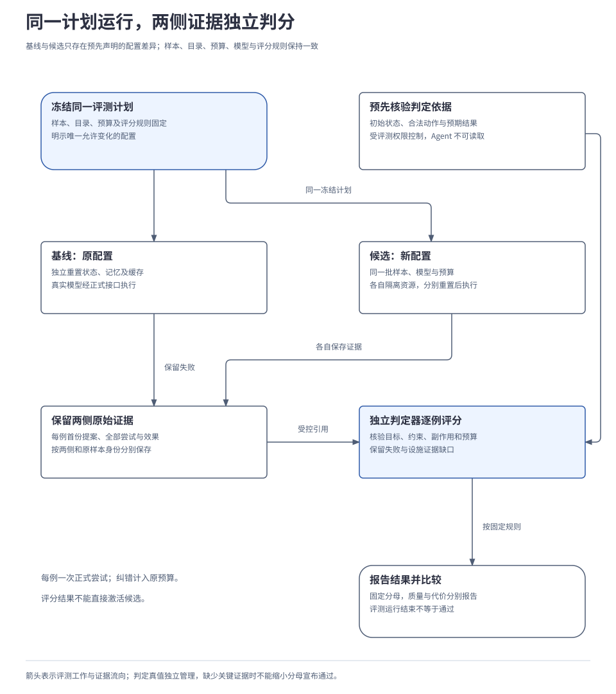
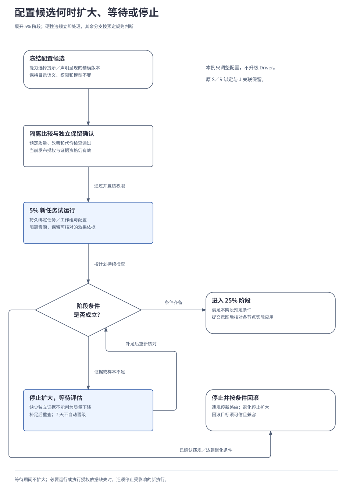

# 4.4 评测、比较与发布

<a id="16-观测评测与持续改进"></a>

评测把运行结果转化为有范围的质量结论，比较过程判断候选是否带来改善，发布过程再检查启用条件。组件职责已由[观测、评测与改进](../02-subsystems/09-observation-and-improvement.md)说明。本章从可观察运行证据出发，展开独立评分、配对比较与受控启用；最终任务成功和首次选择正确分别记录。

## 本章要解决的问题

这条改进链需要依次证明：问题发生在哪里，候选是否在同条件下改善，以及当前是否有资格启用。运行成功、评分通过和发布生效分别由所属模块记录。

<a id="components"></a>
### 谁保存事实，谁评分，谁改变运行配置

| 职责 | 依据与结果 | 权限边界 |
| --- | --- | --- |
| 原业务模块与 Observation | 业务模块保存事实，观测模块形成可追溯诊断视图。 | 观测不能改写业务成功，缺记录须说明覆盖。 |
| Evaluation 与 Evaluator | 前者固定计划并安排隔离任务，后者按真值和规则评分。 | 被测 Agent 看不到隐藏判定材料，评分器不能发布。 |
| 候选生成 | 根据诊断提出精确版本和预期改善。 | 不能改评分规则、保留答案或自己的权限。 |
| 发布管理与扩展管理 | 核对资格，持久推进阶段并查询各节点实际应用。 | 评测通过不自动产生激活权限，旧工作不重绑版本。 |

隔离样本、独立判定和阶段观察增加运行与留存成本，用于把“流程跑完”与“效果有改善”分别取证。下面先从一次错误提案建立证据，再解释计分、比较和启用。

以下局部例子采用同一用户的有状态模拟手机与电脑，使用真实模型驱动大脑。权限允许读取 E1《会议记录》、E2《需求说明》，生成 D《项目进展摘要》，在电脑指定目录保存、读回并向手机交付位置与来源。例子与数值用于解释已确认的评测及发布规则，尚无模型评测、统计仿真或上线效果证据。

<a id="1-从错误提案读懂一次任务"></a>

## 1. 从运行事实识别问题与计分边界

从 D 已生成、S／R 尚未准入开始。本例已取得两项保存能力的完整声明，却没有编辑器会话，也没有证据表明 D 已成为编辑器的当前文档。大脑先选择了“保存编辑器中的当前文档”，内核因前置条件不足拒绝；在原预算内纠正后，才接纳指定目录保存 S 和依赖它的读回 R。

| 过程 | 应保留的依据 | 能得出什么结论 |
| --- | --- | --- |
| 首份保存提案被拒绝 | 首份提案、所见能力版本、上下文引用及准入拒绝原因。 | 该步骤第一次选择不正确；纠正后不能删除这条记录。 |
| 错误动作未发出 | 准入与派发记录，加上模拟设备独立动作历史。 | 本教学分支没有发生错误副作用；不能仅凭日志里没看到调用来推断。 |
| 纠正后保存、读回 | 原 S／J 关联、保存事实、R 的实际文件内容和核验结果。 | 保存内容及来源关系满足要求，且全部工作仍在计划预算内。 |
| 手机取得结果 | 正式交付内容及手机呈现反馈。 | 本例完成交付；不等于用户已经阅读，也不抹去前面的选择错误。 |

D 仍应说明“资料导入已验收，摘要导出仍在联调、尚未验收”，并关联 E1／E2。本例同时记录三项事实：首次提案错误，错误动作被阻止，纠正后整项任务成功。完整摘要 T 是多步任务，其保存步骤的首次错误单独记录，不能直接把这一项当作单步主指标的一个任务样本。

本例两项声明均已进入上下文，诊断才有依据指向能力选择及前提使用。如果正确能力根本未进入候选，应先检查召回和覆盖；参数不足、版本失效、原作业仍在运行也各有处理路径。归因依据是可观察输入、提案和事实，无须采集模型内部思维链。运行事实、正式评测证据与诊断投影分别保存，覆盖及补投规则见[评测细则 A](../../reference/evaluation-details.md#records)。对应机制见[2.3 规划、决策与模型调用](../02-subsystems/03-planning-and-decision.md#3-从大目录中选到真正适用的能力)。

## 2. 一轮评测如何产生可信结果

为了单独检查保存能力选择，另建单步用例：“把给定 D 保存到模拟电脑的指定路径”。它有自己的任务和操作身份；D、目标设备及路径在初始输入中已具备，编辑器会话仍不存在。评测侧的判定器直接核对获准的模拟状态和动作历史，这项检查不作为被测任务新增的读回操作 R。这样可以独立计量单步选择，原摘要 T 的保存和读回流程仍按多步任务计量。

评测前冻结不可变计划：样本及预期结果、完整目录、模型／Brain／Skill 和配置、运行器、初始环境、故障脚本、评分器、预算及基线。比较时明确唯一允许变化的对象；每个样本的基线与候选分别重置业务状态、记忆和缓存，并使用独立测试身份与资源。

下图把两侧运行和独立评分分开。被测 Agent 只能通过正式获准接口取得观察；评分真值与隐藏答案由评测侧管理，不送入其上下文。

[](../../diagrams/16-evaluation-flow.html)

评测模块 Evaluation 先持久保存计划、授权、预算与样本工作，再经既有交接提交隔离任务。真实模型和动作仍走内核及执行契约；每例只有一次正式尝试，任务内的有界纠错属于这次尝试，不能多跑几次再选最好结果。评分器 Evaluator 按固定规则返回通过、失败或不可评估，不能直接发布候选或修改任务状态。

运行的 `COMPLETED` 只说明本轮已经收尾，报告中的 `gate_result` 才表达 `PASS`、`FAIL` 或 `INCOMPLETE`。完成了评测流程，仍可能得到失败或证据不完整的结论；已确认失败项和证据缺口都必须保留。

| 情况 | 判定依据 | 报告要求 |
| --- | --- | --- |
| 被测实现未形成合法提案、耗尽预算或无法确认效果 | 依原计划，该任务未成功。 | 保留失败及分母，未知效果仍需核对，不能改称设施缺证据。 |
| 评分器故障或测试设施丢失必要证据 | 独立判定者无法完成预定核验。 | 记录设施原因与不完整范围，不删掉这些样本后宣布通过。 |
| 全部样本已判定且满足适用门槛 | 原计划的质量、控制、预算和证据要求均成立。 | 才能报告该计划通过；未覆盖的能力和环境不随之通过。 |

评测与发布模块分别持久提交自己的状态、回执和后续工作，不建立跨模块大事务。提交或激活回执丢失时查原操作；取消先保存意图，再停止新样本并收束在途任务。重启不能因少了一张回执就复制执行，迟到结果与外部效果仍沿原身份处理。

证据接收、评分和报告可以幂等重做；换评分器生成新的判读版本，保留原结果。历史重放默认只重建投影或重新评分，不重新发送真实写操作。完整方法见[评测接口](../../reference/02-api-and-message-catalog.md#evaluation-service)与[发布接口](../../reference/02-api-and-message-catalog.md#evolution-service)，持久化和通知条件见[评测细则](../../reference/evaluation-details.md#persistence)。

## 3. 质量、时间和成本怎样计分

“首次调用正确率”的主计分点是**单步任务的第一次业务行动提案**，包括 API、版本、资源和必要参数。前述单步保存用例若先提错、被拒绝，再纠正完成，就记首次错误、任务成功；如果错误动作已经造成违反约束的副作用，后续修正不能把整个任务改记为成功。

| 测试分组 | 计分单位与门槛 | 不能混入什么 |
| --- | --- | --- |
| 单步可执行 | 各 API 等权计算首次正确率，至少 90%；同批样本有界纠错后的任务成功率至少 95%。 | 目录遗漏、无提案、首次参数错误均计错；修复不能重置首次结果。 |
| 多步可执行 | 每个完整任务计一次成功，至少 95%；另报长度、能力族和步骤首次正确。 | 一次成功不能按所涉 API 复制成多个任务；不能用单步得分抵消失败。 |
| 正确不执行 | 预期澄清、等待或拒绝至少 95%；禁止变更为硬失败。 | 不进入可执行任务成功率分母。 |
| 故障与契约 | 每个必需断言通过，可选能力按声明单列。 | 平均成功率不能抵消越权、重复写入或状态破坏。 |

正式目录至少包含 1001 项独立业务 API；每次检索面对完整目录，不按答案预筛。首版单步每 API 20 例，先算各 API 比例再等权平均，这是宏平均；全部成功数除以总样本数是微平均，另作诊断。配额相等时两者数值相同，漏测项目不能静默移除，总体达标也不代表逐 API 都达标。

数据按意图来源／状态族划分开发、验证与保留用途；同族改写不跨用途拆分。正式样本构成、多步覆盖、预算与并发见[附录 05 的 API 质量配置](../../reference/05-validation-profiles-and-traceability.md#api)，沿用既定评测基准。这些数量是覆盖要求，不保证模型达标或统计区间精度。

计量覆盖整条被测路径：规划、提取、重排、子 Agent、失败生成及 SDK 重试都计模型用量，评分器费用另报。真实业务读取仍是执行操作；目录查询、效果核对及同操作传输补发按各自额度记录。预算耗尽后的必要收尾可以继续使用独立有限管理额度，但不得回填成预算内成功。

时间从样本获准开始处理，到最后效果证据被接纳，包含等待、恢复和退避；此前排队另报，冷热启动条件预先固定。原始用量、估算与实际账单分开；无法核实的费用或用量标为缺失，不填零，也不宣称精确硬限已经验证。

每个成功任务的成本按“全部尝试总费用 ÷ 成功任务数”计算。假设 10 个任务共花 100 个成本单位，其中 8 个成功，则每成功任务成本为 12.5 单位；失败任务的消耗仍在分子里。这只是演算，无成功任务时该比值无定义。报告同时保留失败费用、首次正确率、多步成功率、延迟和错误副作用，不能只挑便宜的成功案例。

## 4. 怎样判断候选带来改善

针对保存能力选错的问题，本例只生成一个版本化配置候选：调整能力选择提示或声明呈现方式，使前置条件更容易被使用。完整声明仍忠于目录事实，不改变 API 语义、权限过滤、模型、预算或评分标准，也不把正确 API 名称写死到通用提示中。候选记录问题证据、精确产物版本、预期改善、作用范围、所需权限与回滚版本。

开发样本用于修改候选，验证样本用于筛选；首版每轮至多比较 5 个候选，冻结其中 1 个后，再用未参与筛选的独立保留材料确认。分开这些用途是为了检查候选能否在未用于修改它的材料上改善，代价是保留材料不能反复用于选择。

开篇已经用于诊断和修改的保存例可以成为回归用例，但不能继续充当未见证据。保留结果一旦参与选择或修改，后续确认须换新来源族；公开的仓库夹具同样不再是隐藏测试。

基线与候选绑定同一冻结计划，计划中明确上述唯一允许的配置差异。评分器、预算、目录或环境发生未受控变化时，不能直接比较。相同输入也不保证模型重跑确定，报告仍记录可取得的服务版本、运行时间与随机参数。

下面只演算单步首次正确率。假设选取 5 项 API，每项 20 例；基线和候选运行相同的 100 个样本，逐样本配对结果如下：

| 同一个样本 | 候选首次正确 | 候选首次错误 |
| --- | --- | --- |
| 基线首次正确 | 84：两侧都正确。 | 6：仅基线正确，候选出现退步。 |
| 基线首次错误 | 8：仅候选正确，候选修复了问题。 | 2：两侧都错误。 |

基线为 90%，候选为 92%，净差是 `(8 − 6) ÷ 100 = 2 个百分点`。每 API 配额相同，本例宏平均与微平均相等；仅看修复的 8 例会漏掉退步的 6 例。这是教学数字，既未覆盖千级目录，也未给出任务成功、约束检查或统计改善证据。

正式比较按 API 分层、按意图／状态族保留两侧配对，计算差值区间，不能把同族改写当作独立证据。方法须经统计仿真与边界验证；不适用时标为 `INFERENCE_UNAVAILABLE`，只报固定集得分，不自动进入发布。重采样、种子与区间配置见[评测细则 B](../../reference/evaluation-details.md#statistics)。

首版自动质量优化预先指定“单步首次正确率”为唯一主改善指标，同时满足以下条件：

| 发布资格检查 | 需要什么证据 |
| --- | --- |
| 绝对质量与约束通过 | 全部适用契约、权限、数据及质量门槛通过；一次可证明的越权、受限披露或重复写入即可阻止发布。 |
| 主指标存在改善 | 配对差值的 95% 区间下界大于 0；方法未验证或推断不适用时，不自动宣布改善或进入发布。 |
| 任务成功得到保护 | 单步、多步任务成功率的点估计分别不低于同计划基线；这不等于已经证明统计非劣。 |
| 代价在预定范围内 | 平均 token 用量与端到端 p95 延迟分别不超过基线的 110%，并满足硬预算；基线为零或缺失时使用预先固定的绝对限额。 |

90%／95% 的能力门槛仍按固定集点估计验收，不额外要求其置信下界也达到门槛；改善区间回答的是另一个问题。若优化成本或延迟，应另行冻结主指标与保护条件，不能看完结果再换目标。验证 H2 的选择成本假设时，还要在同等质量和预算下对照有竞争力的检索／工具路由方案，不能靠削弱对照得出收益。统计依据与适用限制见[比较研究](../../../research/harness-evaluation-statistics-and-comparison.md)，H2 的验证问题见[架构主张验证](06-architecture-comparison.md)。

## 5. 哪些能力必须单独判分

统一运行器可以复用计划、预算、隔离和报告机制，各项能力仍需要自己的真值与判定器。API 选择达标，不会自动证明联网回答可靠、手机操作正确或偏好使用合适。

| 能力 | 独立判定看什么 | 必须保留的边界 |
| --- | --- | --- |
| 千级 API 选择与执行 | 首次提案、有限纠错后的完整目标、全部副作用及逐 API 覆盖。 | 真实模型质量与脚本大脑的契约验证分别记录。 |
| 联网问答 V1 | 答案完整性、事实支持与引用覆盖分别判定，包含资料不足、冲突和获取失败。 | 实际联网与固定资料重放分组；遗漏必要事实不能提高覆盖率，模型评分仅作辅助，独立复核给出最终判定。 |
| 手机 GUI V2 | 观察、动作、效果及取消／接管，覆盖可执行任务和正确不执行的边界任务。 | 结构树和图像各自的可执行组、边界组分别达到 95%；五类边界逐项报告，必需控制断言全部通过。图像组不能暗中取得树或目标坐标，模拟通过不能宣称真实系统支持。 |
| 个性化 | 同一任务有无获准偏好时的可观察差异，以及过期、删除、冲突、不适用和禁止披露。 | 配对两侧各自重置状态与记忆，整对计一次结果；端侧限制及隐私必需断言独立检查。 |
| 恢复与互操作 | 原操作恢复、控制收束、状态与用量对账，以及真实协议边界和独立对端。 | 故障脚本通过、模拟 Driver 通过与真实接入通过分别出具证据。 |

判定所需的模拟设备状态、历史或预期事实可以比被测 Agent 所见更完整，但须由独立评测权限读取，不能偷偷作为模型输入。例如单步保存例的判定器能核对文件及动作历史，Agent 仍只能通过正式工具执行。联网问答的必要事实在评分前独立核验，不能以 Agent 自己列出的要点作为完整性标准。

候选只要影响某项专项能力，就要纳入相应回归；不能因为改动名为“提示配置”而跳过授权、GUI 或个性化检查。各专项的完整样本、门槛与预算见[附录 05](../../reference/05-validation-profiles-and-traceability.md#specialized)，其中 GUI 按两种观察模式分别判定，每种模式的 50 例边界组至少正确处理 48 例，五类明细不另加逐子类门槛。

## 6. 候选怎样逐步启用

离线比较与独立保留确认通过后，候选才可能具备发布资格；实际启用还要检查当前授权、证据有效性、产物信任与兼容性。本例更新能力选择配置，不升级 Driver。试运行按符合条件的**新任务或关联工作组**分配，分配与版本绑定持久保存，同一任务不能中途切换两侧配置。

| 阶段 | 候选范围与观察要求 | 进入后续阶段的条件 |
| --- | --- | --- |
| 小范围试运行 | 符合条件的新任务中分配 5%；候选至少 200 个可核对任务。 | 观察至少 24 小时，覆盖预定任务组，且全部适用阶段检查通过。 |
| 扩大试运行 | 候选比例升至 25%；本阶段至少 1000 个可核对候选任务。 | 同样至少观察 24 小时，再次检查质量、控制、代价、证据和节点状态。 |
| 全面激活 | 在已批准范围内达到 100%；继续监测至少 24 小时及 1000 个可核对任务。 | 完整窗口通过才支持该范围的稳定性判断；违规或退化仍进入停止与回滚流程。 |

各阶段参考上限为 7 天。数量和时间足够仍不代表通过：适用的单步首次正确率、单步及多步任务成功率分别达到 90%／95%，必需控制检查全过，代价不越计划限额，关键证据与节点实际版本可核对，才能继续。没有客观标签时等待独立复核，不能把任务自报完成当真值。

下图假设离线确认及当前发布授权已通过，展开从 5% 到 25% 的一次阶段检查。试运行中的保存任务仍有执行记录，但评测设施读取模拟文件状态与动作历史的通道中断，无法完成独立核验。因此，本分支因评测证据不完整而停止扩大，不能仅凭设施通道中断判定任务失败或质量退化。

若被测任务自身未完成规定的效果确认，则仍按任务失败计分。设施缺少核验依据与被测任务未满足要求分别记录，原样本分母保持不变。

[](../../diagrams/16-release-decision.html)

| 检查遇到的情况 | 应采取的动作 |
| --- | --- |
| 样本／时长不足、设施缺少独立效果证据 | 停止扩大；补足后重查全部条件。第 7 天仍不足则转待评估，不因超时自动晋级，也不把缺证据说成质量退化。 |
| 目标节点应用状态未知 | 沿原激活操作查询并保留待核对记录；不能只凭发布意图已提交就宣布启用成功。 |
| 必要运行或执行授权依据缺失 | 停止受影响的新执行；恢复可判断的条件后再处置，不能仅维持当前比例继续运行。 |
| 已确认禁止动作／披露、重复写入或状态破坏 | 立即停止新路由，按原执行契约核对与收束在途工作，并按当前条件停用或回滚。 |
| 完整阶段检查未达质量或代价门槛 | 停止扩大并请求回滚；全面激活后的完整监测窗口不达标同样触发停止与回滚。回滚目标不可信或不兼容时保持隔离，等待处置。 |

已确认的硬性违规优先处理，即使同时存在证据缺口。下面只展示推进顺序，函数名为伪代码：

```text
推进阶段(候选, 原请求操作):
  当前 = 读取候选的发布记录()
  if 已确认硬性违规:
    return 持久停止新路由并请求有条件回滚()
  if 必要运行或执行授权依据缺失:
    return 持久停止受影响的新执行()
  if 已满足计划中的退化处置条件:
    return 持久停止扩大并请求有条件回滚()
  if 样本、时长、独立证据或节点状态不足:
    return 持久等待评估()
  原子提交(
    原阶段未变, 当前发布授权与证据资格,
    下一阶段意图, 原请求回执, 激活 Outbox)
```

提交后由持久工作沿稳定操作身份调用 ExtensionManager／对应模块；回执丢失先查原操作，记录各节点真正应用的版本。候选产物校验值、基线、权限或证据发生变化时重新判断资格，不能沿用旧通过结论。

候选与对照涉及的可变业务资源须隔离或排他，影子运行只在模拟环境执行或生成提案，不能把真实保存做两遍。已经准入的 S／R 保留原能力版本、输入及执行绑定，J 仍沿原关联核对；回滚配置不撤销已发生的写入，也不恢复旧数据库快照。原工作是否继续仍受当前授权与控制约束。

并行用户任务输入不同，阶段均值用于运行保护，不能当作同样本配对试验的因果证明。初期用多模拟节点、真实配置差异和受控任务验证切换、退出与回滚；可以用标明的模拟时钟检查 24 小时／7 天边界，但这不构成真实生产周期或生产稳定性证据。

## 7. 谁能批准改进，证据怎样留存

生成候选、评分和激活分别需要相应权限。候选 Agent 不能修改评分器、发布门槛、保留答案或自己的授权；已有工具执行许可也不自动包含发布管理权限。

| 改进对象 | 生效入口与权限 |
| --- | --- |
| 常规记忆更新 | 按 Memory 的来源、用途和生命周期处理，不强制等待发布评测。 |
| Skill、执行策略、Agent 配置 | 经适用评测、当前发布授权和阶段控制启用；精确产物版本与影响范围可追溯。 |
| 插件、内核或打包的可执行代码 | 激活前还需维护者确认精确产物；候选不能自行放宽这一条件。 |

记录默认保存状态、错误类别、版本、耗时、用量和必要引用。参数、正文、截图与模型输入输出单独受控，不写入原始凭证或密钥，也不收集模型内部思维链。运行内容、派生样本、特征、评分理由和候选产物均继承来源的驻留、处理、披露及删除限制；允许在端侧评分时，仅返回明确获准的汇总或引用，统计数量也不能默认视为匿名。

诊断与正式评测证据分别设保留期；私有正文默认不复制，获准副本服从来源的更短期限。精确保留天数见[评测细则 C](../../reference/evaluation-details.md#retention)，这些期限不能清理任务恢复、去重与授权消费仍需要的权威记录。

来源纠正、删除或用途收紧后，关联样本与派生内容停止使用，按规则删除或失效。报告标明“证据已删除／不可复核”，仅保留获准的最小历史；关键证据不再支持新发布，等待中的推进重新复核。已激活候选是否撤回，取决于内容依赖、当前授权和风险，不能自动恢复被删除正文；已经发生的动作与历史发布事实仍保持真实。

本篇沿用[观测与改进职责](../../../archive/architecture-v1/10-observation-evaluation-and-evolution.md)及[评测与发布契约](../../../archive/architecture-v1/10-evaluation-contracts-and-release-gates.md)。文中的目标达标、可比较改善、生产稳定与跨场景泛化分别需要证据；图、演算和伪代码仅解释设计，尚未执行相应运行验收。

---

[上一章：4.3 故障恢复与运行保障](03-reliability-and-recovery.md) · [正文目录](../README.md) · [下一章：4.5 实施路线与能力验收](05-roadmap-and-validation.md)
